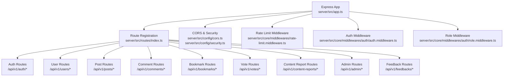
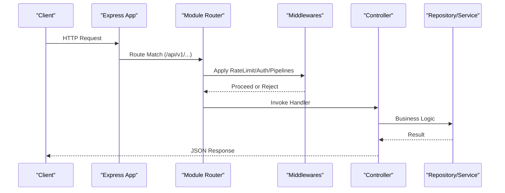
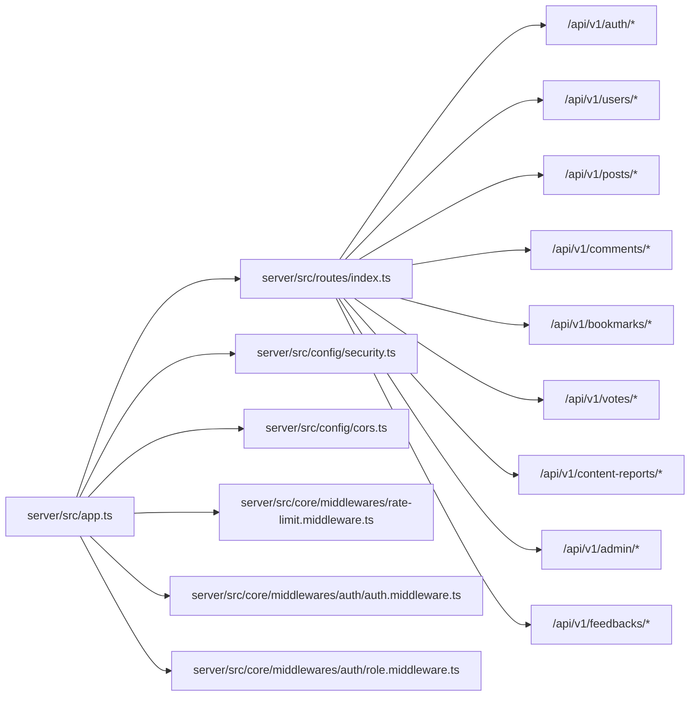

# API Documentation

<cite>
**Referenced Files in This Document**
- [server/src/app.ts](file://server/src/app.ts)
- [server/src/routes/index.ts](file://server/src/routes/index.ts)
- [server/src/config/cors.ts](file://server/src/config/cors.ts)
- [server/src/config/security.ts](file://server/src/config/security.ts)
- [server/src/core/middlewares/rate-limit.middleware.ts](file://server/src/core/middlewares/rate-limit.middleware.ts)
- [server/src/core/middlewares/auth/auth.middleware.ts](file://server/src/core/middlewares/auth/auth.middleware.ts)
- [server/src/core/middlewares/auth/role.middleware.ts](file://server/src/core/middlewares/auth/role.middleware.ts)
- [server/src/modules/auth/auth.route.ts](file://server/src/modules/auth/auth.route.ts)
- [server/src/modules/auth/auth.controller.ts](file://server/src/modules/auth/auth.controller.ts)
- [server/src/modules/post/post.route.ts](file://server/src/modules/post/post.route.ts)
- [server/src/modules/post/post.controller.ts](file://server/src/modules/post/post.controller.ts)
- [server/src/modules/user/user.route.ts](file://server/src/modules/user/user.route.ts)
- [server/src/modules/user/user.controller.ts](file://server/src/modules/user/user.controller.ts)
- [server/src/modules/comment/comment.route.ts](file://server/src/modules/comment/comment.route.ts)
- [server/src/modules/comment/comment.controller.ts](file://server/src/modules/comment/comment.controller.ts)
- [server/src/modules/bookmark/bookmark.route.ts](file://server/src/modules/bookmark/bookmark.route.ts)
- [server/src/modules/bookmark/bookmark.controller.ts](file://server/src/modules/bookmark/bookmark.controller.ts)
- [server/src/modules/vote/vote.route.ts](file://server/src/modules/vote/vote.route.ts)
- [server/src/modules/vote/vote.controller.ts](file://server/src/modules/vote/vote.controller.ts)
- [server/src/modules/content-report/content-report.routes.ts](file://server/src/modules/content-report/content-report.routes.ts)
- [server/src/modules/content-report/content-report.controller.ts](file://server/src/modules/content-report/content-report.controller.ts)
- [server/src/modules/notification/notification.routes.ts](file://server/src/modules/notification/notification.routes.ts)
- [server/src/modules/notification/notification.controller.ts](file://server/src/modules/notification/notification.controller.ts)
- [server/src/modules/admin/admin.route.ts](file://server/src/modules/admin/admin.route.ts)
- [server/src/modules/admin/admin.controller.ts](file://server/src/modules/admin/admin.controller.ts)
- [server/src/modules/feedback/feedback.route.ts](file://server/src/modules/feedback/feedback.route.ts)
- [server/src/modules/feedback/feedback.controller.ts](file://server/src/modules/feedback/feedback.controller.ts)
</cite>

## Table of Contents
1. [Introduction](#introduction)
2. [Project Structure](#project-structure)
3. [Core Components](#core-components)
4. [Architecture Overview](#architecture-overview)
5. [Detailed Component Analysis](#detailed-component-analysis)
6. [Dependency Analysis](#dependency-analysis)
7. [Performance Considerations](#performance-considerations)
8. [Troubleshooting Guide](#troubleshooting-guide)
9. [Conclusion](#conclusion)
10. [Appendices](#appendices)

## Introduction
This document provides comprehensive API documentation for the Flick server’s REST endpoints. It covers HTTP methods, URL patterns, request/response schemas, authentication requirements, parameters, validation rules, error responses, rate limiting, CORS configuration, security headers, and operational policies. It also includes practical curl examples, SDK integration guidance, and client implementation patterns. API versioning follows a v1 prefix, with explicit backward compatibility notes for legacy moderation endpoints.

## Project Structure
The server exposes REST endpoints under the /api/v1 base path. Each domain module registers its own sub-routes via a central registration function. Security middleware applies CORS, rate limiting, and request logging globally. Authentication is enforced per-route using middleware pipelines.

**Diagram sources**
- [server/src/app.ts](file://server/src/app.ts#L1-L33)
- [server/src/routes/index.ts](file://server/src/routes/index.ts#L17-L32)
- [server/src/config/cors.ts](file://server/src/config/cors.ts#L4-L10)
- [server/src/config/security.ts](file://server/src/config/security.ts)

**Section sources**
- [server/src/app.ts](file://server/src/app.ts#L1-L33)
- [server/src/routes/index.ts](file://server/src/routes/index.ts#L17-L32)

## Core Components
- Base URL: /api/v1
- Versioning: v1
- Authentication: Bearer tokens via Authorization header; session cookies for OAuth callbacks; admin role required for admin endpoints.
- Rate Limiting: Applied per route group; enforcement occurs before handlers.
- CORS: Configured with allowed origins, credentials, methods, and headers.
- Security Headers: Applied globally via security configuration.

**Section sources**
- [server/src/routes/index.ts](file://server/src/routes/index.ts#L17-L32)
- [server/src/config/cors.ts](file://server/src/config/cors.ts#L4-L10)
- [server/src/config/security.ts](file://server/src/config/security.ts)
- [server/src/core/middlewares/rate-limit.middleware.ts](file://server/src/core/middlewares/rate-limit.middleware.ts)

## Architecture Overview
The API architecture is modular with domain-specific routers mounted under /api/v1. Each router enforces rate limits and optional/required user context. Controllers handle request logic and return structured responses. Middlewares enforce authentication and role checks.

**Diagram sources**
- [server/src/app.ts](file://server/src/app.ts#L10-L30)
- [server/src/routes/index.ts](file://server/src/routes/index.ts#L17-L32)
- [server/src/core/middlewares/rate-limit.middleware.ts](file://server/src/core/middlewares/rate-limit.middleware.ts)
- [server/src/core/middlewares/auth/auth.middleware.ts](file://server/src/core/middlewares/auth/auth.middleware.ts)
- [server/src/core/middlewares/auth/role.middleware.ts](file://server/src/core/middlewares/auth/role.middleware.ts)

## Detailed Component Analysis

### Authentication Endpoints
- Base Path: /api/v1/auth
- Versioning: v1
- Authentication: Public endpoints are rate-limited; protected endpoints require Bearer token.

Endpoints
- POST /login
  - Purpose: Authenticate user and issue tokens.
  - Auth: None
  - Rate Limit: Yes
  - Request Body: Depends on controller implementation.
  - Responses: 200 OK (tokens), 400/401/429/500.
  - Example curl:
    - curl -X POST https://example.com/api/v1/auth/login -H "Content-Type: application/json"

- POST /refresh
  - Purpose: Refresh access token using refresh token.
  - Auth: None
  - Rate Limit: Yes
  - Responses: 200/400/401/429/500.

- POST /otp/send
  - Purpose: Send OTP to user.
  - Auth: None
  - Rate Limit: Yes
  - Responses: 200/400/429/500.

- POST /otp/verify
  - Purpose: Verify OTP.
  - Auth: None
  - Rate Limit: Yes
  - Responses: 200/400/422/429/500.

- POST /registration/verify-otp
  - Purpose: Verify OTP during registration.
  - Auth: None
  - Rate Limit: Yes
  - Responses: 200/400/422/429/500.

- POST /registration/initialize
  - Purpose: Initialize user registration.
  - Auth: None
  - Rate Limit: Yes
  - Responses: 200/400/422/429/500.

- POST /registration/finalize
  - Purpose: Finalize user registration.
  - Auth: None
  - Rate Limit: Yes
  - Responses: 200/400/422/429/500.

- GET /google/callback
  - Purpose: OAuth callback handler.
  - Auth: None
  - Rate Limit: Yes
  - Responses: 200/302/400/429/500.

- POST /password/forgot
  - Purpose: Initiate password reset.
  - Auth: None
  - Rate Limit: Yes
  - Responses: 200/400/429/500.

- POST /password/reset
  - Purpose: Reset password using token.
  - Auth: None
  - Rate Limit: Yes
  - Responses: 200/400/422/429/500.

- POST /logout
  - Purpose: Logout current session.
  - Auth: Bearer
  - Rate Limit: Yes
  - Responses: 200/400/401/404/500.

- POST /logout-all
  - Purpose: Logout from all devices.
  - Auth: Bearer
  - Rate Limit: Yes
  - Responses: 200/400/401/500.

- DELETE /account
  - Purpose: Delete account.
  - Auth: Bearer
  - Rate Limit: Yes
  - Responses: 200/400/401/404/500.

- GET /admins
  - Purpose: List admins.
  - Auth: Bearer + Admin Role
  - Rate Limit: Yes
  - Responses: 200/401/403/500.

- GET /users
  - Purpose: List users (admin).
  - Auth: Bearer + Admin Role
  - Rate Limit: Yes
  - Responses: 200/401/403/500.

Validation and Error Responses
- Validation errors return 400/422 with field-level details where applicable.
- Rate limit exceeded returns 429.
- Authentication failures return 401; insufficient permissions return 403.
- Not found returns 404; general server errors return 500.

**Section sources**
- [server/src/modules/auth/auth.route.ts](file://server/src/modules/auth/auth.route.ts#L1-L29)
- [server/src/modules/auth/auth.controller.ts](file://server/src/modules/auth/auth.controller.ts)

### User Management APIs
- Base Path: /api/v1/users
- Versioning: v1
- Authentication: Requires authenticated user context.

Endpoints
- GET /id/:userId
  - Purpose: Fetch user profile by ID.
  - Auth: Bearer
  - Rate Limit: Yes
  - Responses: 200/401/404/500.

- GET /search/:query
  - Purpose: Search users by query.
  - Auth: Bearer
  - Rate Limit: Yes
  - Responses: 200/401/500.

- GET /me
  - Purpose: Fetch current user profile.
  - Auth: Bearer
  - Rate Limit: Yes
  - Responses: 200/401/404/500.

- POST /accept-terms
  - Purpose: Accept terms for current user.
  - Auth: Bearer
  - Rate Limit: Yes
  - Responses: 200/400/401/500.

Validation and Error Responses
- Validation errors return 400/422.
- Rate limit exceeded returns 429.
- Authentication failures return 401.

**Section sources**
- [server/src/modules/user/user.route.ts](file://server/src/modules/user/user.route.ts#L1-L21)
- [server/src/modules/user/user.controller.ts](file://server/src/modules/user/user.controller.ts)

### Post CRUD Operations
- Base Path: /api/v1/posts
- Versioning: v1
- Authentication: Public read endpoints; write requires authenticated user context.

Endpoints
- GET /
  - Purpose: List posts.
  - Auth: Optional user context
  - Rate Limit: Yes
  - Responses: 200/500.

- GET /:id
  - Purpose: Get post by ID.
  - Auth: Optional user context
  - Rate Limit: Yes
  - Responses: 200/404/500.

- POST /:id/view
  - Purpose: Increment post view count.
  - Auth: Optional user context
  - Rate Limit: Yes
  - Responses: 200/404/500.

- GET /college/:collegeId
  - Purpose: Get posts by college.
  - Auth: Optional user context
  - Rate Limit: Yes
  - Responses: 200/404/500.

- GET /branch/:branch
  - Purpose: Get posts by branch.
  - Auth: Optional user context
  - Rate Limit: Yes
  - Responses: 200/404/500.

- POST /
  - Purpose: Create a new post.
  - Auth: Bearer + Authenticated User
  - Rate Limit: Yes
  - Responses: 201/400/401/403/422/500.

- PATCH /:id
  - Purpose: Update post.
  - Auth: Bearer + Authenticated User
  - Rate Limit: Yes
  - Responses: 200/400/401/403/404/422/500.

- DELETE /:id
  - Purpose: Delete post.
  - Auth: Bearer + Authenticated User
  - Rate Limit: Yes
  - Responses: 200/400/401/403/404/500.

Validation and Error Responses
- Validation errors return 400/422.
- Rate limit exceeded returns 429.
- Authentication failures return 401; insufficient permissions return 403.

**Section sources**
- [server/src/modules/post/post.route.ts](file://server/src/modules/post/post.route.ts#L1-L23)
- [server/src/modules/post/post.controller.ts](file://server/src/modules/post/post.controller.ts)

### Comment Management
- Base Path: /api/v1/comments
- Versioning: v1
- Authentication: Public read endpoints; write requires authenticated user context.

Endpoints
- GET /:commentId
  - Purpose: Get comment by ID.
  - Auth: Optional user context
  - Rate Limit: Yes
  - Responses: 200/404/500.

- GET /post/:postId
  - Purpose: Get comments for a post.
  - Auth: Optional user context
  - Rate Limit: Yes
  - Responses: 200/404/500.

- POST /post/:postId
  - Purpose: Create a comment.
  - Auth: Bearer + Authenticated User
  - Rate Limit: Yes
  - Responses: 201/400/401/403/422/500.

- PATCH /:commentId
  - Purpose: Update comment.
  - Auth: Bearer + Authenticated User
  - Rate Limit: Yes
  - Responses: 200/400/401/403/404/422/500.

- DELETE /:commentId
  - Purpose: Delete comment.
  - Auth: Bearer + Authenticated User
  - Rate Limit: Yes
  - Responses: 200/400/401/403/404/500.

Validation and Error Responses
- Validation errors return 400/422.
- Rate limit exceeded returns 429.
- Authentication failures return 401; insufficient permissions return 403.

**Section sources**
- [server/src/modules/comment/comment.route.ts](file://server/src/modules/comment/comment.route.ts#L1-L20)
- [server/src/modules/comment/comment.controller.ts](file://server/src/modules/comment/comment.controller.ts)

### Voting System
- Base Path: /api/v1/votes
- Versioning: v1
- Authentication: Requires authenticated user context.

Endpoints
- POST /
  - Purpose: Create or update a vote.
  - Auth: Bearer + Authenticated User
  - Rate Limit: Yes
  - Responses: 200/400/401/422/500.

- PATCH /
  - Purpose: Modify vote.
  - Auth: Bearer + Authenticated User
  - Rate Limit: Yes
  - Responses: 200/400/401/422/500.

- DELETE /
  - Purpose: Remove vote.
  - Auth: Bearer + Authenticated User
  - Rate Limit: Yes
  - Responses: 200/400/401/500.

Validation and Error Responses
- Validation errors return 400/422.
- Rate limit exceeded returns 429.
- Authentication failures return 401.

**Section sources**
- [server/src/modules/vote/vote.route.ts](file://server/src/modules/vote/vote.route.ts#L1-L18)
- [server/src/modules/vote/vote.controller.ts](file://server/src/modules/vote/vote.controller.ts)

### Bookmark Operations
- Base Path: /api/v1/bookmarks
- Versioning: v1
- Authentication: Requires authenticated user context.

Endpoints
- GET /:postId
  - Purpose: Check if a post is bookmarked by the user.
  - Auth: Bearer + Authenticated User
  - Rate Limit: Yes
  - Responses: 200/401/404/500.

- GET /user
  - Purpose: List user’s bookmarked posts.
  - Auth: Bearer + Authenticated User
  - Rate Limit: Yes
  - Responses: 200/401/500.

- POST /
  - Purpose: Create a bookmark.
  - Auth: Bearer + Authenticated User
  - Rate Limit: Yes
  - Responses: 201/400/401/422/500.

- DELETE /delete/:postId
  - Purpose: Delete a bookmark.
  - Auth: Bearer + Authenticated User
  - Rate Limit: Yes
  - Responses: 200/400/401/404/500.

Validation and Error Responses
- Validation errors return 400/422.
- Rate limit exceeded returns 429.
- Authentication failures return 401.

**Section sources**
- [server/src/modules/bookmark/bookmark.route.ts](file://server/src/modules/bookmark/bookmark.route.ts#L1-L19)
- [server/src/modules/bookmark/bookmark.controller.ts](file://server/src/modules/bookmark/bookmark.controller.ts)

### Notifications
- Base Path: /api/v1/notifications
- Versioning: v1
- Authentication: Requires authenticated user context.

Endpoints
- GET /list
  - Purpose: List notifications for the user.
  - Auth: Bearer + Authenticated User
  - Rate Limit: Yes
  - Responses: 200/401/500.

- PATCH /mark-seen
  - Purpose: Mark notifications as seen.
  - Auth: Bearer + Authenticated User
  - Rate Limit: Yes
  - Responses: 200/400/401/500.

Validation and Error Responses
- Validation errors return 400/422.
- Rate limit exceeded returns 429.
- Authentication failures return 401.

**Section sources**
- [server/src/modules/notification/notification.routes.ts](file://server/src/modules/notification/notification.routes.ts#L1-L12)
- [server/src/modules/notification/notification.controller.ts](file://server/src/modules/notification/notification.controller.ts)

### Content Moderation API (Reporting and Review)
- Base Path: /api/v1/content-reports
- Versioning: v1
- Authentication: Requires authenticated user context.

Report Management
- POST /
  - Purpose: Create a report.
  - Auth: Bearer + Authenticated User
  - Rate Limit: Yes
  - Responses: 201/400/401/422/500.

- GET /
  - Purpose: List reports.
  - Auth: Bearer + Authenticated User
  - Rate Limit: Yes
  - Responses: 200/401/500.

- GET /:id
  - Purpose: Get report by ID.
  - Auth: Bearer + Authenticated User
  - Rate Limit: Yes
  - Responses: 200/404/500.

- GET /user/:userId
  - Purpose: Get reports filed by a user.
  - Auth: Bearer + Authenticated User
  - Rate Limit: Yes
  - Responses: 200/404/500.

- PATCH /:id/status
  - Purpose: Update report status.
  - Auth: Bearer + Authenticated User
  - Rate Limit: Yes
  - Responses: 200/400/401/404/422/500.

- DELETE /:id
  - Purpose: Delete a report.
  - Auth: Bearer + Authenticated User
  - Rate Limit: Yes
  - Responses: 200/400/401/404/500.

- POST /bulk-delete
  - Purpose: Bulk delete reports.
  - Auth: Bearer + Authenticated User
  - Rate Limit: Yes
  - Responses: 200/400/401/500.

Content Moderation
- PATCH /content/:targetId/moderate
  - Purpose: Moderate content (generic).
  - Auth: Bearer + Authenticated User
  - Rate Limit: Yes
  - Responses: 200/400/401/404/422/500.

Legacy Content Moderation (Backward Compatibility)
- PATCH /post/:targetId/ban
- PATCH /post/:targetId/unban
- PATCH /post/:targetId/shadow-ban
- PATCH /post/:targetId/shadow-unban
- PATCH /comment/:targetId/ban
- PATCH /comment/:targetId/unban
  - Purpose: Legacy moderation actions mapped to generic moderate endpoint.
  - Auth: Bearer + Authenticated User
  - Rate Limit: Yes
  - Responses: 200/400/401/404/422/500.

User Management
- PATCH /user/:userId/block
- PATCH /user/:userId/unblock
- PATCH /user/:userId/suspend
- GET /user/:userId/suspension
- GET /users/search
  - Purpose: Manage users (block/unblock, suspend, query).
  - Auth: Bearer + Authenticated User
  - Rate Limit: Yes
  - Responses: 200/400/401/404/422/500.

Validation and Error Responses
- Validation errors return 400/422.
- Rate limit exceeded returns 429.
- Authentication failures return 401.

**Section sources**
- [server/src/modules/content-report/content-report.routes.ts](file://server/src/modules/content-report/content-report.routes.ts#L1-L37)
- [server/src/modules/content-report/content-report.controller.ts](file://server/src/modules/content-report/content-report.controller.ts)

### Admin APIs
- Base Path: /api/v1/admin
- Versioning: v1
- Authentication: Requires authenticated user context + admin role.

Endpoints
- GET /dashboard/overview
  - Purpose: Admin dashboard overview.
  - Auth: Bearer + Admin
  - Rate Limit: Yes
  - Responses: 200/401/403/500.

- GET /manage/users/query
  - Purpose: Query users.
  - Auth: Bearer + Admin
  - Rate Limit: Yes
  - Responses: 200/401/403/500.

- GET /manage/reports
  - Purpose: View reports.
  - Auth: Bearer + Admin
  - Rate Limit: Yes
  - Responses: 200/401/403/500.

- GET /colleges/get/all
  - Purpose: List colleges.
  - Auth: Bearer + Admin
  - Rate Limit: Yes
  - Responses: 200/401/403/500.

- POST /colleges/create
  - Purpose: Create college.
  - Auth: Bearer + Admin
  - Rate Limit: Yes
  - Responses: 201/400/401/403/422/500.

- PATCH /colleges/update/:id
  - Purpose: Update college.
  - Auth: Bearer + Admin
  - Rate Limit: Yes
  - Responses: 200/400/401/403/404/422/500.

- GET /manage/logs
  - Purpose: View logs.
  - Auth: Bearer + Admin
  - Rate Limit: Yes
  - Responses: 200/401/403/500.

- GET /manage/feedback/all
  - Purpose: View all feedback.
  - Auth: Bearer + Admin
  - Rate Limit: Yes
  - Responses: 200/401/403/500.

Validation and Error Responses
- Validation errors return 400/422.
- Rate limit exceeded returns 429.
- Authentication failures return 401; insufficient permissions return 403.

**Section sources**
- [server/src/modules/admin/admin.route.ts](file://server/src/modules/admin/admin.route.ts#L1-L21)
- [server/src/modules/admin/admin.controller.ts](file://server/src/modules/admin/admin.controller.ts)

### Feedback APIs
- Base Path: /api/v1/feedbacks
- Versioning: v1
- Authentication: Public creation; admin-only for listing, updating, deleting.

Endpoints
- POST /
  - Purpose: Submit feedback (authenticated).
  - Auth: Bearer
  - Rate Limit: Yes
  - Responses: 201/400/401/422/500.

- GET /
  - Purpose: List feedbacks (admin).
  - Auth: Bearer + Admin
  - Rate Limit: Yes
  - Responses: 200/401/403/500.

- GET /:id
  - Purpose: Get feedback by ID (admin).
  - Auth: Bearer + Admin
  - Rate Limit: Yes
  - Responses: 200/404/500.

- PATCH /:id/status
  - Purpose: Update feedback status (admin).
  - Auth: Bearer + Admin
  - Rate Limit: Yes
  - Responses: 200/400/401/403/404/422/500.

- DELETE /:id
  - Purpose: Delete feedback (admin).
  - Auth: Bearer + Admin
  - Rate Limit: Yes
  - Responses: 200/400/401/403/404/500.

Validation and Error Responses
- Validation errors return 400/422.
- Rate limit exceeded returns 429.
- Authentication failures return 401; insufficient permissions return 403.

**Section sources**
- [server/src/modules/feedback/feedback.route.ts](file://server/src/modules/feedback/feedback.route.ts#L1-L25)
- [server/src/modules/feedback/feedback.controller.ts](file://server/src/modules/feedback/feedback.controller.ts)

## Dependency Analysis
Key runtime dependencies and their roles:
- Express app initializes server, sockets, cookie parser, request logging, security, and routes.
- Route registration mounts domain routers under /api/v1.
- Middlewares:
  - Rate limit middleware applied per route group.
  - Authentication middleware validates Bearer tokens.
  - Role middleware restricts endpoints to admin/superadmin.
- Controllers depend on repositories/services for business logic.

**Diagram sources**
- [server/src/app.ts](file://server/src/app.ts#L1-L33)
- [server/src/routes/index.ts](file://server/src/routes/index.ts#L17-L32)
- [server/src/config/security.ts](file://server/src/config/security.ts)
- [server/src/config/cors.ts](file://server/src/config/cors.ts#L4-L10)
- [server/src/core/middlewares/rate-limit.middleware.ts](file://server/src/core/middlewares/rate-limit.middleware.ts)
- [server/src/core/middlewares/auth/auth.middleware.ts](file://server/src/core/middlewares/auth/auth.middleware.ts)
- [server/src/core/middlewares/auth/role.middleware.ts](file://server/src/core/middlewares/auth/role.middleware.ts)

**Section sources**
- [server/src/app.ts](file://server/src/app.ts#L1-L33)
- [server/src/routes/index.ts](file://server/src/routes/index.ts#L17-L32)

## Performance Considerations
- Payload Limits: JSON and URL-encoded bodies are limited to 16 KB.
- Rate Limiting: Enforced per route group; tune thresholds per endpoint as needed.
- Optional User Context: Some endpoints accept optional user context; consider caching strategies for anonymous reads.
- Logging: Request logging middleware enabled globally; monitor logs for performance insights.

**Section sources**
- [server/src/app.ts](file://server/src/app.ts#L15-L16)
- [server/src/core/middlewares/rate-limit.middleware.ts](file://server/src/core/middlewares/rate-limit.middleware.ts)

## Troubleshooting Guide
Common Issues and Resolutions
- 401 Unauthorized
  - Cause: Missing or invalid Bearer token.
  - Resolution: Re-authenticate and retry with a fresh token.

- 403 Forbidden
  - Cause: Insufficient role (admin required).
  - Resolution: Ensure user has admin/superadmin role.

- 404 Not Found
  - Cause: Resource does not exist.
  - Resolution: Verify IDs and paths.

- 429 Too Many Requests
  - Cause: Rate limit exceeded.
  - Resolution: Back off and retry after the specified window.

- 400/422 Validation Errors
  - Cause: Malformed request body or invalid fields.
  - Resolution: Validate payload against endpoint schemas.

- CORS Errors
  - Cause: Origin not permitted or credentials mismatch.
  - Resolution: Configure allowed origins and ensure credentials are enabled.

**Section sources**
- [server/src/config/cors.ts](file://server/src/config/cors.ts#L4-L10)
- [server/src/core/middlewares/rate-limit.middleware.ts](file://server/src/core/middlewares/rate-limit.middleware.ts)
- [server/src/core/middlewares/auth/auth.middleware.ts](file://server/src/core/middlewares/auth/auth.middleware.ts)
- [server/src/core/middlewares/auth/role.middleware.ts](file://server/src/core/middlewares/auth/role.middleware.ts)

## Conclusion
The Flick server exposes a well-structured REST API under /api/v1 with clear separation of concerns across modules. Authentication and authorization are enforced consistently, with robust rate limiting and CORS configuration. The moderation endpoints support modern and legacy workflows, ensuring backward compatibility. Clients should adhere to the documented schemas, handle error responses, and implement retry/backoff for rate-limited requests.

## Appendices

### Authentication and Authorization
- Bearer Token: Include Authorization: Bearer <token> header for protected endpoints.
- Cookies: Used for OAuth callbacks; ensure SameSite/Lax/Strict policy aligns with deployment.
- Roles: Admin-only endpoints require admin or superadmin role.

**Section sources**
- [server/src/core/middlewares/auth/auth.middleware.ts](file://server/src/core/middlewares/auth/auth.middleware.ts)
- [server/src/core/middlewares/auth/role.middleware.ts](file://server/src/core/middlewares/auth/role.middleware.ts)

### Rate Limiting Policies
- Applied per route group; exact thresholds are configured in the rate limit middleware.
- Exceeding limits returns 429; clients should implement exponential backoff.

**Section sources**
- [server/src/core/middlewares/rate-limit.middleware.ts](file://server/src/core/middlewares/rate-limit.middleware.ts)

### CORS Configuration
- Allowed Origins: Controlled by environment variable.
- Credentials: Enabled.
- Methods: GET, POST, PUT, PATCH, DELETE, OPTIONS.
- Headers: Content-Type, Authorization.

**Section sources**
- [server/src/config/cors.ts](file://server/src/config/cors.ts#L4-L10)

### Security Headers
- Applied globally via security configuration; consult security.ts for specific headers set.

**Section sources**
- [server/src/config/security.ts](file://server/src/config/security.ts)

### API Versioning and Backward Compatibility
- Versioning: /api/v1 base path.
- Backward Compatibility: Legacy moderation endpoints remain available and map to the generic moderate endpoint.

**Section sources**
- [server/src/routes/index.ts](file://server/src/routes/index.ts#L17-L32)
- [server/src/modules/content-report/content-report.routes.ts](file://server/src/modules/content-report/content-report.routes.ts#L21-L28)

### curl Examples
- Login
  - curl -X POST https://example.com/api/v1/auth/login -H "Content-Type: application/json" -d "{...}"
- Create Post
  - curl -X POST https://example.com/api/v1/posts -H "Authorization: Bearer <token>" -H "Content-Type: application/json" -d "{...}"
- Get Comments for Post
  - curl -X GET https://example.com/api/v1/comments/post/<postId> -H "Authorization: Bearer <token>"
- Moderate Content
  - curl -X PATCH https://example.com/api/v1/content-reports/content/<targetId>/moderate -H "Authorization: Bearer <token>" -H "Content-Type: application/json" -d "{...}"

### SDK Integration Guide
- Use Axios/Fetch to call endpoints under /api/v1.
- Persist Bearer tokens securely; refresh tokens via /api/v1/auth/refresh.
- Implement retry with exponential backoff for 429 responses.
- Respect rate limits; batch operations where possible.

### Client Implementation Patterns
- Centralized HTTP Client: Wrap fetch/axios with interceptors for auth headers and error handling.
- Request Logging: Enable request/response logging in development; disable in production.
- Error Boundaries: Handle 4xx/5xx gracefully; show user-friendly messages.
- Caching: Cache public reads (posts, comments) with appropriate TTL.