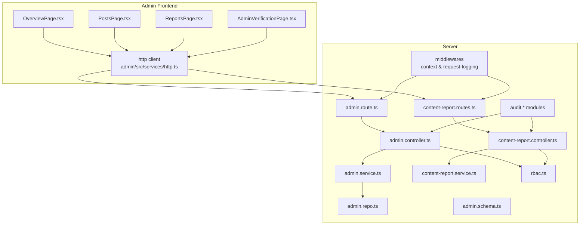
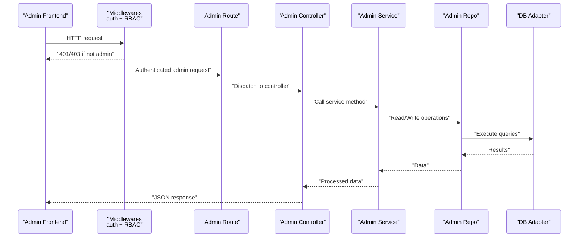
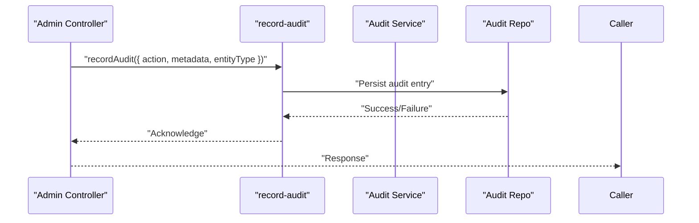
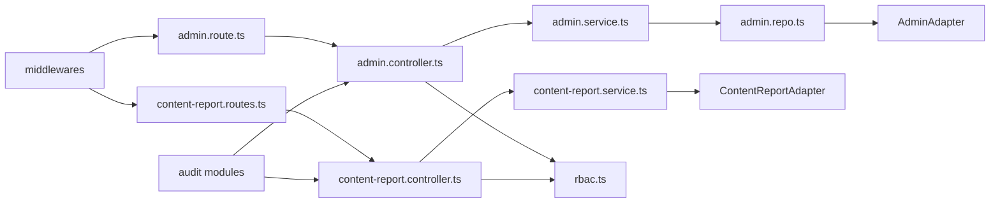

# Admin API

<cite>
**Referenced Files in This Document**
- [admin.route.ts](file://server/src/modules/admin/admin.route.ts)
- [admin.controller.ts](file://server/src/modules/admin/admin.controller.ts)
- [admin.service.ts](file://server/src/modules/admin/admin.service.ts)
- [admin.schema.ts](file://server/src/modules/admin/admin.schema.ts)
- [admin.repo.ts](file://server/src/modules/admin/admin.repo.ts)
- [content-report.routes.ts](file://server/src/modules/content-report/content-report.routes.ts)
- [content-report.controller.ts](file://server/src/modules/content-report/content-report.controller.ts)
- [content-report.service.ts](file://server/src/modules/content-report/content-report.service.ts)
- [user.controller.ts](file://server/src/modules/user/user.controller.ts)
- [user.service.ts](file://server/src/modules/user/user.service.ts)
- [auth.controller.ts](file://server/src/modules/auth/auth.controller.ts)
- [auth.service.ts](file://server/src/modules/auth/auth.service.ts)
- [auth.schema.ts](file://server/src/modules/auth/auth.schema.ts)
- [rbac.ts](file://server/src/core/security/rbac.ts)
- [context.middleware.ts](file://server/src/core/middlewares/context.middleware.ts)
- [request-logging.middleware.ts](file://server/src/core/middlewares/request-logging.middleware.ts)
- [record-audit.ts](file://server/src/lib/record-audit.ts)
- [audit.types.ts](file://server/src/modules/audit/audit.types.ts)
- [audit.service.ts](file://server/src/modules/audit/audit.service.ts)
- [audit.repo.ts](file://server/src/modules/audit/audit.repo.ts)
- [audit.controller.ts](file://server/src/modules/audit/audit.controller.ts)
- [audit.schema.ts](file://server/src/modules/audit/audit.schema.ts)
- [audit-context.ts](file://server/src/modules/audit/audit-context.ts)
- [roles.ts](file://server/src/config/roles.ts)
- [env.ts](file://server/src/config/env.ts)
- [http.ts](file://admin/src/services/http.ts)
- [AdminVerificationPage.tsx](file://admin/src/pages/AdminVerificationPage.tsx)
- [OverviewPage.tsx](file://admin/src/pages/OverviewPage.tsx)
- [PostsPage.tsx](file://admin/src/pages/PostsPage.tsx)
- [ReportsPage.tsx](file://admin/src/pages/ReportsPage.tsx)
</cite>

## Table of Contents
1. [Introduction](#introduction)
2. [Project Structure](#project-structure)
3. [Core Components](#core-components)
4. [Architecture Overview](#architecture-overview)
5. [Detailed Component Analysis](#detailed-component-analysis)
6. [Dependency Analysis](#dependency-analysis)
7. [Performance Considerations](#performance-considerations)
8. [Troubleshooting Guide](#troubleshooting-guide)
9. [Conclusion](#conclusion)
10. [Appendices](#appendices)

## Introduction
This document provides comprehensive API documentation for administrative endpoints powering the Admin Console. It covers:
- Admin user management and verification flows
- Content moderation dashboards and actions
- System analytics and overview metrics
- Platform administration features (colleges, logs, feedback)
- Request schemas, audit logging, and permission validation
- Admin authentication requirements, privilege escalation controls, and workflow automation
- Examples for user management operations, content moderation interfaces, and system monitoring

## Project Structure
The Admin API spans both the backend server and the admin frontend:
- Backend routes under server/src/modules/admin define admin-only endpoints
- Content moderation and user management are implemented in server/src/modules/content-report
- Audit logging is centralized via record-audit and audit modules
- Frontend admin pages consume these APIs and render dashboards

**Diagram sources**
- [admin.route.ts](file://server/src/modules/admin/admin.route.ts#L1-L21)
- [admin.controller.ts](file://server/src/modules/admin/admin.controller.ts#L1-L72)
- [admin.service.ts](file://server/src/modules/admin/admin.service.ts#L1-L94)
- [admin.repo.ts](file://server/src/modules/admin/admin.repo.ts#L1-L19)
- [admin.schema.ts](file://server/src/modules/admin/admin.schema.ts#L1-L52)
- [content-report.routes.ts](file://server/src/modules/content-report/content-report.routes.ts#L1-L37)
- [content-report.controller.ts](file://server/src/modules/content-report/content-report.controller.ts#L1-L246)
- [content-report.service.ts](file://server/src/modules/content-report/content-report.service.ts#L1-L159)
- [audit.service.ts](file://server/src/modules/audit/audit.service.ts)
- [rbac.ts](file://server/src/core/security/rbac.ts)
- [context.middleware.ts](file://server/src/core/middlewares/context.middleware.ts)
- [request-logging.middleware.ts](file://server/src/core/middlewares/request-logging.middleware.ts)
- [http.ts](file://admin/src/services/http.ts)
- [OverviewPage.tsx](file://admin/src/pages/OverviewPage.tsx#L1-L80)
- [PostsPage.tsx](file://admin/src/pages/PostsPage.tsx#L1-L76)
- [ReportsPage.tsx](file://admin/src/pages/ReportsPage.tsx#L1-L96)
- [AdminVerificationPage.tsx](file://admin/src/pages/AdminVerificationPage.tsx#L1-L174)

**Section sources**
- [admin.route.ts](file://server/src/modules/admin/admin.route.ts#L1-L21)
- [content-report.routes.ts](file://server/src/modules/content-report/content-report.routes.ts#L1-L37)
- [http.ts](file://admin/src/services/http.ts)

## Core Components
- Admin routes: Provide dashboard overview, user queries, reports listing, colleges CRUD, logs, and feedback retrieval
- Content moderation routes: Support report lifecycle, content moderation actions, legacy ban/unban endpoints, and user management (block/suspend)
- Audit logging: Centralized recording of admin actions and system events
- Authentication and RBAC: Middleware enforces admin-only access and rate limits

Key backend endpoints:
- GET /dashboard/overview
- GET /manage/users/query
- GET /manage/reports
- GET /colleges/get/all
- POST /colleges/create
- PATCH /colleges/update/:id
- GET /manage/logs
- GET /manage/feedback/all
- POST /reports (create report)
- GET /reports (list reports)
- GET /reports/:id (get report)
- GET /reports/user/:userId (user reports)
- PATCH /reports/:id/status (update status)
- DELETE /reports/:id (delete report)
- POST /reports/bulk-delete (bulk delete)
- PATCH /reports/content/:targetId/moderate (moderate content)
- Legacy: /post/:id/ban, /post/:id/unban, /post/:id/shadow-ban, /post/:id/shadow-unban, /comment/:id/ban, /comment/:id/unban
- PATCH /reports/user/:userId/block (block user)
- PATCH /reports/user/:userId/unblock (unblock user)
- PATCH /reports/user/:userId/suspend (suspend user)
- GET /reports/user/:userId/suspension (check suspension)
- GET /reports/users/search (search users)

**Section sources**
- [admin.route.ts](file://server/src/modules/admin/admin.route.ts#L1-L21)
- [content-report.routes.ts](file://server/src/modules/content-report/content-report.routes.ts#L1-L37)
- [admin.controller.ts](file://server/src/modules/admin/admin.controller.ts#L1-L72)
- [content-report.controller.ts](file://server/src/modules/content-report/content-report.controller.ts#L1-L246)

## Architecture Overview
Admin API follows a layered architecture:
- Routes define HTTP endpoints and apply middleware
- Controllers parse requests, validate schemas, and orchestrate services
- Services encapsulate business logic and coordinate repositories
- Repositories interact with database adapters
- Audit logging records administrative actions
- RBAC ensures only admins can access admin endpoints

**Diagram sources**
- [admin.route.ts](file://server/src/modules/admin/admin.route.ts#L1-L21)
- [admin.controller.ts](file://server/src/modules/admin/admin.controller.ts#L1-L72)
- [admin.service.ts](file://server/src/modules/admin/admin.service.ts#L1-L94)
- [admin.repo.ts](file://server/src/modules/admin/admin.repo.ts#L1-L19)

## Detailed Component Analysis

### Admin Dashboard and Analytics
Endpoints:
- GET /dashboard/overview
- GET /manage/logs
- GET /manage/feedback/all

Behavior:
- Overview returns aggregated counts for users, posts, and comments
- Logs endpoint supports pagination, sorting, and filtering
- Feedback retrieval exposes all feedback entries

Request/response characteristics:
- Rate-limited and admin-protected
- Responses include structured data payloads

Frontend usage:
- OverviewPage.tsx calls GET /dashboard/overview
- ReportsPage.tsx and PostsPage.tsx call GET /manage/reports with pagination and status filters

**Section sources**
- [admin.route.ts](file://server/src/modules/admin/admin.route.ts#L11-L18)
- [admin.controller.ts](file://server/src/modules/admin/admin.controller.ts#L8-L48)
- [admin.service.ts](file://server/src/modules/admin/admin.service.ts#L5-L48)
- [admin.schema.ts](file://server/src/modules/admin/admin.schema.ts#L22-L27)
- [OverviewPage.tsx](file://admin/src/pages/OverviewPage.tsx#L16-L29)
- [ReportsPage.tsx](file://admin/src/pages/ReportsPage.tsx#L29-L66)
- [PostsPage.tsx](file://admin/src/pages/PostsPage.tsx#L20-L37)

### Admin Colleges Management
Endpoints:
- GET /colleges/get/all
- POST /colleges/create
- PATCH /colleges/update/:id

Validation:
- Create and update schemas enforce minimum length and format requirements
- ID parsing validates UUID format

Caching invalidation:
- On create/update, caches for colleges are invalidated to keep frontend data fresh

**Section sources**
- [admin.route.ts](file://server/src/modules/admin/admin.route.ts#L14-L16)
- [admin.controller.ts](file://server/src/modules/admin/admin.controller.ts#L50-L68)
- [admin.service.ts](file://server/src/modules/admin/admin.service.ts#L51-L90)
- [admin.schema.ts](file://server/src/modules/admin/admin.schema.ts#L31-L51)

### Content Moderation and User Management
Endpoints:
- POST /reports (create report)
- GET /reports (list reports)
- GET /reports/:id (get report)
- GET /reports/user/:userId (user reports)
- PATCH /reports/:id/status (update status)
- DELETE /reports/:id (delete report)
- POST /reports/bulk-delete (bulk delete)
- PATCH /reports/content/:targetId/moderate (moderate content)
- Legacy: /post/:id/ban, /post/:id/unban, /post/:id/shadow-ban, /post/:id/shadow-unban, /comment/:id/ban, /comment/:id/unban
- PATCH /reports/user/:userId/block (block user)
- PATCH /reports/user/:userId/unblock (unblock user)
- PATCH /reports/user/:userId/suspend (suspend user)
- GET /reports/user/:userId/suspension (check suspension)
- GET /reports/users/search (search users)

Workflow:
- Reports are created by users and curated by admins
- Admins can update report status, delete reports, or bulk-delete
- Content moderation toggles ban/unban and shadow-ban states
- User management supports blocking, unblocking, suspending, and querying suspension status
- Search enables admin user lookup by email or username

Audit logging:
- All admin actions are recorded with entity type and metadata

**Section sources**
- [content-report.routes.ts](file://server/src/modules/content-report/content-report.routes.ts#L1-L37)
- [content-report.controller.ts](file://server/src/modules/content-report/content-report.controller.ts#L14-L244)
- [content-report.service.ts](file://server/src/modules/content-report/content-report.service.ts#L8-L159)

### Admin Authentication and Authorization
- All admin routes are protected by:
  - Authentication middleware
  - Rate limit middleware
  - Role-based access control requiring "admin" role
- Admin verification flow in the frontend uses two-factor OTP for secure sign-in

Frontend verification flow:
- AdminVerificationPage.tsx handles OTP generation, resend, and verification
- On success, session is refreshed and user profile is updated

Backend RBAC:
- requireRole middleware enforces admin privileges
- Roles configuration defines admin role

**Section sources**
- [admin.route.ts](file://server/src/modules/admin/admin.route.ts#L7-L9)
- [rbac.ts](file://server/src/core/security/rbac.ts)
- [roles.ts](file://server/src/config/roles.ts)
- [AdminVerificationPage.tsx](file://admin/src/pages/AdminVerificationPage.tsx#L48-L102)

### Audit Logging and Compliance
- record-audit centralizes audit entries for admin actions
- Audit types include admin:updated:report:status, admin:deleted:report, admin:bulk-deleted:reports, admin:banned:user, admin:unbanned:user, admin:suspended:user, admin:*content actions
- Audit service, repo, controller, and schema modules support querying and managing audit trails

**Diagram sources**
- [content-report.controller.ts](file://server/src/modules/content-report/content-report.controller.ts#L79-L146)
- [record-audit.ts](file://server/src/lib/record-audit.ts)
- [audit.service.ts](file://server/src/modules/audit/audit.service.ts)
- [audit.repo.ts](file://server/src/modules/audit/audit.repo.ts)
- [audit.types.ts](file://server/src/modules/audit/audit.types.ts)

**Section sources**
- [content-report.controller.ts](file://server/src/modules/content-report/content-report.controller.ts#L79-L146)
- [audit.controller.ts](file://server/src/modules/audit/audit.controller.ts)
- [audit.schema.ts](file://server/src/modules/audit/audit.schema.ts)

### Request Schemas and Validation
Admin and content moderation endpoints rely on Zod schemas for robust validation:
- Admin:
  - ManageUsersQuerySchema: optional username/email filters
  - GetReportsQuerySchema: page, limit, status array, optional fields
  - GetLogsQuerySchema: page, limit, sortBy, sortOrder
  - CreateCollegeSchema: name, emailDomain, city, state
  - UpdateCollegeSchema: optional fields with min-length constraints
  - CollegeIdSchema: UUID validation
- Content Reports:
  - CreateReportSchema: type, reason, message, targetId
  - GetReportsQuerySchema: type, limit, page, status
  - ReportParamsSchema: report id
  - UpdateReportStatusSchema: status
  - BulkDeleteReportsSchema: reportIds[]
  - ContentParamsSchema: targetId
  - UpdateContentStatusSchema: action, type
  - UserParamsSchema: userId
  - SuspendUserSchema: ends, reason
  - GetUsersQuerySchema: email, username

These schemas ensure consistent request validation and error responses.

**Section sources**
- [admin.schema.ts](file://server/src/modules/admin/admin.schema.ts#L3-L51)
- [content-report.controller.ts](file://server/src/modules/content-report/content-report.controller.ts#L16-L209)

### Frontend Dashboards and Automation
- OverviewPage.tsx fetches dashboard metrics
- PostsPage.tsx and ReportsPage.tsx implement paginated listing with status filters
- AdminVerificationPage.tsx automates OTP-based admin sign-in with resend and attempt limits

Automation examples:
- Automatic audit logging on moderation actions
- Cache invalidation on college create/update
- Pagination and filter propagation in frontend queries

**Section sources**
- [OverviewPage.tsx](file://admin/src/pages/OverviewPage.tsx#L16-L29)
- [PostsPage.tsx](file://admin/src/pages/PostsPage.tsx#L20-L41)
- [ReportsPage.tsx](file://admin/src/pages/ReportsPage.tsx#L29-L70)
- [AdminVerificationPage.tsx](file://admin/src/pages/AdminVerificationPage.tsx#L48-L102)

## Dependency Analysis

**Diagram sources**
- [admin.route.ts](file://server/src/modules/admin/admin.route.ts#L1-L21)
- [admin.controller.ts](file://server/src/modules/admin/admin.controller.ts#L1-L72)
- [admin.service.ts](file://server/src/modules/admin/admin.service.ts#L1-L94)
- [admin.repo.ts](file://server/src/modules/admin/admin.repo.ts#L1-L19)
- [content-report.routes.ts](file://server/src/modules/content-report/content-report.routes.ts#L1-L37)
- [content-report.controller.ts](file://server/src/modules/content-report/content-report.controller.ts#L1-L246)
- [content-report.service.ts](file://server/src/modules/content-report/content-report.service.ts#L1-L159)
- [rbac.ts](file://server/src/core/security/rbac.ts)
- [context.middleware.ts](file://server/src/core/middlewares/context.middleware.ts)

**Section sources**
- [admin.route.ts](file://server/src/modules/admin/admin.route.ts#L1-L21)
- [content-report.routes.ts](file://server/src/modules/content-report/content-report.routes.ts#L1-L37)
- [rbac.ts](file://server/src/core/security/rbac.ts)

## Performance Considerations
- Pagination and filtering reduce payload sizes for reports and logs
- Cache invalidation on college updates prevents stale data while minimizing redundant reads
- Rate limiting protects admin endpoints from abuse
- Structured logging and sampling help monitor performance and errors

[No sources needed since this section provides general guidance]

## Troubleshooting Guide
Common issues and resolutions:
- 401 Unauthorized: Ensure admin authentication and session validity
- 403 Forbidden: Verify admin role assignment and RBAC configuration
- 404 Not Found: Confirm resource IDs (report, user, college) and UUID format
- 400 Bad Request: Validate request schemas and query parameters against documented shapes
- Audit gaps: Confirm audit recording is invoked on admin actions and check audit service connectivity

**Section sources**
- [admin.controller.ts](file://server/src/modules/admin/admin.controller.ts#L63-L65)
- [content-report.controller.ts](file://server/src/modules/content-report/content-report.controller.ts#L104-L106)
- [audit.service.ts](file://server/src/modules/audit/audit.service.ts)

## Conclusion
The Admin API provides a secure, auditable, and scalable foundation for administrative tasks. It integrates user and content moderation, analytics, and platform configuration with strong validation, RBAC enforcement, and comprehensive audit logging. The frontend dashboards streamline day-to-day operations while leveraging backend schemas and middleware for reliability.

[No sources needed since this section summarizes without analyzing specific files]

## Appendices

### Endpoint Reference Summary
- Admin
  - GET /dashboard/overview
  - GET /manage/users/query
  - GET /manage/reports
  - GET /colleges/get/all
  - POST /colleges/create
  - PATCH /colleges/update/:id
  - GET /manage/logs
  - GET /manage/feedback/all
- Content Reports
  - POST /reports
  - GET /reports
  - GET /reports/:id
  - GET /reports/user/:userId
  - PATCH /reports/:id/status
  - DELETE /reports/:id
  - POST /reports/bulk-delete
  - PATCH /reports/content/:targetId/moderate
  - Legacy: /post/:id/ban, /post/:id/unban, /post/:id/shadow-ban, /post/:id/shadow-unban, /comment/:id/ban, /comment/:id/unban
- User Management
  - PATCH /reports/user/:userId/block
  - PATCH /reports/user/:userId/unblock
  - PATCH /reports/user/:userId/suspend
  - GET /reports/user/:userId/suspension
  - GET /reports/users/search

**Section sources**
- [admin.route.ts](file://server/src/modules/admin/admin.route.ts#L11-L18)
- [content-report.routes.ts](file://server/src/modules/content-report/content-report.routes.ts#L10-L34)