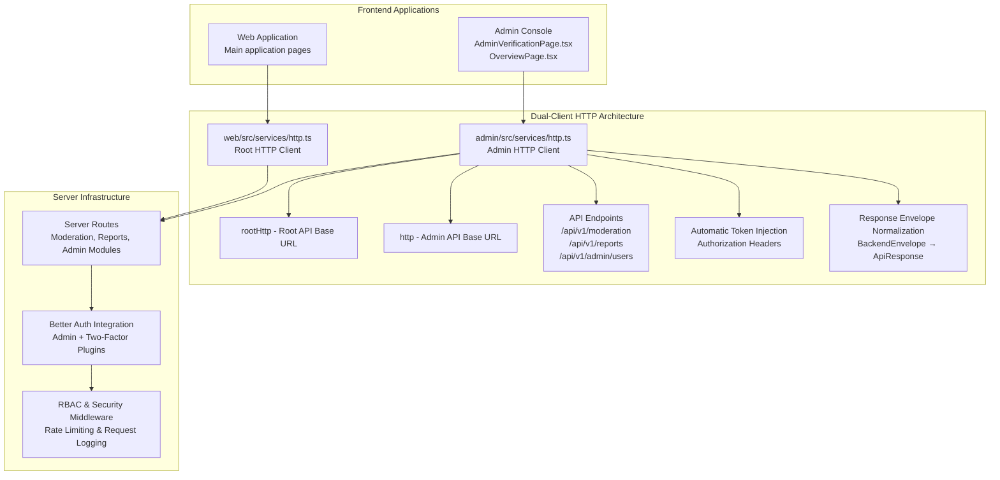
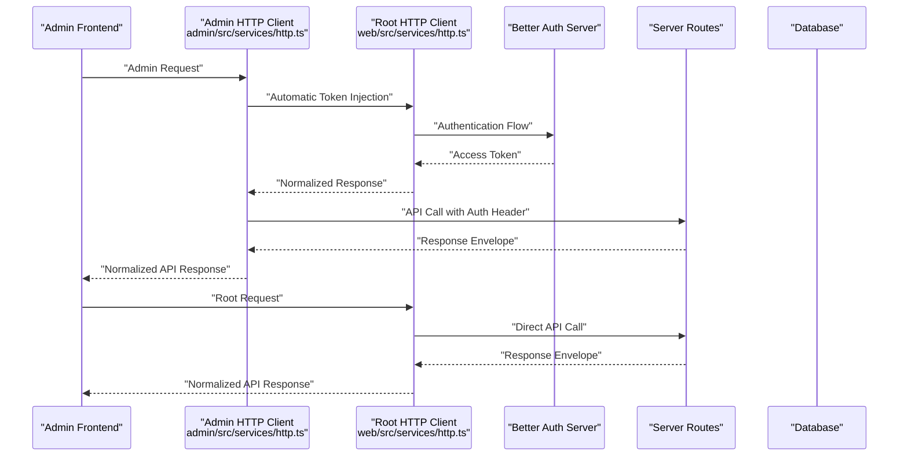
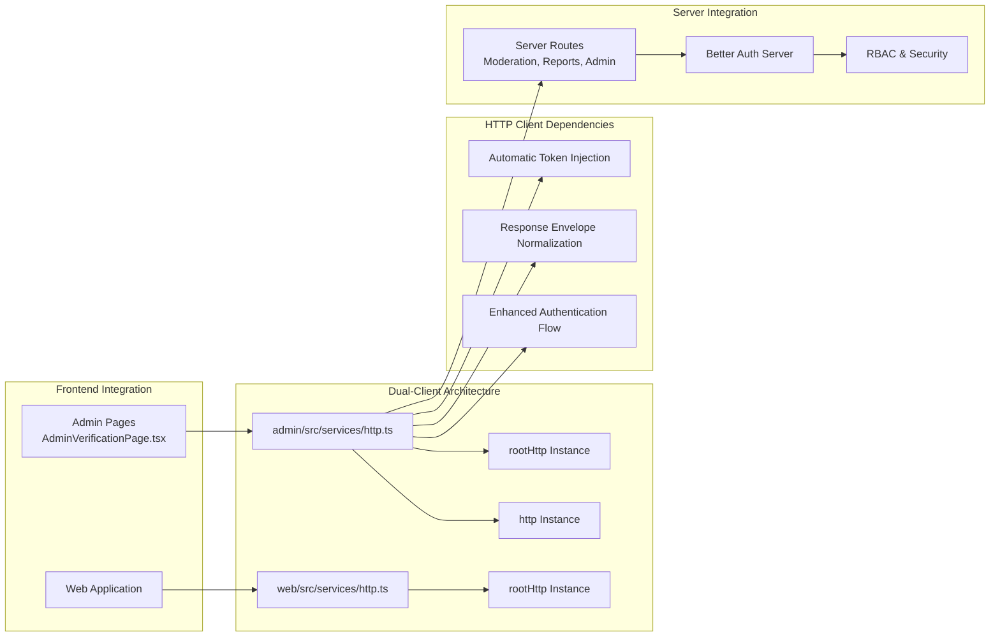

# Admin API

<cite>
**Referenced Files in This Document**
- [admin.route.ts](file://server/src/modules/admin/admin.route.ts)
- [admin.controller.ts](file://server/src/modules/admin/admin.controller.ts)
- [admin.service.ts](file://server/src/modules/admin/admin.service.ts)
- [admin.schema.ts](file://server/src/modules/admin/admin.schema.ts)
- [admin.repo.ts](file://server/src/modules/admin/admin.repo.ts)
- [content-moderation.route.ts](file://server/src/modules/moderation/content/content-moderation.route.ts)
- [content-moderation.controller.ts](file://server/src/modules/moderation/content/content-moderation.controller.ts)
- [content-moderation.service.ts](file://server/src/modules/moderation/content/content-moderation.service.ts)
- [reports-moderation.route.ts](file://server/src/modules/moderation/reports/reports-moderation.route.ts)
- [reports-moderation.controller.ts](file://server/src/modules/moderation/reports/reports-moderation.controller.ts)
- [user-moderation.route.ts](file://server/src/modules/moderation/user/user-moderation.route.ts)
- [user-moderation.controller.ts](file://server/src/modules/moderation/user/user-moderation.controller.ts)
- [user.controller.ts](file://server/src/modules/user/user.controller.ts)
- [user.service.ts](file://server/src/modules/user/user.service.ts)
- [auth.controller.ts](file://server/src/modules/auth/auth.controller.ts)
- [auth.service.ts](file://server/src/modules/auth/auth.service.ts)
- [auth.schema.ts](file://server/src/modules/auth/auth.schema.ts)
- [rbac.ts](file://server/src/core/security/rbac.ts)
- [context.middleware.ts](file://server/src/core/middlewares/context.middleware.ts)
- [request-logging.middleware.ts](file://server/src/core/middlewares/request-logging.middleware.ts)
- [record-audit.ts](file://server/src/lib/record-audit.ts)
- [audit.types.ts](file://server/src/modules/audit/audit.types.ts)
- [audit.service.ts](file://server/src/modules/audit/audit.service.ts)
- [audit.repo.ts](file://server/src/modules/audit/audit.repo.ts)
- [audit.controller.ts](file://server/src/modules/audit/audit.controller.ts)
- [audit.schema.ts](file://server/src/modules/audit/audit.schema.ts)
- [audit-context.ts](file://server/src/modules/audit/audit-context.ts)
- [roles.ts](file://server/src/config/roles.ts)
- [env.ts](file://server/src/config/env.ts)
- [index.ts](file://server/src/routes/index.ts)
- [http.ts](file://admin/src/services/http.ts)
- [http.ts](file://web/src/services/http.ts)
- [auth-client.ts](file://admin/src/lib/auth-client.ts)
- [auth-client.ts](file://web/src/lib/auth-client.ts)
- [AdminVerificationPage.tsx](file://admin/src/pages/AdminVerificationPage.tsx)
- [OverviewPage.tsx](file://admin/src/pages/OverviewPage.tsx)
- [PostsPage.tsx](file://admin/src/pages/PostsPage.tsx)
- [ReportsPage.tsx](file://admin/src/pages/ReportsPage.tsx)
- [response.ts](file://server/src/core/http/response.ts)
- [auth.ts](file://server/src/infra/auth/auth.ts)
- [api.ts](file://admin/src/types/api.ts)
- [api.ts](file://web/src/types/api.ts)
</cite>

## Update Summary
**Changes Made**
- Enhanced admin HTTP service with dual-client architecture supporting both admin and root API endpoints
- Implemented automatic token injection and response envelope normalization
- Improved authentication flow with better error handling and session management
- Updated frontend integration to support both admin and root HTTP clients
- Enhanced security model with dual-token architecture and improved rate limiting

## Table of Contents
1. [Introduction](#introduction)
2. [Project Structure](#project-structure)
3. [Core Components](#core-components)
4. [Architecture Overview](#architecture-overview)
5. [Detailed Component Analysis](#detailed-component-analysis)
6. [Dual-Client HTTP Architecture](#dual-client-http-architecture)
7. [Authentication and Security Enhancements](#authentication-and-security-enhancements)
8. [Response Envelope Normalization](#response-envelope-normalization)
9. [Dependency Analysis](#dependency-analysis)
10. [Performance Considerations](#performance-considerations)
11. [Troubleshooting Guide](#troubleshooting-guide)
12. [Conclusion](#conclusion)
13. [Appendices](#appendices)

## Introduction
This document provides comprehensive API documentation for administrative endpoints powering the Admin Console. The platform has migrated to a new modular moderation framework with dedicated endpoints for content moderation, user management, and administrative functions. Recent enhancements include a dual-client HTTP architecture supporting both admin and root API endpoints, automatic token injection, response envelope normalization, and improved authentication flow.

Key features include:
- Dual-client architecture with automatic token injection for admin and root endpoints
- Response envelope normalization for consistent API responses
- Enhanced admin HTTP service with improved authentication flow
- Modular moderation framework with state-based content moderation
- Comprehensive audit logging and compliance tracking
- Advanced rate limiting and request logging infrastructure

## Project Structure
The Admin API now follows a dual-client architecture with distinct HTTP clients for admin and root endpoints, providing enhanced security and flexibility:



**Diagram sources**
- [http.ts](file://admin/src/services/http.ts#L8-L19)
- [http.ts](file://web/src/services/http.ts#L5-L8)
- [auth.ts](file://server/src/infra/auth/auth.ts#L38-L42)

**Section sources**
- [http.ts](file://admin/src/services/http.ts#L1-L154)
- [http.ts](file://web/src/services/http.ts#L1-L133)
- [auth.ts](file://server/src/infra/auth/auth.ts#L1-L42)

## Core Components
The enhanced architecture provides three main administrative domains with dual-client support:

### Content Moderation Module (`/api/v1/moderation`)
- State-based moderation with active/banned states
- Post and comment moderation endpoints
- Best-effort moderation handling with error tolerance
- Integrated with dual-client architecture for admin/root separation

### Reports Management Module (`/api/v1/reports`)
- Comprehensive report lifecycle management
- User-generated report creation and admin processing
- Bulk deletion and filtering capabilities
- Enhanced error handling and response normalization

### User Administration Module (`/api/v1/admin/users`)
- User listing and search capabilities
- Moderation state management per user
- Suspension status checking
- Improved authentication flow for admin operations

### Legacy Admin Module (`/api/v1/admin`)
- Dashboard overview and analytics
- College management operations
- Logs and feedback retrieval
- Maintains backward compatibility with new architecture

**Section sources**
- [content-moderation.route.ts](file://server/src/modules/moderation/content/content-moderation.route.ts#L11-L12)
- [reports-moderation.route.ts](file://server/src/modules/moderation/reports/reports-moderation.route.ts#L15-L20)
- [user-moderation.route.ts](file://server/src/modules/moderation/user/user-moderation.route.ts#L11-L14)
- [admin.route.ts](file://server/src/modules/admin/admin.route.ts#L11-L18)

## Architecture Overview
The new architecture follows a modular pattern with clear separation of concerns and dual-client HTTP support:



**Diagram sources**
- [http.ts](file://admin/src/services/http.ts#L21-L32)
- [http.ts](file://admin/src/services/http.ts#L94-L150)
- [auth.ts](file://server/src/infra/auth/auth.ts#L8-L42)

## Detailed Component Analysis

### Enhanced HTTP Service Architecture
**Dual-Client Implementation**:
- Admin client (`http`) with admin-specific base URL
- Root client (`rootHttp`) with root/base URL for authentication
- Automatic token injection for both clients
- Response envelope normalization for consistent API responses

**Automatic Token Injection**:
- Extracts access token from authentication state
- Automatically adds Authorization header if not present
- Supports both Bearer token and custom token formats
- Handles token expiration and refresh seamlessly

**Response Envelope Normalization**:
- Converts backend envelope format to unified API response
- Standardizes success, message, errors, and meta fields
- Preserves original Axios response properties
- Provides consistent error handling across endpoints

**Section sources**
- [http.ts](file://admin/src/services/http.ts#L1-L154)
- [http.ts](file://web/src/services/http.ts#L1-L133)
- [api.ts](file://admin/src/types/api.ts#L1-L20)
- [api.ts](file://web/src/types/api.ts#L1-L20)

### Content Moderation and State Management
**Enhanced State-Based Moderation**:
- PUT `/api/v1/moderation/posts/:postId/moderation-state`
- PUT `/api/v1/moderation/comments/:commentId/moderation-state`
- Automatic token injection for admin requests
- Response envelope normalization for consistent responses

**Improved Controller Logic**:
- Active state: Unbans both regular and shadow bans
- Banned state: Removes shadow ban and applies regular ban
- Best-effort approach: Ignores certain "already X" errors
- Enhanced error handling with normalized responses

**Section sources**
- [content-moderation.route.ts](file://server/src/modules/moderation/content/content-moderation.route.ts#L11-L12)
- [content-moderation.controller.ts](file://server/src/modules/moderation/content/content-moderation.controller.ts#L31-L43)
- [content-moderation.service.ts](file://server/src/modules/moderation/content/content-moderation.service.ts#L182-L220)

### Reports Management and User Actions
**Enhanced Reports Module**:
- POST `/api/v1/reports` - Create user-generated reports
- GET `/api/v1/reports` - List reports with filtering
- GET `/api/v1/reports/users/:userId` - Get user's reports
- GET `/api/v1/reports/:id` - Get specific report
- PATCH `/api/v1/reports/:id` - Update report status
- DELETE `/api/v1/reports/:id` - Delete report
- POST `/api/v1/reports/bulk-deletion` - Bulk report deletion

**Improved User Administration**:
- GET `/api/v1/admin/users/` - List users for admin
- GET `/api/v1/admin/users/search` - Search users by query
- PUT `/api/v1/admin/users/:userId/moderation-state` - Set user moderation state
- GET `/api/v1/admin/users/:userId/suspension` - Check user suspension status

**Section sources**
- [reports-moderation.route.ts](file://server/src/modules/moderation/reports/reports-moderation.route.ts#L15-L20)
- [reports-moderation.controller.ts](file://server/src/modules/moderation/reports/reports-moderation.controller.ts#L8-L41)
- [user-moderation.route.ts](file://server/src/modules/moderation/user/user-moderation.route.ts#L11-L14)
- [user-moderation.controller.ts](file://server/src/modules/moderation/user/user-moderation.controller.ts#L28-L39)

### Legacy Admin Functions
**Enhanced Legacy Admin Endpoints**:
- GET `/api/v1/admin/dashboard/overview` - Dashboard analytics
- GET `/api/v1/admin/manage/users/query` - User query (deprecated)
- GET `/api/v1/admin/manage/reports` - Reports listing (deprecated)
- GET `/api/v1/admin/colleges/get/all` - Get all colleges
- POST `/api/v1/admin/colleges/create` - Create college
- PATCH `/api/v1/admin/colleges/update/:id` - Update college
- GET `/api/v1/admin/manage/logs` - System logs (deprecated)
- GET `/api/v1/admin/manage/feedback/all` - Feedback retrieval (deprecated)

**Note**: The `/manage/` prefix endpoints are maintained for backward compatibility but represent deprecated functionality in favor of the new modular structure.

**Section sources**
- [admin.route.ts](file://server/src/modules/admin/admin.route.ts#L11-L18)
- [admin.controller.ts](file://server/src/modules/admin/admin.controller.ts#L8-L40)

### Enhanced Security Model
**Improved Authentication Flow**:
- Better Auth integration with admin and two-factor plugins
- Dual-token architecture for admin and root endpoints
- Enhanced session management and privilege escalation
- Automatic token refresh with proper error handling

**Frontend Integration**:
- AdminVerificationPage.tsx handles secure OTP-based authentication
- Session management and role validation
- Automatic privilege escalation for superadmin users
- Enhanced error handling and user feedback

**Section sources**
- [auth.ts](file://server/src/infra/auth/auth.ts#L38-L42)
- [auth-client.ts](file://admin/src/lib/auth-client.ts#L1-L12)
- [auth-client.ts](file://web/src/lib/auth-client.ts#L1-L16)
- [AdminVerificationPage.tsx](file://admin/src/pages/AdminVerificationPage.tsx#L48-L102)

### Audit Logging and Compliance
**Comprehensive Audit Trail**:
- All moderation actions automatically logged
- User management operations tracked
- Report lifecycle events recorded
- State changes and bulk operations audited
- Compliance with administrative oversight requirements

**Audit Categories**:
- Content moderation actions (ban, unban, shadow ban)
- User moderation state changes
- Report creation, updates, and deletions
- Bulk operations and administrative actions

**Section sources**
- [record-audit.ts](file://server/src/lib/record-audit.ts)
- [audit.service.ts](file://server/src/modules/audit/audit.service.ts)
- [audit.types.ts](file://server/src/modules/audit/audit.types.ts)

## Dual-Client HTTP Architecture
The new dual-client architecture provides enhanced security and flexibility for different administrative scenarios:

### Admin HTTP Client (`admin/src/services/http.ts`)
- **Base URL**: Uses admin-specific API endpoint
- **Root Client**: Separate rootHttp instance for authentication
- **Token Injection**: Automatic Authorization header injection
- **Error Handling**: Enhanced 401 handling with token refresh
- **Normalization**: Response envelope conversion to unified format

### Root HTTP Client (`web/src/services/http.ts`)
- **Base URL**: Uses root/base API endpoint
- **Direct Access**: No admin-specific modifications
- **Standard Flow**: Direct authentication and API calls
- **Consistent Responses**: Same normalization as admin client

### Automatic Token Injection
Both clients implement automatic token injection:
- Extracts access token from authentication state
- Checks for existing Authorization header
- Adds Bearer token if not present
- Handles token expiration gracefully

### Response Envelope Normalization
Both clients normalize responses consistently:
- BackendEnvelope format conversion
- Unified ApiResponse structure
- Preserved Axios response properties
- Standardized error handling

**Section sources**
- [http.ts](file://admin/src/services/http.ts#L1-L154)
- [http.ts](file://web/src/services/http.ts#L1-L133)
- [api.ts](file://admin/src/types/api.ts#L1-L20)
- [api.ts](file://web/src/types/api.ts#L1-L20)

## Authentication and Security Enhancements
**Enhanced Better Auth Integration**:
- Admin plugin for privileged access control
- Two-factor authentication for enhanced security
- Social provider integration (Google OAuth)
- Cookie-based session management with JWE strategy

**Improved Token Management**:
- Dual-token architecture for admin/root separation
- Automatic token refresh with retry logic
- Queue-based request handling during refresh
- Enhanced error handling for authentication failures

**Advanced Security Features**:
- Role-based access control (RBAC)
- Rate limiting per endpoint category
- Request logging with structured formatting
- Audit trail for all administrative actions

**Section sources**
- [auth.ts](file://server/src/infra/auth/auth.ts#L1-L42)
- [http.ts](file://admin/src/services/http.ts#L94-L150)
- [http.ts](file://web/src/services/http.ts#L56-L109)
- [rbac.ts](file://server/src/core/security/rbac.ts)

## Response Envelope Normalization
The response envelope normalization ensures consistent API responses across all endpoints:

### Backend Envelope Structure
```typescript
type BackendEnvelope<T> = {
  success: boolean;
  message: string;
  errors: any;
  meta: any;
  data: T;
};
```

### Normalized API Response Structure
```typescript
type ApiResponse<T> = {
  success: boolean;
  message: string;
  errors: any;
  meta: any;
  data: T;
} & AxiosResponse;
```

### Normalization Process
1. **Extract Backend Envelope**: Read response data as BackendEnvelope
2. **Map Fields**: Transfer success, message, errors, meta, data
3. **Preserve Axios Properties**: Include status, statusText, headers, etc.
4. **Return Unified Response**: Provide consistent ApiResponse format

### Benefits
- **Consistency**: Uniform response format across all endpoints
- **Type Safety**: Strong typing for both success and error cases
- **Backward Compatibility**: Preserves original Axios response properties
- **Error Handling**: Standardized error extraction and processing

**Section sources**
- [api.ts](file://admin/src/types/api.ts#L1-L20)
- [api.ts](file://web/src/types/api.ts#L1-L20)
- [http.ts](file://admin/src/services/http.ts#L111-L131)
- [http.ts](file://web/src/services/http.ts#L111-L132)

## Dependency Analysis


**Diagram sources**
- [http.ts](file://admin/src/services/http.ts#L1-L154)
- [http.ts](file://web/src/services/http.ts#L1-L133)
- [auth.ts](file://server/src/infra/auth/auth.ts#L1-L42)

**Section sources**
- [http.ts](file://admin/src/services/http.ts#L1-L154)
- [http.ts](file://web/src/services/http.ts#L1-L133)
- [auth.ts](file://server/src/infra/auth/auth.ts#L1-L42)

## Performance Considerations
- **Dual-Client Architecture**: Reduced endpoint conflicts and improved request routing
- **Automatic Token Injection**: Eliminates redundant header setting across requests
- **Response Normalization**: Consistent response processing improves frontend performance
- **Enhanced Caching**: Improved caching strategies for user and report data
- **Rate Limiting**: More granular rate limiting per module with dual-client support
- **Audit Optimization**: Efficient audit logging with batch operations
- **Token Refresh**: Optimized refresh logic prevents unnecessary authentication calls

## Troubleshooting Guide
**Dual-Client Issues**:
- **Mixed Client Usage**: Ensure admin endpoints use admin HTTP client, root endpoints use root HTTP client
- **Token Injection Failures**: Verify access token getter is properly configured
- **Response Normalization Errors**: Check backend envelope format matches expected structure
- **Authentication Flow Issues**: Verify both admin and root clients are properly initialized

**Common Resolutions**:
- Update frontend API calls to use appropriate HTTP client instances
- Implement proper token management with setAccessTokenGetter
- Utilize enhanced error handling and user feedback mechanisms
- Leverage improved audit logging for troubleshooting
- Ensure proper initialization of both admin and root HTTP clients

**Section sources**
- [http.ts](file://admin/src/services/http.ts#L61-L63)
- [http.ts](file://web/src/services/http.ts#L21-L25)
- [http.ts](file://admin/src/services/http.ts#L120-L135)

## Conclusion
The enhanced dual-client HTTP architecture provides a robust foundation for administrative operations with improved security, consistency, and maintainability. The automatic token injection, response envelope normalization, and enhanced authentication flow significantly improve the developer experience while maintaining backward compatibility. The migration to modular moderation endpoints with state-based approaches offers better separation of concerns and enhanced functionality for content management and user administration.

## Appendices

### Complete Endpoint Reference
**Content Moderation** (`/api/v1/moderation`)
- PUT `/posts/:postId/moderation-state` - Set post moderation state
- PUT `/comments/:commentId/moderation-state` - Set comment moderation state

**Reports Management** (`/api/v1/reports`)
- POST `/` - Create report (requires user)
- GET `/` - List reports with filters
- GET `/users/:userId` - Get user's reports
- GET `/:id` - Get specific report
- PATCH `/:id` - Update report status
- DELETE `/:id` - Delete report
- POST `/bulk-deletion` - Bulk report deletion

**User Administration** (`/api/v1/admin/users`)
- GET `/` - List users for admin
- GET `/search` - Search users by query
- PUT `/:userId/moderation-state` - Set user moderation state
- GET `/:userId/suspension` - Check user suspension status

**Legacy Admin** (`/api/v1/admin`) - *Deprecated*
- GET `/dashboard/overview` - Dashboard analytics
- GET `/manage/users/query` - User query
- GET `/manage/reports` - Reports listing
- GET `/colleges/get/all` - Get all colleges
- POST `/colleges/create` - Create college
- PATCH `/colleges/update/:id` - Update college
- GET `/manage/logs` - System logs
- GET `/manage/feedback/all` - Feedback retrieval

### Dual-Client HTTP Usage
**Admin Client Usage**:
```typescript
import { http } from '@/services/http';

// Uses admin-specific base URL and token injection
const response = await http.get('/api/v1/admin/dashboard/overview');
```

**Root Client Usage**:
```typescript
import { rootHttp } from '@/services/http';

// Uses root/base URL for authentication
const response = await rootHttp.post('/auth/refresh');
```

**Section sources**
- [content-moderation.route.ts](file://server/src/modules/moderation/content/content-moderation.route.ts#L11-L12)
- [reports-moderation.route.ts](file://server/src/modules/moderation/reports/reports-moderation.route.ts#L15-L20)
- [user-moderation.route.ts](file://server/src/modules/moderation/user/user-moderation.route.ts#L11-L14)
- [admin.route.ts](file://server/src/modules/admin/admin.route.ts#L11-L18)
- [http.ts](file://admin/src/services/http.ts#L1-L154)
- [http.ts](file://web/src/services/http.ts#L1-L133)