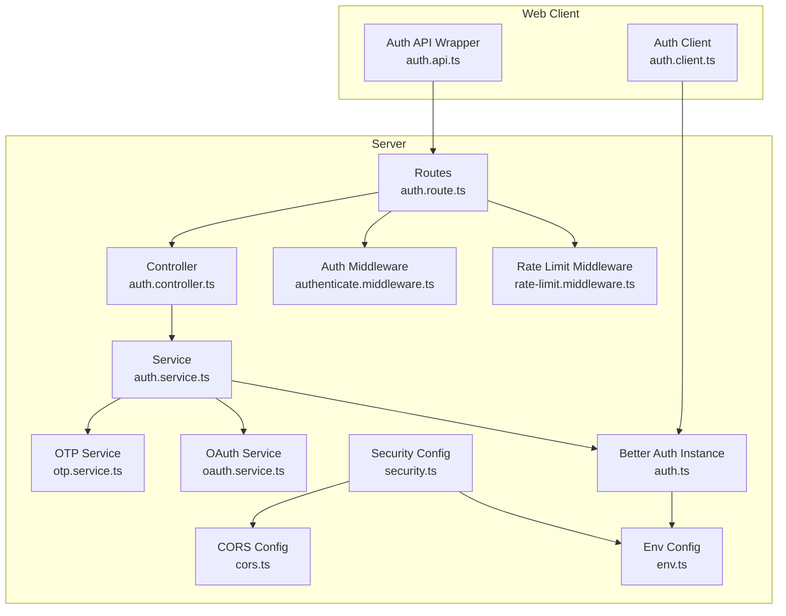
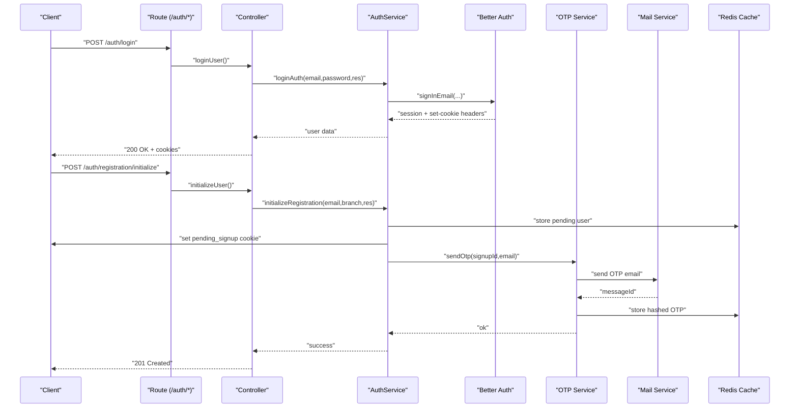
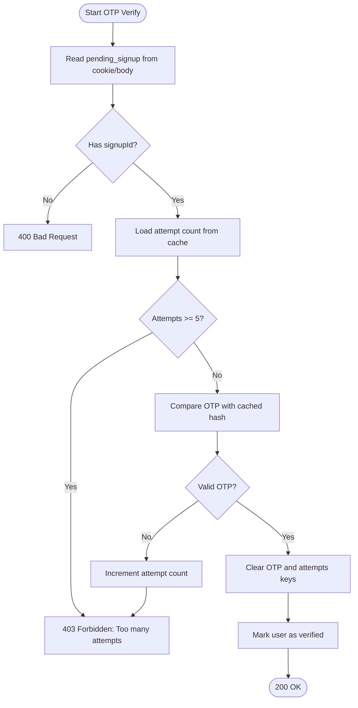
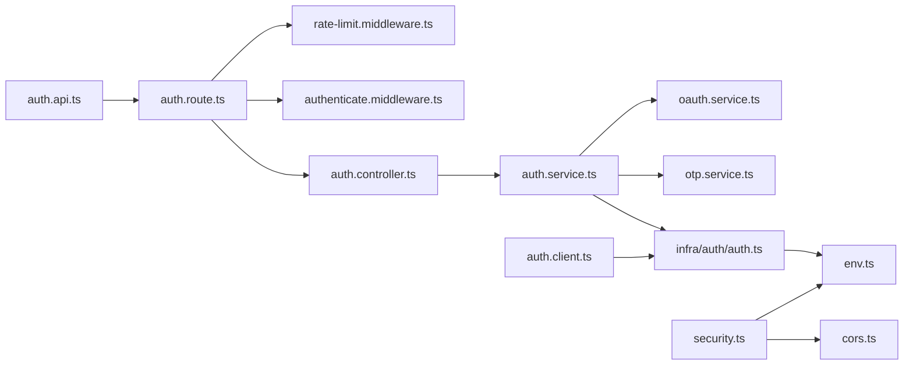

# Authentication API

<cite>
**Referenced Files in This Document**
- [auth.route.ts](file://server/src/modules/auth/auth.route.ts)
- [auth.controller.ts](file://server/src/modules/auth/auth.controller.ts)
- [auth.service.ts](file://server/src/modules/auth/auth.service.ts)
- [auth.schema.ts](file://server/src/modules/auth/auth.schema.ts)
- [otp.service.ts](file://server/src/modules/auth/otp/otp.service.ts)
- [oauth.service.ts](file://server/src/modules/auth/oauth/oauth.service.ts)
- [authenticate.middleware.ts](file://server/src/core/middlewares/auth/authenticate.middleware.ts)
- [rate-limit.middleware.ts](file://server/src/core/middlewares/rate-limit.middleware.ts)
- [security.ts](file://server/src/config/security.ts)
- [cors.ts](file://server/src/config/cors.ts)
- [env.ts](file://server/src/config/env.ts)
- [auth.ts](file://server/src/infra/auth/auth.ts)
- [auth.client.ts](file://web/src/lib/auth-client.ts)
- [auth.api.ts](file://web/src/services/api/auth.ts)
</cite>

## Table of Contents
1. [Introduction](#introduction)
2. [Project Structure](#project-structure)
3. [Core Components](#core-components)
4. [Architecture Overview](#architecture-overview)
5. [Detailed Component Analysis](#detailed-component-analysis)
6. [Dependency Analysis](#dependency-analysis)
7. [Performance Considerations](#performance-considerations)
8. [Troubleshooting Guide](#troubleshooting-guide)
9. [Conclusion](#conclusion)
10. [Appendices](#appendices)

## Introduction
This document provides comprehensive API documentation for the authentication endpoints, covering login, logout, registration, OTP verification, password reset, and Google OAuth integration. It also documents middleware requirements, session management, token refresh mechanisms, rate limiting, CORS configuration, CSRF protection, secure cookie handling, and client-side integration patterns.

## Project Structure
The authentication module is implemented in the server under the modules/auth directory and wired via Express routes. Client-side wrappers exist in the web application for convenient API usage.

**Diagram sources**
- [auth.route.ts](file://server/src/modules/auth/auth.route.ts#L1-L29)
- [auth.controller.ts](file://server/src/modules/auth/auth.controller.ts#L1-L171)
- [auth.service.ts](file://server/src/modules/auth/auth.service.ts#L1-L347)
- [otp.service.ts](file://server/src/modules/auth/otp/otp.service.ts#L1-L45)
- [oauth.service.ts](file://server/src/modules/auth/oauth/oauth.service.ts#L1-L45)
- [authenticate.middleware.ts](file://server/src/core/middlewares/auth/authenticate.middleware.ts#L1-L21)
- [rate-limit.middleware.ts](file://server/src/core/middlewares/rate-limit.middleware.ts#L1-L9)
- [security.ts](file://server/src/config/security.ts#L1-L14)
- [cors.ts](file://server/src/config/cors.ts#L1-L12)
- [env.ts](file://server/src/config/env.ts#L1-L34)
- [auth.ts](file://server/src/infra/auth/auth.ts#L1-L42)
- [auth.api.ts](file://web/src/services/api/auth.ts#L1-L71)
- [auth.client.ts](file://web/src/lib/auth-client.ts#L1-L200)

**Section sources**
- [auth.route.ts](file://server/src/modules/auth/auth.route.ts#L1-L29)
- [auth.controller.ts](file://server/src/modules/auth/auth.controller.ts#L1-L171)
- [auth.service.ts](file://server/src/modules/auth/auth.service.ts#L1-L347)
- [auth.schema.ts](file://server/src/modules/auth/auth.schema.ts#L1-L78)
- [otp.service.ts](file://server/src/modules/auth/otp/otp.service.ts#L1-L45)
- [oauth.service.ts](file://server/src/modules/auth/oauth/oauth.service.ts#L1-L45)
- [authenticate.middleware.ts](file://server/src/core/middlewares/auth/authenticate.middleware.ts#L1-L21)
- [rate-limit.middleware.ts](file://server/src/core/middlewares/rate-limit.middleware.ts#L1-L9)
- [security.ts](file://server/src/config/security.ts#L1-L14)
- [cors.ts](file://server/src/config/cors.ts#L1-L12)
- [env.ts](file://server/src/config/env.ts#L1-L34)
- [auth.ts](file://server/src/infra/auth/auth.ts#L1-L42)
- [auth.api.ts](file://web/src/services/api/auth.ts#L1-L71)
- [auth.client.ts](file://web/src/lib/auth-client.ts#L1-L200)

## Core Components
- Routes define endpoints and attach rate limiting and authentication middleware.
- Controller validates requests using Zod schemas and delegates to service layer.
- Service orchestrates Better Auth sessions, OTP caching, and OAuth callbacks.
- Middleware enforces rate limits and optional/required authentication.
- Security configuration applies Helmet, CORS, and trusted origins.
- Client wrappers encapsulate HTTP calls for OTP, registration, password reset, OAuth initialization, and session management.

**Section sources**
- [auth.route.ts](file://server/src/modules/auth/auth.route.ts#L1-L29)
- [auth.controller.ts](file://server/src/modules/auth/auth.controller.ts#L1-L171)
- [auth.service.ts](file://server/src/modules/auth/auth.service.ts#L1-L347)
- [rate-limit.middleware.ts](file://server/src/core/middlewares/rate-limit.middleware.ts#L1-L9)
- [authenticate.middleware.ts](file://server/src/core/middlewares/auth/authenticate.middleware.ts#L1-L21)
- [security.ts](file://server/src/config/security.ts#L1-L14)
- [cors.ts](file://server/src/config/cors.ts#L1-L12)
- [auth.api.ts](file://web/src/services/api/auth.ts#L1-L71)

## Architecture Overview
The authentication flow integrates Express routes, controllers, services, Better Auth, Redis cache, and email delivery. Rate limiting is enforced per-route, and CORS/Helmet are applied globally.

**Diagram sources**
- [auth.route.ts](file://server/src/modules/auth/auth.route.ts#L9-L15)
- [auth.controller.ts](file://server/src/modules/auth/auth.controller.ts#L8-L22)
- [auth.service.ts](file://server/src/modules/auth/auth.service.ts#L199-L217)
- [otp.service.ts](file://server/src/modules/auth/otp/otp.service.ts#L8-L31)
- [auth.ts](file://server/src/infra/auth/auth.ts#L8-L42)

## Detailed Component Analysis

### Endpoints Overview
- POST /auth/login
- POST /auth/refresh
- POST /auth/logout
- POST /auth/logout-all
- POST /auth/otp/send
- POST /auth/otp/verify
- POST /auth/registration/verify-otp
- POST /auth/registration/initialize
- POST /auth/registration/finalize
- GET /auth/google/callback
- POST /auth/password/forgot
- POST /auth/password/reset

Protected endpoints (require authentication):
- POST /auth/logout
- POST /auth/logout-all
- DELETE /auth/account
- GET /auth/admins
- GET /auth/users

**Section sources**
- [auth.route.ts](file://server/src/modules/auth/auth.route.ts#L7-L28)

### Login
- Purpose: Authenticate user with email and password.
- Request body:
  - email: string (required)
  - password: string (required)
- Response:
  - Success: 200 OK with user data and session cookies set.
  - Failure: 400 Bad Request or 401 Unauthorized depending on validation and auth outcome.
- Security:
  - Rate-limited by ensureRatelimit.auth.
  - Helmet and CORS configured globally.
  - Cookies are secure, httpOnly, sameSite strict, and domain-aware.

curl example:
- curl -c cookies.txt -X POST https://yourdomain.com/auth/login -H "Content-Type: application/json" -d '{"email":"student@college.edu","password":"securePass"}'

**Section sources**
- [auth.route.ts](file://server/src/modules/auth/auth.route.ts#L9-L9)
- [auth.controller.ts](file://server/src/modules/auth/auth.controller.ts#L8-L22)
- [auth.schema.ts](file://server/src/modules/auth/auth.schema.ts#L5-L8)
- [auth.service.ts](file://server/src/modules/auth/auth.service.ts#L199-L217)
- [auth.ts](file://server/src/infra/auth/auth.ts#L26-L33)

### Logout
- Purpose: Invalidate current session.
- Request body: none (uses Authorization header/session).
- Response: 200 OK on success.
- Security: Requires authentication middleware.

curl example:
- curl -b cookies.txt -X POST https://yourdomain.com/auth/logout

**Section sources**
- [auth.route.ts](file://server/src/modules/auth/auth.route.ts#L23-L23)
- [auth.controller.ts](file://server/src/modules/auth/auth.controller.ts#L24-L28)
- [auth.service.ts](file://server/src/modules/auth/auth.service.ts#L219-L229)
- [authenticate.middleware.ts](file://server/src/core/middlewares/auth/authenticate.middleware.ts#L8-L20)

### Logout All Devices
- Purpose: Revoke other sessions for the authenticated user.
- Request body: none.
- Response: 200 OK on success.

curl example:
- curl -b cookies.txt -X POST https://yourdomain.com/auth/logout-all

**Section sources**
- [auth.route.ts](file://server/src/modules/auth/auth.route.ts#L24-L24)
- [auth.controller.ts](file://server/src/modules/auth/auth.controller.ts#L148-L151)
- [auth.service.ts](file://server/src/modules/auth/auth.service.ts#L289-L301)

### Registration (Initialize and Finalize)
- Initialize Registration:
  - Purpose: Validate student email, find college, generate signupId, send OTP, and set pending_signup cookie.
  - Request body:
    - email: string (required)
    - branch: string (required, min length 1)
    - password: string (placeholder for OAuth flow)
  - Response: 201 Created with success indicator.
  - Security: pending_signup cookie is secure, httpOnly, sameSite strict, domain-aware.

- Finalize Registration:
  - Purpose: Create user via Better Auth and associated profile; clears pending cache.
  - Request body:
    - password: string (required, min length 6)
  - Response: 201 Created with user, profile, and session data.

curl examples:
- Initialize: curl -c cookies.txt -X POST https://yourdomain.com/auth/registration/initialize -H "Content-Type: application/json" -d '{"email":"student@college.edu","branch":"CS","password":"oauth-flow-placeholder"}'
- Finalize: curl -b cookies.txt -X POST https://yourdomain.com/auth/registration/finalize -H "Content-Type: application/json" -d '{"password":"securePass"}'

**Section sources**
- [auth.route.ts](file://server/src/modules/auth/auth.route.ts#L14-L15)
- [auth.controller.ts](file://server/src/modules/auth/auth.controller.ts#L104-L121)
- [auth.schema.ts](file://server/src/modules/auth/auth.schema.ts#L22-L36)
- [auth.service.ts](file://server/src/modules/auth/auth.service.ts#L32-L106)
- [auth.service.ts](file://server/src/modules/auth/auth.service.ts#L153-L197)

### OTP Verification Flow
- Send OTP:
  - Purpose: Send OTP to the email associated with the pending signup session.
  - Request body:
    - email: string (required)
  - Response: 200 OK with messageId.
  - Cookie requirement: pending_signup cookie must be present.

- Verify OTP (Registration):
  - Purpose: Verify OTP for registration and mark user as verified.
  - Request body:
    - otp: string (required)
  - Response: 200 OK with isVerified flag.
  - Attempts: Up to 5 attempts; excessive attempts block further verification.

- Verify OTP (General):
  - Purpose: Verify OTP for general use (non-registration).
  - Request body:
    - otp: string (required)
  - Response: 200 OK with isVerified flag.

curl examples:
- Send OTP: curl -b cookies.txt -X POST https://yourdomain.com/auth/otp/send -H "Content-Type: application/json" -d '{"email":"student@college.edu"}'
- Verify OTP (Registration): curl -b cookies.txt -X POST https://yourdomain.com/auth/registration/verify-otp -H "Content-Type: application/json" -d '{"otp":"123456"}'
- Verify OTP (General): curl -b cookies.txt -X POST https://yourdomain.com/auth/otp/verify -H "Content-Type: application/json" -d '{"otp":"123456"}'

**Diagram sources**
- [auth.controller.ts](file://server/src/modules/auth/auth.controller.ts#L62-L96)
- [auth.service.ts](file://server/src/modules/auth/auth.service.ts#L108-L151)
- [otp.service.ts](file://server/src/modules/auth/otp/otp.service.ts#L33-L41)

**Section sources**
- [auth.route.ts](file://server/src/modules/auth/auth.route.ts#L11-L13)
- [auth.controller.ts](file://server/src/modules/auth/auth.controller.ts#L47-L96)
- [auth.schema.ts](file://server/src/modules/auth/auth.schema.ts#L10-L16)
- [auth.service.ts](file://server/src/modules/auth/auth.service.ts#L108-L151)
- [otp.service.ts](file://server/src/modules/auth/otp/otp.service.ts#L8-L41)

### Password Reset
- Forgot Password:
  - Purpose: Initiate password reset; sends reset instructions to email.
  - Request body:
    - email: string (required)
    - redirectTo: string (optional, valid URL)
  - Response: 200 OK.

- Reset Password:
  - Purpose: Apply the new password using a token (from query or body).
  - Request body:
    - newPassword: string (required, min length 6)
    - token: string (optional)
  - Query:
    - token: string (optional)
  - Response: 200 OK.

curl examples:
- Forgot: curl -X POST https://yourdomain.com/auth/password/forgot -H "Content-Type: application/json" -d '{"email":"student@college.edu","redirectTo":"https://yourdomain.com/reset"}'
- Reset: curl -X POST "https://yourdomain.com/auth/password/reset?token=abc123" -H "Content-Type: application/json" -d '{"newPassword":"NewSecurePass","token":"abc123"}'

**Section sources**
- [auth.route.ts](file://server/src/modules/auth/auth.route.ts#L17-L18)
- [auth.controller.ts](file://server/src/modules/auth/auth.controller.ts#L129-L146)
- [auth.schema.ts](file://server/src/modules/auth/auth.schema.ts#L42-L56)
- [auth.service.ts](file://server/src/modules/auth/auth.service.ts#L257-L287)

### Google OAuth Integration
- Callback:
  - Purpose: Handle OAuth callback code and link session to user.
  - Query:
    - code: string (required)
  - Behavior: Exchanges code for tokens, retrieves user info, ensures user exists, and records audit.
  - Response: 302 Redirect to home.

curl example:
- curl "https://yourdomain.com/auth/google/callback?code=4/...abc"

**Section sources**
- [auth.route.ts](file://server/src/modules/auth/auth.route.ts#L16-L16)
- [auth.controller.ts](file://server/src/modules/auth/auth.controller.ts#L98-L102)
- [auth.schema.ts](file://server/src/modules/auth/auth.schema.ts#L38-L40)
- [oauth.service.ts](file://server/src/modules/auth/oauth/oauth.service.ts#L9-L41)
- [auth.ts](file://server/src/infra/auth/auth.ts#L20-L25)

### Token Refresh
- Purpose: Refresh access token using a refresh token.
- Request:
  - Cookie: refreshToken (preferred) or body: refreshToken.
- Response: 200 OK.
- Notes: Endpoint currently returns a generic success message; implementation supports returning new tokens.

curl example:
- curl -b cookies.txt -X POST https://yourdomain.com/auth/refresh -H "Content-Type: application/json" -d '{"refreshToken":"..."}'

**Section sources**
- [auth.route.ts](file://server/src/modules/auth/auth.route.ts#L10-L10)
- [auth.controller.ts](file://server/src/modules/auth/auth.controller.ts#L30-L45)
- [auth.service.ts](file://server/src/modules/auth/auth.service.ts#L39-L43)

### Account Deletion
- Purpose: Delete user account (supports password or token-based deletion).
- Request body:
  - password: string (optional)
  - token: string (optional)
  - callbackURL: string (optional, valid URL)
- Response: 200 OK.

curl example:
- curl -b cookies.txt -X DELETE https://yourdomain.com/auth/account -H "Content-Type: application/json" -d '{"password":"currentPass"}'

**Section sources**
- [auth.route.ts](file://server/src/modules/auth/auth.route.ts#L25-L25)
- [auth.controller.ts](file://server/src/modules/auth/auth.controller.ts#L123-L127)
- [auth.schema.ts](file://server/src/modules/auth/auth.schema.ts#L58-L62)
- [auth.service.ts](file://server/src/modules/auth/auth.service.ts#L231-L255)

## Dependency Analysis

**Diagram sources**
- [auth.route.ts](file://server/src/modules/auth/auth.route.ts#L1-L29)
- [auth.controller.ts](file://server/src/modules/auth/auth.controller.ts#L1-L171)
- [auth.service.ts](file://server/src/modules/auth/auth.service.ts#L1-L347)
- [auth.ts](file://server/src/infra/auth/auth.ts#L1-L42)
- [otp.service.ts](file://server/src/modules/auth/otp/otp.service.ts#L1-L45)
- [oauth.service.ts](file://server/src/modules/auth/oauth/oauth.service.ts#L1-L45)
- [authenticate.middleware.ts](file://server/src/core/middlewares/auth/authenticate.middleware.ts#L1-L21)
- [rate-limit.middleware.ts](file://server/src/core/middlewares/rate-limit.middleware.ts#L1-L9)
- [security.ts](file://server/src/config/security.ts#L1-L14)
- [cors.ts](file://server/src/config/cors.ts#L1-L12)
- [env.ts](file://server/src/config/env.ts#L1-L34)
- [auth.api.ts](file://web/src/services/api/auth.ts#L1-L71)
- [auth.client.ts](file://web/src/lib/auth-client.ts#L1-L200)

**Section sources**
- [auth.route.ts](file://server/src/modules/auth/auth.route.ts#L1-L29)
- [auth.service.ts](file://server/src/modules/auth/auth.service.ts#L1-L347)
- [auth.ts](file://server/src/infra/auth/auth.ts#L1-L42)
- [rate-limit.middleware.ts](file://server/src/core/middlewares/rate-limit.middleware.ts#L1-L9)
- [authenticate.middleware.ts](file://server/src/core/middlewares/auth/authenticate.middleware.ts#L1-L21)
- [security.ts](file://server/src/config/security.ts#L1-L14)
- [cors.ts](file://server/src/config/cors.ts#L1-L12)
- [env.ts](file://server/src/config/env.ts#L1-L34)
- [auth.api.ts](file://web/src/services/api/auth.ts#L1-L71)
- [auth.client.ts](file://web/src/lib/auth-client.ts#L1-L200)

## Performance Considerations
- OTP caching: OTPs are hashed and stored in Redis with short TTLs to prevent reuse and reduce load.
- Session caching: Better Auth cookie cache leverages JWE/JWT strategies with refresh caching for efficient session retrieval.
- Rate limiting: Per-endpoint rate limiters reduce brute-force attempts and protect sensitive flows.
- Email delivery: Asynchronous mail sending avoids blocking request threads.

[No sources needed since this section provides general guidance]

## Troubleshooting Guide
Common errors and resolutions:
- 400 Bad Request:
  - Validation failures for email, password, OTP, or missing fields.
  - Check request body against schemas.
- 401 Unauthorized:
  - Missing or invalid session for protected endpoints.
  - Ensure cookies are attached and session is active.
- 403 Forbidden:
  - Too many OTP attempts or invalid/expired pending session.
  - Wait for cooldown or restart registration flow.
- 404 Not Found:
  - College not found during registration initialization.
  - Verify institution domain configuration.
- 500 Internal Server Error:
  - OTP storage failure or mail delivery issues.
  - Inspect logs and retry.

**Section sources**
- [auth.controller.ts](file://server/src/modules/auth/auth.controller.ts#L52-L55)
- [auth.controller.ts](file://server/src/modules/auth/auth.controller.ts#L67-L70)
- [auth.service.ts](file://server/src/modules/auth/auth.service.ts#L52-L60)
- [otp.service.ts](file://server/src/modules/auth/otp/otp.service.ts#L21-L28)
- [auth.service.ts](file://server/src/modules/auth/auth.service.ts#L116-L139)

## Conclusion
The authentication system provides robust endpoints for login, registration, OTP verification, password reset, and OAuth. It enforces rate limits, secure cookies, and CORS/Helmet hardening. Better Auth manages sessions and integrates with Redis for caching and stateless refresh capabilities. Client wrappers simplify integration for frontend applications.

[No sources needed since this section summarizes without analyzing specific files]

## Appendices

### Request/Response Schemas

- Login
  - Request: { email: string, password: string }
  - Response: { message: string, user: object }

- OTP Send
  - Request: { email: string }
  - Response: { message: string, messageId: string }

- OTP Verify (Registration)
  - Request: { otp: string }
  - Response: { message: string, isVerified: boolean }

- OTP Verify (General)
  - Request: { otp: string }
  - Response: { message: string, isVerified: boolean }

- Registration Initialize
  - Request: { email: string, branch: string, password: string }
  - Response: { message: string, success: boolean }

- Registration Finalize
  - Request: { password: string }
  - Response: { message: string, user: object, profile: object, session: object }

- Forgot Password
  - Request: { email: string, redirectTo?: string }
  - Response: { message: string }

- Reset Password
  - Request: { newPassword: string, token?: string }
  - Query: token?: string
  - Response: { message: string }

- Google OAuth Callback
  - Query: { code: string }
  - Response: Redirect to home

- Logout
  - Response: { message: string }

- Logout All Devices
  - Response: { message: string }

- Account Deletion
  - Request: { password?: string, token?: string, callbackURL?: string }
  - Response: { message: string }

**Section sources**
- [auth.schema.ts](file://server/src/modules/auth/auth.schema.ts#L1-L78)
- [auth.controller.ts](file://server/src/modules/auth/auth.controller.ts#L8-L146)
- [auth.route.ts](file://server/src/modules/auth/auth.route.ts#L9-L28)

### Authentication Middleware Requirements
- Optional authentication for unprotected flows:
  - authenticate middleware attaches session and user to request if present.
- Required authentication for protected endpoints:
  - authenticate middleware is applied after rate limiter for protected routes.

**Section sources**
- [authenticate.middleware.ts](file://server/src/core/middlewares/auth/authenticate.middleware.ts#L8-L20)
- [auth.route.ts](file://server/src/modules/auth/auth.route.ts#L21-L21)

### Session Management and Token Refresh
- Sessions are managed by Better Auth with cookie caching and optional stateless refresh.
- Refresh endpoint accepts either cookie or body token; current implementation returns success without updating tokens.

**Section sources**
- [auth.ts](file://server/src/infra/auth/auth.ts#L26-L33)
- [auth.controller.ts](file://server/src/modules/auth/auth.controller.ts#L30-L45)
- [auth.service.ts](file://server/src/modules/auth/auth.service.ts#L39-L43)

### Rate Limiting Policies
- ensureRatelimit.auth is applied to authentication endpoints to mitigate brute-force attacks.

**Section sources**
- [rate-limit.middleware.ts](file://server/src/core/middlewares/rate-limit.middleware.ts#L3-L6)
- [auth.route.ts](file://server/src/modules/auth/auth.route.ts#L7-L7)

### CORS Configuration, CSRF Protection, and Secure Cookies
- CORS:
  - Origins are configurable via environment; credentials allowed; allowed methods and headers defined.
- CSRF:
  - CSRF protection is not explicitly implemented in the authentication routes; rely on SameSite cookies and token-based flows.
- Secure Cookies:
  - pending_signup cookie is httpOnly, secure, sameSite strict, domain-aware, and short-lived.
  - Better Auth sets session cookies according to configured options.

**Section sources**
- [cors.ts](file://server/src/config/cors.ts#L4-L10)
- [security.ts](file://server/src/config/security.ts#L6-L11)
- [auth.service.ts](file://server/src/modules/auth/auth.service.ts#L90-L97)
- [auth.ts](file://server/src/infra/auth/auth.ts#L26-L33)

### Client-Side Implementation Patterns
- Use the web auth API wrapper to call endpoints:
  - authApi.session.login, authApi.session.refresh, authApi.session.logoutAll
  - authApi.otp.send, authApi.otp.verify
  - authApi.register.initialize, authApi.register.register
  - authApi.resetPassword.initialize, authApi.resetPassword.finalize
  - authApi.oauth.setup
- The Better Auth client handles session persistence and cookie forwarding automatically.

**Section sources**
- [auth.api.ts](file://web/src/services/api/auth.ts#L4-L71)
- [auth.client.ts](file://web/src/lib/auth-client.ts#L1-L200)