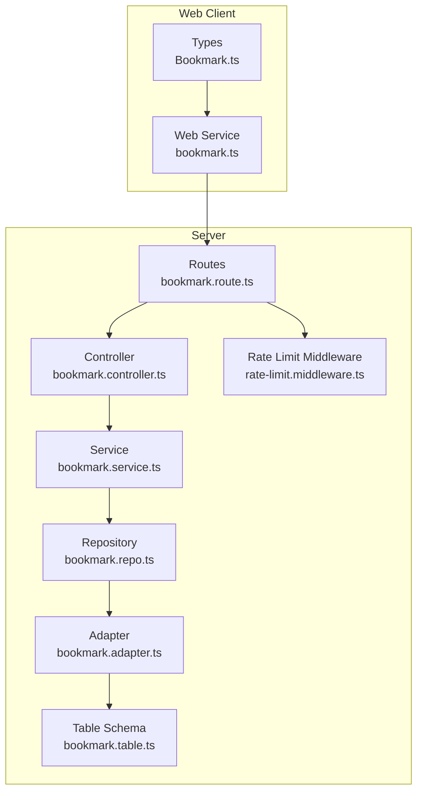
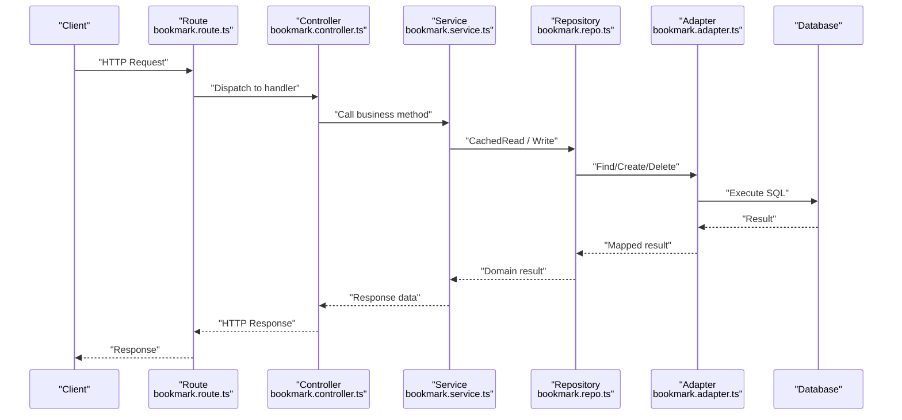
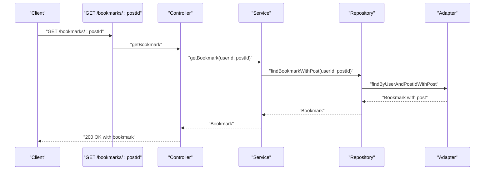
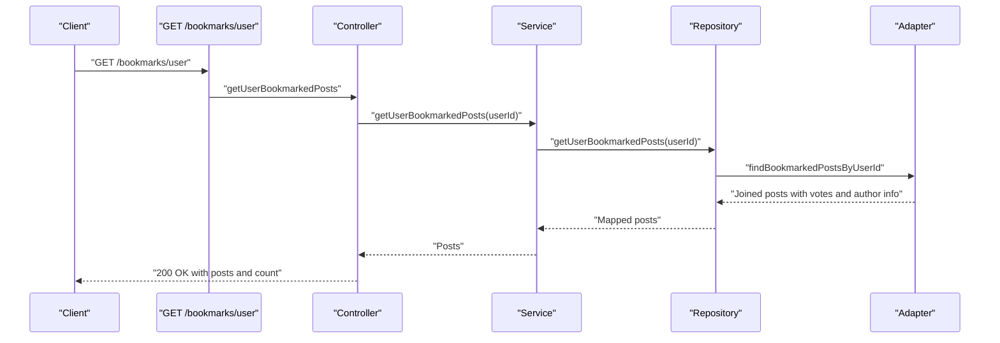
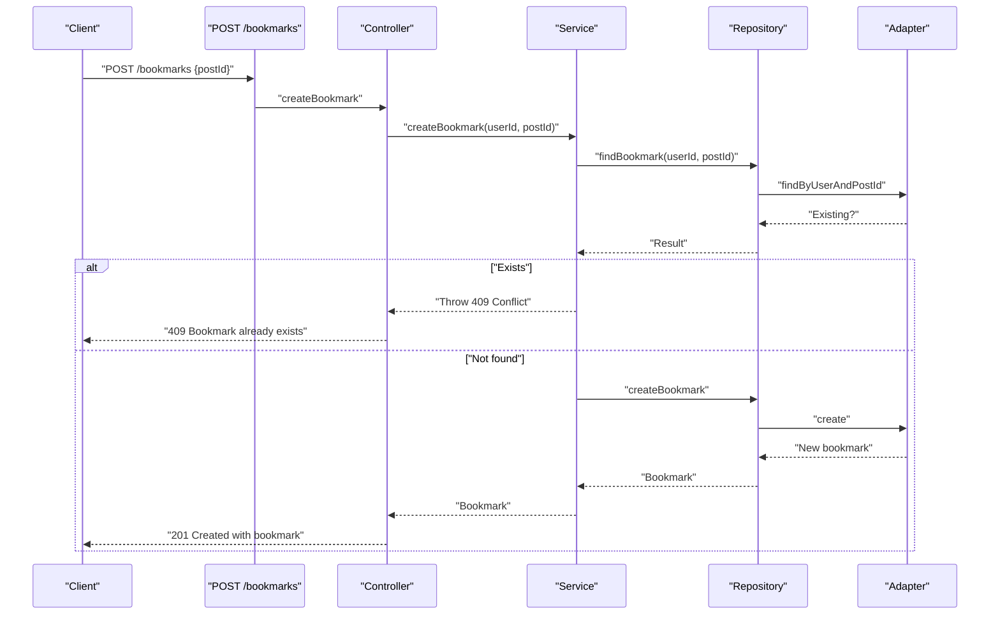
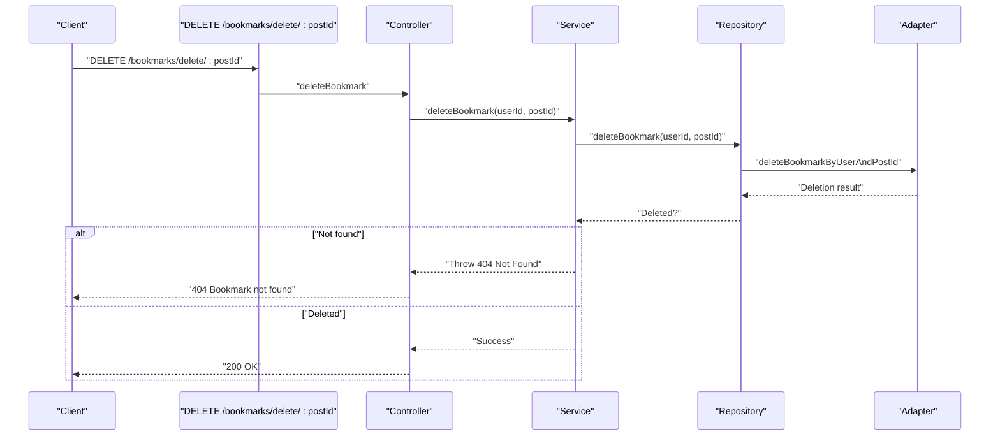
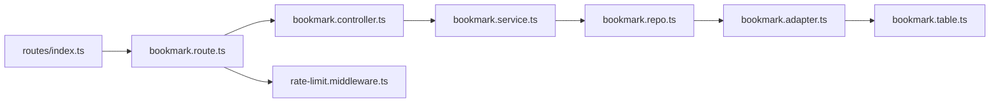

# Bookmark API

<cite>
**Referenced Files in This Document**
- [bookmark.route.ts](file://server/src/modules/bookmark/bookmark.route.ts)
- [bookmark.controller.ts](file://server/src/modules/bookmark/bookmark.controller.ts)
- [bookmark.service.ts](file://server/src/modules/bookmark/bookmark.service.ts)
- [bookmark.schema.ts](file://server/src/modules/bookmark/bookmark.schema.ts)
- [bookmark.repo.ts](file://server/src/modules/bookmark/bookmark.repo.ts)
- [bookmark.cache-keys.ts](file://server/src/modules/bookmark/bookmark.cache-keys.ts)
- [bookmark.adapter.ts](file://server/src/infra/db/adapters/bookmark.adapter.ts)
- [bookmark.table.ts](file://server/src/infra/db/tables/bookmark.table.ts)
- [rate-limit.middleware.ts](file://server/src/core/middlewares/rate-limit.middleware.ts)
- [index.ts](file://server/src/routes/index.ts)
- [bookmark.ts](file://web/src/services/api/bookmark.ts)
- [Bookmark.ts](file://web/src/types/Bookmark.ts)
</cite>

## Table of Contents
1. [Introduction](#introduction)
2. [Project Structure](#project-structure)
3. [Core Components](#core-components)
4. [Architecture Overview](#architecture-overview)
5. [Detailed Component Analysis](#detailed-component-analysis)
6. [Dependency Analysis](#dependency-analysis)
7. [Performance Considerations](#performance-considerations)
8. [Troubleshooting Guide](#troubleshooting-guide)
9. [Conclusion](#conclusion)
10. [Appendices](#appendices)

## Introduction
This document provides comprehensive API documentation for bookmark management endpoints. It covers bookmark creation, removal, and retrieval operations for posts, pagination and filtering of bookmark lists, and integration with user profiles. It also documents request schemas, duplicate prevention, permission requirements, caching and rate limiting, and outlines potential bulk operations and bookmark synchronization across devices.

## Project Structure
The bookmark API is implemented as part of the server module and integrates with the frontend via a dedicated service. The backend follows a layered architecture:
- Routes define endpoint contracts and apply middleware.
- Controllers handle request parsing, enforce permissions, and orchestrate service calls.
- Services encapsulate business logic, including duplicate checks and error handling.
- Repositories abstract data access and caching.
- Adapters interact with the database using Drizzle ORM.
- Frontend service wrappers expose convenient methods for the UI.

**Diagram sources**
- [bookmark.route.ts](file://server/src/modules/bookmark/bookmark.route.ts#L1-L19)
- [bookmark.controller.ts](file://server/src/modules/bookmark/bookmark.controller.ts#L1-L47)
- [bookmark.service.ts](file://server/src/modules/bookmark/bookmark.service.ts#L1-L77)
- [bookmark.repo.ts](file://server/src/modules/bookmark/bookmark.repo.ts#L1-L32)
- [bookmark.adapter.ts](file://server/src/infra/db/adapters/bookmark.adapter.ts#L1-L152)
- [bookmark.table.ts](file://server/src/infra/db/tables/bookmark.table.ts#L1-L15)
- [rate-limit.middleware.ts](file://server/src/core/middlewares/rate-limit.middleware.ts#L1-L9)
- [bookmark.ts](file://web/src/services/api/bookmark.ts#L1-L15)
- [Bookmark.ts](file://web/src/types/Bookmark.ts#L1-L10)

**Section sources**
- [bookmark.route.ts](file://server/src/modules/bookmark/bookmark.route.ts#L1-L19)
- [index.ts](file://server/src/routes/index.ts#L17-L28)

## Core Components
- Endpoints
  - GET /api/v1/bookmarks/:postId - Retrieve a bookmark for a specific post by the current user.
  - GET /api/v1/bookmarks/user - List all posts bookmarked by the current user.
  - POST /api/v1/bookmarks - Create a bookmark for a post.
  - DELETE /api/v1/bookmarks/delete/:postId - Remove a bookmark for a post.
- Authentication and Rate Limiting
  - All bookmark endpoints require a valid user session and are protected by the API rate limiter.
- Request Validation
  - Request bodies and parameters are validated using Zod schemas.
- Response Envelope
  - Responses follow a consistent envelope pattern with messages and payload fields.

**Section sources**
- [bookmark.route.ts](file://server/src/modules/bookmark/bookmark.route.ts#L8-L18)
- [bookmark.controller.ts](file://server/src/modules/bookmark/bookmark.controller.ts#L8-L44)
- [rate-limit.middleware.ts](file://server/src/core/middlewares/rate-limit.middleware.ts#L3-L6)

## Architecture Overview
The bookmark API enforces user context, validates inputs, delegates to the service layer, and persists or retrieves data through repositories and adapters. Caching is applied for reads to improve performance.

**Diagram sources**
- [bookmark.route.ts](file://server/src/modules/bookmark/bookmark.route.ts#L1-L19)
- [bookmark.controller.ts](file://server/src/modules/bookmark/bookmark.controller.ts#L1-L47)
- [bookmark.service.ts](file://server/src/modules/bookmark/bookmark.service.ts#L1-L77)
- [bookmark.repo.ts](file://server/src/modules/bookmark/bookmark.repo.ts#L1-L32)
- [bookmark.adapter.ts](file://server/src/infra/db/adapters/bookmark.adapter.ts#L1-L152)

## Detailed Component Analysis

### Endpoints and Operations

#### GET /api/v1/bookmarks/:postId
- Purpose: Retrieve a bookmark for a specific post by the current user.
- Authentication: Required.
- Request
  - Path parameters:
    - postId: string (UUID of the post)
- Response
  - Body includes a bookmark object containing identifiers and metadata.
- Error Handling
  - Returns 404 Not Found if the bookmark does not exist for the user.

**Diagram sources**
- [bookmark.route.ts](file://server/src/modules/bookmark/bookmark.route.ts#L11-L11)
- [bookmark.controller.ts](file://server/src/modules/bookmark/bookmark.controller.ts#L38-L44)
- [bookmark.service.ts](file://server/src/modules/bookmark/bookmark.service.ts#L58-L74)
- [bookmark.repo.ts](file://server/src/modules/bookmark/bookmark.repo.ts#L19-L20)
- [bookmark.adapter.ts](file://server/src/infra/db/adapters/bookmark.adapter.ts#L24-L34)

**Section sources**
- [bookmark.route.ts](file://server/src/modules/bookmark/bookmark.route.ts#L11-L11)
- [bookmark.controller.ts](file://server/src/modules/bookmark/bookmark.controller.ts#L38-L44)
- [bookmark.service.ts](file://server/src/modules/bookmark/bookmark.service.ts#L58-L74)

#### GET /api/v1/bookmarks/user
- Purpose: List all posts bookmarked by the current user.
- Authentication: Required.
- Request: None.
- Response
  - Body includes an array of posts with aggregated vote counts and user-specific vote state, plus a count.
- Behavior
  - Results exclude banned or shadow-banned posts and are ordered by post creation date descending.

**Diagram sources**
- [bookmark.route.ts](file://server/src/modules/bookmark/bookmark.route.ts#L12-L12)
- [bookmark.controller.ts](file://server/src/modules/bookmark/bookmark.controller.ts#L19-L28)
- [bookmark.service.ts](file://server/src/modules/bookmark/bookmark.service.ts#L32-L38)
- [bookmark.repo.ts](file://server/src/modules/bookmark/bookmark.repo.ts#L22-L23)
- [bookmark.adapter.ts](file://server/src/infra/db/adapters/bookmark.adapter.ts#L54-L151)

**Section sources**
- [bookmark.route.ts](file://server/src/modules/bookmark/bookmark.route.ts#L12-L12)
- [bookmark.controller.ts](file://server/src/modules/bookmark/bookmark.controller.ts#L19-L28)
- [bookmark.service.ts](file://server/src/modules/bookmark/bookmark.service.ts#L32-L38)
- [bookmark.adapter.ts](file://server/src/infra/db/adapters/bookmark.adapter.ts#L54-L151)

#### POST /api/v1/bookmarks
- Purpose: Create a bookmark for a post.
- Authentication: Required.
- Request body
  - postId: string (UUID of the post)
- Response
  - Body includes the newly created bookmark object.
- Validation and Duplicate Prevention
  - Validates input schema.
  - Checks for existing bookmark using a cached read; throws 409 Conflict if present.
- Error Handling
  - Throws 409 Conflict on duplicates.
  - Throws 500 on internal failures.

**Diagram sources**
- [bookmark.route.ts](file://server/src/modules/bookmark/bookmark.route.ts#L16-L16)
- [bookmark.controller.ts](file://server/src/modules/bookmark/bookmark.controller.ts#L8-L17)
- [bookmark.service.ts](file://server/src/modules/bookmark/bookmark.service.ts#L7-L30)
- [bookmark.repo.ts](file://server/src/modules/bookmark/bookmark.repo.ts#L16-L29)
- [bookmark.adapter.ts](file://server/src/infra/db/adapters/bookmark.adapter.ts#L15-L52)

**Section sources**
- [bookmark.route.ts](file://server/src/modules/bookmark/bookmark.route.ts#L16-L16)
- [bookmark.controller.ts](file://server/src/modules/bookmark/bookmark.controller.ts#L8-L17)
- [bookmark.service.ts](file://server/src/modules/bookmark/bookmark.service.ts#L7-L30)
- [bookmark.schema.ts](file://server/src/modules/bookmark/bookmark.schema.ts#L3-L5)

#### DELETE /api/v1/bookmarks/delete/:postId
- Purpose: Remove a bookmark for a post.
- Authentication: Required.
- Request
  - Path parameters:
    - postId: string (UUID of the post)
- Response
  - Body confirms successful deletion.
- Error Handling
  - Throws 404 Not Found if the bookmark does not exist for the user.

**Diagram sources**
- [bookmark.route.ts](file://server/src/modules/bookmark/bookmark.route.ts#L13-L13)
- [bookmark.controller.ts](file://server/src/modules/bookmark/bookmark.controller.ts#L30-L36)
- [bookmark.service.ts](file://server/src/modules/bookmark/bookmark.service.ts#L40-L56)
- [bookmark.repo.ts](file://server/src/modules/bookmark/bookmark.repo.ts#L28-L28)
- [bookmark.adapter.ts](file://server/src/infra/db/adapters/bookmark.adapter.ts#L36-L41)

**Section sources**
- [bookmark.route.ts](file://server/src/modules/bookmark/bookmark.route.ts#L13-L13)
- [bookmark.controller.ts](file://server/src/modules/bookmark/bookmark.controller.ts#L30-L36)
- [bookmark.service.ts](file://server/src/modules/bookmark/bookmark.service.ts#L40-L56)

### Request Schemas and Validation
- PostIdSchema
  - Ensures the request body contains a postId field of type string.
- Controller-level parsing
  - Controllers parse and validate inputs before invoking services.

**Section sources**
- [bookmark.schema.ts](file://server/src/modules/bookmark/bookmark.schema.ts#L3-L5)
- [bookmark.controller.ts](file://server/src/modules/bookmark/bookmark.controller.ts#L9-L9)
- [bookmark.controller.ts](file://server/src/modules/bookmark/bookmark.controller.ts#L31-L31)

### Duplicate Prevention
- The service checks for an existing bookmark using a cached read before attempting to create a new one.
- If a bookmark exists, a 409 Conflict error is returned with a machine-readable code and field-level error.

**Section sources**
- [bookmark.service.ts](file://server/src/modules/bookmark/bookmark.service.ts#L10-L25)
- [bookmark.repo.ts](file://server/src/modules/bookmark/bookmark.repo.ts#L16-L17)

### Bookmark Retrieval and Aggregation
- getUserBookmarkedPosts returns enriched post data including:
  - Post metadata (title, content, views, topic, timestamps)
  - Aggregated vote counts (upvotes, downvotes)
  - Current user’s vote state
  - Author and college information
- Results exclude posts that are banned or shadow-banned and are ordered by creation date descending.

**Section sources**
- [bookmark.service.ts](file://server/src/modules/bookmark/bookmark.service.ts#L32-L38)
- [bookmark.adapter.ts](file://server/src/infra/db/adapters/bookmark.adapter.ts#L54-L151)

### Permission Requirements and User Context
- All endpoints are protected by a user context middleware ensuring a valid session.
- Operations are scoped to the authenticated user’s identity.

**Section sources**
- [bookmark.route.ts](file://server/src/modules/bookmark/bookmark.route.ts#L9-L9)
- [bookmark.controller.ts](file://server/src/modules/bookmark/bookmark.controller.ts#L10-L10)
- [bookmark.controller.ts](file://server/src/modules/bookmark/bookmark.controller.ts#L32-L32)

### Bookmark Privacy and Visibility
- Bookmark visibility is implicit: endpoints operate per-user and return only the current user’s bookmarks.
- There is no explicit privacy toggle exposed by the current API.

**Section sources**
- [bookmark.route.ts](file://server/src/modules/bookmark/bookmark.route.ts#L11-L12)
- [bookmark.controller.ts](file://server/src/modules/bookmark/bookmark.controller.ts#L19-L28)

### Bookmark Synchronization Across Devices
- Caching is enabled for reads to ensure consistent and fast responses across sessions.
- No explicit synchronization mechanism is exposed by the API; clients should rely on the backend’s persisted state.

**Section sources**
- [bookmark.cache-keys.ts](file://server/src/modules/bookmark/bookmark.cache-keys.ts#L1-L6)
- [bookmark.repo.ts](file://server/src/modules/bookmark/bookmark.repo.ts#L15-L24)

### Bulk Operations
- The current API does not expose bulk bookmark operations.
- Clients can iterate over lists and call individual endpoints for batch-like behavior.

**Section sources**
- [bookmark.route.ts](file://server/src/modules/bookmark/bookmark.route.ts#L11-L16)

### Pagination and Filtering
- Pagination
  - Not currently supported by the bookmark list endpoint.
- Filtering
  - The list endpoint filters out banned and shadow-banned posts and orders by creation date.
  - No additional filter parameters are exposed.

**Section sources**
- [bookmark.adapter.ts](file://server/src/infra/db/adapters/bookmark.adapter.ts#L112-L119)
- [bookmark.controller.ts](file://server/src/modules/bookmark/bookmark.controller.ts#L19-L28)

### Rate Limiting
- All bookmark endpoints are protected by the API rate limiter middleware.
- The middleware applies configured limits to prevent abuse.

**Section sources**
- [bookmark.route.ts](file://server/src/modules/bookmark/bookmark.route.ts#L8-L8)
- [rate-limit.middleware.ts](file://server/src/core/middlewares/rate-limit.middleware.ts#L4-L5)

### Integration with User Profiles
- The bookmark list endpoint enriches each post with author and college information, enabling profile-centric display in the UI.

**Section sources**
- [bookmark.adapter.ts](file://server/src/infra/db/adapters/bookmark.adapter.ts#L133-L147)

### Frontend Integration Examples
- Web service methods
  - listMine(): GET /api/v1/bookmarks/user
  - create(postId): POST /api/v1/bookmarks
  - remove(postId): DELETE /api/v1/bookmarks/delete/:postId
- Types
  - Bookmark interface defines fields for id, userId, and postId.

**Section sources**
- [bookmark.ts](file://web/src/services/api/bookmark.ts#L4-L13)
- [Bookmark.ts](file://web/src/types/Bookmark.ts#L4-L8)

## Dependency Analysis

**Diagram sources**
- [bookmark.route.ts](file://server/src/modules/bookmark/bookmark.route.ts#L1-L19)
- [bookmark.controller.ts](file://server/src/modules/bookmark/bookmark.controller.ts#L1-L47)
- [bookmark.service.ts](file://server/src/modules/bookmark/bookmark.service.ts#L1-L77)
- [bookmark.repo.ts](file://server/src/modules/bookmark/bookmark.repo.ts#L1-L32)
- [bookmark.adapter.ts](file://server/src/infra/db/adapters/bookmark.adapter.ts#L1-L152)
- [bookmark.table.ts](file://server/src/infra/db/tables/bookmark.table.ts#L1-L15)
- [rate-limit.middleware.ts](file://server/src/core/middlewares/rate-limit.middleware.ts#L1-L9)
- [index.ts](file://server/src/routes/index.ts#L17-L28)

**Section sources**
- [bookmark.route.ts](file://server/src/modules/bookmark/bookmark.route.ts#L1-L19)
- [bookmark.service.ts](file://server/src/modules/bookmark/bookmark.service.ts#L1-L77)
- [bookmark.adapter.ts](file://server/src/infra/db/adapters/bookmark.adapter.ts#L1-L152)
- [bookmark.table.ts](file://server/src/infra/db/tables/bookmark.table.ts#L1-L15)
- [index.ts](file://server/src/routes/index.ts#L17-L28)

## Performance Considerations
- Caching
  - Reads are cached using composite cache keys for single and multi-ID lookups to reduce database load.
- Aggregation
  - The list endpoint performs a single query with joins and a WITH clause for vote aggregation, minimizing round-trips.
- Indexing
  - The bookmarks table includes an index on (userId, postId) to optimize lookups.

**Section sources**
- [bookmark.cache-keys.ts](file://server/src/modules/bookmark/bookmark.cache-keys.ts#L1-L6)
- [bookmark.repo.ts](file://server/src/modules/bookmark/bookmark.repo.ts#L15-L24)
- [bookmark.adapter.ts](file://server/src/infra/db/adapters/bookmark.adapter.ts#L54-L151)
- [bookmark.table.ts](file://server/src/infra/db/tables/bookmark.table.ts#L12-L14)

## Troubleshooting Guide
- 400 Bad Request
  - Occurs when the request body or path parameters fail schema validation.
- 401 Unauthorized
  - Occurs when the user is not authenticated.
- 403 Forbidden
  - Not explicitly handled by the current route; ensure RBAC middleware is configured upstream.
- 404 Not Found
  - Returned when retrieving or deleting a bookmark that does not belong to the user.
- 409 Conflict
  - Returned when attempting to create a duplicate bookmark.
- 5xx Internal Server Error
  - Indicates unexpected failures during persistence or computation.

**Section sources**
- [bookmark.controller.ts](file://server/src/modules/bookmark/bookmark.controller.ts#L8-L17)
- [bookmark.controller.ts](file://server/src/modules/bookmark/bookmark.controller.ts#L30-L36)
- [bookmark.controller.ts](file://server/src/modules/bookmark/bookmark.controller.ts#L38-L44)
- [bookmark.service.ts](file://server/src/modules/bookmark/bookmark.service.ts#L13-L25)
- [bookmark.service.ts](file://server/src/modules/bookmark/bookmark.service.ts#L46-L52)
- [bookmark.service.ts](file://server/src/modules/bookmark/bookmark.service.ts#L64-L70)

## Conclusion
The bookmark API provides a focused set of endpoints for managing bookmarks per user, with robust validation, duplicate prevention, and caching. It integrates seamlessly with the post feed by enriching bookmarked posts with author and voting metadata. While advanced features like bulk operations, pagination, and explicit privacy toggles are not yet exposed, the underlying architecture supports future enhancements.

## Appendices

### Endpoint Reference Summary
- GET /api/v1/bookmarks/:postId
  - Description: Retrieve a bookmark for a post.
  - Auth: Required.
  - Response: Bookmark object.
- GET /api/v1/bookmarks/user
  - Description: List bookmarked posts for the user.
  - Auth: Required.
  - Response: Array of posts with counts and user vote state; count integer.
- POST /api/v1/bookmarks
  - Description: Create a bookmark for a post.
  - Auth: Required.
  - Request body: { postId: string }.
  - Response: New bookmark object.
- DELETE /api/v1/bookmarks/delete/:postId
  - Description: Remove a bookmark for a post.
  - Auth: Required.
  - Response: Success confirmation.

**Section sources**
- [bookmark.route.ts](file://server/src/modules/bookmark/bookmark.route.ts#L11-L16)
- [bookmark.controller.ts](file://server/src/modules/bookmark/bookmark.controller.ts#L8-L44)
- [bookmark.adapter.ts](file://server/src/infra/db/adapters/bookmark.adapter.ts#L54-L151)