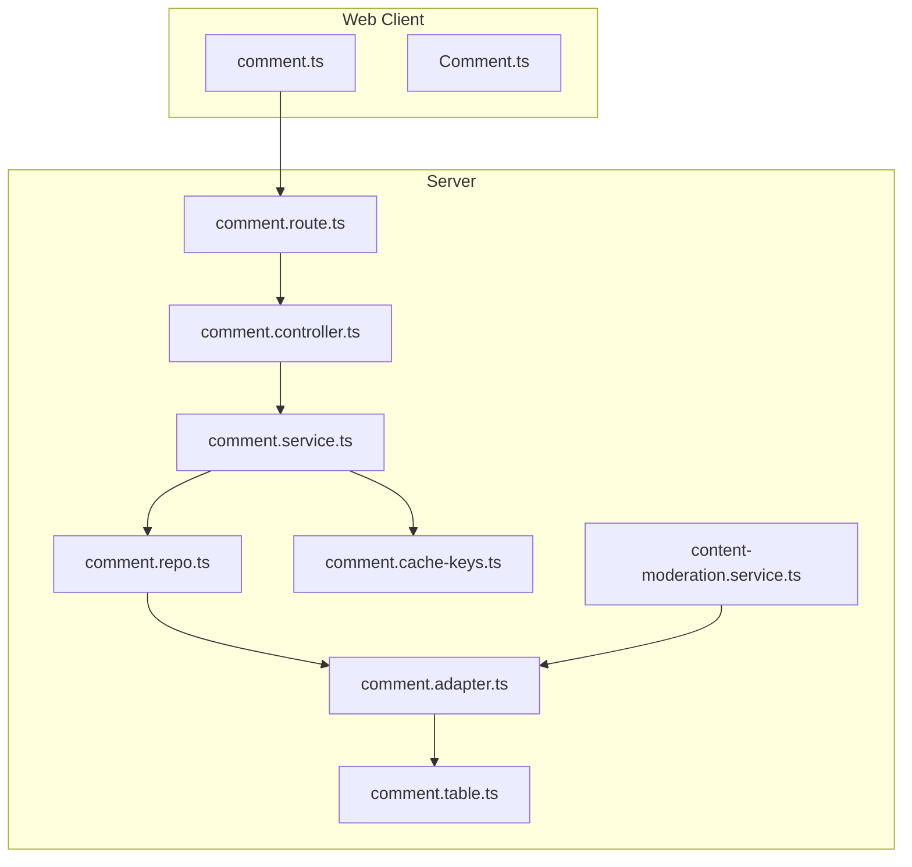
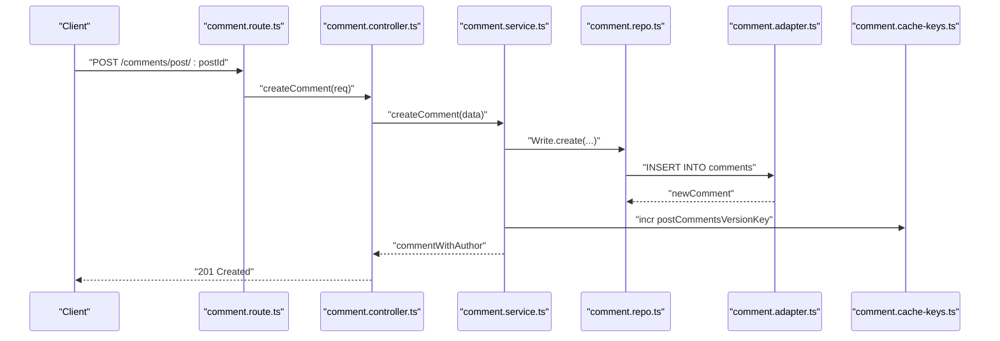
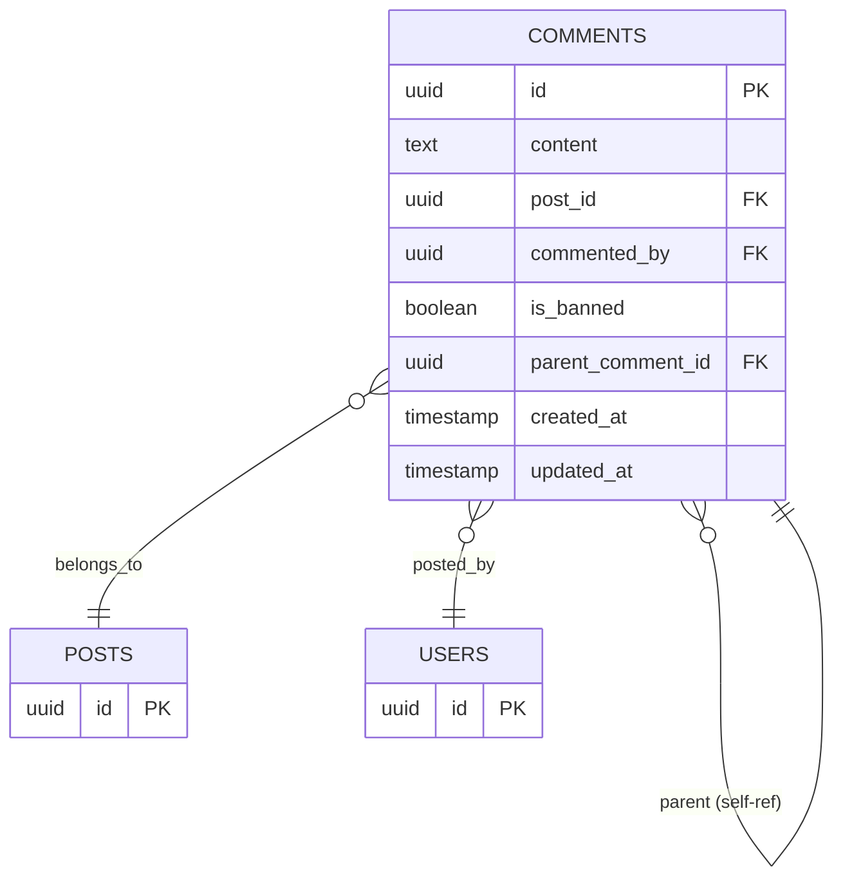
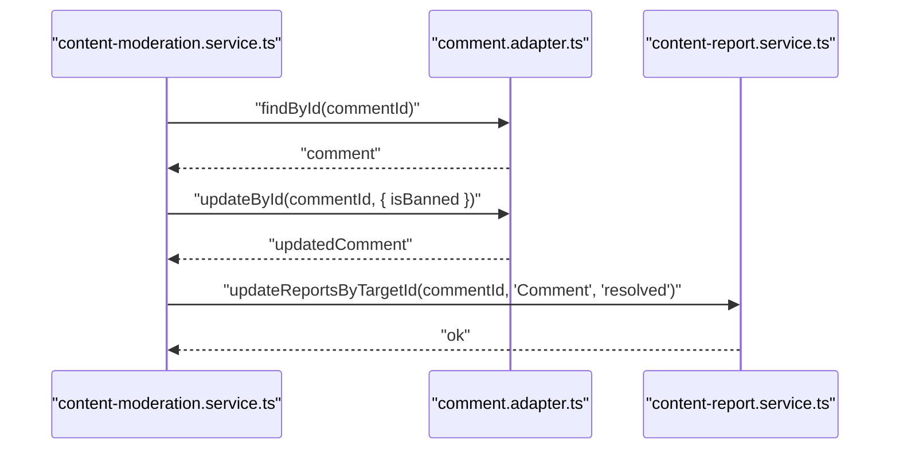
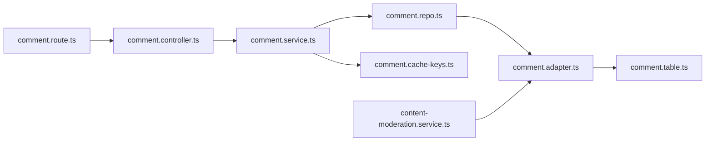

# Comment System API

<cite>
**Referenced Files in This Document**
- [comment.route.ts](file://server/src/modules/comment/comment.route.ts)
- [comment.controller.ts](file://server/src/modules/comment/comment.controller.ts)
- [comment.service.ts](file://server/src/modules/comment/comment.service.ts)
- [comment.schema.ts](file://server/src/modules/comment/comment.schema.ts)
- [comment.repo.ts](file://server/src/modules/comment/comment.repo.ts)
- [comment.adapter.ts](file://server/src/infra/db/adapters/comment.adapter.ts)
- [comment.table.ts](file://server/src/infra/db/tables/comment.table.ts)
- [comment.cache-keys.ts](file://server/src/modules/comment/comment.cache-keys.ts)
- [content-moderation.service.ts](file://server/src/modules/content-report/content-moderation.service.ts)
- [comment.ts](file://web/src/services/api/comment.ts)
- [Comment.ts](file://web/src/types/Comment.ts)
</cite>

## Table of Contents
1. [Introduction](#introduction)
2. [Project Structure](#project-structure)
3. [Core Components](#core-components)
4. [Architecture Overview](#architecture-overview)
5. [Detailed Component Analysis](#detailed-component-analysis)
6. [Dependency Analysis](#dependency-analysis)
7. [Performance Considerations](#performance-considerations)
8. [Troubleshooting Guide](#troubleshooting-guide)
9. [Conclusion](#conclusion)
10. [Appendices](#appendices)

## Introduction
This document provides comprehensive API documentation for the comment management system. It covers CRUD operations for comments, nested reply creation, editing and deletion with permission validation, fetching comments by post with pagination and sorting, reply hierarchy handling, moderation workflows, reporting mechanisms, rate limiting, and content filtering policies. It also includes request schemas, response structures, and practical examples for building nested comment trees and real-time updates.

## Project Structure
The comment module is organized into route, controller, service, repository, adapter, schema, and cache-key layers. The frontend exposes a thin HTTP client for comment operations.

**Diagram sources**
- [comment.route.ts](file://server/src/modules/comment/comment.route.ts#L1-L20)
- [comment.controller.ts](file://server/src/modules/comment/comment.controller.ts#L1-L64)
- [comment.service.ts](file://server/src/modules/comment/comment.service.ts#L1-L195)
- [comment.repo.ts](file://server/src/modules/comment/comment.repo.ts#L1-L71)
- [comment.adapter.ts](file://server/src/infra/db/adapters/comment.adapter.ts#L1-L255)
- [comment.table.ts](file://server/src/infra/db/tables/comment.table.ts#L1-L26)
- [comment.cache-keys.ts](file://server/src/modules/comment/comment.cache-keys.ts#L1-L30)
- [content-moderation.service.ts](file://server/src/modules/content-report/content-moderation.service.ts#L1-L180)
- [comment.ts](file://web/src/services/api/comment.ts#L1-L21)
- [Comment.ts](file://web/src/types/Comment.ts#L1-L17)

**Section sources**
- [comment.route.ts](file://server/src/modules/comment/comment.route.ts#L1-L20)
- [comment.controller.ts](file://server/src/modules/comment/comment.controller.ts#L1-L64)
- [comment.service.ts](file://server/src/modules/comment/comment.service.ts#L1-L195)
- [comment.repo.ts](file://server/src/modules/comment/comment.repo.ts#L1-L71)
- [comment.adapter.ts](file://server/src/infra/db/adapters/comment.adapter.ts#L1-L255)
- [comment.table.ts](file://server/src/infra/db/tables/comment.table.ts#L1-L26)
- [comment.cache-keys.ts](file://server/src/modules/comment/comment.cache-keys.ts#L1-L30)
- [content-moderation.service.ts](file://server/src/modules/content-report/content-moderation.service.ts#L1-L180)
- [comment.ts](file://web/src/services/api/comment.ts#L1-L21)
- [Comment.ts](file://web/src/types/Comment.ts#L1-L17)

## Core Components
- Routes: Define HTTP endpoints, middleware, and method bindings.
- Controller: Parses request bodies and params, delegates to service, and returns standardized responses.
- Service: Implements business logic, permission checks, caching invalidation, and audit logging.
- Repository: Provides cached and uncached reads/writes via adapters.
- Adapter: Drizzle ORM queries for comment data, joins with users and colleges, and aggregates votes.
- Schema: Zod schemas for request validation.
- Cache Keys: Versioned cache keys for post comments and replies.
- Moderation Service: Bans/unbans comments and resolves related reports.

**Section sources**
- [comment.route.ts](file://server/src/modules/comment/comment.route.ts#L1-L20)
- [comment.controller.ts](file://server/src/modules/comment/comment.controller.ts#L1-L64)
- [comment.service.ts](file://server/src/modules/comment/comment.service.ts#L1-L195)
- [comment.repo.ts](file://server/src/modules/comment/comment.repo.ts#L1-L71)
- [comment.adapter.ts](file://server/src/infra/db/adapters/comment.adapter.ts#L1-L255)
- [comment.schema.ts](file://server/src/modules/comment/comment.schema.ts#L1-L25)
- [comment.cache-keys.ts](file://server/src/modules/comment/comment.cache-keys.ts#L1-L30)
- [content-moderation.service.ts](file://server/src/modules/content-report/content-moderation.service.ts#L124-L180)

## Architecture Overview
The comment API follows a layered architecture:
- HTTP Layer: Express routes apply rate limiting and user context middleware.
- Application Layer: Controller validates inputs and invokes service.
- Domain Layer: Service enforces permissions, triggers audit, and invalidates caches.
- Persistence Layer: Repository abstracts cached reads and writes; Adapter executes SQL with joins and aggregations.
- Moderation Layer: Separate moderation service handles bans and report resolution.

**Diagram sources**
- [comment.route.ts](file://server/src/modules/comment/comment.route.ts#L1-L20)
- [comment.controller.ts](file://server/src/modules/comment/comment.controller.ts#L1-L64)
- [comment.service.ts](file://server/src/modules/comment/comment.service.ts#L48-L92)
- [comment.repo.ts](file://server/src/modules/comment/comment.repo.ts#L64-L68)
- [comment.adapter.ts](file://server/src/infra/db/adapters/comment.adapter.ts#L158-L167)
- [comment.cache-keys.ts](file://server/src/modules/comment/comment.cache-keys.ts#L6-L8)

## Detailed Component Analysis

### Endpoints and Operations

- Create Comment
  - Method: POST
  - Path: /comments/post/{postId}
  - Authenticated: Required
  - Rate Limit: Enabled globally
  - Body:
    - content: string (required, min length 1, max 1000)
    - parentCommentId: uuid | null (optional)
  - Response: 201 Created with created comment object
  - Permissions: Must be logged-in user; authorship validated during update/delete
  - Notes: Supports nested replies via parentCommentId; bans filter out comments from responses

- Update Comment
  - Method: PATCH
  - Path: /comments/{commentId}
  - Authenticated: Required
  - Body:
    - content: string (required, min length 1, max 1000)
  - Response: 200 OK with updated comment object
  - Permissions: Only the original author can edit

- Delete Comment
  - Method: DELETE
  - Path: /comments/{commentId}
  - Authenticated: Required
  - Response: 200 OK
  - Permissions: Only the original author can delete

- Get Comments by Post
  - Method: GET
  - Path: /comments/post/{postId}
  - Authenticated: Optional
  - Query Params:
    - page: number (default 1)
    - limit: number (default 10)
    - sortBy: "createdAt" | "updatedAt" (default "createdAt")
    - sortOrder: "asc" | "desc" (default "desc")
  - Response: 200 OK with array of comments and pagination metadata
  - Notes: Banned comments are excluded from results; includes author and vote aggregates

- Get Comment by Id
  - Method: GET
  - Path: /comments/{commentId}
  - Authenticated: Optional
  - Response: 200 OK with single comment object
  - Notes: Banned comments are excluded from results

**Section sources**
- [comment.route.ts](file://server/src/modules/comment/comment.route.ts#L1-L20)
- [comment.controller.ts](file://server/src/modules/comment/comment.controller.ts#L9-L61)
- [comment.schema.ts](file://server/src/modules/comment/comment.schema.ts#L3-L25)
- [comment.adapter.ts](file://server/src/infra/db/adapters/comment.adapter.ts#L25-L141)
- [comment.service.ts](file://server/src/modules/comment/comment.service.ts#L10-L46)

### Request Schemas and Validation
- CreateCommentSchema
  - content: string (min 1, max 1000)
  - parentCommentId: uuid | null
- UpdateCommentSchema
  - content: string (min 1, max 1000)
- CommentIdSchema
  - commentId: uuid
- PostIdSchema
  - postId: uuid
- GetCommentsQuerySchema
  - page: string (parsed to number, default 1)
  - limit: string (parsed to number, default 10)
  - sortBy: "createdAt" | "updatedAt" | undefined
  - sortOrder: "asc" | "desc" | undefined

Validation ensures safe input sizes and UUID formats. ParentCommentId enables hierarchical replies.

**Section sources**
- [comment.schema.ts](file://server/src/modules/comment/comment.schema.ts#L1-L25)

### Permission Validation and Authorization
- Authentication: All mutation endpoints require a logged-in user; enforced by middleware pipeline.
- Ownership Checks:
  - Edit/Delete: Service verifies that the comment’s author matches the current user before allowing modifications.
  - Unauthorized attempts return 403 Forbidden with structured error metadata.
- Audit Logging: All create/update/delete actions are recorded with entity snapshots and metadata.

**Section sources**
- [comment.route.ts](file://server/src/modules/comment/comment.route.ts#L14-L18)
- [comment.controller.ts](file://server/src/modules/comment/comment.controller.ts#L9-L40)
- [comment.service.ts](file://server/src/modules/comment/comment.service.ts#L94-L139)

### Nested Reply Creation and Hierarchy
- Parent-Child Relationship:
  - Comments can reference another comment as parent via parentCommentId.
  - Self-referencing foreign key supports arbitrary nesting depth.
- Retrieval:
  - The adapter fetches comments for a post and excludes banned entries.
  - Author and college information are joined; vote aggregates are computed per comment.
- Frontend Model:
  - The client-side type defines optional children array for rendering nested trees.

**Diagram sources**
- [comment.table.ts](file://server/src/infra/db/tables/comment.table.ts#L5-L25)
- [comment.adapter.ts](file://server/src/infra/db/adapters/comment.adapter.ts#L25-L141)

**Section sources**
- [comment.table.ts](file://server/src/infra/db/tables/comment.table.ts#L1-L26)
- [comment.adapter.ts](file://server/src/infra/db/adapters/comment.adapter.ts#L158-L194)
- [Comment.ts](file://web/src/types/Comment.ts#L14)

### Pagination and Sorting
- Pagination:
  - page and limit are parsed from query string; defaults applied if omitted.
  - offset calculated as (page - 1) * limit.
- Sorting:
  - sortBy supports createdAt or updatedAt; sortOrder supports asc/desc.
- Metadata:
  - Total count and total pages are returned alongside the comment list.

**Section sources**
- [comment.controller.ts](file://server/src/modules/comment/comment.controller.ts#L42-L54)
- [comment.service.ts](file://server/src/modules/comment/comment.service.ts#L10-L46)
- [comment.adapter.ts](file://server/src/infra/db/adapters/comment.adapter.ts#L25-L110)

### Real-Time Updates and Cache Invalidation
- Versioned Cache Keys:
  - Post-level comments version key increments on create/update/delete.
  - Reply-level version key increments when a comment has replies.
  - Post list version key also increments to refresh global listings.
- Behavior:
  - CachedRead uses versioned keys to invalidate stale data; subsequent requests fetch fresh data.
- Impact:
  - Ensures clients receive updated comment threads without manual polling.

**Section sources**
- [comment.cache-keys.ts](file://server/src/modules/comment/comment.cache-keys.ts#L6-L27)
- [comment.service.ts](file://server/src/modules/comment/comment.service.ts#L83-L91)
- [comment.service.ts](file://server/src/modules/comment/comment.service.ts#L132-L137)
- [comment.service.ts](file://server/src/modules/comment/comment.service.ts#L171-L177)

### Moderation Workflows and Reporting
- Moderation Actions:
  - Ban/Unban comments via moderation service; updates isBanned flag and resolves related reports.
- Reporting:
  - Related reports for comments are grouped and can be filtered; moderation actions resolve them automatically.

**Diagram sources**
- [content-moderation.service.ts](file://server/src/modules/content-report/content-moderation.service.ts#L124-L151)
- [comment.adapter.ts](file://server/src/infra/db/adapters/comment.adapter.ts#L169-L183)
- [content-moderation.service.ts](file://server/src/modules/content-report/content-moderation.service.ts#L1-L180)

**Section sources**
- [content-moderation.service.ts](file://server/src/modules/content-report/content-moderation.service.ts#L124-L180)
- [comment.adapter.ts](file://server/src/infra/db/adapters/comment.adapter.ts#L158-L194)

### Rate Limiting and Content Filtering Policies
- Rate Limiting:
  - All comment routes are protected by a global API rate limiter middleware.
- Content Filtering:
  - Comments are filtered to exclude banned items at query time.
  - Moderation actions enforce bans; reports drive automated resolutions.

**Section sources**
- [comment.route.ts](file://server/src/modules/comment/comment.route.ts#L8-L8)
- [comment.adapter.ts](file://server/src/infra/db/adapters/comment.adapter.ts#L102-L107)
- [content-moderation.service.ts](file://server/src/modules/content-report/content-moderation.service.ts#L124-L151)

### Example: Nested Comment Structures
- Top-level comment: parentCommentId is null.
- Reply: parentCommentId references the top-level comment id.
- Rendering: Use the client-side type with optional children to build a tree.

**Section sources**
- [Comment.ts](file://web/src/types/Comment.ts#L13-L14)
- [comment.adapter.ts](file://server/src/infra/db/adapters/comment.adapter.ts#L158-L194)

### Example: Pagination for Long Threads
- Request: GET /comments/post/{postId}?page=2&limit=20&sortBy=createdAt&sortOrder=desc
- Response: Array of comments plus meta with total, page, limit, totalPages.

**Section sources**
- [comment.controller.ts](file://server/src/modules/comment/comment.controller.ts#L42-L54)
- [comment.service.ts](file://server/src/modules/comment/comment.service.ts#L10-L46)

### Example: Real-Time Updates
- On create/update/delete, version keys increment; clients can refetch with new cache keys to see updates.

**Section sources**
- [comment.cache-keys.ts](file://server/src/modules/comment/comment.cache-keys.ts#L6-L27)
- [comment.service.ts](file://server/src/modules/comment/comment.service.ts#L83-L91)

## Dependency Analysis

**Diagram sources**
- [comment.route.ts](file://server/src/modules/comment/comment.route.ts#L1-L20)
- [comment.controller.ts](file://server/src/modules/comment/comment.controller.ts#L1-L64)
- [comment.service.ts](file://server/src/modules/comment/comment.service.ts#L1-L195)
- [comment.repo.ts](file://server/src/modules/comment/comment.repo.ts#L1-L71)
- [comment.adapter.ts](file://server/src/infra/db/adapters/comment.adapter.ts#L1-L255)
- [comment.table.ts](file://server/src/infra/db/tables/comment.table.ts#L1-L26)
- [comment.cache-keys.ts](file://server/src/modules/comment/comment.cache-keys.ts#L1-L30)
- [content-moderation.service.ts](file://server/src/modules/content-report/content-moderation.service.ts#L124-L151)

**Section sources**
- [comment.route.ts](file://server/src/modules/comment/comment.route.ts#L1-L20)
- [comment.controller.ts](file://server/src/modules/comment/comment.controller.ts#L1-L64)
- [comment.service.ts](file://server/src/modules/comment/comment.service.ts#L1-L195)
- [comment.repo.ts](file://server/src/modules/comment/comment.repo.ts#L1-L71)
- [comment.adapter.ts](file://server/src/infra/db/adapters/comment.adapter.ts#L1-L255)
- [comment.table.ts](file://server/src/infra/db/tables/comment.table.ts#L1-L26)
- [comment.cache-keys.ts](file://server/src/modules/comment/comment.cache-keys.ts#L1-L30)
- [content-moderation.service.ts](file://server/src/modules/content-report/content-moderation.service.ts#L124-L151)

## Performance Considerations
- Caching:
  - CachedRead leverages versioned cache keys to avoid repeated heavy queries.
  - Incremental cache invalidation reduces stale data exposure.
- Aggregation:
  - Vote counts and user-specific votes are aggregated in a single query with a CTE.
- Pagination:
  - Offset-based pagination with explicit limit and page parameters prevents large payloads.
- Sorting:
  - Sorting by createdAt or updatedAt with configurable order minimizes index scans.

[No sources needed since this section provides general guidance]

## Troubleshooting Guide
- 404 Not Found
  - Occurs when commentId does not exist during update/delete or retrieval.
- 403 Forbidden
  - Returned when a user attempts to edit/delete a comment that is not theirs.
- 429 Too Many Requests
  - Rate limiter blocks requests exceeding configured thresholds.
- Banned Comments
  - Queries exclude comments where isBanned is true; moderation actions set this flag.

**Section sources**
- [comment.service.ts](file://server/src/modules/comment/comment.service.ts#L94-L139)
- [comment.service.ts](file://server/src/modules/comment/comment.service.ts#L141-L179)
- [comment.adapter.ts](file://server/src/infra/db/adapters/comment.adapter.ts#L102-L107)
- [comment.route.ts](file://server/src/modules/comment/comment.route.ts#L8-L8)

## Conclusion
The comment system provides robust CRUD operations with strong permission enforcement, hierarchical replies, pagination, and moderation capabilities. Versioned caching ensures efficient retrieval and near-real-time updates. Moderation actions integrate seamlessly with reporting to maintain content quality.

[No sources needed since this section summarizes without analyzing specific files]

## Appendices

### API Reference Summary

- POST /comments/post/{postId}
  - Body: { content: string, parentCommentId: string | null }
  - Auth: Required
  - Response: 201 Created

- PATCH /comments/{commentId}
  - Body: { content: string }
  - Auth: Required
  - Response: 200 OK

- DELETE /comments/{commentId}
  - Auth: Required
  - Response: 200 OK

- GET /comments/post/{postId}
  - Query: page, limit, sortBy, sortOrder
  - Response: 200 OK with comments and pagination meta

- GET /comments/{commentId}
  - Response: 200 OK with comment

**Section sources**
- [comment.route.ts](file://server/src/modules/comment/comment.route.ts#L11-L18)
- [comment.controller.ts](file://server/src/modules/comment/comment.controller.ts#L9-L61)
- [comment.schema.ts](file://server/src/modules/comment/comment.schema.ts#L3-L25)
- [comment.adapter.ts](file://server/src/infra/db/adapters/comment.adapter.ts#L25-L141)

### Frontend Usage Examples
- Fetch comments by post: call getByPostId(postId)
- Create comment: call create(postId, { content, parentCommentId })
- Update comment: call update(commentId, { content })
- Delete comment: call remove(commentId)

**Section sources**
- [comment.ts](file://web/src/services/api/comment.ts#L4-L20)