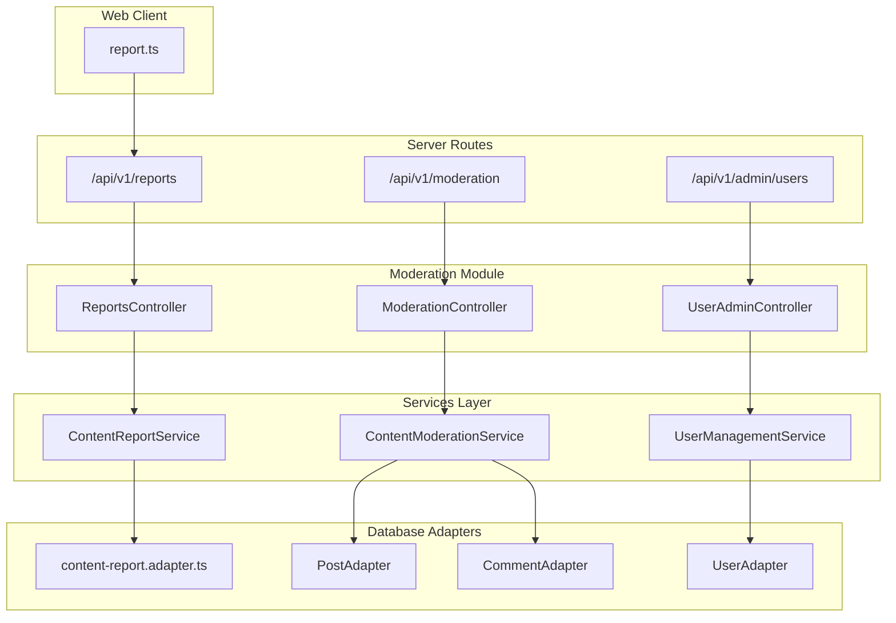
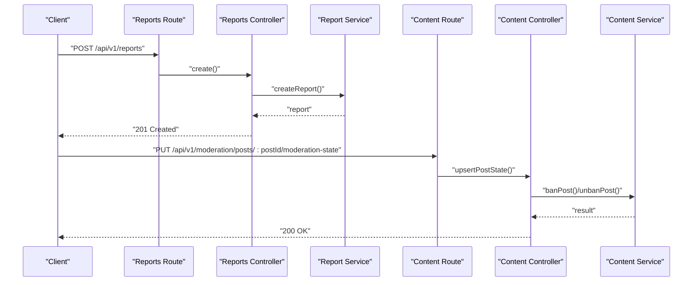
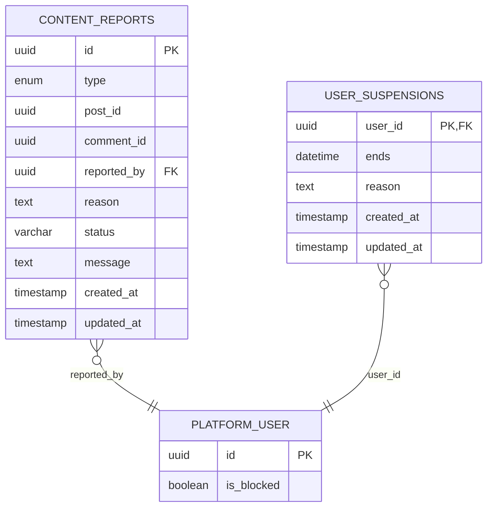
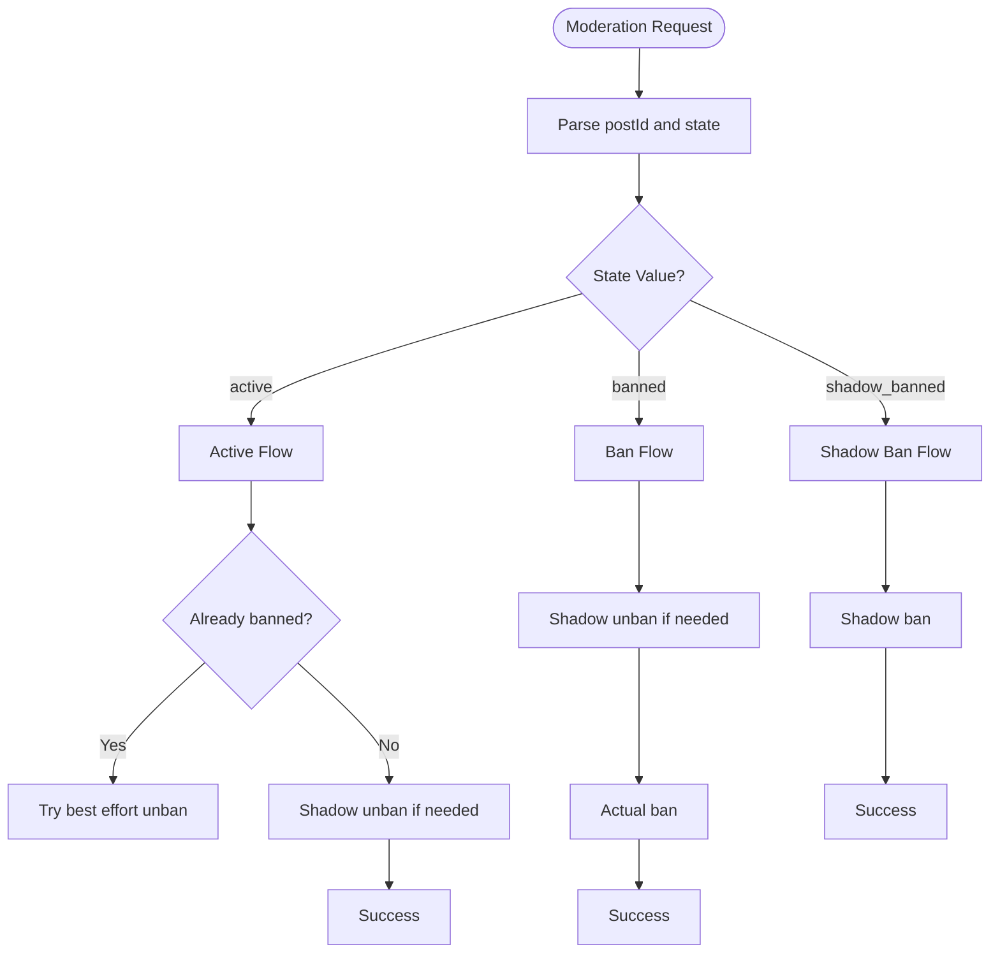
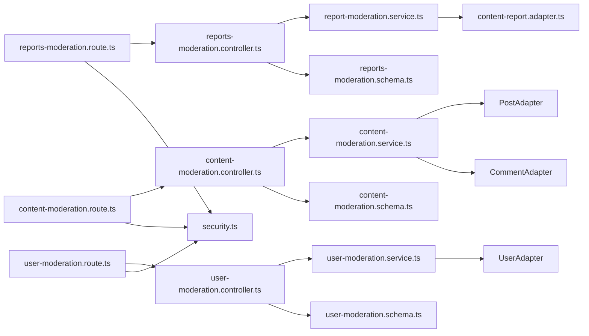

# Content Moderation API

<cite>
**Referenced Files in This Document**
- [index.ts](file://server/src/routes/index.ts)
- [content-moderation.route.ts](file://server/src/modules/moderation/content/content-moderation.route.ts)
- [content-moderation.controller.ts](file://server/src/modules/moderation/content/content-moderation.controller.ts)
- [content-moderation.schema.ts](file://server/src/modules/moderation/content/content-moderation.schema.ts)
- [content-moderation.service.ts](file://server/src/modules/moderation/content/content-moderation.service.ts)
- [reports-moderation.route.ts](file://server/src/modules/moderation/reports/reports-moderation.route.ts)
- [reports-moderation.controller.ts](file://server/src/modules/moderation/reports/reports-moderation.controller.ts)
- [reports-moderation.schema.ts](file://server/src/modules/moderation/reports/reports-moderation.schema.ts)
- [report-moderation.service.ts](file://server/src/modules/moderation/reports/report-moderation.service.ts)
- [user-moderation.route.ts](file://server/src/modules/moderation/user/user-moderation.route.ts)
- [user-moderation.controller.ts](file://server/src/modules/moderation/user/user-moderation.controller.ts)
- [user-moderation.schema.ts](file://server/src/modules/moderation/user/user-moderation.schema.ts)
- [user-moderation.service.ts](file://server/src/modules/moderation/user/user-moderation.service.ts)
- [content-report.adapter.ts](file://server/src/infra/db/adapters/content-report.adapter.ts)
- [content-report.table.ts](file://server/src/infra/db/tables/content-report.table.ts)
- [report.ts](file://web/src/services/api/report.ts)
- [rate-limit.middleware.ts](file://server/src/core/middlewares/rate-limit.middleware.ts)
- [security.ts](file://server/src/config/security.ts)
- [actions.ts](file://server/src/shared/constants/audit/actions.ts)
- [audit.types.ts](file://server/src/modules/audit/audit.types.ts)
</cite>

## Update Summary
**Changes Made**
- Complete migration from old `/manage/` content-report API to new modular `/moderation/` and `/admin/users/` endpoints
- Updated endpoint references from `/content-reports` to `/reports`, `/moderation` for content actions, and `/admin/users` for user management
- Added documentation for new modular structure with separate controllers for content, reports, and user moderation
- Enhanced filtering capabilities with improved query parameter handling
- Updated examples to reflect new endpoint patterns and state-based moderation approach

## Table of Contents
1. [Introduction](#introduction)
2. [Project Structure](#project-structure)
3. [Core Components](#core-components)
4. [Architecture Overview](#architecture-overview)
5. [Detailed Component Analysis](#detailed-component-analysis)
6. [Dependency Analysis](#dependency-analysis)
7. [Performance Considerations](#performance-considerations)
8. [Troubleshooting Guide](#troubleshooting-guide)
9. [Conclusion](#conclusion)
10. [Appendices](#appendices)

## Introduction
This document provides comprehensive API documentation for the new modular content moderation system. The API has been completely migrated from the legacy `/manage/` content-report structure to a modern modular architecture with separate controllers for content moderation, report management, and user administration. It covers user-generated content reporting, report status tracking, and moderation decision workflows. The system now supports state-based moderation actions (active, banned, shadow_banned) and enhanced filtering capabilities for efficient moderation queue management.

## Project Structure
The content moderation API is implemented as part of the server module under the new moderation namespace with a fully modular architecture:
- Routes define endpoint contracts and bind middleware for three distinct modules
- Controllers handle request parsing, orchestration, and response formatting
- Services encapsulate business logic for report creation, moderation decisions, and user management
- Adapters interact with the database via Drizzle ORM
- Schemas validate request bodies and query parameters with enhanced validation
- Frontend client integrates with the API for user reporting



**Diagram sources**
- [index.ts](file://server/src/routes/index.ts#L9-L11)
- [reports-moderation.route.ts](file://server/src/modules/moderation/reports/reports-moderation.route.ts#L1-L23)
- [content-moderation.route.ts](file://server/src/modules/moderation/content/content-moderation.route.ts#L1-L15)
- [user-moderation.route.ts](file://server/src/modules/moderation/user/user-moderation.route.ts#L1-L17)

**Section sources**
- [index.ts](file://server/src/routes/index.ts#L9-L11)
- [reports-moderation.route.ts](file://server/src/modules/moderation/reports/reports-moderation.route.ts#L1-L23)
- [content-moderation.route.ts](file://server/src/modules/moderation/content/content-moderation.route.ts#L1-L15)
- [user-moderation.route.ts](file://server/src/modules/moderation/user/user-moderation.route.ts#L1-L17)

## Core Components
- **Reports Module**: Handles user report creation, listing, filtering, and status management with enhanced query parameters
- **Content Moderation Module**: Manages post and comment state changes using state-based moderation (active, banned, shadow_banned)
- **User Administration Module**: Controls user blocking, suspension, and search functionality with proper authorization
- **Enhanced Schemas**: Strict validation for all request bodies with improved error handling
- **Modular Controllers**: Separate controllers for each moderation domain with role-based access control
- **Audit Integration**: Comprehensive audit logging for all moderation actions

**Section sources**
- [reports-moderation.controller.ts](file://server/src/modules/moderation/reports/reports-moderation.controller.ts#L1-L45)
- [content-moderation.controller.ts](file://server/src/modules/moderation/content/content-moderation.controller.ts#L1-L43)
- [user-moderation.controller.ts](file://server/src/modules/moderation/user/user-moderation.controller.ts#L1-L40)
- [reports-moderation.schema.ts](file://server/src/modules/moderation/reports/reports-moderation.schema.ts#L1-L38)
- [content-moderation.schema.ts](file://server/src/modules/moderation/content/content-moderation.schema.ts#L1-L18)
- [user-moderation.schema.ts](file://server/src/modules/moderation/user/user-moderation.schema.ts#L1-L28)

## Architecture Overview
The moderation API follows a clean, modular architecture pattern with three distinct layers:
- **HTTP Layer**: Express routes with authentication and role-based middleware
- **Application Layer**: Modular controllers with specialized business logic
- **Domain Layer**: Services implementing moderation workflows and user management
- **Infrastructure Layer**: Database adapters and audit logging integration



**Diagram sources**
- [reports-moderation.route.ts](file://server/src/modules/moderation/reports/reports-moderation.route.ts#L11-L11)
- [content-moderation.route.ts](file://server/src/modules/moderation/content/content-moderation.route.ts#L11-L12)
- [reports-moderation.controller.ts](file://server/src/modules/moderation/reports/reports-moderation.controller.ts#L8-L21)
- [content-moderation.controller.ts](file://server/src/modules/moderation/content/content-moderation.controller.ts#L31-L43)

## Detailed Component Analysis

### Endpoint Catalog
**Reports Module Endpoints** (`/api/v1/reports`)
- POST `/` - Create new content report
- GET `/` - List reports with enhanced filtering
- GET `/users/:userId` - Get reports filed by specific user
- GET `/:id` - Get report by ID
- PATCH `/:id` - Update report status
- DELETE `/:id` - Delete report
- POST `/bulk-deletion` - Bulk delete reports

**Content Moderation Endpoints** (`/api/v1/moderation`)
- PUT `/posts/:postId/moderation-state` - Set post moderation state
- PUT `/comments/:commentId/moderation-state` - Set comment moderation state

**User Administration Endpoints** (`/api/v1/admin/users`)
- GET `/` - List users for admin panel
- GET `/search` - Search users by email or username
- PUT `/:userId/moderation-state` - Set user moderation state (block/suspend)
- GET `/:userId/suspension` - Get user suspension status

**Section sources**
- [reports-moderation.route.ts](file://server/src/modules/moderation/reports/reports-moderation.route.ts#L1-L23)
- [content-moderation.route.ts](file://server/src/modules/moderation/content/content-moderation.route.ts#L1-L15)
- [user-moderation.route.ts](file://server/src/modules/moderation/user/user-moderation.route.ts#L1-L17)

### Request and Response Schemas
**Report Creation**
- Method: POST `/api/v1/reports`
- Body:
  - targetId: string (UUID, required)
  - type: "Post" | "Comment" (required)
  - reason: string (min 1 character, required)
  - message: string (min 1 character, required)
- Response: Report object with metadata and audit trail

**Report Listing with Enhanced Filtering**
- Method: GET `/api/v1/reports`
- Query Parameters:
  - page: string (optional, default "1")
  - limit: string (optional, default "10")
  - type: "Post" | "Comment" | "Both" (optional, default "Both")
  - status: string (optional, comma-separated, default "pending")
- Response: Paginated reports with enhanced filtering metadata

**Moderation State Updates**
- Method: PUT `/api/v1/moderation/posts/:postId/moderation-state`
- Path Params: postId (UUID)
- Body:
  - state: "active" | "banned" | "shadow_banned" (required)
- Response: Success message with updated content state

**User Moderation State**
- Method: PUT `/api/v1/admin/users/:userId/moderation-state`
- Path Params: userId (UUID)
- Body:
  - blocked: boolean (required)
  - suspension: object (optional)
    - ends: ISO datetime (required if suspension present)
    - reason: string (min 1 character, required if suspension present)
- Response: Success message with updated user state

**Section sources**
- [reports-moderation.schema.ts](file://server/src/modules/moderation/reports/reports-moderation.schema.ts#L5-L37)
- [content-moderation.schema.ts](file://server/src/modules/moderation/content/content-moderation.schema.ts#L11-L17)
- [user-moderation.schema.ts](file://server/src/modules/moderation/user/user-moderation.schema.ts#L16-L27)

### Data Model


**Diagram sources**
- [content-report.table.ts](file://server/src/infra/db/tables/content-report.table.ts#L5-L16)

**Section sources**
- [content-report.table.ts](file://server/src/infra/db/tables/content-report.table.ts#L1-L20)
- [content-report.adapter.ts](file://server/src/infra/db/adapters/content-report.adapter.ts#L1-L121)

### Moderation Decision Workflows
**State-Based Moderation Approach**
The new system uses a state-based approach instead of discrete actions:
- **Active**: Content is visible and accessible
- **Banned**: Content is permanently removed and inaccessible
- **Shadow Banned**: Content is hidden from public view but accessible to authors

**Post Moderation Flow**


**Diagram sources**
- [content-moderation.controller.ts](file://server/src/modules/moderation/content/content-moderation.controller.ts#L31-L43)
- [content-moderation.service.ts](file://server/src/modules/moderation/content/content-moderation.service.ts#L7-L41)

**Section sources**
- [content-moderation.controller.ts](file://server/src/modules/moderation/content/content-moderation.controller.ts#L1-L43)
- [content-moderation.service.ts](file://server/src/modules/moderation/content/content-moderation.service.ts#L6-L221)

### Admin Moderation Interfaces
**Enhanced User Management**
- **User Listing**: Admin-only access to user management with pagination
- **User Search**: Flexible search by email or username with validation
- **Moderation State Control**: Block/unblock users with proper state validation
- **Suspension Management**: Controlled suspension with end date validation

**Audit Integration**
- Comprehensive audit logging for all moderation actions
- Role-based audit events (admin actions, user actions)
- Metadata preservation for compliance and review

**Section sources**
- [user-moderation.route.ts](file://server/src/modules/moderation/user/user-moderation.route.ts#L11-L15)
- [user-moderation.controller.ts](file://server/src/modules/moderation/user/user-moderation.controller.ts#L28-L40)
- [user-moderation.service.ts](file://server/src/modules/moderation/user/user-moderation.service.ts#L5-L167)
- [actions.ts](file://server/src/shared/constants/audit/actions.ts#L1-L66)

### Automated Content Filtering Integration
**Enhanced Filtering Capabilities**
- **Multi-status Filtering**: Support for comma-separated status values
- **Type-based Filtering**: Filter by content type (Post, Comment, Both)
- **Pagination Support**: Efficient handling of large report datasets
- **Real-time Updates**: Automatic report status updates when content is moderated

**Audit Trail Integration**
- All moderation decisions are logged with full metadata
- Compliance-ready audit logs for regulatory requirements
- Traceable moderation workflows for dispute resolution

**Section sources**
- [reports-moderation.schema.ts](file://server/src/modules/moderation/reports/reports-moderation.schema.ts#L20-L29)
- [report-moderation.service.ts](file://server/src/modules/moderation/reports/report-moderation.service.ts#L70-L91)
- [actions.ts](file://server/src/shared/constants/audit/actions.ts#L37-L41)

### Manual Review Workflows
**Enhanced Moderation Queues**
- **Smart Filtering**: Advanced filtering by type and status combinations
- **Priority Handling**: Default filtering focuses on pending reports
- **Bulk Operations**: Efficient batch processing for high-volume moderation
- **Evidence Management**: Structured handling of report evidence and context

**Section sources**
- [reports-moderation.controller.ts](file://server/src/modules/moderation/reports/reports-moderation.controller.ts#L23-L41)
- [reports-moderation.schema.ts](file://server/src/modules/moderation/reports/reports-moderation.schema.ts#L20-L29)

### Examples

#### Report Submission (Updated)
**Endpoint**: POST `/api/v1/reports`
**Payload**:
```json
{
  "targetId": "123e4567-e89b-12d3-a456-426614174000",
  "type": "Post",
  "reason": "Spam content",
  "message": "This post contains spam links"
}
```
**Client Usage**:
- [reportApi.create](file://web/src/services/api/report.ts#L4-L12)

**Section sources**
- [reports-moderation.schema.ts](file://server/src/modules/moderation/reports/reports-moderation.schema.ts#L5-L10)
- [report.ts](file://web/src/services/api/report.ts#L1-L13)

#### Moderation Queue Management (Enhanced)
**Endpoint**: GET `/api/v1/reports`
**Query Parameters**:
- `type=Post&status=pending,resolved&page=1&limit=20`
- `type=Comment&status=pending&page=2&limit=15`

**Response Includes**:
- Enhanced pagination metadata
- Filter application information
- Total counts for each filter combination

**Section sources**
- [reports-moderation.schema.ts](file://server/src/modules/moderation/reports/reports-moderation.schema.ts#L20-L29)
- [reports-moderation.controller.ts](file://server/src/modules/moderation/reports/reports-moderation.controller.ts#L23-L41)

#### State-Based Moderation (New)
**Endpoint**: PUT `/api/v1/moderation/posts/:postId/moderation-state`
**Payload**:
```json
{
  "state": "banned"
}
```

**Benefits**:
- Simplified state management
- Reduced API complexity
- Better audit trail clarity
- Improved error handling

**Section sources**
- [content-moderation.schema.ts](file://server/src/modules/moderation/content/content-moderation.schema.ts#L11-L13)
- [content-moderation.controller.ts](file://server/src/modules/moderation/content/content-moderation.controller.ts#L31-L43)

### Rate Limiting and False Report Prevention
**Enhanced Security Measures**
- **Rate Limiting**: Middleware available for sensitive endpoints
- **Authentication**: JWT-based authentication for all moderation endpoints
- **Authorization**: Role-based access control (admin, superadmin)
- **Input Validation**: Comprehensive Zod schema validation
- **Error Handling**: Graceful error handling with meaningful messages

**Recommendations**:
- Apply rate limits to report submission endpoints
- Implement IP-based throttling for high-risk scenarios
- Monitor suspicious activity via enhanced audit logs
- Use CAPTCHA for high-volume submissions

**Section sources**
- [rate-limit.middleware.ts](file://server/src/core/middlewares/rate-limit.middleware.ts#L1-L9)
- [security.ts](file://server/src/config/security.ts#L1-L14)

### Moderation Team Coordination
**Enhanced Audit and Coordination**
- **Comprehensive Auditing**: Detailed audit logs for all moderation actions
- **Role-based Events**: Distinct audit events for different roles and actions
- **Metadata Preservation**: Full context preservation for dispute resolution
- **Team Coordination**: Clear attribution of moderation decisions

**Audit Event Types**:
- `admin:moderated:content` - Content moderation actions
- `admin:deleted:report` - Report deletion actions
- `user:reported:content` - User report creation
- `admin:suspended:user` - User suspension actions

**Section sources**
- [actions.ts](file://server/src/shared/constants/audit/actions.ts#L31-L44)
- [audit.types.ts](file://server/src/modules/audit/audit.types.ts#L7-L21)

## Dependency Analysis


**Diagram sources**
- [reports-moderation.route.ts](file://server/src/modules/moderation/reports/reports-moderation.route.ts#L1-L23)
- [content-moderation.route.ts](file://server/src/modules/moderation/content/content-moderation.route.ts#L1-L15)
- [user-moderation.route.ts](file://server/src/modules/moderation/user/user-moderation.route.ts#L1-L17)

**Section sources**
- [reports-moderation.route.ts](file://server/src/modules/moderation/reports/reports-moderation.route.ts#L1-L23)
- [content-moderation.route.ts](file://server/src/modules/moderation/content/content-moderation.route.ts#L1-L15)
- [user-moderation.route.ts](file://server/src/modules/moderation/user/user-moderation.route.ts#L1-L17)

## Performance Considerations
- **Enhanced Pagination**: Improved pagination with better performance for large datasets
- **Smart Filtering**: Optimized filtering with database-level query construction
- **State-based Moderation**: Reduced API complexity and improved performance
- **Audit Sampling**: Intelligent audit logging with configurable sampling rates
- **Connection Pooling**: Optimized database connections for high-concurrency scenarios

## Troubleshooting Guide
**Common Issues and Resolutions**:
- **Invalid Report ID**: Ensure UUID format for all ID parameters
- **State Validation Errors**: Use only allowed state values (active, banned, shadow_banned)
- **Suspension Validation**: Ensure suspension end dates are in the future
- **Filter Parameter Issues**: Use comma-separated values for status filtering
- **Authorization Errors**: Ensure proper admin role for restricted endpoints

**Enhanced Error Handling**:
- **Validation Errors**: Detailed Zod schema validation errors
- **Business Logic Errors**: Meaningful error messages for state conflicts
- **Audit Failures**: Graceful handling of audit logging failures
- **Database Errors**: Proper error propagation with context

**Section sources**
- [reports-moderation.schema.ts](file://server/src/modules/moderation/reports/reports-moderation.schema.ts#L20-L29)
- [content-moderation.schema.ts](file://server/src/modules/moderation/content/content-moderation.schema.ts#L11-L17)
- [user-moderation.schema.ts](file://server/src/modules/moderation/user/user-moderation.schema.ts#L16-L27)

## Conclusion
The new modular content moderation API provides a comprehensive, scalable solution for content management with enhanced security, better user experience, and improved audit capabilities. The migration from the legacy `/manage/` structure to the new `/moderation/` and `/admin/users/` endpoints offers better organization, clearer separation of concerns, and more intuitive API design. The state-based moderation approach simplifies complex workflows while maintaining full auditability and compliance readiness.

## Appendices

### Endpoint Reference Summary
**Reports Module** (`/api/v1/reports`)
- POST `/` - Create report
- GET `/` - List reports with filtering
- GET `/users/:userId` - Get user reports
- GET `/:id` - Get report by ID
- PATCH `/:id` - Update report status
- DELETE `/:id` - Delete report
- POST `/bulk-deletion` - Bulk delete reports

**Content Moderation** (`/api/v1/moderation`)
- PUT `/posts/:postId/moderation-state` - Set post state
- PUT `/comments/:commentId/moderation-state` - Set comment state

**User Administration** (`/api/v1/admin/users`)
- GET `/` - List users
- GET `/search` - Search users
- PUT `/:userId/moderation-state` - Set user moderation state
- GET `/:userId/suspension` - Get suspension status

**Section sources**
- [reports-moderation.route.ts](file://server/src/modules/moderation/reports/reports-moderation.route.ts#L1-L23)
- [content-moderation.route.ts](file://server/src/modules/moderation/content/content-moderation.route.ts#L1-L15)
- [user-moderation.route.ts](file://server/src/modules/moderation/user/user-moderation.route.ts#L1-L17)