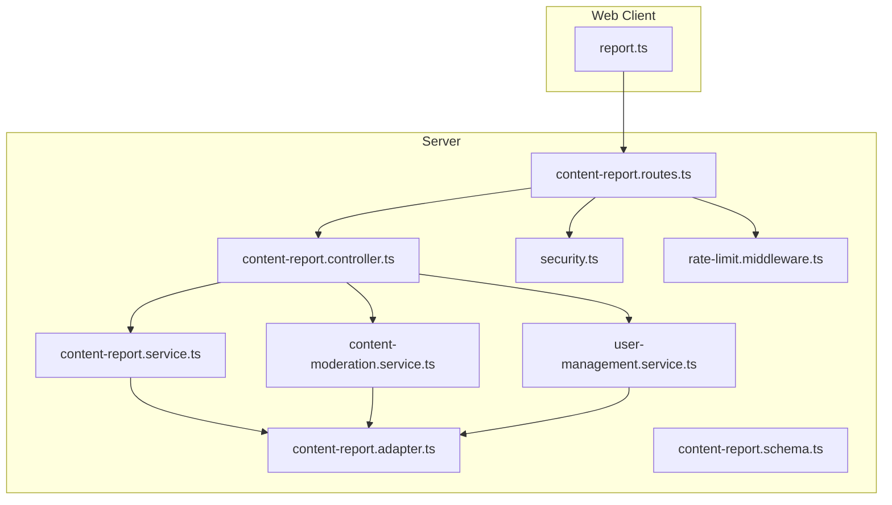
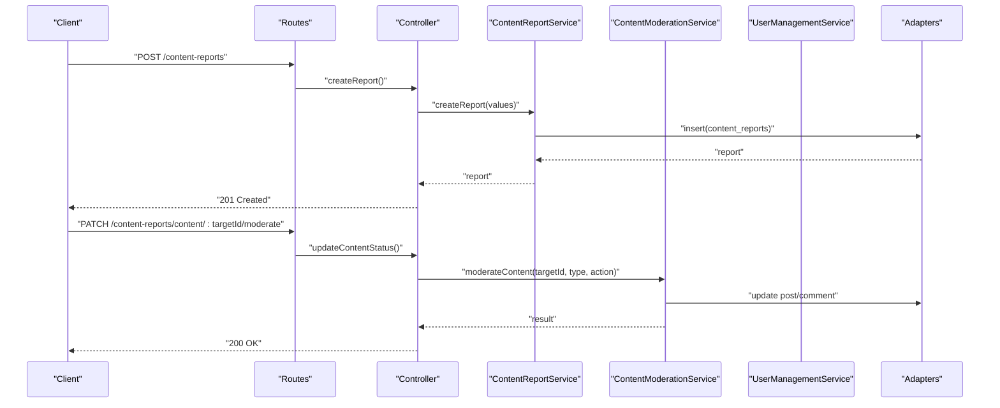
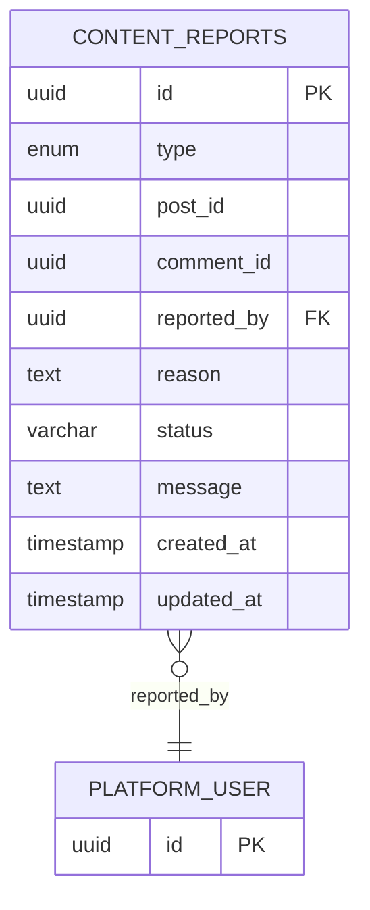
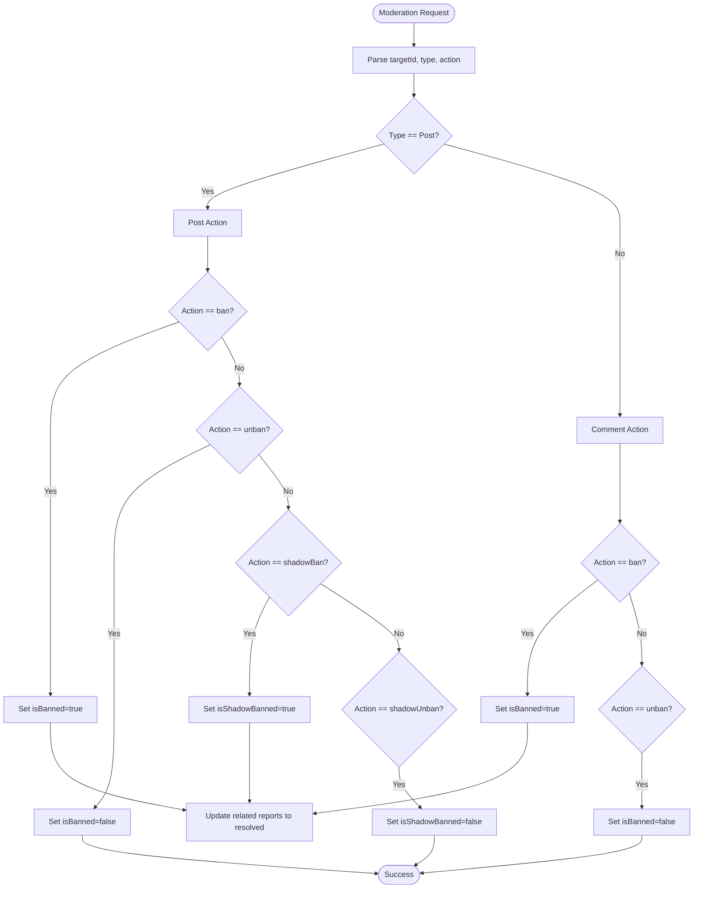
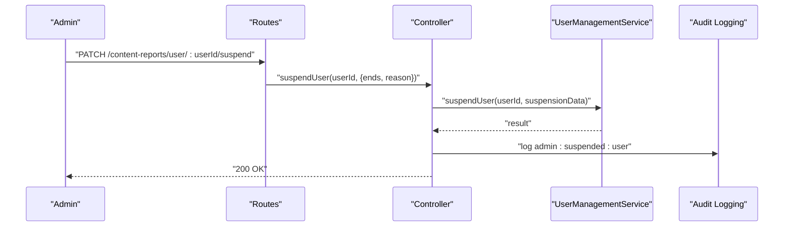
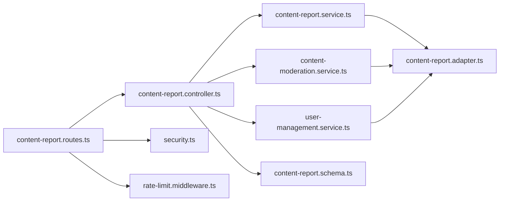

# Content Moderation API

<cite>
**Referenced Files in This Document**
- [content-report.routes.ts](file://server/src/modules/content-report/content-report.routes.ts)
- [content-report.controller.ts](file://server/src/modules/content-report/content-report.controller.ts)
- [content-report.service.ts](file://server/src/modules/content-report/content-report.service.ts)
- [content-moderation.service.ts](file://server/src/modules/content-report/content-moderation.service.ts)
- [user-management.service.ts](file://server/src/modules/content-report/user-management.service.ts)
- [content-report.schema.ts](file://server/src/modules/content-report/content-report.schema.ts)
- [content-report.adapter.ts](file://server/src/infra/db/adapters/content-report.adapter.ts)
- [content-report.table.ts](file://server/src/infra/db/tables/content-report.table.ts)
- [report.ts](file://web/src/services/api/report.ts)
- [rate-limit.middleware.ts](file://server/src/core/middlewares/rate-limit.middleware.ts)
- [security.ts](file://server/src/config/security.ts)
- [actions.ts](file://server/src/shared/constants/audit/actions.ts)
- [audit.types.ts](file://server/src/modules/audit/audit.types.ts)
</cite>

## Table of Contents
1. [Introduction](#introduction)
2. [Project Structure](#project-structure)
3. [Core Components](#core-components)
4. [Architecture Overview](#architecture-overview)
5. [Detailed Component Analysis](#detailed-component-analysis)
6. [Dependency Analysis](#dependency-analysis)
7. [Performance Considerations](#performance-considerations)
8. [Troubleshooting Guide](#troubleshooting-guide)
9. [Conclusion](#conclusion)
10. [Appendices](#appendices)

## Introduction
This document provides comprehensive API documentation for content moderation endpoints. It covers user-generated content reporting, report status tracking, and moderation decision workflows. It also documents admin moderation interfaces, user management controls, and audit logging. The API supports user flagging, moderation queues, and actions such as approve, reject, and delete. Request schemas for report submissions, evidence collection, and moderation reasoning are defined. Examples demonstrate report submission, moderation queue management, and appeal processes. Additional topics include rate limiting, false report prevention, and moderation team coordination features.

## Project Structure
The content moderation API is implemented as part of the server module under the content-report namespace. It follows a layered architecture:
- Routes define endpoint contracts and bind middleware.
- Controllers handle request parsing, orchestration, and response formatting.
- Services encapsulate business logic for report creation, moderation decisions, and user management.
- Adapters interact with the database via Drizzle ORM.
- Schemas validate request bodies and query parameters.
- Frontend client integrates with the API for user reporting.

**Diagram sources**
- [content-report.routes.ts](file://server/src/modules/content-report/content-report.routes.ts#L1-L37)
- [content-report.controller.ts](file://server/src/modules/content-report/content-report.controller.ts#L1-L246)
- [content-report.service.ts](file://server/src/modules/content-report/content-report.service.ts#L1-L159)
- [content-moderation.service.ts](file://server/src/modules/content-report/content-moderation.service.ts#L1-L220)
- [user-management.service.ts](file://server/src/modules/content-report/user-management.service.ts#L1-L166)
- [content-report.adapter.ts](file://server/src/infra/db/adapters/content-report.adapter.ts#L1-L120)
- [content-report.schema.ts](file://server/src/modules/content-report/content-report.schema.ts#L1-L63)
- [security.ts](file://server/src/config/security.ts#L1-L14)
- [rate-limit.middleware.ts](file://server/src/core/middlewares/rate-limit.middleware.ts#L1-L9)
- [report.ts](file://web/src/services/api/report.ts#L1-L13)

**Section sources**
- [content-report.routes.ts](file://server/src/modules/content-report/content-report.routes.ts#L1-L37)
- [content-report.controller.ts](file://server/src/modules/content-report/content-report.controller.ts#L1-L246)
- [content-report.service.ts](file://server/src/modules/content-report/content-report.service.ts#L1-L159)
- [content-moderation.service.ts](file://server/src/modules/content-report/content-moderation.service.ts#L1-L220)
- [user-management.service.ts](file://server/src/modules/content-report/user-management.service.ts#L1-L166)
- [content-report.adapter.ts](file://server/src/infra/db/adapters/content-report.adapter.ts#L1-L120)
- [content-report.schema.ts](file://server/src/modules/content-report/content-report.schema.ts#L1-L63)
- [security.ts](file://server/src/config/security.ts#L1-L14)
- [rate-limit.middleware.ts](file://server/src/core/middlewares/rate-limit.middleware.ts#L1-L9)
- [report.ts](file://web/src/services/api/report.ts#L1-L13)

## Core Components
- Routes: Define endpoints for report management, content moderation, and user management. Authentication middleware is applied globally.
- Controller: Orchestrates requests, validates inputs, invokes services, records audits, and returns standardized responses.
- Services:
  - ContentReportService: Handles report lifecycle (create, fetch, update status, delete, bulk delete).
  - ContentModerationService: Applies moderation actions to posts/comments (ban, unban, shadow ban).
  - UserManagementService: Blocks/unblocks users, suspends users, queries users, and checks suspension status.
- Adapters: Persist and query content reports and related entities.
- Schemas: Enforce strict validation for request bodies and query parameters.
- Audit: Centralized audit logging for moderation actions and administrative operations.

**Section sources**
- [content-report.routes.ts](file://server/src/modules/content-report/content-report.routes.ts#L1-L37)
- [content-report.controller.ts](file://server/src/modules/content-report/content-report.controller.ts#L1-L246)
- [content-report.service.ts](file://server/src/modules/content-report/content-report.service.ts#L1-L159)
- [content-moderation.service.ts](file://server/src/modules/content-report/content-moderation.service.ts#L1-L220)
- [user-management.service.ts](file://server/src/modules/content-report/user-management.service.ts#L1-L166)
- [content-report.schema.ts](file://server/src/modules/content-report/content-report.schema.ts#L1-L63)
- [content-report.adapter.ts](file://server/src/infra/db/adapters/content-report.adapter.ts#L1-L120)
- [actions.ts](file://server/src/shared/constants/audit/actions.ts#L1-L66)

## Architecture Overview
The moderation API follows a clean architecture pattern:
- HTTP layer: Express routes and middleware.
- Application layer: Controllers and services.
- Domain layer: Business rules for moderation and user management.
- Infrastructure layer: Database adapters and audit logging.

**Diagram sources**
- [content-report.routes.ts](file://server/src/modules/content-report/content-report.routes.ts#L1-L37)
- [content-report.controller.ts](file://server/src/modules/content-report/content-report.controller.ts#L1-L246)
- [content-report.service.ts](file://server/src/modules/content-report/content-report.service.ts#L1-L159)
- [content-moderation.service.ts](file://server/src/modules/content-report/content-moderation.service.ts#L1-L220)
- [content-report.adapter.ts](file://server/src/infra/db/adapters/content-report.adapter.ts#L1-L120)

## Detailed Component Analysis

### Endpoint Catalog
- Report Management
  - POST /content-reports
  - GET /content-reports
  - GET /content-reports/:id
  - GET /content-reports/user/:userId
  - PATCH /content-reports/:id/status
  - DELETE /content-reports/:id
  - POST /content-reports/bulk-delete
- Content Moderation
  - PATCH /content-reports/content/:targetId/moderate
  - Legacy routes for backward compatibility:
    - PATCH /content-reports/post/:postId/ban
    - PATCH /content-reports/post/:postId/unban
    - PATCH /content-reports/post/:postId/shadow-ban
    - PATCH /content-reports/post/:postId/shadow-unban
    - PATCH /content-reports/comment/:commentId/ban
    - PATCH /content-reports/comment/:commentId/unban
- User Management
  - PATCH /content-reports/user/:userId/block
  - PATCH /content-reports/user/:userId/unblock
  - PATCH /content-reports/user/:userId/suspend
  - GET /content-reports/user/:userId/suspension
  - GET /content-reports/users/search

**Section sources**
- [content-report.routes.ts](file://server/src/modules/content-report/content-report.routes.ts#L1-L37)

### Request and Response Schemas
- Create Report
  - Method: POST
  - Path: /content-reports
  - Body:
    - targetId: string (required)
    - type: "Post" | "Comment" (required)
    - reason: string (required)
    - message: string (required)
  - Response: Report object with metadata
- Get Reports
  - Method: GET
  - Path: /content-reports
  - Query:
    - page: number (optional, default 1)
    - limit: number (optional, default 10)
    - type: "Post" | "Comment" | "Both" (optional, default "Both")
    - status: string[] (optional, comma-separated, defaults to pending)
    - fields: string (optional)
  - Response: Array of reports with pagination metadata
- Get Report by ID
  - Method: GET
  - Path: /content-reports/:id
  - Path Params: id (uuid)
  - Response: Single report
- Get User Reports
  - Method: GET
  - Path: /content-reports/user/:userId
  - Path Params: userId (number string)
  - Response: Array of reports filed by user
- Update Report Status
  - Method: PATCH
  - Path: /content-reports/:id/status
  - Path Params: id (uuid)
  - Body:
    - status: "pending" | "resolved" | "ignored" (required)
  - Response: Updated report
- Delete Report
  - Method: DELETE
  - Path: /content-reports/:id
  - Path Params: id (uuid)
  - Response: Deletion confirmation
- Bulk Delete Reports
  - Method: POST
  - Path: /content-reports/bulk-delete
  - Body:
    - reportIds: uuid[] (required)
  - Response: Deletion summary
- Moderate Content
  - Method: PATCH
  - Path: /content-reports/content/:targetId/moderate
  - Path Params: targetId (number string)
  - Body:
    - action: "ban" | "unban" | "shadowBan" | "shadowUnban" (required)
    - type: "Post" | "Comment" (required)
  - Response: Moderation result
- Block/Unblock User
  - Method: PATCH
  - Path: /content-reports/user/:userId/block | /content-reports/user/:userId/unblock
  - Path Params: userId (uuid)
  - Response: User status update
- Suspend User
  - Method: PATCH
  - Path: /content-reports/user/:userId/suspend
  - Path Params: userId (uuid)
  - Body:
    - ends: ISO datetime (required)
    - reason: string (required)
  - Response: Suspension confirmation
- Suspension Status
  - Method: GET
  - Path: /content-reports/user/:userId/suspension
  - Path Params: userId (uuid)
  - Response: Suspension info
- Search Users
  - Method: GET
  - Path: /content-reports/users/search
  - Query:
    - email: string (optional)
    - username: string (optional)
  - Response: Matching users (without exposing email)

**Section sources**
- [content-report.schema.ts](file://server/src/modules/content-report/content-report.schema.ts#L1-L63)
- [content-report.routes.ts](file://server/src/modules/content-report/content-report.routes.ts#L1-L37)
- [content-report.controller.ts](file://server/src/modules/content-report/content-report.controller.ts#L1-L246)

### Data Model

**Diagram sources**
- [content-report.table.ts](file://server/src/infra/db/tables/content-report.table.ts#L1-L20)

**Section sources**
- [content-report.table.ts](file://server/src/infra/db/tables/content-report.table.ts#L1-L20)
- [content-report.adapter.ts](file://server/src/infra/db/adapters/content-report.adapter.ts#L1-L120)

### Moderation Decision Workflows
- Ban/Unban Post
  - Validate post existence and current state.
  - Apply moderation action and update related reports to resolved.
- Shadow Ban/Unban Post
  - Similar to ban but marks content hidden from public view.
- Ban/Unban Comment
  - Validate comment existence and current state.
  - Apply moderation action and update related reports to resolved.
- Content moderation action mapping:
  - ban -> banPost or banComment
  - unban -> unbanPost or unbanComment
  - shadowBan -> shadowBanPost
  - shadowUnban -> shadowUnbanPost

**Diagram sources**
- [content-moderation.service.ts](file://server/src/modules/content-report/content-moderation.service.ts#L1-L220)
- [content-report.service.ts](file://server/src/modules/content-report/content-report.service.ts#L112-L127)

**Section sources**
- [content-moderation.service.ts](file://server/src/modules/content-report/content-moderation.service.ts#L1-L220)
- [content-report.service.ts](file://server/src/modules/content-report/content-report.service.ts#L112-L127)

### Admin Moderation Interfaces
- Update report status: Change status to pending/resolved/ignored.
- Bulk delete reports: Remove multiple reports atomically.
- User management:
  - Block/unblock users.
  - Suspend users with end date and reason.
  - Search users by email or username.
  - Fetch suspension status.

**Diagram sources**
- [content-report.routes.ts](file://server/src/modules/content-report/content-report.routes.ts#L29-L36)
- [content-report.controller.ts](file://server/src/modules/content-report/content-report.controller.ts#L177-L199)
- [user-management.service.ts](file://server/src/modules/content-report/user-management.service.ts#L72-L107)
- [actions.ts](file://server/src/shared/constants/audit/actions.ts#L31-L33)

**Section sources**
- [content-report.routes.ts](file://server/src/modules/content-report/content-report.routes.ts#L29-L36)
- [content-report.controller.ts](file://server/src/modules/content-report/content-report.controller.ts#L151-L205)
- [user-management.service.ts](file://server/src/modules/content-report/user-management.service.ts#L1-L166)
- [actions.ts](file://server/src/shared/constants/audit/actions.ts#L1-L66)

### Automated Content Filtering Integration
- The moderation service applies actions to posts/comments based on targetId and type.
- Related reports are automatically updated to resolved upon moderation action.
- Audit logs capture all moderation decisions for compliance and review.

**Section sources**
- [content-moderation.service.ts](file://server/src/modules/content-report/content-moderation.service.ts#L182-L217)
- [content-report.service.ts](file://server/src/modules/content-report/content-report.service.ts#L112-L127)
- [actions.ts](file://server/src/shared/constants/audit/actions.ts#L37-L41)

### Manual Review Workflows
- Reports are filtered by type and status for moderation queues.
- Moderators can update report status to resolved/ignored after reviewing evidence.
- Audit trail ensures transparency and accountability.

**Section sources**
- [content-report.routes.ts](file://server/src/modules/content-report/content-report.routes.ts#L10-L16)
- [content-report.controller.ts](file://server/src/modules/content-report/content-report.controller.ts#L34-L54)
- [content-report.service.ts](file://server/src/modules/content-report/content-report.service.ts#L70-L91)
- [actions.ts](file://server/src/shared/constants/audit/actions.ts#L42-L44)

### Examples

#### Report Submission
- Endpoint: POST /content-reports
- Payload:
  - targetId: string
  - type: "Post" | "Comment"
  - reason: string
  - message: string
- Client usage reference:
  - [reportApi.create](file://web/src/services/api/report.ts#L4-L12)

**Section sources**
- [content-report.schema.ts](file://server/src/modules/content-report/content-report.schema.ts#L5-L10)
- [report.ts](file://web/src/services/api/report.ts#L1-L13)

#### Moderation Queue Management
- Endpoint: GET /content-reports
- Query parameters:
  - type: "Post" | "Comment" | "Both"
  - status: "pending,resolved,ignored" (comma-separated)
  - page: number
  - limit: number
- Response includes pagination metadata for queue navigation.

**Section sources**
- [content-report.schema.ts](file://server/src/modules/content-report/content-report.schema.ts#L24-L34)
- [content-report.controller.ts](file://server/src/modules/content-report/content-report.controller.ts#L34-L54)
- [content-report.service.ts](file://server/src/modules/content-report/content-report.service.ts#L70-L91)

#### Appeal Processes
- Appeals can be managed by updating report status to resolved/ignored after review.
- Audit logs preserve evidence of decisions for appeals.

**Section sources**
- [content-report.schema.ts](file://server/src/modules/content-report/content-report.schema.ts#L12-L14)
- [content-report.controller.ts](file://server/src/modules/content-report/content-report.controller.ts#L73-L86)
- [actions.ts](file://server/src/shared/constants/audit/actions.ts#L44-L44)

### Rate Limiting and False Report Prevention
- Rate limiting middleware is available and can be applied to sensitive endpoints.
- Security middleware (CORS, Helmet) is configured globally.

Recommendations:
- Apply rate limits to report submission and moderation endpoints.
- Implement IP/device-based throttling for repeated submissions.
- Add CAPTCHA or challenge-response for high-risk scenarios.
- Monitor suspicious activity via audit logs.

**Section sources**
- [rate-limit.middleware.ts](file://server/src/core/middlewares/rate-limit.middleware.ts#L1-L9)
- [security.ts](file://server/src/config/security.ts#L1-L14)

### Moderation Team Coordination
- Audit actions include admin:* variants for bans, suspensions, and report updates.
- Audit event structure supports role, entity, and metadata for traceability.

**Section sources**
- [actions.ts](file://server/src/shared/constants/audit/actions.ts#L31-L44)
- [audit.types.ts](file://server/src/modules/audit/audit.types.ts#L7-L21)

## Dependency Analysis

**Diagram sources**
- [content-report.routes.ts](file://server/src/modules/content-report/content-report.routes.ts#L1-L37)
- [content-report.controller.ts](file://server/src/modules/content-report/content-report.controller.ts#L1-L246)
- [content-report.service.ts](file://server/src/modules/content-report/content-report.service.ts#L1-L159)
- [content-moderation.service.ts](file://server/src/modules/content-report/content-moderation.service.ts#L1-L220)
- [user-management.service.ts](file://server/src/modules/content-report/user-management.service.ts#L1-L166)
- [content-report.adapter.ts](file://server/src/infra/db/adapters/content-report.adapter.ts#L1-L120)
- [content-report.schema.ts](file://server/src/modules/content-report/content-report.schema.ts#L1-L63)
- [security.ts](file://server/src/config/security.ts#L1-L14)
- [rate-limit.middleware.ts](file://server/src/core/middlewares/rate-limit.middleware.ts#L1-L9)

**Section sources**
- [content-report.routes.ts](file://server/src/modules/content-report/content-report.routes.ts#L1-L37)
- [content-report.controller.ts](file://server/src/modules/content-report/content-report.controller.ts#L1-L246)
- [content-report.service.ts](file://server/src/modules/content-report/content-report.service.ts#L1-L159)
- [content-moderation.service.ts](file://server/src/modules/content-report/content-moderation.service.ts#L1-L220)
- [user-management.service.ts](file://server/src/modules/content-report/user-management.service.ts#L1-L166)
- [content-report.adapter.ts](file://server/src/infra/db/adapters/content-report.adapter.ts#L1-L120)
- [content-report.schema.ts](file://server/src/modules/content-report/content-report.schema.ts#L1-L63)
- [security.ts](file://server/src/config/security.ts#L1-L14)
- [rate-limit.middleware.ts](file://server/src/core/middlewares/rate-limit.middleware.ts#L1-L9)

## Performance Considerations
- Pagination: Use page and limit parameters to avoid large result sets.
- Filtering: Filter by type and status to reduce workload on moderation queues.
- Batch operations: Prefer bulk delete for managing large volumes of reports.
- Audit sampling: Sampling reduces overhead while preserving insights.

[No sources needed since this section provides general guidance]

## Troubleshooting Guide
Common issues and resolutions:
- Invalid report ID or user ID:
  - Ensure UUID format for report/user IDs.
  - Validate numeric string for user IDs where applicable.
- Invalid status value:
  - Allowed values: pending, resolved, ignored.
- Target not found:
  - Verify post/comment exists before moderation.
- Already banned/already blocked:
  - Check current state before applying actions.
- Suspensions:
  - Ensure end date is in the future.

Audit logs:
- Use audit actions to trace moderation decisions and administrative actions.

**Section sources**
- [content-report.schema.ts](file://server/src/modules/content-report/content-report.schema.ts#L16-L18)
- [content-report.service.ts](file://server/src/modules/content-report/content-report.service.ts#L93-L100)
- [content-moderation.service.ts](file://server/src/modules/content-report/content-moderation.service.ts#L11-L19)
- [user-management.service.ts](file://server/src/modules/content-report/user-management.service.ts#L15-L18)
- [actions.ts](file://server/src/shared/constants/audit/actions.ts#L31-L44)

## Conclusion
The content moderation API provides a robust set of endpoints for user reporting, moderation actions, and admin controls. It enforces strict validation, maintains audit trails, and supports scalable moderation workflows. By leveraging rate limiting, structured schemas, and audit logging, the system ensures reliability, transparency, and ease of coordination for moderation teams.

[No sources needed since this section summarizes without analyzing specific files]

## Appendices

### Endpoint Reference Summary
- POST /content-reports
- GET /content-reports
- GET /content-reports/:id
- GET /content-reports/user/:userId
- PATCH /content-reports/:id/status
- DELETE /content-reports/:id
- POST /content-reports/bulk-delete
- PATCH /content-reports/content/:targetId/moderate
- PATCH /content-reports/user/:userId/block
- PATCH /content-reports/user/:userId/unblock
- PATCH /content-reports/user/:userId/suspend
- GET /content-reports/user/:userId/suspension
- GET /content-reports/users/search

**Section sources**
- [content-report.routes.ts](file://server/src/modules/content-report/content-report.routes.ts#L1-L37)