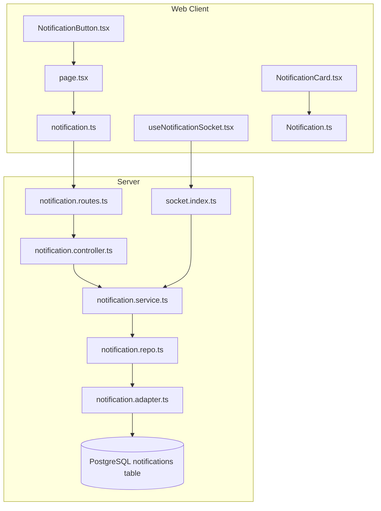
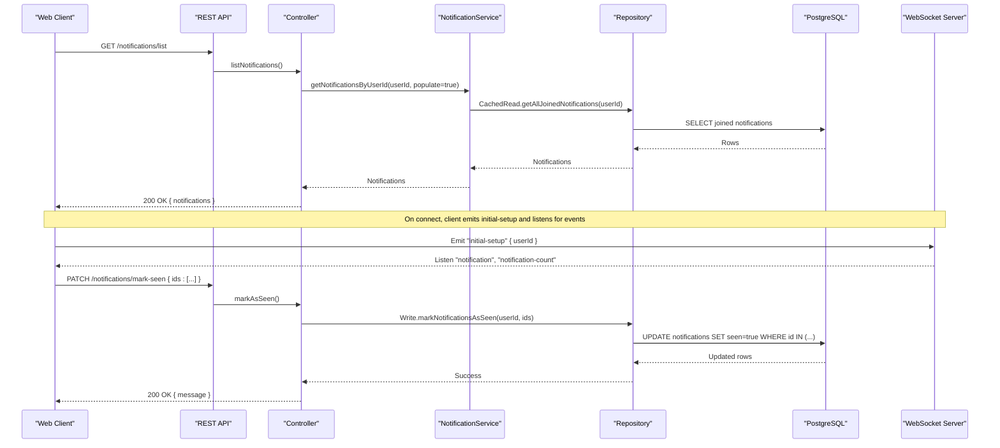
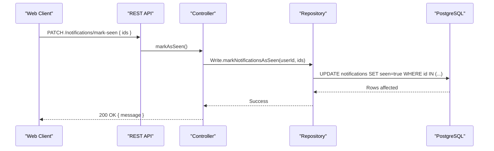
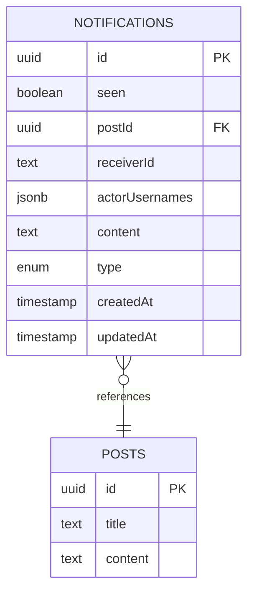
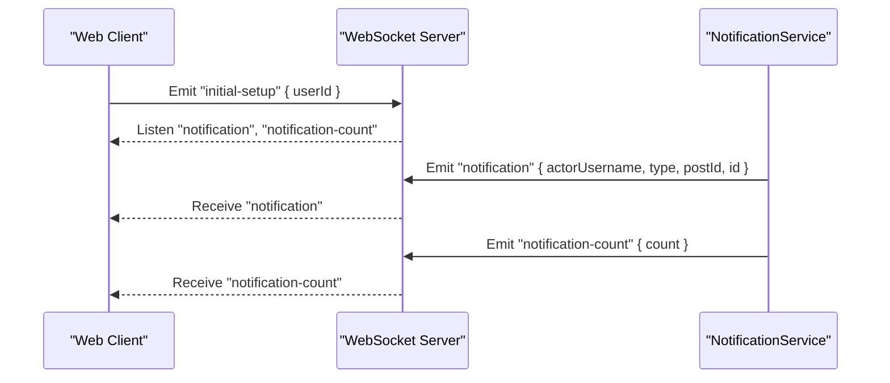
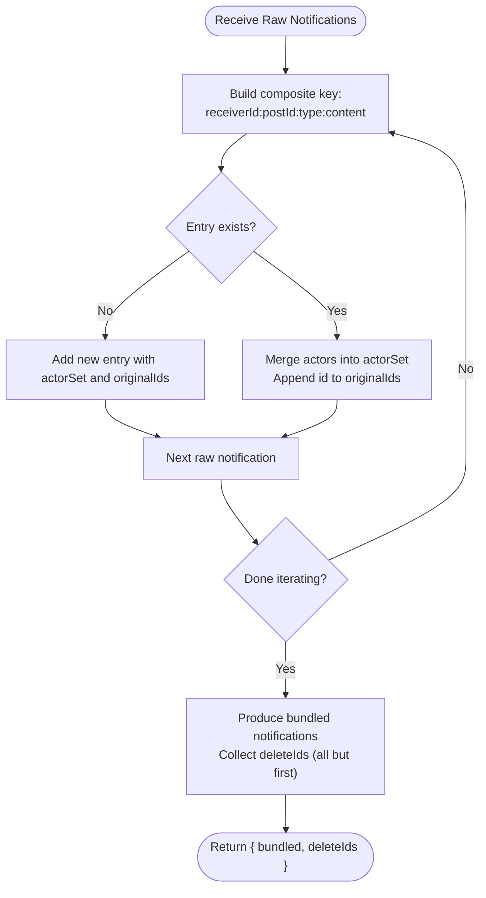
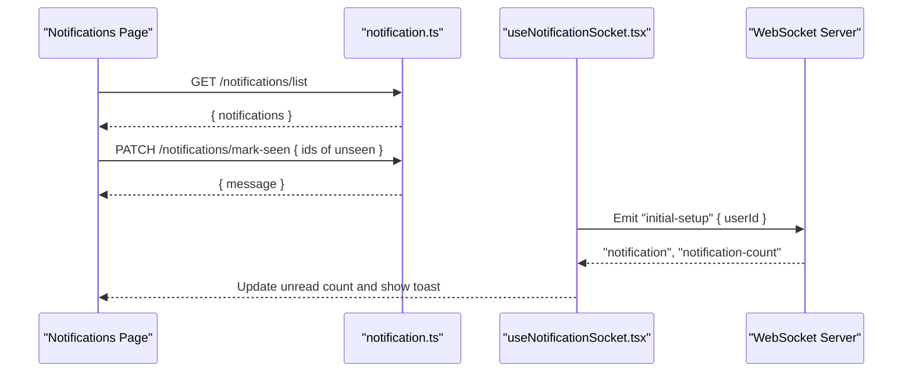
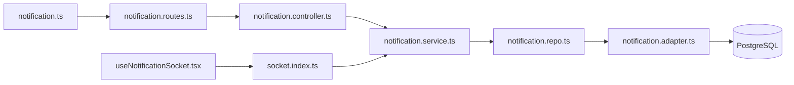

# Notification API

<cite>
**Referenced Files in This Document**
- [notification.routes.ts](file://server/src/modules/notification/notification.routes.ts)
- [notification.controller.ts](file://server/src/modules/notification/notification.controller.ts)
- [notification.service.ts](file://server/src/modules/notification/notification.service.ts)
- [notification.repo.ts](file://server/src/modules/notification/notification.repo.ts)
- [notification.adapter.ts](file://server/src/infra/db/adapters/notification.adapter.ts)
- [socket.index.ts](file://server/src/infra/services/socket/index.ts)
- [connection.events.ts](file://server/src/infra/services/socket/events/connection.events.ts)
- [rate-limit.middleware.ts](file://server/src/core/middlewares/rate-limit.middleware.ts)
- [rate-limiter.module.ts](file://server/src/infra/services/rate-limiter/rate-limiter.module.ts)
- [rate-limiter.interface.ts](file://server/src/infra/services/rate-limiter/rate-limiter.interface.ts)
- [notification.ts](file://web/src/services/api/notification.ts)
- [useNotificationSocket.tsx](file://web/src/hooks/useNotificationSocket.tsx)
- [NotificationButton.tsx](file://web/src/components/general/NotificationButton.tsx)
- [page.tsx](file://web/src/app/(root)/(app)/notifications/page.tsx)
- [NotificationCard.tsx](file://web/src/components/general/NotificationCard.tsx)
- [Notification.ts](file://web/src/types/Notification.ts)
- [0000_snapshot.json](file://server/drizzle/meta/0000_snapshot.json)
- [0001_snapshot.json](file://server/drizzle/meta/0001_snapshot.json)
</cite>

## Table of Contents
1. [Introduction](#introduction)
2. [Project Structure](#project-structure)
3. [Core Components](#core-components)
4. [Architecture Overview](#architecture-overview)
5. [Detailed Component Analysis](#detailed-component-analysis)
6. [Dependency Analysis](#dependency-analysis)
7. [Performance Considerations](#performance-considerations)
8. [Troubleshooting Guide](#troubleshooting-guide)
9. [Conclusion](#conclusion)
10. [Appendices](#appendices)

## Introduction
This document provides comprehensive API documentation for notification endpoints, covering retrieval, marking as read, real-time delivery via WebSocket, and related backend services. It also outlines data models, request/response schemas, rate limiting, and privacy controls. The system supports bundling of similar notifications and emits real-time updates to online users.

## Project Structure
The notification feature spans the server-side API layer, repository/adapter persistence layer, and the frontend client integration for listing, marking as seen, and real-time updates.

**Diagram sources**
- [notification.routes.ts](file://server/src/modules/notification/notification.routes.ts#L1-L12)
- [notification.controller.ts](file://server/src/modules/notification/notification.controller.ts#L1-L47)
- [notification.service.ts](file://server/src/modules/notification/notification.service.ts#L1-L209)
- [notification.repo.ts](file://server/src/modules/notification/notification.repo.ts#L1-L20)
- [notification.adapter.ts](file://server/src/infra/db/adapters/notification.adapter.ts#L1-L76)
- [socket.index.ts](file://server/src/infra/services/socket/index.ts#L1-L48)
- [notification.ts](file://web/src/services/api/notification.ts#L1-L10)
- [useNotificationSocket.tsx](file://web/src/hooks/useNotificationSocket.tsx#L1-L47)
- [NotificationButton.tsx](file://web/src/components/general/NotificationButton.tsx#L1-L20)
- [page.tsx](file://web/src/app/(root)/(app)/notifications/page.tsx#L32-L73)
- [NotificationCard.tsx](file://web/src/components/general/NotificationCard.tsx#L1-L28)
- [Notification.ts](file://web/src/types/Notification.ts#L1-L23)

**Section sources**
- [notification.routes.ts](file://server/src/modules/notification/notification.routes.ts#L1-L12)
- [notification.controller.ts](file://server/src/modules/notification/notification.controller.ts#L1-L47)
- [notification.service.ts](file://server/src/modules/notification/notification.service.ts#L1-L209)
- [notification.repo.ts](file://server/src/modules/notification/notification.repo.ts#L1-L20)
- [notification.adapter.ts](file://server/src/infra/db/adapters/notification.adapter.ts#L1-L76)
- [socket.index.ts](file://server/src/infra/services/socket/index.ts#L1-L48)
- [notification.ts](file://web/src/services/api/notification.ts#L1-L10)
- [useNotificationSocket.tsx](file://web/src/hooks/useNotificationSocket.tsx#L1-L47)
- [NotificationButton.tsx](file://web/src/components/general/NotificationButton.tsx#L1-L20)
- [page.tsx](file://web/src/app/(root)/(app)/notifications/page.tsx#L32-L73)
- [NotificationCard.tsx](file://web/src/components/general/NotificationCard.tsx#L1-L28)
- [Notification.ts](file://web/src/types/Notification.ts#L1-L23)

## Core Components
- API Routes: Expose GET /notifications/list and PATCH /notifications/mark-seen behind authentication.
- Controller: Validates requests, delegates to service/repo, and handles errors.
- Service: Orchestrates notification retrieval, bundling, insertion, and real-time emission.
- Repository/Adapter: Encapsulates database queries and writes for notifications.
- Socket Service: Initializes WebSocket server and event modules for real-time delivery.
- Web Client: Provides API client, real-time hook, and UI components for notifications.

**Section sources**
- [notification.routes.ts](file://server/src/modules/notification/notification.routes.ts#L1-L12)
- [notification.controller.ts](file://server/src/modules/notification/notification.controller.ts#L1-L47)
- [notification.service.ts](file://server/src/modules/notification/notification.service.ts#L1-L209)
- [notification.repo.ts](file://server/src/modules/notification/notification.repo.ts#L1-L20)
- [notification.adapter.ts](file://server/src/infra/db/adapters/notification.adapter.ts#L1-L76)
- [socket.index.ts](file://server/src/infra/services/socket/index.ts#L1-L48)
- [notification.ts](file://web/src/services/api/notification.ts#L1-L10)
- [useNotificationSocket.tsx](file://web/src/hooks/useNotificationSocket.tsx#L1-L47)

## Architecture Overview
The notification system integrates REST endpoints with a WebSocket server. Real-time events are emitted to online users while persistent storage maintains historical records and seen status.

**Diagram sources**
- [notification.routes.ts](file://server/src/modules/notification/notification.routes.ts#L1-L12)
- [notification.controller.ts](file://server/src/modules/notification/notification.controller.ts#L1-L47)
- [notification.service.ts](file://server/src/modules/notification/notification.service.ts#L164-L182)
- [notification.adapter.ts](file://server/src/infra/db/adapters/notification.adapter.ts#L6-L16)
- [socket.index.ts](file://server/src/infra/services/socket/index.ts#L10-L24)
- [useNotificationSocket.tsx](file://web/src/hooks/useNotificationSocket.tsx#L14-L43)
- [notification.ts](file://web/src/services/api/notification.ts#L1-L10)

## Detailed Component Analysis

### REST Endpoints

- GET /notifications/list
  - Purpose: Retrieve all notifications for the authenticated user, optionally joined with post metadata.
  - Authentication: Required.
  - Response: { notifications: Notification[] }.
  - Implementation path: [listNotifications](file://server/src/modules/notification/notification.controller.ts#L7-L24), [getNotificationsByUserId](file://server/src/modules/notification/notification.service.ts#L164-L182), [getAllJoinedNotifications](file://server/src/infra/db/adapters/notification.adapter.ts#L36-L55).

- PATCH /notifications/mark-seen
  - Purpose: Mark a list of notifications as seen.
  - Authentication: Required.
  - Request body: { ids: string[] }.
  - Response: { message: string }.
  - Implementation path: [markAsSeen](file://server/src/modules/notification/notification.controller.ts#L26-L44), [markNotificationsAsSeen](file://server/src/infra/db/adapters/notification.adapter.ts#L6-L16).

**Diagram sources**
- [notification.controller.ts](file://server/src/modules/notification/notification.controller.ts#L26-L44)
- [notification.adapter.ts](file://server/src/infra/db/adapters/notification.adapter.ts#L6-L16)

**Section sources**
- [notification.routes.ts](file://server/src/modules/notification/notification.routes.ts#L7-L11)
- [notification.controller.ts](file://server/src/modules/notification/notification.controller.ts#L7-L44)
- [notification.adapter.ts](file://server/src/infra/db/adapters/notification.adapter.ts#L6-L16)
- [notification.service.ts](file://server/src/modules/notification/notification.service.ts#L164-L182)

### Data Models and Schemas

- Notification (frontend type)
  - Fields: id, type, seen, receiverId, actorUsernames, content, postId, post?, _redisId, _retries?
  - Type enum: general | upvoted_post | upvoted_comment | replied | posted
  - Reference: [Notification.ts](file://web/src/types/Notification.ts#L10-L21)

- Notification (backend service)
  - Base fields: postId, receiverId, type, content
  - Extended fields: actorUsernames[], optional id
  - Reference: [notification.service.ts](file://server/src/modules/notification/notification.service.ts#L16-L26)

- Database table: notifications
  - Columns: id (uuid, PK), seen (boolean), postId (uuid), receiverId (text), actorUsernames (jsonb), content (text), type (enum), createdAt, updatedAt
  - References: notifications.postId -> posts.id
  - Reference snapshots: [0000_snapshot.json](file://server/drizzle/meta/0000_snapshot.json#L1221-L1287), [0001_snapshot.json](file://server/drizzle/meta/0001_snapshot.json#L1221-L1287)

**Diagram sources**
- [0000_snapshot.json](file://server/drizzle/meta/0000_snapshot.json#L1221-L1287)
- [0001_snapshot.json](file://server/drizzle/meta/0001_snapshot.json#L1221-L1287)

**Section sources**
- [Notification.ts](file://web/src/types/Notification.ts#L10-L21)
- [notification.service.ts](file://server/src/modules/notification/notification.service.ts#L16-L26)
- [0000_snapshot.json](file://server/drizzle/meta/0000_snapshot.json#L1221-L1287)
- [0001_snapshot.json](file://server/drizzle/meta/0001_snapshot.json#L1221-L1287)

### Real-Time Notification Delivery (WebSocket)
- Initialization: Client emits "initial-setup" with { userId } upon connection.
- Events:
  - "notification": Emitted to online users with payload including actorUsername, type, postId.
  - "notification-count": Emits unread count to the client.
- Client behavior: Displays toast notifications and updates unread count.
- Backend behavior: Attempts to emit to the user’s socket if online; otherwise logs offline.

**Diagram sources**
- [useNotificationSocket.tsx](file://web/src/hooks/useNotificationSocket.tsx#L14-L43)
- [socket.index.ts](file://server/src/infra/services/socket/index.ts#L10-L24)
- [notification.service.ts](file://server/src/modules/notification/notification.service.ts#L29-L55)

**Section sources**
- [useNotificationSocket.tsx](file://web/src/hooks/useNotificationSocket.tsx#L1-L47)
- [socket.index.ts](file://server/src/infra/services/socket/index.ts#L1-L48)
- [connection.events.ts](file://server/src/infra/services/socket/events/connection.events.ts#L1-L21)
- [notification.service.ts](file://server/src/modules/notification/notification.service.ts#L29-L55)

### Notification Bundling and Insertion
- Bundling: Groups notifications by receiverId, postId, type, and content; deduplicates actor usernames; retains first ID and collects extras for deletion.
- Insertion: Persists raw notifications with actorUsernames as JSONB array.
- Retrieval: Supports joined retrieval to embed post metadata.

**Diagram sources**
- [notification.service.ts](file://server/src/modules/notification/notification.service.ts#L57-L122)

**Section sources**
- [notification.service.ts](file://server/src/modules/notification/notification.service.ts#L57-L122)
- [notification.adapter.ts](file://server/src/infra/db/adapters/notification.adapter.ts#L67-L76)

### Client Integration
- Listing and auto-marking: The notifications page fetches notifications and marks unseen ones as seen via the API.
- Real-time updates: The hook subscribes to WebSocket events and displays toast notifications.
- UI components: NotificationButton shows unread count; NotificationCard renders notification content.

**Diagram sources**
- [page.tsx](file://web/src/app/(root)/(app)/notifications/page.tsx#L32-L73)
- [notification.ts](file://web/src/services/api/notification.ts#L1-L10)
- [useNotificationSocket.tsx](file://web/src/hooks/useNotificationSocket.tsx#L14-L43)

**Section sources**
- [page.tsx](file://web/src/app/(root)/(app)/notifications/page.tsx#L32-L73)
- [notification.ts](file://web/src/services/api/notification.ts#L1-L10)
- [useNotificationSocket.tsx](file://web/src/hooks/useNotificationSocket.tsx#L1-L47)
- [NotificationButton.tsx](file://web/src/components/general/NotificationButton.tsx#L1-L20)
- [NotificationCard.tsx](file://web/src/components/general/NotificationCard.tsx#L1-L28)

## Dependency Analysis
- Routes depend on authentication middleware and controllers.
- Controllers depend on services and repositories.
- Services depend on repository adapters and socket service.
- Adapters depend on database client and Drizzle ORM.
- Web client depends on REST API and WebSocket hook.

**Diagram sources**
- [notification.routes.ts](file://server/src/modules/notification/notification.routes.ts#L1-L12)
- [notification.controller.ts](file://server/src/modules/notification/notification.controller.ts#L1-L47)
- [notification.service.ts](file://server/src/modules/notification/notification.service.ts#L1-L209)
- [notification.repo.ts](file://server/src/modules/notification/notification.repo.ts#L1-L20)
- [notification.adapter.ts](file://server/src/infra/db/adapters/notification.adapter.ts#L1-L76)
- [socket.index.ts](file://server/src/infra/services/socket/index.ts#L1-L48)
- [notification.ts](file://web/src/services/api/notification.ts#L1-L10)
- [useNotificationSocket.tsx](file://web/src/hooks/useNotificationSocket.tsx#L1-L47)

**Section sources**
- [notification.routes.ts](file://server/src/modules/notification/notification.routes.ts#L1-L12)
- [notification.controller.ts](file://server/src/modules/notification/notification.controller.ts#L1-L47)
- [notification.service.ts](file://server/src/modules/notification/notification.service.ts#L1-L209)
- [notification.repo.ts](file://server/src/modules/notification/notification.repo.ts#L1-L20)
- [notification.adapter.ts](file://server/src/infra/db/adapters/notification.adapter.ts#L1-L76)
- [socket.index.ts](file://server/src/infra/services/socket/index.ts#L1-L48)
- [notification.ts](file://web/src/services/api/notification.ts#L1-L10)
- [useNotificationSocket.tsx](file://web/src/hooks/useNotificationSocket.tsx#L1-L47)

## Performance Considerations
- Bundling reduces database noise and client rendering overhead by consolidating similar notifications.
- Joined retrieval minimizes client-side post lookups by embedding post metadata.
- Seen marking uses batched updates to efficiently mark multiple notifications as read.
- Rate limiting protects the API from abuse; consider per-user keys for fairness.

[No sources needed since this section provides general guidance]

## Troubleshooting Guide
- Unauthorized access: Ensure authentication middleware is applied to both endpoints.
- Missing ids in mark-seen: Validate request body contains an array of string IDs.
- Offline users: Real-time events are not emitted; rely on persisted notifications.
- Rate limiting: If requests are throttled, adjust client retry strategy or increase limits.

**Section sources**
- [notification.controller.ts](file://server/src/modules/notification/notification.controller.ts#L26-L44)
- [rate-limit.middleware.ts](file://server/src/core/middlewares/rate-limit.middleware.ts#L1-L9)
- [rate-limiter.module.ts](file://server/src/infra/services/rate-limiter/rate-limiter.module.ts#L1-L8)
- [rate-limiter.interface.ts](file://server/src/infra/services/rate-limiter/rate-limiter.interface.ts#L1-L5)

## Conclusion
The notification system provides a robust foundation for retrieving, marking as seen, and delivering real-time updates. It supports bundling for efficiency, optional post metadata joining, and scalable WebSocket-based delivery. Extending support for preferences, scheduling, and privacy controls would require adding new endpoints, schema fields, and enforcement logic aligned with the existing layered architecture.

[No sources needed since this section summarizes without analyzing specific files]

## Appendices

### Endpoint Definitions

- GET /notifications/list
  - Description: List notifications for the authenticated user.
  - Authentication: Yes.
  - Response: { notifications: Notification[] }.
  - Implementation: [listNotifications](file://server/src/modules/notification/notification.controller.ts#L7-L24), [getNotificationsByUserId](file://server/src/modules/notification/notification.service.ts#L164-L182).

- PATCH /notifications/mark-seen
  - Description: Mark notifications as seen by IDs.
  - Authentication: Yes.
  - Request body: { ids: string[] }.
  - Response: { message: string }.
  - Implementation: [markAsSeen](file://server/src/modules/notification/notification.controller.ts#L26-L44), [markNotificationsAsSeen](file://server/src/infra/db/adapters/notification.adapter.ts#L6-L16).

### WebSocket Events

- Client emits:
  - "initial-setup": { userId: string }.
- Server emits:
  - "notification": { actorUsername: string, type: NotificationType, postId: string }.
  - "notification-count": { count: number }.

**Section sources**
- [useNotificationSocket.tsx](file://web/src/hooks/useNotificationSocket.tsx#L14-L43)
- [socket.index.ts](file://server/src/infra/services/socket/index.ts#L10-L24)
- [notification.service.ts](file://server/src/modules/notification/notification.service.ts#L29-L55)