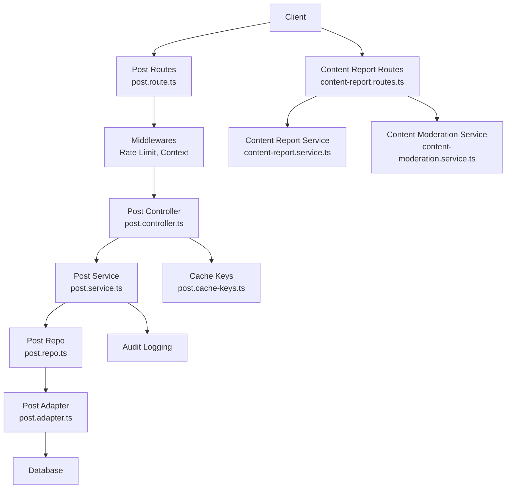
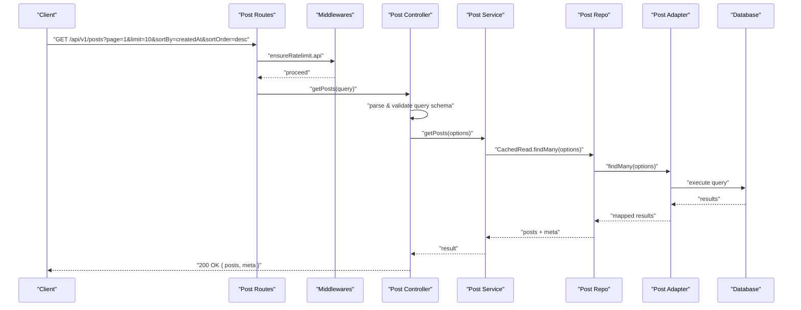
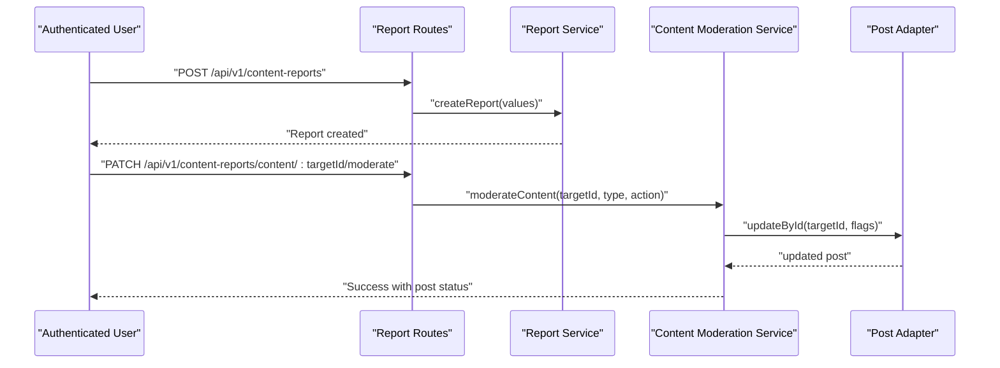
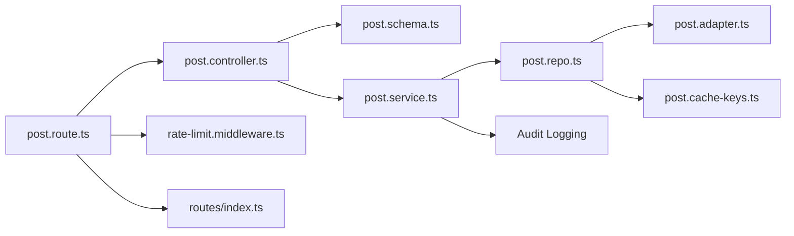

# Post Management API

<cite>
**Referenced Files in This Document**
- [post.route.ts](file://server/src/modules/post/post.route.ts)
- [post.controller.ts](file://server/src/modules/post/post.controller.ts)
- [post.schema.ts](file://server/src/modules/post/post.schema.ts)
- [post.service.ts](file://server/src/modules/post/post.service.ts)
- [post.repo.ts](file://server/src/modules/post/post.repo.ts)
- [post.cache-keys.ts](file://server/src/modules/post/post.cache-keys.ts)
- [index.ts](file://server/src/routes/index.ts)
- [rate-limit.middleware.ts](file://server/src/core/middlewares/rate-limit.middleware.ts)
- [content-report.routes.ts](file://server/src/modules/content-report/content-report.routes.ts)
- [content-report.service.ts](file://server/src/modules/content-report/content-report.service.ts)
- [content-moderation.service.ts](file://server/src/modules/content-report/content-moderation.service.ts)
- [post.adapter.ts](file://server/src/infra/db/adapters/post.adapter.ts)
</cite>

## Table of Contents
1. [Introduction](#introduction)
2. [Project Structure](#project-structure)
3. [Core Components](#core-components)
4. [Architecture Overview](#architecture-overview)
5. [Detailed Component Analysis](#detailed-component-analysis)
6. [Dependency Analysis](#dependency-analysis)
7. [Performance Considerations](#performance-considerations)
8. [Troubleshooting Guide](#troubleshooting-guide)
9. [Conclusion](#conclusion)
10. [Appendices](#appendices)

## Introduction
This document provides comprehensive API documentation for the Post Management module. It covers CRUD operations for anonymous posts, listing by college and branch, filtering by topic, pagination and sorting, content validation, and privacy controls. It also documents moderation workflows, reporting mechanisms, and rate limiting policies.

## Project Structure
The Post Management API is organized around a layered architecture:
- Routes define endpoint contracts and apply middleware.
- Controllers parse and validate requests, delegate to services, and return standardized responses.
- Services encapsulate business logic, enforce authorization, and orchestrate repositories.
- Repositories abstract data access and caching.
- Adapters translate domain queries into database operations.
- Moderation and reporting endpoints are provided under a separate module.

**Diagram sources**
- [post.route.ts](file://server/src/modules/post/post.route.ts#L1-L23)
- [post.controller.ts](file://server/src/modules/post/post.controller.ts#L1-L135)
- [post.service.ts](file://server/src/modules/post/post.service.ts#L1-L272)
- [post.repo.ts](file://server/src/modules/post/post.repo.ts#L1-L97)
- [post.adapter.ts](file://server/src/infra/db/adapters/post.adapter.ts#L1-L428)
- [post.cache-keys.ts](file://server/src/modules/post/post.cache-keys.ts#L1-L33)
- [content-report.routes.ts](file://server/src/modules/content-report/content-report.routes.ts#L1-L37)
- [content-report.service.ts](file://server/src/modules/content-report/content-report.service.ts#L1-L159)
- [content-moderation.service.ts](file://server/src/modules/content-report/content-moderation.service.ts#L1-L220)

**Section sources**
- [post.route.ts](file://server/src/modules/post/post.route.ts#L1-L23)
- [index.ts](file://server/src/routes/index.ts#L17-L32)

## Core Components
- Routes: Define endpoints for listing, retrieving, creating, updating, deleting, and viewing posts. Apply rate limiting and optional user context middleware globally, then require authentication for write operations.
- Controller: Parses and validates request payloads and query parameters using Zod schemas, delegates to service, and returns standardized HTTP responses.
- Service: Implements business logic including authorization checks, privacy enforcement, pagination, filtering, and audit logging.
- Repository: Provides cached and uncached read/write operations and composes cache keys for invalidation/versioning.
- Adapter: Implements database queries for posts, including joins for votes, comments, bookmarks, and author/college details.

**Section sources**
- [post.route.ts](file://server/src/modules/post/post.route.ts#L1-L23)
- [post.controller.ts](file://server/src/modules/post/post.controller.ts#L1-L135)
- [post.service.ts](file://server/src/modules/post/post.service.ts#L1-L272)
- [post.repo.ts](file://server/src/modules/post/post.repo.ts#L1-L97)
- [post.adapter.ts](file://server/src/infra/db/adapters/post.adapter.ts#L1-L428)

## Architecture Overview
The API follows a clean architecture pattern:
- Endpoints are defined in routes and mapped to controller methods.
- Controllers depend on services for business logic.
- Services depend on repositories for data access.
- Repositories depend on adapters for SQL operations.
- Moderation and reporting endpoints are decoupled but integrate with the reporting service.

**Diagram sources**
- [post.route.ts](file://server/src/modules/post/post.route.ts#L11-L11)
- [post.controller.ts](file://server/src/modules/post/post.controller.ts#L23-L53)
- [post.service.ts](file://server/src/modules/post/post.service.ts#L79-L132)
- [post.repo.ts](file://server/src/modules/post/post.repo.ts#L17-L45)
- [post.adapter.ts](file://server/src/infra/db/adapters/post.adapter.ts#L157-L332)

## Detailed Component Analysis

### Endpoint Definitions
- Base Path: /api/v1/posts
- Global Middleware:
  - Rate limit enforced via ensureRatelimit.api
  - Optional user context pipeline applied to all routes
- Authentication:
  - Write operations (POST, PATCH, DELETE) require authentication via checkUserContext

Endpoints:
- GET /api/v1/posts
  - Purpose: List posts with pagination, sorting, and filtering
  - Query Parameters: page, limit, sortBy, sortOrder, topic, collegeId, branch
- GET /api/v1/posts/:id
  - Purpose: Retrieve a single post by ID
- POST /api/v1/posts/:id/view
  - Purpose: Increment view count for a post
- GET /api/v1/posts/college/:collegeId
  - Purpose: List posts filtered by college
  - Query Parameters: page, limit, sortBy, sortOrder
- GET /api/v1/posts/branch/:branch
  - Purpose: List posts filtered by branch
  - Query Parameters: page, limit, sortBy, sortOrder
- POST /api/v1/posts
  - Purpose: Create a new post
- PATCH /api/v1/posts/:id
  - Purpose: Update an existing post
- DELETE /api/v1/posts/:id
  - Purpose: Delete a post

Notes:
- Anonymous users can view public posts; private posts require authentication and restrict visibility to users from the same college as the author.
- View increments are permitted without authentication.

**Section sources**
- [post.route.ts](file://server/src/modules/post/post.route.ts#L8-L22)
- [index.ts](file://server/src/routes/index.ts#L18-L18)
- [post.controller.ts](file://server/src/modules/post/post.controller.ts#L23-L132)
- [post.service.ts](file://server/src/modules/post/post.service.ts#L47-L77)

### Request Schemas and Validation
Validation is performed using Zod schemas in the controller layer. Key schemas:
- CreatePostSchema
  - Fields: title (string, 1–300 chars), content (string, 1–10000 chars), topic (enum), isPrivate (boolean, optional)
- UpdatePostSchema
  - Fields: title, content, topic, isPrivate (all optional)
- GetPostsQuerySchema
  - Fields: page (≥1), limit (1–50), sortBy (createdAt|updatedAt|views), sortOrder (asc|desc), topic (supports exact, case-insensitive, and URL-decoded matches), collegeId (UUID), branch (string)
- PostIdSchema, CollegeIdSchema, BranchSchema
  - Validation for path parameters

Behavior:
- Topic normalization attempts exact match, then case-insensitive, then URL-decoded match to support friendly URLs.

**Section sources**
- [post.schema.ts](file://server/src/modules/post/post.schema.ts#L17-L80)
- [post.controller.ts](file://server/src/modules/post/post.controller.ts#L8-L8)
- [post.controller.ts](file://server/src/modules/post/post.controller.ts#L24-L24)
- [post.controller.ts](file://server/src/modules/post/post.controller.ts#L66-L66)
- [post.controller.ts](file://server/src/modules/post/post.controller.ts#L98-L98)
- [post.controller.ts](file://server/src/modules/post/post.controller.ts#L117-L117)

### Response Format and Pagination
Responses follow a consistent structure:
- Success: HTTP 200 with payload { posts, meta }
- Creation: HTTP 201 with payload { post }
- Not Found: HTTP 404 with structured error
- Unauthorized/Forbidden: HTTP 401/403 with structured error

Pagination metadata:
- total, page, limit, totalPages, hasMore

Sorting:
- sortBy supports createdAt, updatedAt, views
- sortOrder supports asc, desc

Filtering:
- topic, collegeId, branch

**Section sources**
- [post.controller.ts](file://server/src/modules/post/post.controller.ts#L20-L20)
- [post.controller.ts](file://server/src/modules/post/post.controller.ts#L52-L52)
- [post.service.ts](file://server/src/modules/post/post.service.ts#L111-L131)
- [post.adapter.ts](file://server/src/infra/db/adapters/post.adapter.ts#L264-L331)

### Privacy Controls and Access Restrictions
- Private posts:
  - Visible only to authenticated users from the same college as the author
  - Anonymous users cannot access private posts
- Public posts:
  - Visible to everyone

Authorization:
- Update/Delete operations require the requesting user to be the author of the post

**Section sources**
- [post.service.ts](file://server/src/modules/post/post.service.ts#L60-L76)
- [post.service.ts](file://server/src/modules/post/post.service.tsL157-L165)

### Media Attachments and Anonymous Posting
- Current schema does not include media/image fields for posts.
- Anonymous posting is not enforced by the API; authenticated users create posts. Private posts are restricted to the author’s college.

Recommendations:
- Extend CreatePostSchema and UpdatePostSchema to include media fields and validation.
- Add a dedicated anonymous posting mechanism if required, with additional moderation and rate limits.

**Section sources**
- [post.schema.ts](file://server/src/modules/post/post.schema.ts#L17-L33)

### Moderation Workflows and Reporting
Reporting:
- Authenticated users can report content via content-report routes.
- Reports include type (Post/Comment), reason, and target identifiers.

Moderation Actions:
- Ban/Unban posts
- Shadow ban/unban posts
- Update report status
- Bulk delete reports

Integration:
- Moderation actions update post flags and resolve related reports.

**Diagram sources**
- [content-report.routes.ts](file://server/src/modules/content-report/content-report.routes.ts#L10-L14)
- [content-moderation.service.ts](file://server/src/modules/content-report/content-moderation.service.ts#L6-L41)
- [post.adapter.ts](file://server/src/infra/db/adapters/post.adapter.ts#L396-L408)

**Section sources**
- [content-report.routes.ts](file://server/src/modules/content-report/content-report.routes.ts#L1-L37)
- [content-report.service.ts](file://server/src/modules/content-report/content-report.service.ts#L9-L39)
- [content-moderation.service.ts](file://server/src/modules/content-report/content-moderation.service.ts#L6-L122)

### Rate Limiting Policies
- All posts endpoints are protected by ensureRatelimit.api middleware.
- Specific limiters are configured in the rate limiter module and applied per-route group.

Guidance:
- Configure distinct limits for authenticated vs anonymous usage.
- Consider burst and sliding window policies for creation endpoints.

**Section sources**
- [post.route.ts](file://server/src/modules/post/post.route.ts#L8-L8)
- [rate-limit.middleware.ts](file://server/src/core/middlewares/rate-limit.middleware.ts#L1-L9)

### Example Requests and Responses

- Create a Post
  - Method: POST
  - Path: /api/v1/posts
  - Headers: Authorization (required)
  - Body Schema: CreatePostSchema
  - Example fields: title, content, topic, isPrivate

- List Posts with Filtering and Sorting
  - Method: GET
  - Path: /api/v1/posts
  - Query: page, limit, sortBy, sortOrder, topic, collegeId, branch

- View Increment
  - Method: POST
  - Path: /api/v1/posts/:id/view

- List by College
  - Method: GET
  - Path: /api/v1/posts/college/:collegeId
  - Query: page, limit, sortBy, sortOrder

- List by Branch
  - Method: GET
  - Path: /api/v1/posts/branch/:branch
  - Query: page, limit, sortBy, sortOrder

- Update Post
  - Method: PATCH
  - Path: /api/v1/posts/:id
  - Headers: Authorization (required)
  - Body Schema: UpdatePostSchema

- Delete Post
  - Method: DELETE
  - Path: /api/v1/posts/:id
  - Headers: Authorization (required)

Response Examples:
- Success: 200 OK with { posts, meta } or { post }
- Created: 201 Created with { post }
- Not Found: 404 with structured error
- Unauthorized/Forbidden: 401/403 with structured error

**Section sources**
- [post.controller.ts](file://server/src/modules/post/post.controller.ts#L8-L21)
- [post.controller.ts](file://server/src/modules/post/post.controller.ts#L23-L53)
- [post.controller.ts](file://server/src/modules/post/post.controller.ts#L88-L94)
- [post.controller.ts](file://server/src/modules/post/post.controller.ts#L96-L113)
- [post.controller.ts](file://server/src/modules/post/post.controller.ts#L115-L132)
- [post.controller.ts](file://server/src/modules/post/post.controller.ts#L64-L86)
- [post.service.ts](file://server/src/modules/post/post.service.ts#L111-L131)

## Dependency Analysis
The Post module exhibits clear separation of concerns:
- Routes depend on controllers and middlewares
- Controllers depend on schemas and services
- Services depend on repositories and audit/logging
- Repositories depend on adapters and cache keys
- Adapters depend on database tables and queries

**Diagram sources**
- [post.route.ts](file://server/src/modules/post/post.route.ts#L1-L23)
- [post.controller.ts](file://server/src/modules/post/post.controller.ts#L1-L135)
- [post.schema.ts](file://server/src/modules/post/post.schema.ts#L1-L81)
- [post.service.ts](file://server/src/modules/post/post.service.ts#L1-L272)
- [post.repo.ts](file://server/src/modules/post/post.repo.ts#L1-L97)
- [post.adapter.ts](file://server/src/infra/db/adapters/post.adapter.ts#L1-L428)
- [post.cache-keys.ts](file://server/src/modules/post/post.cache-keys.ts#L1-L33)
- [rate-limit.middleware.ts](file://server/src/core/middlewares/rate-limit.middleware.ts#L1-L9)
- [index.ts](file://server/src/routes/index.ts#L17-L32)

**Section sources**
- [post.route.ts](file://server/src/modules/post/post.route.ts#L1-L23)
- [post.controller.ts](file://server/src/modules/post/post.controller.ts#L1-L135)
- [post.service.ts](file://server/src/modules/post/post.service.ts#L1-L272)
- [post.repo.ts](file://server/src/modules/post/post.repo.ts#L1-L97)
- [post.adapter.ts](file://server/src/infra/db/adapters/post.adapter.ts#L1-L428)
- [post.cache-keys.ts](file://server/src/modules/post/post.cache-keys.ts#L1-L33)
- [rate-limit.middleware.ts](file://server/src/core/middlewares/rate-limit.middleware.ts#L1-L9)
- [index.ts](file://server/src/routes/index.ts#L17-L32)

## Performance Considerations
- Caching:
  - CachedRead operations use cache keys with versioning for invalidation and L1/L2 caching.
  - Cache keys include pagination, sorting, filters, and user context to avoid cross-user leakage.
- Query Efficiency:
  - Adapters use CTEs for aggregated counts (votes, comments) and conditional joins to minimize N+1 issues.
  - Sorting and pagination are applied at the database level.
- Rate Limiting:
  - Apply stricter limits on creation endpoints to prevent spam.
- Recommendations:
  - Add Redis-based rate limiter per IP/user.
  - Consider background jobs for heavy operations (e.g., analytics, notifications).
  - Monitor slow queries and add indexes if needed.

**Section sources**
- [post.cache-keys.ts](file://server/src/modules/post/post.cache-keys.ts#L9-L31)
- [post.repo.ts](file://server/src/modules/post/post.repo.ts#L17-L55)
- [post.adapter.ts](file://server/src/infra/db/adapters/post.adapter.ts#L157-L385)

## Troubleshooting Guide
Common Issues and Resolutions:
- Post Not Found
  - Cause: Non-existent post ID
  - Resolution: Verify ID format and existence
- Unauthorized Access to Private Post
  - Cause: Anonymous user or user from another college
  - Resolution: Authenticate and ensure user belongs to the author’s college
- Forbidden Update/Delete
  - Cause: Non-author attempting modification
  - Resolution: Ensure caller is the post author
- Invalid Topic Value
  - Cause: Unsupported topic string
  - Resolution: Use allowed topic enum values or supported normalized forms
- Rate Limit Exceeded
  - Cause: Too many requests
  - Resolution: Back off or upgrade rate limits

Audit and Logging:
- Service logs create/update/delete actions with audit records.
- Moderation actions and report updates are audited.

**Section sources**
- [post.service.ts](file://server/src/modules/post/post.service.ts#L53-L58)
- [post.service.ts](file://server/src/modules/post/post.service.ts#L62-L72)
- [post.service.ts](file://server/src/modules/post/post.service.ts#L150-L165)
- [post.schema.ts](file://server/src/modules/post/post.schema.ts#L20-L22)
- [content-report.service.ts](file://server/src/modules/content-report/content-report.service.ts#L10-L39)
- [content-moderation.service.ts](file://server/src/modules/content-report/content-moderation.service.ts#L8-L41)

## Conclusion
The Post Management API provides a robust foundation for anonymous-friendly post operations with strong privacy controls, efficient pagination, and integrated moderation/reporting capabilities. Extending media support, enforcing anonymous posting policies, and tightening rate limiting will further improve security and user experience.

## Appendices

### API Definition Summary

- Base Path: /api/v1/posts
- Authentication: Required for write operations; optional for reads
- Rate Limiting: Applied globally to posts endpoints

Endpoints:
- GET /posts
  - Query: page, limit, sortBy, sortOrder, topic, collegeId, branch
  - Response: { posts, meta }
- GET /posts/:id
  - Response: { post }
- POST /posts/:id/view
  - Response: { message }
- GET /posts/college/:collegeId
  - Query: page, limit, sortBy, sortOrder
  - Response: { posts, meta }
- GET /posts/branch/:branch
  - Query: page, limit, sortBy, sortOrder
  - Response: { posts, meta }
- POST /posts
  - Body: CreatePostSchema
  - Response: { post }
- PATCH /posts/:id
  - Body: UpdatePostSchema
  - Response: { post }
- DELETE /posts/:id
  - Response: { message }

**Section sources**
- [post.route.ts](file://server/src/modules/post/post.route.ts#L11-L22)
- [post.schema.ts](file://server/src/modules/post/post.schema.ts#L17-L33)
- [post.controller.ts](file://server/src/modules/post/post.controller.ts#L23-L132)
- [post.service.ts](file://server/src/modules/post/post.service.ts#L79-L132)