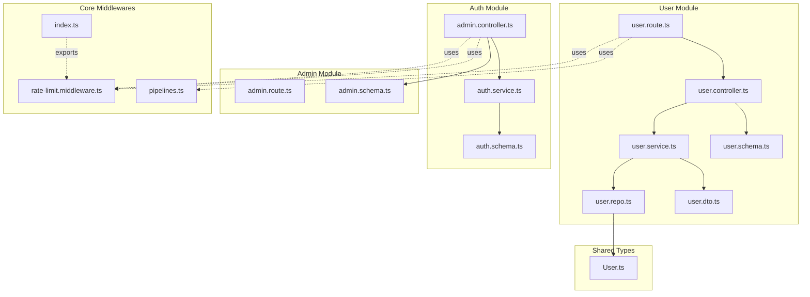
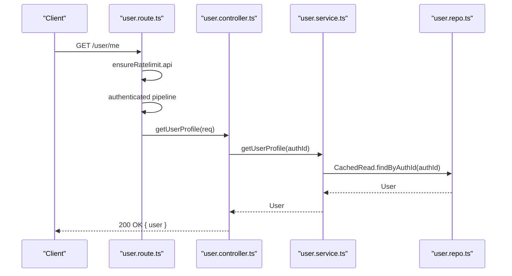
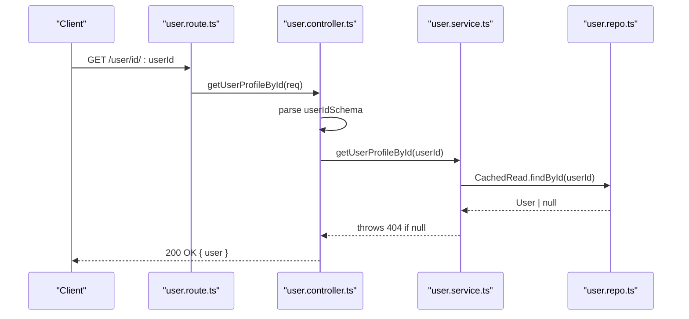
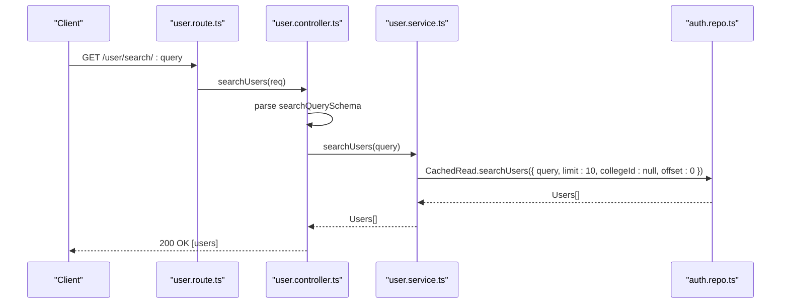
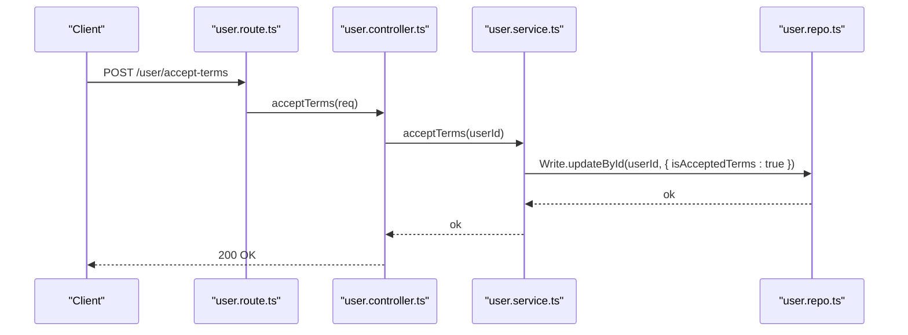
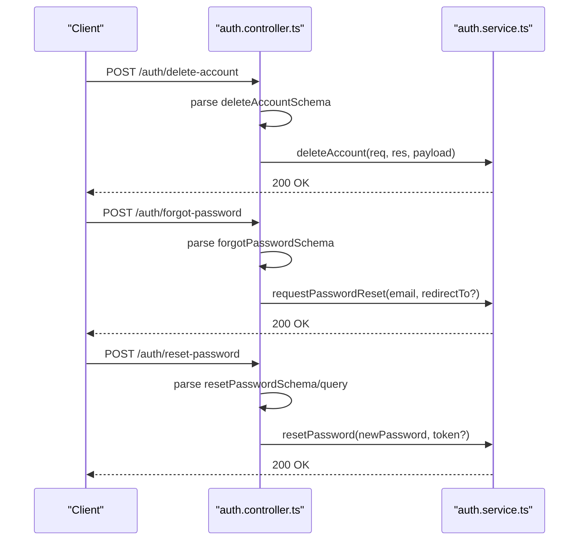
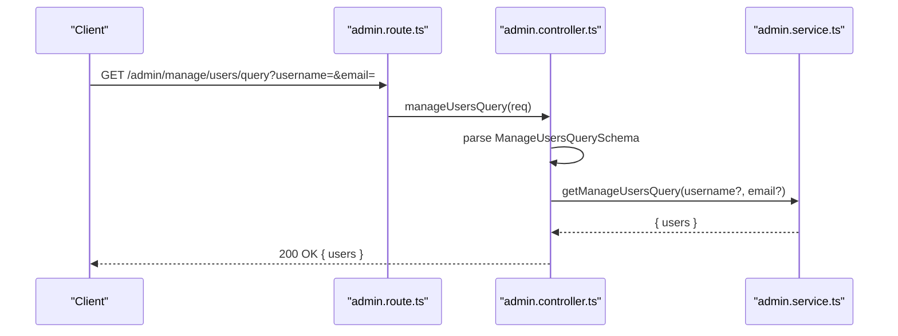
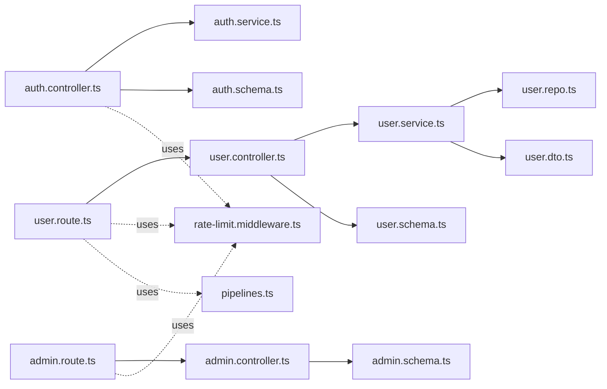

# User Management API

<cite>
**Referenced Files in This Document**
- [user.route.ts](file://server/src/modules/user/user.route.ts)
- [user.controller.ts](file://server/src/modules/user/user.controller.ts)
- [user.service.ts](file://server/src/modules/user/user.service.ts)
- [user.repo.ts](file://server/src/modules/user/user.repo.ts)
- [user.schema.ts](file://server/src/modules/user/user.schema.ts)
- [user.dto.ts](file://server/src/modules/user/user.dto.ts)
- [auth.controller.ts](file://server/src/modules/auth/auth.controller.ts)
- [auth.schema.ts](file://server/src/modules/auth/auth.schema.ts)
- [auth.service.ts](file://server/src/modules/auth/auth.service.ts)
- [admin.route.ts](file://server/src/modules/admin/admin.route.ts)
- [admin.controller.ts](file://server/src/modules/admin/admin.controller.ts)
- [admin.schema.ts](file://server/src/modules/admin/admin.schema.ts)
- [rate-limit.middleware.ts](file://server/src/core/middlewares/rate-limit.middleware.ts)
- [pipelines.ts](file://server/src/core/middlewares/pipelines.ts)
- [index.ts](file://server/src/core/middlewares/index.ts)
- [User.ts](file://server/src/shared/types/User.ts)
</cite>

## Table of Contents
1. [Introduction](#introduction)
2. [Project Structure](#project-structure)
3. [Core Components](#core-components)
4. [Architecture Overview](#architecture-overview)
5. [Detailed Component Analysis](#detailed-component-analysis)
6. [Dependency Analysis](#dependency-analysis)
7. [Performance Considerations](#performance-considerations)
8. [Troubleshooting Guide](#troubleshooting-guide)
9. [Conclusion](#conclusion)
10. [Appendices](#appendices)

## Introduction
This document provides comprehensive API documentation for user management endpoints. It covers user profile retrieval, user search, terms acceptance, and related authentication and admin features. It also documents request validation schemas, permission requirements, rate limiting, and error handling patterns. Where applicable, it references the exact source files and line ranges for traceability.

## Project Structure
The user management functionality is primarily implemented under the server module for user, auth, and admin domains. Middleware enforces rate limits and authentication contexts. Shared types define database entity shapes.

**Diagram sources**
- [user.route.ts](file://server/src/modules/user/user.route.ts#L1-L21)
- [user.controller.ts](file://server/src/modules/user/user.controller.ts#L1-L37)
- [user.service.ts](file://server/src/modules/user/user.service.ts#L1-L61)
- [user.repo.ts](file://server/src/modules/user/user.repo.ts#L1-L41)
- [user.schema.ts](file://server/src/modules/user/user.schema.ts#L1-L39)
- [user.dto.ts](file://server/src/modules/user/user.dto.ts#L1-L17)
- [auth.controller.ts](file://server/src/modules/auth/auth.controller.ts#L1-L171)
- [auth.service.ts](file://server/src/modules/auth/auth.service.ts#L1-L347)
- [auth.schema.ts](file://server/src/modules/auth/auth.schema.ts#L1-L78)
- [admin.route.ts](file://server/src/modules/admin/admin.route.ts#L1-L21)
- [admin.controller.ts](file://server/src/modules/admin/admin.controller.ts#L1-L72)
- [admin.schema.ts](file://server/src/modules/admin/admin.schema.ts#L1-L52)
- [rate-limit.middleware.ts](file://server/src/core/middlewares/rate-limit.middleware.ts#L1-L9)
- [pipelines.ts](file://server/src/core/middlewares/pipelines.ts#L1-L37)
- [index.ts](file://server/src/core/middlewares/index.ts#L1-L14)
- [User.ts](file://server/src/shared/types/User.ts#L1-L4)

**Section sources**
- [user.route.ts](file://server/src/modules/user/user.route.ts#L1-L21)
- [auth.controller.ts](file://server/src/modules/auth/auth.controller.ts#L1-L171)
- [admin.route.ts](file://server/src/modules/admin/admin.route.ts#L1-L21)
- [rate-limit.middleware.ts](file://server/src/core/middlewares/rate-limit.middleware.ts#L1-L9)
- [pipelines.ts](file://server/src/core/middlewares/pipelines.ts#L1-L37)
- [index.ts](file://server/src/core/middlewares/index.ts#L1-L14)
- [User.ts](file://server/src/shared/types/User.ts#L1-L4)

## Core Components
- User routes: Define endpoints for retrieving profiles by ID and search, plus self-profile and terms acceptance.
- User controller: Orchestrates requests, validates inputs via schemas, and returns standardized HTTP responses.
- User service: Implements business logic, interacts with repositories, and records audit events.
- User repository: Provides cached and uncached read/write operations backed by database adapters.
- User DTOs: Transform internal user records to public representations.
- Authentication controller/service: Handles login/logout, OTP flows, password reset/forgot, account deletion, and admin listings.
- Admin controller/service: Provides admin-only dashboards and user management queries.
- Rate limiting and pipelines: Enforce per-endpoint rate limits and authentication/context middleware composition.

**Section sources**
- [user.route.ts](file://server/src/modules/user/user.route.ts#L1-L21)
- [user.controller.ts](file://server/src/modules/user/user.controller.ts#L1-L37)
- [user.service.ts](file://server/src/modules/user/user.service.ts#L1-L61)
- [user.repo.ts](file://server/src/modules/user/user.repo.ts#L1-L41)
- [user.schema.ts](file://server/src/modules/user/user.schema.ts#L1-L39)
- [user.dto.ts](file://server/src/modules/user/user.dto.ts#L1-L17)
- [auth.controller.ts](file://server/src/modules/auth/auth.controller.ts#L1-L171)
- [auth.service.ts](file://server/src/modules/auth/auth.service.ts#L1-L347)
- [admin.controller.ts](file://server/src/modules/admin/admin.controller.ts#L1-L72)
- [rate-limit.middleware.ts](file://server/src/core/middlewares/rate-limit.middleware.ts#L1-L9)
- [pipelines.ts](file://server/src/core/middlewares/pipelines.ts#L1-L37)

## Architecture Overview
The user management API follows a layered architecture:
- Routes define endpoint contracts and apply middleware.
- Controllers validate inputs using Zod schemas and delegate to services.
- Services encapsulate business logic and coordinate repositories and external systems.
- Repositories abstract persistence and caching.
- DTOs normalize data transfer between layers.
- Middleware enforces rate limits and authentication contexts.

**Diagram sources**
- [user.route.ts](file://server/src/modules/user/user.route.ts#L1-L21)
- [user.controller.ts](file://server/src/modules/user/user.controller.ts#L25-L27)
- [user.service.ts](file://server/src/modules/user/user.service.ts#L41-L43)
- [user.repo.ts](file://server/src/modules/user/user.repo.ts#L17-L22)
- [rate-limit.middleware.ts](file://server/src/core/middlewares/rate-limit.middleware.ts#L1-L9)
- [pipelines.ts](file://server/src/core/middlewares/pipelines.ts#L10-L14)

## Detailed Component Analysis

### User Profile Retrieval
Endpoints:
- GET /user/id/:userId — Retrieve a user by ID
- GET /user/me — Retrieve current authenticated user’s profile

Validation:
- Path parameters validated via user schema for user ID and search query.

Processing logic:
- Controller parses parameters and delegates to service.
- Service fetches user via repository, logging and throwing not-found errors when absent.
- Response returns a public user representation.

**Diagram sources**
- [user.route.ts](file://server/src/modules/user/user.route.ts#L11-L11)
- [user.controller.ts](file://server/src/modules/user/user.controller.ts#L9-L15)
- [user.service.ts](file://server/src/modules/user/user.service.ts#L8-L25)
- [user.repo.ts](file://server/src/modules/user/user.repo.ts#L18-L19)
- [user.schema.ts](file://server/src/modules/user/user.schema.ts#L14-L16)

**Section sources**
- [user.route.ts](file://server/src/modules/user/user.route.ts#L11-L11)
- [user.controller.ts](file://server/src/modules/user/user.controller.ts#L9-L15)
- [user.service.ts](file://server/src/modules/user/user.service.ts#L8-L25)
- [user.repo.ts](file://server/src/modules/user/user.repo.ts#L18-L19)
- [user.schema.ts](file://server/src/modules/user/user.schema.ts#L14-L16)
- [user.dto.ts](file://server/src/modules/user/user.dto.ts#L3-L11)

### User Search
Endpoint:
- GET /user/search/:query

Validation:
- Path parameter validated via search query schema.

Processing logic:
- Controller parses query and delegates to service.
- Service performs a cached search via authentication repository with fixed limit and optional filters.
- Response returns an array of public user representations.

**Diagram sources**
- [user.route.ts](file://server/src/modules/user/user.route.ts#L12-L12)
- [user.controller.ts](file://server/src/modules/user/user.controller.ts#L17-L23)
- [user.service.ts](file://server/src/modules/user/user.service.ts#L27-L39)
- [user.schema.ts](file://server/src/modules/user/user.schema.ts#L36-L38)

**Section sources**
- [user.route.ts](file://server/src/modules/user/user.route.ts#L12-L12)
- [user.controller.ts](file://server/src/modules/user/user.controller.ts#L17-L23)
- [user.service.ts](file://server/src/modules/user/user.service.ts#L27-L39)
- [user.schema.ts](file://server/src/modules/user/user.schema.ts#L36-L38)

### Terms Acceptance
Endpoint:
- POST /user/accept-terms

Processing logic:
- Controller verifies authenticated context and calls service to mark terms accepted.
- Service updates user record and records an audit event.

**Diagram sources**
- [user.route.ts](file://server/src/modules/user/user.route.ts#L18-L18)
- [user.controller.ts](file://server/src/modules/user/user.controller.ts#L29-L33)
- [user.service.ts](file://server/src/modules/user/user.service.ts#L45-L57)
- [user.repo.ts](file://server/src/modules/user/user.repo.ts#L33-L36)

**Section sources**
- [user.route.ts](file://server/src/modules/user/user.route.ts#L18-L18)
- [user.controller.ts](file://server/src/modules/user/user.controller.ts#L29-L33)
- [user.service.ts](file://server/src/modules/user/user.service.ts#L45-L57)

### Authentication and Account Management (Related to User)
While not part of the user module routes, the auth module exposes endpoints that manage user accounts and are relevant to user management workflows.

Endpoints:
- POST /auth/delete-account — Delete user account
- POST /auth/forgot-password — Request password reset
- POST /auth/reset-password — Reset password using token or query param
- POST /auth/logout-all-devices — Revoke sessions on other devices

Validation:
- Body/query parameters validated via auth schemas.

Processing logic:
- Controllers parse inputs and delegate to auth service.
- Auth service integrates with Better Auth APIs, OTP, and Redis cache, and records audit events.

**Diagram sources**
- [auth.controller.ts](file://server/src/modules/auth/auth.controller.ts#L123-L146)
- [auth.schema.ts](file://server/src/modules/auth/auth.schema.ts#L58-L62)
- [auth.service.ts](file://server/src/modules/auth/auth.service.ts#L231-L287)

**Section sources**
- [auth.controller.ts](file://server/src/modules/auth/auth.controller.ts#L123-L146)
- [auth.schema.ts](file://server/src/modules/auth/auth.schema.ts#L58-L62)
- [auth.service.ts](file://server/src/modules/auth/auth.service.ts#L231-L287)

### Admin User Management (Related to User)
Admin endpoints that query and manage users.

Endpoints:
- GET /admin/manage/users/query — Filter users by username/email
- GET /admin/dashboard/overview — Admin dashboard overview
- GET /admin/manage/reports — Paginated reports
- GET /admin/manage/logs — Paginated logs
- GET /admin/manage/feedback/all — All feedback
- GET /admin/colleges/get/all — Colleges list
- POST /admin/colleges/create — Create college
- PATCH /admin/colleges/update/:id — Update college

Validation:
- Query/body parameters validated via admin schemas.

Processing logic:
- Controllers parse inputs and delegate to admin service.
- Admin service retrieves data and returns paginated or filtered results.

**Diagram sources**
- [admin.route.ts](file://server/src/modules/admin/admin.route.ts#L12-L12)
- [admin.controller.ts](file://server/src/modules/admin/admin.controller.ts#L13-L18)
- [admin.schema.ts](file://server/src/modules/admin/admin.schema.ts#L3-L6)

**Section sources**
- [admin.route.ts](file://server/src/modules/admin/admin.route.ts#L1-L21)
- [admin.controller.ts](file://server/src/modules/admin/admin.controller.ts#L1-L72)
- [admin.schema.ts](file://server/src/modules/admin/admin.schema.ts#L1-L52)

## Dependency Analysis
- Route layer depends on controller and middleware.
- Controller depends on service and Zod schemas.
- Service depends on repository and audit logging.
- Repository depends on database adapters and caching keys.
- Middleware exports rate limiter and composed pipelines.

**Diagram sources**
- [user.route.ts](file://server/src/modules/user/user.route.ts#L1-L21)
- [user.controller.ts](file://server/src/modules/user/user.controller.ts#L1-L37)
- [user.service.ts](file://server/src/modules/user/user.service.ts#L1-L61)
- [user.repo.ts](file://server/src/modules/user/user.repo.ts#L1-L41)
- [user.schema.ts](file://server/src/modules/user/user.schema.ts#L1-L39)
- [user.dto.ts](file://server/src/modules/user/user.dto.ts#L1-L17)
- [auth.controller.ts](file://server/src/modules/auth/auth.controller.ts#L1-L171)
- [auth.service.ts](file://server/src/modules/auth/auth.service.ts#L1-L347)
- [auth.schema.ts](file://server/src/modules/auth/auth.schema.ts#L1-L78)
- [admin.route.ts](file://server/src/modules/admin/admin.route.ts#L1-L21)
- [admin.controller.ts](file://server/src/modules/admin/admin.controller.ts#L1-L72)
- [admin.schema.ts](file://server/src/modules/admin/admin.schema.ts#L1-L52)
- [rate-limit.middleware.ts](file://server/src/core/middlewares/rate-limit.middleware.ts#L1-L9)
- [pipelines.ts](file://server/src/core/middlewares/pipelines.ts#L1-L37)

**Section sources**
- [index.ts](file://server/src/core/middlewares/index.ts#L1-L14)

## Performance Considerations
- Caching: User repository wraps reads with cached keys to reduce database load.
- Rate limiting: Per-endpoint limiters are applied at route level to prevent abuse.
- Pagination defaults: Admin endpoints define safe defaults for limit and page to avoid heavy queries.

Recommendations:
- Prefer cached reads for frequently accessed user data.
- Apply rate limits consistently across endpoints.
- Validate and constrain query parameters (e.g., limit ranges) to protect backend resources.

**Section sources**
- [user.repo.ts](file://server/src/modules/user/user.repo.ts#L17-L30)
- [rate-limit.middleware.ts](file://server/src/core/middlewares/rate-limit.middleware.ts#L1-L9)
- [admin.schema.ts](file://server/src/modules/admin/admin.schema.ts#L10-L18)

## Troubleshooting Guide
Common issues and resolutions:
- Not found user by ID: Service throws a not-found error when user does not exist.
- Invalid or expired signup session: Auth service throws forbidden for invalid pending user sessions.
- Too many OTP attempts: Exceeding OTP attempts triggers a forbidden error and clears caches.
- Invalid email or enrollment ID: Validation rejects malformed student emails and non-numeric enrollment IDs.
- Disposable email domains: Registration rejects disposable domains.

Error handling patterns:
- Centralized HTTP error types are thrown with descriptive messages and metadata.
- Audit logging is recorded for significant actions (login, logout, password reset, terms acceptance).

**Section sources**
- [user.service.ts](file://server/src/modules/user/user.service.ts#L13-L18)
- [auth.service.ts](file://server/src/modules/auth/auth.service.ts#L22-L27)
- [auth.service.ts](file://server/src/modules/auth/auth.service.ts#L116-L139)
- [auth.service.ts](file://server/src/modules/auth/auth.service.ts#L311-L331)
- [auth.service.ts](file://server/src/modules/auth/auth.service.ts#L333-L339)

## Conclusion
The user management API provides robust endpoints for profile retrieval, user search, and terms acceptance, integrated with authentication and admin capabilities. Strong validation via Zod schemas, middleware enforcement, and audit logging ensures reliability and security. The modular design supports scalability and maintainability.

## Appendices

### Endpoint Reference

- GET /user/id/:userId
  - Description: Fetch a user by ID.
  - Authentication: Requires authenticated context.
  - Validation: user ID schema.
  - Response: Public user object.
  - Permissions: None (publicly visible profile data).
  - Rate limit: Applied globally via ensureRatelimit.api.

- GET /user/me
  - Description: Fetch current authenticated user’s profile.
  - Authentication: Requires authenticated context.
  - Validation: None (uses injected user).
  - Response: Public user object.
  - Permissions: Authenticated user.
  - Rate limit: Applied globally via ensureRatelimit.api.

- GET /user/search/:query
  - Description: Search users by query.
  - Authentication: Requires authenticated context.
  - Validation: Search query schema.
  - Response: Array of public user objects.
  - Permissions: Authenticated user.
  - Rate limit: Applied globally via ensureRatelimit.api.

- POST /user/accept-terms
  - Description: Accept terms for the authenticated user.
  - Authentication: Requires authenticated context.
  - Validation: None (uses injected user).
  - Response: Success message.
  - Permissions: Authenticated user.
  - Rate limit: Applied globally via ensureRatelimit.api.

- POST /auth/delete-account
  - Description: Delete the authenticated user’s account.
  - Authentication: Requires authenticated context.
  - Validation: deleteAccountSchema (password/token/callbackURL optional).
  - Response: Success message.
  - Permissions: Authenticated user.
  - Rate limit: Applied globally via ensureRatelimit.api.

- POST /auth/forgot-password
  - Description: Request password reset.
  - Authentication: Optional for this endpoint.
  - Validation: forgotPasswordSchema (email, optional redirect URL).
  - Response: Success message.
  - Permissions: None.
  - Rate limit: Applied globally via ensureRatelimit.auth.

- POST /auth/reset-password
  - Description: Reset password using token (body or query).
  - Authentication: Optional for this endpoint.
  - Validation: resetPasswordSchema (newPassword, optional token).
  - Response: Success message.
  - Permissions: None.
  - Rate limit: Applied globally via ensureRatelimit.auth.

- POST /auth/logout-all-devices
  - Description: Revoke sessions on other devices.
  - Authentication: Requires authenticated context.
  - Validation: None (uses headers).
  - Response: Success message.
  - Permissions: Authenticated user.
  - Rate limit: Applied globally via ensureRatelimit.auth.

- GET /admin/manage/users/query
  - Description: Filter users by username/email (admin).
  - Authentication: Requires admin role.
  - Validation: ManageUsersQuerySchema (username/email optional).
  - Response: { users }.
  - Permissions: Admin.
  - Rate limit: Applied globally via ensureRatelimit.api.

- GET /admin/dashboard/overview
  - Description: Admin dashboard overview (admin).
  - Authentication: Requires admin role.
  - Validation: None.
  - Response: Dashboard metrics.
  - Permissions: Admin.
  - Rate limit: Applied globally via ensureRatelimit.api.

- GET /admin/manage/reports
  - Description: Paginated reports (admin).
  - Authentication: Requires admin role.
  - Validation: GetReportsQuerySchema (page, limit, status, fields optional).
  - Response: { data, pagination }.
  - Permissions: Admin.
  - Rate limit: Applied globally via ensureRatelimit.api.

- GET /admin/manage/logs
  - Description: Paginated logs (admin).
  - Authentication: Requires admin role.
  - Validation: GetLogsQuerySchema (page, limit, sortBy, sortOrder optional).
  - Response: Logs with pagination.
  - Permissions: Admin.
  - Rate limit: Applied globally via ensureRatelimit.api.

- GET /admin/manage/feedback/all
  - Description: All feedback (admin).
  - Authentication: Requires admin role.
  - Validation: None.
  - Response: Feedback items.
  - Permissions: Admin.
  - Rate limit: Applied globally via ensureRatelimit.api.

- GET /admin/colleges/get/all
  - Description: List all colleges (admin).
  - Authentication: Requires admin role.
  - Validation: None.
  - Response: Colleges array.
  - Permissions: Admin.
  - Rate limit: Applied globally via ensureRatelimit.api.

- POST /admin/colleges/create
  - Description: Create a college (admin).
  - Authentication: Requires admin role.
  - Validation: CreateCollegeSchema (name, emailDomain, city, state).
  - Response: Created college.
  - Permissions: Admin.
  - Rate limit: Applied globally via ensureRatelimit.api.

- PATCH /admin/colleges/update/:id
  - Description: Update a college (admin).
  - Authentication: Requires admin role.
  - Validation: CollegeIdSchema (id), UpdateCollegeSchema (optional fields).
  - Response: Updated college.
  - Permissions: Admin.
  - Rate limit: Applied globally via ensureRatelimit.api.

### Validation Schemas

- User schemas
  - userIdSchema: Validates user ID path parameter.
  - searchQuerySchema: Validates search query path parameter.

- Auth schemas
  - deleteAccountSchema: Validates delete account payload.
  - forgotPasswordSchema: Validates forgot password request.
  - resetPasswordSchema: Validates reset password request.
  - resetPasswordQuerySchema: Validates reset password query parameter.

- Admin schemas
  - ManageUsersQuerySchema: Filters users by username/email.
  - GetReportsQuerySchema: Paginates and filters reports.
  - GetLogsQuerySchema: Paginates logs with sort options.
  - CreateCollegeSchema: Creates a college with name, email domain, city, state.
  - UpdateCollegeSchema: Updates college fields (optional).
  - CollegeIdSchema: Validates college UUID.

**Section sources**
- [user.schema.ts](file://server/src/modules/user/user.schema.ts#L14-L38)
- [auth.schema.ts](file://server/src/modules/auth/auth.schema.ts#L58-L62)
- [auth.schema.ts](file://server/src/modules/auth/auth.schema.ts#L42-L56)
- [admin.schema.ts](file://server/src/modules/admin/admin.schema.ts#L3-L6)
- [admin.schema.ts](file://server/src/modules/admin/admin.schema.ts#L10-L18)
- [admin.schema.ts](file://server/src/modules/admin/admin.schema.ts#L22-L27)
- [admin.schema.ts](file://server/src/modules/admin/admin.schema.ts#L31-L36)
- [admin.schema.ts](file://server/src/modules/admin/admin.schema.ts#L40-L45)
- [admin.schema.ts](file://server/src/modules/admin/admin.schema.ts#L49-L51)

### Permission Requirements
- User endpoints: Authenticated context enforced via middleware pipelines.
- Admin endpoints: Require admin role in addition to authentication.
- Rate limiting: Applied per endpoint group (auth vs api).

**Section sources**
- [pipelines.ts](file://server/src/core/middlewares/pipelines.ts#L32-L36)
- [rate-limit.middleware.ts](file://server/src/core/middlewares/rate-limit.middleware.ts#L3-L6)

### Data Privacy Considerations
- Public user DTO excludes sensitive fields (e.g., auth credentials).
- Audit logging records significant actions without exposing sensitive data.
- OTP attempts and caches are cleared upon failures to minimize exposure.

**Section sources**
- [user.dto.ts](file://server/src/modules/user/user.dto.ts#L3-L11)
- [auth.service.ts](file://server/src/modules/auth/auth.service.ts#L99-L104)
- [auth.service.ts](file://server/src/modules/auth/auth.service.ts#L141-L142)