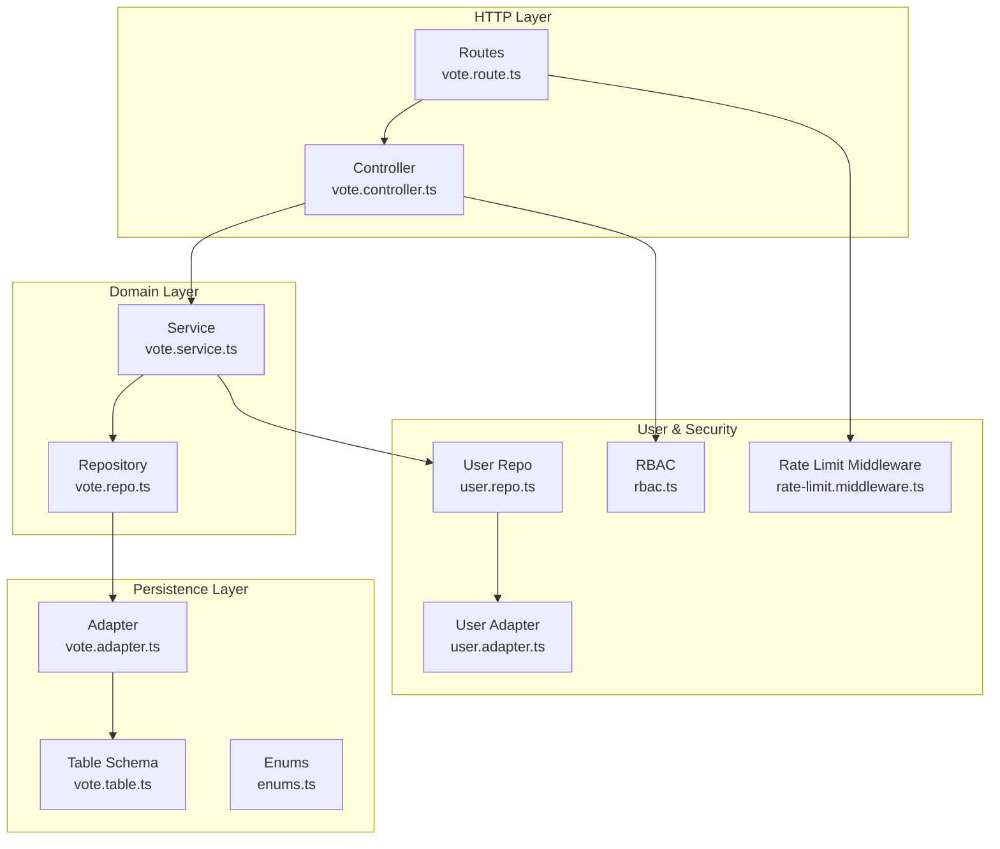
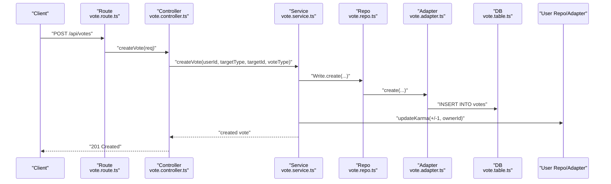
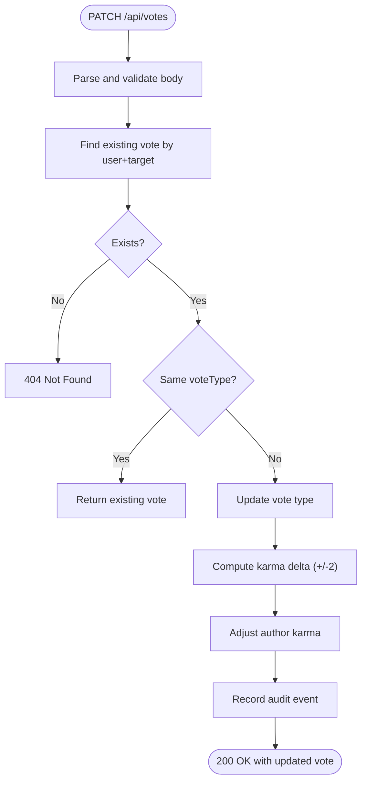
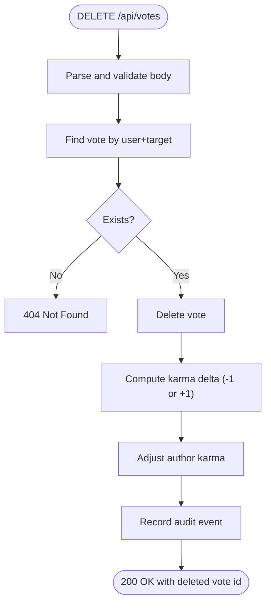
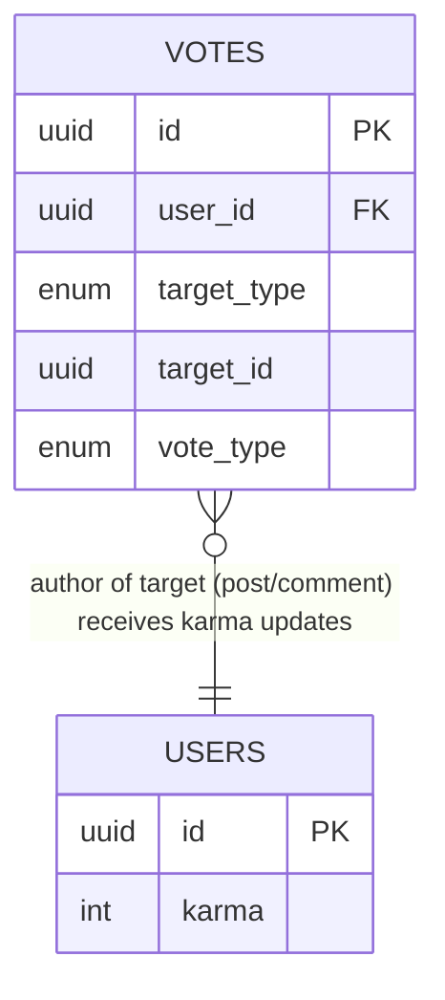
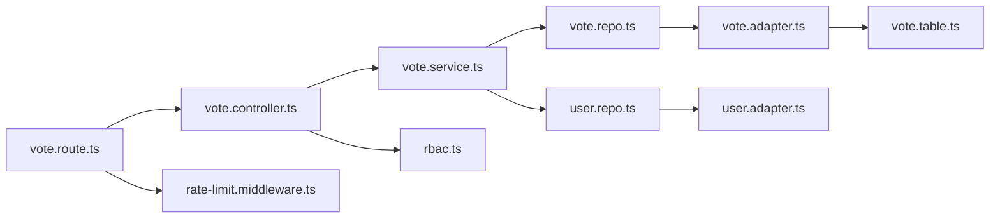

# Voting System API

<cite>
**Referenced Files in This Document**
- [vote.controller.ts](file://server/src/modules/vote/vote.controller.ts)
- [vote.service.ts](file://server/src/modules/vote/vote.service.ts)
- [vote.repo.ts](file://server/src/modules/vote/vote.repo.ts)
- [vote.route.ts](file://server/src/modules/vote/vote.route.ts)
- [vote.schema.ts](file://server/src/modules/vote/vote.schema.ts)
- [vote.adapter.ts](file://server/src/infra/db/adapters/vote.adapter.ts)
- [vote.table.ts](file://server/src/infra/db/tables/vote.table.ts)
- [enums.ts](file://server/src/infra/db/tables/enums.ts)
- [user.adapter.ts](file://server/src/infra/db/adapters/user.adapter.ts)
- [user.repo.ts](file://server/src/modules/user/user.repo.ts)
- [rate-limit.middleware.ts](file://server/src/core/middlewares/rate-limit.middleware.ts)
- [rbac.ts](file://server/src/core/security/rbac.ts)
- [security.ts](file://server/src/config/security.ts)
</cite>

## Table of Contents
1. [Introduction](#introduction)
2. [Project Structure](#project-structure)
3. [Core Components](#core-components)
4. [Architecture Overview](#architecture-overview)
5. [Detailed Component Analysis](#detailed-component-analysis)
6. [Dependency Analysis](#dependency-analysis)
7. [Performance Considerations](#performance-considerations)
8. [Troubleshooting Guide](#troubleshooting-guide)
9. [Conclusion](#conclusion)
10. [Appendices](#appendices)

## Introduction
This document provides comprehensive API documentation for the voting and engagement endpoints. It covers upvote/downvote operations for posts and comments, vote modification, and vote history retrieval. It also documents user engagement tracking via reputation (karma), vote scoring algorithms, permission requirements, rate limiting policies, and moderation workflows. Examples illustrate vote submission, reversal, and engagement metrics.

## Project Structure
The voting system is implemented as a dedicated module with clear separation of concerns:
- Routes define HTTP endpoints and enforce user context.
- Controllers handle request parsing and delegation to services.
- Services encapsulate business logic, including transactional vote creation, modification, and deletion, and maintain author karma.
- Repositories abstract read/write operations with caching.
- Adapters map domain operations to database queries.
- Database tables define schema and constraints, including unique composite indices to prevent duplicate votes.
- Security middleware enforces rate limits and RBAC-derived permissions.

**Diagram sources**
- [vote.route.ts](file://server/src/modules/vote/vote.route.ts#L1-L18)
- [vote.controller.ts](file://server/src/modules/vote/vote.controller.ts#L1-L36)
- [vote.service.ts](file://server/src/modules/vote/vote.service.ts#L1-L184)
- [vote.repo.ts](file://server/src/modules/vote/vote.repo.ts#L1-L22)
- [vote.adapter.ts](file://server/src/infra/db/adapters/vote.adapter.ts#L1-L78)
- [vote.table.ts](file://server/src/infra/db/tables/vote.table.ts#L1-L42)
- [enums.ts](file://server/src/infra/db/tables/enums.ts#L40-L49)
- [user.repo.ts](file://server/src/modules/user/user.repo.ts#L1-L41)
- [user.adapter.ts](file://server/src/infra/db/adapters/user.adapter.ts#L82-L98)
- [rate-limit.middleware.ts](file://server/src/core/middlewares/rate-limit.middleware.ts#L1-L9)
- [rbac.ts](file://server/src/core/security/rbac.ts#L1-L15)

**Section sources**
- [vote.route.ts](file://server/src/modules/vote/vote.route.ts#L1-L18)
- [vote.controller.ts](file://server/src/modules/vote/vote.controller.ts#L1-L36)
- [vote.service.ts](file://server/src/modules/vote/vote.service.ts#L1-L184)
- [vote.repo.ts](file://server/src/modules/vote/vote.repo.ts#L1-L22)
- [vote.adapter.ts](file://server/src/infra/db/adapters/vote.adapter.ts#L1-L78)
- [vote.table.ts](file://server/src/infra/db/tables/vote.table.ts#L1-L42)
- [enums.ts](file://server/src/infra/db/tables/enums.ts#L40-L49)
- [user.repo.ts](file://server/src/modules/user/user.repo.ts#L1-L41)
- [user.adapter.ts](file://server/src/infra/db/adapters/user.adapter.ts#L82-L98)
- [rate-limit.middleware.ts](file://server/src/core/middlewares/rate-limit.middleware.ts#L1-L9)
- [rbac.ts](file://server/src/core/security/rbac.ts#L1-L15)

## Core Components
- Endpoints
  - POST /api/votes: Submit a new upvote or downvote for a post or comment.
  - PATCH /api/votes: Modify an existing vote (change from upvote to downvote or vice versa).
  - DELETE /api/votes: Remove a vote (reverses karma change).
- Request schemas
  - InsertVoteSchema: voteType (upvote or downvote), targetType (post or comment), targetId (UUID).
  - DeleteVoteSchema: targetType, targetId (UUID).
- Response bodies
  - Created: Vote created successfully with the created vote payload.
  - OK: Vote deleted and karma updated successfully with deleted vote identifier.
  - OK: Vote patched successfully with updated vote payload and previous type.
- Authentication and authorization
  - All endpoints require a valid user context.
  - RBAC permissions are derived from roles; enforcement depends on configured role-to-permission mapping.
- Rate limiting
  - API endpoints are protected by rate limiters configured centrally.

**Section sources**
- [vote.controller.ts](file://server/src/modules/vote/vote.controller.ts#L10-L33)
- [vote.schema.ts](file://server/src/modules/vote/vote.schema.ts#L1-L8)
- [vote.route.ts](file://server/src/modules/vote/vote.route.ts#L7-L15)
- [rate-limit.middleware.ts](file://server/src/core/middlewares/rate-limit.middleware.ts#L1-L9)
- [rbac.ts](file://server/src/core/security/rbac.ts#L4-L14)

## Architecture Overview
The voting flow is transactional and maintains author reputation (karma). The service ensures idempotency and prevents duplicate votes through database constraints and caching.

**Diagram sources**
- [vote.route.ts](file://server/src/modules/vote/vote.route.ts#L9-L15)
- [vote.controller.ts](file://server/src/modules/vote/vote.controller.ts#L10-L16)
- [vote.service.ts](file://server/src/modules/vote/vote.service.ts#L19-L69)
- [vote.repo.ts](file://server/src/modules/vote/vote.repo.ts#L15-L19)
- [vote.adapter.ts](file://server/src/infra/db/adapters/vote.adapter.ts#L7-L11)
- [vote.table.ts](file://server/src/infra/db/tables/vote.table.ts#L12-L38)
- [user.adapter.ts](file://server/src/infra/db/adapters/user.adapter.ts#L82-L98)

## Detailed Component Analysis

### Endpoints and Request/Response Contracts
- POST /api/votes
  - Description: Create a new vote for a post or comment.
  - Authenticated: Yes.
  - Body schema:
    - voteType: Enum ["upvote","downvote"]
    - targetType: Enum ["post","comment"]
    - targetId: UUID
  - Responses:
    - 201 Created: Created vote object.
    - 400 Bad Request: Validation errors.
    - 401 Unauthorized: Missing or invalid user context.
    - 404 Not Found: Target post/comment not found.
    - 500 Internal Server Error: Unexpected failure.
- PATCH /api/votes
  - Description: Change an existing vote’s type (e.g., upvote -> downvote).
  - Authenticated: Yes.
  - Body schema: Same as POST.
  - Responses:
    - 200 OK: Updated vote object and previous type.
    - 400 Bad Request: Validation errors.
    - 401 Unauthorized: Missing or invalid user context.
    - 404 Not Found: No existing vote found to modify.
    - 500 Internal Server Error: Unexpected failure.
- DELETE /api/votes
  - Description: Remove a vote (reverses karma change).
  - Authenticated: Yes.
  - Body schema:
    - targetType: Enum ["post","comment"]
    - targetId: UUID
  - Responses:
    - 200 OK: Deletion confirmation with deleted vote identifier.
    - 400 Bad Request: Validation errors.
    - 401 Unauthorized: Missing or invalid user context.
    - 404 Not Found: No existing vote found to delete.
    - 500 Internal Server Error: Unexpected failure.

**Section sources**
- [vote.route.ts](file://server/src/modules/vote/vote.route.ts#L9-L15)
- [vote.controller.ts](file://server/src/modules/vote/vote.controller.ts#L10-L33)
- [vote.schema.ts](file://server/src/modules/vote/vote.schema.ts#L3-L8)

### Vote Modification Workflow (Change Type)

**Diagram sources**
- [vote.service.ts](file://server/src/modules/vote/vote.service.ts#L71-L130)

**Section sources**
- [vote.service.ts](file://server/src/modules/vote/vote.service.ts#L71-L130)

### Vote Deletion Workflow (Reversal)

**Diagram sources**
- [vote.service.ts](file://server/src/modules/vote/vote.service.ts#L132-L181)

**Section sources**
- [vote.service.ts](file://server/src/modules/vote/vote.service.ts#L132-L181)

### Data Model and Constraints

- Unique constraint: Composite index on (userId, targetType, targetId) prevents duplicate votes per user per target.
- Target lookup index: Index on (targetType, targetId) supports efficient target queries.

**Diagram sources**
- [vote.table.ts](file://server/src/infra/db/tables/vote.table.ts#L12-L38)
- [enums.ts](file://server/src/infra/db/tables/enums.ts#L40-L49)

**Section sources**
- [vote.table.ts](file://server/src/infra/db/tables/vote.table.ts#L27-L37)
- [enums.ts](file://server/src/infra/db/tables/enums.ts#L40-L49)

### Vote Scoring and Reputation (Karma) Algorithm
- Upvote increases author karma by +1.
- Downvote decreases author karma by -1.
- Changing an existing vote from up to down or down to up adjusts karma by +2 or -2 respectively.
- Deletion reverses the effect of the removed vote.

**Section sources**
- [vote.service.ts](file://server/src/modules/vote/vote.service.ts#L41-L43)
- [vote.service.ts](file://server/src/modules/vote/vote.service.ts#L98-L100)
- [vote.service.ts](file://server/src/modules/vote/vote.service.ts#L152-L154)
- [user.adapter.ts](file://server/src/infra/db/adapters/user.adapter.ts#L82-L98)

### Permission Requirements and RBAC
- All voting endpoints are protected by a user context middleware.
- RBAC computes effective permissions from user roles. Authorization checks can be layered on top of the existing permission computation.

**Section sources**
- [vote.route.ts](file://server/src/modules/vote/vote.route.ts#L7-L7)
- [rbac.ts](file://server/src/core/security/rbac.ts#L4-L14)

### Rate Limiting Policies
- Rate limiting middleware exposes pre-configured limiters for authenticated and general API usage.
- Apply these limiters around the voting routes to enforce quotas.

**Section sources**
- [rate-limit.middleware.ts](file://server/src/core/middlewares/rate-limit.middleware.ts#L1-L9)

### Duplicate Vote Prevention
- Database-level unique index on (userId, targetType, targetId) prevents duplicates.
- Service logic relies on this constraint to maintain data integrity.

**Section sources**
- [vote.table.ts](file://server/src/infra/db/tables/vote.table.ts#L27-L32)
- [vote.adapter.ts](file://server/src/infra/db/adapters/vote.adapter.ts#L31-L40)

### Vote History Retrieval
- Current implementation focuses on CRUD operations for votes but does not expose a dedicated endpoint to fetch vote history.
- To support analytics and moderation, consider adding:
  - GET /api/votes/history?targetType=post&targetId={id}
  - GET /api/votes/history?targetType=comment&targetId={id}
  - GET /api/users/{userId}/votes
- These endpoints would leverage the target lookup index and could return paginated vote records with timestamps and user actions.

[No sources needed since this section proposes future additions not present in current code]

### Moderation Workflows and Abuse Prevention
- Audit trail: All vote actions are recorded with structured metadata for traceability.
- Abuse prevention measures can include:
  - Rate limiting per user per target.
  - Threshold-based alerts for rapid successive vote changes.
  - Suspicious activity monitoring (e.g., mass downvote campaigns).
  - Admin review queues for flagged targets.

[No sources needed since this section provides general guidance]

## Dependency Analysis

**Diagram sources**
- [vote.route.ts](file://server/src/modules/vote/vote.route.ts#L1-L18)
- [vote.controller.ts](file://server/src/modules/vote/vote.controller.ts#L1-L36)
- [vote.service.ts](file://server/src/modules/vote/vote.service.ts#L1-L184)
- [vote.repo.ts](file://server/src/modules/vote/vote.repo.ts#L1-L22)
- [vote.adapter.ts](file://server/src/infra/db/adapters/vote.adapter.ts#L1-L78)
- [vote.table.ts](file://server/src/infra/db/tables/vote.table.ts#L1-L42)
- [user.repo.ts](file://server/src/modules/user/user.repo.ts#L1-L41)
- [user.adapter.ts](file://server/src/infra/db/adapters/user.adapter.ts#L1-L120)
- [rate-limit.middleware.ts](file://server/src/core/middlewares/rate-limit.middleware.ts#L1-L9)
- [rbac.ts](file://server/src/core/security/rbac.ts#L1-L15)

**Section sources**
- [vote.service.ts](file://server/src/modules/vote/vote.service.ts#L1-L184)
- [vote.adapter.ts](file://server/src/infra/db/adapters/vote.adapter.ts#L1-L78)
- [user.adapter.ts](file://server/src/infra/db/adapters/user.adapter.ts#L82-L98)

## Performance Considerations
- Transactional writes ensure atomicity for vote creation/modification/deletion and associated karma updates.
- Caching:
  - VoteRepo caches lookups by user+target to reduce DB load.
  - UserRepo caches user reads.
- Indexes:
  - Unique composite index on votes prevents duplicates and supports fast existence checks.
  - Target lookup index accelerates queries by targetType and targetId.
- Recommendations:
  - Add pagination and filters for any future vote history endpoints.
  - Consider background jobs for heavy analytics computations.

[No sources needed since this section provides general guidance]

## Troubleshooting Guide
- 400 Bad Request
  - Occurs when request body fails schema validation (invalid voteType, targetType, or malformed targetId).
- 401 Unauthorized
  - Occurs when user context is missing or invalid.
- 404 Not Found
  - Vote not found for modification/deletion.
  - Target post/comment not found.
- 500 Internal Server Error
  - Failure during vote creation or persistence.
- Audit logs
  - All vote operations are audited with metadata for debugging and compliance.

**Section sources**
- [vote.controller.ts](file://server/src/modules/vote/vote.controller.ts#L10-L33)
- [vote.service.ts](file://server/src/modules/vote/vote.service.ts#L27-L38)
- [vote.service.ts](file://server/src/modules/vote/vote.service.ts#L76-L79)
- [vote.service.ts](file://server/src/modules/vote/vote.service.ts#L138-L141)
- [vote.service.ts](file://server/src/modules/vote/vote.service.ts#L146-L149)

## Conclusion
The voting system provides robust, transactional endpoints for upvote/downvote operations on posts and comments, with built-in duplicate prevention, karma adjustments, and audit logging. While current endpoints focus on CRUD operations, extending them with analytics and moderation capabilities will further strengthen the platform’s engagement and safety features.

## Appendices

### Endpoint Reference
- POST /api/votes
  - Body: voteType, targetType, targetId
  - Responses: 201 Created, 400/401/404/500
- PATCH /api/votes
  - Body: voteType, targetType, targetId
  - Responses: 200 OK, 400/401/404/500
- DELETE /api/votes
  - Body: targetType, targetId
  - Responses: 200 OK, 400/401/404/500

**Section sources**
- [vote.route.ts](file://server/src/modules/vote/vote.route.ts#L9-L15)
- [vote.controller.ts](file://server/src/modules/vote/vote.controller.ts#L10-L33)
- [vote.schema.ts](file://server/src/modules/vote/vote.schema.ts#L3-L8)

### Example Workflows
- Submit a vote
  - POST /api/votes with voteType=upvote, targetType=post, targetId=<uuid>
- Reverse a vote
  - PATCH /api/votes with voteType=downvote, targetType=post, targetId=<uuid>
- Remove a vote
  - DELETE /api/votes with targetType=post, targetId=<uuid>
- Engagement metrics
  - Current implementation updates author karma; analytics endpoints can be added to retrieve historical vote trends.

[No sources needed since this section provides general guidance]