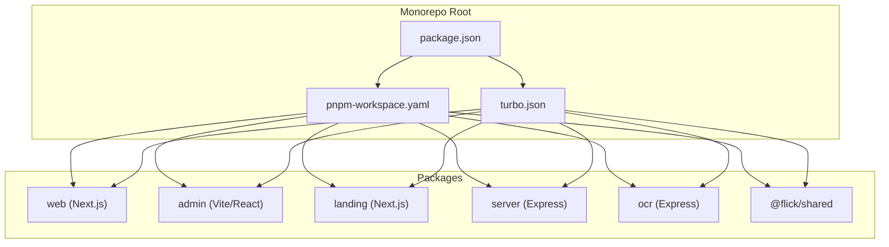
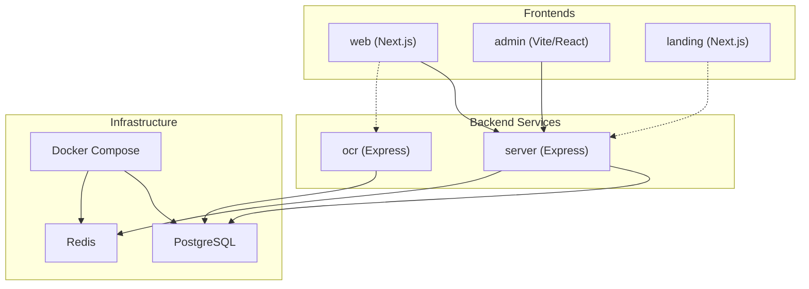
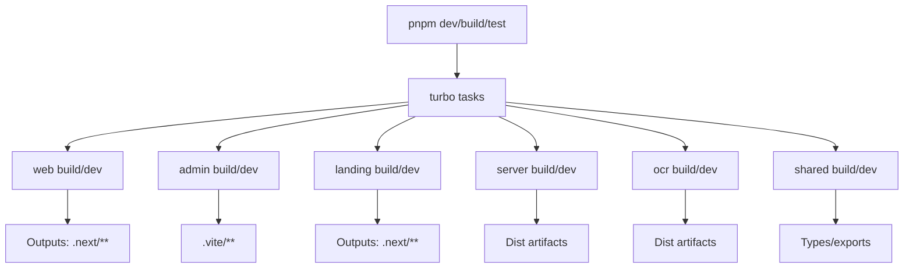
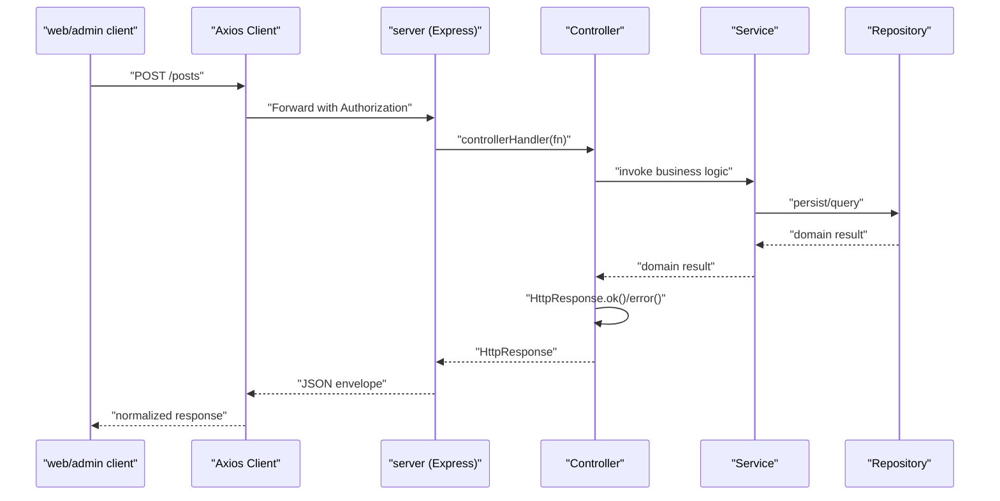
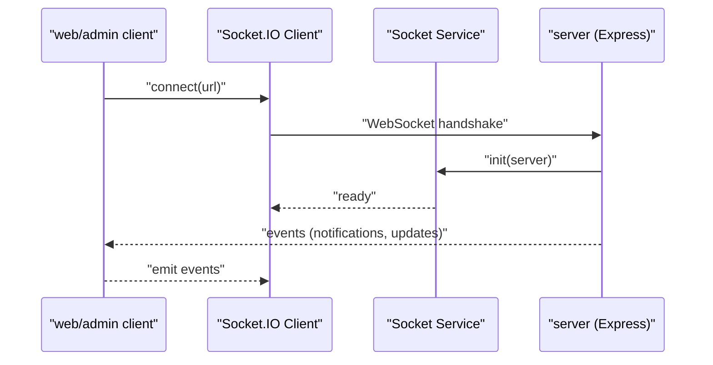
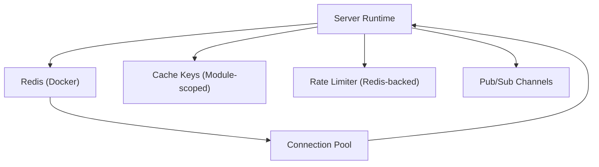
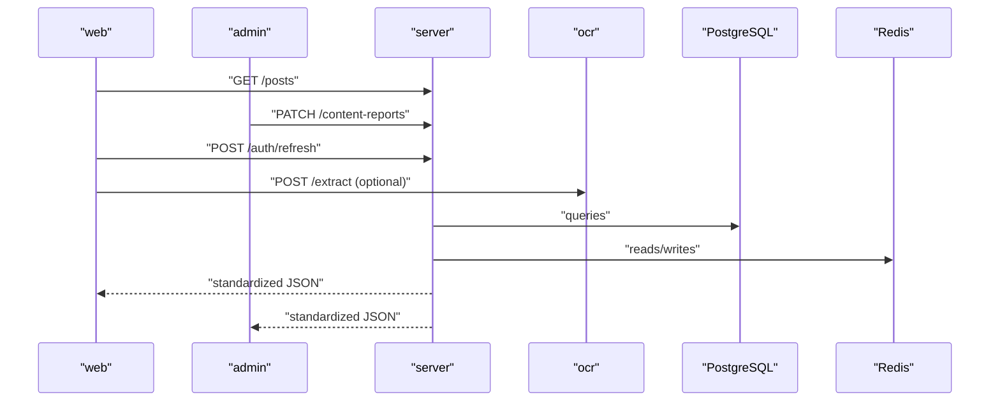
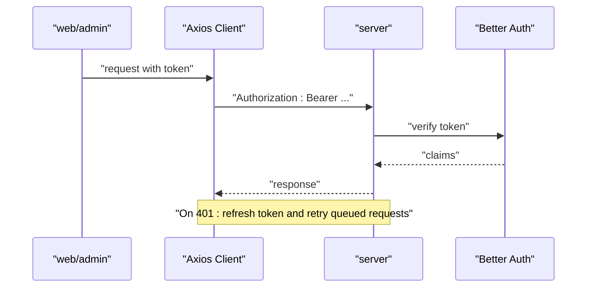
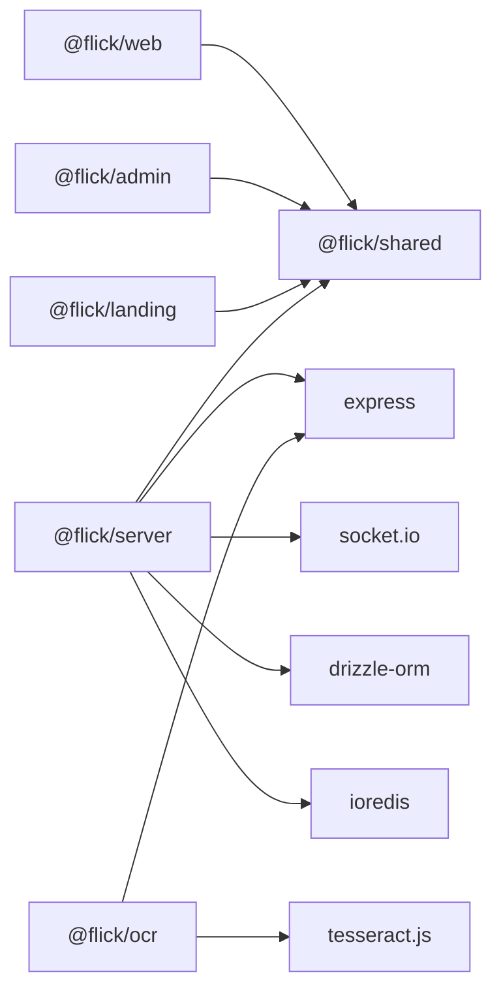

# Architecture

<cite>
**Referenced Files in This Document**
- [package.json](file://package.json)
- [pnpm-workspace.yaml](file://pnpm-workspace.yaml)
- [turbo.json](file://turbo.json)
- [server/package.json](file://server/package.json)
- [web/package.json](file://web/package.json)
- [admin/package.json](file://admin/package.json)
- [landing/package.json](file://landing/package.json)
- [ocr/package.json](file://ocr/package.json)
- [shared/package.json](file://shared/package.json)
- [server/src/app.ts](file://server/src/app.ts)
- [server/src/server.ts](file://server/src/server.ts)
- [server/src/core/http/controller.ts](file://server/src/core/http/controller.ts)
- [server/src/core/http/response.ts](file://server/src/core/http/response.ts)
- [server/src/core/http/error.ts](file://server/src/core/http/error.ts)
- [web/src/services/http.ts](file://web/src/services/http.ts)
- [admin/src/services/http.ts](file://admin/src/services/http.ts)
- [server/infra/docker-compose.yml](file://server/infra/docker-compose.yml)
- [server/infra/redis.conf](file://server/infra/redis.conf)
</cite>

## Table of Contents
1. [Introduction](#introduction)
2. [Project Structure](#project-structure)
3. [Core Components](#core-components)
4. [Architecture Overview](#architecture-overview)
5. [Detailed Component Analysis](#detailed-component-analysis)
6. [Dependency Analysis](#dependency-analysis)
7. [Performance Considerations](#performance-considerations)
8. [Troubleshooting Guide](#troubleshooting-guide)
9. [Conclusion](#conclusion)
10. [Appendices](#appendices)

## Introduction
This document describes the architecture of the Flick monorepo, focusing on high-level design patterns, package responsibilities, build system, data flow, inter-package communication, real-time capabilities, caching strategy, and operational considerations. The system follows a layered architecture with a service layer pattern and repository pattern, organized into six packages: web (Next.js frontend), admin (React admin panel), landing (marketing site), server (Express backend), ocr (standalone OCR service), and shared (common utilities). Turborepo orchestrates builds and caching across packages, while Socket.IO enables real-time features and Redis powers caching and pub/sub.

## Project Structure
The monorepo uses PNPM workspaces to manage six packages and a central Turborepo configuration for build orchestration. Each package encapsulates a distinct boundary and responsibility, communicating primarily via HTTP APIs and real-time channels.

**Diagram sources**
- [pnpm-workspace.yaml](file://pnpm-workspace.yaml#L1-L15)
- [turbo.json](file://turbo.json#L1-L23)
- [package.json](file://package.json#L1-L26)

**Section sources**
- [pnpm-workspace.yaml](file://pnpm-workspace.yaml#L1-L15)
- [turbo.json](file://turbo.json#L1-L23)
- [package.json](file://package.json#L1-L26)

## Core Components
- Layered architecture: Presentation (web/admin/landing), Application (controllers/services), Domain (business logic), Infrastructure (DB, cache, sockets).
- Service layer pattern: Controllers delegate to services; services encapsulate business logic and coordinate repositories.
- Repository pattern: Modules define repositories per domain entity, abstracting persistence concerns.
- Shared utilities: Centralized under @flick/shared for cross-cutting concerns and reusable types.

Key implementation anchors:
- HTTP response envelope and standardized controller wrappers in the server core.
- Frontend HTTP clients with token injection and automatic refresh handling.
- Real-time initialization via Socket.IO in the server app bootstrap.

**Section sources**
- [server/src/core/http/response.ts](file://server/src/core/http/response.ts#L1-L104)
- [server/src/core/http/controller.ts](file://server/src/core/http/controller.ts#L1-L82)
- [web/src/services/http.ts](file://web/src/services/http.ts#L1-L133)
- [admin/src/services/http.ts](file://admin/src/services/http.ts#L1-L133)
- [server/src/app.ts](file://server/src/app.ts#L1-L33)

## Architecture Overview
The system is composed of:
- Frontends: web (authenticated user app), admin (moderation and analytics), landing (marketing).
- Backend: server (Express) exposing REST APIs and managing real-time events.
- Standalone service: ocr (OCR extraction endpoint).
- Shared: common utilities and types.
- Infrastructure: PostgreSQL (via Drizzle ORM), Redis (caching and pub/sub), Docker Compose for local dev.

**Diagram sources**
- [server/src/app.ts](file://server/src/app.ts#L1-L33)
- [server/package.json](file://server/package.json#L27-L56)
- [ocr/package.json](file://ocr/package.json#L15-L33)
- [server/infra/docker-compose.yml](file://server/infra/docker-compose.yml)

## Detailed Component Analysis

### Package Responsibilities
- web: Next.js frontend for authenticated users; posts, comments, notifications, real-time updates, and user profile management.
- admin: Vite/React admin panel for moderation, analytics, and administrative tasks.
- landing: Marketing site built with Next.js for outreach and conversion.
- server: Express backend implementing REST APIs, authentication, authorization, rate limiting, logging, and real-time via Socket.IO.
- ocr: Standalone Express service for OCR extraction endpoints.
- shared: Common utilities and exports for cross-package reuse.

**Section sources**
- [web/package.json](file://web/package.json#L1-L59)
- [admin/package.json](file://admin/package.json#L1-L76)
- [landing/package.json](file://landing/package.json#L1-L36)
- [server/package.json](file://server/package.json#L1-L78)
- [ocr/package.json](file://ocr/package.json#L1-L34)
- [shared/package.json](file://shared/package.json#L1-L19)

### Build System with Turborepo
- Turborepo orchestrates builds across packages with task definitions for build, check-types, and dev.
- Build caching and incremental builds leverage task graph dependencies defined in turbo.json.
- Root scripts trigger parallel development across all packages.

**Diagram sources**
- [turbo.json](file://turbo.json#L1-L23)
- [package.json](file://package.json#L7-L12)

**Section sources**
- [turbo.json](file://turbo.json#L1-L23)
- [package.json](file://package.json#L7-L12)

### HTTP API Contracts and Standardization
- Server enforces a standardized HTTP response envelope and typed controller wrappers.
- Controllers return HttpResponse instances; errors are normalized via HttpError factory methods.
- Frontends use Axios clients configured with base URLs and automatic bearer token injection, plus centralized 401 refresh logic.

**Diagram sources**
- [server/src/core/http/controller.ts](file://server/src/core/http/controller.ts#L11-L35)
- [server/src/core/http/response.ts](file://server/src/core/http/response.ts#L34-L101)
- [server/src/core/http/error.ts](file://server/src/core/http/error.ts#L71-L107)
- [web/src/services/http.ts](file://web/src/services/http.ts#L5-L132)
- [admin/src/services/http.ts](file://admin/src/services/http.ts#L5-L132)

**Section sources**
- [server/src/core/http/response.ts](file://server/src/core/http/response.ts#L1-L104)
- [server/src/core/http/error.ts](file://server/src/core/http/error.ts#L1-L131)
- [server/src/core/http/controller.ts](file://server/src/core/http/controller.ts#L1-L82)
- [web/src/services/http.ts](file://web/src/services/http.ts#L1-L133)
- [admin/src/services/http.ts](file://admin/src/services/http.ts#L1-L133)

### Real-Time Communication with Socket.IO
- The server initializes Socket.IO during app bootstrap and exposes real-time channels for notifications and live updates.
- Frontends connect using socket.io-client and consume events via dedicated hooks and contexts.

**Diagram sources**
- [server/src/app.ts](file://server/src/app.ts#L10-L30)
- [web/src/services/http.ts](file://web/src/services/http.ts#L1-L133)
- [admin/src/services/http.ts](file://admin/src/services/http.ts#L1-L133)

**Section sources**
- [server/src/app.ts](file://server/src/app.ts#L1-L33)
- [server/package.json](file://server/package.json#L51-L51)

### Caching Strategy with Redis
- Redis is provisioned via Docker Compose and integrated into the server runtime for caching and pub/sub.
- The server package depends on ioredis for Redis connectivity; cache keys are module-specific and used across services.

**Diagram sources**
- [server/package.json](file://server/package.json#L41-L41)
- [server/infra/docker-compose.yml](file://server/infra/docker-compose.yml)
- [server/infra/redis.conf](file://server/infra/redis.conf)

**Section sources**
- [server/package.json](file://server/package.json#L41-L41)
- [server/infra/docker-compose.yml](file://server/infra/docker-compose.yml)
- [server/infra/redis.conf](file://server/infra/redis.conf)

### Data Flow Between Packages
- web and admin call server REST endpoints for CRUD operations, authentication, and notifications.
- web optionally integrates with the ocr service for image-to-text extraction.
- Landing communicates with server for public endpoints (e.g., marketing content).
- All HTTP traffic is normalized through Axios interceptors and server-side envelopes.

**Diagram sources**
- [web/src/services/http.ts](file://web/src/services/http.ts#L1-L133)
- [admin/src/services/http.ts](file://admin/src/services/http.ts#L1-L133)
- [server/src/app.ts](file://server/src/app.ts#L1-L33)
- [ocr/package.json](file://ocr/package.json#L15-L33)

**Section sources**
- [web/src/services/http.ts](file://web/src/services/http.ts#L1-L133)
- [admin/src/services/http.ts](file://admin/src/services/http.ts#L1-L133)
- [server/src/app.ts](file://server/src/app.ts#L1-L33)
- [ocr/package.json](file://ocr/package.json#L15-L33)

### Authentication and Authorization
- Authentication is handled by Better Auth; tokens are stored and refreshed centrally.
- Frontend Axios clients inject Authorization headers and queue requests during refresh.
- Server applies security middleware and RBAC utilities.

**Diagram sources**
- [web/src/services/http.ts](file://web/src/services/http.ts#L56-L109)
- [admin/src/services/http.ts](file://admin/src/services/http.ts#L56-L109)
- [server/package.json](file://server/package.json#L32-L32)

**Section sources**
- [web/src/services/http.ts](file://web/src/services/http.ts#L1-L133)
- [admin/src/services/http.ts](file://admin/src/services/http.ts#L1-L133)
- [server/package.json](file://server/package.json#L32-L32)

## Dependency Analysis
- Workspace dependencies: web, admin, landing depend on @flick/shared; server also depends on @flick/shared.
- External dependencies: Express, Socket.IO, Drizzle ORM, PostgreSQL driver, ioredis, rate limiter, helmet, morgan, better-auth, and others.
- Build/runtime dependencies: Turborepo, PNPM workspaces, Docker Compose for local infrastructure.

**Diagram sources**
- [web/package.json](file://web/package.json#L14-L14)
- [admin/package.json](file://admin/package.json#L12-L12)
- [landing/package.json](file://landing/package.json#L11-L11)
- [server/package.json](file://server/package.json#L28-L56)
- [ocr/package.json](file://ocr/package.json#L15-L22)

**Section sources**
- [web/package.json](file://web/package.json#L14-L14)
- [admin/package.json](file://admin/package.json#L12-L12)
- [landing/package.json](file://landing/package.json#L11-L11)
- [server/package.json](file://server/package.json#L28-L56)
- [ocr/package.json](file://ocr/package.json#L15-L22)

## Performance Considerations
- Parallel builds: Turborepo caches and runs tasks in parallel across packages.
- Incremental builds: Task graph dependencies avoid unnecessary rebuilds.
- Caching: Redis-backed caching reduces database load; module-scoped cache keys prevent collisions.
- Rate limiting: Built-in rate limiter middleware protects endpoints from abuse.
- Real-time scaling: Socket.IO connections scale horizontally behind load balancers; consider sticky sessions or Redis adapter for clustering.

[No sources needed since this section provides general guidance]

## Troubleshooting Guide
- Server startup failures: Inspect server error handlers and startup logs.
- 401 Unauthorized flows: Verify token refresh interceptor logic and ensure refresh endpoint availability.
- Redis connectivity: Confirm Docker Compose stack is running and Redis configuration is loaded.
- Database migrations: Use Drizzle Kit commands exposed in server scripts.

**Section sources**
- [server/src/server.ts](file://server/src/server.ts#L13-L16)
- [web/src/services/http.ts](file://web/src/services/http.ts#L56-L109)
- [server/infra/docker-compose.yml](file://server/infra/docker-compose.yml)
- [server/package.json](file://server/package.json#L15-L19)

## Conclusion
Flick employs a clean, layered architecture with explicit separation of concerns across six packages. Turborepo streamlines builds and caching, while Socket.IO and Redis enable real-time and scalable data access. The standardized HTTP response envelope and centralized interceptors unify API interactions. With proper infrastructure provisioning and horizontal scaling strategies, the system supports growth and maintainability.

[No sources needed since this section summarizes without analyzing specific files]

## Appendices

### System Boundaries and Integration Points
- web/admin/landing: HTTP clients to server; optional OCR integration.
- server: REST APIs, Socket.IO, Redis cache, PostgreSQL via Drizzle ORM.
- ocr: Dedicated OCR extraction endpoints.
- shared: Cross-package utilities and exports.

**Section sources**
- [web/src/services/http.ts](file://web/src/services/http.ts#L1-L133)
- [admin/src/services/http.ts](file://admin/src/services/http.ts#L1-L133)
- [server/src/app.ts](file://server/src/app.ts#L1-L33)
- [ocr/package.json](file://ocr/package.json#L15-L33)
- [shared/package.json](file://shared/package.json#L14-L17)