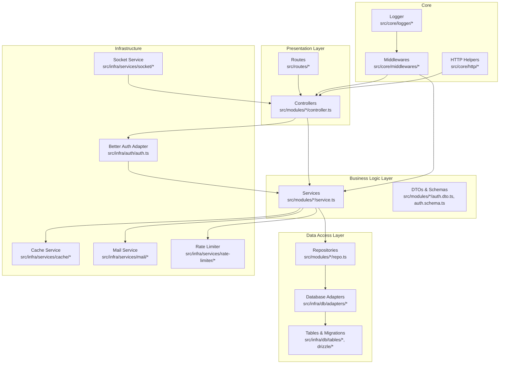
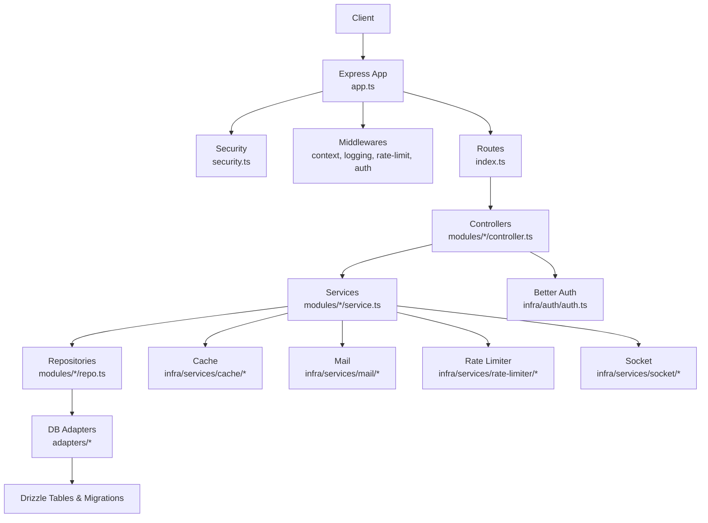
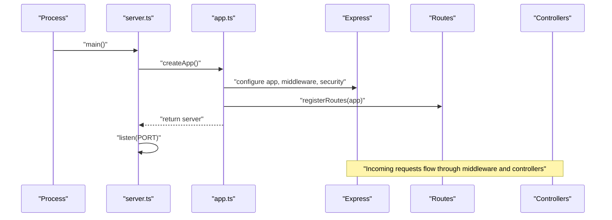
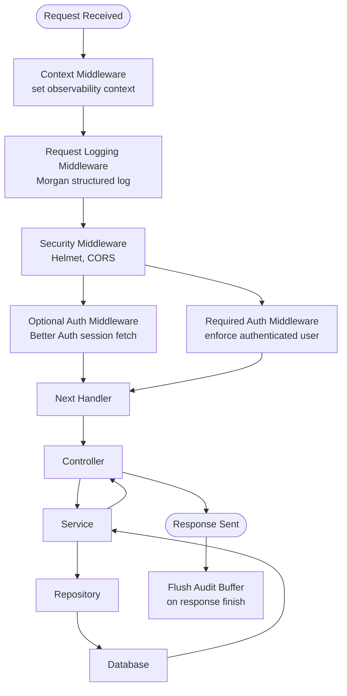
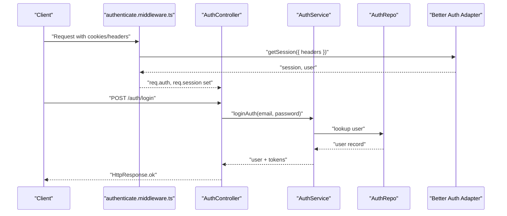
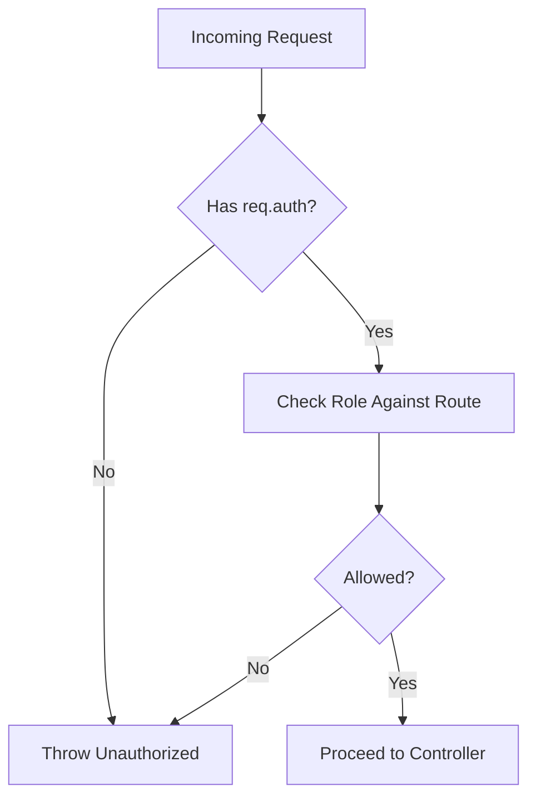
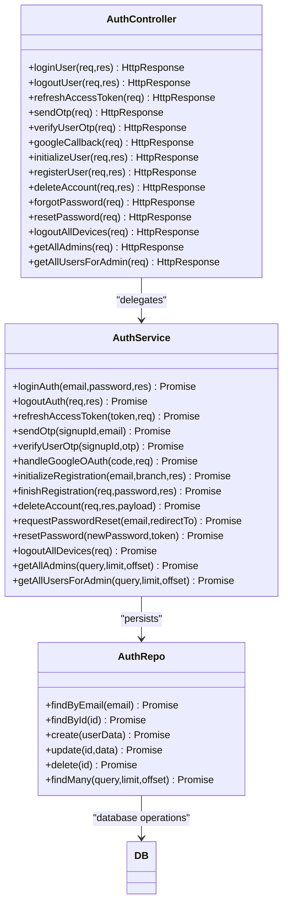
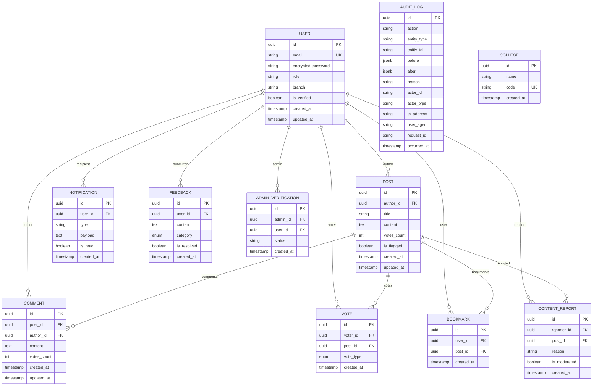
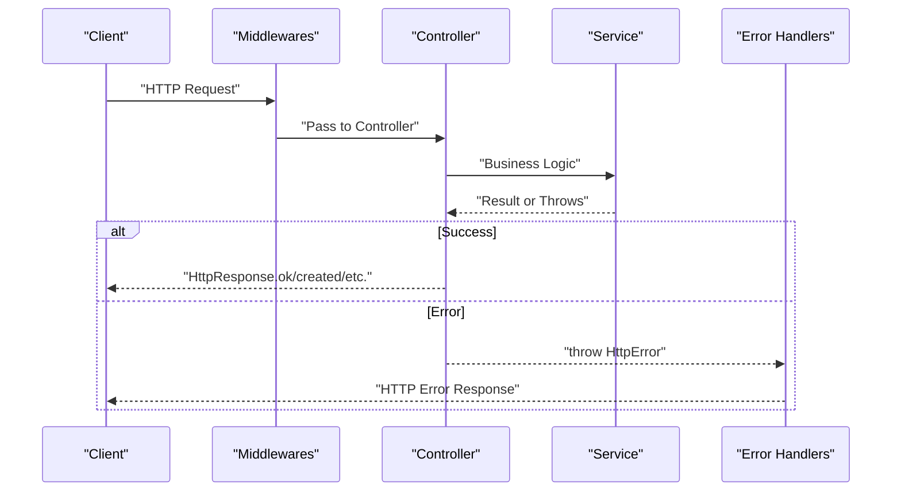
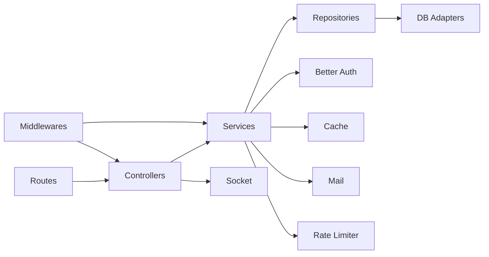

# Backend Architecture

<cite>
**Referenced Files in This Document**
- [server.ts](file://server/src/server.ts)
- [app.ts](file://server/src/app.ts)
- [security.ts](file://server/src/config/security.ts)
- [env.ts](file://server/src/config/env.ts)
- [index.ts](file://server/src/core/middlewares/index.ts)
- [context.middleware.ts](file://server/src/core/middlewares/context.middleware.ts)
- [request-logging.middleware.ts](file://server/src/core/middlewares/request-logging.middleware.ts)
- [rate-limit.middleware.ts](file://server/src/core/middlewares/rate-limit.middleware.ts)
- [authenticate.middleware.ts](file://server/src/core/middlewares/auth/authenticate.middleware.ts)
- [require-auth.middleware.ts](file://server/src/core/middlewares/auth/require-auth.middleware.ts)
- [require-user.middleware.ts](file://server/src/core/middlewares/auth/require-user.middleware.ts)
- [roles.ts](file://server/src/config/roles.ts)
- [rbac.ts](file://server/src/core/security/rbac.ts)
- [auth.controller.ts](file://server/src/modules/auth/auth.controller.ts)
- [auth.service.ts](file://server/src/modules/auth/auth.service.ts)
- [auth.repo.ts](file://server/src/modules/auth/auth.repo.ts)
- [auth.route.ts](file://server/src/modules/auth/auth.route.ts)
- [auth.dto.ts](file://server/src/modules/auth/auth.dto.ts)
- [auth.types.ts](file://server/src/modules/auth/auth.types.ts)
- [auth.schema.ts](file://server/src/modules/auth/auth.schema.ts)
- [auth.cache-keys.ts](file://server/src/modules/auth/auth.cache-keys.ts)
- [auth.ts](file://server/src/infra/auth/auth.ts)
- [health.routes.ts](file://server/src/routes/health.routes.ts)
- [index.ts](file://server/src/routes/index.ts)
- [socket.ts](file://server/src/infra/services/socket/socket.ts)
- [cache.ts](file://server/src/infra/services/cache/cache.ts)
- [mail.ts](file://server/src/infra/services/mail/mail.ts)
- [rate-limiter.ts](file://server/src/infra/services/rate-limiter/rate-limiter.ts)
- [db/index.ts](file://server/src/infra/db/index.ts)
- [db/adapters/mysql.ts](file://server/src/infra/db/adapters/mysql.ts)
- [db/adapters/pg.ts](file://server/src/infra/db/adapters/pg.ts)
- [db/transactions.ts](file://server/src/infra/db/transactions.ts)
- [db/types.ts](file://server/src/infra/db/types.ts)
- [db/tables/*.ts](file://server/src/infra/db/tables/user.ts)
- [db/tables/*.ts](file://server/src/infra/db/tables/post.ts)
- [db/tables/*.ts](file://server/src/infra/db/tables/comment.ts)
- [db/tables/*.ts](file://server/src/infra/db/tables/vote.ts)
- [db/tables/*.ts](file://server/src/infra/db/tables/bookmark.ts)
- [db/tables/*.ts](file://server/src/infra/db/tables/notification.ts)
- [db/tables/*.ts](file://server/src/infra/db/tables/feedback.ts)
- [db/tables/*.ts](file://server/src/infra/db/tables/audit_log.ts)
- [db/tables/*.ts](file://server/src/infra/db/tables/college.ts)
- [db/tables/*.ts](file://server/src/infra/db/tables/content_report.ts)
- [db/tables/*.ts](file://server/src/infra/db/tables/admin_verification.ts)
- [db/meta/_journal.json](file://server/drizzle/meta/_journal.json)
- [db/meta/0000_snapshot.json](file://server/drizzle/meta/0000_snapshot.json)
- [db/meta/0001_snapshot.json](file://server/drizzle/meta/0001_snapshot.json)
- [db/0000_bored_dakota_north.sql](file://server/drizzle/0000_bored_dakota_north.sql)
- [db/0001_early_masked_marvel.sql](file://server/drizzle/0001_early_masked_marvel.sql)
- [drizzle.config.ts](file://server/drizzle.config.ts)
- [docker-compose.yml](file://server/infra/docker-compose.yml)
- [redis.conf](file://server/infra/redis.conf)
</cite>

## Table of Contents
1. [Introduction](#introduction)
2. [Project Structure](#project-structure)
3. [Core Components](#core-components)
4. [Architecture Overview](#architecture-overview)
5. [Detailed Component Analysis](#detailed-component-analysis)
6. [Dependency Analysis](#dependency-analysis)
7. [Performance Considerations](#performance-considerations)
8. [Troubleshooting Guide](#troubleshooting-guide)
9. [Conclusion](#conclusion)
10. [Appendices](#appendices)

## Introduction
This document describes the backend architecture of the Flick application, focusing on the Express.js application built with layered design patterns: presentation, business logic, and data access. It documents the middleware stack covering authentication, error handling, rate limiting, and request logging. It explains the service layer pattern, Better Auth integration for authentication flows and session management, RBAC for role-based access control, and the request-response lifecycle. It also covers application bootstrap, configuration management, scalability, performance optimization, and monitoring integration.

## Project Structure
The backend is organized as a monorepo workspace with a primary server module under server/. The structure follows a layered architecture:
- Presentation Layer: Express routes and controllers
- Business Logic Layer: Services implementing domain logic
- Data Access Layer: Repositories and database adapters
- Infrastructure: Auth, caching, mail, rate limiting, sockets, and DB connectivity
- Core: Shared utilities, middlewares, HTTP helpers, and logging

**Diagram sources**
- [app.ts](file://server/src/app.ts#L1-L33)
- [index.ts](file://server/src/routes/index.ts#L1-L200)
- [auth.controller.ts](file://server/src/modules/auth/auth.controller.ts#L1-L171)
- [auth.service.ts](file://server/src/modules/auth/auth.service.ts#L1-L500)
- [auth.repo.ts](file://server/src/modules/auth/auth.repo.ts#L1-L500)
- [auth.ts](file://server/src/infra/auth/auth.ts#L1-L200)
- [cache.ts](file://server/src/infra/services/cache/cache.ts#L1-L200)
- [mail.ts](file://server/src/infra/services/mail/mail.ts#L1-L200)
- [rate-limiter.ts](file://server/src/infra/services/rate-limiter/rate-limiter.ts#L1-L200)
- [socket.ts](file://server/src/infra/services/socket/socket.ts#L1-L200)
- [context.middleware.ts](file://server/src/core/middlewares/context.middleware.ts#L1-L60)
- [request-logging.middleware.ts](file://server/src/core/middlewares/request-logging.middleware.ts#L1-L40)
- [rate-limit.middleware.ts](file://server/src/core/middlewares/rate-limit.middleware.ts#L1-L9)

**Section sources**
- [app.ts](file://server/src/app.ts#L1-L33)
- [index.ts](file://server/src/routes/index.ts#L1-L200)

## Core Components
- Application Bootstrap: The server initializes via server.ts, creates the Express app via app.ts, applies security and middleware, registers routes, and starts listening on the configured port.
- Configuration Management: Environment variables are validated and parsed using Zod for strict type safety.
- Security Middleware: Helmet and CORS are applied globally; request context and request logging capture telemetry; rate limiting is enforced per endpoint or route group.
- Authentication: Better Auth adapter integrates session retrieval and cookie-based auth; optional authenticate middleware attaches user/session to requests; require-auth middleware enforces presence of authenticated user.
- RBAC: Role keys and permissions are defined centrally; require-role and require-permission middlewares enforce authorization.
- Service Layer Pattern: Controllers delegate to services; services encapsulate business logic and coordinate repositories and infrastructure services.
- Data Access: Repositories abstract database operations; Drizzle ORM manages migrations and table schemas; adapters support MySQL and PostgreSQL.

**Section sources**
- [server.ts](file://server/src/server.ts#L1-L22)
- [app.ts](file://server/src/app.ts#L1-L33)
- [security.ts](file://server/src/config/security.ts#L1-L14)
- [env.ts](file://server/src/config/env.ts#L1-L34)
- [index.ts](file://server/src/core/middlewares/index.ts#L1-L14)
- [context.middleware.ts](file://server/src/core/middlewares/context.middleware.ts#L1-L60)
- [request-logging.middleware.ts](file://server/src/core/middlewares/request-logging.middleware.ts#L1-L40)
- [rate-limit.middleware.ts](file://server/src/core/middlewares/rate-limit.middleware.ts#L1-L9)
- [authenticate.middleware.ts](file://server/src/core/middlewares/auth/authenticate.middleware.ts#L1-L21)
- [require-auth.middleware.ts](file://server/src/core/middlewares/auth/require-auth.middleware.ts#L1-L12)
- [roles.ts](file://server/src/config/roles.ts#L1-L11)
- [rbac.ts](file://server/src/core/security/rbac.ts#L1-L200)

## Architecture Overview
The backend follows a layered, modular architecture with clear separation of concerns:
- Presentation: Routes define endpoints; controllers handle HTTP concerns and delegate to services.
- Business Logic: Services encapsulate domain logic, orchestrate repositories, and integrate infrastructure services.
- Data Access: Repositories abstract persistence; Drizzle manages schema and migrations; adapters support multiple databases.
- Infrastructure: Auth, cache, mail, rate limiter, and socket services provide cross-cutting capabilities.
- Core: Shared middlewares, HTTP helpers, and logging unify behavior across modules.

**Diagram sources**
- [app.ts](file://server/src/app.ts#L1-L33)
- [security.ts](file://server/src/config/security.ts#L1-L14)
- [context.middleware.ts](file://server/src/core/middlewares/context.middleware.ts#L1-L60)
- [request-logging.middleware.ts](file://server/src/core/middlewares/request-logging.middleware.ts#L1-L40)
- [rate-limit.middleware.ts](file://server/src/core/middlewares/rate-limit.middleware.ts#L1-L9)
- [index.ts](file://server/src/routes/index.ts#L1-L200)
- [auth.controller.ts](file://server/src/modules/auth/auth.controller.ts#L1-L171)
- [auth.service.ts](file://server/src/modules/auth/auth.service.ts#L1-L500)
- [auth.repo.ts](file://server/src/modules/auth/auth.repo.ts#L1-L500)
- [auth.ts](file://server/src/infra/auth/auth.ts#L1-L200)
- [cache.ts](file://server/src/infra/services/cache/cache.ts#L1-L200)
- [mail.ts](file://server/src/infra/services/mail/mail.ts#L1-L200)
- [rate-limiter.ts](file://server/src/infra/services/rate-limiter/rate-limiter.ts#L1-L200)
- [socket.ts](file://server/src/infra/services/socket/socket.ts#L1-L200)

## Detailed Component Analysis

### Application Bootstrap and Startup
- server.ts orchestrates startup, reads environment configuration, and starts the HTTP server.
- app.ts configures Express, installs middleware, applies security, registers routes, and sets global error handlers.
- The server listens on the configured port and logs startup status; errors are handled gracefully.

**Diagram sources**
- [server.ts](file://server/src/server.ts#L1-L22)
- [app.ts](file://server/src/app.ts#L1-L33)
- [index.ts](file://server/src/routes/index.ts#L1-L200)

**Section sources**
- [server.ts](file://server/src/server.ts#L1-L22)
- [app.ts](file://server/src/app.ts#L1-L33)

### Middleware Stack and Telemetry
- Context Middleware: Establishes request-scoped observability context, captures user identity, IP, UA, and request ID; flushes audit logs on response finish.
- Request Logging: Morgan-based logging with structured JSON output; skips health endpoints; enriches logs with request ID and timing.
- Rate Limiting: Predefined limiters for auth and API; middleware factory creates per-route limiters.
- Security: Helmet hardens headers; CORS configured centrally; trust proxy enabled for reverse proxy environments.

**Diagram sources**
- [context.middleware.ts](file://server/src/core/middlewares/context.middleware.ts#L1-L60)
- [request-logging.middleware.ts](file://server/src/core/middlewares/request-logging.middleware.ts#L1-L40)
- [rate-limit.middleware.ts](file://server/src/core/middlewares/rate-limit.middleware.ts#L1-L9)
- [security.ts](file://server/src/config/security.ts#L1-L14)
- [authenticate.middleware.ts](file://server/src/core/middlewares/auth/authenticate.middleware.ts#L1-L21)
- [require-auth.middleware.ts](file://server/src/core/middlewares/auth/require-auth.middleware.ts#L1-L12)

**Section sources**
- [context.middleware.ts](file://server/src/core/middlewares/context.middleware.ts#L1-L60)
- [request-logging.middleware.ts](file://server/src/core/middlewares/request-logging.middleware.ts#L1-L40)
- [rate-limit.middleware.ts](file://server/src/core/middlewares/rate-limit.middleware.ts#L1-L9)
- [security.ts](file://server/src/config/security.ts#L1-L14)

### Authentication and Session Management with Better Auth
- Optional Authentication: authenticate middleware retrieves Better Auth session from cookies/headers and attaches user/session to the request.
- Required Authentication: require-auth middleware throws unauthorized if no session present.
- Cookie-based Sessions: Auth controller methods manage login/logout, refresh tokens, OTP flows, OAuth callback, and account deletion.
- DTOs and Schemas: Strong typing for auth payloads and responses; transformations bridge Better Auth types to internal representation.

**Diagram sources**
- [authenticate.middleware.ts](file://server/src/core/middlewares/auth/authenticate.middleware.ts#L1-L21)
- [require-auth.middleware.ts](file://server/src/core/middlewares/auth/require-auth.middleware.ts#L1-L12)
- [auth.controller.ts](file://server/src/modules/auth/auth.controller.ts#L1-L171)
- [auth.service.ts](file://server/src/modules/auth/auth.service.ts#L1-L500)
- [auth.repo.ts](file://server/src/modules/auth/auth.repo.ts#L1-L500)
- [auth.ts](file://server/src/infra/auth/auth.ts#L1-L200)

**Section sources**
- [authenticate.middleware.ts](file://server/src/core/middlewares/auth/authenticate.middleware.ts#L1-L21)
- [require-auth.middleware.ts](file://server/src/core/middlewares/auth/require-auth.middleware.ts#L1-L12)
- [auth.controller.ts](file://server/src/modules/auth/auth.controller.ts#L1-L171)
- [auth.service.ts](file://server/src/modules/auth/auth.service.ts#L1-L500)
- [auth.repo.ts](file://server/src/modules/auth/auth.repo.ts#L1-L500)
- [auth.ts](file://server/src/infra/auth/auth.ts#L1-L200)

### Role-Based Access Control (RBAC)
- Roles and Permissions: Centralized role definitions and permission arrays.
- Authorization Middlewares: require-role and require-permission enforce access policies at runtime.
- RBAC Utility: Core RBAC module provides enforcement primitives used by middlewares and services.

**Diagram sources**
- [roles.ts](file://server/src/config/roles.ts#L1-L11)
- [rbac.ts](file://server/src/core/security/rbac.ts#L1-L200)
- [require-auth.middleware.ts](file://server/src/core/middlewares/auth/require-auth.middleware.ts#L1-L12)

**Section sources**
- [roles.ts](file://server/src/config/roles.ts#L1-L11)
- [rbac.ts](file://server/src/core/security/rbac.ts#L1-L200)

### Service Layer Pattern and Business Logic Separation
- Controllers: Thin HTTP handlers that parse inputs, call services, and return standardized HTTP responses.
- Services: Encapsulate business logic, coordinate repositories, and integrate infrastructure services (cache, mail, rate limiter).
- Repositories: Abstract persistence operations; provide CRUD and domain-specific queries.
- Example: Auth service coordinates Better Auth adapter, caches OTP sessions, sends emails, and persists user records.

**Diagram sources**
- [auth.controller.ts](file://server/src/modules/auth/auth.controller.ts#L1-L171)
- [auth.service.ts](file://server/src/modules/auth/auth.service.ts#L1-L500)
- [auth.repo.ts](file://server/src/modules/auth/auth.repo.ts#L1-L500)
- [db/index.ts](file://server/src/infra/db/index.ts#L1-L200)

**Section sources**
- [auth.controller.ts](file://server/src/modules/auth/auth.controller.ts#L1-L171)
- [auth.service.ts](file://server/src/modules/auth/auth.service.ts#L1-L500)
- [auth.repo.ts](file://server/src/modules/auth/auth.repo.ts#L1-L500)

### Data Access Layer and Schema Management
- Repositories: Provide typed operations against database tables; leverage Drizzle ORM for schema and migrations.
- Database Adapters: Support MySQL and PostgreSQL; unified transaction and connection management.
- Schema Evolution: Drizzle migrations track schema changes; snapshots maintain metadata.
- Tables: Rich entity definitions for users, posts, comments, votes, bookmarks, notifications, feedback, audit logs, colleges, content reports, and admin verification.

**Diagram sources**
- [db/tables/user.ts](file://server/src/infra/db/tables/user.ts#L1-L200)
- [db/tables/post.ts](file://server/src/infra/db/tables/post.ts#L1-L200)
- [db/tables/comment.ts](file://server/src/infra/db/tables/comment.ts#L1-L200)
- [db/tables/vote.ts](file://server/src/infra/db/tables/vote.ts#L1-L200)
- [db/tables/bookmark.ts](file://server/src/infra/db/tables/bookmark.ts#L1-L200)
- [db/tables/notification.ts](file://server/src/infra/db/tables/notification.ts#L1-L200)
- [db/tables/feedback.ts](file://server/src/infra/db/tables/feedback.ts#L1-L200)
- [db/tables/audit_log.ts](file://server/src/infra/db/tables/audit_log.ts#L1-L200)
- [db/tables/college.ts](file://server/src/infra/db/tables/college.ts#L1-L200)
- [db/tables/content_report.ts](file://server/src/infra/db/tables/content_report.ts#L1-L200)
- [db/tables/admin_verification.ts](file://server/src/infra/db/tables/admin_verification.ts#L1-L200)

**Section sources**
- [db/index.ts](file://server/src/infra/db/index.ts#L1-L200)
- [db/adapters/mysql.ts](file://server/src/infra/db/adapters/mysql.ts#L1-L200)
- [db/adapters/pg.ts](file://server/src/infra/db/adapters/pg.ts#L1-L200)
- [db/transactions.ts](file://server/src/infra/db/transactions.ts#L1-L200)
- [db/types.ts](file://server/src/infra/db/types.ts#L1-L200)
- [db/meta/_journal.json](file://server/drizzle/meta/_journal.json#L1-L200)
- [db/meta/0000_snapshot.json](file://server/drizzle/meta/0000_snapshot.json#L1-L200)
- [db/meta/0001_snapshot.json](file://server/drizzle/meta/0001_snapshot.json#L1-L200)
- [db/0000_bored_dakota_north.sql](file://server/drizzle/0000_bored_dakota_north.sql#L1-L200)
- [db/0001_early_masked_marvel.sql](file://server/drizzle/0001_early_masked_marvel.sql#L1-L200)
- [drizzle.config.ts](file://server/drizzle.config.ts#L1-L200)

### Request-Response Cycle and Error Handling
- Request Lifecycle: Context middleware establishes observability context; security and logging middlewares run; optional/required auth middlewares enforce policies; controllers return HttpResponse; error handlers convert exceptions to HTTP responses.
- Error Handling: Centralized error middleware converts thrown errors to HTTP responses; Zod error handling normalizes validation failures; notFound handler responds for unmatched routes.
- Standardized Responses: HttpResponse helper ensures consistent response shape across controllers.

**Diagram sources**
- [context.middleware.ts](file://server/src/core/middlewares/context.middleware.ts#L1-L60)
- [request-logging.middleware.ts](file://server/src/core/middlewares/request-logging.middleware.ts#L1-L40)
- [auth.controller.ts](file://server/src/modules/auth/auth.controller.ts#L1-L171)
- [auth.service.ts](file://server/src/modules/auth/auth.service.ts#L1-L500)
- [index.ts](file://server/src/core/middlewares/index.ts#L1-L14)

**Section sources**
- [index.ts](file://server/src/core/middlewares/index.ts#L1-L14)
- [auth.controller.ts](file://server/src/modules/auth/auth.controller.ts#L1-L171)

### Configuration Management
- Environment Validation: Zod schema validates and parses environment variables including ports, database URLs, Redis, cache driver, tokens/secrets, OAuth credentials, mail provider settings, and admin credentials.
- Security Options: Secure cookie options and trusted proxy settings are derived from environment.
- Centralized Access: env.ts exports validated configuration for use across modules.

**Section sources**
- [env.ts](file://server/src/config/env.ts#L1-L34)
- [security.ts](file://server/src/config/security.ts#L1-L14)

### Scalability, Performance, and Monitoring
- Caching: Cache service supports memory, multi, and Redis drivers; cache keys are centralized per module to avoid collisions.
- Rate Limiting: Dedicated rate limiter service with configurable limiters for auth and API endpoints.
- Database Scaling: Drizzle migrations enable schema evolution; adapters support multiple databases; transactions module centralizes transaction handling.
- Observability: Context middleware captures request ID, user, IP, UA, and audit buffer; request logging emits structured logs; audit logs are flushed asynchronously.
- Infrastructure: Docker Compose and Redis configuration support containerized deployment and caching.

**Section sources**
- [cache.ts](file://server/src/infra/services/cache/cache.ts#L1-L200)
- [rate-limiter.ts](file://server/src/infra/services/rate-limiter/rate-limiter.ts#L1-L200)
- [db/transactions.ts](file://server/src/infra/db/transactions.ts#L1-L200)
- [context.middleware.ts](file://server/src/core/middlewares/context.middleware.ts#L1-L60)
- [request-logging.middleware.ts](file://server/src/core/middlewares/request-logging.middleware.ts#L1-L40)
- [docker-compose.yml](file://server/infra/docker-compose.yml#L1-L200)
- [redis.conf](file://server/infra/redis.conf#L1-L200)

## Dependency Analysis
The backend exhibits strong layering with low coupling between presentation and business logic, and controlled coupling to infrastructure services. Dependencies flow inward from routes to controllers to services to repositories and database adapters.

**Diagram sources**
- [index.ts](file://server/src/routes/index.ts#L1-L200)
- [auth.controller.ts](file://server/src/modules/auth/auth.controller.ts#L1-L171)
- [auth.service.ts](file://server/src/modules/auth/auth.service.ts#L1-L500)
- [auth.repo.ts](file://server/src/modules/auth/auth.repo.ts#L1-L500)
- [auth.ts](file://server/src/infra/auth/auth.ts#L1-L200)
- [cache.ts](file://server/src/infra/services/cache/cache.ts#L1-L200)
- [mail.ts](file://server/src/infra/services/mail/mail.ts#L1-L200)
- [rate-limiter.ts](file://server/src/infra/services/rate-limiter/rate-limiter.ts#L1-L200)
- [socket.ts](file://server/src/infra/services/socket/socket.ts#L1-L200)
- [context.middleware.ts](file://server/src/core/middlewares/context.middleware.ts#L1-L60)

**Section sources**
- [index.ts](file://server/src/routes/index.ts#L1-L200)
- [auth.controller.ts](file://server/src/modules/auth/auth.controller.ts#L1-L171)
- [auth.service.ts](file://server/src/modules/auth/auth.service.ts#L1-L500)
- [auth.repo.ts](file://server/src/modules/auth/auth.repo.ts#L1-L500)

## Performance Considerations
- Request Size Limits: JSON and URL-encoded bodies are limited to prevent abuse.
- Structured Logging: Morgan-based logging reduces parsing overhead and enables efficient log aggregation.
- Asynchronous Audit Flush: Audit entries are written asynchronously to minimize request latency.
- Cache Strategy: Centralized cache keys and configurable TTL improve hit rates and reduce DB load.
- Rate Limiting: Per-endpoint limiters prevent hot-spotting and protect downstream services.
- Database Transactions: Centralized transaction management ensures consistency and reduces boilerplate.

[No sources needed since this section provides general guidance]

## Troubleshooting Guide
- Startup Failures: server.ts logs startup errors and exits with non-zero code; check port availability and environment configuration.
- Middleware Issues: Verify order of middleware registration; context middleware must precede logging and auth middlewares.
- Authentication Problems: Ensure Better Auth adapter is initialized and reachable; inspect cookie headers and session retrieval logs.
- Database Connectivity: Confirm DATABASE_URL and adapter selection; review migration snapshots and journal.
- Cache and Redis: Validate CACHE_DRIVER and REDIS_URL; confirm cache keys and TTL values.
- Health Checks: Use health routes to verify service readiness.

**Section sources**
- [server.ts](file://server/src/server.ts#L1-L22)
- [app.ts](file://server/src/app.ts#L1-L33)
- [context.middleware.ts](file://server/src/core/middlewares/context.middleware.ts#L1-L60)
- [authenticate.middleware.ts](file://server/src/core/middlewares/auth/authenticate.middleware.ts#L1-L21)
- [env.ts](file://server/src/config/env.ts#L1-L34)
- [health.routes.ts](file://server/src/routes/health.routes.ts#L1-L200)

## Conclusion
The Flick backend employs a clean, layered architecture with Express.js as the foundation. The service layer pattern cleanly separates business logic from controllers and repositories, while Better Auth provides robust session and authentication management. The middleware stack ensures security, observability, and resilience through rate limiting and structured logging. With Drizzle-driven schema management and pluggable infrastructure services, the system is designed for scalability, maintainability, and operational excellence.

[No sources needed since this section summarizes without analyzing specific files]

## Appendices
- Additional Routes: Health checks and module-specific routes are registered centrally.
- Socket Integration: Socket service initialization occurs during server bootstrapping.
- Module Examples: Similar patterns exist across modules (post, comment, vote, bookmark, feedback, notification, audit, admin, content-report, dashboard, user).

**Section sources**
- [health.routes.ts](file://server/src/routes/health.routes.ts#L1-L200)
- [socket.ts](file://server/src/infra/services/socket/socket.ts#L1-L200)
- [auth.route.ts](file://server/src/modules/auth/auth.route.ts#L1-L200)