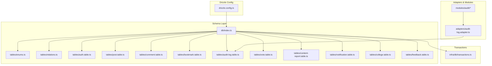
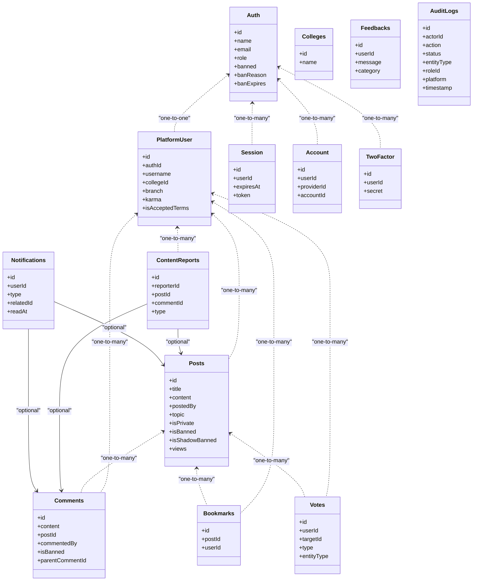
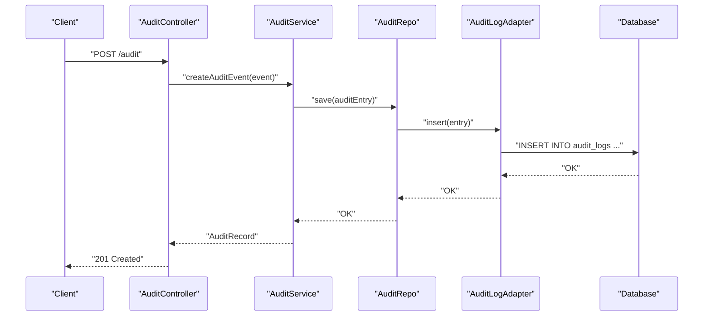
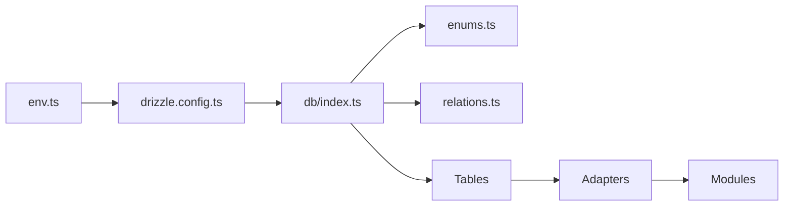

# Database Design

<cite>
**Referenced Files in This Document**
- [drizzle.config.ts](file://server/drizzle.config.ts)
- [db.index.ts](file://server/src/infra/db/index.ts)
- [enums.ts](file://server/src/infra/db/tables/enums.ts)
- [relations.ts](file://server/src/infra/db/tables/relations.ts)
- [auth.table.ts](file://server/src/infra/db/tables/auth.table.ts)
- [post.table.ts](file://server/src/infra/db/tables/post.table.ts)
- [comment.table.ts](file://server/src/infra/db/tables/comment.table.ts)
- [bookmark.table.ts](file://server/src/infra/db/tables/bookmark.table.ts)
- [audit-log.table.ts](file://server/src/infra/db/tables/audit-log.table.ts)
- [vote.table.ts](file://server/src/infra/db/tables/vote.table.ts)
- [content-report.table.ts](file://server/src/infra/db/tables/content-report.table.ts)
- [notification.table.ts](file://server/src/infra/db/tables/notification.table.ts)
- [college.table.ts](file://server/src/infra/db/tables/college.table.ts)
- [feedback.table.ts](file://server/src/infra/db/tables/feedback.table.ts)
- [transactions.ts](file://server/src/infra/db/transactions.ts)
- [audit-log.adapter.ts](file://server/src/infra/db/adapters/audit-log.adapter.ts)
- [audit.controller.ts](file://server/src/modules/audit/audit.controller.ts)
- [audit.service.ts](file://server/src/modules/audit/audit.service.ts)
- [audit.repo.ts](file://server/src/modules/audit/audit.repo.ts)
- [audit.schema.ts](file://server/src/modules/audit/audit.schema.ts)
- [audit.types.ts](file://server/src/modules/audit/audit.types.ts)
- [audit.context.ts](file://server/src/modules/audit/audit.context.ts)
- [record-audit.ts](file://server/src/lib/record-audit.ts)
- [audit-identity.ts](file://server/src/lib/audit-identity.ts)
- [env.ts](file://server/src/config/env.ts)
</cite>

## Table of Contents
1. [Introduction](#introduction)
2. [Project Structure](#project-structure)
3. [Core Components](#core-components)
4. [Architecture Overview](#architecture-overview)
5. [Detailed Component Analysis](#detailed-component-analysis)
6. [Dependency Analysis](#dependency-analysis)
7. [Performance Considerations](#performance-considerations)
8. [Troubleshooting Guide](#troubleshooting-guide)
9. [Conclusion](#conclusion)
10. [Appendices](#appendices)

## Introduction
This document provides comprehensive data model documentation for the Flick PostgreSQL database. It covers the schema design with custom ENUM types, entity relationships, and table structures. It also documents the Drizzle ORM configuration, query building patterns, transaction management, migration system, audit logging, and operational considerations such as indexing, performance optimization, data integrity, security, backups, and disaster recovery.

## Project Structure
The database layer is organized under the server module with the following key areas:
- Drizzle configuration and schema definition
- Table definitions with custom ENUMs and indices
- Relations between entities
- Adapters and repositories for domain modules
- Audit logging infrastructure and identity capture
- Transaction management utilities

**Diagram sources**
- [drizzle.config.ts](file://server/drizzle.config.ts#L1-L14)
- [db.index.ts](file://server/src/infra/db/index.ts#L1-L20)
- [enums.ts](file://server/src/infra/db/tables/enums.ts#L1-L49)
- [relations.ts](file://server/src/infra/db/tables/relations.ts#L1-L65)
- [auth.table.ts](file://server/src/infra/db/tables/auth.table.ts#L1-L163)
- [post.table.ts](file://server/src/infra/db/tables/post.table.ts#L1-L21)
- [comment.table.ts](file://server/src/infra/db/tables/comment.table.ts#L1-L26)
- [bookmark.table.ts](file://server/src/infra/db/tables/bookmark.table.ts#L1-L15)
- [audit-log.table.ts](file://server/src/infra/db/tables/audit-log.table.ts)
- [vote.table.ts](file://server/src/infra/db/tables/vote.table.ts)
- [content-report.table.ts](file://server/src/infra/db/tables/content-report.table.ts)
- [notification.table.ts](file://server/src/infra/db/tables/notification.table.ts)
- [college.table.ts](file://server/src/infra/db/tables/college.table.ts)
- [feedback.table.ts](file://server/src/infra/db/tables/feedback.table.ts)
- [audit-log.adapter.ts](file://server/src/infra/db/adapters/audit-log.adapter.ts)
- [transactions.ts](file://server/src/infra/db/transactions.ts)

**Section sources**
- [drizzle.config.ts](file://server/drizzle.config.ts#L1-L14)
- [db.index.ts](file://server/src/infra/db/index.ts#L1-L20)

## Core Components
- Drizzle ORM configuration defines the dialect, credentials, and schema discovery pattern.
- The schema layer defines tables, custom ENUM types, indices, and relations.
- Adapters and repositories encapsulate data access patterns per domain module.
- Transactions provide structured transaction boundaries across operations.

Key implementation references:
- Drizzle config: [drizzle.config.ts](file://server/drizzle.config.ts#L1-L14)
- Schema registration: [db.index.ts](file://server/src/infra/db/index.ts#L1-L20)
- Enums and indices: [enums.ts](file://server/src/infra/db/tables/enums.ts#L1-L49)
- Relations: [relations.ts](file://server/src/infra/db/tables/relations.ts#L1-L65)

**Section sources**
- [drizzle.config.ts](file://server/drizzle.config.ts#L1-L14)
- [db.index.ts](file://server/src/infra/db/index.ts#L1-L20)
- [enums.ts](file://server/src/infra/db/tables/enums.ts#L1-L49)
- [relations.ts](file://server/src/infra/db/tables/relations.ts#L1-L65)

## Architecture Overview
The database architecture follows a modular design:
- Centralized Drizzle configuration and schema registry
- Domain-focused tables with explicit foreign keys and indices
- Strongly-typed ENUMs for audit, notifications, topics, and votes
- Relations mapping one-to-one and one-to-many associations
- Adapter layer for each domain module to abstract data access
- Audit logging integrated via dedicated adapter and service

**Diagram sources**
- [auth.table.ts](file://server/src/infra/db/tables/auth.table.ts#L13-L163)
- [post.table.ts](file://server/src/infra/db/tables/post.table.ts#L5-L21)
- [comment.table.ts](file://server/src/infra/db/tables/comment.table.ts#L5-L26)
- [bookmark.table.ts](file://server/src/infra/db/tables/bookmark.table.ts#L5-L15)
- [vote.table.ts](file://server/src/infra/db/tables/vote.table.ts)
- [content-report.table.ts](file://server/src/infra/db/tables/content-report.table.ts)
- [notification.table.ts](file://server/src/infra/db/tables/notification.table.ts)
- [college.table.ts](file://server/src/infra/db/tables/college.table.ts)
- [feedback.table.ts](file://server/src/infra/db/tables/feedback.table.ts)
- [audit-log.table.ts](file://server/src/infra/db/tables/audit-log.table.ts)

## Detailed Component Analysis

### PostgreSQL Schema and Custom ENUM Types
- Custom ENUMs are defined for audit log metadata, notifications, topics, votes, and content reports.
- These ENUMs ensure data integrity and enforce allowed values across the schema.
- Example ENUM definitions:
  - Audit log: role, platform, status, action, entity type
  - Notifications: general, upvoted_post, upvoted_comment, replied, posted
  - Topics: Ask Flick, Serious Discussion, Career Advice, Showcase, Off-topic, Community Event, Rant / Vent, Help / Support, Feedback / Suggestion, News / Update, Guide / Resource
  - Votes: upvote, downvote on entities post or comment
  - Reports: Post, Comment

**Section sources**
- [enums.ts](file://server/src/infra/db/tables/enums.ts#L1-L49)

### Entity Relationships and Constraints
- Users and Authentication:
  - Auth table holds primary identity and security flags.
  - PlatformUser links to Auth via unique foreign key with cascade delete.
  - Sessions, Accounts, and Two-Factor records maintain lifecycle and security.
- Posts and Comments:
  - Posts belong to PlatformUser; indexed visibility filters.
  - Comments belong to posts and users; hierarchical replies supported via parentCommentId with set-null on delete.
- Bookmarks and Votes:
  - Composite unique index on userId and postId for bookmarks.
  - Votes reference targetId with entity type to support post or comment targets.
- Reports and Notifications:
  - ContentReports optionally link to posts or comments.
  - Notifications reference related entities and read timestamps.
- Colleges and Feedback:
  - Colleges are referenced by users; feedbacks track user-submitted messages.

**Section sources**
- [relations.ts](file://server/src/infra/db/tables/relations.ts#L1-L65)
- [auth.table.ts](file://server/src/infra/db/tables/auth.table.ts#L31-L163)
- [post.table.ts](file://server/src/infra/db/tables/post.table.ts#L5-L21)
- [comment.table.ts](file://server/src/infra/db/tables/comment.table.ts#L5-L26)
- [bookmark.table.ts](file://server/src/infra/db/tables/bookmark.table.ts#L5-L15)
- [vote.table.ts](file://server/src/infra/db/tables/vote.table.ts)
- [content-report.table.ts](file://server/src/infra/db/tables/content-report.table.ts)
- [notification.table.ts](file://server/src/infra/db/tables/notification.table.ts)
- [college.table.ts](file://server/src/infra/db/tables/college.table.ts)
- [feedback.table.ts](file://server/src/infra/db/tables/feedback.table.ts)

### Drizzle ORM Configuration and Query Building
- Drizzle configuration:
  - Dialect: PostgreSQL
  - Schema discovery: glob pattern targeting table files
  - Credentials: DATABASE_URL from environment
- Schema registration:
  - Drizzle instance initialized with schema mapping for all tables
- Query patterns:
  - Use typed tables and relations for joins and filtering
  - Leverage indices for performance-sensitive queries (visibility, user-post bookmarks)

**Section sources**
- [drizzle.config.ts](file://server/drizzle.config.ts#L1-L14)
- [db.index.ts](file://server/src/infra/db/index.ts#L1-L20)

### Transaction Management
- Transaction utilities centralize transaction boundaries across modules.
- Typical usage involves wrapping write-heavy sequences (e.g., voting, bookmarking, reporting) to ensure atomicity.

**Section sources**
- [transactions.ts](file://server/src/infra/db/transactions.ts)

### Migration System and Schema Evolution
- Drizzle migrations:
  - Migrations live under server/drizzle with numbered SQL files
  - Meta snapshots track applied migrations
- Evolving schema:
  - Add new migration files for structural changes
  - Keep snapshot journal synchronized after applying migrations
- Best practices:
  - Back up before applying migrations in production
  - Test migrations in staging environments

**Section sources**
- [drizzle.config.ts](file://server/drizzle.config.ts#L1-L14)

### Audit Logging System
- Audit log table captures actor, action, status, entity type, role, platform, and timestamp.
- Identity capture:
  - Middleware and utilities record actor identity and contextual metadata.
- Module integration:
  - Audit controller, service, repository, and schema coordinate logging events.
- Adapter:
  - Dedicated adapter handles persistence of audit entries.

**Diagram sources**
- [audit.controller.ts](file://server/src/modules/audit/audit.controller.ts)
- [audit.service.ts](file://server/src/modules/audit/audit.service.ts)
- [audit.repo.ts](file://server/src/modules/audit/audit.repo.ts)
- [audit-log.adapter.ts](file://server/src/infra/db/adapters/audit-log.adapter.ts)
- [audit-log.table.ts](file://server/src/infra/db/tables/audit-log.table.ts)

**Section sources**
- [audit.context.ts](file://server/src/modules/audit/audit.context.ts)
- [audit.types.ts](file://server/src/modules/audit/audit.types.ts)
- [audit.schema.ts](file://server/src/modules/audit/audit.schema.ts)
- [audit.service.ts](file://server/src/modules/audit/audit.service.ts)
- [audit.controller.ts](file://server/src/modules/audit/audit.controller.ts)
- [audit.repo.ts](file://server/src/modules/audit/audit.repo.ts)
- [audit-log.adapter.ts](file://server/src/infra/db/adapters/audit-log.adapter.ts)
- [audit-identity.ts](file://server/src/lib/audit-identity.ts)
- [record-audit.ts](file://server/src/lib/record-audit.ts)

### Indexing Strategies and Performance Optimization
- Visibility index on posts for filtering banned/shadow-banned and ordering by creation time.
- Composite index on bookmarks for efficient user-post lookups.
- Indices on session, account, and two-factor tables for authentication operations.
- Recommendations:
  - Monitor slow queries and add targeted GIN/GIST indices for text search if needed.
  - Use partial indices for frequently filtered conditions (e.g., active sessions).
  - Regularly analyze and vacuum to maintain query planner statistics.

**Section sources**
- [post.table.ts](file://server/src/infra/db/tables/post.table.ts#L18-L20)
- [bookmark.table.ts](file://server/src/infra/db/tables/bookmark.table.ts#L12-L14)
- [auth.table.ts](file://server/src/infra/db/tables/auth.table.ts#L46-L120)

### Data Access Patterns
- Typed table usage ensures compile-time safety for queries.
- Relations enable declarative joins and nested selections.
- Adapters encapsulate CRUD operations per domain, promoting separation of concerns.

**Section sources**
- [db.index.ts](file://server/src/infra/db/index.ts#L1-L20)
- [relations.ts](file://server/src/infra/db/tables/relations.ts#L1-L65)

## Dependency Analysis
The database layer exhibits low coupling and high cohesion:
- Drizzle config depends on environment variables for credentials.
- Schema registry depends on table definitions and relations.
- Adapters depend on schema tables and relations.
- Modules depend on adapters for data access.

**Diagram sources**
- [env.ts](file://server/src/config/env.ts)
- [drizzle.config.ts](file://server/drizzle.config.ts#L1-L14)
- [db.index.ts](file://server/src/infra/db/index.ts#L1-L20)
- [enums.ts](file://server/src/infra/db/tables/enums.ts#L1-L49)
- [relations.ts](file://server/src/infra/db/tables/relations.ts#L1-L65)

**Section sources**
- [env.ts](file://server/src/config/env.ts)
- [drizzle.config.ts](file://server/drizzle.config.ts#L1-L14)
- [db.index.ts](file://server/src/infra/db/index.ts#L1-L20)

## Performance Considerations
- Use indices strategically on high-selectivity columns (e.g., visibility filters, user-post combinations).
- Prefer composite indices for frequent join conditions.
- Batch writes and minimize round-trips using transactions.
- Monitor query plans and adjust indices based on real-world usage patterns.

[No sources needed since this section provides general guidance]

## Troubleshooting Guide
- Drizzle configuration issues:
  - Verify DATABASE_URL and schema path in drizzle config.
- Migration errors:
  - Check migration files and meta snapshots; re-run migrations after resolving conflicts.
- Audit logging failures:
  - Confirm audit context initialization and adapter connectivity.
- Transaction anomalies:
  - Wrap critical sequences in transactions and handle rollback scenarios.

**Section sources**
- [drizzle.config.ts](file://server/drizzle.config.ts#L1-L14)
- [audit.context.ts](file://server/src/modules/audit/audit.context.ts)
- [audit-log.adapter.ts](file://server/src/infra/db/adapters/audit-log.adapter.ts)

## Conclusion
The Flick database design leverages Drizzle ORM with a strongly typed schema, custom ENUMs, and well-defined relations. It supports core entities (users, posts, comments, votes, bookmarks) and auxiliary modules (audit, notifications, reports, feedback). The migration system, transaction management, and audit logging provide robust schema evolution and compliance capabilities. Proper indexing and access patterns ensure performance and scalability.

[No sources needed since this section summarizes without analyzing specific files]

## Appendices

### Appendix A: Audit Log Fields and ENUMs
- Roles, platforms, statuses, actions, entity types are defined as ENUMs and used consistently across audit logs.

**Section sources**
- [enums.ts](file://server/src/infra/db/tables/enums.ts#L10-L14)
- [audit-log.table.ts](file://server/src/infra/db/tables/audit-log.table.ts)

### Appendix B: Compliance and Retention Policies
- Retention policy:
  - Define data retention periods for audit logs and personal data.
- Compliance:
  - Use audit logs to track access and modifications for regulatory needs.
  - Enforce data minimization and anonymization where applicable.

[No sources needed since this section provides general guidance]

### Appendix C: Security Measures
- Transport and storage encryption, least privilege access, secrets management, and secure credential handling.

[No sources needed since this section provides general guidance]

### Appendix D: Backup and Disaster Recovery
- Automated backups, replication, point-in-time recovery, and failover testing procedures.

[No sources needed since this section provides general guidance]