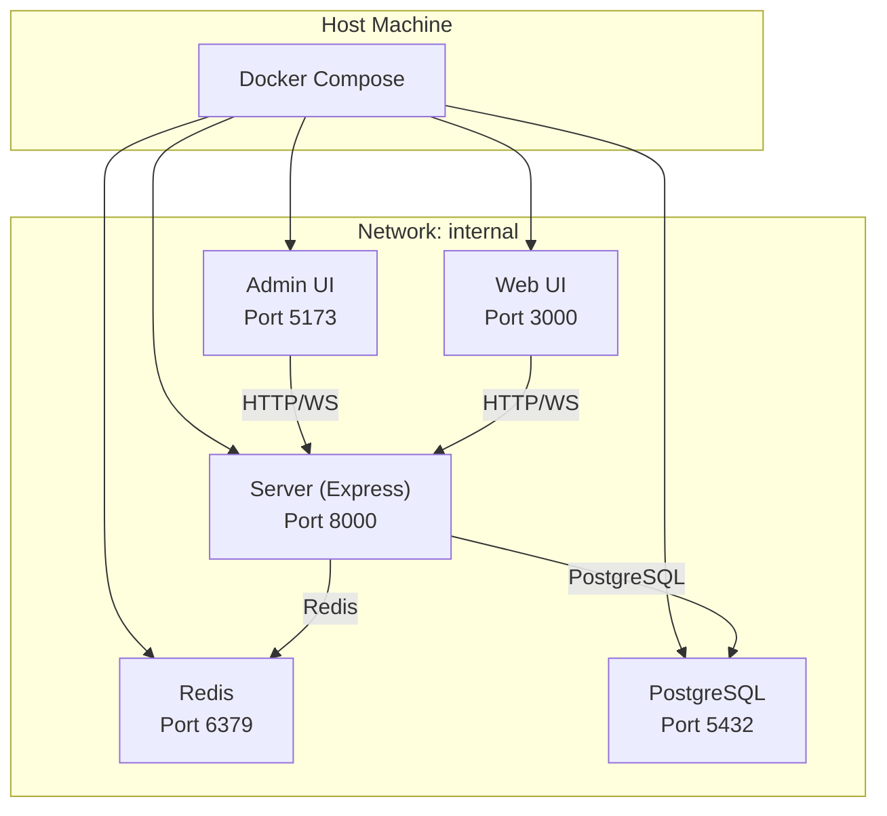
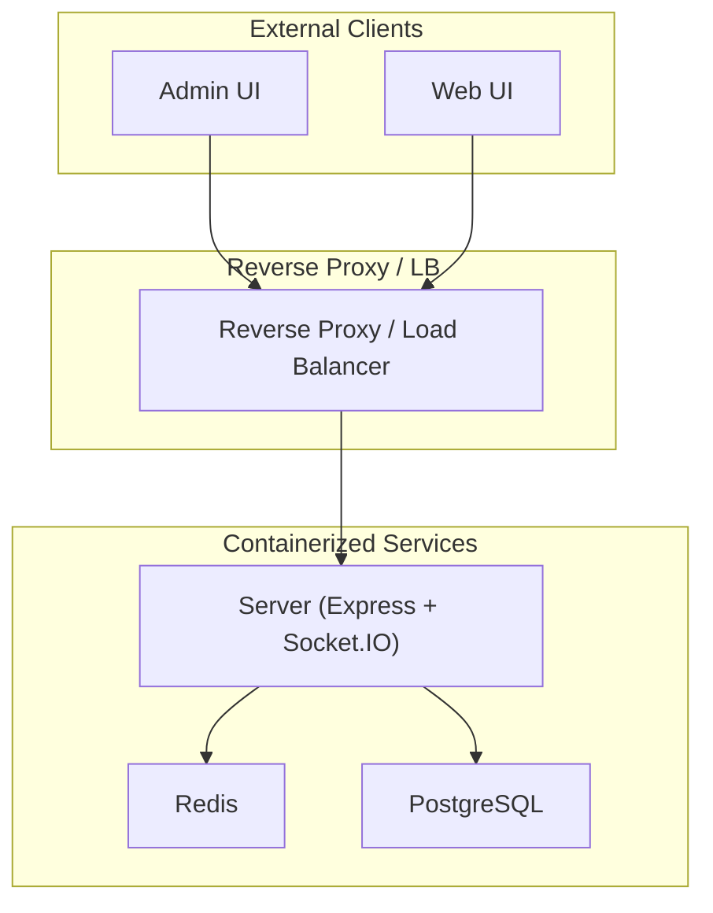
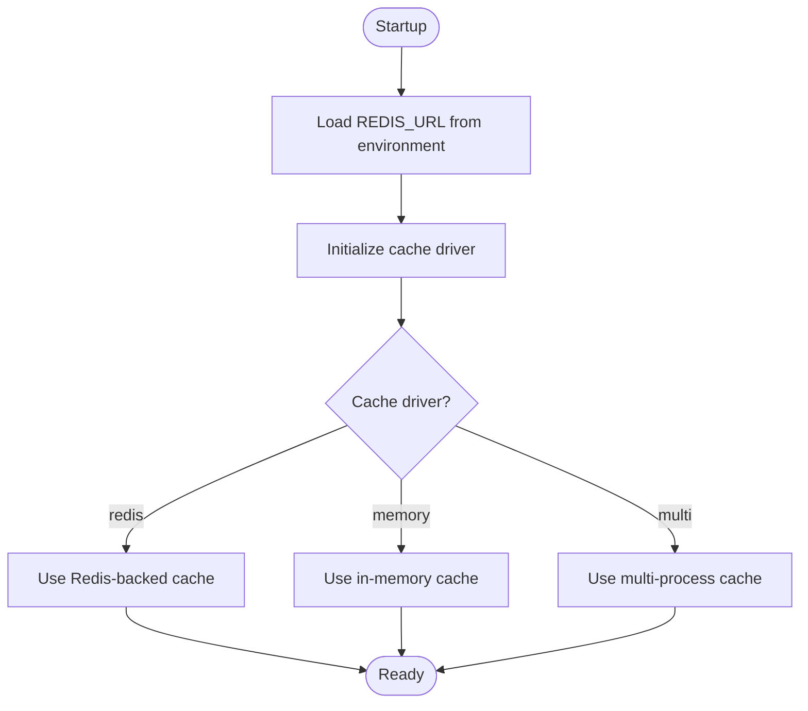
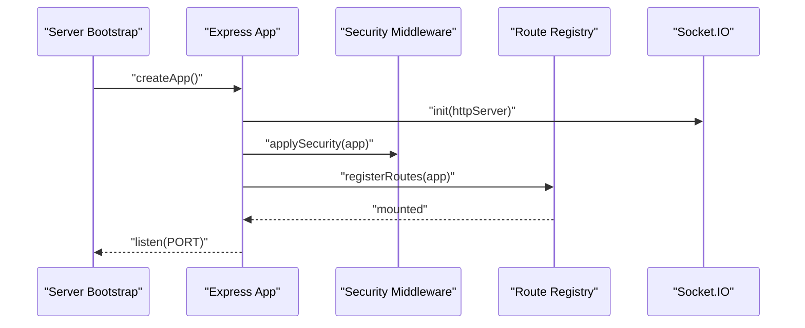
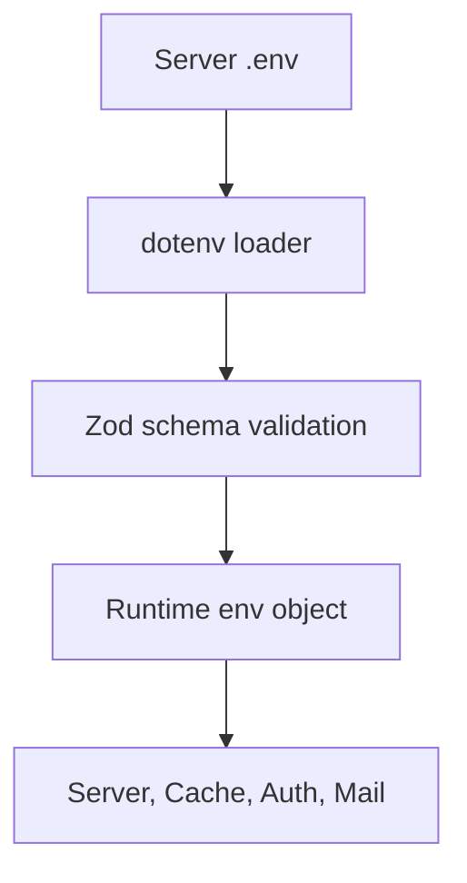
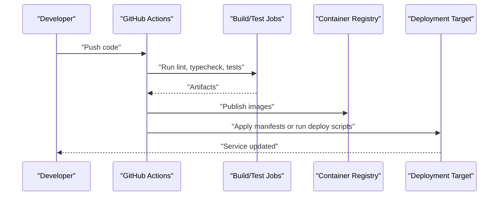
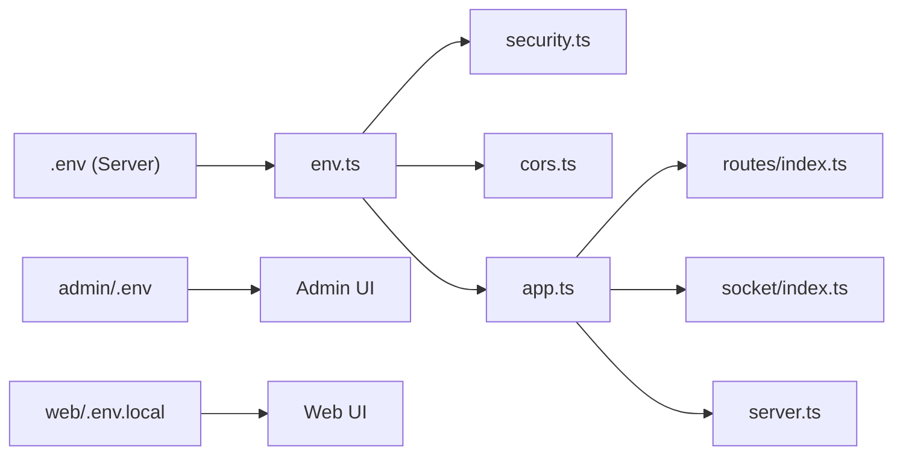

# Deployment Architecture

<cite>
**Referenced Files in This Document**
- [docker-compose.yml](file://server/infra/docker-compose.yml)
- [redis.conf](file://server/infra/redis.conf)
- [.env](file://server/.env)
- [env.ts](file://server/src/config/env.ts)
- [security.ts](file://server/src/config/security.ts)
- [cors.ts](file://server/src/config/cors.ts)
- [app.ts](file://server/src/app.ts)
- [server.ts](file://server/src/server.ts)
- [index.ts](file://server/src/routes/index.ts)
- [socket/index.ts](file://server/src/infra/services/socket/index.ts)
- [ci.yml](file://.github/workflows/ci.yml)
- [admin/.env](file://admin/.env)
- [web/.env.local](file://web/.env.local)
- [package.json](file://server/package.json)
- [package.json](file://admin/package.json)
- [package.json](file://web/package.json)
</cite>

## Table of Contents
1. [Introduction](#introduction)
2. [Project Structure](#project-structure)
3. [Core Components](#core-components)
4. [Architecture Overview](#architecture-overview)
5. [Detailed Component Analysis](#detailed-component-analysis)
6. [Dependency Analysis](#dependency-analysis)
7. [Performance Considerations](#performance-considerations)
8. [Troubleshooting Guide](#troubleshooting-guide)
9. [Conclusion](#conclusion)
10. [Appendices](#appendices)

## Introduction
This document describes the deployment and infrastructure architecture for Flick. It covers containerized deployment using Docker Compose, service orchestration, networking, and volume management. It documents Redis configuration for caching, session storage, and real-time communication via WebSocket. It outlines the CI/CD pipeline using GitHub Actions, automated testing, and deployment strategies. It details environment configuration management, secrets handling, and configuration drift prevention. Load balancing, SSL termination, and reverse proxy configuration are addressed. Monitoring and logging, health checks, and alerting systems are documented. Scalability patterns, auto-scaling configurations, and cost optimization strategies are included. Disaster recovery procedures, backup automation, and maintenance scheduling are covered.

## Project Structure
The deployment architecture spans three primary applications:
- Server (Express-based backend): Hosts APIs, authentication, real-time events, and integrates with Redis and PostgreSQL.
- Web (Next.js frontend): Serves the main user interface and communicates with the server.
- Admin (React-based admin panel): Provides administrative controls and analytics.

Infrastructure is orchestrated via Docker Compose with persistent volumes for Redis and PostgreSQL, and a minimal Redis configuration enabling append-only persistence.

**Diagram sources**
- [docker-compose.yml](file://server/infra/docker-compose.yml#L1-L49)
- [redis.conf](file://server/infra/redis.conf#L1-L2)
- [server.ts](file://server/src/server.ts#L1-L22)
- [socket/index.ts](file://server/src/infra/services/socket/index.ts#L1-L48)

**Section sources**
- [docker-compose.yml](file://server/infra/docker-compose.yml#L1-L49)
- [redis.conf](file://server/infra/redis.conf#L1-L2)
- [server.ts](file://server/src/server.ts#L1-L22)
- [app.ts](file://server/src/app.ts#L1-L33)
- [index.ts](file://server/src/routes/index.ts#L1-L33)

## Core Components
- Container Orchestration
  - Docker Compose defines services for PostgreSQL, Adminer, and Redis, with health checks and named volumes for persistence.
- Database
  - PostgreSQL 17 with mapped host port 5432 and a named volume for data.
- Cache and Session Store
  - Redis 7 Alpine configured with append-only persistence and mapped host port 6379.
- Backend Server
  - Express server with Socket.IO for real-time features, Helmet for security, CORS configuration, and route registration.
- Frontends
  - Admin UI (Vite) and Web UI (Next.js) configured to communicate with the backend via environment variables.

**Section sources**
- [docker-compose.yml](file://server/infra/docker-compose.yml#L1-L49)
- [redis.conf](file://server/infra/redis.conf#L1-L2)
- [server.ts](file://server/src/server.ts#L1-L22)
- [app.ts](file://server/src/app.ts#L1-L33)
- [index.ts](file://server/src/routes/index.ts#L1-L33)
- [admin/.env](file://admin/.env#L1-L3)
- [web/.env.local](file://web/.env.local#L1-L8)

## Architecture Overview
The system uses a container-first deployment model with explicit service boundaries:
- Server exposes REST APIs and WebSocket endpoints.
- Redis supports caching, session storage, and real-time event broadcasting.
- PostgreSQL stores relational data.
- Admin and Web frontends consume the server’s HTTP and WebSocket endpoints.

**Diagram sources**
- [server.ts](file://server/src/server.ts#L1-L22)
- [socket/index.ts](file://server/src/infra/services/socket/index.ts#L1-L48)
- [docker-compose.yml](file://server/infra/docker-compose.yml#L1-L49)

## Detailed Component Analysis

### Containerized Deployment with Docker Compose
- Services
  - db: PostgreSQL 17 with health checks, environment variables for credentials, port mapping, and a named volume for data persistence.
  - adminer: Web-based PostgreSQL administration tool depending on db health.
  - redis: Redis 7 Alpine with health checks, port mapping, named volume for data, and mounted Redis config.
- Volumes
  - Named volumes for Redis and PostgreSQL ensure persistence across container restarts.
- Networking
  - Services are reachable on host ports as defined; intra-service communication uses service names.

Operational notes:
- Use the provided scripts to manage the stack locally.
- Health checks enable Compose to monitor service readiness.

**Section sources**
- [docker-compose.yml](file://server/infra/docker-compose.yml#L1-L49)

### Redis Configuration and Usage
- Persistence
  - Append-only mode enabled via redis.conf to improve durability.
- Ports and Mounts
  - Exposed on host port 6379; data persisted via named volume.
- Usage in Server
  - Environment variable for REDIS_URL drives cache and session integrations.
  - Socket.IO uses Redis adapter for horizontal scaling of WebSocket events.

**Diagram sources**
- [redis.conf](file://server/infra/redis.conf#L1-L2)
- [env.ts](file://server/src/config/env.ts#L11-L12)

**Section sources**
- [redis.conf](file://server/infra/redis.conf#L1-L2)
- [env.ts](file://server/src/config/env.ts#L11-L12)
- [socket/index.ts](file://server/src/infra/services/socket/index.ts#L1-L48)

### Backend Server: Orchestration, Security, and Routing
- Orchestration
  - Creates HTTP server, initializes Socket.IO, registers middleware, applies security, and mounts routes.
- Security
  - Helmet hardening and CORS configuration derived from environment variables.
- Routing
  - Registers API routes for posts, auth, users, bookmarks, colleges, comments, feedback, votes, and admin.
  - Exposes Better Auth compatibility endpoint.

**Diagram sources**
- [app.ts](file://server/src/app.ts#L1-L33)
- [security.ts](file://server/src/config/security.ts#L1-L14)
- [cors.ts](file://server/src/config/cors.ts#L1-L12)
- [index.ts](file://server/src/routes/index.ts#L1-L33)
- [socket/index.ts](file://server/src/infra/services/socket/index.ts#L1-L48)

**Section sources**
- [app.ts](file://server/src/app.ts#L1-L33)
- [security.ts](file://server/src/config/security.ts#L1-L14)
- [cors.ts](file://server/src/config/cors.ts#L1-L12)
- [index.ts](file://server/src/routes/index.ts#L1-L33)
- [socket/index.ts](file://server/src/infra/services/socket/index.ts#L1-L48)

### Environment Configuration Management and Secrets Handling
- Server environment
  - Defines ports, environment mode, CORS origins, base URIs, Better Auth secrets, database and Redis URLs, cache settings, OAuth client credentials, email provider settings, encryption keys, and admin credentials.
- Frontend environments
  - Admin UI and Web UI define server URIs and base URLs for development.
- Validation
  - Zod schema validates environment variables at runtime, ensuring required fields and types.

**Diagram sources**
- [.env](file://server/.env#L1-L50)
- [env.ts](file://server/src/config/env.ts#L1-L34)

**Section sources**
- [.env](file://server/.env#L1-L50)
- [env.ts](file://server/src/config/env.ts#L1-L34)
- [admin/.env](file://admin/.env#L1-L3)
- [web/.env.local](file://web/.env.local#L1-L8)

### CI/CD Pipeline with GitHub Actions
- Workflow trigger
  - Basic workflow definition triggers on pushes.
- Testing and build
  - Scripts in server package.json demonstrate linting, type checking, migrations, and Docker Compose commands for local DB lifecycle.
- Deployment
  - Current repository configuration does not include deployment steps. To implement CI/CD:
    - Add jobs to build and test the backend, admin, and web packages.
    - Push images to a registry.
    - Apply deployment artifacts (Compose, Kubernetes, or platform-specific manifests).
    - Integrate secrets management via GitHub Secrets or platform equivalents.

**Diagram sources**
- [ci.yml](file://.github/workflows/ci.yml#L1-L4)
- [package.json](file://server/package.json#L7-L22)

**Section sources**
- [ci.yml](file://.github/workflows/ci.yml#L1-L4)
- [package.json](file://server/package.json#L7-L22)

### Load Balancing, SSL Termination, and Reverse Proxy
- Load Balancing
  - Not currently implemented in the repository. Recommended approaches:
    - Use a reverse proxy (e.g., Nginx, Traefik) to distribute traffic across multiple server instances.
    - Configure health checks to route traffic only to healthy instances.
- SSL Termination
  - Not configured in the repository. Recommended practice:
    - Terminate TLS at the reverse proxy and forward plain HTTP to backend services.
- Reverse Proxy Configuration
  - Not present in the repository. Recommended elements:
    - Route /api/v1 to the server.
    - Route /admin to the Admin UI.
    - Route / to the Web UI.
    - Enable WebSocket upgrades for real-time features.

[No sources needed since this section provides general guidance]

### Monitoring, Logging, and Health Checks
- Health Checks
  - Docker Compose health checks for PostgreSQL and Redis ensure readiness.
  - Server exposes health routes registered by the router.
- Logging
  - Winston is used for structured logging; request logging middleware is registered during bootstrap.
- Alerting
  - No alerting configuration is present in the repository. Recommended practices:
    - Export metrics and logs to centralized systems.
    - Set up alerts for failing health checks, high error rates, and resource thresholds.

**Section sources**
- [docker-compose.yml](file://server/infra/docker-compose.yml#L13-L17)
- [docker-compose.yml](file://server/infra/docker-compose.yml#L37-L41)
- [index.ts](file://server/src/routes/index.ts#L31-L32)
- [app.ts](file://server/src/app.ts#L8-L21)

### Scalability Patterns and Cost Optimization
- Horizontal Scaling
  - Socket.IO Redis adapter enables multi-instance WebSocket scaling.
  - Stateless server design supports easy replication.
- Auto-Scaling
  - Not configured in the repository. Recommended practices:
    - Scale based on CPU, memory, or request rate.
    - Use rolling updates to minimize downtime.
- Cost Optimization
  - Consolidate containers per host where feasible.
  - Use spot instances for non-critical workloads.
  - Right-size containers and databases; leverage connection pooling.

**Section sources**
- [socket/index.ts](file://server/src/infra/services/socket/index.ts#L1-L48)

### Disaster Recovery, Backup Automation, and Maintenance
- Backups
  - PostgreSQL backups can be scheduled using pg_dump and stored to durable storage.
  - Redis snapshots are enabled by append-only persistence; retain periodic AOF rewrite snapshots.
- Restore Procedures
  - Automated restore scripts should validate backups and restore to a clean database/Redis instance.
- Maintenance
  - Schedule maintenance windows for OS updates, dependency upgrades, and database maintenance tasks.

[No sources needed since this section provides general guidance]

## Dependency Analysis
The server depends on environment-driven configuration, security middleware, routing, and real-time services. Frontends depend on environment variables for backend endpoints.

**Diagram sources**
- [.env](file://server/.env#L1-L50)
- [env.ts](file://server/src/config/env.ts#L1-L34)
- [security.ts](file://server/src/config/security.ts#L1-L14)
- [cors.ts](file://server/src/config/cors.ts#L1-L12)
- [app.ts](file://server/src/app.ts#L1-L33)
- [index.ts](file://server/src/routes/index.ts#L1-L33)
- [socket/index.ts](file://server/src/infra/services/socket/index.ts#L1-L48)
- [server.ts](file://server/src/server.ts#L1-L22)
- [admin/.env](file://admin/.env#L1-L3)
- [web/.env.local](file://web/.env.local#L1-L8)

**Section sources**
- [env.ts](file://server/src/config/env.ts#L1-L34)
- [security.ts](file://server/src/config/security.ts#L1-L14)
- [cors.ts](file://server/src/config/cors.ts#L1-L12)
- [app.ts](file://server/src/app.ts#L1-L33)
- [index.ts](file://server/src/routes/index.ts#L1-L33)
- [socket/index.ts](file://server/src/infra/services/socket/index.ts#L1-L48)
- [server.ts](file://server/src/server.ts#L1-L22)
- [admin/.env](file://admin/.env#L1-L3)
- [web/.env.local](file://web/.env.local#L1-L8)

## Performance Considerations
- Caching
  - Choose Redis-backed cache for production to reduce database load and improve latency.
- Database
  - Use connection pooling and optimize queries; monitor slow queries.
- Real-time
  - Use Redis adapter for Socket.IO to scale WebSocket connections horizontally.
- Frontend
  - Minimize payload sizes and leverage CDN for static assets.

[No sources needed since this section provides general guidance]

## Troubleshooting Guide
- Service Health
  - Verify PostgreSQL and Redis health checks in Docker Compose.
- Startup Failures
  - Inspect server startup logs and error handlers.
- CORS Issues
  - Confirm ACCESS_CONTROL_ORIGINS and credentials settings.
- Redis Connectivity
  - Ensure REDIS_URL matches the Redis service name and port.

**Section sources**
- [docker-compose.yml](file://server/infra/docker-compose.yml#L13-L17)
- [docker-compose.yml](file://server/infra/docker-compose.yml#L37-L41)
- [server.ts](file://server/src/server.ts#L13-L16)
- [cors.ts](file://server/src/config/cors.ts#L4-L10)
- [env.ts](file://server/src/config/env.ts#L11-L12)

## Conclusion
Flick’s deployment architecture centers on containerized services orchestrated via Docker Compose, with Redis and PostgreSQL providing caching/session storage and persistence respectively. The backend server integrates security, routing, and real-time capabilities, while frontends consume the APIs. The repository includes foundational pieces for CI/CD, environment validation, and health checks but lacks production-grade reverse proxy, SSL termination, and deployment automation. Implementing the recommended enhancements will deliver a robust, scalable, and maintainable deployment.

## Appendices
- Local Development Commands
  - Use the server package.json scripts to manage the database stack and run migrations.
- Frontend Base URLs
  - Ensure Admin and Web UI base URLs align with the deployed backend endpoints.

**Section sources**
- [package.json](file://server/package.json#L15-L16)
- [admin/.env](file://admin/.env#L1-L3)
- [web/.env.local](file://web/.env.local#L1-L8)