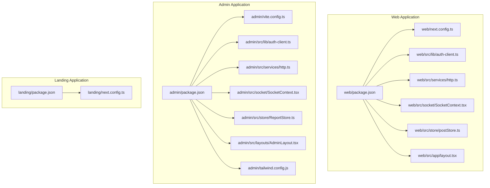
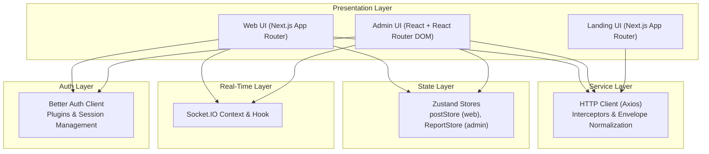
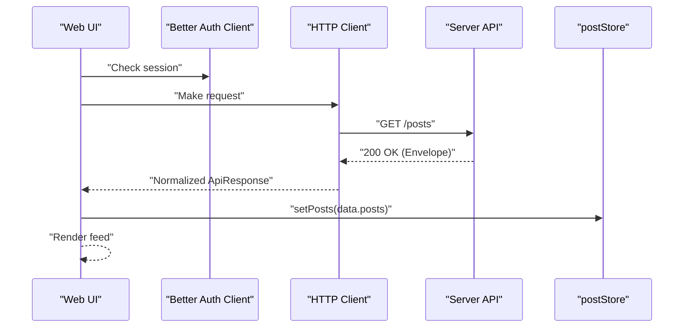
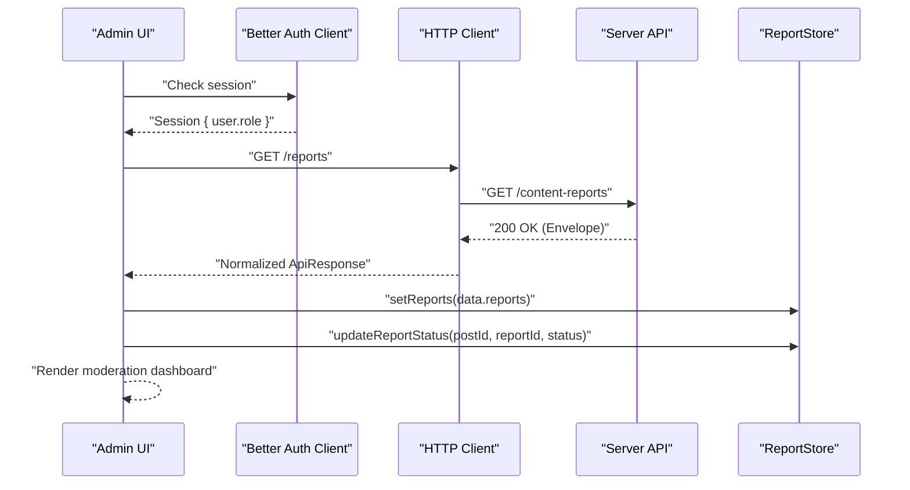
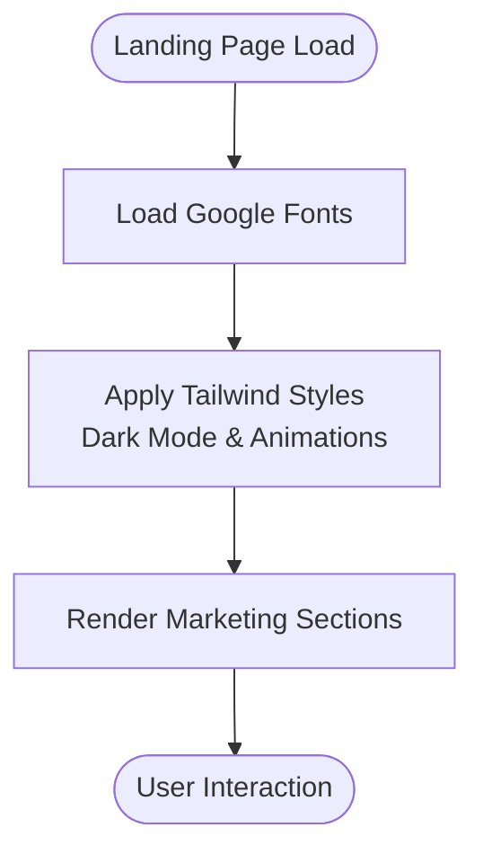
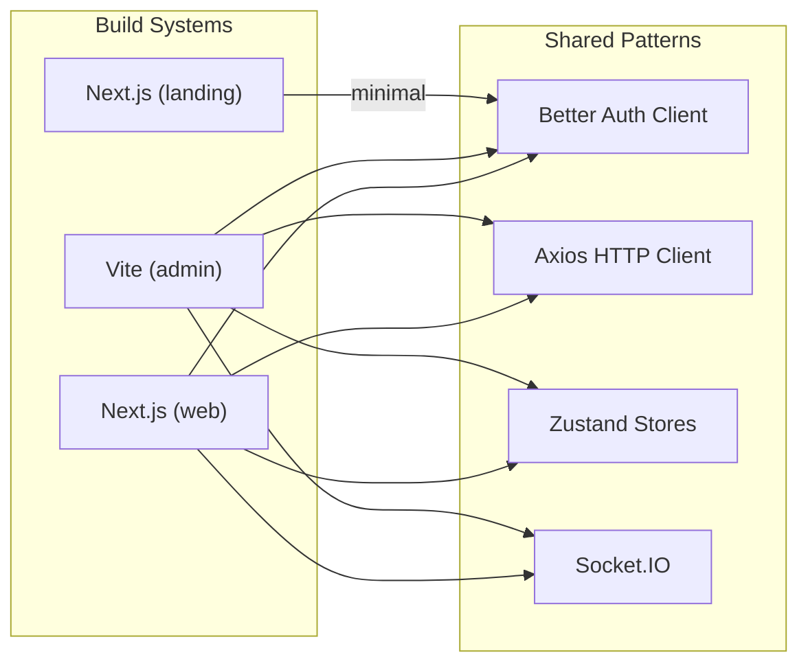

# Frontend Applications

<cite>
**Referenced Files in This Document**
- [web/package.json](file://web/package.json)
- [web/next.config.ts](file://web/next.config.ts)
- [web/src/lib/auth-client.ts](file://web/src/lib/auth-client.ts)
- [web/src/services/http.ts](file://web/src/services/http.ts)
- [web/src/socket/SocketContext.tsx](file://web/src/socket/SocketContext.tsx)
- [web/src/socket/useSocket.ts](file://web/src/socket/useSocket.ts)
- [web/src/store/postStore.ts](file://web/src/store/postStore.ts)
- [web/src/app/layout.tsx](file://web/src/app/layout.tsx)
- [admin/package.json](file://admin/package.json)
- [admin/vite.config.ts](file://admin/vite.config.ts)
- [admin/src/lib/auth-client.ts](file://admin/src/lib/auth-client.ts)
- [admin/src/services/http.ts](file://admin/src/services/http.ts)
- [admin/src/socket/SocketContext.tsx](file://admin/src/socket/SocketContext.tsx)
- [admin/src/socket/useSocket.ts](file://admin/src/socket/useSocket.ts)
- [admin/src/store/ReportStore.ts](file://admin/src/store/ReportStore.ts)
- [admin/src/layouts/AdminLayout.tsx](file://admin/src/layouts/AdminLayout.tsx)
- [admin/tailwind.config.js](file://admin/tailwind.config.js)
- [landing/package.json](file://landing/package.json)
- [landing/next.config.ts](file://landing/next.config.ts)
</cite>

## Table of Contents
1. [Introduction](#introduction)
2. [Project Structure](#project-structure)
3. [Core Components](#core-components)
4. [Architecture Overview](#architecture-overview)
5. [Detailed Component Analysis](#detailed-component-analysis)
6. [Dependency Analysis](#dependency-analysis)
7. [Performance Considerations](#performance-considerations)
8. [Troubleshooting Guide](#troubleshooting-guide)
9. [Conclusion](#conclusion)
10. [Appendices](#appendices)

## Introduction
This document describes the frontend architecture for the Flick suite of applications: web (Next.js SSR application with authentication and social features), admin (React admin dashboard for content moderation), and landing (Next.js marketing site for onboarding). It explains component architecture patterns, state management strategies, routing configurations, shared component library usage, styling with Tailwind CSS, responsive design, real-time communication via Socket.IO, the API service layer, authentication state management, build configuration differences, deployment strategies, and performance optimization techniques. It also highlights cross-application consistency and shared UX patterns.

## Project Structure
The repository is organized as a monorepo with three distinct frontend packages:
- web: Next.js application implementing SSR, social feeds, notifications, and user interactions.
- admin: Vite-powered React admin dashboard for moderation and analytics.
- landing: Next.js marketing site for onboarding and awareness.

Build systems differ per app:
- web uses Next.js with Turbopack disabled and React Compiler enabled.
- admin uses Vite with React plugin and TypeScript compilation.
- landing uses Next.js with Turbopack enabled for faster dev builds.

**Diagram sources**
- [web/package.json](file://web/package.json#L1-L59)
- [web/next.config.ts](file://web/next.config.ts#L1-L9)
- [web/src/lib/auth-client.ts](file://web/src/lib/auth-client.ts#L1-L11)
- [web/src/services/http.ts](file://web/src/services/http.ts#L1-L133)
- [web/src/socket/SocketContext.tsx](file://web/src/socket/SocketContext.tsx)
- [web/src/store/postStore.ts](file://web/src/store/postStore.ts#L1-L29)
- [web/src/app/layout.tsx](file://web/src/app/layout.tsx#L1-L35)
- [admin/package.json](file://admin/package.json#L1-L76)
- [admin/vite.config.ts](file://admin/vite.config.ts#L1-L16)
- [admin/src/lib/auth-client.ts](file://admin/src/lib/auth-client.ts#L1-L12)
- [admin/src/services/http.ts](file://admin/src/services/http.ts#L1-L133)
- [admin/src/socket/SocketContext.tsx](file://admin/src/socket/SocketContext.tsx)
- [admin/src/store/ReportStore.ts](file://admin/src/store/ReportStore.ts#L1-L43)
- [admin/src/layouts/AdminLayout.tsx](file://admin/src/layouts/AdminLayout.tsx#L1-L47)
- [admin/tailwind.config.js](file://admin/tailwind.config.js#L1-L82)
- [landing/package.json](file://landing/package.json#L1-L36)
- [landing/next.config.ts](file://landing/next.config.ts#L1-L8)

**Section sources**
- [web/package.json](file://web/package.json#L1-L59)
- [admin/package.json](file://admin/package.json#L1-L76)
- [landing/package.json](file://landing/package.json#L1-L36)
- [web/next.config.ts](file://web/next.config.ts#L1-L9)
- [admin/vite.config.ts](file://admin/vite.config.ts#L1-L16)
- [landing/next.config.ts](file://landing/next.config.ts#L1-L8)

## Core Components
This section outlines the foundational building blocks across the three apps.

- Authentication client
  - Both web and admin initialize a Better Auth client pointing to the server’s /api/auth endpoint. The web app enables admin and inferred fields plugins; the admin app additionally enables two-factor and admin plugins.
  - Environment variables differ by app: NEXT_PUBLIC_BASE_URL for web and VITE_SERVER_URI for admin.

- HTTP service layer
  - Both apps configure Axios with credentials and a dynamic baseURL. Request interceptor injects Authorization headers when available. Response interceptor normalizes backend envelopes into a unified ApiResponse shape.
  - A robust 401 refresh mechanism queues concurrent requests during token refresh and resolves them after success or failure callbacks.

- Real-time communication
  - Socket.IO clients are initialized per app and exposed via a React context provider and a custom hook. The web app’s hook returns null if used outside provider; the admin app throws an error to enforce provider usage.

- State management
  - Zustand stores encapsulate domain-specific state:
    - Web: postStore manages feed items and CRUD operations.
    - Admin: ReportStore manages reported content and status updates.

- Routing and layout
  - Web: Next.js App Router with a root layout applying fonts and global CSS.
  - Admin: React Router DOM with an admin layout enforcing role-based access and navigation tabs.

**Section sources**
- [web/src/lib/auth-client.ts](file://web/src/lib/auth-client.ts#L1-L11)
- [admin/src/lib/auth-client.ts](file://admin/src/lib/auth-client.ts#L1-L12)
- [web/src/services/http.ts](file://web/src/services/http.ts#L1-L133)
- [admin/src/services/http.ts](file://admin/src/services/http.ts#L1-L133)
- [web/src/socket/SocketContext.tsx](file://web/src/socket/SocketContext.tsx)
- [admin/src/socket/SocketContext.tsx](file://admin/src/socket/SocketContext.tsx)
- [web/src/socket/useSocket.ts](file://web/src/socket/useSocket.ts#L1-L9)
- [admin/src/socket/useSocket.ts](file://admin/src/socket/useSocket.ts#L1-L13)
- [web/src/store/postStore.ts](file://web/src/store/postStore.ts#L1-L29)
- [admin/src/store/ReportStore.ts](file://admin/src/store/ReportStore.ts#L1-L43)
- [web/src/app/layout.tsx](file://web/src/app/layout.tsx#L1-L35)
- [admin/src/layouts/AdminLayout.tsx](file://admin/src/layouts/AdminLayout.tsx#L1-L47)

## Architecture Overview
The frontend architecture follows a layered pattern:
- Presentation layer: Next.js (web, landing) and React (admin) with component libraries and UI primitives.
- Service layer: Axios-based HTTP client with interceptors and token refresh logic.
- State layer: Zustand stores for local domain state.
- Real-time layer: Socket.IO context and hooks.
- Authentication layer: Better Auth client with server endpoints and plugins.

**Diagram sources**
- [web/src/services/http.ts](file://web/src/services/http.ts#L1-L133)
- [admin/src/services/http.ts](file://admin/src/services/http.ts#L1-L133)
- [web/src/store/postStore.ts](file://web/src/store/postStore.ts#L1-L29)
- [admin/src/store/ReportStore.ts](file://admin/src/store/ReportStore.ts#L1-L43)
- [web/src/socket/SocketContext.tsx](file://web/src/socket/SocketContext.tsx)
- [admin/src/socket/SocketContext.tsx](file://admin/src/socket/SocketContext.tsx)
- [web/src/lib/auth-client.ts](file://web/src/lib/auth-client.ts#L1-L11)
- [admin/src/lib/auth-client.ts](file://admin/src/lib/auth-client.ts#L1-L12)

## Detailed Component Analysis

### Web Application
- Build and runtime
  - Next.js with React Compiler enabled and Turbopack disabled.
  - Global layout applies fonts and base CSS.

- Authentication
  - Better Auth client configured with admin and inferred fields plugins, using NEXT_PUBLIC_BASE_URL for the server endpoint.

- HTTP service
  - Axios client with credentials and dynamic baseURL.
  - Request interceptor adds Authorization header when present.
  - Response interceptor normalizes backend envelope to ApiResponse.
  - Robust 401 refresh flow queuing concurrent requests.

- Real-time
  - Socket.IO context and hook; useSocket returns null if used outside provider.

- State management
  - postStore manages posts with setters for replace/add/update/remove.

- Routing and UX
  - App Router layout with global fonts and CSS.

**Diagram sources**
- [web/src/lib/auth-client.ts](file://web/src/lib/auth-client.ts#L1-L11)
- [web/src/services/http.ts](file://web/src/services/http.ts#L1-L133)
- [web/src/store/postStore.ts](file://web/src/store/postStore.ts#L1-L29)

**Section sources**
- [web/next.config.ts](file://web/next.config.ts#L1-L9)
- [web/src/app/layout.tsx](file://web/src/app/layout.tsx#L1-L35)
- [web/src/lib/auth-client.ts](file://web/src/lib/auth-client.ts#L1-L11)
- [web/src/services/http.ts](file://web/src/services/http.ts#L1-L133)
- [web/src/socket/useSocket.ts](file://web/src/socket/useSocket.ts#L1-L9)
- [web/src/store/postStore.ts](file://web/src/store/postStore.ts#L1-L29)

### Admin Application
- Build and runtime
  - Vite with React plugin and TypeScript; alias @ -> ./src.

- Authentication
  - Better Auth client configured with admin, two-factor, and inferred fields plugins, using VITE_SERVER_URI for the server endpoint.

- HTTP service
  - Same Axios configuration and interceptor pipeline as web.

- Real-time
  - Socket.IO context and hook; useSocket enforces provider usage with an error if misused.

- State management
  - ReportStore manages reported posts and updates nested report statuses.

- Routing and UX
  - AdminLayout enforces admin role, populates profile store, and renders navigation tabs with outlet content.

**Diagram sources**
- [admin/src/lib/auth-client.ts](file://admin/src/lib/auth-client.ts#L1-L12)
- [admin/src/services/http.ts](file://admin/src/services/http.ts#L1-L133)
- [admin/src/store/ReportStore.ts](file://admin/src/store/ReportStore.ts#L1-L43)
- [admin/src/layouts/AdminLayout.tsx](file://admin/src/layouts/AdminLayout.tsx#L1-L47)

**Section sources**
- [admin/vite.config.ts](file://admin/vite.config.ts#L1-L16)
- [admin/src/lib/auth-client.ts](file://admin/src/lib/auth-client.ts#L1-L12)
- [admin/src/services/http.ts](file://admin/src/services/http.ts#L1-L133)
- [admin/src/socket/useSocket.ts](file://admin/src/socket/useSocket.ts#L1-L13)
- [admin/src/store/ReportStore.ts](file://admin/src/store/ReportStore.ts#L1-L43)
- [admin/src/layouts/AdminLayout.tsx](file://admin/src/layouts/AdminLayout.tsx#L1-L47)

### Landing Application
- Build and runtime
  - Next.js with Turbopack enabled for faster development.

- Styling and responsiveness
  - Tailwind CSS configured with dark mode and extended theme tokens; animations enabled via tailwindcss-animate.

- Routing and UX
  - App Router with global fonts and CSS; minimal inter-app routing in this document scope.

**Diagram sources**
- [landing/next.config.ts](file://landing/next.config.ts#L1-L8)
- [admin/tailwind.config.js](file://admin/tailwind.config.js#L1-L82)

**Section sources**
- [landing/next.config.ts](file://landing/next.config.ts#L1-L8)
- [admin/tailwind.config.js](file://admin/tailwind.config.js#L1-L82)

## Dependency Analysis
Cross-application dependencies and build differences:

- Build systems
  - web: Next.js dev/build/start scripts; React Compiler enabled.
  - admin: Vite dev/build; React plugin; TypeScript build; alias @ -> ./src.
  - landing: Next.js dev/build/start scripts; Turbopack enabled.

- Shared patterns
  - Both web and admin share Axios-based HTTP client patterns, interceptor normalization, and 401 refresh logic.
  - Both apps use Better Auth client with server endpoints and plugins differing by role and MFA support.

- UI and styling
  - Both web and admin leverage Radix UI primitives and Tailwind CSS; admin extends theme tokens and animations.

**Diagram sources**
- [web/package.json](file://web/package.json#L1-L59)
- [admin/package.json](file://admin/package.json#L1-L76)
- [landing/package.json](file://landing/package.json#L1-L36)
- [web/src/lib/auth-client.ts](file://web/src/lib/auth-client.ts#L1-L11)
- [admin/src/lib/auth-client.ts](file://admin/src/lib/auth-client.ts#L1-L12)
- [web/src/services/http.ts](file://web/src/services/http.ts#L1-L133)
- [admin/src/services/http.ts](file://admin/src/services/http.ts#L1-L133)
- [web/src/store/postStore.ts](file://web/src/store/postStore.ts#L1-L29)
- [admin/src/store/ReportStore.ts](file://admin/src/store/ReportStore.ts#L1-L43)
- [web/src/socket/SocketContext.tsx](file://web/src/socket/SocketContext.tsx)
- [admin/src/socket/SocketContext.tsx](file://admin/src/socket/SocketContext.tsx)

**Section sources**
- [web/package.json](file://web/package.json#L1-L59)
- [admin/package.json](file://admin/package.json#L1-L76)
- [landing/package.json](file://landing/package.json#L1-L36)

## Performance Considerations
- Web app
  - React Compiler enabled in Next.js for optimized rendering.
  - Token refresh queue prevents redundant refreshes and batches concurrent requests.

- Admin app
  - Vite provides fast dev builds and HMR; aliasing improves import ergonomics.

- Landing app
  - Turbopack enabled for faster Next.js development cycles.

- General
  - Prefer server-side rendering for SEO and initial load performance in web and landing.
  - Use efficient Zustand selectors and avoid unnecessary re-renders.
  - Lazy-load heavy components and images; defer non-critical resources.

[No sources needed since this section provides general guidance]

## Troubleshooting Guide
- Authentication and session issues
  - Verify baseURL configuration for Better Auth client matches server endpoint.
  - Ensure session checks occur before protected route rendering.

- HTTP client and token refresh
  - Confirm Authorization header injection and 401 refresh flow are intact.
  - Check that onRefreshSuccess/onRefreshFailure callbacks are wired to update local storage or context.

- Socket.IO usage
  - In web, useSocket may return null if used outside provider; wrap consumers accordingly.
  - In admin, ensure useSocket is used within SocketProvider to avoid runtime errors.

- Build and environment
  - For web, confirm NEXT_PUBLIC_BASE_URL is set for client-side auth endpoint.
  - For admin, confirm VITE_SERVER_URI is set for client-side auth endpoint.
  - For landing, ensure Turbopack is enabled for dev builds.

**Section sources**
- [web/src/lib/auth-client.ts](file://web/src/lib/auth-client.ts#L1-L11)
- [admin/src/lib/auth-client.ts](file://admin/src/lib/auth-client.ts#L1-L12)
- [web/src/services/http.ts](file://web/src/services/http.ts#L1-L133)
- [admin/src/services/http.ts](file://admin/src/services/http.ts#L1-L133)
- [web/src/socket/useSocket.ts](file://web/src/socket/useSocket.ts#L1-L9)
- [admin/src/socket/useSocket.ts](file://admin/src/socket/useSocket.ts#L1-L13)

## Conclusion
The Flick frontend suite leverages modern frameworks and patterns to deliver a cohesive user experience across contexts. The web app focuses on social engagement with SSR and real-time updates; the admin app provides a robust moderation dashboard with strict role enforcement; and the landing app offers a performant marketing site. Shared patterns in authentication, HTTP services, state management, and styling enable consistency while allowing each app to optimize for its domain.

[No sources needed since this section summarizes without analyzing specific files]

## Appendices
- Cross-application consistency
  - Authentication: Better Auth client with server endpoints and plugins tailored per app.
  - HTTP: Unified Axios client with interceptors and envelope normalization.
  - State: Domain-specific Zustand stores for posts and reports.
  - Styling: Tailwind CSS with consistent design tokens and dark mode support.

- Deployment strategies
  - web: Build with Next.js and serve via production server.
  - admin: Build with Vite and deploy static assets behind reverse proxy.
  - landing: Build with Next.js and deploy static assets with CDN.

[No sources needed since this section provides general guidance]