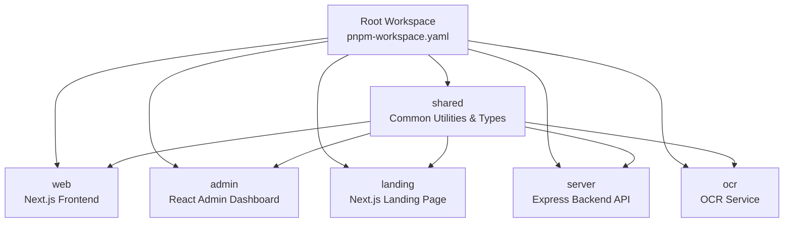
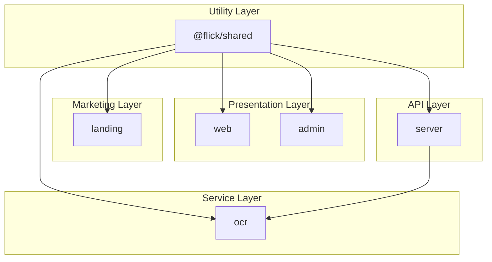
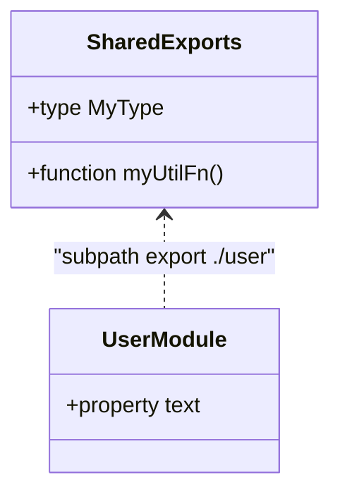
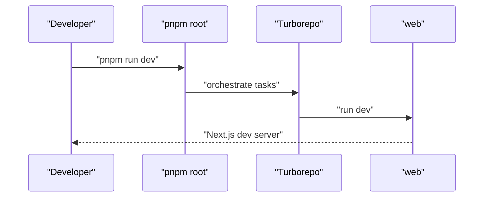
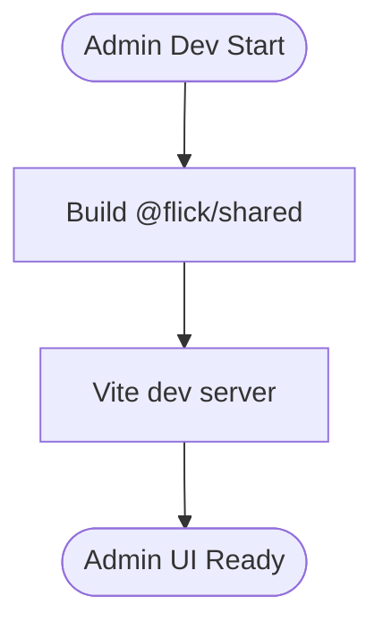
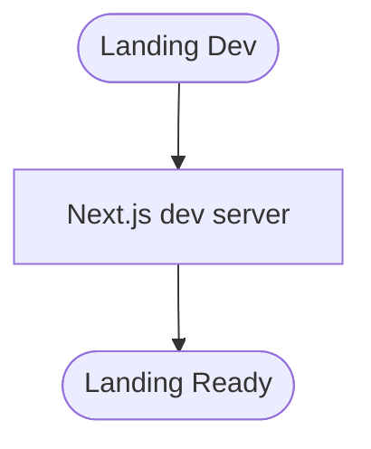
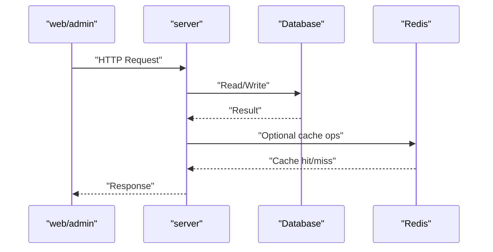
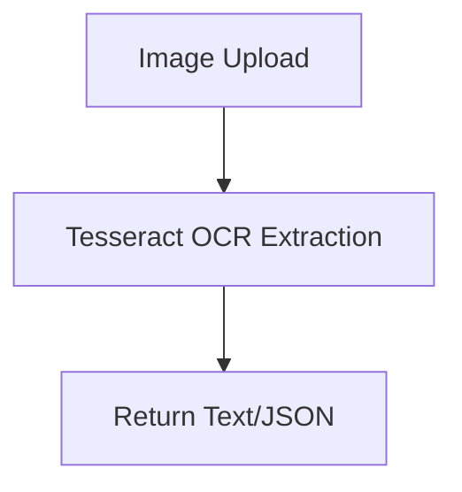
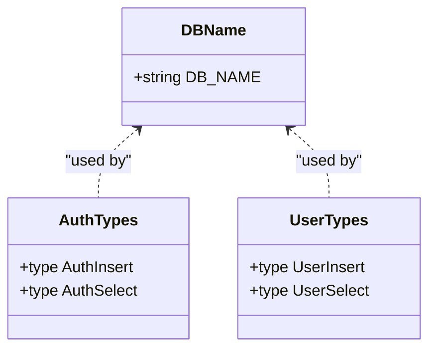
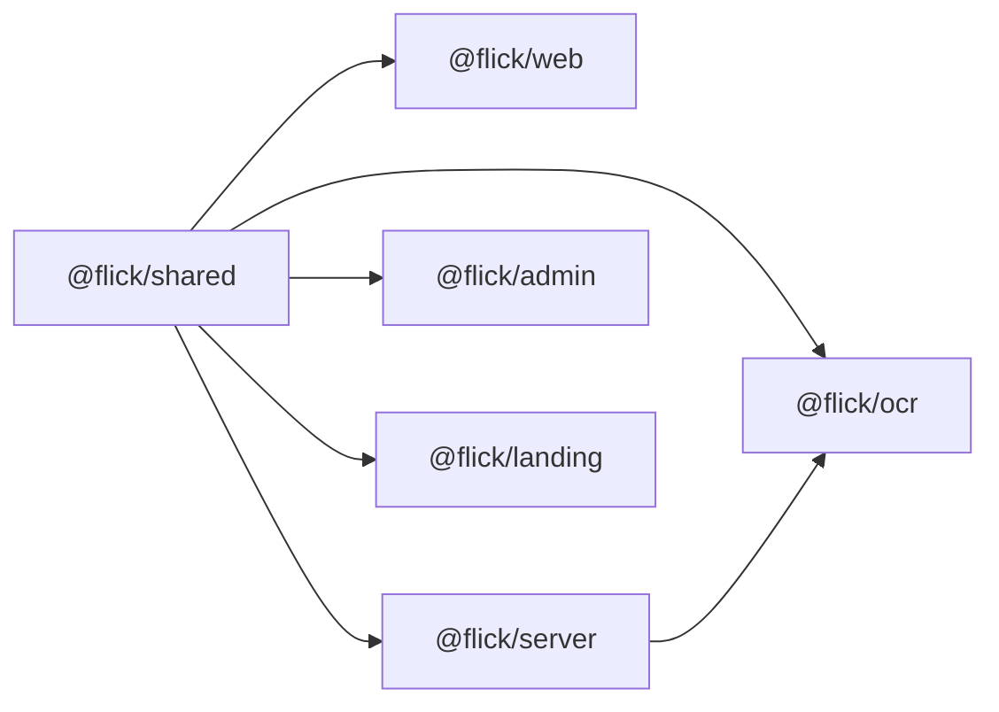

# Monorepo Structure

<cite>
**Referenced Files in This Document**
- [pnpm-workspace.yaml](file://pnpm-workspace.yaml)
- [turbo.json](file://turbo.json)
- [package.json](file://package.json)
- [shared/package.json](file://shared/package.json)
- [shared/src/index.ts](file://shared/src/index.ts)
- [shared/src/some.module.ts](file://shared/src/some.module.ts)
- [web/package.json](file://web/package.json)
- [server/package.json](file://server/package.json)
- [admin/package.json](file://admin/package.json)
- [landing/package.json](file://landing/package.json)
- [ocr/package.json](file://ocr/package.json)
- [server/src/shared/constants/db.ts](file://server/src/shared/constants/db.ts)
- [server/src/shared/types/Auth.ts](file://server/src/shared/types/Auth.ts)
- [server/src/shared/types/User.ts](file://server/src/shared/types/User.ts)
</cite>

## Table of Contents
1. [Introduction](#introduction)
2. [Project Structure](#project-structure)
3. [Core Components](#core-components)
4. [Architecture Overview](#architecture-overview)
5. [Detailed Component Analysis](#detailed-component-analysis)
6. [Dependency Analysis](#dependency-analysis)
7. [Performance Considerations](#performance-considerations)
8. [Troubleshooting Guide](#troubleshooting-guide)
9. [Conclusion](#conclusion)

## Introduction
This document explains the Flick monorepo’s six-package architecture and how Turborepo orchestrates builds and caching across the workspace. The packages are:
- web: Next.js frontend application
- admin: React admin dashboard
- landing: Marketing landing page built with Next.js
- server: Express.js backend API
- ocr: Standalone OCR processing service
- shared: Common utilities and types published under @flick/shared

We also cover workspace configuration, build pipeline organization, and development workflow patterns enabled by pnpm workspaces and Turborepo.

## Project Structure
The repository is organized as a pnpm workspace with explicit package selection and controlled built dependencies. Turborepo defines cross-package task orchestration and caching policies.

**Diagram sources**
- [pnpm-workspace.yaml](file://pnpm-workspace.yaml#L1-L15)
- [shared/package.json](file://shared/package.json#L1-L19)

**Section sources**
- [pnpm-workspace.yaml](file://pnpm-workspace.yaml#L1-L15)
- [package.json](file://package.json#L1-L26)

## Core Components
- web: Next.js application with client-side UI components, routing, and API clients. Depends on @flick/shared for shared types/utilities.
- admin: Vite-based React admin with dashboards, charts, and administrative tools. Depends on @flick/shared.
- landing: Next.js marketing site with animations and responsive UI. Depends on @flick/landing for internal exports.
- server: Express-based backend with modular modules (auth, posts, users, notifications), database via Drizzle ORM, Redis cache, and rate limiting. Depends on @flick/shared.
- ocr: Standalone service exposing OCR extraction endpoints using Tesseract.js and Multer. Depends on @flick/ocr for internal exports.
- shared: A minimal library exporting utilities and types consumed by all packages. It is published as @flick/shared and exposes named subpath exports.

Key workspace and export configuration:
- pnpm workspace includes all six packages and controls which native dependencies are built.
- shared package exports a main entry and a subpath export for user-related utilities.

**Section sources**
- [web/package.json](file://web/package.json#L1-L59)
- [admin/package.json](file://admin/package.json#L1-L76)
- [landing/package.json](file://landing/package.json#L1-L36)
- [server/package.json](file://server/package.json#L1-L78)
- [ocr/package.json](file://ocr/package.json#L1-L34)
- [shared/package.json](file://shared/package.json#L1-L19)
- [pnpm-workspace.yaml](file://pnpm-workspace.yaml#L1-L15)

## Architecture Overview
The monorepo enforces a layered architecture:
- Presentation layer: web and admin
- Marketing layer: landing
- API layer: server
- Utility layer: shared
- Service layer: ocr

**Diagram sources**
- [web/package.json](file://web/package.json#L14-L46)
- [admin/package.json](file://admin/package.json#L12-L56)
- [landing/package.json](file://landing/package.json#L11-L26)
- [server/package.json](file://server/package.json#L27-L56)
- [ocr/package.json](file://ocr/package.json#L15-L23)
- [shared/package.json](file://shared/package.json#L14-L17)

## Detailed Component Analysis

### Shared Package
The shared package centralizes common utilities and types. It is published as @flick/shared and exposes:
- Main entry exporting a utility function and a type
- Subpath export for user-related module

**Diagram sources**
- [shared/src/index.ts](file://shared/src/index.ts#L1-L8)
- [shared/src/some.module.ts](file://shared/src/some.module.ts#L1-L3)
- [shared/package.json](file://shared/package.json#L14-L17)

**Section sources**
- [shared/src/index.ts](file://shared/src/index.ts#L1-L8)
- [shared/src/some.module.ts](file://shared/src/some.module.ts#L1-L3)
- [shared/package.json](file://shared/package.json#L1-L19)

### Web Application
- Purpose: Next.js frontend for the social platform UI.
- Dependencies: React 19, Radix UI primitives, Tailwind, Better Auth, Zustand, Socket.IO client, and @flick/shared.
- Scripts: dev, build, start, lint, format, check-types.

**Diagram sources**
- [package.json](file://package.json#L7-L12)
- [turbo.json](file://turbo.json#L18-L21)
- [web/package.json](file://web/package.json#L5-L12)

**Section sources**
- [web/package.json](file://web/package.json#L1-L59)

### Admin Dashboard
- Purpose: React admin panel for moderation and analytics.
- Dependencies: Radix UI, Recharts, Monaco Editor, Socket.IO client, and @flick/shared.
- Scripts: dev, build, lint, preview.

**Diagram sources**
- [admin/package.json](file://admin/package.json#L6-L11)
- [shared/package.json](file://shared/package.json#L1-L19)

**Section sources**
- [admin/package.json](file://admin/package.json#L1-L76)

### Landing Page
- Purpose: Marketing landing page built with Next.js.
- Dependencies: Next.js, Radix UI, motion, cobe, and @flick/landing.
- Scripts: dev, build, start, lint.

**Diagram sources**
- [landing/package.json](file://landing/package.json#L5-L10)

**Section sources**
- [landing/package.json](file://landing/package.json#L1-L36)

### Server API
- Purpose: Express backend with modular domain services, database, caching, and authentication.
- Dependencies: Better Auth, Drizzle ORM, Redis/ioredis, Socket.IO, Helmet, Morgan, and @flick/shared.
- Scripts: dev, build, start, seed, migrations, lint/format, typecheck.

**Diagram sources**
- [server/package.json](file://server/package.json#L27-L56)

**Section sources**
- [server/package.json](file://server/package.json#L1-L78)

### OCR Service
- Purpose: Standalone OCR extraction service using Tesseract.js and Multer.
- Dependencies: Express, Tesseract.js, CORS, Multer, and @flick/ocr.
- Scripts: dev, build, start.

**Diagram sources**
- [ocr/package.json](file://ocr/package.json#L15-L23)

**Section sources**
- [ocr/package.json](file://ocr/package.json#L1-L34)

### Shared Types and Constants (Server)
The server consumes shared types and constants to maintain consistency across packages.

**Diagram sources**
- [server/src/shared/constants/db.ts](file://server/src/shared/constants/db.ts#L1-L1)
- [server/src/shared/types/Auth.ts](file://server/src/shared/types/Auth.ts#L1-L4)
- [server/src/shared/types/User.ts](file://server/src/shared/types/User.ts#L1-L4)

**Section sources**
- [server/src/shared/constants/db.ts](file://server/src/shared/constants/db.ts#L1-L1)
- [server/src/shared/types/Auth.ts](file://server/src/shared/types/Auth.ts#L1-L4)
- [server/src/shared/types/User.ts](file://server/src/shared/types/User.ts#L1-L4)

## Dependency Analysis
Workspace and inter-package dependencies:
- pnpm workspace includes all six packages and restricts built dependencies to specific packages.
- Each app/service depends on @flick/shared for shared utilities and types.
- server optionally integrates with ocr for OCR-related features.

**Diagram sources**
- [pnpm-workspace.yaml](file://pnpm-workspace.yaml#L1-L15)
- [web/package.json](file://web/package.json#L14)
- [server/package.json](file://server/package.json#L28)
- [admin/package.json](file://admin/package.json#L13)
- [landing/package.json](file://landing/package.json#L12)
- [ocr/package.json](file://ocr/package.json#L16)

**Section sources**
- [pnpm-workspace.yaml](file://pnpm-workspace.yaml#L1-L15)
- [web/package.json](file://web/package.json#L14)
- [server/package.json](file://server/package.json#L28)
- [admin/package.json](file://admin/package.json#L13)
- [landing/package.json](file://landing/package.json#L12)
- [ocr/package.json](file://ocr/package.json#L16)

## Performance Considerations
- Turborepo caching: Tasks configured to cache outputs for incremental builds. The build task caches Next.js artifacts while excluding caches to keep builds fast.
- Parallelization: Root scripts run all packages in parallel for development and build, leveraging workspace isolation.
- Workspace builds: pnpm workspaces link local packages, reducing duplication and speeding up installs.

Recommendations:
- Keep task outputs precise to maximize cache hits.
- Prefer incremental builds during development.
- Use persistent dev tasks for long-running servers (already configured).

**Section sources**
- [turbo.json](file://turbo.json#L4-L21)
- [package.json](file://package.json#L8-L12)

## Troubleshooting Guide
- Shared package export issues: Verify exports and subpath entries in the shared package manifest.
- Workspace dependency resolution: Ensure workspace:* is used consistently for @flick scoped packages.
- Native dependency builds: Confirm only intended packages are marked as built in the workspace configuration.
- Type conflicts: Align TypeScript versions and ensure shared types are compiled before consumption.

**Section sources**
- [shared/package.json](file://shared/package.json#L14-L17)
- [pnpm-workspace.yaml](file://pnpm-workspace.yaml#L9-L15)
- [web/package.json](file://web/package.json#L56)
- [server/package.json](file://server/package.json#L52)

## Conclusion
Flick’s monorepo leverages pnpm workspaces and Turborepo to unify tooling, enforce code reuse via @flick/shared, and streamline development across the frontend, backend, marketing, admin, and OCR services. The architecture promotes consistency, reduces duplication, and simplifies dependency management while enabling efficient parallel builds and intelligent caching.