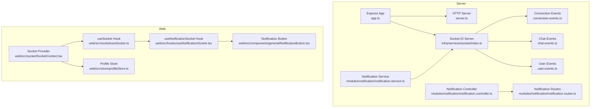
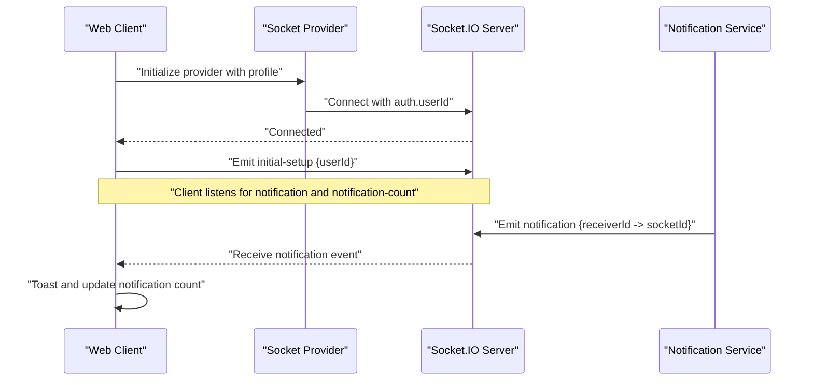
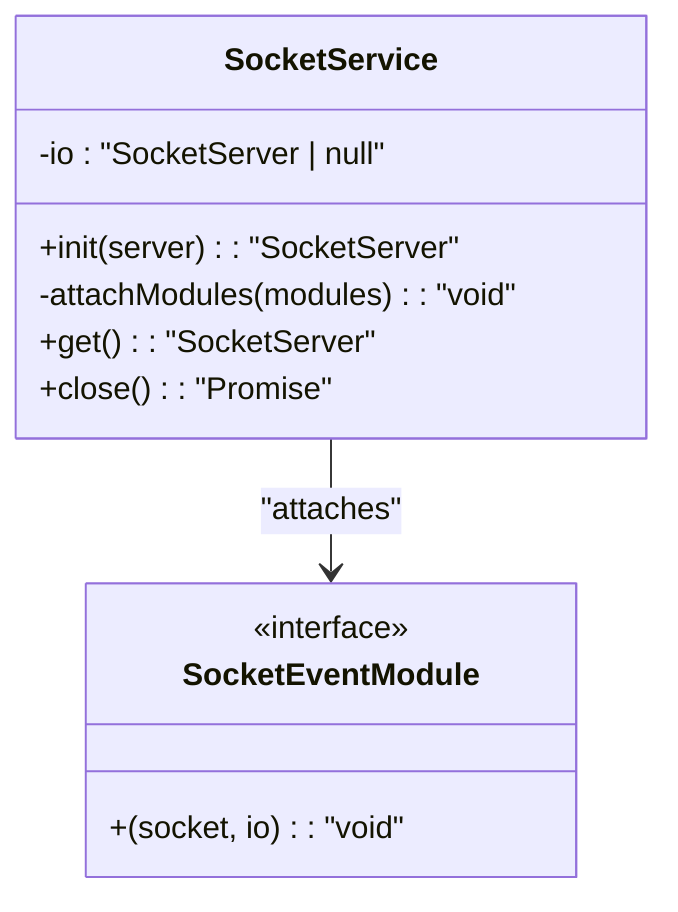
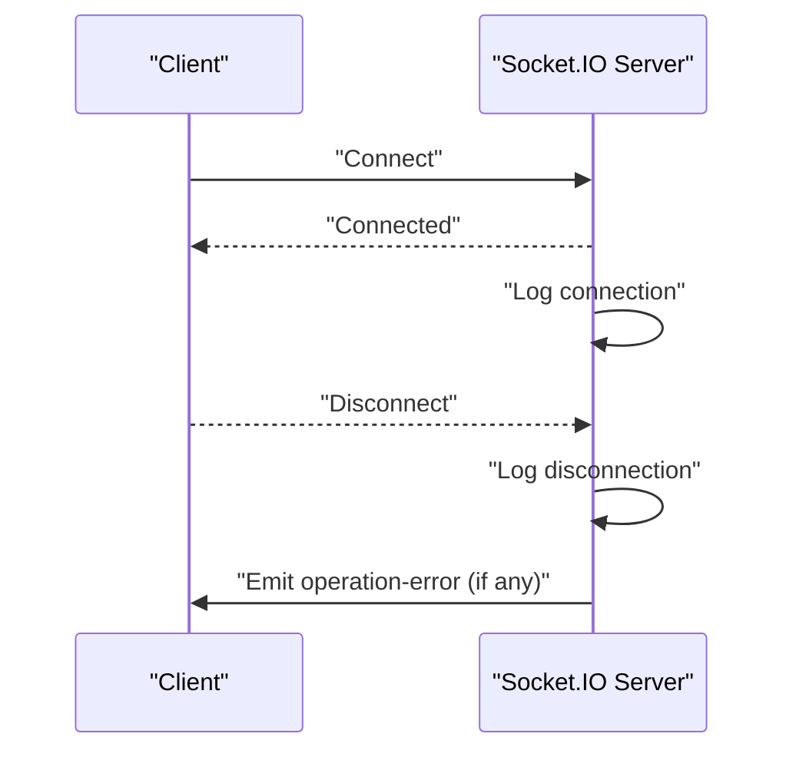
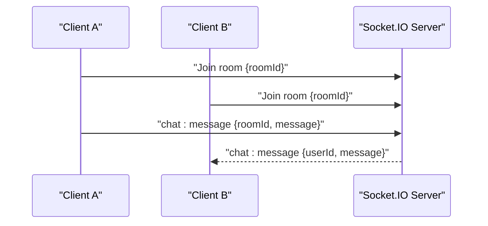
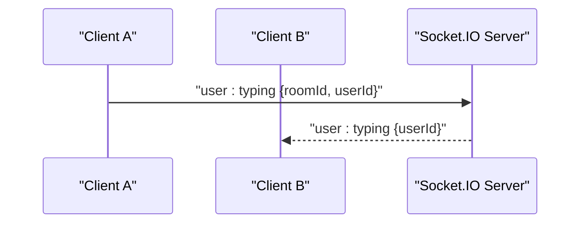
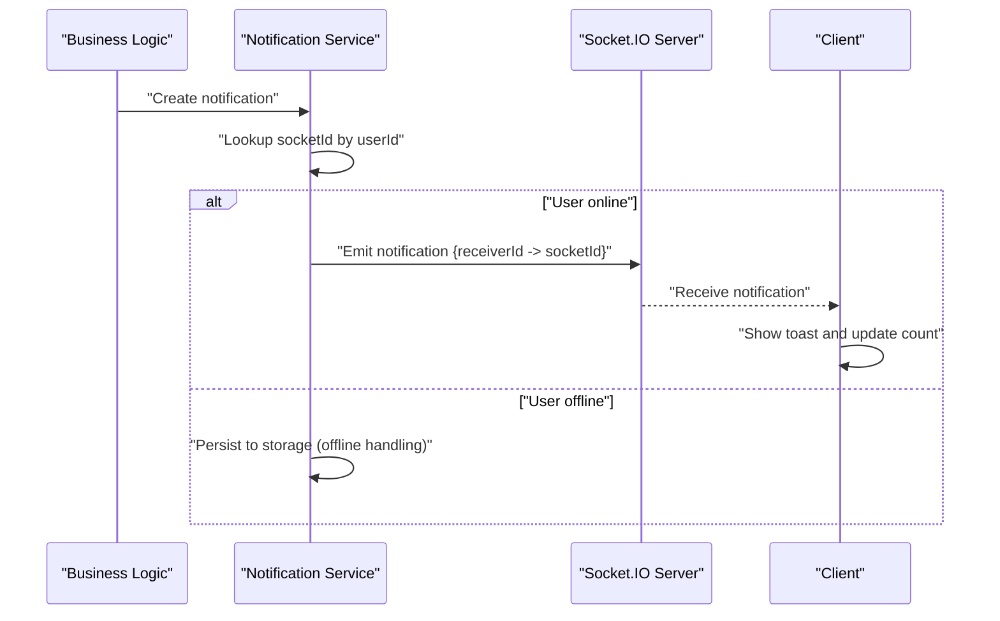
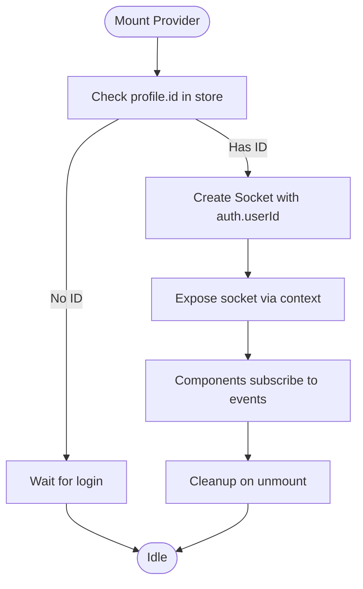
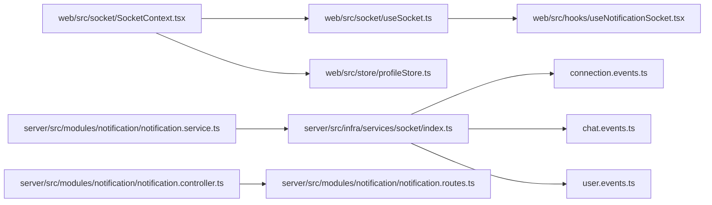

# Real-time Communication

<cite>
**Referenced Files in This Document**
- [server.ts](file://server/src/server.ts)
- [app.ts](file://server/src/app.ts)
- [index.ts](file://server/src/infra/services/socket/index.ts)
- [SocketEvents.ts](file://server/src/infra/services/socket/types/SocketEvents.ts)
- [connection.events.ts](file://server/src/infra/services/socket/events/connection.events.ts)
- [chat.events.ts](file://server/src/infra/services/socket/events/chat.events.ts)
- [user.events.ts](file://server/src/infra/services/socket/events/user.events.ts)
- [handleSocketError.ts](file://server/src/infra/services/socket/errors/handleSocketError.ts)
- [notification.service.ts](file://server/src/modules/notification/notification.service.ts)
- [notification.controller.ts](file://server/src/modules/notification/notification.controller.ts)
- [notification.routes.ts](file://server/src/modules/notification/notification.routes.ts)
- [SocketContext.tsx](file://web/src/socket/SocketContext.tsx)
- [useSocket.ts](file://web/src/socket/useSocket.ts)
- [useNotificationSocket.tsx](file://web/src/hooks/useNotificationSocket.tsx)
- [NotificationButton.tsx](file://web/src/components/general/NotificationButton.tsx)
- [profileStore.ts](file://web/src/store/profileStore.ts)
- [rate-limit.middleware.ts](file://server/src/core/middlewares/rate-limit.middleware.ts)
- [health.routes.ts](file://server/src/routes/health.routes.ts)
</cite>

## Table of Contents
1. [Introduction](#introduction)
2. [Project Structure](#project-structure)
3. [Core Components](#core-components)
4. [Architecture Overview](#architecture-overview)
5. [Detailed Component Analysis](#detailed-component-analysis)
6. [Dependency Analysis](#dependency-analysis)
7. [Performance Considerations](#performance-considerations)
8. [Troubleshooting Guide](#troubleshooting-guide)
9. [Conclusion](#conclusion)

## Introduction
This document describes the real-time communication architecture of Flick, focusing on Socket.IO-based live notifications, chat rooms, typing indicators, and user presence signaling. It documents the event-driven design, message formats, connection lifecycle, server-side event handlers, client-side integration patterns, and state synchronization strategies. It also covers offline handling, security considerations, rate limiting, scalability, load balancing, and monitoring.

## Project Structure
The real-time system spans two applications:
- Server (Node.js with Express and Socket.IO): Hosts the Socket.IO server, registers event modules, and emits real-time events to clients.
- Web (Next.js): Provides a Socket.IO client that connects after user authentication, listens for real-time events, and updates UI state.

**Diagram sources**
- [server.ts](file://server/src/server.ts#L1-L50)
- [app.ts](file://server/src/app.ts#L1-L120)
- [index.ts](file://server/src/infra/services/socket/index.ts#L1-L48)
- [connection.events.ts](file://server/src/infra/services/socket/events/connection.events.ts#L1-L20)
- [chat.events.ts](file://server/src/infra/services/socket/events/chat.events.ts#L1-L26)
- [user.events.ts](file://server/src/infra/services/socket/events/user.events.ts#L1-L10)
- [notification.service.ts](file://server/src/modules/notification/notification.service.ts#L1-L49)
- [notification.controller.ts](file://server/src/modules/notification/notification.controller.ts#L1-L47)
- [notification.routes.ts](file://server/src/modules/notification/notification.routes.ts#L1-L12)
- [SocketContext.tsx](file://web/src/socket/SocketContext.tsx#L1-L47)
- [useSocket.ts](file://web/src/socket/useSocket.ts#L1-L9)
- [useNotificationSocket.tsx](file://web/src/hooks/useNotificationSocket.tsx#L1-L46)
- [NotificationButton.tsx](file://web/src/components/general/NotificationButton.tsx#L1-L20)
- [profileStore.ts](file://web/src/store/profileStore.ts#L1-L57)

**Section sources**
- [server.ts](file://server/src/server.ts#L1-L50)
- [app.ts](file://server/src/app.ts#L1-L120)
- [index.ts](file://server/src/infra/services/socket/index.ts#L1-L48)
- [SocketEvents.ts](file://server/src/infra/services/socket/types/SocketEvents.ts#L1-L3)
- [connection.events.ts](file://server/src/infra/services/socket/events/connection.events.ts#L1-L20)
- [chat.events.ts](file://server/src/infra/services/socket/events/chat.events.ts#L1-L26)
- [user.events.ts](file://server/src/infra/services/socket/events/user.events.ts#L1-L10)
- [notification.service.ts](file://server/src/modules/notification/notification.service.ts#L1-L49)
- [notification.controller.ts](file://server/src/modules/notification/notification.controller.ts#L1-L47)
- [notification.routes.ts](file://server/src/modules/notification/notification.routes.ts#L1-L12)
- [SocketContext.tsx](file://web/src/socket/SocketContext.tsx#L1-L47)
- [useSocket.ts](file://web/src/socket/useSocket.ts#L1-L9)
- [useNotificationSocket.tsx](file://web/src/hooks/useNotificationSocket.tsx#L1-L46)
- [NotificationButton.tsx](file://web/src/components/general/NotificationButton.tsx#L1-L20)
- [profileStore.ts](file://web/src/store/profileStore.ts#L1-L57)

## Core Components
- Socket.IO Server initialization and CORS configuration.
- Event modules for connection lifecycle, chat messaging, and user presence.
- Notification service emitting real-time notifications to online users.
- Client-side provider and hooks for connecting and consuming real-time events.
- Rate limiting middleware for HTTP and potential future WebSocket rate limiting.

Key responsibilities:
- Server: Initialize Socket.IO, attach event modules, and broadcast events to rooms or specific sockets.
- Client: Connect after authentication, join rooms, listen for events, and update UI state.

**Section sources**
- [index.ts](file://server/src/infra/services/socket/index.ts#L1-L48)
- [SocketEvents.ts](file://server/src/infra/services/socket/types/SocketEvents.ts#L1-L3)
- [connection.events.ts](file://server/src/infra/services/socket/events/connection.events.ts#L1-L20)
- [chat.events.ts](file://server/src/infra/services/socket/events/chat.events.ts#L1-L26)
- [user.events.ts](file://server/src/infra/services/socket/events/user.events.ts#L1-L10)
- [notification.service.ts](file://server/src/modules/notification/notification.service.ts#L1-L49)
- [SocketContext.tsx](file://web/src/socket/SocketContext.tsx#L1-L47)
- [useSocket.ts](file://web/src/socket/useSocket.ts#L1-L9)
- [useNotificationSocket.tsx](file://web/src/hooks/useNotificationSocket.tsx#L1-L46)

## Architecture Overview
The system uses a publish-subscribe model:
- Clients connect via Socket.IO with authentication context.
- Server attaches event modules on connection.
- Notifications are emitted to specific sockets when users are online.
- Chat messages are broadcast to rooms.
- Typing indicators are sent to room peers.

**Diagram sources**
- [SocketContext.tsx](file://web/src/socket/SocketContext.tsx#L16-L37)
- [useNotificationSocket.tsx](file://web/src/hooks/useNotificationSocket.tsx#L14-L42)
- [notification.service.ts](file://server/src/modules/notification/notification.service.ts#L29-L49)
- [index.ts](file://server/src/infra/services/socket/index.ts#L10-L24)

## Detailed Component Analysis

### Socket.IO Server Initialization and Event Modules
- Initializes Socket.IO with CORS and transport configuration.
- Attaches event modules for connection, chat, and user presence.
- Emits standardized error events to clients.

**Diagram sources**
- [index.ts](file://server/src/infra/services/socket/index.ts#L7-L45)
- [SocketEvents.ts](file://server/src/infra/services/socket/types/SocketEvents.ts#L1-L3)

**Section sources**
- [index.ts](file://server/src/infra/services/socket/index.ts#L1-L48)
- [SocketEvents.ts](file://server/src/infra/services/socket/types/SocketEvents.ts#L1-L3)
- [handleSocketError.ts](file://server/src/infra/services/socket/errors/handleSocketError.ts#L1-L22)

### Connection Lifecycle Events
- Logs connection and disconnection.
- Emits operation errors to clients.

**Diagram sources**
- [connection.events.ts](file://server/src/infra/services/socket/events/connection.events.ts#L4-L17)
- [handleSocketError.ts](file://server/src/infra/services/socket/errors/handleSocketError.ts#L3-L21)

**Section sources**
- [connection.events.ts](file://server/src/infra/services/socket/events/connection.events.ts#L1-L20)
- [handleSocketError.ts](file://server/src/infra/services/socket/errors/handleSocketError.ts#L1-L22)

### Chat Functionality
- Clients join rooms by ID.
- Messages are broadcast to the room.
- Room-based delivery ensures targeted updates.

**Diagram sources**
- [chat.events.ts](file://server/src/infra/services/socket/events/chat.events.ts#L4-L23)

**Section sources**
- [chat.events.ts](file://server/src/infra/services/socket/events/chat.events.ts#L1-L26)

### User Presence and Typing Indicators
- Clients emit typing events to a room.
- Server forwards typing signals to other room members.

**Diagram sources**
- [user.events.ts](file://server/src/infra/services/socket/events/user.events.ts#L3-L6)

**Section sources**
- [user.events.ts](file://server/src/infra/services/socket/events/user.events.ts#L1-L10)

### Notification System
- Notification service resolves a user’s socket ID and emits real-time notifications.
- Client listens for notification and notification-count events, updates UI state, and triggers toasts.

**Diagram sources**
- [notification.service.ts](file://server/src/modules/notification/notification.service.ts#L29-L49)
- [useNotificationSocket.tsx](file://web/src/hooks/useNotificationSocket.tsx#L22-L37)

**Section sources**
- [notification.service.ts](file://server/src/modules/notification/notification.service.ts#L1-L49)
- [notification.controller.ts](file://server/src/modules/notification/notification.controller.ts#L1-L47)
- [notification.routes.ts](file://server/src/modules/notification/notification.routes.ts#L1-L12)
- [useNotificationSocket.tsx](file://web/src/hooks/useNotificationSocket.tsx#L1-L46)
- [NotificationButton.tsx](file://web/src/components/general/NotificationButton.tsx#L1-L20)

### Client-Side Integration Patterns
- Socket provider initializes a Socket.IO client with authentication and WebSocket transport.
- Hook exposes the socket instance to components.
- Notification hook subscribes to real-time events, sets up cleanup, and navigates on action.

**Diagram sources**
- [SocketContext.tsx](file://web/src/socket/SocketContext.tsx#L16-L37)
- [useSocket.ts](file://web/src/socket/useSocket.ts#L4-L6)
- [useNotificationSocket.tsx](file://web/src/hooks/useNotificationSocket.tsx#L14-L42)
- [profileStore.ts](file://web/src/store/profileStore.ts#L14-L28)

**Section sources**
- [SocketContext.tsx](file://web/src/socket/SocketContext.tsx#L1-L47)
- [useSocket.ts](file://web/src/socket/useSocket.ts#L1-L9)
- [useNotificationSocket.tsx](file://web/src/hooks/useNotificationSocket.tsx#L1-L46)
- [profileStore.ts](file://web/src/store/profileStore.ts#L1-L57)

### State Synchronization Strategies
- Client maintains local notification count and updates reactively upon receiving events.
- UI components reflect real-time counts and toasts without polling.
- Room membership is managed client-side via join events.

**Section sources**
- [useNotificationSocket.tsx](file://web/src/hooks/useNotificationSocket.tsx#L10-L37)
- [NotificationButton.tsx](file://web/src/components/general/NotificationButton.tsx#L9-L15)

## Dependency Analysis
- Server depends on Socket.IO initialization and event modules.
- Notification service depends on Socket.IO instance and a user-to-socket mapping.
- Client depends on provider context and profile store for authentication context.

**Diagram sources**
- [SocketContext.tsx](file://web/src/socket/SocketContext.tsx#L1-L47)
- [useSocket.ts](file://web/src/socket/useSocket.ts#L1-L9)
- [useNotificationSocket.tsx](file://web/src/hooks/useNotificationSocket.tsx#L1-L46)
- [profileStore.ts](file://web/src/store/profileStore.ts#L1-L57)
- [index.ts](file://server/src/infra/services/socket/index.ts#L1-L48)
- [connection.events.ts](file://server/src/infra/services/socket/events/connection.events.ts#L1-L20)
- [chat.events.ts](file://server/src/infra/services/socket/events/chat.events.ts#L1-L26)
- [user.events.ts](file://server/src/infra/services/socket/events/user.events.ts#L1-L10)
- [notification.service.ts](file://server/src/modules/notification/notification.service.ts#L1-L49)
- [notification.controller.ts](file://server/src/modules/notification/notification.controller.ts#L1-L47)
- [notification.routes.ts](file://server/src/modules/notification/notification.routes.ts#L1-L12)

**Section sources**
- [index.ts](file://server/src/infra/services/socket/index.ts#L1-L48)
- [notification.service.ts](file://server/src/modules/notification/notification.service.ts#L1-L49)
- [SocketContext.tsx](file://web/src/socket/SocketContext.tsx#L1-L47)

## Performance Considerations
- Transport and connection
  - Enforce WebSocket transport on both client and server to reduce overhead.
  - Keep-alive and timeouts should be configured at the infrastructure level.
- Message volume
  - Broadcast only to rooms that require updates.
  - Debounce typing indicators to avoid bursts.
- Memory and scaling
  - Avoid storing large payloads in rooms; keep per-message payloads minimal.
  - Use efficient room management and periodic cleanup of stale rooms.
- Monitoring
  - Track connection counts, room sizes, and event rates.
  - Use health endpoints to expose metrics and readiness.

[No sources needed since this section provides general guidance]

## Troubleshooting Guide
- Connection issues
  - Verify CORS origins and transport configuration on the server.
  - Ensure the client passes authentication credentials and reconnects on disconnect.
- Error handling
  - Server emits standardized operation-error events; clients should display user-friendly messages.
- Offline handling
  - Notifications delivered when a user is offline should be persisted and surfaced later (e.g., via HTTP API).
- Rate limiting
  - Apply rate limits to HTTP endpoints; consider extending to WebSocket events if needed.

**Section sources**
- [index.ts](file://server/src/infra/services/socket/index.ts#L13-L19)
- [handleSocketError.ts](file://server/src/infra/services/socket/errors/handleSocketError.ts#L1-L22)
- [rate-limit.middleware.ts](file://server/src/core/middlewares/rate-limit.middleware.ts#L1-L200)
- [health.routes.ts](file://server/src/routes/health.routes.ts#L1-L100)

## Security Considerations
- Authentication integration
  - Client connects with an authenticated user ID; enforce authorization on sensitive operations.
- Authorization
  - Validate room membership and permissions before emitting events to rooms.
- Transport security
  - Use TLS termination at the reverse proxy or load balancer; configure CORS to trusted origins only.
- Rate limiting
  - Apply rate limits to prevent abuse and protect resources.

**Section sources**
- [SocketContext.tsx](file://web/src/socket/SocketContext.tsx#L23-L28)
- [notification.routes.ts](file://server/src/modules/notification/notification.routes.ts#L3-L10)
- [index.ts](file://server/src/infra/services/socket/index.ts#L14-L16)

## Scalability and Horizontal Scaling
- Load balancing
  - Use sticky sessions or a shared state backend for session affinity.
- Shared state
  - Maintain user-to-socket mapping in shared storage (e.g., Redis) for multi-instance deployments.
- Backplane
  - Integrate a Socket.IO adapter/backplane to synchronize events across nodes.
- Health and readiness
  - Expose health endpoints to gatekeepers and orchestration platforms.

[No sources needed since this section provides general guidance]

## Conclusion
Flick’s real-time system leverages Socket.IO for live notifications, chat rooms, and typing indicators. The server initializes the Socket.IO server, registers modular event handlers, and emits targeted events to online users. The client integrates via a provider and hooks, enabling reactive UI updates. While the current implementation focuses on online delivery, offline handling can be extended via persistent storage and HTTP APIs. Security, rate limiting, and scalable deployment strategies are essential for production-grade reliability and performance.