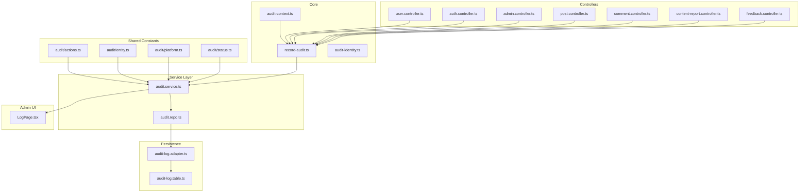
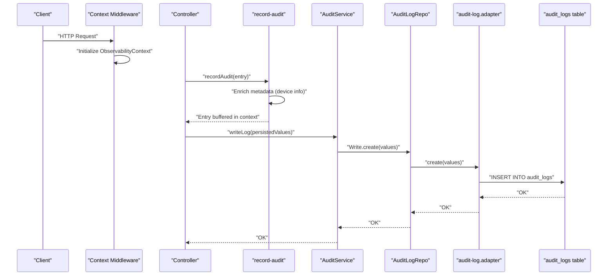
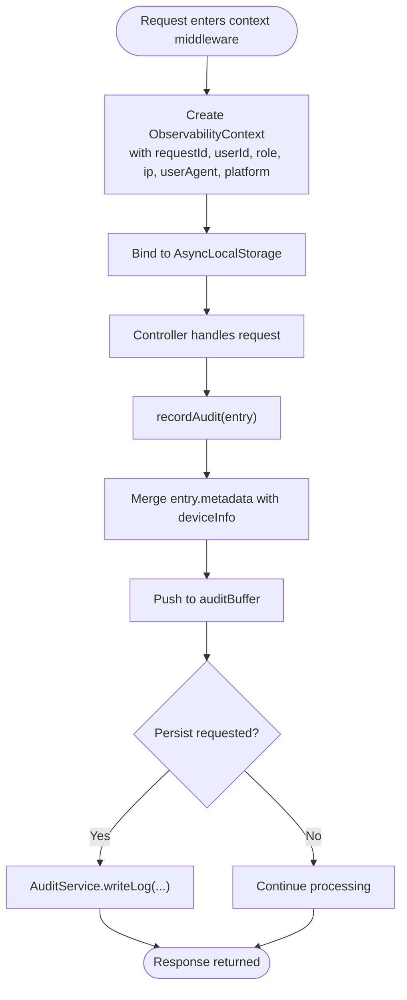
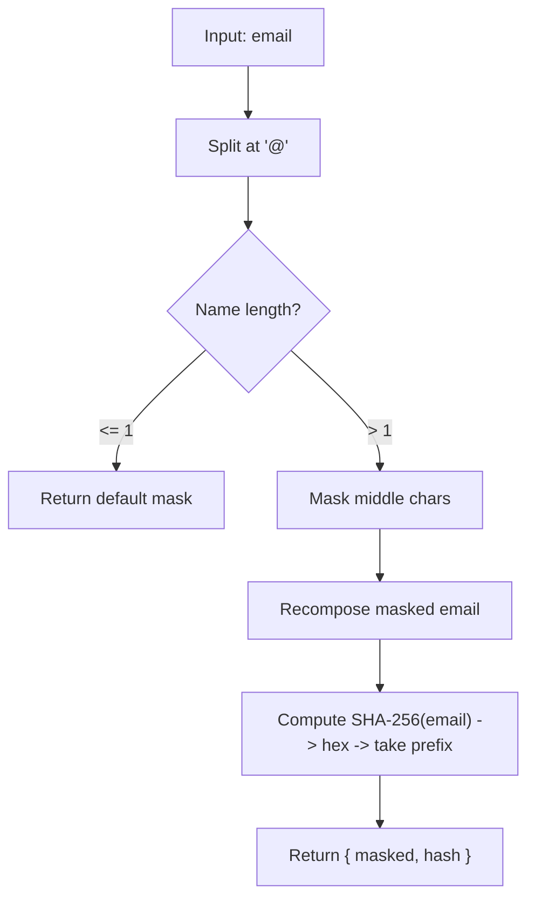
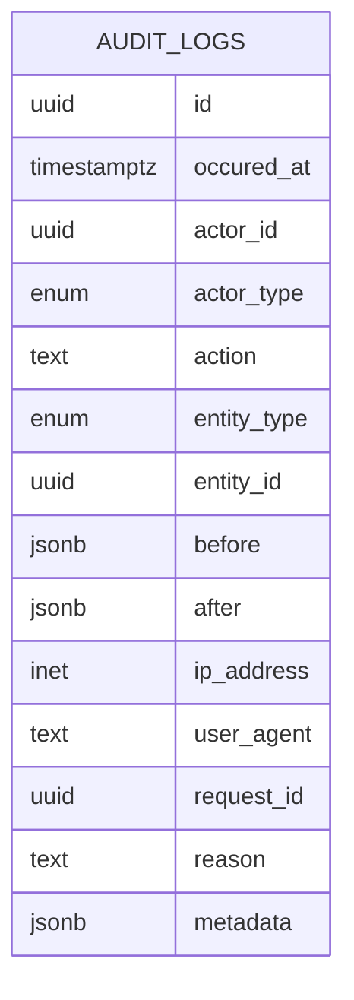
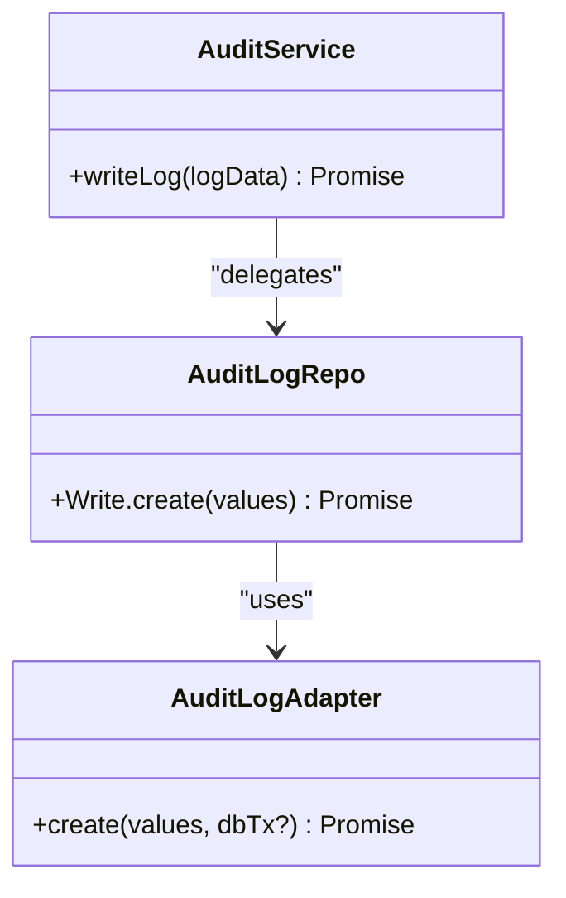
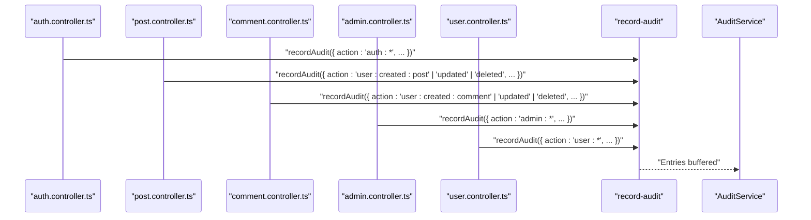
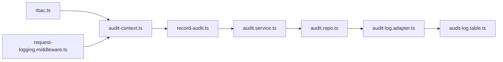

# Audit System

<cite>
**Referenced Files in This Document**
- [audit.service.ts](file://server/src/modules/audit/audit.service.ts)
- [audit.repo.ts](file://server/src/modules/audit/audit.repo.ts)
- [audit.types.ts](file://server/src/modules/audit/audit.types.ts)
- [audit-context.ts](file://server/src/modules/audit/audit-context.ts)
- [record-audit.ts](file://server/src/lib/record-audit.ts)
- [audit-identity.ts](file://server/src/lib/audit-identity.ts)
- [audit-log.adapter.ts](file://server/src/infra/db/adapters/audit-log.adapter.ts)
- [audit-log.table.ts](file://server/src/infra/db/tables/audit-log.table.ts)
- [actions.ts](file://server/src/shared/constants/audit/actions.ts)
- [entity.ts](file://server/src/shared/constants/audit/entity.ts)
- [platform.ts](file://server/src/shared/constants/audit/platform.ts)
- [status.ts](file://server/src/shared/constants/audit/status.ts)
- [context.middleware.ts](file://server/src/core/middlewares/context.middleware.ts)
- [request-logging.middleware.ts](file://server/src/core/middlewares/request-logging.middleware.ts)
- [rbac.ts](file://server/src/core/security/rbac.ts)
- [auth.controller.ts](file://server/src/modules/auth/auth.controller.ts)
- [admin.controller.ts](file://server/src/modules/admin/admin.controller.ts)
- [post.controller.ts](file://server/src/modules/post/post.controller.ts)
- [comment.controller.ts](file://server/src/modules/comment/comment.controller.ts)
- [content-report.controller.ts](file://server/src/modules/content-report/content-report.controller.ts)
- [feedback.controller.ts](file://server/src/modules/feedback/feedback.controller.ts)
- [user.controller.ts](file://server/src/modules/user/user.controller.ts)
- [LogPage.tsx](file://admin/src/pages/LogPage.tsx)
</cite>

## Table of Contents
1. [Introduction](#introduction)
2. [Project Structure](#project-structure)
3. [Core Components](#core-components)
4. [Architecture Overview](#architecture-overview)
5. [Detailed Component Analysis](#detailed-component-analysis)
6. [Dependency Analysis](#dependency-analysis)
7. [Performance Considerations](#performance-considerations)
8. [Troubleshooting Guide](#troubleshooting-guide)
9. [Conclusion](#conclusion)
10. [Appendices](#appendices)

## Introduction
This document describes the Flick platform’s audit system: how audit events are generated, captured, stored, and exposed for compliance and security monitoring. It covers the audit repository pattern, log storage schema, real-time audit context, event categorization, identity masking and hashing for privacy, and integration points across service layers. It also outlines audit report generation capabilities and how to leverage the admin UI for viewing audit logs.

## Project Structure
The audit system spans several layers:
- Shared constants define standardized actions, entities, platforms, and statuses.
- A lightweight service and repository encapsulate persistence.
- A middleware establishes an observability context per request.
- A small library records audit entries into the context buffer.
- A database adapter persists audit logs to a dedicated table with indexes optimized for common queries.
- Controllers across modules trigger audit events around key operations.
- The admin UI exposes a page to browse audit logs.

**Diagram sources**
- [audit.service.ts](file://server/src/modules/audit/audit.service.ts#L1-L10)
- [audit.repo.ts](file://server/src/modules/audit/audit.repo.ts#L1-L10)
- [audit-context.ts](file://server/src/modules/audit/audit-context.ts#L1-L29)
- [record-audit.ts](file://server/src/lib/record-audit.ts#L1-L20)
- [audit-identity.ts](file://server/src/lib/audit-identity.ts#L1-L30)
- [audit-log.adapter.ts](file://server/src/infra/db/adapters/audit-log.adapter.ts#L1-L9)
- [audit-log.table.ts](file://server/src/infra/db/tables/audit-log.table.ts#L1-L74)
- [actions.ts](file://server/src/shared/constants/audit/actions.ts#L1-L66)
- [entity.ts](file://server/src/shared/constants/audit/entity.ts#L1-L15)
- [platform.ts](file://server/src/shared/constants/audit/platform.ts#L1-L9)
- [status.ts](file://server/src/shared/constants/audit/status.ts#L1-L3)
- [user.controller.ts](file://server/src/modules/user/user.controller.ts)
- [auth.controller.ts](file://server/src/modules/auth/auth.controller.ts)
- [admin.controller.ts](file://server/src/modules/admin/admin.controller.ts)
- [post.controller.ts](file://server/src/modules/post/post.controller.ts)
- [comment.controller.ts](file://server/src/modules/comment/comment.controller.ts)
- [content-report.controller.ts](file://server/src/modules/content-report/content-report.controller.ts)
- [feedback.controller.ts](file://server/src/modules/feedback/feedback.controller.ts)
- [LogPage.tsx](file://admin/src/pages/LogPage.tsx)

**Section sources**
- [audit.service.ts](file://server/src/modules/audit/audit.service.ts#L1-L10)
- [audit.repo.ts](file://server/src/modules/audit/audit.repo.ts#L1-L10)
- [audit-context.ts](file://server/src/modules/audit/audit-context.ts#L1-L29)
- [record-audit.ts](file://server/src/lib/record-audit.ts#L1-L20)
- [audit-identity.ts](file://server/src/lib/audit-identity.ts#L1-L30)
- [audit-log.adapter.ts](file://server/src/infra/db/adapters/audit-log.adapter.ts#L1-L9)
- [audit-log.table.ts](file://server/src/infra/db/tables/audit-log.table.ts#L1-L74)
- [actions.ts](file://server/src/shared/constants/audit/actions.ts#L1-L66)
- [entity.ts](file://server/src/shared/constants/audit/entity.ts#L1-L15)
- [platform.ts](file://server/src/shared/constants/audit/platform.ts#L1-L9)
- [status.ts](file://server/src/shared/constants/audit/status.ts#L1-L3)

## Core Components
- Audit constants define canonical action taxonomy, entity types, platform identifiers, and status values. These are used to normalize event categorization across the platform.
- Audit context stores request-scoped metadata (requestId, userId, role, IP, userAgent, platform) and an in-memory buffer for audit entries. It uses AsyncLocalStorage to keep context per request.
- The record-audit helper pushes entries into the current context buffer and enriches metadata (e.g., device info parsed from userAgent).
- Identity helpers provide privacy-preserving identifiers for actors, including masked emails and short deterministic hashes.
- The audit service wraps repository operations to persist structured log events.
- The audit repository delegates to the database adapter, which inserts into the audit logs table.
- The audit logs table defines the schema, including indexes for efficient querying by entity, actor, and time.

**Section sources**
- [actions.ts](file://server/src/shared/constants/audit/actions.ts#L1-L66)
- [entity.ts](file://server/src/shared/constants/audit/entity.ts#L1-L15)
- [platform.ts](file://server/src/shared/constants/audit/platform.ts#L1-L9)
- [status.ts](file://server/src/shared/constants/audit/status.ts#L1-L3)
- [audit-context.ts](file://server/src/modules/audit/audit-context.ts#L1-L29)
- [record-audit.ts](file://server/src/lib/record-audit.ts#L1-L20)
- [audit-identity.ts](file://server/src/lib/audit-identity.ts#L1-L30)
- [audit.service.ts](file://server/src/modules/audit/audit.service.ts#L1-L10)
- [audit.repo.ts](file://server/src/modules/audit/audit.repo.ts#L1-L10)
- [audit-log.adapter.ts](file://server/src/infra/db/adapters/audit-log.adapter.ts#L1-L9)
- [audit-log.table.ts](file://server/src/infra/db/tables/audit-log.table.ts#L1-L74)

## Architecture Overview
The audit pipeline captures contextual information early in the request lifecycle, buffers audit entries locally, and writes them to persistent storage asynchronously via the service layer.

**Diagram sources**
- [context.middleware.ts](file://server/src/core/middlewares/context.middleware.ts)
- [audit-context.ts](file://server/src/modules/audit/audit-context.ts#L1-L29)
- [record-audit.ts](file://server/src/lib/record-audit.ts#L1-L20)
- [audit.service.ts](file://server/src/modules/audit/audit.service.ts#L1-L10)
- [audit.repo.ts](file://server/src/modules/audit/audit.repo.ts#L1-L10)
- [audit-log.adapter.ts](file://server/src/infra/db/adapters/audit-log.adapter.ts#L1-L9)
- [audit-log.table.ts](file://server/src/infra/db/tables/audit-log.table.ts#L1-L74)

## Detailed Component Analysis

### Audit Context and Real-Time Buffering
- ObservabilityContext carries request-scoped attributes and an audit buffer. It is initialized by the context middleware and attached to AsyncLocalStorage so child operations can append entries without explicit propagation.
- The recorder reads the current context, enriches metadata (e.g., device info derived from userAgent), and appends entries to the buffer.

**Diagram sources**
- [context.middleware.ts](file://server/src/core/middlewares/context.middleware.ts)
- [audit-context.ts](file://server/src/modules/audit/audit-context.ts#L1-L29)
- [record-audit.ts](file://server/src/lib/record-audit.ts#L1-L20)

**Section sources**
- [audit-context.ts](file://server/src/modules/audit/audit-context.ts#L1-L29)
- [record-audit.ts](file://server/src/lib/record-audit.ts#L1-L20)

### Audit Identity and Privacy
- Identity helpers provide two privacy-safe identifiers for actors:
  - Masked email for display-friendly redaction.
  - Short deterministic hash of normalized email for correlation without exposing personal data.

**Diagram sources**
- [audit-identity.ts](file://server/src/lib/audit-identity.ts#L1-L30)

**Section sources**
- [audit-identity.ts](file://server/src/lib/audit-identity.ts#L1-L30)

### Audit Event Schema and Persistence
- The audit logs table defines fields for actor identification, action, entity, timestamps, change tracking (before/after), network attributes (IP, userAgent), correlation (requestId), reason, and arbitrary metadata.
- Indexes support frequent queries: entity grouping, actor lookup, and reverse chronological ordering.

**Diagram sources**
- [audit-log.table.ts](file://server/src/infra/db/tables/audit-log.table.ts#L1-L74)

**Section sources**
- [audit-log.table.ts](file://server/src/infra/db/tables/audit-log.table.ts#L1-L74)
- [audit-log.adapter.ts](file://server/src/infra/db/adapters/audit-log.adapter.ts#L1-L9)

### Audit Constants and Categorization
- Actions: standardized taxonomy covering user, admin, and system activities.
- Entities: resource categories audited (e.g., post, comment, user, feedback).
- Platforms: web/mobile/tv/server/other.
- Status: success/fail.

These constants ensure consistent categorization across controllers and services.

**Section sources**
- [actions.ts](file://server/src/shared/constants/audit/actions.ts#L1-L66)
- [entity.ts](file://server/src/shared/constants/audit/entity.ts#L1-L15)
- [platform.ts](file://server/src/shared/constants/audit/platform.ts#L1-L9)
- [status.ts](file://server/src/shared/constants/audit/status.ts#L1-L3)

### Audit Service and Repository Pattern
- The service layer composes typed insert values and delegates persistence to the repository.
- The repository forwards to the database adapter, which performs the SQL insert.

**Diagram sources**
- [audit.service.ts](file://server/src/modules/audit/audit.service.ts#L1-L10)
- [audit.repo.ts](file://server/src/modules/audit/audit.repo.ts#L1-L10)
- [audit-log.adapter.ts](file://server/src/infra/db/adapters/audit-log.adapter.ts#L1-L9)

**Section sources**
- [audit.service.ts](file://server/src/modules/audit/audit.service.ts#L1-L10)
- [audit.repo.ts](file://server/src/modules/audit/audit.repo.ts#L1-L10)
- [audit-log.adapter.ts](file://server/src/infra/db/adapters/audit-log.adapter.ts#L1-L9)

### Integration Across Service Layers
Controllers across modules call the recorder to capture meaningful events around CRUD and operational actions. Typical integration points include:
- Authentication: OTP send/success/failure, login/logout, forgot password.
- Content: creation, updates, deletions, voting, reporting.
- Administration: user bans/suspensions, content moderation, feedback/report management.
- Users: account initialization, feedback lifecycle.

**Diagram sources**
- [auth.controller.ts](file://server/src/modules/auth/auth.controller.ts)
- [post.controller.ts](file://server/src/modules/post/post.controller.ts)
- [comment.controller.ts](file://server/src/modules/comment/comment.controller.ts)
- [admin.controller.ts](file://server/src/modules/admin/admin.controller.ts)
- [user.controller.ts](file://server/src/modules/user/user.controller.ts)
- [record-audit.ts](file://server/src/lib/record-audit.ts#L1-L20)
- [audit.service.ts](file://server/src/modules/audit/audit.service.ts#L1-L10)

**Section sources**
- [auth.controller.ts](file://server/src/modules/auth/auth.controller.ts)
- [post.controller.ts](file://server/src/modules/post/post.controller.ts)
- [comment.controller.ts](file://server/src/modules/comment/comment.controller.ts)
- [admin.controller.ts](file://server/src/modules/admin/admin.controller.ts)
- [user.controller.ts](file://server/src/modules/user/user.controller.ts)
- [record-audit.ts](file://server/src/lib/record-audit.ts#L1-L20)
- [audit.service.ts](file://server/src/modules/audit/audit.service.ts#L1-L10)

### Compliance Reporting and Admin UI
- The admin UI includes a LogPage that surfaces audit logs for review and filtering.
- The backend persists structured logs with sufficient context (actor, action, entity, timestamps, IP, userAgent, requestId, reason, metadata) to support compliance investigations.

**Section sources**
- [LogPage.tsx](file://admin/src/pages/LogPage.tsx)
- [audit-log.table.ts](file://server/src/infra/db/tables/audit-log.table.ts#L1-L74)

## Dependency Analysis
- Cohesion: Audit constants, context, recorder, service, repo, and adapter are tightly coupled around a single responsibility—capturing and persisting audit events.
- Coupling: Controllers depend on the recorder; the recorder depends on context; persistence depends on the adapter and table schema.
- External integrations: RBAC influences actor types and roles recorded; request logging middleware provides requestId/IP/userAgent; device parsing enriches metadata.

**Diagram sources**
- [rbac.ts](file://server/src/core/security/rbac.ts)
- [context.middleware.ts](file://server/src/core/middlewares/context.middleware.ts)
- [request-logging.middleware.ts](file://server/src/core/middlewares/request-logging.middleware.ts)
- [audit-context.ts](file://server/src/modules/audit/audit-context.ts#L1-L29)
- [record-audit.ts](file://server/src/lib/record-audit.ts#L1-L20)
- [audit.service.ts](file://server/src/modules/audit/audit.service.ts#L1-L10)
- [audit.repo.ts](file://server/src/modules/audit/audit.repo.ts#L1-L10)
- [audit-log.adapter.ts](file://server/src/infra/db/adapters/audit-log.adapter.ts#L1-L9)
- [audit-log.table.ts](file://server/src/infra/db/tables/audit-log.table.ts#L1-L74)

**Section sources**
- [rbac.ts](file://server/src/core/security/rbac.ts)
- [context.middleware.ts](file://server/src/core/middlewares/context.middleware.ts)
- [request-logging.middleware.ts](file://server/src/core/middlewares/request-logging.middleware.ts)
- [audit-context.ts](file://server/src/modules/audit/audit-context.ts#L1-L29)
- [record-audit.ts](file://server/src/lib/record-audit.ts#L1-L20)
- [audit.service.ts](file://server/src/modules/audit/audit.service.ts#L1-L10)
- [audit.repo.ts](file://server/src/modules/audit/audit.repo.ts#L1-L10)
- [audit-log.adapter.ts](file://server/src/infra/db/adapters/audit-log.adapter.ts#L1-L9)
- [audit-log.table.ts](file://server/src/infra/db/tables/audit-log.table.ts#L1-L74)

## Performance Considerations
- Asynchronous buffering: Entries are buffered in memory until persisted, reducing synchronous overhead during request handling.
- Indexes: Entity, actor, and time indexes optimize common queries for filtering and sorting.
- Metadata enrichment: Device parsing occurs at record time; consider caching or limiting expensive computations if throughput demands.
- Transactional writes: The adapter supports optional transaction injection to batch writes when appropriate.

[No sources needed since this section provides general guidance]

## Troubleshooting Guide
- No audit entries recorded:
  - Verify context middleware initializes ObservabilityContext for the request.
  - Confirm record-audit is invoked with a valid entry and that the context store is present.
- Missing metadata:
  - Ensure userAgent is populated; device parsing relies on it.
- Persistence failures:
  - Check adapter invocation and database connectivity; inspect returned errors from the adapter.
- Inconsistent actor types:
  - Align RBAC actor types with the audit actorType enumeration.

**Section sources**
- [context.middleware.ts](file://server/src/core/middlewares/context.middleware.ts)
- [record-audit.ts](file://server/src/lib/record-audit.ts#L1-L20)
- [audit-log.adapter.ts](file://server/src/infra/db/adapters/audit-log.adapter.ts#L1-L9)
- [rbac.ts](file://server/src/core/security/rbac.ts)

## Conclusion
The Flick audit system provides a robust, extensible foundation for capturing, storing, and retrieving audit events across user and administrative actions. By leveraging standardized constants, a request-scoped context, and a repository/persistence pattern, it supports compliance reporting, security monitoring, and incident investigations while preserving privacy through identity masking and hashing.

[No sources needed since this section summarizes without analyzing specific files]

## Appendices

### Audit Event Recording Examples (paths)
- Authentication:
  - [auth.controller.ts](file://server/src/modules/auth/auth.controller.ts)
- Content:
  - [post.controller.ts](file://server/src/modules/post/post.controller.ts)
  - [comment.controller.ts](file://server/src/modules/comment/comment.controller.ts)
- Administration:
  - [admin.controller.ts](file://server/src/modules/admin/admin.controller.ts)
- Users:
  - [user.controller.ts](file://server/src/modules/user/user.controller.ts)
- Content reports:
  - [content-report.controller.ts](file://server/src/modules/content-report/content-report.controller.ts)
- Feedback:
  - [feedback.controller.ts](file://server/src/modules/feedback/feedback.controller.ts)

### Audit Filtering and Searching
- Use the admin LogPage to filter by:
  - Actor type and ID
  - Action and entity type
  - Date range (reverse chronological)
  - Request ID for correlating with system logs
  - IP address and user agent for forensic analysis
- Backend schema supports efficient filtering via indexes on entity, actor, and occurred_at.

**Section sources**
- [LogPage.tsx](file://admin/src/pages/LogPage.tsx)
- [audit-log.table.ts](file://server/src/infra/db/tables/audit-log.table.ts#L1-L74)

### Privacy and Data Protection Measures
- Identity masking and hashing:
  - [audit-identity.ts](file://server/src/lib/audit-identity.ts#L1-L30)
- Minimal metadata collection:
  - Only necessary fields are persisted; sensitive fields are not stored.
- Access control:
  - RBAC governs who can view audit logs.

**Section sources**
- [audit-identity.ts](file://server/src/lib/audit-identity.ts#L1-L30)
- [rbac.ts](file://server/src/core/security/rbac.ts)