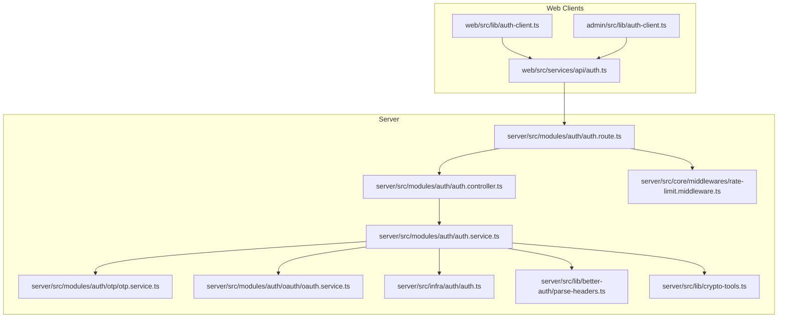
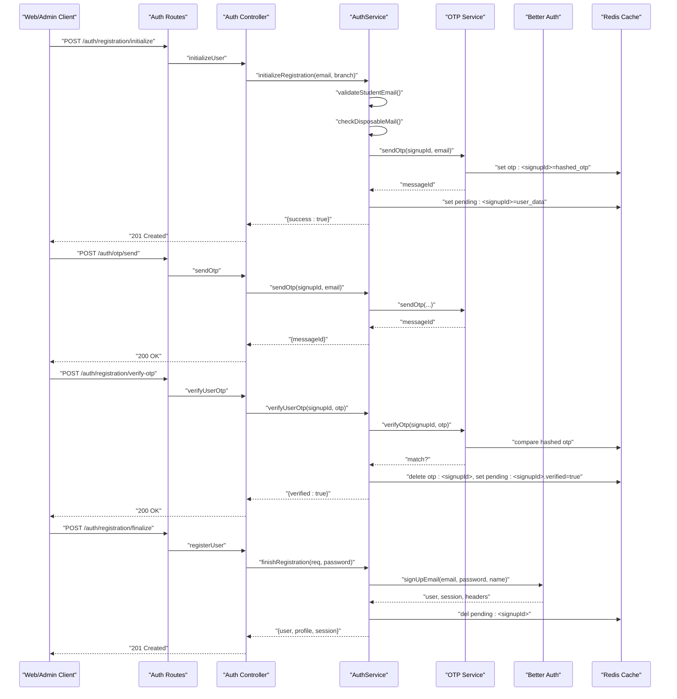
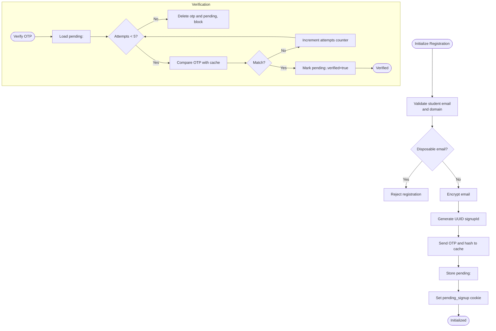
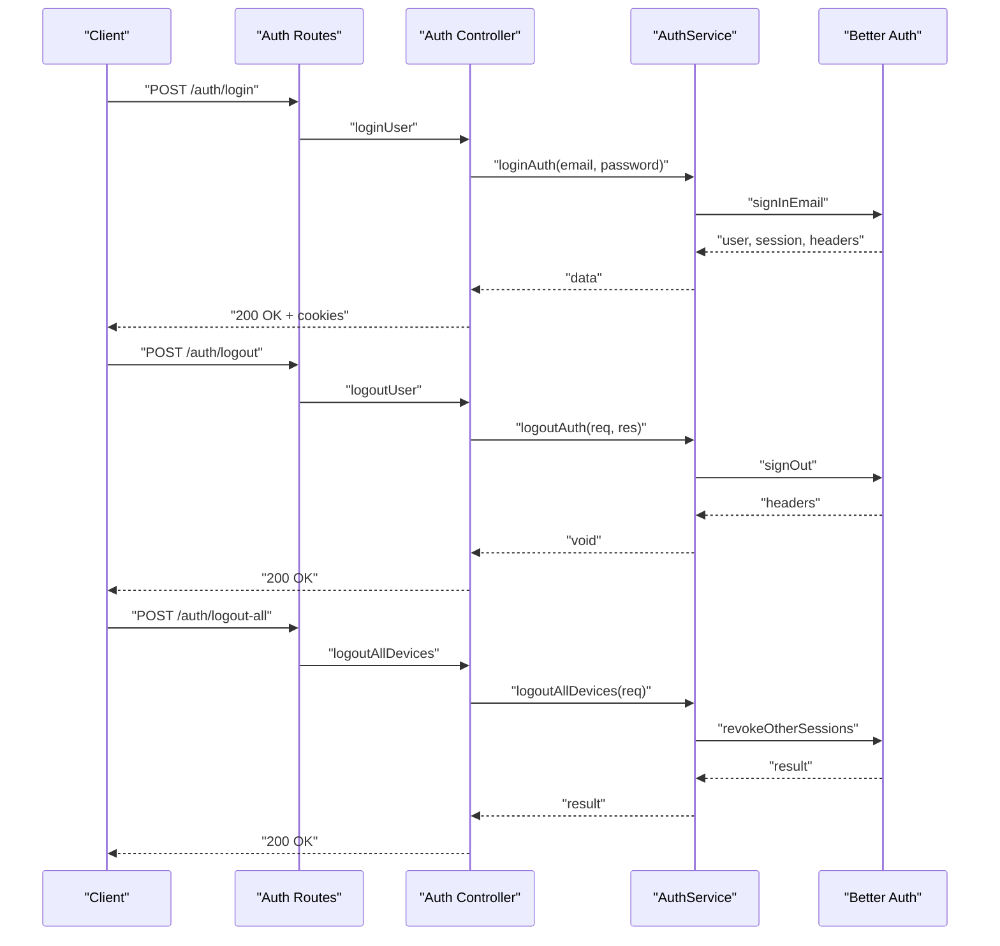
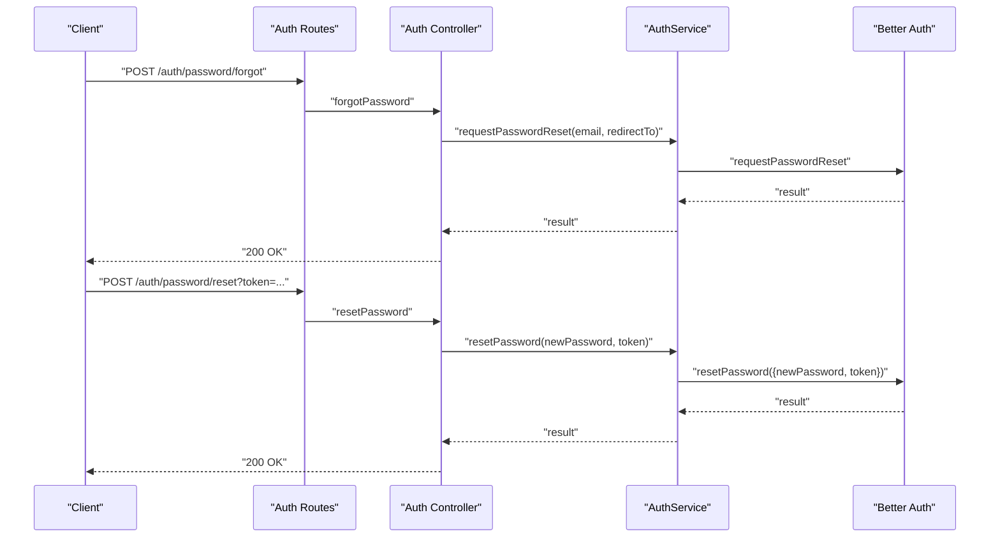
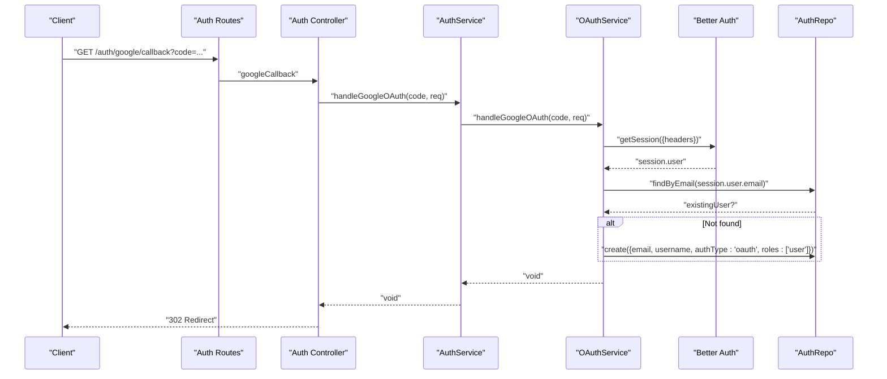
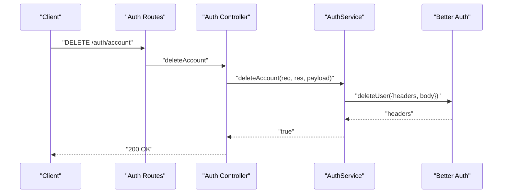
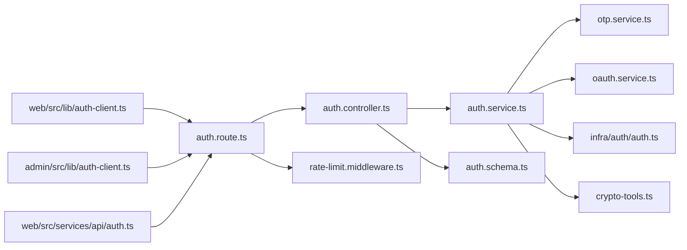

# Authentication Service

<cite>
**Referenced Files in This Document**
- [auth.route.ts](file://server/src/modules/auth/auth.route.ts)
- [auth.controller.ts](file://server/src/modules/auth/auth.controller.ts)
- [auth.service.ts](file://server/src/modules/auth/auth.service.ts)
- [auth.schema.ts](file://server/src/modules/auth/auth.schema.ts)
- [otp.service.ts](file://server/src/modules/auth/otp/otp.service.ts)
- [oauth.service.ts](file://server/src/modules/auth/oauth/oauth.service.ts)
- [auth.ts](file://server/src/infra/auth/auth.ts)
- [rate-limit.middleware.ts](file://server/src/core/middlewares/rate-limit.middleware.ts)
- [parse-headers.ts](file://server/src/lib/better-auth/parse-headers.ts)
- [crypto-tools.ts](file://server/src/lib/crypto-tools.ts)
- [auth-client.ts (web)](file://web/src/lib/auth-client.ts)
- [auth-client.ts (admin)](file://admin/src/lib/auth-client.ts)
- [auth.ts (web services)](file://web/src/services/api/auth.ts)
</cite>

## Table of Contents
1. [Introduction](#introduction)
2. [Project Structure](#project-structure)
3. [Core Components](#core-components)
4. [Architecture Overview](#architecture-overview)
5. [Detailed Component Analysis](#detailed-component-analysis)
6. [Dependency Analysis](#dependency-analysis)
7. [Performance Considerations](#performance-considerations)
8. [Troubleshooting Guide](#troubleshooting-guide)
9. [Conclusion](#conclusion)

## Introduction
This document describes the authentication service powering the Flick platform. It covers the complete authentication lifecycle: user registration with OTP verification, email validation, OAuth integration with Google, session management, password reset, logout, and account deletion. It also documents security controls such as disposable email validation, rate limiting, audit logging, and encryption of sensitive data like emails. The service integrates with the Better Auth library for session and account management, and exposes REST endpoints protected by rate limits and middleware.

## Project Structure
The authentication subsystem is organized around a modular Express route, a controller layer, a service layer, and reusable infrastructure components:
- Routes define the HTTP endpoints and apply rate limiting and authentication middleware.
- Controllers parse and validate requests, delegate to the service, and return standardized HTTP responses.
- Services orchestrate Better Auth APIs, OTP handling, OAuth callbacks, and audit logging.
- Infrastructure components include Better Auth configuration, OTP caching, crypto utilities, and header parsing.

**Diagram sources**
- [auth.route.ts](file://server/src/modules/auth/auth.route.ts#L1-L30)
- [auth.controller.ts](file://server/src/modules/auth/auth.controller.ts#L1-L171)
- [auth.service.ts](file://server/src/modules/auth/auth.service.ts#L1-L347)
- [otp.service.ts](file://server/src/modules/auth/otp/otp.service.ts#L1-L45)
- [oauth.service.ts](file://server/src/modules/auth/oauth/oauth.service.ts#L1-L44)
- [auth.ts](file://server/src/infra/auth/auth.ts#L1-L42)
- [rate-limit.middleware.ts](file://server/src/core/middlewares/rate-limit.middleware.ts#L1-L9)
- [parse-headers.ts](file://server/src/lib/better-auth/parse-headers.ts#L1-L15)
- [crypto-tools.ts](file://server/src/lib/crypto-tools.ts#L1-L99)
- [auth-client.ts (web)](file://web/src/lib/auth-client.ts#L1-L10)
- [auth-client.ts (admin)](file://admin/src/lib/auth-client.ts#L1-L11)
- [auth.ts (web services)](file://web/src/services/api/auth.ts#L1-L71)

**Section sources**
- [auth.route.ts](file://server/src/modules/auth/auth.route.ts#L1-L30)
- [auth.controller.ts](file://server/src/modules/auth/auth.controller.ts#L1-L171)
- [auth.service.ts](file://server/src/modules/auth/auth.service.ts#L1-L347)
- [auth.ts](file://server/src/infra/auth/auth.ts#L1-L42)

## Core Components
- Better Auth integration: Provides session management, cookies, email/password sign-up/sign-in, password reset, and OAuth with Google.
- Registration pipeline: Multi-step process with pending user sessions, OTP sending/verification, and finalization into a Better Auth user.
- OTP service: Generates, hashes, stores, and verifies OTPs using Redis cache.
- OAuth service: Handles Google OAuth callback and creates Better Auth users when missing.
- Security utilities: Disposable email validation, rate limiting, audit logging, and encryption of emails.
- Client integrations: React clients for web and admin use Better Auth’s client SDK to communicate with server endpoints.

**Section sources**
- [auth.service.ts](file://server/src/modules/auth/auth.service.ts#L31-L106)
- [otp.service.ts](file://server/src/modules/auth/otp/otp.service.ts#L1-L45)
- [oauth.service.ts](file://server/src/modules/auth/oauth/oauth.service.ts#L1-L44)
- [auth.ts](file://server/src/infra/auth/auth.ts#L1-L42)
- [rate-limit.middleware.ts](file://server/src/core/middlewares/rate-limit.middleware.ts#L1-L9)
- [crypto-tools.ts](file://server/src/lib/crypto-tools.ts#L52-L95)
- [auth-client.ts (web)](file://web/src/lib/auth-client.ts#L1-L10)
- [auth-client.ts (admin)](file://admin/src/lib/auth-client.ts#L1-L11)

## Architecture Overview
The authentication flow is centered on Better Auth while extending it with custom logic for student email validation, OTP-based registration, and audit trails. The server enforces rate limits per-authentication endpoints and forwards Better Auth cookie headers to clients. Clients use Better Auth’s React client to call server endpoints.

**Diagram sources**
- [auth.route.ts](file://server/src/modules/auth/auth.route.ts#L13-L15)
- [auth.controller.ts](file://server/src/modules/auth/auth.controller.ts#L104-L121)
- [auth.service.ts](file://server/src/modules/auth/auth.service.ts#L32-L106)
- [otp.service.ts](file://server/src/modules/auth/otp/otp.service.ts#L8-L31)
- [auth.ts](file://server/src/infra/auth/auth.ts#L17-L25)

## Detailed Component Analysis

### Registration Pipeline (Email/Password)
- Initialize registration:
  - Validates student email format and domain.
  - Checks for disposable email domains.
  - Encrypts the email and stores a pending user session with a UUID-based signupId.
  - Sends OTP and stores hashed OTP in cache with TTL.
  - Sets a pending_signup cookie for the client.
- Verify OTP:
  - Enforces a maximum attempt count and clears OTP and pending entries on failure.
  - Marks the pending user as verified upon success.
- Finalize registration:
  - Decrypts the stored email and creates a Better Auth user via sign-up.
  - Creates a user profile and forwards Better Auth cookie headers to the client.
  - Records audit events.

**Diagram sources**
- [auth.service.ts](file://server/src/modules/auth/auth.service.ts#L32-L106)
- [auth.service.ts](file://server/src/modules/auth/auth.service.ts#L108-L151)
- [otp.service.ts](file://server/src/modules/auth/otp/otp.service.ts#L8-L41)
- [crypto-tools.ts](file://server/src/lib/crypto-tools.ts#L60-L95)

**Section sources**
- [auth.service.ts](file://server/src/modules/auth/auth.service.ts#L32-L106)
- [auth.service.ts](file://server/src/modules/auth/auth.service.ts#L108-L151)
- [otp.service.ts](file://server/src/modules/auth/otp/otp.service.ts#L1-L45)
- [auth.schema.ts](file://server/src/modules/auth/auth.schema.ts#L22-L36)
- [auth.ts](file://server/src/infra/auth/auth.ts#L17-L25)

### Login/Logout and Session Management
- Login:
  - Calls Better Auth sign-in with email/password.
  - Forwards Better Auth cookie headers to the client.
  - Logs audit event.
- Logout:
  - Revokes current session via Better Auth sign-out.
  - Forwards cookie removal headers.
  - Logs audit event.
- Logout from all devices:
  - Revokes other sessions via Better Auth revoke API.
  - Logs audit event.

**Diagram sources**
- [auth.route.ts](file://server/src/modules/auth/auth.route.ts#L9-L27)
- [auth.controller.ts](file://server/src/modules/auth/auth.controller.ts#L8-L28)
- [auth.controller.ts](file://server/src/modules/auth/auth.controller.ts#L148-L151)
- [auth.service.ts](file://server/src/modules/auth/auth.service.ts#L199-L229)
- [auth.service.ts](file://server/src/modules/auth/auth.service.ts#L289-L301)
- [auth.ts](file://server/src/infra/auth/auth.ts#L26-L37)

**Section sources**
- [auth.controller.ts](file://server/src/modules/auth/auth.controller.ts#L8-L28)
- [auth.controller.ts](file://server/src/modules/auth/auth.controller.ts#L24-L28)
- [auth.controller.ts](file://server/src/modules/auth/auth.controller.ts#L148-L151)
- [auth.service.ts](file://server/src/modules/auth/auth.service.ts#L199-L229)
- [auth.service.ts](file://server/src/modules/auth/auth.service.ts#L289-L301)

### Password Reset
- Forgot password:
  - Initiates password reset via Better Auth with optional redirect URL.
  - Records audit event.
- Reset password:
  - Accepts a new password and optional token (via body or query).
  - Calls Better Auth reset API.
  - Records audit event.

**Diagram sources**
- [auth.route.ts](file://server/src/modules/auth/auth.route.ts#L17-L18)
- [auth.controller.ts](file://server/src/modules/auth/auth.controller.ts#L129-L146)
- [auth.service.ts](file://server/src/modules/auth/auth.service.ts#L257-L287)
- [auth.ts](file://server/src/infra/auth/auth.ts#L17-L25)

**Section sources**
- [auth.controller.ts](file://server/src/modules/auth/auth.controller.ts#L129-L146)
- [auth.service.ts](file://server/src/modules/auth/auth.service.ts#L257-L287)
- [auth.schema.ts](file://server/src/modules/auth/auth.schema.ts#L42-L56)

### OAuth with Google
- Google OAuth callback:
  - Exchanges authorization code for tokens, retrieves user info via Better Auth session.
  - If no existing user, creates a new user with OAuth attributes.
  - Records audit event.

**Diagram sources**
- [auth.route.ts](file://server/src/modules/auth/auth.route.ts#L16)
- [auth.controller.ts](file://server/src/modules/auth/auth.controller.ts#L98-L102)
- [auth.service.ts](file://server/src/modules/auth/auth.service.ts#L343)
- [oauth.service.ts](file://server/src/modules/auth/oauth/oauth.service.ts#L1-L44)
- [auth.ts](file://server/src/infra/auth/auth.ts#L20-L25)

**Section sources**
- [auth.controller.ts](file://server/src/modules/auth/auth.controller.ts#L98-L102)
- [oauth.service.ts](file://server/src/modules/auth/oauth/oauth.service.ts#L1-L44)
- [auth.ts](file://server/src/infra/auth/auth.ts#L20-L25)

### Account Deletion
- Deletes the authenticated user via Better Auth and forwards cookie headers.
- Records audit event.

**Diagram sources**
- [auth.route.ts](file://server/src/modules/auth/auth.route.ts#L25)
- [auth.controller.ts](file://server/src/modules/auth/auth.controller.ts#L123-L127)
- [auth.service.ts](file://server/src/modules/auth/auth.service.ts#L231-L255)
- [auth.ts](file://server/src/infra/auth/auth.ts#L17-L25)

**Section sources**
- [auth.controller.ts](file://server/src/modules/auth/auth.controller.ts#L123-L127)
- [auth.service.ts](file://server/src/modules/auth/auth.service.ts#L231-L255)
- [auth.schema.ts](file://server/src/modules/auth/auth.schema.ts#L58-L62)

### Security Measures
- Disposable email validation:
  - Rejects registrations using disposable email domains.
- Rate limiting:
  - Applies per-endpoint rate limits to authentication routes.
- Audit logging:
  - Records key actions (login, logout, password reset, account creation, etc.) with entity and metadata.
- Encrypted email storage:
  - Emails are encrypted at rest during pending registration and decrypted only during finalization.
- Cookie management:
  - Better Auth manages session cookies; server forwards set-cookie headers to clients.

**Section sources**
- [auth.service.ts](file://server/src/modules/auth/auth.service.ts#L333-L339)
- [rate-limit.middleware.ts](file://server/src/core/middlewares/rate-limit.middleware.ts#L1-L9)
- [auth.ts](file://server/src/infra/auth/auth.ts#L26-L37)
- [crypto-tools.ts](file://server/src/lib/crypto-tools.ts#L60-L95)
- [auth.service.ts](file://server/src/modules/auth/auth.service.ts#L199-L229)

## Dependency Analysis
The authentication service composes several layers:
- Routes depend on controllers and rate-limit middleware.
- Controllers depend on services and Zod schemas.
- Services depend on Better Auth, OTP service, OAuth service, crypto tools, and Redis cache.
- Better Auth depends on the database adapter and environment configuration.
- Clients depend on Better Auth client SDK and call server endpoints.

**Diagram sources**
- [auth.route.ts](file://server/src/modules/auth/auth.route.ts#L1-L30)
- [auth.controller.ts](file://server/src/modules/auth/auth.controller.ts#L1-L171)
- [auth.service.ts](file://server/src/modules/auth/auth.service.ts#L1-L347)
- [otp.service.ts](file://server/src/modules/auth/otp/otp.service.ts#L1-L45)
- [oauth.service.ts](file://server/src/modules/auth/oauth/oauth.service.ts#L1-L44)
- [auth.ts](file://server/src/infra/auth/auth.ts#L1-L42)
- [crypto-tools.ts](file://server/src/lib/crypto-tools.ts#L1-L99)
- [rate-limit.middleware.ts](file://server/src/core/middlewares/rate-limit.middleware.ts#L1-L9)
- [auth-client.ts (web)](file://web/src/lib/auth-client.ts#L1-L10)
- [auth-client.ts (admin)](file://admin/src/lib/auth-client.ts#L1-L11)
- [auth.ts (web services)](file://web/src/services/api/auth.ts#L1-L71)

**Section sources**
- [auth.route.ts](file://server/src/modules/auth/auth.route.ts#L1-L30)
- [auth.controller.ts](file://server/src/modules/auth/auth.controller.ts#L1-L171)
- [auth.service.ts](file://server/src/modules/auth/auth.service.ts#L1-L347)

## Performance Considerations
- OTP caching TTL: OTPs are stored with a short TTL to reduce stale data and memory pressure.
- Session cookie caching: Better Auth cookie cache reduces server load for session validation.
- Rate limiting: Prevents brute-force attacks and protects downstream services.
- Encryption overhead: AES-GCM and HMAC operations are fast but should be monitored under high load.

[No sources needed since this section provides general guidance]

## Troubleshooting Guide
Common issues and resolutions:
- Invalid or expired signup session:
  - Symptom: Forbidden error when verifying OTP or finalizing registration.
  - Cause: Missing or expired pending user session.
  - Resolution: Re-initiate registration to obtain a new signupId and resend OTP.
- Too many OTP attempts:
  - Symptom: Forbidden error after repeated invalid OTP entries.
  - Cause: Attempt limit reached.
  - Resolution: Wait for cooldown or re-initiate registration.
- Missing pending_signup cookie:
  - Symptom: Bad request indicating signupId is required.
  - Cause: Client did not receive or forward the cookie.
  - Resolution: Ensure cookie policy and SameSite/Secure flags are configured and that the client sends the cookie.
- Disposable email rejected:
  - Symptom: Bad request for disposable email.
  - Resolution: Use a non-disposable email domain.
- Login failures:
  - Symptom: Unauthorized errors.
  - Resolution: Confirm credentials and Better Auth configuration; check forwarded cookies.
- Rate limit exceeded:
  - Symptom: 429 responses.
  - Resolution: Reduce request frequency or adjust rate limiter configuration.

**Section sources**
- [auth.controller.ts](file://server/src/modules/auth/auth.controller.ts#L47-L96)
- [auth.service.ts](file://server/src/modules/auth/auth.service.ts#L108-L151)
- [auth.service.ts](file://server/src/modules/auth/auth.service.ts#L333-L339)
- [rate-limit.middleware.ts](file://server/src/core/middlewares/rate-limit.middleware.ts#L1-L9)

## Conclusion
The Flick authentication service provides a robust, layered approach to user management. It leverages Better Auth for session and account lifecycle operations while adding custom validations, OTP-based registration, OAuth integration, and strong security safeguards. The modular design ensures maintainability and extensibility, with clear separation between routes, controllers, services, and infrastructure.