# Backend Services

<cite>
**Referenced Files in This Document**
- [server.ts](file://server/src/server.ts)
- [app.ts](file://server/src/app.ts)
- [auth.service.ts](file://server/src/modules/auth/auth.service.ts)
- [auth.repo.ts](file://server/src/modules/auth/auth.repo.ts)
- [user.service.ts](file://server/src/modules/user/user.service.ts)
- [user.repo.ts](file://server/src/modules/user/user.repo.ts)
- [post.service.ts](file://server/src/modules/post/post.service.ts)
- [post.repo.ts](file://server/src/modules/post/post.repo.ts)
- [comment.service.ts](file://server/src/modules/comment/comment.service.ts)
- [comment.repo.ts](file://server/src/modules/comment/comment.repo.ts)
- [vote.service.ts](file://server/src/modules/vote/vote.service.ts)
- [bookmark.service.ts](file://server/src/modules/bookmark/bookmark.service.ts)
- [notification.service.ts](file://server/src/modules/notification/notification.service.ts)
- [content-report.service.ts](file://server/src/modules/content-report/content-report.service.ts)
- [transactions.ts](file://server/src/infra/db/transactions.ts)
- [rbac.ts](file://server/src/core/security/rbac.ts)
- [record-audit.ts](file://server/src/lib/record-audit.ts)
- [env.ts](file://server/src/config/env.ts)
- [cors.ts](file://server/src/config/cors.ts)
- [security.ts](file://server/src/config/security.ts)
- [roles.ts](file://server/src/config/roles.ts)
- [index.ts](file://server/src/routes/index.ts)
- [health.routes.ts](file://server/src/routes/health.routes.ts)
- [audit.service.ts](file://server/src/modules/audit/audit.service.ts)
- [audit.repo.ts](file://server/src/modules/audit/audit.repo.ts)
- [audit.context.ts](file://server/src/modules/audit/audit-context.ts)
</cite>

## Table of Contents
1. [Introduction](#introduction)
2. [Project Structure](#project-structure)
3. [Core Components](#core-components)
4. [Architecture Overview](#architecture-overview)
5. [Detailed Component Analysis](#detailed-component-analysis)
6. [Dependency Analysis](#dependency-analysis)
7. [Performance Considerations](#performance-considerations)
8. [Troubleshooting Guide](#troubleshooting-guide)
9. [Conclusion](#conclusion)

## Introduction
This document describes the backend services of the Flick server package. It explains the service layer architecture, dependency injection patterns, and business logic encapsulation across authentication, user management, post management, comment system, voting mechanism, bookmark functionality, notification system, and content moderation. It also covers authentication flow, session management, role-based access control, security measures, error handling, transaction management, and audit logging.

## Project Structure
The server is organized around a modular service layer under modules/, with infrastructure concerns in infra/, core utilities in core/, and configuration in config/. The application bootstraps via server.ts and Express initialization in app.ts, registers routes, applies security, and wires up middleware and sockets.

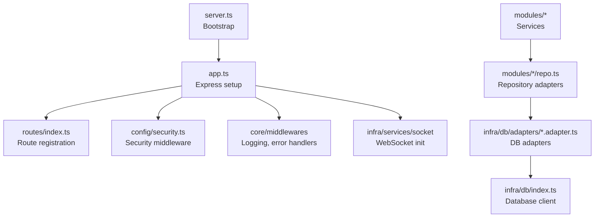

**Diagram sources**
- [server.ts](file://server/src/server.ts#L1-L22)
- [app.ts](file://server/src/app.ts#L1-L33)
- [index.ts](file://server/src/routes/index.ts#L1-L200)
- [security.ts](file://server/src/config/security.ts#L1-L200)

**Section sources**
- [server.ts](file://server/src/server.ts#L1-L22)
- [app.ts](file://server/src/app.ts#L1-L33)

## Core Components
- Service Layer: Each module exposes a singleton service class orchestrating business logic, delegating persistence to repositories, and invoking infrastructure services (cache, mail, sockets).
- Repository Pattern: Repositories abstract database operations and caching keys, exposing CachedRead/Write and Read/Write variants.
- Infrastructure: Transactions, caching, mail, rate limiting, and sockets are provided via infra/services and infra/db.
- Security: CORS, CSRF protection, rate limiting, RBAC utilities, and Better Auth integration.
- Observability: Audit logging via record-audit and observability context.

**Section sources**
- [auth.service.ts](file://server/src/modules/auth/auth.service.ts#L21-L347)
- [user.service.ts](file://server/src/modules/user/user.service.ts#L7-L61)
- [post.service.ts](file://server/src/modules/post/post.service.ts#L7-L263)
- [comment.service.ts](file://server/src/modules/comment/comment.service.ts#L9-L195)
- [vote.service.ts](file://server/src/modules/vote/vote.service.ts#L12-L184)
- [bookmark.service.ts](file://server/src/modules/bookmark/bookmark.service.ts#L6-L77)
- [notification.service.ts](file://server/src/modules/notification/notification.service.ts#L28-L209)
- [content-report.service.ts](file://server/src/modules/content-report/content-report.service.ts#L8-L159)
- [auth.repo.ts](file://server/src/modules/auth/auth.repo.ts#L6-L35)
- [user.repo.ts](file://server/src/modules/user/user.repo.ts#L6-L41)
- [post.repo.ts](file://server/src/modules/post/post.repo.ts#L6-L97)
- [transactions.ts](file://server/src/infra/db/transactions.ts#L4-L20)
- [rbac.ts](file://server/src/core/security/rbac.ts#L4-L15)
- [record-audit.ts](file://server/src/lib/record-audit.ts#L4-L20)

## Architecture Overview
The service layer follows a layered pattern:
- Controllers receive requests and delegate to Services.
- Services encapsulate business rules, enforce access control, and orchestrate repositories and infrastructure.
- Repositories abstract DB and cache operations.
- Infrastructure services (cache, mail, sockets) are injected via imports and global singletons.

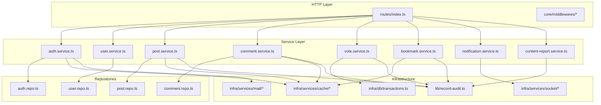

**Diagram sources**
- [index.ts](file://server/src/routes/index.ts#L1-L200)
- [auth.service.ts](file://server/src/modules/auth/auth.service.ts#L1-L347)
- [user.service.ts](file://server/src/modules/user/user.service.ts#L1-L61)
- [post.service.ts](file://server/src/modules/post/post.service.ts#L1-L263)
- [comment.service.ts](file://server/src/modules/comment/comment.service.ts#L1-L195)
- [vote.service.ts](file://server/src/modules/vote/vote.service.ts#L1-L184)
- [bookmark.service.ts](file://server/src/modules/bookmark/bookmark.service.ts#L1-L77)
- [notification.service.ts](file://server/src/modules/notification/notification.service.ts#L1-L209)
- [content-report.service.ts](file://server/src/modules/content-report/content-report.service.ts#L1-L159)
- [auth.repo.ts](file://server/src/modules/auth/auth.repo.ts#L1-L35)
- [user.repo.ts](file://server/src/modules/user/user.repo.ts#L1-L41)
- [post.repo.ts](file://server/src/modules/post/post.repo.ts#L1-L97)
- [transactions.ts](file://server/src/infra/db/transactions.ts#L1-L20)
- [record-audit.ts](file://server/src/lib/record-audit.ts#L1-L20)

## Detailed Component Analysis

### Authentication Service
Responsibilities:
- Registration flow: validate student email, resolve college, encrypt email, store pending user in cache, set session cookie, send OTP.
- OTP verification: enforce retry limits, mark pending user verified.
- Finish registration: create Better Auth account, create user profile, forward cookies, audit.
- Login/logout/delete/reset/password management via Better Auth API.
- OAuth and OTP sub-services are delegated to dedicated modules.

Interfaces and Dependencies:
- Uses AuthRepo for reads/writes, Better Auth client, Redis cache, crypto tools, disposable email validator, audit logging.

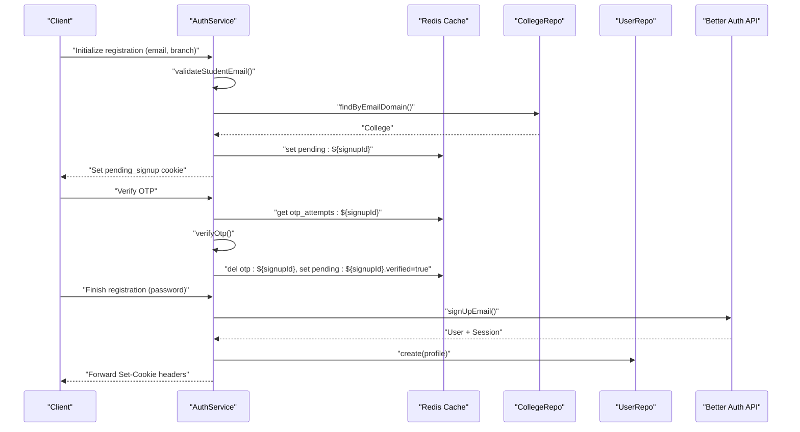

**Diagram sources**
- [auth.service.ts](file://server/src/modules/auth/auth.service.ts#L32-L197)
- [auth.repo.ts](file://server/src/modules/auth/auth.repo.ts#L6-L35)
- [user.repo.ts](file://server/src/modules/user/user.repo.ts#L33-L37)

**Section sources**
- [auth.service.ts](file://server/src/modules/auth/auth.service.ts#L21-L347)
- [auth.repo.ts](file://server/src/modules/auth/auth.repo.ts#L6-L35)

### User Management Service
Responsibilities:
- Fetch user by ID/profile by authId.
- Search users leveraging AuthRepo search.
- Accept terms and record audit.

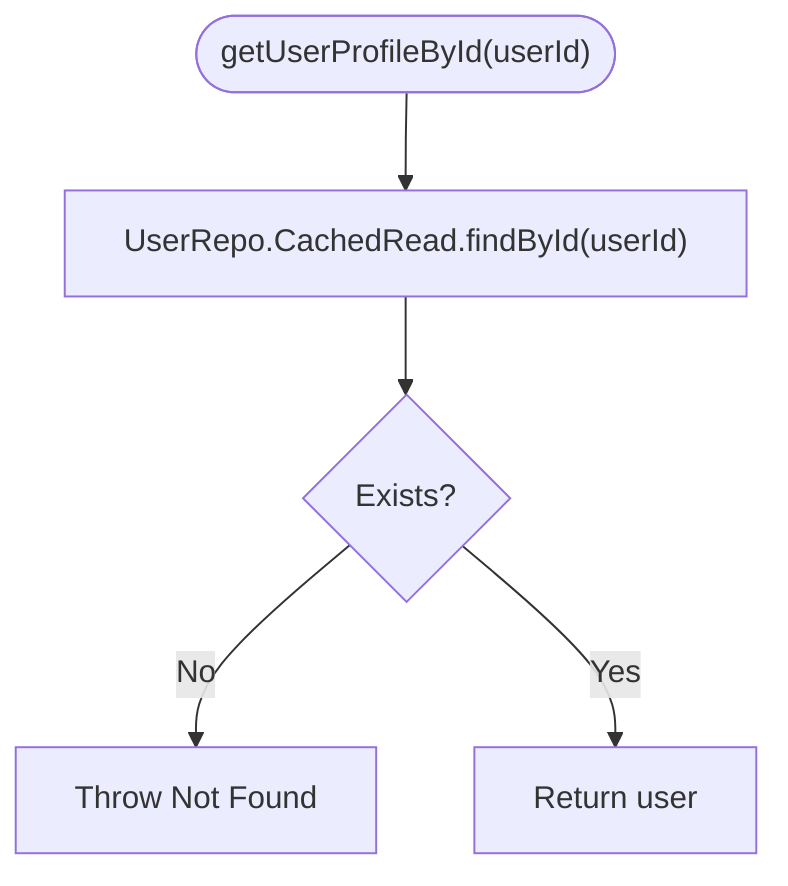

**Diagram sources**
- [user.service.ts](file://server/src/modules/user/user.service.ts#L8-L25)

**Section sources**
- [user.service.ts](file://server/src/modules/user/user.service.ts#L7-L61)
- [user.repo.ts](file://server/src/modules/user/user.repo.ts#L6-L41)

### Post Management Service
Responsibilities:
- Create/update/delete posts with validation and ownership checks.
- Retrieve posts with privacy controls (college-only visibility).
- Paginated listing with counts and metadata.
- Increment views with observability context.

Access Control:
- Unauthorized/Forbidden thrown for missing auth or mismatched college.

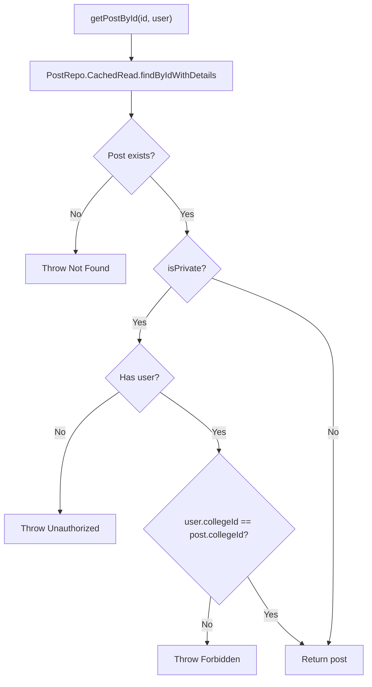

**Diagram sources**
- [post.service.ts](file://server/src/modules/post/post.service.ts#L47-L77)
- [post.repo.ts](file://server/src/modules/post/post.repo.ts#L14-L15)

**Section sources**
- [post.service.ts](file://server/src/modules/post/post.service.ts#L7-L263)
- [post.repo.ts](file://server/src/modules/post/post.repo.ts#L6-L97)

### Comment System Service
Responsibilities:
- List comments per post with pagination.
- Create/update/delete comments with authorship checks.
- Invalidate caches for post/comments/version keys upon mutations.
- Retrieve individual comment by ID.

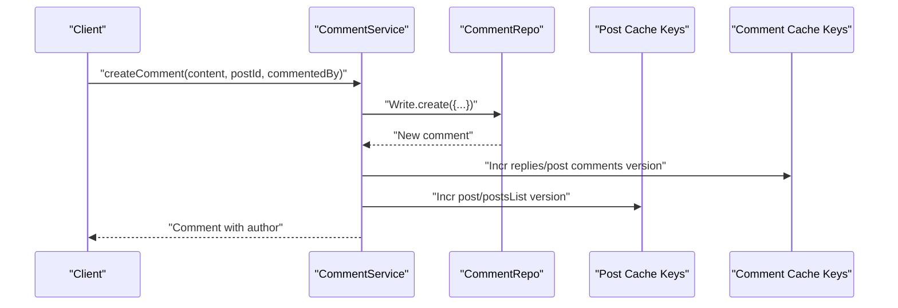

**Diagram sources**
- [comment.service.ts](file://server/src/modules/comment/comment.service.ts#L48-L92)
- [comment.repo.ts](file://server/src/modules/comment/comment.repo.ts#L1-L200)

**Section sources**
- [comment.service.ts](file://server/src/modules/comment/comment.service.ts#L9-L195)

### Voting Mechanism Service
Responsibilities:
- Create, patch, and delete votes with atomicity via runTransaction.
- Adjust target owner karma accordingly.
- Audit vote actions with metadata.

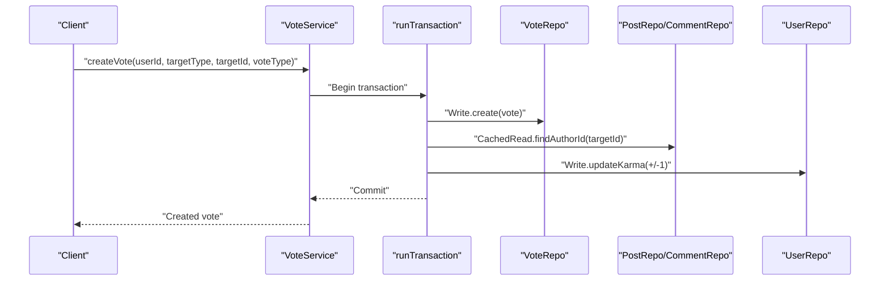

**Diagram sources**
- [vote.service.ts](file://server/src/modules/vote/vote.service.ts#L13-L69)
- [transactions.ts](file://server/src/infra/db/transactions.ts#L4-L20)

**Section sources**
- [vote.service.ts](file://server/src/modules/vote/vote.service.ts#L12-L184)
- [transactions.ts](file://server/src/infra/db/transactions.ts#L4-L20)

### Bookmark Functionality Service
Responsibilities:
- Create/get/delete user bookmarks.
- Prevent duplicates and return appropriate errors.
- Retrieve user bookmarked posts.

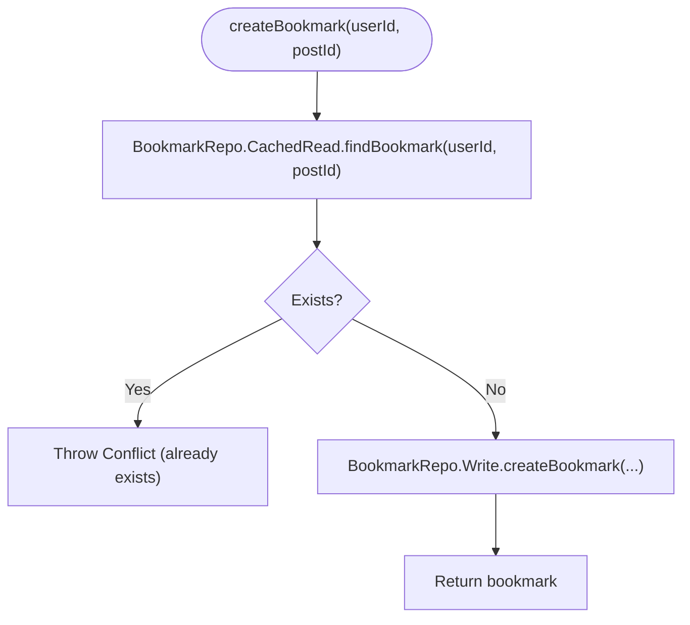

**Diagram sources**
- [bookmark.service.ts](file://server/src/modules/bookmark/bookmark.service.ts#L7-L30)

**Section sources**
- [bookmark.service.ts](file://server/src/modules/bookmark/bookmark.service.ts#L6-L77)

### Notification System
Responsibilities:
- Bundle multiple notifications by receiver/post/type/content.
- Emit real-time notifications via WebSocket if recipient is online.
- Persist notifications to DB and return paginated results.

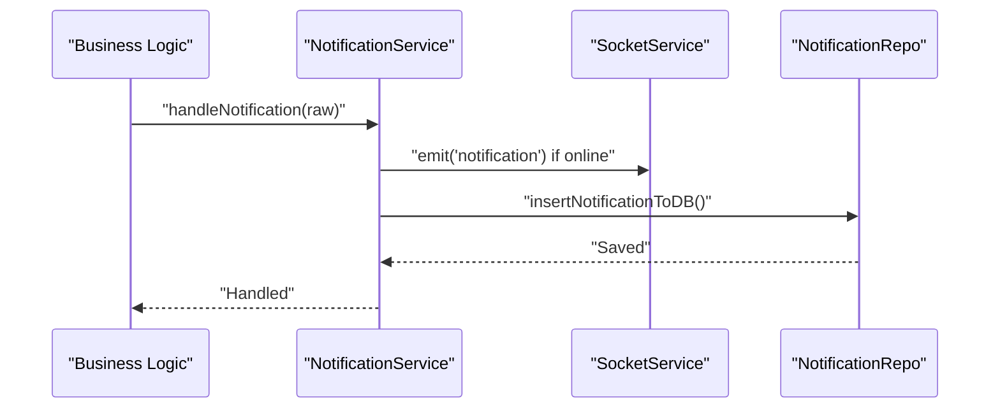

**Diagram sources**
- [notification.service.ts](file://server/src/modules/notification/notification.service.ts#L124-L140)

**Section sources**
- [notification.service.ts](file://server/src/modules/notification/notification.service.ts#L28-L209)

### Content Moderation Pipeline
Responsibilities:
- Create content reports with sampling logs.
- Filter and paginate reports.
- Update report status and bulk delete.
- Audit report creation/status changes.

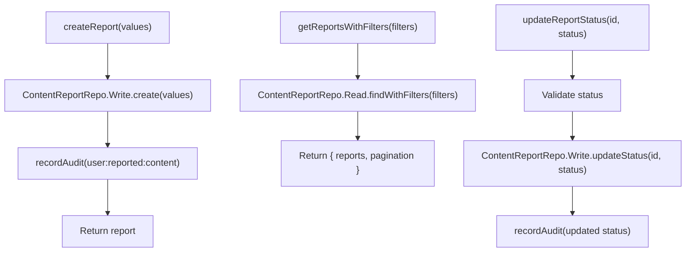

**Diagram sources**
- [content-report.service.ts](file://server/src/modules/content-report/content-report.service.ts#L9-L110)

**Section sources**
- [content-report.service.ts](file://server/src/modules/content-report/content-report.service.ts#L8-L159)

### Audit Logging and Observability
- record-audit enriches entries with device info from observability context and buffers them for later flush.
- Audit service aggregates and persists audit entries.

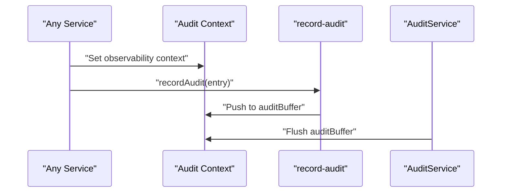

**Diagram sources**
- [record-audit.ts](file://server/src/lib/record-audit.ts#L4-L20)
- [audit.service.ts](file://server/src/modules/audit/audit.service.ts#L1-L200)

**Section sources**
- [record-audit.ts](file://server/src/lib/record-audit.ts#L4-L20)
- [audit.service.ts](file://server/src/modules/audit/audit.service.ts#L1-L200)

## Dependency Analysis
- Service-to-Repo Coupling: Tight and intentional; services depend on repo APIs to abstract DB/cache.
- Transaction Management: Centralized via runTransaction; services requiring atomicity wrap operations inside it.
- Security and RBAC: getUserPermissions composes role-based permissions; services enforce access checks.
- Audit: record-audit is invoked across services to capture actions and metadata.

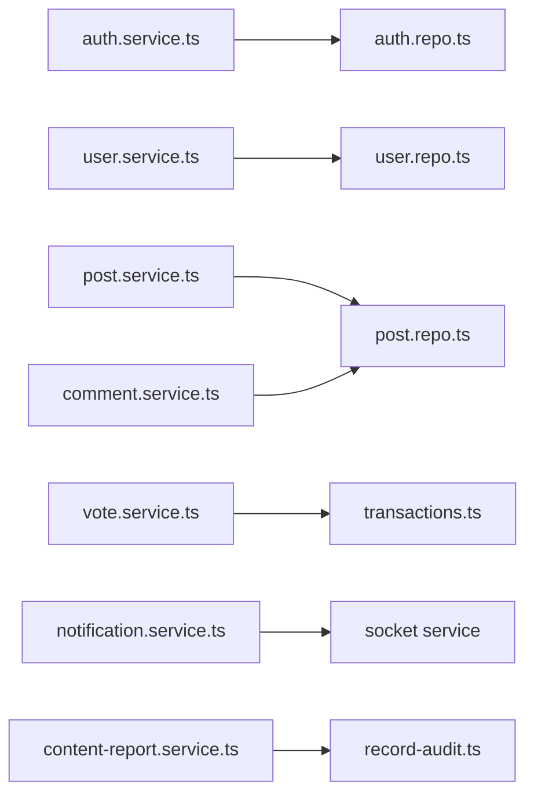

**Diagram sources**
- [auth.service.ts](file://server/src/modules/auth/auth.service.ts#L1-L347)
- [user.service.ts](file://server/src/modules/user/user.service.ts#L1-L61)
- [post.service.ts](file://server/src/modules/post/post.service.ts#L1-L263)
- [comment.service.ts](file://server/src/modules/comment/comment.service.ts#L1-L195)
- [vote.service.ts](file://server/src/modules/vote/vote.service.ts#L1-L184)
- [transactions.ts](file://server/src/infra/db/transactions.ts#L1-L20)
- [notification.service.ts](file://server/src/modules/notification/notification.service.ts#L1-L209)
- [content-report.service.ts](file://server/src/modules/content-report/content-report.service.ts#L1-L159)
- [record-audit.ts](file://server/src/lib/record-audit.ts#L1-L20)

**Section sources**
- [rbac.ts](file://server/src/core/security/rbac.ts#L4-L15)
- [roles.ts](file://server/src/config/roles.ts#L1-L200)

## Performance Considerations
- Caching: Repositories use cached wrappers keyed by identifiers and query parameters to reduce DB load.
- Pagination: Services compute totals and page metadata to avoid over-fetching.
- Transactions: Vote operations are wrapped in runTransaction to minimize race conditions and maintain consistency.
- Logging Sampling: Content reporting uses shouldSampleLog to reduce noise while preserving insight.

[No sources needed since this section provides general guidance]

## Troubleshooting Guide
Common areas to inspect:
- Authentication failures: Validate email format, disposable email checks, OTP attempts, and Better Auth responses.
- Authorization errors: Verify user ownership checks in post/comment/vote services and privacy gates.
- Transaction failures: Ensure runTransaction wraps dependent writes and roll back on errors.
- Audit gaps: Confirm observability context is set and record-audit pushes entries to buffer.

**Section sources**
- [auth.service.ts](file://server/src/modules/auth/auth.service.ts#L108-L151)
- [post.service.ts](file://server/src/modules/post/post.service.ts#L125-L222)
- [comment.service.ts](file://server/src/modules/comment/comment.service.ts#L94-L180)
- [vote.service.ts](file://server/src/modules/vote/vote.service.ts#L19-L68)
- [record-audit.ts](file://server/src/lib/record-audit.ts#L4-L20)

## Conclusion
The Flick server implements a robust service layer with clear separation of concerns, strong security and audit practices, and scalable infrastructure integrations. Services encapsulate business logic, repositories abstract persistence, and infrastructure services provide caching, mail, and sockets. The architecture supports extensibility, reliability, and maintainability across core features like authentication, content management, engagement, and moderation.