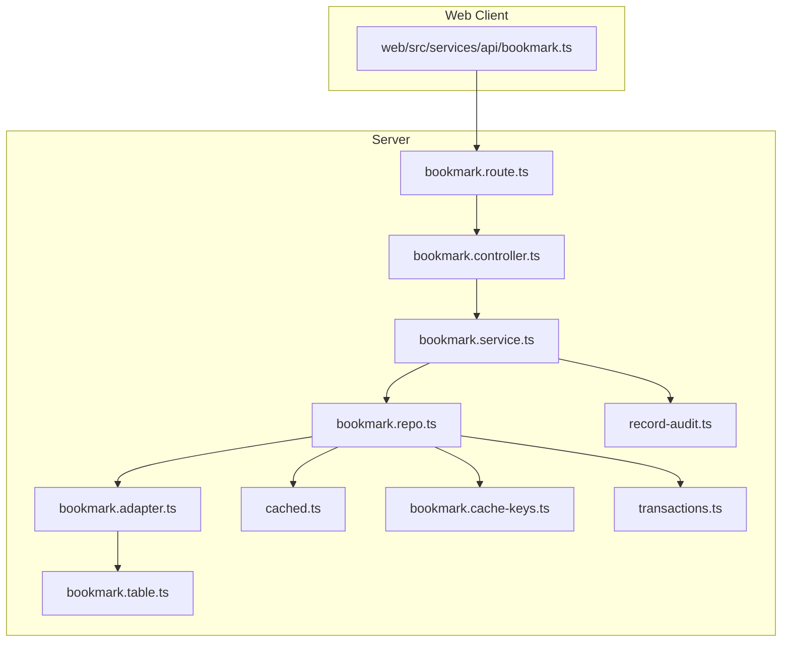
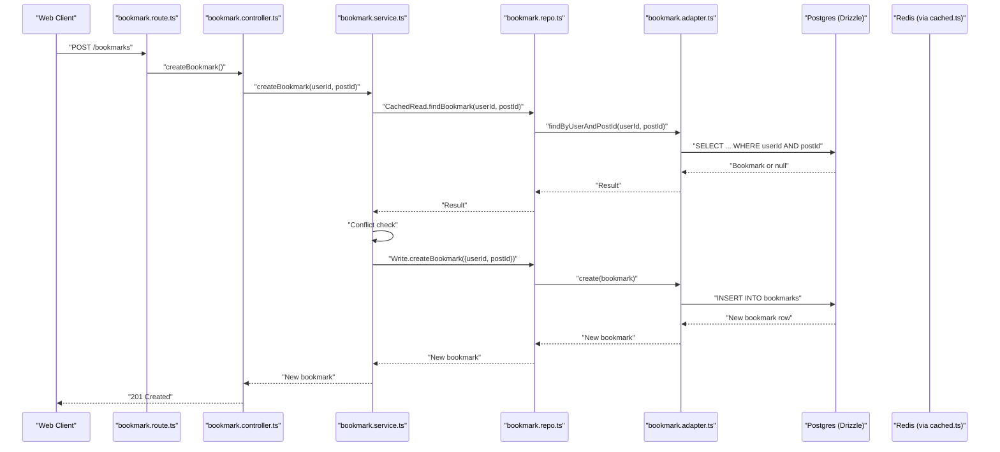
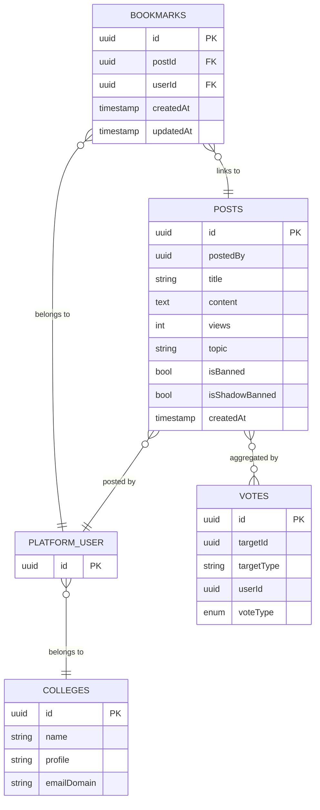
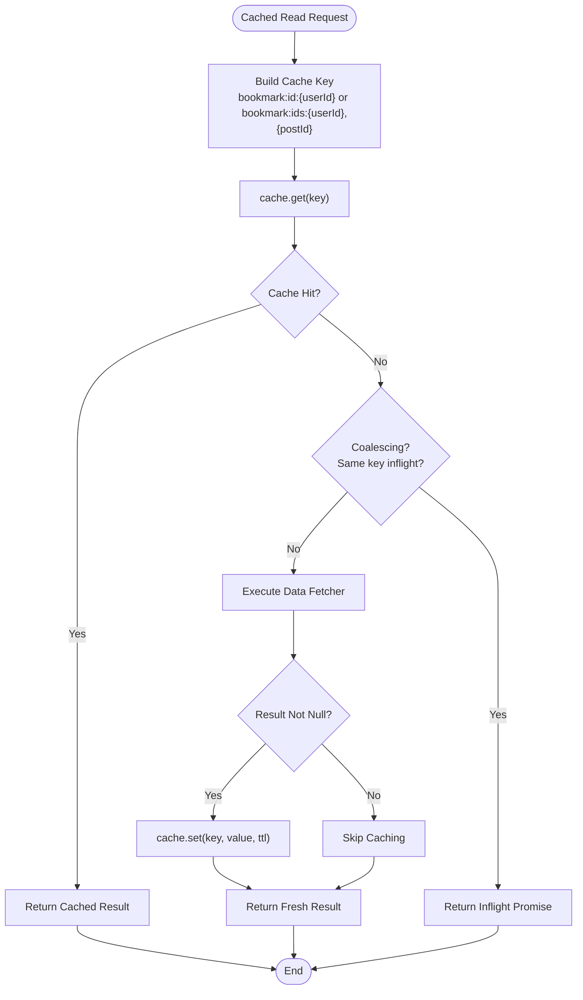
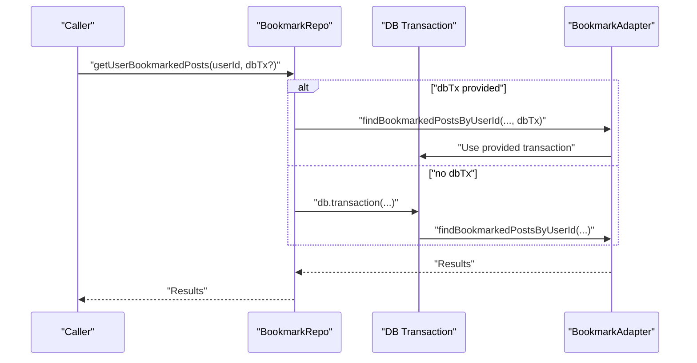
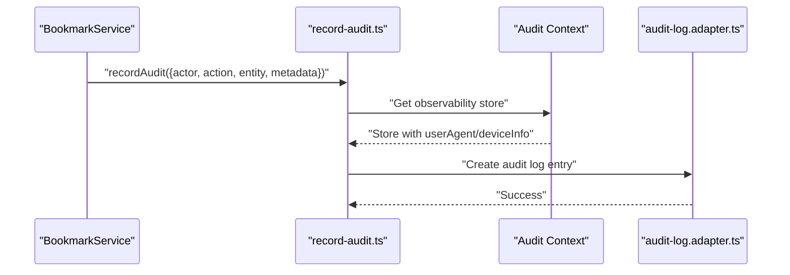
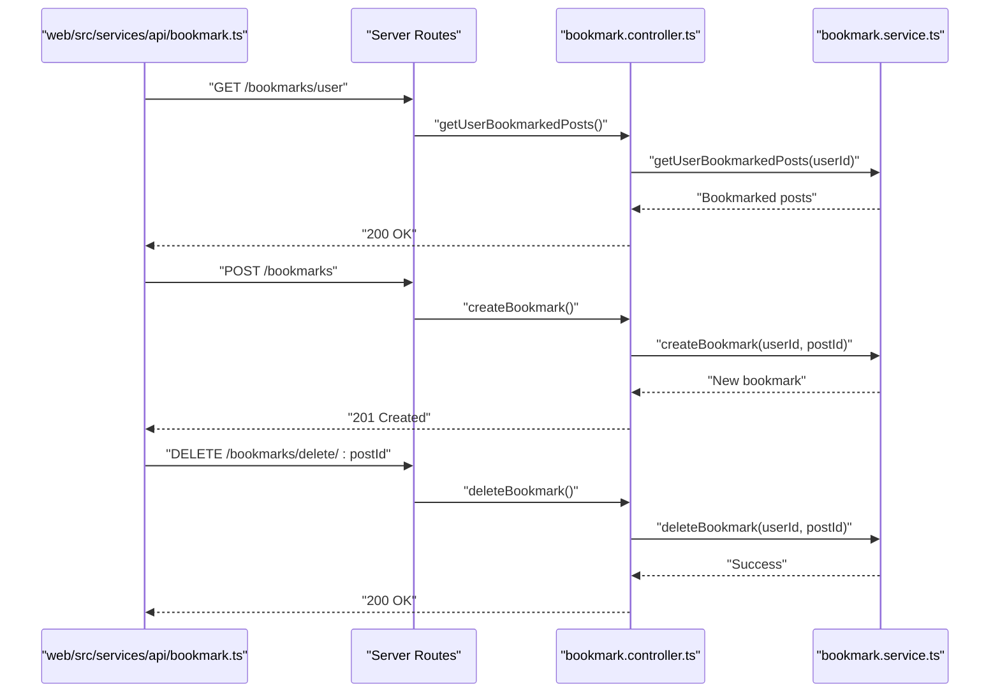
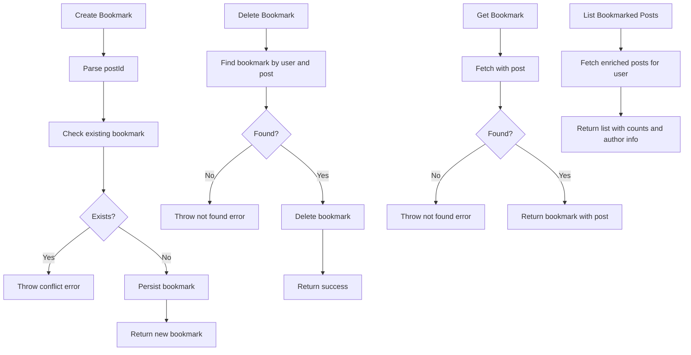
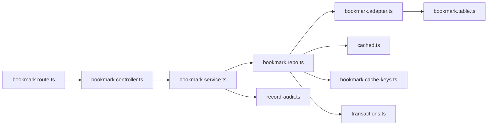

# Bookmark System

<cite>
**Referenced Files in This Document**
- [bookmark.controller.ts](file://server/src/modules/bookmark/bookmark.controller.ts)
- [bookmark.service.ts](file://server/src/modules/bookmark/bookmark.service.ts)
- [bookmark.repo.ts](file://server/src/modules/bookmark/bookmark.repo.ts)
- [bookmark.schema.ts](file://server/src/modules/bookmark/bookmark.schema.ts)
- [bookmark.route.ts](file://server/src/modules/bookmark/bookmark.route.ts)
- [bookmark.cache-keys.ts](file://server/src/modules/bookmark/bookmark.cache-keys.ts)
- [bookmark.adapter.ts](file://server/src/infra/db/adapters/bookmark.adapter.ts)
- [bookmark.table.ts](file://server/src/infra/db/tables/bookmark.table.ts)
- [cached.ts](file://server/src/lib/cached.ts)
- [record-audit.ts](file://server/src/lib/record-audit.ts)
- [transactions.ts](file://server/src/infra/db/transactions.ts)
- [audit-log.adapter.ts](file://server/src/infra/db/adapters/audit-log.adapter.ts)
- [audit-log.table.ts](file://server/src/infra/db/tables/audit-log.table.ts)
- [bookmark.ts](file://web/src/services/api/bookmark.ts)
- [IBookmark.ts](file://web/src/types/Bookmark.ts)
</cite>

## Table of Contents
1. [Introduction](#introduction)
2. [Project Structure](#project-structure)
3. [Core Components](#core-components)
4. [Architecture Overview](#architecture-overview)
5. [Detailed Component Analysis](#detailed-component-analysis)
6. [Dependency Analysis](#dependency-analysis)
7. [Performance Considerations](#performance-considerations)
8. [Troubleshooting Guide](#troubleshooting-guide)
9. [Conclusion](#conclusion)
10. [Appendices](#appendices)

## Introduction
This document describes the Bookmark System for the Flick platform. It covers how users create, manage, and retrieve bookmarks for posts, how bookmarks persist and relate to users and posts, and how caching and transactions are used to optimize performance and ensure correctness. It also outlines the repository pattern used, audit logging for user interactions, and how the frontend integrates with the backend APIs.

## Project Structure
The bookmark feature is implemented as a modular server-side module with a clear separation of concerns:
- Routes define the HTTP endpoints for bookmark operations.
- Controllers handle request parsing and delegation to services.
- Services encapsulate business logic and integrate with repositories and auditing.
- Repositories abstract data access and caching strategies.
- Adapters and tables define persistence using Drizzle ORM.
- Frontend services expose bookmark APIs consumed by the web client.

**Diagram sources**
- [bookmark.route.ts](file://server/src/modules/bookmark/bookmark.route.ts#L1-L19)
- [bookmark.controller.ts](file://server/src/modules/bookmark/bookmark.controller.ts#L1-L47)
- [bookmark.service.ts](file://server/src/modules/bookmark/bookmark.service.ts#L1-L77)
- [bookmark.repo.ts](file://server/src/modules/bookmark/bookmark.repo.ts#L1-L32)
- [bookmark.adapter.ts](file://server/src/infra/db/adapters/bookmark.adapter.ts#L1-L152)
- [bookmark.table.ts](file://server/src/infra/db/tables/bookmark.table.ts#L1-L15)
- [cached.ts](file://server/src/lib/cached.ts#L1-L36)
- [bookmark.cache-keys.ts](file://server/src/modules/bookmark/bookmark.cache-keys.ts#L1-L6)
- [transactions.ts](file://server/src/infra/db/transactions.ts#L1-L20)
- [record-audit.ts](file://server/src/lib/record-audit.ts#L1-L20)
- [bookmark.ts](file://web/src/services/api/bookmark.ts#L1-L15)

**Section sources**
- [bookmark.route.ts](file://server/src/modules/bookmark/bookmark.route.ts#L1-L19)
- [bookmark.controller.ts](file://server/src/modules/bookmark/bookmark.controller.ts#L1-L47)
- [bookmark.service.ts](file://server/src/modules/bookmark/bookmark.service.ts#L1-L77)
- [bookmark.repo.ts](file://server/src/modules/bookmark/bookmark.repo.ts#L1-L32)
- [bookmark.adapter.ts](file://server/src/infra/db/adapters/bookmark.adapter.ts#L1-L152)
- [bookmark.table.ts](file://server/src/infra/db/tables/bookmark.table.ts#L1-L15)
- [cached.ts](file://server/src/lib/cached.ts#L1-L36)
- [bookmark.cache-keys.ts](file://server/src/modules/bookmark/bookmark.cache-keys.ts#L1-L6)
- [transactions.ts](file://server/src/infra/db/transactions.ts#L1-L20)
- [record-audit.ts](file://server/src/lib/record-audit.ts#L1-L20)
- [bookmark.ts](file://web/src/services/api/bookmark.ts#L1-L15)

## Core Components
- Routes: Define endpoints for creating, retrieving, listing, and deleting bookmarks, with rate limiting and user context middleware.
- Controller: Parses request bodies/params, extracts user identity, and delegates to service methods.
- Service: Implements business logic, checks for duplicates, handles not-found scenarios, logs audit events, and manages errors.
- Repository: Provides read/write access via adapters, with cached and non-cached read paths and explicit write operations.
- Adapter/Tables: Persist bookmarks and join with posts, authors, and votes for enriched retrieval.
- Caching: Centralized caching utility with cache coalescing to avoid thundering herd.
- Audit: Records audit entries for bookmark interactions.
- Transactions: Provides transaction management for operations requiring atomicity.

**Section sources**
- [bookmark.route.ts](file://server/src/modules/bookmark/bookmark.route.ts#L1-L19)
- [bookmark.controller.ts](file://server/src/modules/bookmark/bookmark.controller.ts#L1-L47)
- [bookmark.service.ts](file://server/src/modules/bookmark/bookmark.service.ts#L1-L77)
- [bookmark.repo.ts](file://server/src/modules/bookmark/bookmark.repo.ts#L1-L32)
- [bookmark.adapter.ts](file://server/src/infra/db/adapters/bookmark.adapter.ts#L1-L152)
- [bookmark.table.ts](file://server/src/infra/db/tables/bookmark.table.ts#L1-L15)
- [cached.ts](file://server/src/lib/cached.ts#L1-L36)
- [record-audit.ts](file://server/src/lib/record-audit.ts#L1-L20)
- [transactions.ts](file://server/src/infra/db/transactions.ts#L1-L20)

## Architecture Overview
The bookmark system follows a layered architecture with a repository pattern and explicit caching. Requests flow from the route to the controller, service, repository, and database adapter, with caching and audit logging integrated at appropriate layers.

**Diagram sources**
- [bookmark.route.ts](file://server/src/modules/bookmark/bookmark.route.ts#L1-L19)
- [bookmark.controller.ts](file://server/src/modules/bookmark/bookmark.controller.ts#L1-L47)
- [bookmark.service.ts](file://server/src/modules/bookmark/bookmark.service.ts#L1-L77)
- [bookmark.repo.ts](file://server/src/modules/bookmark/bookmark.repo.ts#L1-L32)
- [bookmark.adapter.ts](file://server/src/infra/db/adapters/bookmark.adapter.ts#L1-L152)
- [cached.ts](file://server/src/lib/cached.ts#L1-L36)

## Detailed Component Analysis

### Bookmark Model and Persistence
- The bookmark model links a user to a post via foreign keys.
- A composite index on (userId, postId) supports fast lookups.
- The adapter joins bookmarks with posts, users, and votes to enrich returned data for bookmarked posts.

**Diagram sources**
- [bookmark.table.ts](file://server/src/infra/db/tables/bookmark.table.ts#L1-L15)
- [bookmark.adapter.ts](file://server/src/infra/db/adapters/bookmark.adapter.ts#L54-L151)

**Section sources**
- [bookmark.table.ts](file://server/src/infra/db/tables/bookmark.table.ts#L1-L15)
- [bookmark.adapter.ts](file://server/src/infra/db/adapters/bookmark.adapter.ts#L1-L152)

### Repository Pattern and Caching Strategy
- Read paths use cached wrappers keyed by user and post identifiers.
- Write paths bypass cache to ensure strong consistency after mutation.
- Cache keys support single-user and multi-id lookups.

**Diagram sources**
- [cached.ts](file://server/src/lib/cached.ts#L1-L36)
- [bookmark.cache-keys.ts](file://server/src/modules/bookmark/bookmark.cache-keys.ts#L1-L6)
- [bookmark.repo.ts](file://server/src/modules/bookmark/bookmark.repo.ts#L15-L24)

**Section sources**
- [bookmark.repo.ts](file://server/src/modules/bookmark/bookmark.repo.ts#L1-L32)
- [cached.ts](file://server/src/lib/cached.ts#L1-L36)
- [bookmark.cache-keys.ts](file://server/src/modules/bookmark/bookmark.cache-keys.ts#L1-L6)

### Transaction Handling for Bookmark Operations
- The repository accepts an optional transaction client; if provided, it reuses it to participate in a larger transaction.
- If not provided, the adapter runs inside a managed transaction block.

**Diagram sources**
- [bookmark.repo.ts](file://server/src/modules/bookmark/bookmark.repo.ts#L12-L12)
- [transactions.ts](file://server/src/infra/db/transactions.ts#L1-L20)
- [bookmark.adapter.ts](file://server/src/infra/db/adapters/bookmark.adapter.ts#L54-L151)

**Section sources**
- [bookmark.repo.ts](file://server/src/modules/bookmark/bookmark.repo.ts#L1-L32)
- [transactions.ts](file://server/src/infra/db/transactions.ts#L1-L20)
- [bookmark.adapter.ts](file://server/src/infra/db/adapters/bookmark.adapter.ts#L1-L152)

### Audit Logging for Bookmark Interactions
- Audit entries capture actor, action, entity, and device metadata.
- Device info is parsed from the request user agent and stored alongside audit records.

**Diagram sources**
- [record-audit.ts](file://server/src/lib/record-audit.ts#L1-L20)
- [audit-log.adapter.ts](file://server/src/infra/db/adapters/audit-log.adapter.ts#L1-L8)
- [audit-log.table.ts](file://server/src/infra/db/tables/audit-log.table.ts#L49-L73)

**Section sources**
- [record-audit.ts](file://server/src/lib/record-audit.ts#L1-L20)
- [audit-log.adapter.ts](file://server/src/infra/db/adapters/audit-log.adapter.ts#L1-L8)
- [audit-log.table.ts](file://server/src/infra/db/tables/audit-log.table.ts#L49-L73)

### Frontend Integration
- The web client exposes bookmark APIs for listing, creating, and removing bookmarks.
- Types define the bookmark interface linking users and posts.

**Diagram sources**
- [bookmark.ts](file://web/src/services/api/bookmark.ts#L1-L15)
- [bookmark.route.ts](file://server/src/modules/bookmark/bookmark.route.ts#L1-L19)
- [bookmark.controller.ts](file://server/src/modules/bookmark/bookmark.controller.ts#L1-L47)
- [bookmark.service.ts](file://server/src/modules/bookmark/bookmark.service.ts#L1-L77)

**Section sources**
- [bookmark.ts](file://web/src/services/api/bookmark.ts#L1-L15)
- [IBookmark.ts](file://web/src/types/Bookmark.ts#L1-L10)
- [bookmark.route.ts](file://server/src/modules/bookmark/bookmark.route.ts#L1-L19)
- [bookmark.controller.ts](file://server/src/modules/bookmark/bookmark.controller.ts#L1-L47)
- [bookmark.service.ts](file://server/src/modules/bookmark/bookmark.service.ts#L1-L77)

### Bookmark CRUD Operations
- Create: Validates input, checks for existing bookmark, persists, and returns the new bookmark.
- Retrieve: Returns a single bookmark with associated post data.
- List: Returns all bookmarked posts for a user with enriched metadata.
- Delete: Removes a bookmark by user and post identifiers.

**Diagram sources**
- [bookmark.schema.ts](file://server/src/modules/bookmark/bookmark.schema.ts#L1-L6)
- [bookmark.service.ts](file://server/src/modules/bookmark/bookmark.service.ts#L7-L74)
- [bookmark.adapter.ts](file://server/src/infra/db/adapters/bookmark.adapter.ts#L15-L151)

**Section sources**
- [bookmark.schema.ts](file://server/src/modules/bookmark/bookmark.schema.ts#L1-L6)
- [bookmark.service.ts](file://server/src/modules/bookmark/bookmark.service.ts#L1-L77)
- [bookmark.adapter.ts](file://server/src/infra/db/adapters/bookmark.adapter.ts#L1-L152)

### Collections, Organization, and Sharing
- Current implementation focuses on per-user post bookmarks without explicit collections or sharing features.
- Enriched post data (author, votes, college) is included in list/retrieve operations to aid content discovery.

**Section sources**
- [bookmark.adapter.ts](file://server/src/infra/db/adapters/bookmark.adapter.ts#L54-L151)

## Dependency Analysis
The bookmark module depends on routing, middleware, database adapters, caching, and audit infrastructure. Cohesion is strong within the module; coupling is primarily to the adapter layer and shared utilities.

**Diagram sources**
- [bookmark.route.ts](file://server/src/modules/bookmark/bookmark.route.ts#L1-L19)
- [bookmark.controller.ts](file://server/src/modules/bookmark/bookmark.controller.ts#L1-L47)
- [bookmark.service.ts](file://server/src/modules/bookmark/bookmark.service.ts#L1-L77)
- [bookmark.repo.ts](file://server/src/modules/bookmark/bookmark.repo.ts#L1-L32)
- [bookmark.adapter.ts](file://server/src/infra/db/adapters/bookmark.adapter.ts#L1-L152)
- [cached.ts](file://server/src/lib/cached.ts#L1-L36)
- [bookmark.cache-keys.ts](file://server/src/modules/bookmark/bookmark.cache-keys.ts#L1-L6)
- [record-audit.ts](file://server/src/lib/record-audit.ts#L1-L20)
- [transactions.ts](file://server/src/infra/db/transactions.ts#L1-L20)
- [bookmark.table.ts](file://server/src/infra/db/tables/bookmark.table.ts#L1-L15)

**Section sources**
- [bookmark.route.ts](file://server/src/modules/bookmark/bookmark.route.ts#L1-L19)
- [bookmark.controller.ts](file://server/src/modules/bookmark/bookmark.controller.ts#L1-L47)
- [bookmark.service.ts](file://server/src/modules/bookmark/bookmark.service.ts#L1-L77)
- [bookmark.repo.ts](file://server/src/modules/bookmark/bookmark.repo.ts#L1-L32)
- [bookmark.adapter.ts](file://server/src/infra/db/adapters/bookmark.adapter.ts#L1-L152)
- [cached.ts](file://server/src/lib/cached.ts#L1-L36)
- [bookmark.cache-keys.ts](file://server/src/modules/bookmark/bookmark.cache-keys.ts#L1-L6)
- [record-audit.ts](file://server/src/lib/record-audit.ts#L1-L20)
- [transactions.ts](file://server/src/infra/db/transactions.ts#L1-L20)
- [bookmark.table.ts](file://server/src/infra/db/tables/bookmark.table.ts#L1-L15)

## Performance Considerations
- Caching: Use cached read paths for frequent reads; cache coalescing prevents redundant work during concurrent requests.
- Indexing: Composite index on (userId, postId) accelerates existence checks and deletions.
- Aggregation: The adapter precomputes vote aggregates and joins to reduce client-side work.
- Transactions: Reuse parent transactions to minimize overhead; avoid unnecessary nested transactions.
- Bulk operations: No explicit bulk endpoints exist; consider batching future operations to reduce round-trips.

[No sources needed since this section provides general guidance]

## Troubleshooting Guide
- Conflict on create: Attempting to create an existing bookmark triggers a conflict error; ensure deduplication checks are respected.
- Not found on delete/get: If a bookmark does not exist for the user, appropriate not-found errors are raised.
- Audit visibility: Verify audit context is present and device info is parsed; ensure audit buffer is flushed appropriately.
- Transaction anomalies: When composing with other operations, pass an existing transaction to maintain atomicity.

**Section sources**
- [bookmark.service.ts](file://server/src/modules/bookmark/bookmark.service.ts#L13-L25)
- [bookmark.service.ts](file://server/src/modules/bookmark/bookmark.service.ts#L46-L52)
- [bookmark.service.ts](file://server/src/modules/bookmark/bookmark.service.ts#L64-L70)
- [record-audit.ts](file://server/src/lib/record-audit.ts#L1-L20)
- [transactions.ts](file://server/src/infra/db/transactions.ts#L1-L20)

## Conclusion
The Bookmark System in Flick is built around a clean repository pattern, robust caching, and transaction-aware persistence. It supports essential CRUD operations for bookmarks, integrates audit logging, and enriches bookmarked post data for better content discovery. While collections and sharing are not currently implemented, the architecture is well-positioned to extend these features.

[No sources needed since this section summarizes without analyzing specific files]

## Appendices

### API Definitions
- Create bookmark
  - Method: POST
  - Path: /bookmarks
  - Body: { postId: string }
  - Responses: 201 Created with bookmark; 409 Conflict if already bookmarked
- Get bookmark
  - Method: GET
  - Path: /bookmarks/:postId
  - Responses: 200 OK with bookmark; 404 Not Found if missing
- List user bookmarked posts
  - Method: GET
  - Path: /bookmarks/user
  - Responses: 200 OK with array of posts and counts
- Delete bookmark
  - Method: DELETE
  - Path: /bookmarks/delete/:postId
  - Responses: 200 OK; 404 Not Found if missing

**Section sources**
- [bookmark.route.ts](file://server/src/modules/bookmark/bookmark.route.ts#L11-L16)
- [bookmark.controller.ts](file://server/src/modules/bookmark/bookmark.controller.ts#L8-L44)
- [bookmark.schema.ts](file://server/src/modules/bookmark/bookmark.schema.ts#L3-L5)