# Comment System

<cite>
**Referenced Files in This Document**
- [comment.controller.ts](file://server/src/modules/comment/comment.controller.ts)
- [comment.service.ts](file://server/src/modules/comment/comment.service.ts)
- [comment.repo.ts](file://server/src/modules/comment/comment.repo.ts)
- [comment.schema.ts](file://server/src/modules/comment/comment.schema.ts)
- [comment.cache-keys.ts](file://server/src/modules/comment/comment.cache-keys.ts)
- [comment.route.ts](file://server/src/modules/comment/comment.route.ts)
- [comment.adapter.ts](file://server/src/infra/db/adapters/comment.adapter.ts)
- [cached.ts](file://server/src/lib/cached.ts)
- [cache/index.ts](file://server/src/infra/services/cache/index.ts)
- [comment.ts](file://web/src/services/api/comment.ts)
- [CreateComment.tsx](file://web/src/components/general/CreateComment.tsx)
- [Comment.tsx](file://web/src/components/general/Comment.tsx)
- [commentStore.ts](file://web/src/store/commentStore.ts)
- [Comment.ts](file://web/src/types/Comment.ts)
- [content-report.service.ts](file://server/src/modules/content-report/content-report.service.ts)
- [moderator.tsx](file://web/src/utils/moderator.tsx)
</cite>

## Table of Contents
1. [Introduction](#introduction)
2. [Project Structure](#project-structure)
3. [Core Components](#core-components)
4. [Architecture Overview](#architecture-overview)
5. [Detailed Component Analysis](#detailed-component-analysis)
6. [Dependency Analysis](#dependency-analysis)
7. [Performance Considerations](#performance-considerations)
8. [Troubleshooting Guide](#troubleshooting-guide)
9. [Conclusion](#conclusion)
10. [Appendices](#appendices)

## Introduction
This document describes the comment system for the Flick platform. It covers the nested comment architecture, reply functionality, and hierarchical threading. It explains comment CRUD operations with permission validation, caching strategy, real-time update triggers, engagement tracking, moderation and reporting features, and the relationship between comments and posts. It also documents the repository pattern, transaction handling for nested structures, and audit logging for comment operations.

## Project Structure
The comment system spans the backend server module and the frontend web application:
- Backend: Express routes, controller, service, repository, adapter, and cache keys
- Frontend: API client, UI components for creating/editing comments, rendering hierarchical comments, and local state management
- Moderation utilities for client-side filtering and highlighting

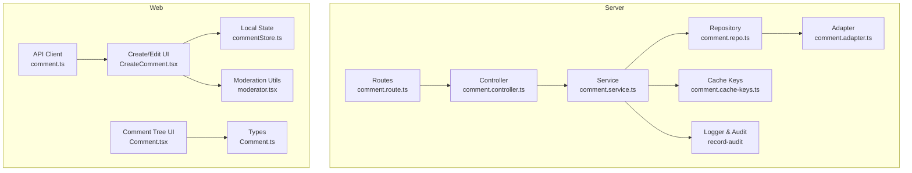

**Diagram sources**
- [comment.route.ts](file://server/src/modules/comment/comment.route.ts#L1-L20)
- [comment.controller.ts](file://server/src/modules/comment/comment.controller.ts#L1-L64)
- [comment.service.ts](file://server/src/modules/comment/comment.service.ts#L1-L195)
- [comment.repo.ts](file://server/src/modules/comment/comment.repo.ts#L1-L71)
- [comment.adapter.ts](file://server/src/infra/db/adapters/comment.adapter.ts#L1-L255)
- [comment.cache-keys.ts](file://server/src/modules/comment/comment.cache-keys.ts#L1-L30)
- [comment.ts](file://web/src/services/api/comment.ts#L1-L21)
- [CreateComment.tsx](file://web/src/components/general/CreateComment.tsx#L1-L214)
- [Comment.tsx](file://web/src/components/general/Comment.tsx#L1-L77)
- [commentStore.ts](file://web/src/store/commentStore.ts#L1-L34)
- [Comment.ts](file://web/src/types/Comment.ts#L1-L17)
- [moderator.tsx](file://web/src/utils/moderator.tsx#L1-L73)

**Section sources**
- [comment.route.ts](file://server/src/modules/comment/comment.route.ts#L1-L20)
- [comment.controller.ts](file://server/src/modules/comment/comment.controller.ts#L1-L64)
- [comment.service.ts](file://server/src/modules/comment/comment.service.ts#L1-L195)
- [comment.repo.ts](file://server/src/modules/comment/comment.repo.ts#L1-L71)
- [comment.adapter.ts](file://server/src/infra/db/adapters/comment.adapter.ts#L1-L255)
- [comment.cache-keys.ts](file://server/src/modules/comment/comment.cache-keys.ts#L1-L30)
- [comment.ts](file://web/src/services/api/comment.ts#L1-L21)
- [CreateComment.tsx](file://web/src/components/general/CreateComment.tsx#L1-L214)
- [Comment.tsx](file://web/src/components/general/Comment.tsx#L1-L77)
- [commentStore.ts](file://web/src/store/commentStore.ts#L1-L34)
- [Comment.ts](file://web/src/types/Comment.ts#L1-L17)
- [moderator.tsx](file://web/src/utils/moderator.tsx#L1-L73)

## Core Components
- Routes define endpoints for comment CRUD and retrieval by post ID, applying rate limiting and user context middleware.
- Controller parses requests, extracts user identity, and delegates to the service.
- Service orchestrates repository operations, applies permission checks, records audit events, and invalidates caches.
- Repository abstracts read/write operations with cached and uncached variants and supports pagination and sorting.
- Adapter executes database queries joining comments with users and colleges, aggregating votes, and filtering banned comments.
- Cache keys manage versioned cache keys per post and per comment replies, enabling cache invalidation on mutations.
- Web API client encapsulates HTTP calls to the backend.
- Frontend components render hierarchical comments, support inline editing, and integrate moderation utilities.

**Section sources**
- [comment.route.ts](file://server/src/modules/comment/comment.route.ts#L1-L20)
- [comment.controller.ts](file://server/src/modules/comment/comment.controller.ts#L1-L64)
- [comment.service.ts](file://server/src/modules/comment/comment.service.ts#L1-L195)
- [comment.repo.ts](file://server/src/modules/comment/comment.repo.ts#L1-L71)
- [comment.adapter.ts](file://server/src/infra/db/adapters/comment.adapter.ts#L1-L255)
- [comment.cache-keys.ts](file://server/src/modules/comment/comment.cache-keys.ts#L1-L30)
- [comment.ts](file://web/src/services/api/comment.ts#L1-L21)
- [CreateComment.tsx](file://web/src/components/general/CreateComment.tsx#L1-L214)
- [Comment.tsx](file://web/src/components/general/Comment.tsx#L1-L77)

## Architecture Overview
The comment system follows a layered architecture:
- Presentation layer (web): renders comments, handles user input, and manages local state
- API layer (web): HTTP client to backend endpoints
- Application layer (server): routes -> controller -> service
- Persistence layer (server): repository -> adapter -> database

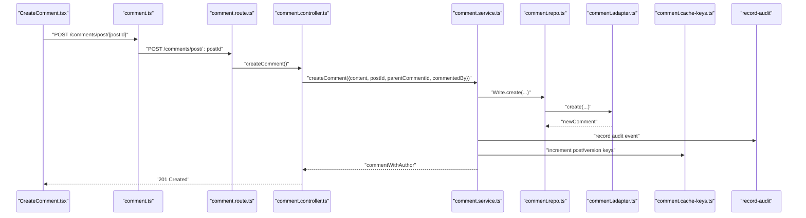

**Diagram sources**
- [comment.ts](file://web/src/services/api/comment.ts#L1-L21)
- [comment.route.ts](file://server/src/modules/comment/comment.route.ts#L1-L20)
- [comment.controller.ts](file://server/src/modules/comment/comment.controller.ts#L1-L64)
- [comment.service.ts](file://server/src/modules/comment/comment.service.ts#L1-L195)
- [comment.repo.ts](file://server/src/modules/comment/comment.repo.ts#L1-L71)
- [comment.adapter.ts](file://server/src/infra/db/adapters/comment.adapter.ts#L1-L255)
- [comment.cache-keys.ts](file://server/src/modules/comment/comment.cache-keys.ts#L1-L30)

## Detailed Component Analysis

### Nested Comment Architecture and Threading
- Comments are stored with a self-referential parent field. Top-level comments lack a parent; replies reference the parent comment ID.
- Retrieval aggregates author and vote data, returning a flat list of top-level comments with optional child arrays for replies.
- Frontend renders nested comments recursively, supporting expand/collapse of replies.

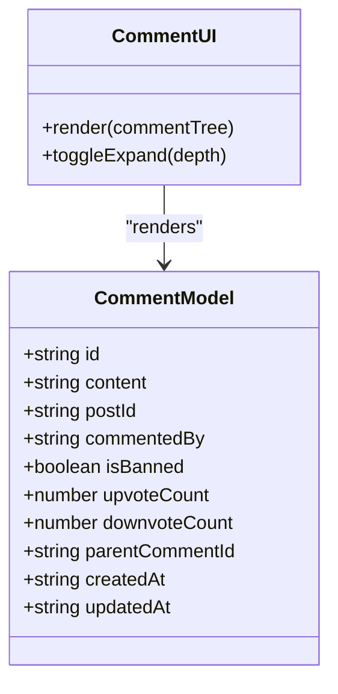

**Diagram sources**
- [Comment.ts](file://web/src/types/Comment.ts#L1-L17)
- [Comment.tsx](file://web/src/components/general/Comment.tsx#L1-L77)
- [comment.adapter.ts](file://server/src/infra/db/adapters/comment.adapter.ts#L25-L141)

**Section sources**
- [Comment.ts](file://web/src/types/Comment.ts#L1-L17)
- [Comment.tsx](file://web/src/components/general/Comment.tsx#L1-L77)
- [comment.adapter.ts](file://server/src/infra/db/adapters/comment.adapter.ts#L25-L141)

### Reply Functionality
- Creating a comment with a parent ID nests the reply under the specified parent.
- Cache invalidation increments the parent’s replies version key or the post’s comments version key, ensuring fresh reads after edits or deletions.

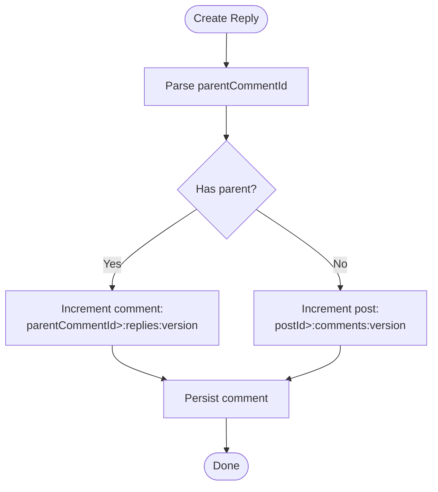

**Diagram sources**
- [comment.service.ts](file://server/src/modules/comment/comment.service.ts#L83-L91)
- [comment.cache-keys.ts](file://server/src/modules/comment/comment.cache-keys.ts#L6-L27)

**Section sources**
- [comment.service.ts](file://server/src/modules/comment/comment.service.ts#L83-L91)
- [comment.cache-keys.ts](file://server/src/modules/comment/comment.cache-keys.ts#L6-L27)

### Hierarchical Comment Threading
- Backend returns top-level comments with optional children populated by the adapter.
- Frontend recursively renders children with indentation and expand/collapse controls.

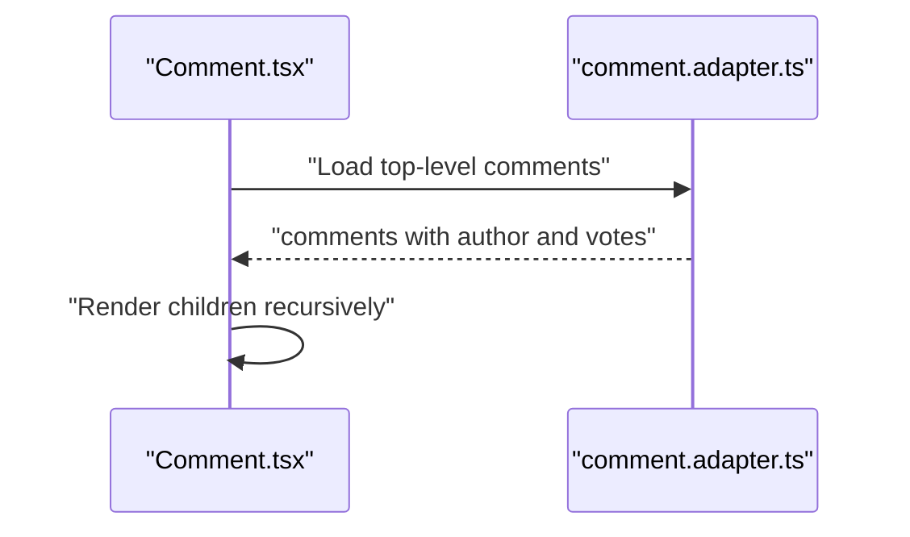

**Diagram sources**
- [Comment.tsx](file://web/src/components/general/Comment.tsx#L53-L71)
- [comment.adapter.ts](file://server/src/infra/db/adapters/comment.adapter.ts#L25-L141)

**Section sources**
- [Comment.tsx](file://web/src/components/general/Comment.tsx#L53-L71)
- [comment.adapter.ts](file://server/src/infra/db/adapters/comment.adapter.ts#L25-L141)

### Comment CRUD Operations

#### Creation
- Endpoint: POST /comments/post/:postId
- Validation: content length limits, optional parent ID
- Permission: requires authenticated user context
- Behavior: persists comment, records audit, invalidates cache keys

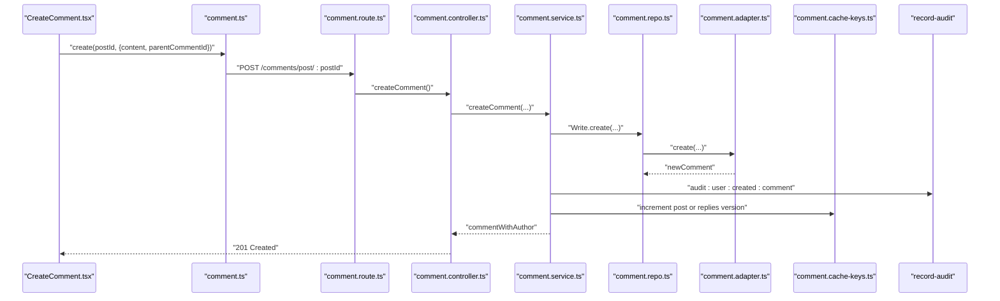

**Diagram sources**
- [CreateComment.tsx](file://web/src/components/general/CreateComment.tsx#L70-L112)
- [comment.ts](file://web/src/services/api/comment.ts#L7-L11)
- [comment.route.ts](file://server/src/modules/comment/comment.route.ts#L16-L18)
- [comment.controller.ts](file://server/src/modules/comment/comment.controller.ts#L9-L22)
- [comment.service.ts](file://server/src/modules/comment/comment.service.ts#L48-L92)
- [comment.repo.ts](file://server/src/modules/comment/comment.repo.ts#L64-L68)
- [comment.adapter.ts](file://server/src/infra/db/adapters/comment.adapter.ts#L158-L167)
- [comment.cache-keys.ts](file://server/src/modules/comment/comment.cache-keys.ts#L6-L27)

**Section sources**
- [comment.schema.ts](file://server/src/modules/comment/comment.schema.ts#L3-L6)
- [comment.controller.ts](file://server/src/modules/comment/comment.controller.ts#L9-L22)
- [comment.service.ts](file://server/src/modules/comment/comment.service.ts#L48-L92)
- [comment.adapter.ts](file://server/src/infra/db/adapters/comment.adapter.ts#L158-L167)
- [comment.cache-keys.ts](file://server/src/modules/comment/comment.cache-keys.ts#L6-L27)

#### Editing
- Endpoint: PATCH /comments/:commentId
- Validation: content length limits
- Permission: author-only; throws forbidden if mismatch
- Behavior: updates content, records audit, invalidates cache keys

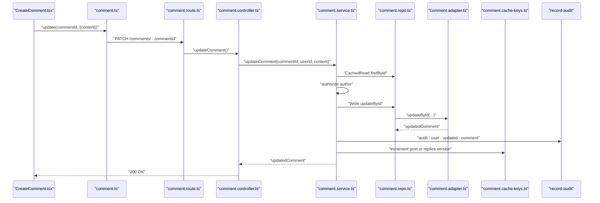

**Diagram sources**
- [CreateComment.tsx](file://web/src/components/general/CreateComment.tsx#L77-L93)
- [comment.ts](file://web/src/services/api/comment.ts#L12-L16)
- [comment.route.ts](file://server/src/modules/comment/comment.route.ts#L17-L18)
- [comment.controller.ts](file://server/src/modules/comment/comment.controller.ts#L24-L32)
- [comment.service.ts](file://server/src/modules/comment/comment.service.ts#L94-L139)
- [comment.repo.ts](file://server/src/modules/comment/comment.repo.ts#L64-L68)
- [comment.adapter.ts](file://server/src/infra/db/adapters/comment.adapter.ts#L169-L183)
- [comment.cache-keys.ts](file://server/src/modules/comment/comment.cache-keys.ts#L6-L27)

**Section sources**
- [comment.schema.ts](file://server/src/modules/comment/comment.schema.ts#L8-L10)
- [comment.controller.ts](file://server/src/modules/comment/comment.controller.ts#L24-L32)
- [comment.service.ts](file://server/src/modules/comment/comment.service.ts#L94-L139)
- [comment.adapter.ts](file://server/src/infra/db/adapters/comment.adapter.ts#L169-L183)
- [comment.cache-keys.ts](file://server/src/modules/comment/comment.cache-keys.ts#L6-L27)

#### Deletion
- Endpoint: DELETE /comments/:commentId
- Permission: author-only; throws forbidden if mismatch
- Behavior: deletes comment, records audit, invalidates cache keys

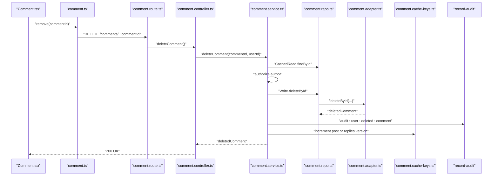

**Diagram sources**
- [comment.ts](file://web/src/services/api/comment.ts#L17-L19)
- [comment.route.ts](file://server/src/modules/comment/comment.route.ts#L17-L18)
- [comment.controller.ts](file://server/src/modules/comment/comment.controller.ts#L34-L40)
- [comment.service.ts](file://server/src/modules/comment/comment.service.ts#L141-L179)
- [comment.repo.ts](file://server/src/modules/comment/comment.repo.ts#L64-L68)
- [comment.adapter.ts](file://server/src/infra/db/adapters/comment.adapter.ts#L185-L194)
- [comment.cache-keys.ts](file://server/src/modules/comment/comment.cache-keys.ts#L6-L27)

**Section sources**
- [comment.controller.ts](file://server/src/modules/comment/comment.controller.ts#L34-L40)
- [comment.service.ts](file://server/src/modules/comment/comment.service.ts#L141-L179)
- [comment.adapter.ts](file://server/src/infra/db/adapters/comment.adapter.ts#L185-L194)
- [comment.cache-keys.ts](file://server/src/modules/comment/comment.cache-keys.ts#L6-L27)

#### Retrieval
- By post: GET /comments/post/:postId with pagination and sort options
- By ID: GET /comments/:commentId
- Returns enriched data with author and vote counts; filters out banned comments

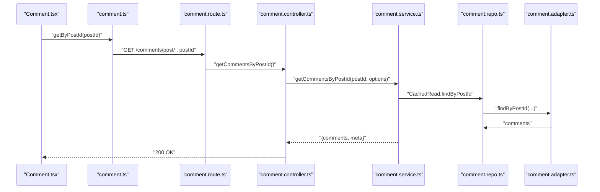

**Diagram sources**
- [comment.ts](file://web/src/services/api/comment.ts#L4-L6)
- [comment.route.ts](file://server/src/modules/comment/comment.route.ts#L11-L12)
- [comment.controller.ts](file://server/src/modules/comment/comment.controller.ts#L42-L54)
- [comment.service.ts](file://server/src/modules/comment/comment.service.ts#L10-L46)
- [comment.repo.ts](file://server/src/modules/comment/comment.repo.ts#L17-L42)
- [comment.adapter.ts](file://server/src/infra/db/adapters/comment.adapter.ts#L25-L141)

**Section sources**
- [comment.schema.ts](file://server/src/modules/comment/comment.schema.ts#L20-L25)
- [comment.controller.ts](file://server/src/modules/comment/comment.controller.ts#L42-L61)
- [comment.service.ts](file://server/src/modules/comment/comment.service.ts#L10-L46)
- [comment.repo.ts](file://server/src/modules/comment/comment.repo.ts#L17-L42)
- [comment.adapter.ts](file://server/src/infra/db/adapters/comment.adapter.ts#L25-L141)

### Permission Validation
- Authentication: routes enforce user context for mutation endpoints
- Authorization: service verifies the comment’s author matches the requester before allowing updates or deletions
- Errors: returns appropriate HTTP errors with structured codes for frontend handling

**Section sources**
- [comment.route.ts](file://server/src/modules/comment/comment.route.ts#L14-L18)
- [comment.service.ts](file://server/src/modules/comment/comment.service.ts#L94-L139)
- [comment.service.ts](file://server/src/modules/comment/comment.service.ts#L141-L179)

### Caching Strategy
- L1/L2 caching via a cached wrapper that prevents thundering herd and coalesces concurrent fetches
- Versioned cache keys per post and per comment replies; incrementing these keys on mutations ensures cache invalidation
- Separate keys for comments list and replies enable targeted invalidation

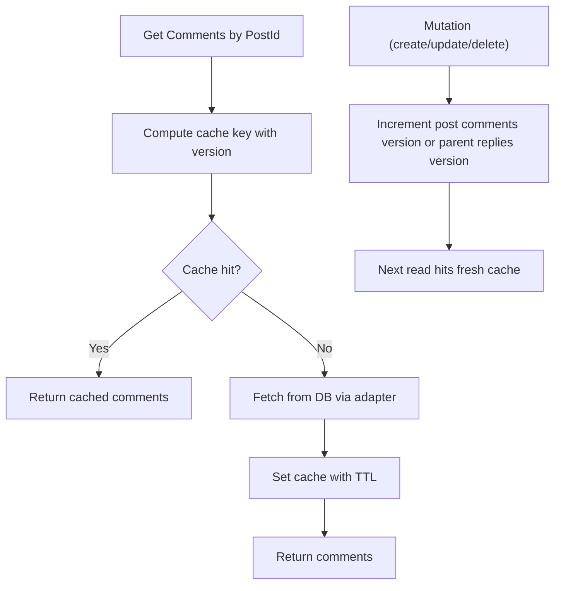

**Diagram sources**
- [cached.ts](file://server/src/lib/cached.ts#L6-L35)
- [comment.cache-keys.ts](file://server/src/modules/comment/comment.cache-keys.ts#L6-L27)
- [comment.repo.ts](file://server/src/modules/comment/comment.repo.ts#L34-L41)
- [comment.adapter.ts](file://server/src/infra/db/adapters/comment.adapter.ts#L25-L141)

**Section sources**
- [cached.ts](file://server/src/lib/cached.ts#L6-L35)
- [comment.cache-keys.ts](file://server/src/modules/comment/comment.cache-keys.ts#L6-L27)
- [comment.repo.ts](file://server/src/modules/comment/comment.repo.ts#L34-L41)
- [comment.adapter.ts](file://server/src/infra/db/adapters/comment.adapter.ts#L25-L141)

### Real-Time Updates and Engagement Tracking
- Real-time updates: the repository and adapter do not implement WebSocket broadcasting; updates invalidate cache and rely on subsequent reads to reflect changes
- Engagement tracking: adapter aggregates upvote/downvote counts and user-specific vote status per comment; UI components display and allow voting

**Section sources**
- [comment.adapter.ts](file://server/src/infra/db/adapters/comment.adapter.ts#L43-L141)
- [Comment.tsx](file://web/src/components/general/Comment.tsx#L51-L51)

### Moderation Features and Reporting
- Client-side moderation: detects and highlights banned words before submission
- Server-side moderation: comments are filtered to exclude banned items during retrieval
- Reporting: separate content-report module allows users to report content; service supports CRUD operations and audit logging

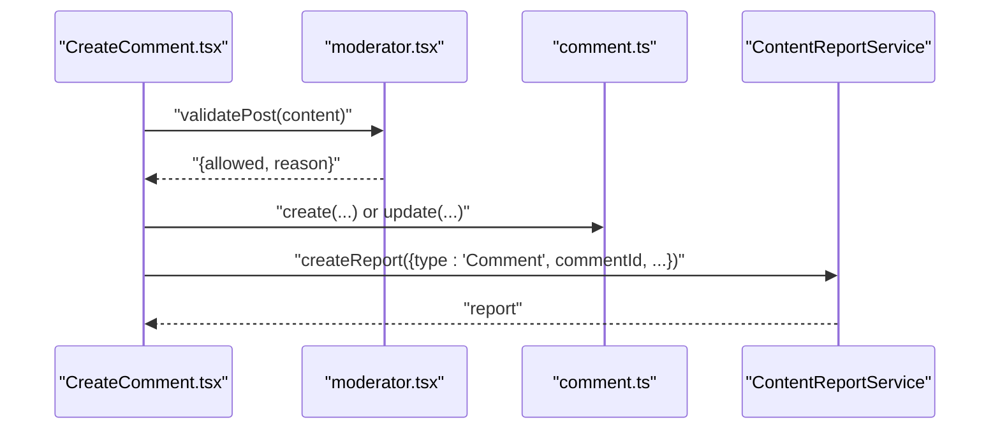

**Diagram sources**
- [CreateComment.tsx](file://web/src/components/general/CreateComment.tsx#L128-L177)
- [moderator.tsx](file://web/src/utils/moderator.tsx#L27-L38)
- [comment.ts](file://web/src/services/api/comment.ts#L7-L19)
- [content-report.service.ts](file://server/src/modules/content-report/content-report.service.ts#L9-L39)

**Section sources**
- [moderator.tsx](file://web/src/utils/moderator.tsx#L1-L73)
- [comment.adapter.ts](file://server/src/infra/db/adapters/comment.adapter.ts#L102-L107)
- [content-report.service.ts](file://server/src/modules/content-report/content-report.service.ts#L1-L159)

### Relationship Between Comments and Posts
- Comments belong to a post via postId; retrieval is scoped to a single post
- Cache invalidation increments post-level and posts-list versions to refresh related views

**Section sources**
- [comment.adapter.ts](file://server/src/infra/db/adapters/comment.adapter.ts#L102-L107)
- [comment.service.ts](file://server/src/modules/comment/comment.service.ts#L88-L90)
- [comment.cache-keys.ts](file://server/src/modules/comment/comment.cache-keys.ts#L6-L18)

### Notification Triggers
- No explicit notification logic is present in the comment module; notifications would require integration with the notification service and post/comment author/subscriber logic outside the scope of the current files

[No sources needed since this section does not analyze specific files]

### Repository Pattern and Transactions
- Repository pattern: a thin layer around the adapter, exposing CachedRead, Read, and Write operations
- Transaction handling: the adapter supports optional database transaction clients; nested operations can reuse the same transaction client passed through the repository chain

**Section sources**
- [comment.repo.ts](file://server/src/modules/comment/comment.repo.ts#L1-L71)
- [comment.adapter.ts](file://server/src/infra/db/adapters/comment.adapter.ts#L3-L4)

### Audit Logging
- Audit events are recorded for create, update, and delete operations with metadata including entity IDs and relevant attributes

**Section sources**
- [comment.service.ts](file://server/src/modules/comment/comment.service.ts#L73-L79)
- [comment.service.ts](file://server/src/modules/comment/comment.service.ts#L124-L130)
- [comment.service.ts](file://server/src/modules/comment/comment.service.ts#L163-L169)

## Dependency Analysis
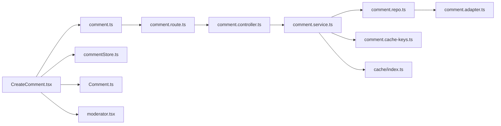

**Diagram sources**
- [comment.route.ts](file://server/src/modules/comment/comment.route.ts#L1-L20)
- [comment.controller.ts](file://server/src/modules/comment/comment.controller.ts#L1-L64)
- [comment.service.ts](file://server/src/modules/comment/comment.service.ts#L1-L195)
- [comment.repo.ts](file://server/src/modules/comment/comment.repo.ts#L1-L71)
- [comment.adapter.ts](file://server/src/infra/db/adapters/comment.adapter.ts#L1-L255)
- [comment.cache-keys.ts](file://server/src/modules/comment/comment.cache-keys.ts#L1-L30)
- [comment.ts](file://web/src/services/api/comment.ts#L1-L21)
- [CreateComment.tsx](file://web/src/components/general/CreateComment.tsx#L1-L214)
- [commentStore.ts](file://web/src/store/commentStore.ts#L1-L34)
- [Comment.ts](file://web/src/types/Comment.ts#L1-L17)
- [moderator.tsx](file://web/src/utils/moderator.tsx#L1-L73)
- [cache/index.ts](file://server/src/infra/services/cache/index.ts#L1-L7)

**Section sources**
- [comment.route.ts](file://server/src/modules/comment/comment.route.ts#L1-L20)
- [comment.controller.ts](file://server/src/modules/comment/comment.controller.ts#L1-L64)
- [comment.service.ts](file://server/src/modules/comment/comment.service.ts#L1-L195)
- [comment.repo.ts](file://server/src/modules/comment/comment.repo.ts#L1-L71)
- [comment.adapter.ts](file://server/src/infra/db/adapters/comment.adapter.ts#L1-L255)
- [comment.cache-keys.ts](file://server/src/modules/comment/comment.cache-keys.ts#L1-L30)
- [comment.ts](file://web/src/services/api/comment.ts#L1-L21)
- [CreateComment.tsx](file://web/src/components/general/CreateComment.tsx#L1-L214)
- [commentStore.ts](file://web/src/store/commentStore.ts#L1-L34)
- [Comment.ts](file://web/src/types/Comment.ts#L1-L17)
- [moderator.tsx](file://web/src/utils/moderator.tsx#L1-L73)
- [cache/index.ts](file://server/src/infra/services/cache/index.ts#L1-L7)

## Performance Considerations
- Prefer paginated retrieval with controlled limit and deterministic sort order to avoid large payloads
- Use versioned cache keys to minimize redundant database queries; increment keys on mutations to ensure freshness
- Coalesce concurrent reads with the cached wrapper to prevent thundering herd
- For deep threads, consider lazy-loading replies on demand rather than fetching entire subtrees
- Aggregate votes at query time to avoid N+1 problems; leverage the existing adapter aggregation

[No sources needed since this section provides general guidance]

## Troubleshooting Guide
- 403 Forbidden on edit/delete: indicates unauthorized access; verify the requester matches the comment’s author
- 404 Not Found on edit/delete/get: indicates the comment does not exist or was filtered out by moderation
- Cache stale data: ensure mutations increment the correct version keys; verify cache provider is reachable
- Rate limit exceeded: route enforces API rate limiting; reduce request frequency or adjust limits

**Section sources**
- [comment.service.ts](file://server/src/modules/comment/comment.service.ts#L94-L139)
- [comment.service.ts](file://server/src/modules/comment/comment.service.ts#L141-L179)
- [comment.service.ts](file://server/src/modules/comment/comment.service.ts#L182-L192)
- [comment.route.ts](file://server/src/modules/comment/comment.route.ts#L8-L9)

## Conclusion
The Flick comment system implements a robust, permission-aware, and cache-friendly nested commenting mechanism. It integrates moderation and reporting capabilities, supports engagement metrics, and provides a clear separation of concerns through the repository pattern. While real-time updates are not implemented in the comment module, the caching and audit mechanisms ensure correctness and traceability.

## Appendices

### API Definitions
- Create comment
  - Method: POST
  - Path: /comments/post/{postId}
  - Auth: required
  - Body: { content, parentCommentId }
  - Responses: 201 Created, 400 Bad Request, 403 Forbidden, 429 Too Many Requests
- Update comment
  - Method: PATCH
  - Path: /comments/{commentId}
  - Auth: required
  - Body: { content }
  - Responses: 200 OK, 400 Bad Request, 403 Forbidden, 404 Not Found
- Delete comment
  - Method: DELETE
  - Path: /comments/{commentId}
  - Auth: required
  - Responses: 200 OK, 403 Forbidden, 404 Not Found
- Get comments by post
  - Method: GET
  - Path: /comments/post/{postId}?page=&limit=&sortBy=&sortOrder=
  - Auth: optional
  - Responses: 200 OK, 400 Bad Request
- Get comment by ID
  - Method: GET
  - Path: /comments/{commentId}
  - Auth: optional
  - Responses: 200 OK, 404 Not Found

**Section sources**
- [comment.route.ts](file://server/src/modules/comment/comment.route.ts#L11-L18)
- [comment.schema.ts](file://server/src/modules/comment/comment.schema.ts#L20-L25)
- [comment.controller.ts](file://server/src/modules/comment/comment.controller.ts#L9-L61)