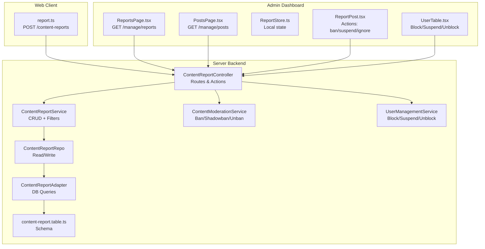
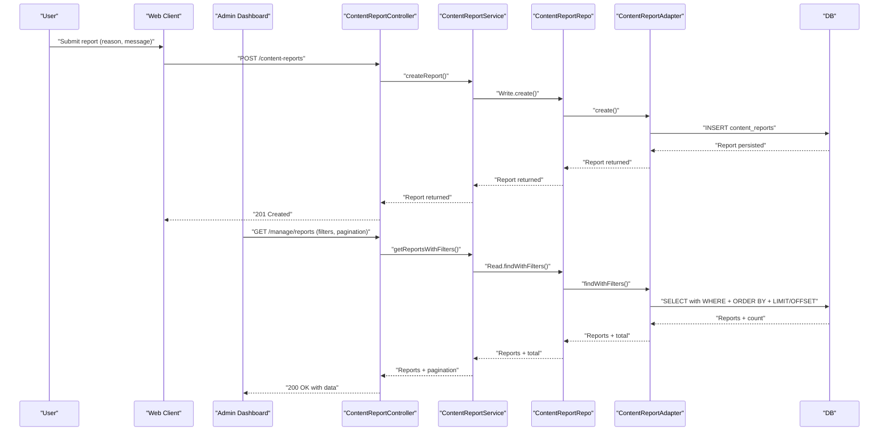
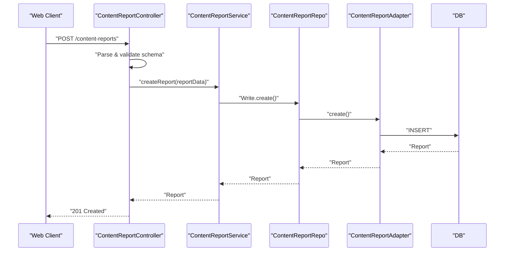
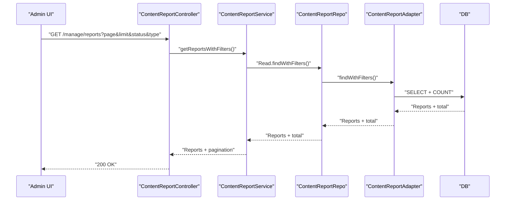
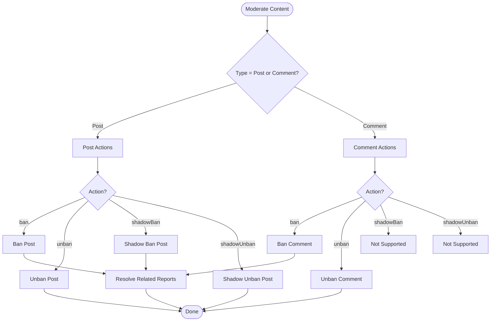
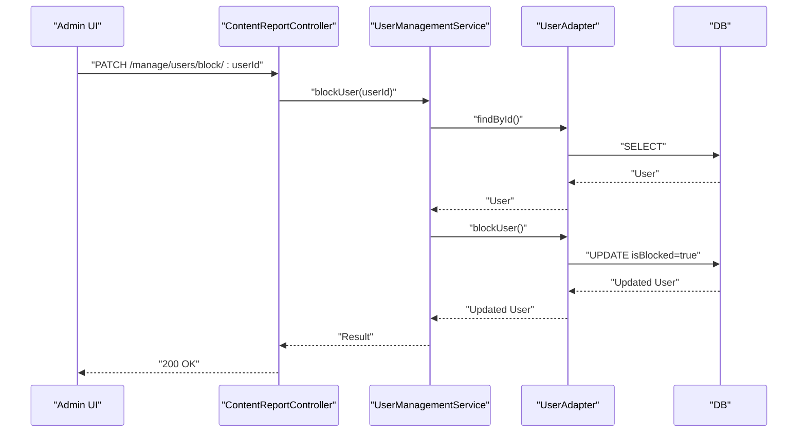
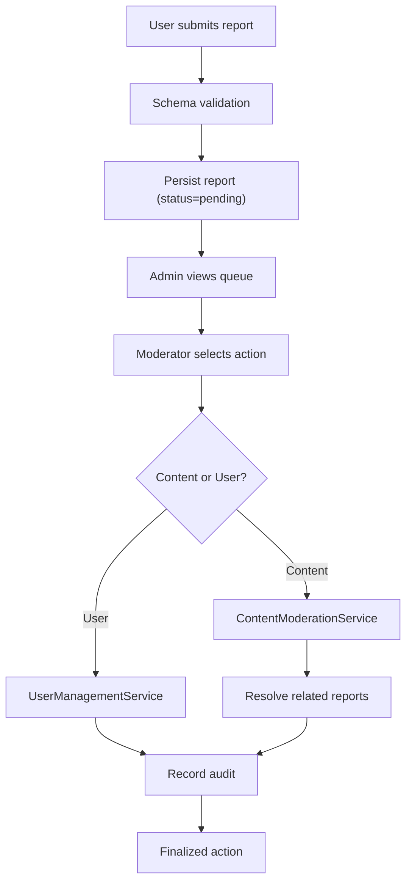
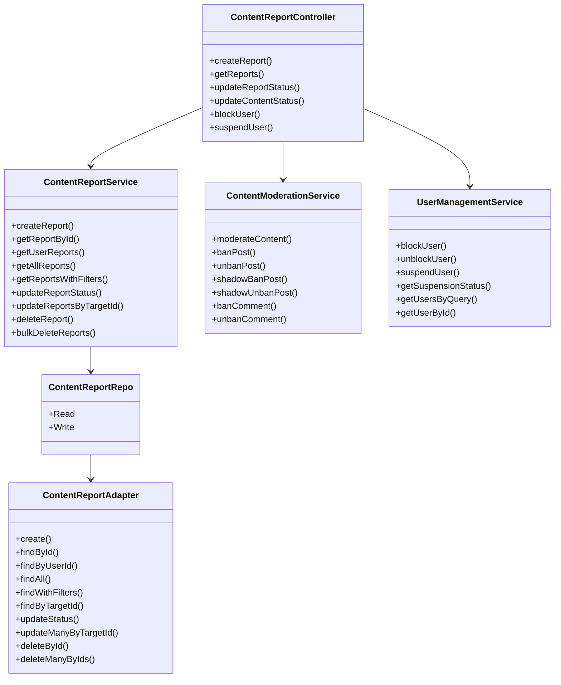

# Content Moderation

<cite>
**Referenced Files in This Document**
- [content-report.service.ts](file://server/src/modules/content-report/content-report.service.ts)
- [content-report.controller.ts](file://server/src/modules/content-report/content-report.controller.ts)
- [content-report.repo.ts](file://server/src/modules/content-report/content-report.repo.ts)
- [content-moderation.service.ts](file://server/src/modules/content-report/content-moderation.service.ts)
- [user-management.service.ts](file://server/src/modules/content-report/user-management.service.ts)
- [content-report.adapter.ts](file://server/src/infra/db/adapters/content-report.adapter.ts)
- [content-report.table.ts](file://server/src/infra/db/tables/content-report.table.ts)
- [content-report.schema.ts](file://server/src/modules/content-report/content-report.schema.ts)
- [report.ts](file://web/src/services/api/report.ts)
- [ReportsPage.tsx](file://admin/src/pages/ReportsPage.tsx)
- [PostsPage.tsx](file://admin/src/pages/PostsPage.tsx)
- [ReportStore.ts](file://admin/src/store/ReportStore.ts)
- [ReportPost.tsx](file://admin/src/components/general/ReportPost.tsx)
- [UserTable.tsx](file://admin/src/components/general/UserTable.tsx)
</cite>

## Table of Contents
1. [Introduction](#introduction)
2. [Project Structure](#project-structure)
3. [Core Components](#core-components)
4. [Architecture Overview](#architecture-overview)
5. [Detailed Component Analysis](#detailed-component-analysis)
6. [Dependency Analysis](#dependency-analysis)
7. [Performance Considerations](#performance-considerations)
8. [Troubleshooting Guide](#troubleshooting-guide)
9. [Conclusion](#conclusion)
10. [Appendices](#appendices)

## Introduction
This document describes the content moderation system for the Flick platform. It covers the AI-powered content filtering pipeline, manual review workflows, automated moderation decisions, user flagging/reporting, moderation queues, integration between AI moderation services and human moderators, appeals and decision logging, user management features for moderators, content restriction systems, and automated enforcement actions. It also documents the content report repository pattern, moderation analytics and compliance reporting, and the end-to-end moderation workflow from report submission to final action, including escalation and quality assurance measures.

## Project Structure
The moderation system spans three layers:
- Web client: exposes a reporting API for users to submit content reports.
- Admin dashboard: displays moderation queues, allows manual moderation actions, and manages users.
- Server backend: implements controllers, services, repositories, and database adapters for content reports, moderation actions, and user management.

**Diagram sources**
- [report.ts](file://web/src/services/api/report.ts#L1-L13)
- [ReportsPage.tsx](file://admin/src/pages/ReportsPage.tsx#L1-L96)
- [PostsPage.tsx](file://admin/src/pages/PostsPage.tsx#L1-L76)
- [ReportStore.ts](file://admin/src/store/ReportStore.ts#L1-L43)
- [ReportPost.tsx](file://admin/src/components/general/ReportPost.tsx#L1-L220)
- [UserTable.tsx](file://admin/src/components/general/UserTable.tsx#L1-L144)
- [content-report.controller.ts](file://server/src/modules/content-report/content-report.controller.ts#L1-L246)
- [content-report.service.ts](file://server/src/modules/content-report/content-report.service.ts#L1-L159)
- [content-moderation.service.ts](file://server/src/modules/content-report/content-moderation.service.ts#L1-L220)
- [user-management.service.ts](file://server/src/modules/content-report/user-management.service.ts#L1-L166)
- [content-report.repo.ts](file://server/src/modules/content-report/content-report.repo.ts#L1-L21)
- [content-report.adapter.ts](file://server/src/infra/db/adapters/content-report.adapter.ts#L1-L120)
- [content-report.table.ts](file://server/src/infra/db/tables/content-report.table.ts#L1-L20)

**Section sources**
- [report.ts](file://web/src/services/api/report.ts#L1-L13)
- [ReportsPage.tsx](file://admin/src/pages/ReportsPage.tsx#L1-L96)
- [PostsPage.tsx](file://admin/src/pages/PostsPage.tsx#L1-L76)
- [ReportStore.ts](file://admin/src/store/ReportStore.ts#L1-L43)
- [ReportPost.tsx](file://admin/src/components/general/ReportPost.tsx#L1-L220)
- [UserTable.tsx](file://admin/src/components/general/UserTable.tsx#L1-L144)
- [content-report.controller.ts](file://server/src/modules/content-report/content-report.controller.ts#L1-L246)
- [content-report.service.ts](file://server/src/modules/content-report/content-report.service.ts#L1-L159)
- [content-moderation.service.ts](file://server/src/modules/content-report/content-moderation.service.ts#L1-L220)
- [user-management.service.ts](file://server/src/modules/content-report/user-management.service.ts#L1-L166)
- [content-report.repo.ts](file://server/src/modules/content-report/content-report.repo.ts#L1-L21)
- [content-report.adapter.ts](file://server/src/infra/db/adapters/content-report.adapter.ts#L1-L120)
- [content-report.table.ts](file://server/src/infra/db/tables/content-report.table.ts#L1-L20)

## Core Components
- Content reporting API: Users submit reports via the web client; the server validates inputs and persists reports.
- Moderation queue: Admin dashboards list pending reports with filters and pagination.
- Automated moderation actions: Services enforce bans and shadow bans on posts/comments and manage user blocks/suspensions.
- Decision logging and audit: All moderation actions are recorded for compliance and traceability.
- User management: Moderators can block/unblock users and apply time-bound suspensions.

Key responsibilities:
- Validate and persist reports with structured reasons and messages.
- Provide paginated, filtered retrieval of reports for moderation queues.
- Enforce moderation actions with idempotent checks and cascading updates to related reports.
- Maintain audit trails for all moderation decisions.

**Section sources**
- [content-report.service.ts](file://server/src/modules/content-report/content-report.service.ts#L1-L159)
- [content-report.controller.ts](file://server/src/modules/content-report/content-report.controller.ts#L1-L246)
- [content-moderation.service.ts](file://server/src/modules/content-report/content-moderation.service.ts#L1-L220)
- [user-management.service.ts](file://server/src/modules/content-report/user-management.service.ts#L1-L166)
- [content-report.adapter.ts](file://server/src/infra/db/adapters/content-report.adapter.ts#L1-L120)
- [content-report.table.ts](file://server/src/infra/db/tables/content-report.table.ts#L1-L20)
- [content-report.schema.ts](file://server/src/modules/content-report/content-report.schema.ts#L1-L63)
- [report.ts](file://web/src/services/api/report.ts#L1-L13)
- [ReportsPage.tsx](file://admin/src/pages/ReportsPage.tsx#L1-L96)
- [PostsPage.tsx](file://admin/src/pages/PostsPage.tsx#L1-L76)
- [ReportPost.tsx](file://admin/src/components/general/ReportPost.tsx#L1-L220)
- [UserTable.tsx](file://admin/src/components/general/UserTable.tsx#L1-L144)

## Architecture Overview
The moderation workflow integrates user reporting, server-side validation, persistence, and admin-driven actions.

**Diagram sources**
- [report.ts](file://web/src/services/api/report.ts#L1-L13)
- [content-report.controller.ts](file://server/src/modules/content-report/content-report.controller.ts#L1-L246)
- [content-report.service.ts](file://server/src/modules/content-report/content-report.service.ts#L1-L159)
- [content-report.repo.ts](file://server/src/modules/content-report/content-report.repo.ts#L1-L21)
- [content-report.adapter.ts](file://server/src/infra/db/adapters/content-report.adapter.ts#L1-L120)
- [content-report.table.ts](file://server/src/infra/db/tables/content-report.table.ts#L1-L20)

## Detailed Component Analysis

### Content Reporting API
- Endpoint: POST /content-reports
- Payload validated by schema: targetId, type ("Post" | "Comment"), reason, message.
- Persists report with status "pending" and records audit event.
- Returns created report to the caller.

**Diagram sources**
- [report.ts](file://web/src/services/api/report.ts#L1-L13)
- [content-report.controller.ts](file://server/src/modules/content-report/content-report.controller.ts#L1-L32)
- [content-report.service.ts](file://server/src/modules/content-report/content-report.service.ts#L1-L39)
- [content-report.adapter.ts](file://server/src/infra/db/adapters/content-report.adapter.ts#L1-L10)

**Section sources**
- [report.ts](file://web/src/services/api/report.ts#L1-L13)
- [content-report.controller.ts](file://server/src/modules/content-report/content-report.controller.ts#L15-L32)
- [content-report.service.ts](file://server/src/modules/content-report/content-report.service.ts#L9-L39)
- [content-report.schema.ts](file://server/src/modules/content-report/content-report.schema.ts#L5-L10)

### Moderation Queue Management
- Admin endpoints:
  - GET /manage/reports: paginated, filterable by type and status.
  - GET /manage/posts: similar queue for posts.
- Frontend:
  - ReportsPage.tsx and PostsPage.tsx fetch and display queues.
  - ReportStore.ts maintains local state for optimistic updates.
  - ReportPost.tsx renders actionable rows and triggers admin actions.

**Diagram sources**
- [ReportsPage.tsx](file://admin/src/pages/ReportsPage.tsx#L29-L66)
- [PostsPage.tsx](file://admin/src/pages/PostsPage.tsx#L20-L41)
- [ReportStore.ts](file://admin/src/store/ReportStore.ts#L11-L40)
- [ReportPost.tsx](file://admin/src/components/general/ReportPost.tsx#L20-L85)
- [content-report.controller.ts](file://server/src/modules/content-report/content-report.controller.ts#L34-L54)
- [content-report.service.ts](file://server/src/modules/content-report/content-report.service.ts#L70-L91)
- [content-report.adapter.ts](file://server/src/infra/db/adapters/content-report.adapter.ts#L28-L67)

**Section sources**
- [ReportsPage.tsx](file://admin/src/pages/ReportsPage.tsx#L1-L96)
- [PostsPage.tsx](file://admin/src/pages/PostsPage.tsx#L1-L76)
- [ReportStore.ts](file://admin/src/store/ReportStore.ts#L1-L43)
- [ReportPost.tsx](file://admin/src/components/general/ReportPost.tsx#L1-L220)
- [content-report.controller.ts](file://server/src/modules/content-report/content-report.controller.ts#L34-L54)
- [content-report.service.ts](file://server/src/modules/content-report/content-report.service.ts#L70-L91)
- [content-report.adapter.ts](file://server/src/infra/db/adapters/content-report.adapter.ts#L28-L67)

### Automated Moderation Decisions
- ContentModerationService enforces:
  - Post: ban, unban, shadow ban, shadow unban.
  - Comment: ban, unban.
- Idempotency checks prevent redundant actions.
- Cascading updates resolve related reports when content is moderated.

**Diagram sources**
- [content-moderation.service.ts](file://server/src/modules/content-report/content-moderation.service.ts#L6-L217)

**Section sources**
- [content-moderation.service.ts](file://server/src/modules/content-report/content-moderation.service.ts#L6-L217)

### User Management Features
- Block/Unblock users.
- Apply time-bound suspensions with end dates checked for validity.
- Search/filter users by email or username.
- Display user suspension status.

**Diagram sources**
- [UserTable.tsx](file://admin/src/components/general/UserTable.tsx#L24-L63)
- [content-report.controller.ts](file://server/src/modules/content-report/content-report.controller.ts#L151-L175)
- [user-management.service.ts](file://server/src/modules/content-report/user-management.service.ts#L6-L70)
- [content-report.adapter.ts](file://server/src/infra/db/adapters/content-report.adapter.ts#L1-L120)

**Section sources**
- [UserTable.tsx](file://admin/src/components/general/UserTable.tsx#L1-L144)
- [content-report.controller.ts](file://server/src/modules/content-report/content-report.controller.ts#L151-L199)
- [user-management.service.ts](file://server/src/modules/content-report/user-management.service.ts#L6-L166)

### Content Restriction Systems
- Post-level restrictions:
  - isBanned toggled via ban/unban.
  - isShadowBanned toggled via shadow ban/unban.
- Comment-level restrictions:
  - isBanned toggled via ban/unban.
- Related reports are automatically resolved upon moderation actions.

**Section sources**
- [content-moderation.service.ts](file://server/src/modules/content-report/content-moderation.service.ts#L69-L122)
- [content-moderation.service.ts](file://server/src/modules/content-report/content-moderation.service.ts#L124-L180)
- [content-report.adapter.ts](file://server/src/infra/db/adapters/content-report.adapter.ts#L92-L108)

### Appeals and Decision Logging
- Appeal process: Not implemented in the current codebase. To support appeals, introduce an appeals entity and workflow that links to reports and stores reviewer decisions with timestamps.
- Decision logging: All moderation actions record audit events with action type, entity type, and metadata (e.g., targetId, type, status, reason). This enables compliance reporting and traceability.

**Section sources**
- [content-report.controller.ts](file://server/src/modules/content-report/content-report.controller.ts#L79-L146)
- [content-report.service.ts](file://server/src/modules/content-report/content-report.service.ts#L30-L36)
- [content-report.service.ts](file://server/src/modules/content-report/content-report.service.ts#L102-L107)
- [content-report.service.ts](file://server/src/modules/content-report/content-report.service.ts#L132-L137)
- [content-report.service.ts](file://server/src/modules/content-report/content-report.service.ts#L148-L153)

### Moderation Analytics and Compliance Reporting
- Current state: No built-in analytics endpoints or compliance exports in the reviewed files.
- Recommendations:
  - Add endpoints to export moderation metrics (counts by status, type, time windows).
  - Provide audit trail exports for compliance.
  - Integrate with external analytics dashboards via admin APIs.

[No sources needed since this section provides general guidance]

### Moderation Workflow: From Submission to Final Action

**Diagram sources**
- [content-report.controller.ts](file://server/src/modules/content-report/content-report.controller.ts#L119-L149)
- [content-moderation.service.ts](file://server/src/modules/content-report/content-moderation.service.ts#L182-L217)
- [user-management.service.ts](file://server/src/modules/content-report/user-management.service.ts#L72-L107)
- [content-report.service.ts](file://server/src/modules/content-report/content-report.service.ts#L112-L127)

**Section sources**
- [content-report.controller.ts](file://server/src/modules/content-report/content-report.controller.ts#L119-L149)
- [content-moderation.service.ts](file://server/src/modules/content-report/content-moderation.service.ts#L182-L217)
- [user-management.service.ts](file://server/src/modules/content-report/user-management.service.ts#L72-L107)
- [content-report.service.ts](file://server/src/modules/content-report/content-report.service.ts#L112-L127)

### Example Scenarios
- Spam post:
  - User reports post; report stored with status "pending".
  - Moderator bans post; related reports resolved; audit logged.
- Obscene comment:
  - User reports comment; report stored.
  - Moderator bans comment; related reports resolved; audit logged.
- Repeat offender:
  - Reporter/user previously reported; moderator blocks user or applies suspension; audit logged.
- Shadow ban:
  - Moderator shadow bans post; related reports resolved; audit logged.

**Section sources**
- [content-moderation.service.ts](file://server/src/modules/content-report/content-moderation.service.ts#L69-L122)
- [content-report.controller.ts](file://server/src/modules/content-report/content-report.controller.ts#L119-L149)
- [content-report.service.ts](file://server/src/modules/content-report/content-report.service.ts#L112-L127)

### Balancing Automation with Human Oversight
- Automation:
  - Immediate resolution of related reports upon moderation actions.
  - Idempotent checks prevent redundant operations.
- Human oversight:
  - Admin dashboards enable manual review and escalation.
  - Audit logs support policy adherence and quality assurance.
- Recommendations:
  - Introduce AI moderation suggestions with override capability.
  - Add escalation thresholds (e.g., repeated reports) to route to human review.

[No sources needed since this section provides general guidance]

## Dependency Analysis

**Diagram sources**
- [content-report.controller.ts](file://server/src/modules/content-report/content-report.controller.ts#L1-L246)
- [content-report.service.ts](file://server/src/modules/content-report/content-report.service.ts#L1-L159)
- [content-moderation.service.ts](file://server/src/modules/content-report/content-moderation.service.ts#L1-L220)
- [user-management.service.ts](file://server/src/modules/content-report/user-management.service.ts#L1-L166)
- [content-report.repo.ts](file://server/src/modules/content-report/content-report.repo.ts#L1-L21)
- [content-report.adapter.ts](file://server/src/infra/db/adapters/content-report.adapter.ts#L1-L120)

**Section sources**
- [content-report.controller.ts](file://server/src/modules/content-report/content-report.controller.ts#L1-L246)
- [content-report.service.ts](file://server/src/modules/content-report/content-report.service.ts#L1-L159)
- [content-moderation.service.ts](file://server/src/modules/content-report/content-moderation.service.ts#L1-L220)
- [user-management.service.ts](file://server/src/modules/content-report/user-management.service.ts#L1-L166)
- [content-report.repo.ts](file://server/src/modules/content-report/content-report.repo.ts#L1-L21)
- [content-report.adapter.ts](file://server/src/infra/db/adapters/content-report.adapter.ts#L1-L120)

## Performance Considerations
- Database queries:
  - Filtering and pagination are implemented with LIMIT/OFFSET and COUNT queries; ensure appropriate indexes on frequently filtered columns (type, status, createdAt).
- Audit sampling:
  - Sampling reduces log volume while preserving visibility; tune sampling thresholds for high-volume environments.
- Frontend state:
  - Local state updates (ReportStore) improve responsiveness; ensure optimistic updates are reconciled with server responses.

[No sources needed since this section provides general guidance]

## Troubleshooting Guide
Common issues and resolutions:
- Report creation fails:
  - Validate schema inputs and check server logs for errors.
  - Confirm user permissions and that target exists.
- Report not found:
  - Verify report ID format and existence.
- Invalid status update:
  - Ensure status is one of "pending", "resolved", "ignored".
- Content moderation errors:
  - Check if content is already banned/shadow banned for idempotency.
  - Confirm content type and action combination are valid.
- User management errors:
  - Ensure user exists and suspension end date is in the future.

**Section sources**
- [content-report.service.ts](file://server/src/modules/content-report/content-report.service.ts#L45-L48)
- [content-report.service.ts](file://server/src/modules/content-report/content-report.service.ts#L94-L97)
- [content-moderation.service.ts](file://server/src/modules/content-report/content-moderation.service.ts#L11-L19)
- [content-moderation.service.ts](file://server/src/modules/content-report/content-moderation.service.ts#L202-L213)
- [user-management.service.ts](file://server/src/modules/content-report/user-management.service.ts#L78-L88)

## Conclusion
The Flick content moderation system provides a robust foundation for user-generated content governance. It supports user reporting, admin moderation queues, automated content restrictions, and comprehensive audit logging. To further strengthen the system, consider integrating AI moderation suggestions, implementing an appeals workflow, adding analytics and compliance exports, and establishing escalation and quality assurance procedures.

[No sources needed since this section summarizes without analyzing specific files]

## Appendices

### API Definitions
- POST /content-reports
  - Body: targetId, type ("Post" | "Comment"), reason, message
  - Response: 201 Created with report
- GET /manage/reports
  - Query: page, limit, type ("Post" | "Comment" | "Both"), status (comma-separated)
  - Response: 200 OK with data, pagination, filters
- PATCH /manage/reports/status/:id
  - Body: status ("pending" | "resolved" | "ignored")
  - Response: 200 OK with updated report
- PATCH /manage/posts/:action/:targetId
  - Path: action ("ban" | "unban" | "shadowban" | "shadowunban"), targetId
  - Response: 200 OK with result
- PATCH /manage/users/block/:userId
  - Response: 200 OK with result
- PATCH /manage/users/unblock/:userId
  - Response: 200 OK with result
- PATCH /manage/users/suspension/:userId
  - Body: ends (ISO datetime), reason (required)
  - Response: 200 OK with result

**Section sources**
- [content-report.controller.ts](file://server/src/modules/content-report/content-report.controller.ts#L15-L32)
- [content-report.controller.ts](file://server/src/modules/content-report/content-report.controller.ts#L34-L54)
- [content-report.controller.ts](file://server/src/modules/content-report/content-report.controller.ts#L73-L86)
- [content-report.controller.ts](file://server/src/modules/content-report/content-report.controller.ts#L119-L149)
- [content-report.controller.ts](file://server/src/modules/content-report/content-report.controller.ts#L151-L175)
- [content-report.controller.ts](file://server/src/modules/content-report/content-report.controller.ts#L177-L199)
- [content-report.schema.ts](file://server/src/modules/content-report/content-report.schema.ts#L5-L10)
- [content-report.schema.ts](file://server/src/modules/content-report/content-report.schema.ts#L24-L34)
- [content-report.schema.ts](file://server/src/modules/content-report/content-report.schema.ts#L12-L14)
- [content-report.schema.ts](file://server/src/modules/content-report/content-report.schema.ts#L40-L43)
- [content-report.schema.ts](file://server/src/modules/content-report/content-report.schema.ts#L49-L51)
- [content-report.schema.ts](file://server/src/modules/content-report/content-report.schema.ts#L53-L56)