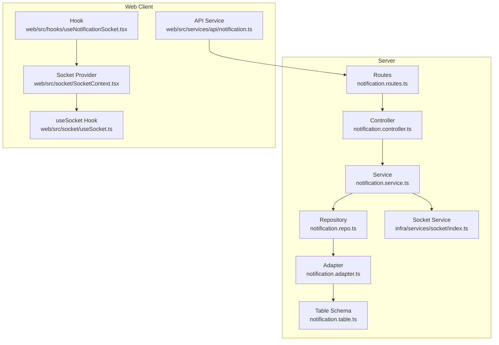
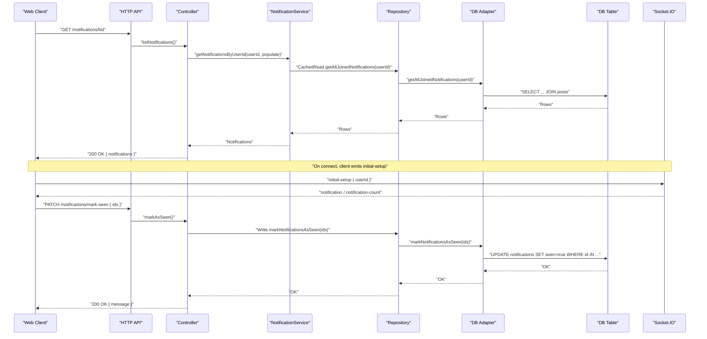
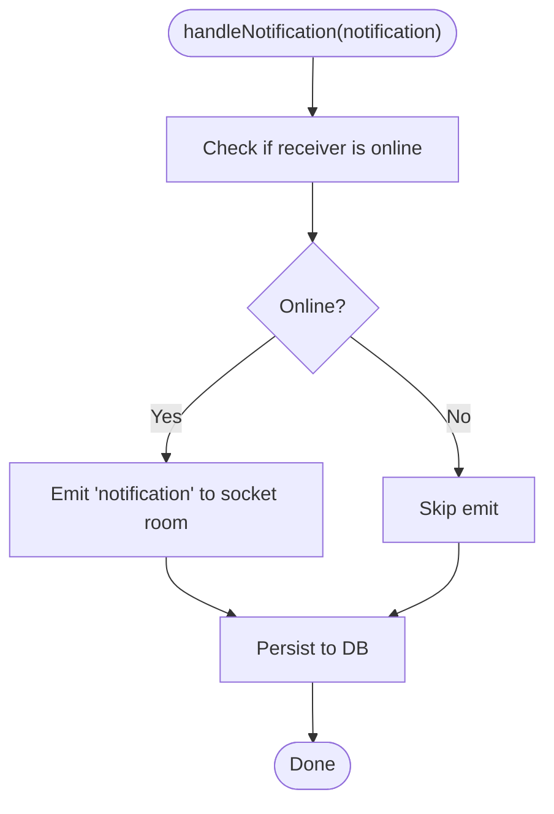
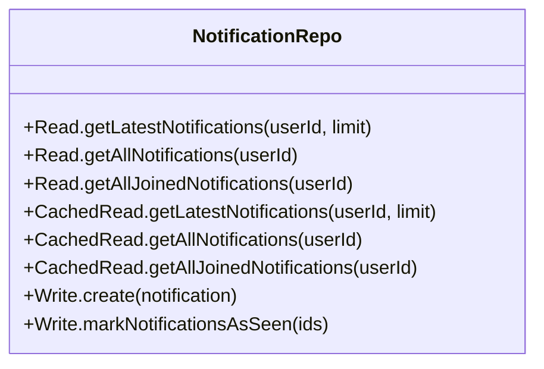
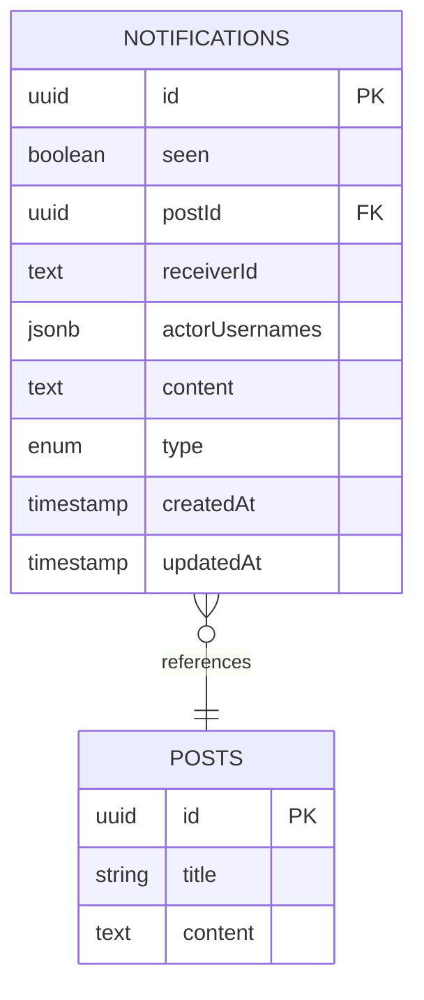
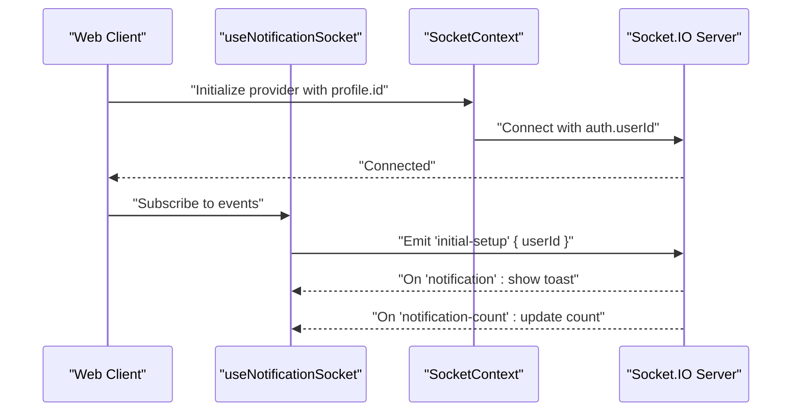
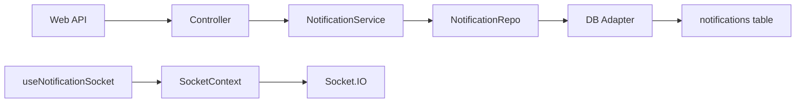

# Notification System

<cite>
**Referenced Files in This Document**
- [notification.controller.ts](file://server/src/modules/notification/notification.controller.ts)
- [notification.service.ts](file://server/src/modules/notification/notification.service.ts)
- [notification.repo.ts](file://server/src/modules/notification/notification.repo.ts)
- [notification.routes.ts](file://server/src/modules/notification/notification.routes.ts)
- [notification.adapter.ts](file://server/src/infra/db/adapters/notification.adapter.ts)
- [notification.table.ts](file://server/src/infra/db/tables/notification.table.ts)
- [index.ts](file://server/src/infra/services/socket/index.ts)
- [notification.ts](file://web/src/services/api/notification.ts)
- [useNotificationSocket.tsx](file://web/src/hooks/useNotificationSocket.tsx)
- [SocketContext.tsx](file://web/src/socket/SocketContext.tsx)
- [useSocket.ts](file://web/src/socket/useSocket.ts)
</cite>

## Table of Contents
1. [Introduction](#introduction)
2. [Project Structure](#project-structure)
3. [Core Components](#core-components)
4. [Architecture Overview](#architecture-overview)
5. [Detailed Component Analysis](#detailed-component-analysis)
6. [Dependency Analysis](#dependency-analysis)
7. [Performance Considerations](#performance-considerations)
8. [Troubleshooting Guide](#troubleshooting-guide)
9. [Conclusion](#conclusion)

## Introduction
This document describes the notification system for the Flick platform. It covers real-time delivery via WebSocket, notification types, user preference management, creation/storage/retrieval/deletion operations, socket events for live notifications and counts, bundling and batching strategies, and scalability considerations for high-volume scenarios. The system integrates backend services with frontend sockets to deliver timely updates to users.

## Project Structure
The notification system spans the server-side modules and the web client:
- Server-side:
  - Routes expose endpoints for listing notifications and marking as seen.
  - Controller handles requests and delegates to the service.
  - Service encapsulates business logic, real-time emission, and persistence.
  - Repository abstracts read/write operations to the database.
  - Database adapter defines queries and joins for notifications and posts.
  - Socket service initializes and manages WebSocket connections.
- Web client:
  - Socket provider establishes a WebSocket connection and authenticates with the user ID.
  - Hook listens for real-time events and displays toast notifications.
  - API service wraps HTTP calls to the backend.

**Diagram sources**
- [notification.routes.ts](file://server/src/modules/notification/notification.routes.ts#L1-L12)
- [notification.controller.ts](file://server/src/modules/notification/notification.controller.ts#L1-L47)
- [notification.service.ts](file://server/src/modules/notification/notification.service.ts#L1-L209)
- [notification.repo.ts](file://server/src/modules/notification/notification.repo.ts#L1-L20)
- [notification.adapter.ts](file://server/src/infra/db/adapters/notification.adapter.ts#L1-L76)
- [notification.table.ts](file://server/src/infra/db/tables/notification.table.ts#L1-L28)
- [index.ts](file://server/src/infra/services/socket/index.ts#L1-L48)
- [notification.ts](file://web/src/services/api/notification.ts#L1-L12)
- [useNotificationSocket.tsx](file://web/src/hooks/useNotificationSocket.tsx#L1-L47)
- [SocketContext.tsx](file://web/src/socket/SocketContext.tsx#L1-L47)
- [useSocket.ts](file://web/src/socket/useSocket.ts#L1-L9)

**Section sources**
- [notification.routes.ts](file://server/src/modules/notification/notification.routes.ts#L1-L12)
- [notification.controller.ts](file://server/src/modules/notification/notification.controller.ts#L1-L47)
- [notification.service.ts](file://server/src/modules/notification/notification.service.ts#L1-L209)
- [notification.repo.ts](file://server/src/modules/notification/notification.repo.ts#L1-L20)
- [notification.adapter.ts](file://server/src/infra/db/adapters/notification.adapter.ts#L1-L76)
- [notification.table.ts](file://server/src/infra/db/tables/notification.table.ts#L1-L28)
- [index.ts](file://server/src/infra/services/socket/index.ts#L1-L48)
- [notification.ts](file://web/src/services/api/notification.ts#L1-L12)
- [useNotificationSocket.tsx](file://web/src/hooks/useNotificationSocket.tsx#L1-L47)
- [SocketContext.tsx](file://web/src/socket/SocketContext.tsx#L1-L47)
- [useSocket.ts](file://web/src/socket/useSocket.ts#L1-L9)

## Core Components
- Notification Types: The service defines a union of notification types used to categorize events such as general, upvoted post/comment, replied, and posted.
- Real-time Emission: The service attempts to emit notifications to connected clients if the receiver is online; otherwise, it persists them for later retrieval.
- Bundling: Incoming notifications are bundled by receiver, post, and type to reduce noise and consolidate actor lists.
- Persistence: Notifications are inserted into the database with metadata and actor usernames; retrieval supports latest N and joined post data.
- Web API: Frontend exposes list and mark-as-seen endpoints; the socket hook listens for live updates and counts.

**Section sources**
- [notification.service.ts](file://server/src/modules/notification/notification.service.ts#L9-L26)
- [notification.service.ts](file://server/src/modules/notification/notification.service.ts#L28-L140)
- [notification.service.ts](file://server/src/modules/notification/notification.service.ts#L57-L122)
- [notification.adapter.ts](file://server/src/infra/db/adapters/notification.adapter.ts#L67-L76)
- [notification.adapter.ts](file://server/src/infra/db/adapters/notification.adapter.ts#L18-L34)
- [notification.adapter.ts](file://server/src/infra/db/adapters/notification.adapter.ts#L36-L65)
- [notification.ts](file://web/src/services/api/notification.ts#L1-L12)
- [useNotificationSocket.tsx](file://web/src/hooks/useNotificationSocket.tsx#L22-L37)

## Architecture Overview
The notification pipeline combines HTTP endpoints and WebSocket events:
- HTTP endpoints:
  - GET /notifications/list: Returns paginated or limited notifications for the authenticated user.
  - PATCH /notifications/mark-seen: Marks selected notifications as seen.
- WebSocket events:
  - Client emits initial-setup with the user ID upon connection.
  - Server emits notification and notification-count events to the user’s room.
  - Client displays toast notifications and updates unread counts.

**Diagram sources**
- [notification.routes.ts](file://server/src/modules/notification/notification.routes.ts#L7-L10)
- [notification.controller.ts](file://server/src/modules/notification/notification.controller.ts#L7-L24)
- [notification.controller.ts](file://server/src/modules/notification/notification.controller.ts#L26-L44)
- [notification.service.ts](file://server/src/modules/notification/notification.service.ts#L164-L182)
- [notification.repo.ts](file://server/src/modules/notification/notification.repo.ts#L9-L17)
- [notification.adapter.ts](file://server/src/infra/db/adapters/notification.adapter.ts#L36-L55)
- [notification.adapter.ts](file://server/src/infra/db/adapters/notification.adapter.ts#L6-L16)
- [notification.table.ts](file://server/src/infra/db/tables/notification.table.ts#L12-L27)
- [useNotificationSocket.tsx](file://web/src/hooks/useNotificationSocket.tsx#L20-L37)
- [notification.ts](file://web/src/services/api/notification.ts#L4-L9)

## Detailed Component Analysis

### Backend Service: NotificationService
Responsibilities:
- Determine if a user is online and emit a real-time notification.
- Insert notifications into the database.
- Bundle multiple related notifications to reduce duplication.
- Retrieve notifications for a user with optional post joins.

Key behaviors:
- Online check and emit: Uses a user-to-socket mapping to target the correct socket room and emits a notification event.
- Persistence: Inserts a normalized record with actor usernames and metadata.
- Bundling: Groups notifications by receiver, post, type, and content; merges actors and retains only the first original ID for deletion.
- Retrieval: Supports latest N notifications and joined post data for richer UI rendering.

**Diagram sources**
- [notification.service.ts](file://server/src/modules/notification/notification.service.ts#L28-L55)
- [notification.service.ts](file://server/src/modules/notification/notification.service.ts#L124-L140)

**Section sources**
- [notification.service.ts](file://server/src/modules/notification/notification.service.ts#L28-L55)
- [notification.service.ts](file://server/src/modules/notification/notification.service.ts#L57-L122)
- [notification.service.ts](file://server/src/modules/notification/notification.service.ts#L124-L140)
- [notification.service.ts](file://server/src/modules/notification/notification.service.ts#L184-L207)

### Repository Pattern: NotificationRepo
- Read: Latest notifications, all notifications, and joined notifications with post data.
- CachedRead: Same as Read (cached reads are aliased to the same adapter functions).
- Write: Create notification and mark as seen.

**Diagram sources**
- [notification.repo.ts](file://server/src/modules/notification/notification.repo.ts#L3-L18)

**Section sources**
- [notification.repo.ts](file://server/src/modules/notification/notification.repo.ts#L1-L20)

### Database Adapter and Table Schema
- Adapter functions:
  - Mark notifications as seen with a bulk update.
  - Fetch latest notifications within the last 24 hours.
  - Fetch all notifications joined with post data.
  - Create a single notification record.
- Table schema:
  - UUID primary key, seen flag, optional post reference, receiver identifier, actor usernames JSON array, content text, type enum, timestamps.

**Diagram sources**
- [notification.adapter.ts](file://server/src/infra/db/adapters/notification.adapter.ts#L6-L16)
- [notification.adapter.ts](file://server/src/infra/db/adapters/notification.adapter.ts#L18-L34)
- [notification.adapter.ts](file://server/src/infra/db/adapters/notification.adapter.ts#L36-L65)
- [notification.adapter.ts](file://server/src/infra/db/adapters/notification.adapter.ts#L67-L76)
- [notification.table.ts](file://server/src/infra/db/tables/notification.table.ts#L12-L27)

**Section sources**
- [notification.adapter.ts](file://server/src/infra/db/adapters/notification.adapter.ts#L6-L16)
- [notification.adapter.ts](file://server/src/infra/db/adapters/notification.adapter.ts#L18-L34)
- [notification.adapter.ts](file://server/src/infra/db/adapters/notification.adapter.ts#L36-L65)
- [notification.adapter.ts](file://server/src/infra/db/adapters/notification.adapter.ts#L67-L76)
- [notification.table.ts](file://server/src/infra/db/tables/notification.table.ts#L1-L28)

### Web API and Socket Integration
- HTTP API:
  - List notifications endpoint returns user-specific notifications.
  - Mark as seen endpoint updates the seen flag for provided IDs.
- Socket:
  - Provider connects with WebSocket transport and authenticates using the user ID.
  - Hook subscribes to notification and notification-count events, displays toasts, and navigates to post on click.

**Diagram sources**
- [SocketContext.tsx](file://web/src/socket/SocketContext.tsx#L20-L37)
- [useNotificationSocket.tsx](file://web/src/hooks/useNotificationSocket.tsx#L20-L37)
- [notification.ts](file://web/src/services/api/notification.ts#L4-L9)

**Section sources**
- [notification.ts](file://web/src/services/api/notification.ts#L1-L12)
- [useNotificationSocket.tsx](file://web/src/hooks/useNotificationSocket.tsx#L1-L47)
- [SocketContext.tsx](file://web/src/socket/SocketContext.tsx#L1-L47)
- [useSocket.ts](file://web/src/socket/useSocket.ts#L1-L9)

## Dependency Analysis
- Controller depends on Service for business logic and on Repo for persistence.
- Service depends on SocketService for emitting events and on Repo for database operations.
- Repo delegates to the database adapter, which operates on the notifications table and joins with posts.
- Web API depends on Express routes; the socket hook depends on the socket provider and context.

**Diagram sources**
- [notification.controller.ts](file://server/src/modules/notification/notification.controller.ts#L1-L47)
- [notification.service.ts](file://server/src/modules/notification/notification.service.ts#L1-L209)
- [notification.repo.ts](file://server/src/modules/notification/notification.repo.ts#L1-L20)
- [notification.adapter.ts](file://server/src/infra/db/adapters/notification.adapter.ts#L1-L76)
- [notification.table.ts](file://server/src/infra/db/tables/notification.table.ts#L1-L28)
- [notification.ts](file://web/src/services/api/notification.ts#L1-L12)
- [useNotificationSocket.tsx](file://web/src/hooks/useNotificationSocket.tsx#L1-L47)
- [SocketContext.tsx](file://web/src/socket/SocketContext.tsx#L1-L47)

**Section sources**
- [notification.controller.ts](file://server/src/modules/notification/notification.controller.ts#L1-L47)
- [notification.service.ts](file://server/src/modules/notification/notification.service.ts#L1-L209)
- [notification.repo.ts](file://server/src/modules/notification/notification.repo.ts#L1-L20)
- [notification.adapter.ts](file://server/src/infra/db/adapters/notification.adapter.ts#L1-L76)
- [notification.table.ts](file://server/src/infra/db/tables/notification.table.ts#L1-L28)
- [notification.ts](file://web/src/services/api/notification.ts#L1-L12)
- [useNotificationSocket.tsx](file://web/src/hooks/useNotificationSocket.tsx#L1-L47)
- [SocketContext.tsx](file://web/src/socket/SocketContext.tsx#L1-L47)

## Performance Considerations
- Bundling: Consolidates multiple similar notifications to reduce payload size and server load.
- Caching: CachedRead aliases are used for repeated reads; ensure appropriate caching policies at the adapter level.
- Bulk Updates: Mark as seen uses a single bulk update operation to minimize round-trips.
- 24-Hour Limit: Retrieval limits the recent dataset to improve query performance.
- WebSocket Transport: Enforces WebSocket transport for efficient real-time delivery.
- Scalability:
  - Horizontal scaling requires sticky sessions or shared state for userId-to-socket mapping.
  - Consider partitioning notifications by user or sharding the database.
  - Offload heavy bundling/batching to background jobs if needed.

[No sources needed since this section provides general guidance]

## Troubleshooting Guide
- Unauthorized Access: Listing or marking notifications requires authentication; ensure the user context is present.
- Missing IDs: Mark-as-seen requires an array of IDs; validate input before calling the endpoint.
- Socket Not Initialized: Socket provider conditionally connects only when the profile ID exists; ensure the user is logged in.
- No Real-Time Delivery: If a user is offline, notifications are stored but not emitted; verify database insertion and subsequent retrieval.
- Event Handlers: Ensure the client registers handlers for notification and notification-count events after connecting.

**Section sources**
- [notification.controller.ts](file://server/src/modules/notification/notification.controller.ts#L8-L23)
- [notification.controller.ts](file://server/src/modules/notification/notification.controller.ts#L26-L44)
- [useNotificationSocket.tsx](file://web/src/hooks/useNotificationSocket.tsx#L14-L43)
- [SocketContext.tsx](file://web/src/socket/SocketContext.tsx#L20-L37)

## Conclusion
The Flick notification system combines robust HTTP endpoints with real-time WebSocket delivery. It supports multiple notification types, bundling for efficiency, and seamless integration with the frontend socket layer. By leveraging bundling, bulk updates, and a clean repository abstraction, the system scales effectively while maintaining a responsive user experience.