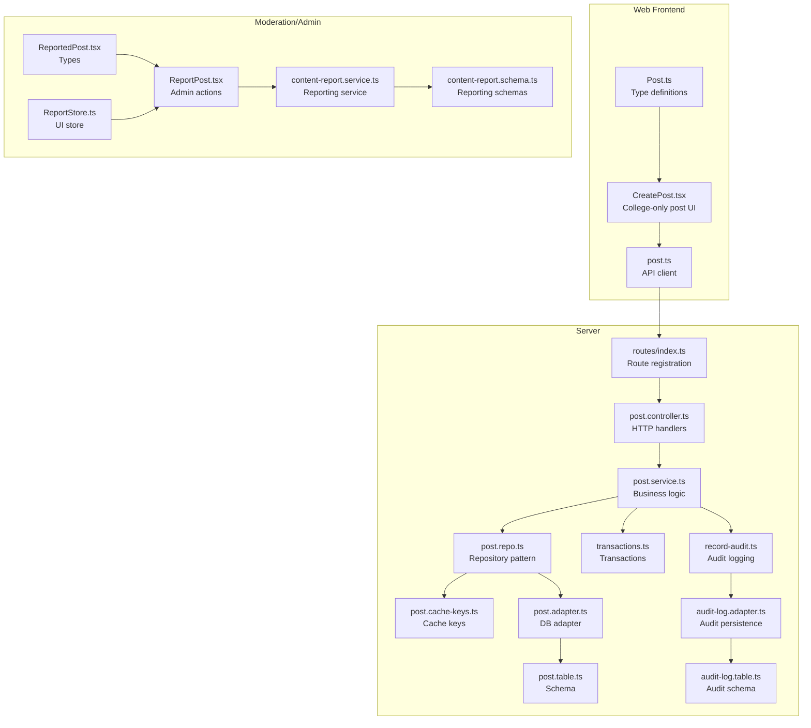
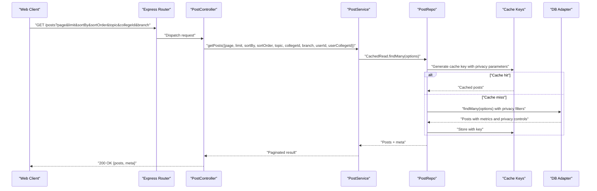
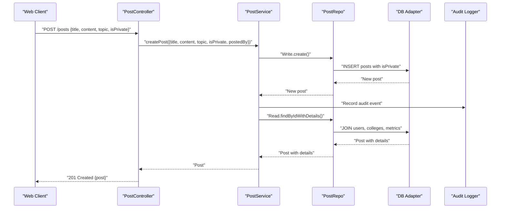
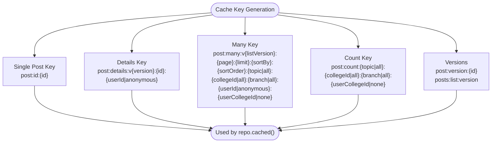
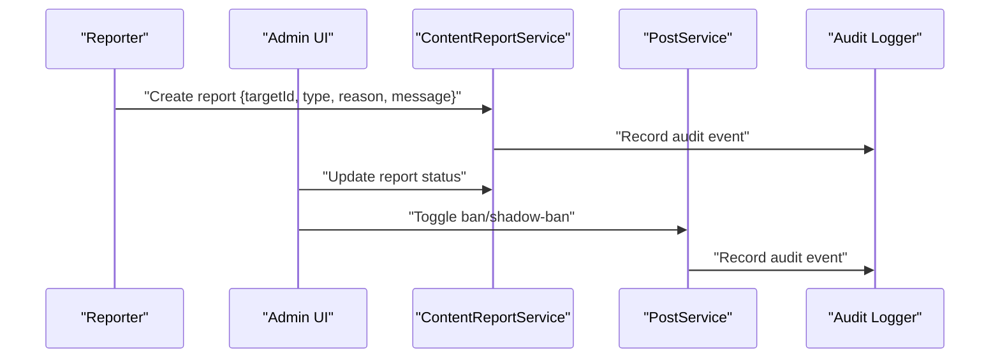
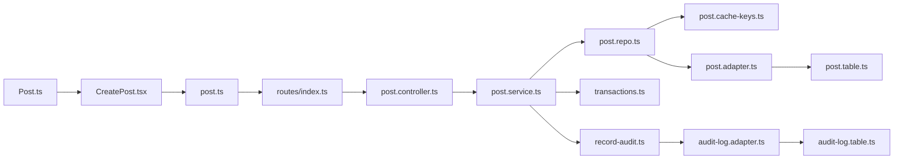

# Post Management

<cite>
**Referenced Files in This Document**
- [post.controller.ts](file://server/src/modules/post/post.controller.ts)
- [post.service.ts](file://server/src/modules/post/post.service.ts)
- [post.repo.ts](file://server/src/modules/post/post.repo.ts)
- [post.schema.ts](file://server/src/modules/post/post.schema.ts)
- [post.cache-keys.ts](file://server/src/modules/post/post.cache-keys.ts)
- [post.adapter.ts](file://server/src/infra/db/adapters/post.adapter.ts)
- [post.table.ts](file://server/src/infra/db/tables/post.table.ts)
- [index.ts](file://server/src/routes/index.ts)
- [post.ts](file://web/src/services/api/post.ts)
- [record-audit.ts](file://server/src/lib/record-audit.ts)
- [audit-log.adapter.ts](file://server/src/infra/db/adapters/audit-log.adapter.ts)
- [audit-log.table.ts](file://server/src/infra/db/tables/audit-log.table.ts)
- [audit.types.ts](file://server/src/modules/audit/audit.types.ts)
- [transactions.ts](file://server/src/infra/db/transactions.ts)
- [content-report.service.ts](file://server/src/modules/content-report/content-report.service.ts)
- [content-report.schema.ts](file://server/src/modules/content-report/content-report.schema.ts)
- [ReportPost.tsx](file://admin/src/components/general/ReportPost.tsx)
- [ReportedPost.tsx](file://admin/src/types/ReportedPost.tsx)
- [ReportStore.ts](file://admin/src/store/ReportStore.ts)
- [CreatePost.tsx](file://web/src/components/general/CreatePost.tsx)
- [Post.ts](file://web/src/types/Post.ts)
- [0001_early_masked_marvel.sql](file://server/drizzle/0001_early_masked_marvel.sql)
</cite>

## Update Summary
**Changes Made**
- Added comprehensive documentation for the college-only post feature with isPrivate column
- Updated privacy controls section to reflect enhanced authorization logic
- Enhanced anonymous post functionality documentation with college-only restrictions
- Updated cache key generation to include privacy-related parameters
- Added examples of college-only post creation and retrieval
- Updated database schema documentation to include isPrivate column

## Table of Contents
1. [Introduction](#introduction)
2. [Project Structure](#project-structure)
3. [Core Components](#core-components)
4. [Architecture Overview](#architecture-overview)
5. [Detailed Component Analysis](#detailed-component-analysis)
6. [Dependency Analysis](#dependency-analysis)
7. [Performance Considerations](#performance-considerations)
8. [Troubleshooting Guide](#troubleshooting-guide)
9. [Conclusion](#conclusion)
10. [Appendices](#appendices)

## Introduction
This document describes the Post Management service for the Flick platform. It covers the complete post lifecycle (creation, retrieval, updating, deletion), anonymous and authenticated access controls, topic categorization, content validation, caching via cache keys, pagination and sorting, branch-based filtering, visibility controls, repository pattern, transaction handling, audit logging, and moderation integration. The service now includes enhanced privacy controls with college-only posts through the isPrivate column, providing granular access control for institutional content sharing.

## Project Structure
The Post Management feature spans the backend server and the frontend web application:
- Backend: Express controllers, services, repositories, database adapters, cache key generators, and route registration.
- Frontend: API client module exposing typed post endpoints with college-only post creation interface.
- Moderation/Admin: Reporting and administrative actions for content safety.

**Diagram sources**
- [post.controller.ts](file://server/src/modules/post/post.controller.ts#L1-L124)
- [post.service.ts](file://server/src/modules/post/post.service.ts#L1-L263)
- [post.repo.ts](file://server/src/modules/post/post.repo.ts#L1-L97)
- [post.cache-keys.ts](file://server/src/modules/post/post.cache-keys.ts#L1-L33)
- [post.adapter.ts](file://server/src/infra/db/adapters/post.adapter.ts#L1-L421)
- [post.table.ts](file://server/src/infra/db/tables/post.table.ts#L1-L21)
- [index.ts](file://server/src/routes/index.ts#L1-L33)
- [post.ts](file://web/src/services/api/post.ts#L1-L48)
- [record-audit.ts](file://server/src/lib/record-audit.ts#L1-L20)
- [audit-log.adapter.ts](file://server/src/infra/db/adapters/audit-log.adapter.ts#L1-L8)
- [audit-log.table.ts](file://server/src/infra/db/tables/audit-log.table.ts#L49-L73)
- [transactions.ts](file://server/src/infra/db/transactions.ts#L1-L20)
- [content-report.service.ts](file://server/src/modules/content-report/content-report.service.ts#L1-L159)
- [content-report.schema.ts](file://server/src/modules/content-report/content-report.schema.ts#L1-L47)
- [ReportPost.tsx](file://admin/src/components/general/ReportPost.tsx#L1-L98)
- [ReportedPost.tsx](file://admin/src/types/ReportedPost.tsx#L1-L28)
- [ReportStore.ts](file://admin/src/store/ReportStore.ts#L1-L42)
- [CreatePost.tsx](file://web/src/components/general/CreatePost.tsx#L240-L276)
- [Post.ts](file://web/src/types/Post.ts#L1-L23)

**Section sources**
- [index.ts](file://server/src/routes/index.ts#L17-L28)
- [post.controller.ts](file://server/src/modules/post/post.controller.ts#L1-L124)
- [post.service.ts](file://server/src/modules/post/post.service.ts#L1-L263)
- [post.repo.ts](file://server/src/modules/post/post.repo.ts#L1-L97)
- [post.cache-keys.ts](file://server/src/modules/post/post.cache-keys.ts#L1-L33)
- [post.adapter.ts](file://server/src/infra/db/adapters/post.adapter.ts#L1-L421)
- [post.table.ts](file://server/src/infra/db/tables/post.table.ts#L1-L21)
- [post.ts](file://web/src/services/api/post.ts#L1-L48)
- [record-audit.ts](file://server/src/lib/record-audit.ts#L1-L20)
- [audit-log.adapter.ts](file://server/src/infra/db/adapters/audit-log.adapter.ts#L1-L8)
- [audit-log.table.ts](file://server/src/infra/db/tables/audit-log.table.ts#L49-L73)
- [transactions.ts](file://server/src/infra/db/transactions.ts#L1-L20)
- [content-report.service.ts](file://server/src/modules/content-report/content-report.service.ts#L1-L159)
- [content-report.schema.ts](file://server/src/modules/content-report/content-report.schema.ts#L1-L47)
- [ReportPost.tsx](file://admin/src/components/general/ReportPost.tsx#L1-L98)
- [ReportedPost.tsx](file://admin/src/types/ReportedPost.tsx#L1-L28)
- [ReportStore.ts](file://admin/src/store/ReportStore.ts#L1-L42)
- [CreatePost.tsx](file://web/src/components/general/CreatePost.tsx#L240-L276)
- [Post.ts](file://web/src/types/Post.ts#L1-L23)

## Core Components
- Controller: Parses requests, validates inputs, orchestrates service calls, and returns standardized HTTP responses.
- Service: Implements business logic, enforces authorization, performs data transformations, and records audit events.
- Repository: Encapsulates read/write operations and integrates caching via cache keys.
- Adapter: Maps to database queries using Drizzle ORM with CTEs for engagement metrics and joins for author/college details.
- Cache Keys: Generates deterministic cache keys for single post, lists, counts, and versions to enable cache invalidation and hit rates.
- Routes: Exposes endpoints under /api/v1/posts.
- Web API Client: Provides typed methods for CRUD and trending retrieval.
- Moderation Integration: Reporting service and admin UI for banning/shadow-banning posts and users.
- Privacy Controls: Enhanced authorization logic for college-only posts with isPrivate column.

**Section sources**
- [post.controller.ts](file://server/src/modules/post/post.controller.ts#L1-L124)
- [post.service.ts](file://server/src/modules/post/post.service.ts#L1-L263)
- [post.repo.ts](file://server/src/modules/post/post.repo.ts#L1-L97)
- [post.adapter.ts](file://server/src/infra/db/adapters/post.adapter.ts#L1-L421)
- [post.cache-keys.ts](file://server/src/modules/post/post.cache-keys.ts#L1-L33)
- [index.ts](file://server/src/routes/index.ts#L17-L28)
- [post.ts](file://web/src/services/api/post.ts#L1-L48)
- [content-report.service.ts](file://server/src/modules/content-report/content-report.service.ts#L1-L159)
- [post.service.ts](file://server/src/modules/post/post.service.ts#L60-L73)

## Architecture Overview
The Post Management service follows a layered architecture with enhanced privacy controls:
- Presentation: HTTP endpoints handled by controllers.
- Application: Services encapsulate domain logic and orchestrate repositories and external integrations.
- Persistence: Repository delegates to adapters backed by Drizzle ORM and a relational schema.
- Caching: Cache keys are generated per query signature and versioned to invalidate stale data.
- Observability: Audit logs capture post lifecycle events with contextual metadata.
- Privacy: Enhanced authorization logic for college-only posts with isPrivate column.

**Diagram sources**
- [post.controller.ts](file://server/src/modules/post/post.controller.ts#L23-L42)
- [post.service.ts](file://server/src/modules/post/post.service.ts#L79-L123)
- [post.repo.ts](file://server/src/modules/post/post.repo.ts#L17-L45)
- [post.cache-keys.ts](file://server/src/modules/post/post.cache-keys.ts#L14-L27)
- [post.adapter.ts](file://server/src/infra/db/adapters/post.adapter.ts#L157-L332)

## Detailed Component Analysis

### Post Lifecycle: Creation, Retrieval, Editing, Deletion
- Creation: Controller validates payload against schema, extracts user identity, and delegates to service. Service trims and normalizes inputs, persists via repository write, records audit, and returns enriched post details. The isPrivate field is now supported for college-only post creation.
- Retrieval: Controller parses query parameters, passes user context, and calls service. Service fetches from cached read, applies visibility rules including privacy controls, and enriches with engagement metrics.
- Editing: Controller validates updates, checks ownership, and calls service. Service enforces authorization, sanitizes updates including privacy settings, persists changes, and records audit.
- Deletion: Controller validates ID, checks ownership, and invokes service. Service deletes via repository write and records audit.

**Diagram sources**
- [post.controller.ts](file://server/src/modules/post/post.controller.ts#L8-L21)
- [post.service.ts](file://server/src/modules/post/post.service.ts#L8-L45)
- [post.repo.ts](file://server/src/modules/post/post.repo.ts#L89-L94)
- [post.adapter.ts](file://server/src/infra/db/adapters/post.adapter.ts#L26-L155)
- [record-audit.ts](file://server/src/lib/record-audit.ts#L4-L17)

**Section sources**
- [post.controller.ts](file://server/src/modules/post/post.controller.ts#L8-L21)
- [post.service.ts](file://server/src/modules/post/post.service.ts#L8-L45)
- [post.repo.ts](file://server/src/modules/post/post.repo.ts#L89-L94)
- [post.adapter.ts](file://server/src/infra/db/adapters/post.adapter.ts#L26-L155)
- [record-audit.ts](file://server/src/lib/record-audit.ts#L4-L17)

### Enhanced Privacy Controls and College-Only Posts
- **College-Only Posts**: Posts marked with isPrivate=true are accessible only to users from the same college as the post author.
- **Anonymous Access**: When no user is present, only public posts (isPrivate=false) are visible.
- **Authentication Requirement**: Viewing college-only posts requires authentication; unauthenticated users receive unauthorized access errors.
- **College Verification**: Authenticated users must belong to the same college as the post author; cross-college access is denied.
- **Database Filters**: The adapter applies privacy filters using OR conditions for authenticated users and AND conditions for college verification.

**Updated** Enhanced privacy controls now include college-only post functionality with comprehensive authorization logic.

**Section sources**
- [post.service.ts](file://server/src/modules/post/post.service.ts#L60-L73)
- [post.adapter.ts](file://server/src/infra/db/adapters/post.adapter.ts#L343-L356)
- [post.table.ts](file://server/src/infra/db/tables/post.table.ts#L11)

### Anonymous Post Functionality and Visibility Controls
- Anonymous access: When no user is present, only public posts (isPrivate=false) are visible.
- College-only posts: Requires authenticated user whose college matches the post author's college.
- Enforcement occurs during retrieval by checking user context and applying database filters.

**Updated** Enhanced with college-only post restrictions and improved authorization logic.

**Section sources**
- [post.service.ts](file://server/src/modules/post/post.service.ts#L60-L73)
- [post.adapter.ts](file://server/src/infra/db/adapters/post.adapter.ts#L343-L356)

### Topic Categorization System
- Topics are validated against a strict enumeration with support for case-insensitive matching and URL-decoded normalization.
- Filtering is applied in the adapter to restrict results to the requested topic.

**Section sources**
- [post.schema.ts](file://server/src/modules/post/post.schema.ts#L3-L15)
- [post.schema.ts](file://server/src/modules/post/post.schema.ts#L44-L69)
- [post.adapter.ts](file://server/src/infra/db/adapters/post.adapter.ts#L247-L250)

### Content Validation Mechanisms
- Zod schemas enforce minimum/maximum lengths, required fields, UUID formats, and enum constraints for topics.
- Service trims whitespace for title and content prior to persistence.
- isPrivate field is optional and defaults to false for backward compatibility.

**Updated** Added validation for isPrivate field in create and update schemas.

**Section sources**
- [post.schema.ts](file://server/src/modules/post/post.schema.ts#L17-L33)
- [post.service.ts](file://server/src/modules/post/post.service.ts#L21-L27)

### Caching Strategy Using Cache Keys
- Single post: Dedicated key per post ID; details key includes a version to invalidate on updates.
- List queries: Composite key encoding page, limit, sort parameters, topic, collegeId, branch, and user identifiers including privacy parameters.
- Counts: Separate key for counts filtered similarly to list queries.
- Version keys: Global list version and per-post version enable cache invalidation without touching data.

**Updated** Cache keys now include privacy-related parameters for college-only post filtering.

**Diagram sources**
- [post.cache-keys.ts](file://server/src/modules/post/post.cache-keys.ts#L4-L31)

**Section sources**
- [post.cache-keys.ts](file://server/src/modules/post/post.cache-keys.ts#L1-L33)
- [post.repo.ts](file://server/src/modules/post/post.repo.ts#L7-L56)

### Pagination and Sorting
- Pagination: Page and limit are normalized with minimum/maximum bounds; offset calculated as (page - 1) * limit.
- Sorting: Sort by createdAt, updatedAt, or views with ascending/descending order.
- Meta: Total count, total pages, current page, limit, and hasMore flag included in response.

**Section sources**
- [post.schema.ts](file://server/src/modules/post/post.schema.ts#L40-L43)
- [post.adapter.ts](file://server/src/infra/db/adapters/post.adapter.ts#L174-L298)
- [post.service.ts](file://server/src/modules/post/post.service.ts#L108-L131)

### Branch-Based Filtering
- Filtering by branch is supported via a join with users and equality condition on branch.
- Combined with topic, collegeId, and visibility rules.

**Section sources**
- [post.adapter.ts](file://server/src/infra/db/adapters/post.adapter.ts#L256-L258)

### Post Search Functionality
- Topic search supports exact match, case-insensitive match, and URL-decoded normalization.
- Additional filters (collegeId, branch) are available via query parameters.

**Section sources**
- [post.schema.ts](file://server/src/modules/post/post.schema.ts#L44-L69)
- [post.adapter.ts](file://server/src/infra/db/adapters/post.adapter.ts#L252-L258)

### Trending Post Calculation
- Trending is computed by retrieving top posts sorted by views with a fixed limit.
- Frontend types define a simple trending model for rendering.

**Section sources**
- [post.ts](file://web/src/services/api/post.ts#L39-L47)
- [post.adapter.ts](file://server/src/infra/db/adapters/post.adapter.ts#L262-L298)

### Content Moderation Integration
- Reporting: Users can create reports for posts; service validates and records audit.
- Admin Actions: Admin UI supports banning/unbanning posts, shadow-banning, and user sanctions.
- Status Updates: Reports can be resolved or ignored; bulk deletions are supported.

**Diagram sources**
- [content-report.service.ts](file://server/src/modules/content-report/content-report.service.ts#L9-L39)
- [content-report.schema.ts](file://server/src/modules/content-report/content-report.schema.ts#L5-L14)
- [ReportPost.tsx](file://admin/src/components/general/ReportPost.tsx#L23-L85)
- [post.service.ts](file://server/src/modules/post/post.service.ts#L35-L40)

**Section sources**
- [content-report.service.ts](file://server/src/modules/content-report/content-report.service.ts#L1-L159)
- [content-report.schema.ts](file://server/src/modules/content-report/content-report.schema.ts#L1-L47)
- [ReportPost.tsx](file://admin/src/components/general/ReportPost.tsx#L1-L98)
- [ReportedPost.tsx](file://admin/src/types/ReportedPost.tsx#L1-L28)
- [ReportStore.ts](file://admin/src/store/ReportStore.ts#L1-L42)

### Relationship Between Posts and Users
- Posts reference authors via postedBy, linking to users and colleges.
- Adapter joins provide author username, branch, and college details alongside post data.

**Section sources**
- [post.adapter.ts](file://server/src/infra/db/adapters/post.adapter.ts#L106-L154)

### Post Repository Pattern and Transaction Handling
- Repository separates CachedRead, Read, and Write concerns; CachedRead uses cache keys for performance.
- Transactions: Centralized transaction runner ensures consistent execution across operations.

**Section sources**
- [post.repo.ts](file://server/src/modules/post/post.repo.ts#L6-L95)
- [transactions.ts](file://server/src/infra/db/transactions.ts#L1-L20)

### Audit Logging for Post Operations
- Audit entries capture action, entity type, entity ID, before/after snapshots, and device metadata.
- Audit logs persisted to a dedicated table with indexes for efficient querying.

**Section sources**
- [record-audit.ts](file://server/src/lib/record-audit.ts#L4-L17)
- [audit-log.adapter.ts](file://server/src/infra/db/adapters/audit-log.adapter.ts#L5-L8)
- [audit-log.table.ts](file://server/src/infra/db/tables/audit-log.table.ts#L49-L73)
- [audit.types.ts](file://server/src/modules/audit/audit.types.ts#L7-L21)

### Examples of Post CRUD Operations
- Create: Send POST /api/v1/posts with {title, content, topic, isPrivate}.
- Retrieve: GET /api/v1/posts with optional {page, limit, sortBy, sortOrder, topic, collegeId, branch}.
- Retrieve by ID: GET /api/v1/posts/{id}.
- Update: PATCH /api/v1/posts/{id} with partial fields including isPrivate.
- Delete: DELETE /api/v1/posts/{id}.
- Increment Views: POST /api/v1/posts/{id}/view.
- Trending: GET /api/v1/posts?sortBy=views&sortOrder=desc&limit=5.

**Updated** Added examples for college-only post creation and privacy controls.

**Section sources**
- [post.controller.ts](file://server/src/modules/post/post.controller.ts#L8-L94)
- [post.ts](file://web/src/services/api/post.ts#L14-L47)

### Database Schema Enhancement
- **isPrivate Column**: Added boolean column to posts table with default false for backward compatibility.
- **Migration**: Simple ALTER TABLE statement adds the column to existing posts table.
- **Privacy Enforcement**: Database-level filtering ensures only authorized users can access college-only posts.

**Updated** Database schema now includes isPrivate column for privacy controls.

**Section sources**
- [post.table.ts](file://server/src/infra/db/tables/post.table.ts#L11)
- [0001_early_masked_marvel.sql](file://server/drizzle/0001_early_masked_marvel.sql#L1)

## Dependency Analysis

**Diagram sources**
- [post.controller.ts](file://server/src/modules/post/post.controller.ts#L1-L124)
- [post.service.ts](file://server/src/modules/post/post.service.ts#L1-L263)
- [post.repo.ts](file://server/src/modules/post/post.repo.ts#L1-L97)
- [post.cache-keys.ts](file://server/src/modules/post/post.cache-keys.ts#L1-L33)
- [post.adapter.ts](file://server/src/infra/db/adapters/post.adapter.ts#L1-L421)
- [post.table.ts](file://server/src/infra/db/tables/post.table.ts#L1-L21)
- [transactions.ts](file://server/src/infra/db/transactions.ts#L1-L20)
- [record-audit.ts](file://server/src/lib/record-audit.ts#L1-L20)
- [audit-log.adapter.ts](file://server/src/infra/db/adapters/audit-log.adapter.ts#L1-L8)
- [audit-log.table.ts](file://server/src/infra/db/tables/audit-log.table.ts#L49-L73)
- [index.ts](file://server/src/routes/index.ts#L17-L28)
- [post.ts](file://web/src/services/api/post.ts#L1-L48)
- [CreatePost.tsx](file://web/src/components/general/CreatePost.tsx#L240-L276)
- [Post.ts](file://web/src/types/Post.ts#L1-L23)

**Section sources**
- [post.controller.ts](file://server/src/modules/post/post.controller.ts#L1-L124)
- [post.service.ts](file://server/src/modules/post/post.service.ts#L1-L263)
- [post.repo.ts](file://server/src/modules/post/post.repo.ts#L1-L97)
- [post.cache-keys.ts](file://server/src/modules/post/post.cache-keys.ts#L1-L33)
- [post.adapter.ts](file://server/src/infra/db/adapters/post.adapter.ts#L1-L421)
- [post.table.ts](file://server/src/infra/db/tables/post.table.ts#L1-L21)
- [transactions.ts](file://server/src/infra/db/transactions.ts#L1-L20)
- [record-audit.ts](file://server/src/lib/record-audit.ts#L1-L20)
- [audit-log.adapter.ts](file://server/src/infra/db/adapters/audit-log.adapter.ts#L1-L8)
- [audit-log.table.ts](file://server/src/infra/db/tables/audit-log.table.ts#L49-L73)
- [index.ts](file://server/src/routes/index.ts#L17-L28)
- [post.ts](file://web/src/services/api/post.ts#L1-L48)
- [CreatePost.tsx](file://web/src/components/general/CreatePost.tsx#L240-L276)
- [Post.ts](file://web/src/types/Post.ts#L1-L23)

## Performance Considerations
- Caching: Use composite cache keys for list queries and version keys to invalidate efficiently. Prefer CachedRead for hot paths.
- Queries: Leverage CTEs for engagement metrics to avoid N+1 queries; ensure indexes on frequently filtered columns.
- Pagination: Cap limit to prevent oversized payloads; compute totals only when necessary.
- Sorting: Ensure appropriate indexes for sort fields (createdAt, updatedAt, views).
- Transactions: Wrap multi-step operations to maintain consistency and reduce contention.
- Audit Sampling: Use sampling to reduce audit overhead in high-throughput scenarios.
- Privacy Filtering: Database-level privacy filters reduce application-level processing overhead.

## Troubleshooting Guide
- Unauthorized Access: Verify user context and college matching for private posts.
- Not Found Errors: Confirm post existence and cache freshness; consider clearing related cache keys.
- Validation Failures: Review Zod schemas for required fields and length constraints.
- Audit Gaps: Ensure observability context is initialized and audit buffer is flushed.
- Privacy Issues: Check isPrivate column values and user college verification logic.

**Section sources**
- [post.service.ts](file://server/src/modules/post/post.service.ts#L50-L73)
- [post.schema.ts](file://server/src/modules/post/post.schema.ts#L17-L33)
- [record-audit.ts](file://server/src/lib/record-audit.ts#L4-L17)

## Conclusion
The Post Management service implements a robust, scalable system for content lifecycle operations with strong validation, caching, pagination, and visibility controls. The enhanced privacy controls with college-only posts provide granular access control through the isPrivate column, ensuring institutional content sharing while maintaining comprehensive audit trails. The repository pattern and transaction handling ensure reliability, while cache keys and composite query signatures optimize performance for large-scale deployments.

## Appendices

### API Endpoints Summary
- POST /api/v1/posts
- GET /api/v1/posts
- GET /api/v1/posts/{id}
- PATCH /api/v1/posts/{id}
- DELETE /api/v1/posts/{id}
- POST /api/v1/posts/{id}/view
- GET /api/v1/posts (trending)

**Section sources**
- [post.controller.ts](file://server/src/modules/post/post.controller.ts#L8-L94)
- [post.ts](file://web/src/services/api/post.ts#L14-L47)

### College-Only Post Creation Interface
- **Frontend Implementation**: CreatePost component includes a toggle switch for college-only posts with explanatory text.
- **Backend Validation**: Zod schemas validate isPrivate field presence and type.
- **Authorization Logic**: Service enforces college verification for private posts.

**Section sources**
- [CreatePost.tsx](file://web/src/components/general/CreatePost.tsx#L240-L276)
- [post.schema.ts](file://server/src/modules/post/post.schema.ts#L17-L33)
- [post.service.ts](file://server/src/modules/post/post.service.ts#L60-L73)