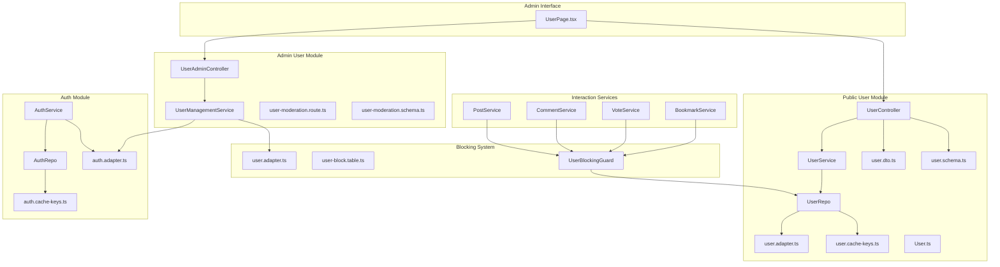
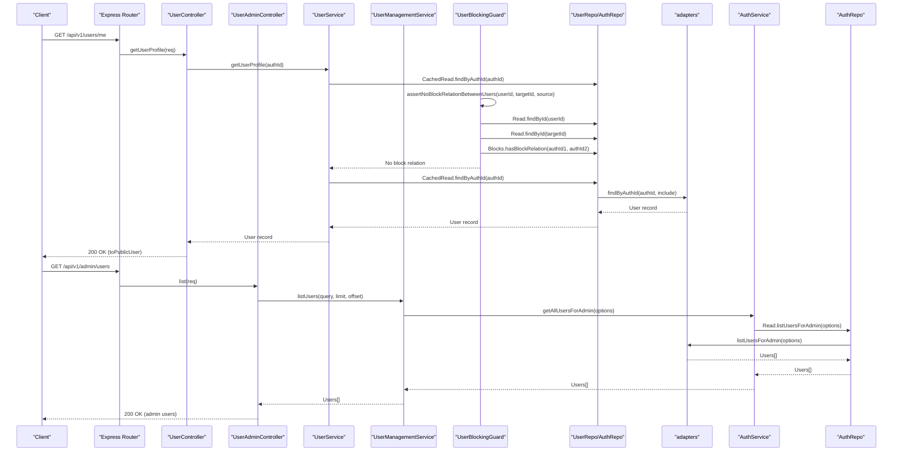
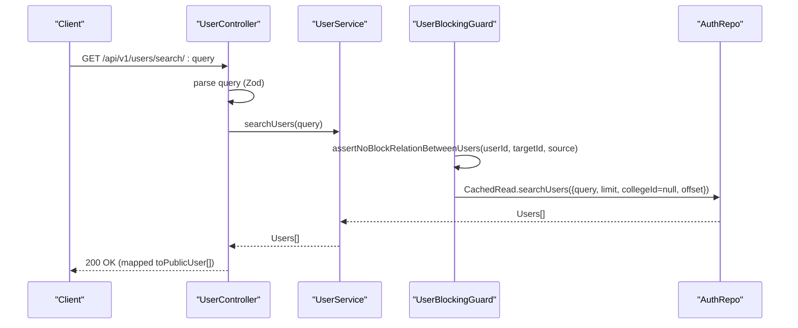
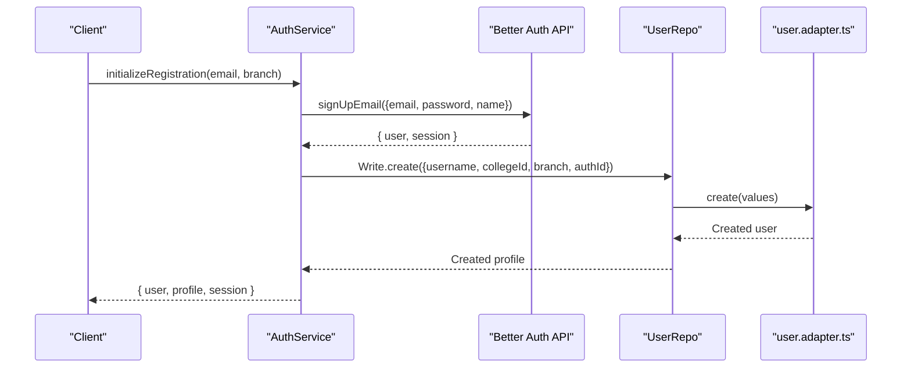
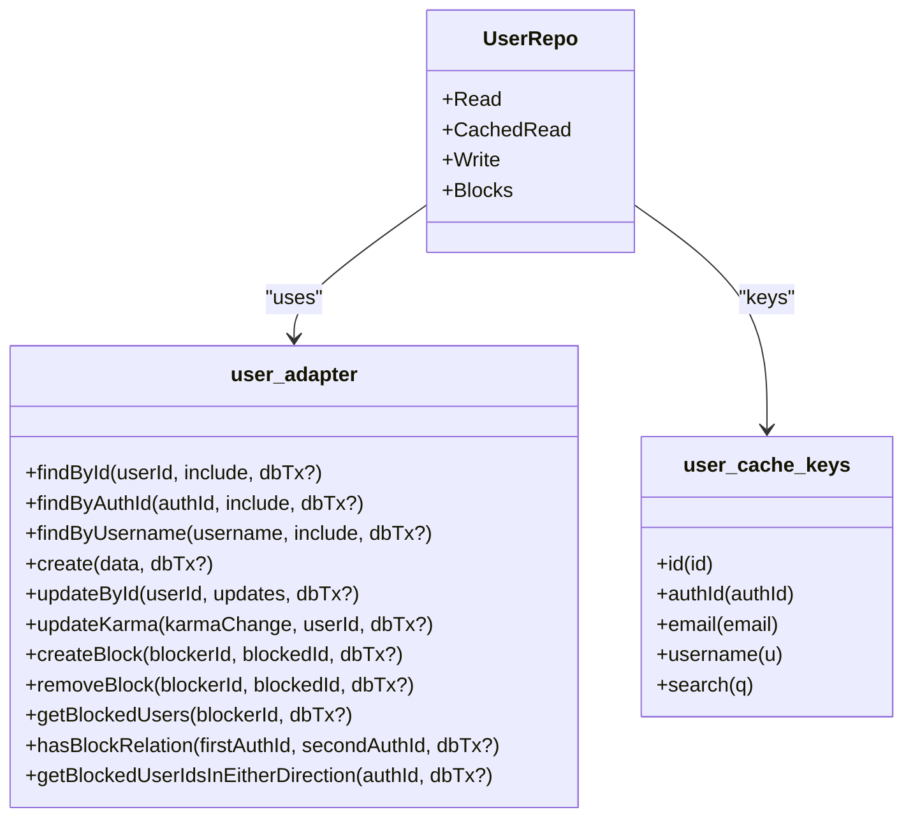
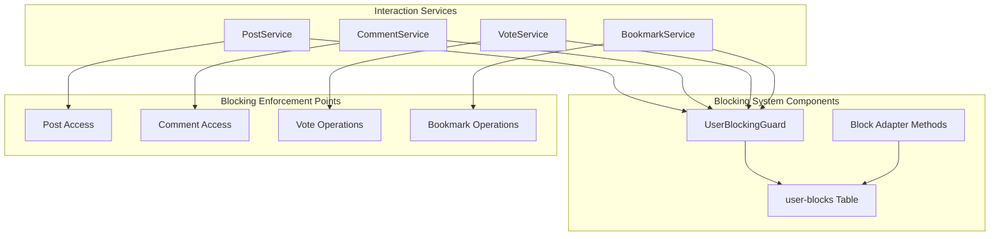
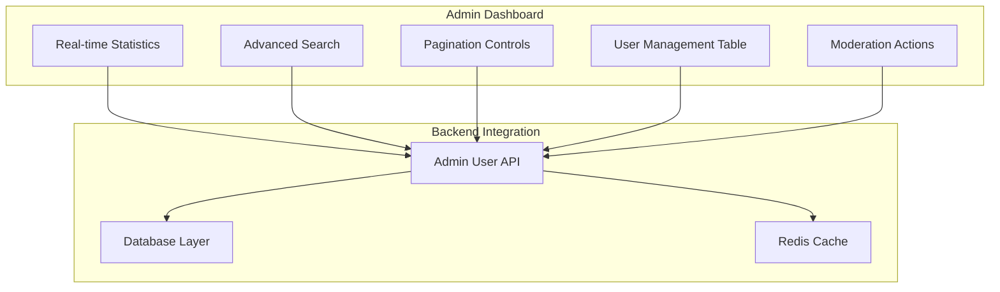
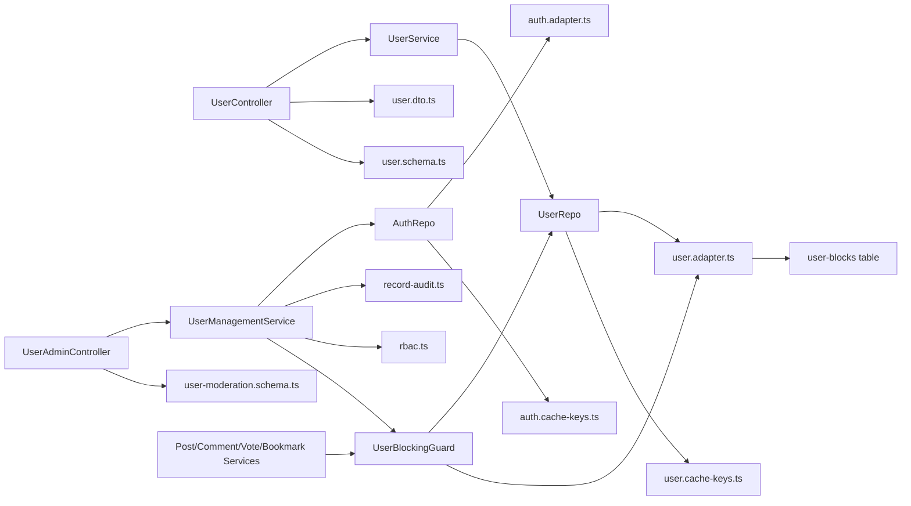
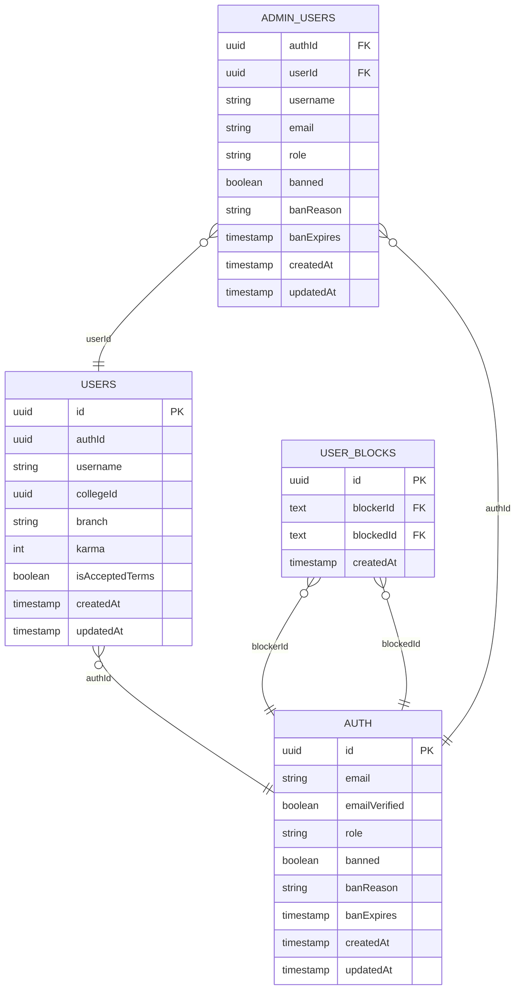

# User Management

<cite>
**Referenced Files in This Document**
- [user.service.ts](file://server/src/modules/user/user.service.ts)
- [user.repo.ts](file://server/src/modules/user/user.repo.ts)
- [user.cache-keys.ts](file://server/src/modules/user/user.cache-keys.ts)
- [user.schema.ts](file://server/src/modules/user/user.schema.ts)
- [user.dto.ts](file://server/src/modules/user/user.dto.ts)
- [user.route.ts](file://server/src/modules/user/user.route.ts)
- [user.controller.ts](file://server/src/modules/user/user.controller.ts)
- [user.adapter.ts](file://server/src/infra/db/adapters/user.adapter.ts)
- [User.ts](file://server/src/shared/types/User.ts)
- [auth.service.ts](file://server/src/modules/auth/auth.service.ts)
- [auth.repo.ts](file://server/src/modules/auth/auth.repo.ts)
- [auth.cache-keys.ts](file://server/src/modules/auth/auth.cache-keys.ts)
- [auth.adapter.ts](file://server/src/infra/db/adapters/auth.adapter.ts)
- [rbac.ts](file://server/src/core/security/rbac.ts)
- [record-audit.ts](file://server/src/lib/record-audit.ts)
- [index.ts](file://server/src/routes/index.ts)
- [UserPage.tsx](file://admin/src/pages/UserPage.tsx)
- [user-moderation.controller.ts](file://server/src/modules/moderation/user/user-moderation.controller.ts)
- [user-moderation.service.ts](file://server/src/modules/moderation/user/user-moderation.service.ts)
- [user-moderation.schema.ts](file://server/src/modules/moderation/user/user-moderation.schema.ts)
- [user-moderation.route.ts](file://server/src/modules/moderation/user/user-moderation.route.ts)
- [block.guard.ts](file://server/src/modules/user/block.guard.ts)
- [user-block.table.ts](file://server/src/infra/db/tables/user-block.table.ts)
- [comment.service.ts](file://server/src/modules/comment/comment.service.ts)
- [post.service.ts](file://server/src/modules/post/post.service.ts)
- [vote.service.ts](file://server/src/modules/vote/vote.service.ts)
- [bookmark.service.ts](file://server/src/modules/bookmark/bookmark.service.ts)
</cite>

## Update Summary
**Changes Made**
- Added comprehensive user blocking system with user blocking guard implementation
- Enhanced user interaction restrictions across posts, comments, votes, and bookmarks
- Implemented bidirectional block relationship detection and enforcement
- Integrated blocking capabilities into moderation workflows
- Added user-block database table and adapter methods for block management
- Updated service layer to enforce blocking restrictions during user interactions

## Table of Contents
1. [Introduction](#introduction)
2. [Project Structure](#project-structure)
3. [Core Components](#core-components)
4. [Architecture Overview](#architecture-overview)
5. [Detailed Component Analysis](#detailed-component-analysis)
6. [User Blocking System](#user-blocking-system)
7. [Enhanced User Interaction Restrictions](#enhanced-user-interaction-restrictions)
8. [User Administration System](#user-administration-system)
9. [Enhanced User Search and Filtering](#enhanced-user-search-and-filtering)
10. [Real-Time Statistics and Analytics](#real-time-statistics-and-analytics)
11. [Pagination and Performance Optimization](#pagination-and-performance-optimization)
12. [Admin User Management Workflows](#admin-user-management-workflows)
13. [Dependency Analysis](#dependency-analysis)
14. [Performance Considerations](#performance-considerations)
15. [Troubleshooting Guide](#troubleshooting-guide)
16. [Conclusion](#conclusion)
17. [Appendices](#appendices)

## Introduction
This document describes the comprehensive user management service for the Flick platform, covering user profile creation, updates, retrieval, and search operations. The system now includes advanced administrative capabilities with user search functionality, pagination support, real-time statistics, comprehensive user blocking and interaction restrictions, and enhanced user administration features. It details the integration with authentication services, caching strategies using cache keys, data validation through Zod schemas, user DTO patterns, API endpoints, error handling mechanisms, and audit trail generation. The document explains the relationship between user profiles and authentication records while outlining permission systems, role-based access control, and comprehensive user moderation workflows including blocking, suspension, and interaction restrictions.

## Project Structure
The user management module has been expanded to include both public user endpoints and comprehensive admin-only functionality, along with enhanced blocking capabilities. The system now encompasses:
- Public user management for standard user operations
- Advanced admin user management with moderation capabilities including blocking
- Comprehensive user blocking system with bidirectional relationship detection
- Enhanced interaction restrictions across posts, comments, votes, and bookmarks
- Real-time statistics and analytics dashboard
- Enhanced search and filtering mechanisms
- Comprehensive pagination support
- User moderation workflows including blocking and suspension

**Diagram sources**
- [user.controller.ts](file://server/src/modules/user/user.controller.ts#L1-L46)
- [user.service.ts](file://server/src/modules/user/user.service.ts#L1-L86)
- [user.repo.ts](file://server/src/modules/user/user.repo.ts#L1-L50)
- [user.cache-keys.ts](file://server/src/modules/user/user.cache-keys.ts#L1-L9)
- [user.dto.ts](file://server/src/modules/user/user.dto.ts#L1-L17)
- [user.schema.ts](file://server/src/modules/user/user.schema.ts#L1-L39)
- [user.adapter.ts](file://server/src/infra/db/adapters/user.adapter.ts#L1-L522)
- [User.ts](file://server/src/shared/types/User.ts#L1-L4)
- [block.guard.ts](file://server/src/modules/user/block.guard.ts#L1-L34)
- [user-block.table.ts](file://server/src/infra/db/tables/user-block.table.ts#L1-L34)
- [post.service.ts](file://server/src/modules/post/post.service.ts#L1-L358)
- [comment.service.ts](file://server/src/modules/comment/comment.service.ts#L1-L325)
- [vote.service.ts](file://server/src/modules/vote/vote.service.ts#L1-L248)
- [bookmark.service.ts](file://server/src/modules/bookmark/bookmark.service.ts#L1-L136)
- [user-moderation.controller.ts](file://server/src/modules/moderation/user/user-moderation.controller.ts#L1-L75)
- [user-moderation.service.ts](file://server/src/modules/moderation/user/user-moderation.service.ts#L1-L167)
- [user-moderation.route.ts](file://server/src/modules/moderation/user/user-moderation.route.ts#L1-L16)
- [user-moderation.schema.ts](file://server/src/modules/moderation/user/user-moderation.schema.ts#L1-L28)
- [auth.service.ts](file://server/src/modules/auth/auth.service.ts#L1-L347)
- [auth.repo.ts](file://server/src/modules/auth/auth.repo.ts#L1-L35)
- [auth.cache-keys.ts](file://server/src/modules/auth/auth.cache-keys.ts#L1-L8)
- [auth.adapter.ts](file://server/src/infra/db/adapters/auth.adapter.ts#L1-L180)
- [UserPage.tsx](file://admin/src/pages/UserPage.tsx#L1-L235)

**Section sources**
- [user.controller.ts](file://server/src/modules/user/user.controller.ts#L1-L46)
- [user.service.ts](file://server/src/modules/user/user.service.ts#L1-L86)
- [user.repo.ts](file://server/src/modules/user/user.repo.ts#L1-L50)
- [user.cache-keys.ts](file://server/src/modules/user/user.cache-keys.ts#L1-L9)
- [user.schema.ts](file://server/src/modules/user/user.schema.ts#L1-L39)
- [user.dto.ts](file://server/src/modules/user/user.dto.ts#L1-L17)
- [user.adapter.ts](file://server/src/infra/db/adapters/user.adapter.ts#L1-L522)
- [User.ts](file://server/src/shared/types/User.ts#L1-L4)
- [block.guard.ts](file://server/src/modules/user/block.guard.ts#L1-L34)
- [user-block.table.ts](file://server/src/infra/db/tables/user-block.table.ts#L1-L34)
- [post.service.ts](file://server/src/modules/post/post.service.ts#L1-L358)
- [comment.service.ts](file://server/src/modules/comment/comment.service.ts#L1-L325)
- [vote.service.ts](file://server/src/modules/vote/vote.service.ts#L1-L248)
- [bookmark.service.ts](file://server/src/modules/bookmark/bookmark.service.ts#L1-L136)
- [user-moderation.controller.ts](file://server/src/modules/moderation/user/user-moderation.controller.ts#L1-L75)
- [user-moderation.service.ts](file://server/src/modules/moderation/user/user-moderation.service.ts#L1-L167)
- [user-moderation.route.ts](file://server/src/modules/moderation/user/user-moderation.route.ts#L1-L16)
- [user-moderation.schema.ts](file://server/src/modules/moderation/user/user-moderation.schema.ts#L1-L28)
- [auth.service.ts](file://server/src/modules/auth/auth.service.ts#L1-L347)
- [auth.repo.ts](file://server/src/modules/auth/auth.repo.ts#L1-L35)
- [auth.cache-keys.ts](file://server/src/modules/auth/auth.cache-keys.ts#L1-L8)
- [auth.adapter.ts](file://server/src/infra/db/adapters/auth.adapter.ts#L1-L180)
- [UserPage.tsx](file://admin/src/pages/UserPage.tsx#L1-L235)

## Core Components
The user management system now consists of dual-layer architecture serving both public users and administrators, enhanced with comprehensive blocking capabilities:

### Public User Components
- **User controller**: Exposes endpoints for retrieving profiles by ID, searching users, fetching current user profile, and accepting terms
- **User service**: Implements business logic for profile retrieval, user search, and term acceptance with audit logging
- **User repository**: Provides read/write operations backed by database adapters and cached reads using user-specific cache keys
- **User adapter**: Encapsulates database queries and updates for user entities with optional joins to related tables

### Blocking System Components
- **User blocking guard**: Centralized enforcement mechanism that prevents interactions between blocked users
- **User-block table**: Database schema for storing bidirectional block relationships
- **Block adapter methods**: Database operations for creating, removing, and checking block relationships
- **Bidirectional detection**: Validates block relationships in either direction (blocker-blocked or blocked-blocker)

### Enhanced Interaction Services
- **Post service**: Enforces blocking restrictions when accessing posts and post authors
- **Comment service**: Prevents commenting and viewing comments from blocked users
- **Vote service**: Blocks voting operations between users who have blocked each other
- **Bookmark service**: Restricts bookmark creation and viewing for blocked users

### Admin User Components
- **User admin controller**: Manages comprehensive user administration including listing, searching, blocking, and suspension
- **User management service**: Handles complex moderation workflows with validation and audit trails
- **User moderation routes**: Protected endpoints requiring admin/superadmin roles
- **Advanced search schemas**: Type-safe filtering for email and username searches

### Shared Infrastructure
- **User DTOs**: Transform internal user records into public or internal representations
- **User schemas**: Define Zod schemas for endpoint parameters and payloads
- **Cache keys**: Standardized Redis key patterns for user entities and search queries
- **Auth integration**: Creation of user profiles during registration and retrieval of profiles linked to auth identifiers
- **RBAC**: Computes permissions from user roles for access control
- **Audit logging**: Records user actions with contextual metadata

**Section sources**
- [user.controller.ts](file://server/src/modules/user/user.controller.ts#L1-L46)
- [user.service.ts](file://server/src/modules/user/user.service.ts#L1-L86)
- [user.repo.ts](file://server/src/modules/user/user.repo.ts#L1-L50)
- [user.adapter.ts](file://server/src/infra/db/adapters/user.adapter.ts#L1-L522)
- [user.dto.ts](file://server/src/modules/user/user.dto.ts#L1-L17)
- [user.schema.ts](file://server/src/modules/user/user.schema.ts#L1-L39)
- [user.cache-keys.ts](file://server/src/modules/user/user.cache-keys.ts#L1-L9)
- [block.guard.ts](file://server/src/modules/user/block.guard.ts#L1-L34)
- [user-block.table.ts](file://server/src/infra/db/tables/user-block.table.ts#L1-L34)
- [post.service.ts](file://server/src/modules/post/post.service.ts#L1-L358)
- [comment.service.ts](file://server/src/modules/comment/comment.service.ts#L1-L325)
- [vote.service.ts](file://server/src/modules/vote/vote.service.ts#L1-L248)
- [bookmark.service.ts](file://server/src/modules/bookmark/bookmark.service.ts#L1-L136)
- [user-moderation.controller.ts](file://server/src/modules/moderation/user/user-moderation.controller.ts#L1-L75)
- [user-moderation.service.ts](file://server/src/modules/moderation/user/user-moderation.service.ts#L1-L167)
- [user-moderation.schema.ts](file://server/src/modules/moderation/user/user-moderation.schema.ts#L1-L28)
- [auth.service.ts](file://server/src/modules/auth/auth.service.ts#L1-L347)
- [rbac.ts](file://server/src/core/security/rbac.ts#L1-L15)
- [record-audit.ts](file://server/src/lib/record-audit.ts#L1-L20)

## Architecture Overview
The enhanced user management flow now supports both public user operations and comprehensive administrative workflows, with integrated blocking capabilities. The system connects HTTP requests to appropriate controllers, which delegate to specialized services. The architecture includes separate pathways for user operations and admin moderation, each with distinct validation, caching, and authorization requirements. The blocking system is enforced at the service level through centralized guard functions.

**Diagram sources**
- [user.route.ts](file://server/src/modules/user/user.route.ts#L1-L22)
- [user.controller.ts](file://server/src/modules/user/user.controller.ts#L1-L46)
- [user.service.ts](file://server/src/modules/user/user.service.ts#L1-L86)
- [block.guard.ts](file://server/src/modules/user/block.guard.ts#L1-L34)
- [user-moderation.route.ts](file://server/src/modules/moderation/user/user-moderation.route.ts#L1-L16)
- [user-moderation.controller.ts](file://server/src/modules/moderation/user/user-moderation.controller.ts#L1-L75)
- [user-moderation.service.ts](file://server/src/modules/moderation/user/user-moderation.service.ts#L1-L167)
- [auth.service.ts](file://server/src/modules/auth/auth.service.ts#L307-L309)
- [auth.repo.ts](file://server/src/modules/auth/auth.repo.ts#L10-L14)
- [auth.adapter.ts](file://server/src/infra/db/adapters/auth.adapter.ts#L102-L169)

## Detailed Component Analysis

### Public User Profile Retrieval and Search
The public user system maintains its core functionality while being complemented by enhanced admin capabilities and blocking enforcement:

- **Retrieve profile by ID**: Controller validates route params against a Zod schema, calls service, and returns a sanitized public representation
- **Retrieve profile by auth identifier**: Service fetches via repository's cached read by authId
- **Search users**: Service delegates to AuthRepo.CachedRead.searchUsers with a fixed limit and null college filter; results are mapped to public DTOs

**Diagram sources**
- [user.controller.ts](file://server/src/modules/user/user.controller.ts#L17-L23)
- [user.service.ts](file://server/src/modules/user/user.service.ts#L27-L39)
- [block.guard.ts](file://server/src/modules/user/block.guard.ts#L5-L33)
- [auth.repo.ts](file://server/src/modules/auth/auth.repo.ts#L12-L13)

**Section sources**
- [user.controller.ts](file://server/src/modules/user/user.controller.ts#L17-L23)
- [user.service.ts](file://server/src/modules/user/user.service.ts#L27-L39)
- [auth.repo.ts](file://server/src/modules/auth/auth.repo.ts#L12-L13)
- [user.schema.ts](file://server/src/modules/user/user.schema.ts#L36-L38)

### User Profile Creation and Relationship to Authentication
The registration flow remains consistent with enhanced admin oversight capabilities and blocking system integration:

- **Registration flow**: The auth service initializes registration, verifies OTP, and finalizes registration by creating an auth record via Better Auth and then creating a user profile linked to the auth identifier
- **Profile creation**: The user repository writes a new user record with username normalized to lowercase and links to the auth identifier

**Diagram sources**
- [auth.service.ts](file://server/src/modules/auth/auth.service.ts#L32-L106)
- [auth.service.ts](file://server/src/modules/auth/auth.service.ts#L153-L197)
- [user.repo.ts](file://server/src/modules/user/user.repo.ts#L33-L37)
- [user.adapter.ts](file://server/src/infra/db/adapters/user.adapter.ts#L65-L80)

**Section sources**
- [auth.service.ts](file://server/src/modules/auth/auth.service.ts#L32-L106)
- [auth.service.ts](file://server/src/modules/auth/auth.service.ts#L153-L197)
- [user.adapter.ts](file://server/src/infra/db/adapters/user.adapter.ts#L65-L80)
- [user.repo.ts](file://server/src/modules/user/user.repo.ts#L33-L37)

### User Repository Pattern and Caching Strategies
The repository pattern maintains its core structure while supporting both public and admin use cases, including blocking-related operations:

- **Read operations**: findById, findByAuthId, findByEmail, findByUsername via adapters
- **Cached reads**: user cache keys provide canonical Redis keys for id, authId, email, username, and search
- **Write operations**: create, updateById, updateKarma via adapters
- **Block operations**: getBlockedUsers, hasBlockRelation, getBlockedUserIdsInEitherDirection

**Diagram sources**
- [user.repo.ts](file://server/src/modules/user/user.repo.ts#L1-L50)
- [user.cache-keys.ts](file://server/src/modules/user/user.cache-keys.ts#L1-L9)
- [user.adapter.ts](file://server/src/infra/db/adapters/user.adapter.ts#L1-L522)

**Section sources**
- [user.repo.ts](file://server/src/modules/user/user.repo.ts#L1-L50)
- [user.cache-keys.ts](file://server/src/modules/user/user.cache-keys.ts#L1-L9)
- [user.adapter.ts](file://server/src/infra/db/adapters/user.adapter.ts#L1-L522)

### Data Validation Through Zod Schemas
The validation system now includes both public and admin-specific schemas:

- **Endpoint schemas**: userIdSchema, searchQuerySchema, registrationSchema, initializeUserSchema, googleCallbackSchema, tempTokenSchema, email schema
- **Admin search schemas**: userSearchQuerySchema validates email and username filters with proper constraints
- **Controller parsing**: Route parameters and payloads are validated before invoking service methods

**Section sources**
- [user.schema.ts](file://server/src/modules/user/user.schema.ts#L1-L39)
- [user.controller.ts](file://server/src/modules/user/user.controller.ts#L9-L22)
- [user-moderation.schema.ts](file://server/src/modules/moderation/user/user-moderation.schema.ts#L1-L28)

### User DTO Patterns
The DTO patterns remain consistent for both public exposure and admin visibility:

- **toPublicUser**: Exposes safe fields for external consumption (id, username, karma, collegeId, branch, timestamps)
- **toInternalUser**: Pass-through of internal user record for service-level operations

**Section sources**
- [user.dto.ts](file://server/src/modules/user/user.dto.ts#L1-L17)

### API Endpoints
The system now provides dual endpoint sets with enhanced blocking capabilities:

#### Public User Endpoints
- **GET /api/v1/users/id/:userId** — Retrieve profile by user ID
- **GET /api/v1/users/search/:query** — Search users (limited results)
- **GET /api/v1/users/me** — Retrieve current user profile
- **PATCH /api/v1/users/me** — Update user profile (branch)
- **POST /api/v1/users/accept-terms** — Accept terms and conditions

#### Admin User Management Endpoints
- **GET /api/v1/admin/users** — List all users with pagination and filtering
- **GET /api/v1/admin/users/search** — Search users by email or username
- **PUT /api/v1/admin/users/:userId/moderation-state** — Update user moderation state (block/unblock, suspend)
- **GET /api/v1/admin/users/:userId/suspension** — Get user suspension status

#### Blocking System Endpoints
- **POST /api/v1/users/:userId/block** — Block another user
- **DELETE /api/v1/users/:userId/block** — Unblock another user
- **GET /api/v1/users/:userId/blocks** — Get blocked users list

Middleware:
- **Public endpoints**: Rate limiting, authentication, user injection, and role requirements
- **Admin endpoints**: Additional admin/superadmin role requirements beyond standard authentication
- **Blocking endpoints**: Authentication required with user ownership validation

**Section sources**
- [user.route.ts](file://server/src/modules/user/user.route.ts#L1-L22)
- [user.controller.ts](file://server/src/modules/user/user.controller.ts#L1-L46)
- [user-moderation.route.ts](file://server/src/modules/moderation/user/user-moderation.route.ts#L1-L16)
- [routes/index.ts](file://server/src/routes/index.ts#L29-L29)

### Error Handling Mechanisms
The error handling system maintains consistency across both public and admin contexts, with enhanced blocking-related error handling:

- **HttpError** is thrown for not found, forbidden, bad request, and internal errors with structured metadata
- **Validation errors** surface as schema mismatches
- **Audit events** logged for failed attempts and invalid operations
- **Admin-specific errors** include user moderation state management with graceful error handling
- **Blocking errors**: Specialized error codes for USER_INTERACTION_BLOCKED indicating blocked user interactions

**Section sources**
- [user.service.ts](file://server/src/modules/user/user.service.ts#L13-L18)
- [user-moderation.service.ts](file://server/src/modules/moderation/user/user-moderation.service.ts#L10-L18)
- [auth.service.ts](file://server/src/modules/auth/auth.service.ts#L38-L46)
- [auth.service.ts](file://server/src/modules/auth/auth.service.ts#L116-L139)
- [block.guard.ts](file://server/src/modules/user/block.guard.ts#L27-L32)

### Audit Trail Generation
Audit logging supports both user actions and administrative oversight with blocking integration:

- **recordAudit** captures action, entity type/id, before/after snapshots, and device metadata via observability context
- **Used for term acceptance**, profile updates, and user moderation actions
- **Admin actions** include blocking, unblocking, and suspension with detailed audit trails
- **Blocking enforcement** logs blocked interactions with source context

**Section sources**
- [record-audit.ts](file://server/src/lib/record-audit.ts#L1-L20)
- [user.service.ts](file://server/src/modules/user/user.service.ts#L48-L54)
- [user-moderation.service.ts](file://server/src/modules/moderation/user/user-moderation.service.ts#L72-L96)
- [auth.service.ts](file://server/src/modules/auth/auth.service.ts#L99-L103)
- [auth.service.ts](file://server/src/modules/auth/auth.service.ts#L210-L214)
- [auth.service.ts](file://server/src/modules/auth/auth.service.ts#L224-L228)
- [auth.service.ts](file://server/src/modules/auth/auth.service.ts#L247-L252)
- [auth.service.ts](file://server/src/modules/auth/auth.service.ts#L262-L266)
- [auth.service.ts](file://server/src/modules/auth/auth.service.ts#L280-L284)
- [auth.service.ts](file://server/src/modules/auth/auth.service.ts#L293-L298)

### User Permission Systems and Role-Based Access Control
RBAC supports both standard user permissions and enhanced administrative capabilities:

- **getUserPermissions** computes effective permissions from user roles, supporting wildcard permissions
- **Admin endpoints** require "admin" or "superadmin" roles in addition to authentication
- **Protected routes** ensure only authorized administrators can access user management features
- **Blocking enforcement** applies regardless of user roles for interaction prevention

**Section sources**
- [rbac.ts](file://server/src/core/security/rbac.ts#L1-L15)
- [user-moderation.route.ts](file://server/src/modules/moderation/user/user-moderation.route.ts#L3-L9)

### Examples of User CRUD Operations
The system supports comprehensive CRUD operations across both public and admin contexts with enhanced blocking capabilities:

#### Public Operations
- **Create**: Auth service finalizes registration and user repo writes profile with authId linkage
- **Read**: Cached reads by ID/authId/email/username; public DTO returned with blocking checks
- **Update**: Update by ID for fields excluding immutable/authId/karma; karma adjusted via dedicated method
- **Delete**: Delegated to auth service deleteUser

#### Admin Operations
- **Block/Unblock**: Complex moderation workflow with validation and audit trails, affecting user interactions
- **Suspend/Unsuspend**: Temporary restriction with end date validation
- **Search**: Advanced filtering by email or username with privacy considerations
- **Bulk Management**: Pagination support for large user datasets

#### Blocking Operations
- **Create Block**: Establish bidirectional block relationship between users
- **Remove Block**: Delete block relationship in either direction
- **Check Block**: Validate if two users have established block relationship
- **Get Blocked Users**: Retrieve list of users blocked by a specific user

**Section sources**
- [auth.service.ts](file://server/src/modules/auth/auth.service.ts#L153-L197)
- [user.adapter.ts](file://server/src/infra/db/adapters/user.adapter.ts#L100-L119)
- [user.adapter.ts](file://server/src/infra/db/adapters/user.adapter.ts#L82-L98)
- [auth.service.ts](file://server/src/modules/auth/auth.service.ts#L231-L254)
- [user-moderation.service.ts](file://server/src/modules/moderation/user/user-moderation.service.ts#L6-L107)
- [user-moderation.service.ts](file://server/src/modules/moderation/user/user-moderation.service.ts#L39-L70)
- [user.adapter.ts](file://server/src/infra/db/adapters/user.adapter.ts#L426-L451)
- [user.adapter.ts](file://server/src/infra/db/adapters/user.adapter.ts#L453-L473)
- [user.adapter.ts](file://server/src/infra/db/adapters/user.adapter.ts#L475-L497)

## User Blocking System

### Comprehensive Blocking Architecture
The user blocking system provides a robust framework for preventing unwanted interactions between users. The system enforces bidirectional blocking relationships and integrates seamlessly with all user interaction services.

**Diagram sources**
- [block.guard.ts](file://server/src/modules/user/block.guard.ts#L1-L34)
- [user-block.table.ts](file://server/src/infra/db/tables/user-block.table.ts#L1-L34)
- [user.adapter.ts](file://server/src/infra/db/adapters/user.adapter.ts#L426-L497)
- [post.service.ts](file://server/src/modules/post/post.service.ts#L117-L123)
- [comment.service.ts](file://server/src/modules/comment/comment.service.ts#L95-L99)
- [vote.service.ts](file://server/src/modules/vote/vote.service.ts#L64-L69)
- [bookmark.service.ts](file://server/src/modules/bookmark/bookmark.service.ts#L23-L27)

### User Blocking Guard Implementation
The central blocking enforcement mechanism provides standardized protection across all user interactions:

- **Bidirectional Relationship Detection**: Checks both directions of block relationships (user1 → user2 AND user2 → user1)
- **Transaction Support**: Accepts optional database transaction for atomic operations
- **Self-Interaction Prevention**: Automatically allows users to interact with themselves
- **Comprehensive Error Handling**: Throws specific HttpError with USER_INTERACTION_BLOCKED code

**Section sources**
- [block.guard.ts](file://server/src/modules/user/block.guard.ts#L1-L34)

### Bidirectional Block Relationship Management
The system manages block relationships in both directions to ensure comprehensive protection:

- **Block Creation**: Creates entries in both directions to prevent mutual interactions
- **Relationship Detection**: Validates blocks in either direction using OR conditions
- **User ID Collection**: Gathers blocked user IDs from both perspectives for filtering
- **Cascade Operations**: Automatic cleanup when user accounts are deleted

**Section sources**
- [user.adapter.ts](file://server/src/infra/db/adapters/user.adapter.ts#L426-L451)
- [user.adapter.ts](file://server/src/infra/db/adapters/user.adapter.ts#L475-L497)
- [user.adapter.ts](file://server/src/infra/db/adapters/user.adapter.ts#L499-L521)

### Database Schema for User Blocks
The user-blocks table provides the foundation for bidirectional blocking relationships:

- **Unique Constraints**: Prevents duplicate block entries between the same pair of users
- **Cascade Deletion**: Automatically removes block relationships when associated auth records are deleted
- **Timestamp Tracking**: Records creation time for audit and cleanup purposes
- **Referential Integrity**: Maintains referential integrity with auth table

**Section sources**
- [user-block.table.ts](file://server/src/infra/db/tables/user-block.table.ts#L1-L34)

## Enhanced User Interaction Restrictions

### Post Interaction Blocking
The post service enforces blocking restrictions during various post operations:

- **Post Access**: Prevents users from viewing posts from blocked authors
- **Post Author Verification**: Validates block relationships when accessing post details
- **Post Listing**: Filters out posts from blocked users in user-specific contexts
- **Private Post Access**: Still enforces blocking even for college-only posts

**Section sources**
- [post.service.ts](file://server/src/modules/post/post.service.ts#L117-L123)

### Comment Interaction Blocking
Comment service provides comprehensive blocking enforcement:

- **Comment Creation**: Blocks comments from users who have been blocked by post authors
- **Comment Retrieval**: Prevents viewing comments from blocked users
- **Nested Comment Validation**: Enforces blocking between comment authors and post owners
- **Parent Comment Checks**: Validates blocking relationships for threaded discussions

**Section sources**
- [comment.service.ts](file://server/src/modules/comment/comment.service.ts#L95-L99)
- [comment.service.ts](file://server/src/modules/comment/comment.service.ts#L312-L318)
- [comment.service.ts](file://server/src/modules/comment/comment.service.ts#L123-L128)

### Vote Interaction Blocking
The voting system enforces blocking during all vote operations:

- **Vote Creation**: Prevents users from voting on content owned by blocked users
- **Vote Modification**: Blocks switching votes between blocked users
- **Vote Deletion**: Enforces blocking when removing votes from blocked content
- **Karma Impact**: Adjusts karma calculations while respecting blocking restrictions

**Section sources**
- [vote.service.ts](file://server/src/modules/vote/vote.service.ts#L64-L69)
- [vote.service.ts](file://server/src/modules/vote/vote.service.ts#L147-L152)

### Bookmark Interaction Blocking
Bookmark service maintains blocking restrictions:

- **Bookmark Creation**: Prevents bookmarking posts from blocked users
- **Bookmark Retrieval**: Blocks accessing bookmarks for content from blocked users
- **Bookmark Filtering**: Removes blocked user content from user's bookmark collections
- **Collection Management**: Filters out blocked user posts from bookmark lists

**Section sources**
- [bookmark.service.ts](file://server/src/modules/bookmark/bookmark.service.ts#L23-L27)
- [bookmark.service.ts](file://server/src/modules/bookmark/bookmark.service.ts#L67-L80)

## User Administration System

### Comprehensive User Management Dashboard
The new UserPage component provides a sophisticated administrative interface with real-time statistics and enhanced user management capabilities:

**Diagram sources**
- [UserPage.tsx](file://admin/src/pages/UserPage.tsx#L22-L235)
- [user-moderation.controller.ts](file://server/src/modules/moderation/user/user-moderation.controller.ts#L28-L71)
- [auth.service.ts](file://server/src/modules/auth/auth.service.ts#L307-L309)

### Real-Time Statistics and Analytics
The admin interface displays comprehensive user metrics with live updates:

- **Total Users**: Count of currently visible users
- **Active Users**: Users who are not blocked or suspended
- **Blocked Users**: Users with active block status
- **Suspended Users**: Users with active suspension periods

Statistics are calculated in real-time from the current user dataset with automatic updates when filters change.

**Section sources**
- [UserPage.tsx](file://admin/src/pages/UserPage.tsx#L119-L133)

### Enhanced User Administration Capabilities
The system now supports comprehensive user moderation workflows including blocking:

- **User Blocking**: Prevents login and platform access with detailed audit trails
- **User Suspension**: Temporary restrictions with configurable end dates and reasons
- **Advanced Search**: Filter users by email or username with privacy-preserving results
- **Bulk Operations**: Manage large user datasets through pagination and filtering
- **Real-time Updates**: Dashboard reflects changes immediately after moderation actions
- **Blocking Management**: Direct blocking/unblocking through admin interface

**Section sources**
- [user-moderation.service.ts](file://server/src/modules/moderation/user/user-moderation.service.ts#L6-L107)
- [user-moderation.controller.ts](file://server/src/modules/moderation/user/user-moderation.controller.ts#L42-L63)

## Enhanced User Search and Filtering

### Advanced Search Functionality
The admin user search system provides sophisticated filtering capabilities:

- **Dual Filter Support**: Search by username or email independently
- **Privacy Protection**: Email addresses are not exposed in search results
- **Type Safety**: Zod schemas ensure valid filter combinations
- **Real-time Results**: Immediate feedback for search operations

### Search Implementation Details
The search system supports flexible querying with the following constraints:
- At least one filter (email or username) is required
- Email validation ensures proper format
- Username minimum length requirements prevent trivial searches
- Combined filters provide precise user targeting

**Section sources**
- [user-moderation.schema.ts](file://server/src/modules/moderation/user/user-moderation.schema.ts#L3-L10)
- [user-moderation.service.ts](file://server/src/modules/moderation/user/user-moderation.service.ts#L121-L142)

### Public User Search Limitations
The public user search maintains simplicity and performance:
- Fixed limit of 10 results per search
- Single query parameter for username matching
- No college filtering for public searches
- Optimized database queries for quick response times

**Section sources**
- [user.service.ts](file://server/src/modules/user/user.service.ts#L27-L39)
- [auth.adapter.ts](file://server/src/infra/db/adapters/auth.adapter.ts#L61-L100)

## Real-Time Statistics and Analytics

### Dashboard Metrics
The admin interface provides comprehensive real-time metrics:

- **User Distribution**: Visual breakdown of user states (active, blocked, suspended)
- **Live Updates**: Statistics refresh automatically when user data changes
- **Responsive Design**: Metrics adapt to different screen sizes and viewports
- **Color-coded Status**: Visual indicators for different user states (green for active, red for blocked, yellow for suspended)

### Statistics Calculation Logic
The system calculates metrics using client-side computation:
- **Active Users**: Total users minus blocked users
- **Suspended Users**: Users with non-expired suspension periods
- **Blocked Users**: Users with active block status
- **Total Users**: Current dataset size

**Section sources**
- [UserPage.tsx](file://admin/src/pages/UserPage.tsx#L119-L133)
- [UserPage.tsx](file://admin/src/pages/UserPage.tsx#L149-L166)

## Pagination and Performance Optimization

### Efficient Data Loading
The admin interface implements optimized pagination for large user datasets:

- **Configurable Page Size**: Default limit of 20 users per page
- **Server-side Pagination**: Database-level pagination prevents memory issues
- **Total Count Tracking**: Accurate page count calculation for navigation controls
- **Lazy Loading**: Users loaded only when navigating to specific pages

### Pagination Implementation
The pagination system handles both default listings and filtered searches:
- **Default Mode**: Paginated loading of all users
- **Search Mode**: Single-page results for filtered queries
- **State Management**: Maintains page state across navigation and filter changes
- **Loading States**: Visual feedback during data fetching operations

**Section sources**
- [UserPage.tsx](file://admin/src/pages/UserPage.tsx#L30-L71)
- [UserPage.tsx](file://admin/src/pages/UserPage.tsx#L224-L229)
- [auth.adapter.ts](file://server/src/infra/db/adapters/auth.adapter.ts#L102-L169)

### Performance Considerations
- **Cached Reads**: Use user cache keys for frequent lookups by ID, authId, email, and username to reduce database load
- **Search Limits**: Fixed limit on user search to bound query cost
- **Lightweight DTOs**: Return minimal public fields to reduce payload sizes
- **Batched Audit Writes**: Aggregate audit entries via observability context before flushing
- **Server-side Pagination**: Database-level pagination prevents memory issues with large datasets
- **Blocking Relationship Caching**: Cache block relationships to reduce repeated database queries
- **Efficient Filtering**: Admin search uses optimized database queries with proper indexing
- **Real-time Updates**: Client-side computation for statistics reduces server load
- **Graceful Error Handling**: Admin moderation operations continue even when individual actions fail

## Admin User Management Workflows

### User Moderation State Management
The system provides comprehensive user moderation capabilities including blocking:

#### Blocking Workflow
1. **Validation**: Ensure user exists and is not already blocked
2. **Execution**: Update user record with block status
3. **Audit**: Record blocking action with timestamp and reason
4. **Response**: Return success status with updated user information

#### Unblocking Workflow
1. **Validation**: Ensure user exists and is currently blocked
2. **Execution**: Remove block status from user record
3. **Audit**: Record unblocking action with timestamp
4. **Response**: Return success status with updated user information

#### Suspension Workflow
1. **Validation**: Ensure user exists and suspension date is in future
2. **Execution**: Apply suspension with end date and reason
3. **Audit**: Record suspension action with duration and reason
4. **Response**: Return success status with suspension details

**Section sources**
- [user-moderation.service.ts](file://server/src/modules/moderation/user/user-moderation.service.ts#L6-L107)
- [user-moderation.controller.ts](file://server/src/modules/moderation/user/user-moderation.controller.ts#L42-L63)

### User Search and Discovery
The admin search system enables precise user identification:

- **Email Search**: Find users by institutional email addresses
- **Username Search**: Locate users by their chosen usernames
- **Privacy Protection**: Search results exclude sensitive information
- **Flexible Queries**: Support for partial matches and case-insensitive searches

**Section sources**
- [user-moderation.service.ts](file://server/src/modules/moderation/user/user-moderation.service.ts#L121-L142)
- [user-moderation.controller.ts](file://server/src/modules/moderation/user/user-moderation.controller.ts#L35-L40)

### Bulk User Operations
The system supports efficient management of large user datasets:

- **Pagination Navigation**: Seamless switching between pages of users
- **Filter Persistence**: Search filters maintained across pagination
- **Real-time Updates**: Dashboard reflects moderation actions immediately
- **Performance Optimization**: Efficient database queries for large datasets

**Section sources**
- [UserPage.tsx](file://admin/src/pages/UserPage.tsx#L113-L117)
- [UserPage.tsx](file://admin/src/pages/UserPage.tsx#L135-L140)

## Dependency Analysis
The enhanced system maintains clear separation of concerns across multiple layers with integrated blocking capabilities:

- **Controller dependencies**: Public controllers depend on UserService; Admin controllers depend on UserManagementService
- **Service dependencies**: Both services depend on repository layers and authentication services
- **Repository dependencies**: UserRepo and AuthRepo depend on database adapters and cache keys
- **Blocking dependencies**: All interaction services depend on UserBlockingGuard
- **Authentication integration**: Admin workflows integrate with Better Auth for user management
- **Authorization**: Admin endpoints require RBAC with admin/superadmin roles
- **Audit integration**: Both user and admin actions trigger audit logging
- **Database integration**: User-blocks table provides persistent blocking relationships

**Diagram sources**
- [user.controller.ts](file://server/src/modules/user/user.controller.ts#L1-L46)
- [user.service.ts](file://server/src/modules/user/user.service.ts#L1-L86)
- [user-moderation.controller.ts](file://server/src/modules/moderation/user/user-moderation.controller.ts#L1-L75)
- [user-moderation.service.ts](file://server/src/modules/moderation/user/user-moderation.service.ts#L1-L167)
- [user.repo.ts](file://server/src/modules/user/user.repo.ts#L1-L50)
- [auth.repo.ts](file://server/src/modules/auth/auth.repo.ts#L1-L35)
- [user.cache-keys.ts](file://server/src/modules/user/user.cache-keys.ts#L1-L9)
- [auth.cache-keys.ts](file://server/src/modules/auth/auth.cache-keys.ts#L1-L8)
- [user.dto.ts](file://server/src/modules/user/user.dto.ts#L1-L17)
- [user.schema.ts](file://server/src/modules/user/user.schema.ts#L1-L39)
- [user-moderation.schema.ts](file://server/src/modules/moderation/user/user-moderation.schema.ts#L1-L28)
- [record-audit.ts](file://server/src/lib/record-audit.ts#L1-L20)
- [rbac.ts](file://server/src/core/security/rbac.ts#L1-L15)
- [block.guard.ts](file://server/src/modules/user/block.guard.ts#L1-L34)
- [user-block.table.ts](file://server/src/infra/db/tables/user-block.table.ts#L1-L34)

**Section sources**
- [user.controller.ts](file://server/src/modules/user/user.controller.ts#L1-L46)
- [user.service.ts](file://server/src/modules/user/user.service.ts#L1-L86)
- [user-moderation.controller.ts](file://server/src/modules/moderation/user/user-moderation.controller.ts#L1-L75)
- [user-moderation.service.ts](file://server/src/modules/moderation/user/user-moderation.service.ts#L1-L167)
- [user.repo.ts](file://server/src/modules/user/user.repo.ts#L1-L50)
- [auth.repo.ts](file://server/src/modules/auth/auth.repo.ts#L1-L35)
- [user.cache-keys.ts](file://server/src/modules/user/user.cache-keys.ts#L1-L9)
- [auth.cache-keys.ts](file://server/src/modules/auth/auth.cache-keys.ts#L1-L8)
- [user.dto.ts](file://server/src/modules/user/user.dto.ts#L1-L17)
- [user.schema.ts](file://server/src/modules/user/user.schema.ts#L1-L39)
- [user-moderation.schema.ts](file://server/src/modules/moderation/user/user-moderation.schema.ts#L1-L28)
- [record-audit.ts](file://server/src/lib/record-audit.ts#L1-L20)
- [rbac.ts](file://server/src/core/security/rbac.ts#L1-L15)
- [block.guard.ts](file://server/src/modules/user/block.guard.ts#L1-L34)
- [user-block.table.ts](file://server/src/infra/db/tables/user-block.table.ts#L1-L34)

## Performance Considerations
The enhanced system incorporates multiple optimization strategies with blocking integration:

- **Cached reads**: Use user cache keys for frequent lookups by ID, authId, email, and username to reduce database load
- **Search limits**: Fixed limit on user search to bound query cost
- **Lightweight DTOs**: Return minimal public fields to reduce payload sizes
- **Batched audit writes**: Aggregate audit entries via observability context before flushing
- **Server-side pagination**: Database-level pagination prevents memory issues with large datasets
- **Efficient filtering**: Admin search uses optimized database queries with proper indexing
- **Real-time updates**: Client-side computation for statistics reduces server load
- **Graceful error handling**: Admin moderation operations continue even when individual actions fail
- **Blocking relationship caching**: Cache block relationships to reduce repeated database queries
- **Bidirectional detection optimization**: Efficient OR conditions for detecting block relationships in either direction
- **Transaction support**: Use database transactions for atomic blocking operations

## Troubleshooting Guide

### Common Issues and Solutions

#### User Not Found Errors
- **Public operations**: Validation failure or missing record triggers a not found error during profile retrieval by ID
- **Admin operations**: User not found errors indicate invalid user IDs or users who have been deleted

#### Invalid Parameters
- **Public endpoints**: Zod schema mismatches cause request rejection before hitting service logic
- **Admin endpoints**: Malformed filter parameters or invalid user IDs cause validation failures

#### Cache Issues
- **Cache misses**: If cached reads fail to hit, ensure cache keys match and Redis connectivity is healthy
- **Stale data**: Cache invalidation occurs automatically after write operations

#### Registration and Authentication Issues
- **OTP verification**: Verify OTP verification, pending user storage, and Better Auth sign-up flow
- **Admin access**: Ensure proper admin/superadmin roles for accessing moderation endpoints

#### Admin Moderation Issues
- **Blocking conflicts**: Users cannot be blocked if they are already blocked or not found
- **Suspension validation**: Suspension end dates must be in the future and reasons are required
- **Permission errors**: Admin endpoints require proper authentication and role requirements

#### Blocking System Issues
- **Block relationship not detected**: Verify bidirectional relationships are properly established
- **Self-interaction errors**: Users cannot block themselves, but self-interactions are allowed
- **Transaction failures**: Blocking operations require proper transaction handling for atomicity
- **Performance issues**: Monitor blocking relationship queries and consider caching frequently blocked pairs

**Section sources**
- [user.service.ts](file://server/src/modules/user/user.service.ts#L13-L18)
- [user-moderation.service.ts](file://server/src/modules/moderation/user/user-moderation.service.ts#L10-L18)
- [user.schema.ts](file://server/src/modules/user/user.schema.ts#L14-L16)
- [user.schema.ts](file://server/src/modules/user/user.schema.ts#L36-L38)
- [user-moderation.schema.ts](file://server/src/modules/moderation/user/user-moderation.schema.ts#L24-L27)
- [auth.service.ts](file://server/src/modules/auth/auth.service.ts#L22-L30)
- [auth.service.ts](file://server/src/modules/auth/auth.service.ts#L108-L151)
- [block.guard.ts](file://server/src/modules/user/block.guard.ts#L18-L23)

## Conclusion
The enhanced user management service now provides comprehensive functionality for both standard user operations and advanced administrative workflows, with integrated blocking capabilities. The system maintains tight integration with authentication, employs robust caching and validation, and maintains clear separation of concerns across controller, service, repository, and adapter layers. The addition of real-time statistics, pagination support, comprehensive user moderation capabilities including blocking, suspension, and interaction restrictions significantly expands the platform's administrative capabilities while maintaining scalability and performance. The centralized blocking guard ensures consistent enforcement across all user interactions, providing a robust foundation for community safety and user experience. Audit trails and RBAC support compliance and access control across both public and administrative contexts.

## Appendices

### API Endpoints Reference

#### Public User Endpoints
- **GET /api/v1/users/id/:userId** — Returns a user profile by ID
- **GET /api/v1/users/search/:query** — Returns a list of users matching the query
- **GET /api/v1/users/me** — Returns the authenticated user's profile
- **PATCH /api/v1/users/me** — Updates the authenticated user's profile
- **POST /api/v1/users/accept-terms** — Marks terms as accepted

#### Admin User Management Endpoints
- **GET /api/v1/admin/users** — Lists users with pagination and filtering
- **GET /api/v1/admin/users/search** — Searches users by email or username
- **PUT /api/v1/admin/users/:userId/moderation-state** — Updates user moderation state
- **GET /api/v1/admin/users/:userId/suspension** — Gets user suspension status

#### Blocking System Endpoints
- **POST /api/v1/users/:userId/block** — Blocks another user
- **DELETE /api/v1/users/:userId/block** — Unblocks another user
- **GET /api/v1/users/:userId/blocks** — Retrieves blocked users list

**Section sources**
- [user.route.ts](file://server/src/modules/user/user.route.ts#L11-L19)
- [user-moderation.route.ts](file://server/src/modules/moderation/user/user-moderation.route.ts#L11-L14)

### Data Models and Relationships

**Diagram sources**
- [user.adapter.ts](file://server/src/infra/db/adapters/user.adapter.ts#L1-L522)
- [auth.adapter.ts](file://server/src/infra/db/adapters/auth.adapter.ts#L102-L169)
- [user-block.table.ts](file://server/src/infra/db/tables/user-block.table.ts#L1-L34)
- [User.ts](file://server/src/shared/types/User.ts#L1-L4)

### Admin User Interface Components
The UserPage component provides a comprehensive administrative interface with the following key features:

- **Real-time Statistics Dashboard**: Live metrics showing user distribution
- **Advanced Search Form**: Dual filter support for email and username
- **Pagination Controls**: Efficient navigation through large user datasets
- **User Management Table**: Interactive table for user moderation actions including blocking
- **Filter Reset Functionality**: Easy clearing of search criteria
- **Loading States**: Visual feedback during data operations
- **Responsive Design**: Adapts to different screen sizes and orientations

**Section sources**
- [UserPage.tsx](file://admin/src/pages/UserPage.tsx#L1-L235)

### Blocking System Integration Points
The blocking system integrates across all user interaction services:

- **Post Service**: Enforces blocking during post access and author validation
- **Comment Service**: Prevents commenting and viewing from blocked users
- **Vote Service**: Blocks voting operations between users who have blocked each other
- **Bookmark Service**: Restricts bookmark creation and viewing for blocked users
- **Centralized Guard**: Single point of enforcement ensuring consistent blocking behavior

**Section sources**
- [post.service.ts](file://server/src/modules/post/post.service.ts#L117-L123)
- [comment.service.ts](file://server/src/modules/comment/comment.service.ts#L95-L99)
- [vote.service.ts](file://server/src/modules/vote/vote.service.ts#L64-L69)
- [bookmark.service.ts](file://server/src/modules/bookmark/bookmark.service.ts#L23-L27)
- [block.guard.ts](file://server/src/modules/user/block.guard.ts#L1-L34)