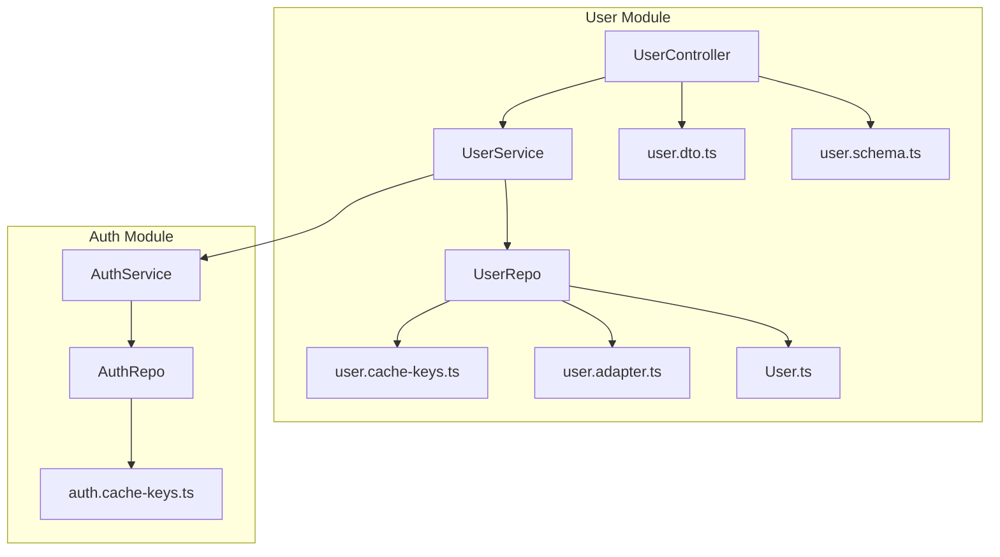
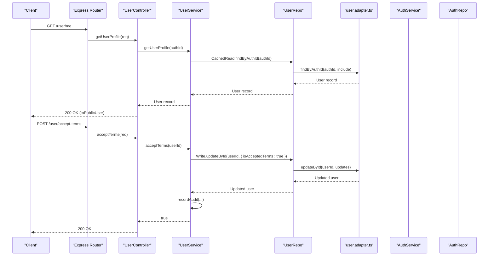
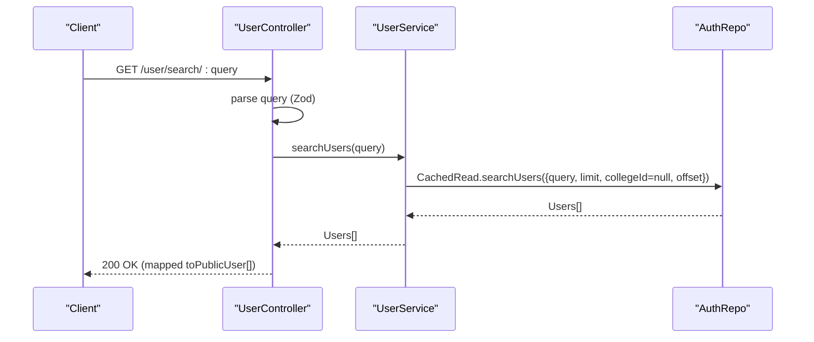
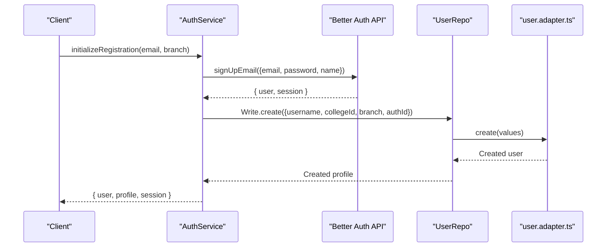
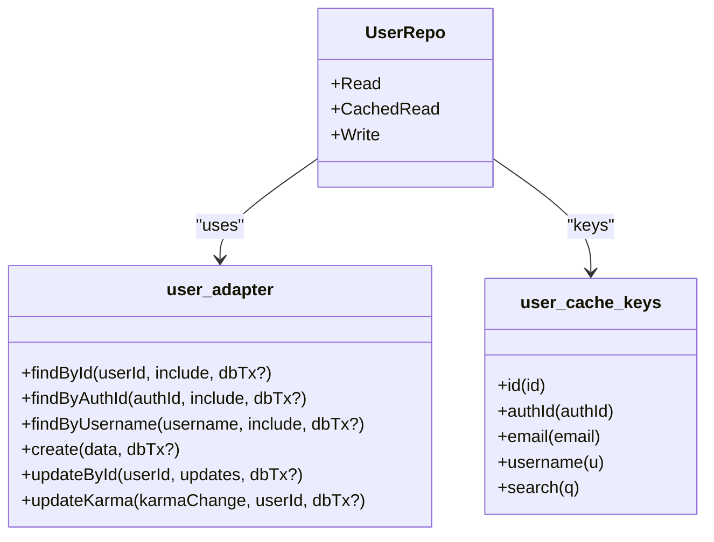
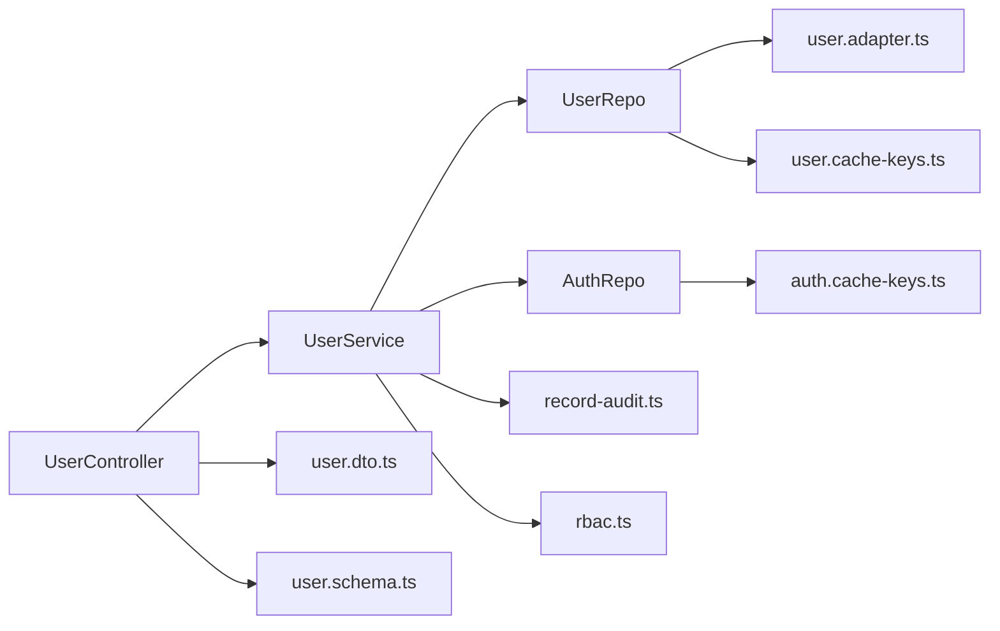
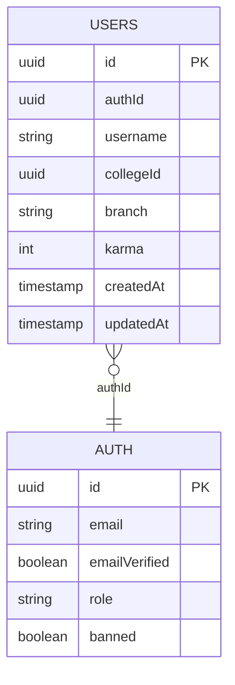

# User Management

<cite>
**Referenced Files in This Document**
- [user.service.ts](file://server/src/modules/user/user.service.ts)
- [user.repo.ts](file://server/src/modules/user/user.repo.ts)
- [user.cache-keys.ts](file://server/src/modules/user/user.cache-keys.ts)
- [user.schema.ts](file://server/src/modules/user/user.schema.ts)
- [user.dto.ts](file://server/src/modules/user/user.dto.ts)
- [user.route.ts](file://server/src/modules/user/user.route.ts)
- [user.controller.ts](file://server/src/modules/user/user.controller.ts)
- [user.adapter.ts](file://server/src/infra/db/adapters/user.adapter.ts)
- [User.ts](file://server/src/shared/types/User.ts)
- [auth.service.ts](file://server/src/modules/auth/auth.service.ts)
- [auth.repo.ts](file://server/src/modules/auth/auth.repo.ts)
- [auth.cache-keys.ts](file://server/src/modules/auth/auth.cache-keys.ts)
- [rbac.ts](file://server/src/core/security/rbac.ts)
- [record-audit.ts](file://server/src/lib/record-audit.ts)
</cite>

## Table of Contents
1. [Introduction](#introduction)
2. [Project Structure](#project-structure)
3. [Core Components](#core-components)
4. [Architecture Overview](#architecture-overview)
5. [Detailed Component Analysis](#detailed-component-analysis)
6. [Dependency Analysis](#dependency-analysis)
7. [Performance Considerations](#performance-considerations)
8. [Troubleshooting Guide](#troubleshooting-guide)
9. [Conclusion](#conclusion)
10. [Appendices](#appendices)

## Introduction
This document describes the user management service for the Flick platform. It covers user profile creation, updates, retrieval, and search; integration with authentication services; caching via cache keys; data validation using Zod schemas; user DTO patterns; API endpoints; error handling; and audit trail generation. It also explains the relationship between user profiles and authentication records, and outlines permission systems and role-based access control.

## Project Structure
The user management module resides under server/src/modules/user and integrates with:
- Authentication services for user creation and session management
- Shared database adapters for persistence
- Cache keys for efficient reads
- Zod schemas for validation
- DTOs for serialization
- RBAC for permissions
- Audit logging for compliance

**Diagram sources**
- [user.controller.ts](file://server/src/modules/user/user.controller.ts#L1-L37)
- [user.service.ts](file://server/src/modules/user/user.service.ts#L1-L61)
- [user.repo.ts](file://server/src/modules/user/user.repo.ts#L1-L41)
- [user.cache-keys.ts](file://server/src/modules/user/user.cache-keys.ts#L1-L9)
- [user.dto.ts](file://server/src/modules/user/user.dto.ts#L1-L17)
- [user.schema.ts](file://server/src/modules/user/user.schema.ts#L1-L39)
- [user.adapter.ts](file://server/src/infra/db/adapters/user.adapter.ts#L1-L120)
- [User.ts](file://server/src/shared/types/User.ts#L1-L4)
- [auth.service.ts](file://server/src/modules/auth/auth.service.ts#L1-L347)
- [auth.repo.ts](file://server/src/modules/auth/auth.repo.ts#L1-L35)
- [auth.cache-keys.ts](file://server/src/modules/auth/auth.cache-keys.ts#L1-L8)

**Section sources**
- [user.controller.ts](file://server/src/modules/user/user.controller.ts#L1-L37)
- [user.service.ts](file://server/src/modules/user/user.service.ts#L1-L61)
- [user.repo.ts](file://server/src/modules/user/user.repo.ts#L1-L41)
- [user.cache-keys.ts](file://server/src/modules/user/user.cache-keys.ts#L1-L9)
- [user.schema.ts](file://server/src/modules/user/user.schema.ts#L1-L39)
- [user.dto.ts](file://server/src/modules/user/user.dto.ts#L1-L17)
- [user.adapter.ts](file://server/src/infra/db/adapters/user.adapter.ts#L1-L120)
- [User.ts](file://server/src/shared/types/User.ts#L1-L4)
- [auth.service.ts](file://server/src/modules/auth/auth.service.ts#L1-L347)
- [auth.repo.ts](file://server/src/modules/auth/auth.repo.ts#L1-L35)
- [auth.cache-keys.ts](file://server/src/modules/auth/auth.cache-keys.ts#L1-L8)

## Core Components
- User controller: Exposes endpoints for retrieving profiles by ID, searching users, fetching current user profile, and accepting terms.
- User service: Implements business logic for profile retrieval, user search, and term acceptance with audit logging.
- User repository: Provides read/write operations backed by database adapters and cached reads using user-specific cache keys.
- User adapter: Encapsulates database queries and updates for user entities with optional joins to related tables (e.g., auth, college).
- User DTOs: Transform internal user records into public or internal representations.
- User schemas: Define Zod schemas for endpoint parameters and payloads.
- Cache keys: Standardized Redis key patterns for user entities and search queries.
- Auth integration: Creation of user profiles during registration and retrieval of profiles linked to auth identifiers.
- RBAC: Computes permissions from user roles for access control.
- Audit logging: Records user actions with contextual metadata.

**Section sources**
- [user.controller.ts](file://server/src/modules/user/user.controller.ts#L1-L37)
- [user.service.ts](file://server/src/modules/user/user.service.ts#L1-L61)
- [user.repo.ts](file://server/src/modules/user/user.repo.ts#L1-L41)
- [user.adapter.ts](file://server/src/infra/db/adapters/user.adapter.ts#L1-L120)
- [user.dto.ts](file://server/src/modules/user/user.dto.ts#L1-L17)
- [user.schema.ts](file://server/src/modules/user/user.schema.ts#L1-L39)
- [user.cache-keys.ts](file://server/src/modules/user/user.cache-keys.ts#L1-L9)
- [auth.service.ts](file://server/src/modules/auth/auth.service.ts#L153-L197)
- [rbac.ts](file://server/src/core/security/rbac.ts#L1-L15)
- [record-audit.ts](file://server/src/lib/record-audit.ts#L1-L20)

## Architecture Overview
The user management flow connects HTTP requests to the controller, which delegates to the service. The service uses the repository to fetch or write user data, leveraging cached reads for performance. Validation is performed via Zod schemas. On creation, the auth service creates an authentication record and the user service creates a user profile linked to the auth identifier. Audit events are recorded for significant actions.

**Diagram sources**
- [user.route.ts](file://server/src/modules/user/user.route.ts#L1-L21)
- [user.controller.ts](file://server/src/modules/user/user.controller.ts#L1-L37)
- [user.service.ts](file://server/src/modules/user/user.service.ts#L1-L61)
- [user.repo.ts](file://server/src/modules/user/user.repo.ts#L1-L41)
- [user.adapter.ts](file://server/src/infra/db/adapters/user.adapter.ts#L1-L120)
- [auth.service.ts](file://server/src/modules/auth/auth.service.ts#L153-L197)
- [record-audit.ts](file://server/src/lib/record-audit.ts#L1-L20)

## Detailed Component Analysis

### User Profile Retrieval and Search
- Retrieve profile by ID: Controller validates route params against a Zod schema, calls service, and returns a sanitized public representation.
- Retrieve profile by auth identifier: Service fetches via repository’s cached read by authId.
- Search users: Service delegates to AuthRepo.CachedRead.searchUsers with a fixed limit and null college filter; results are mapped to public DTOs.

**Diagram sources**
- [user.controller.ts](file://server/src/modules/user/user.controller.ts#L17-L23)
- [user.service.ts](file://server/src/modules/user/user.service.ts#L27-L39)
- [auth.repo.ts](file://server/src/modules/auth/auth.repo.ts#L17-L26)

**Section sources**
- [user.controller.ts](file://server/src/modules/user/user.controller.ts#L17-L23)
- [user.service.ts](file://server/src/modules/user/user.service.ts#L27-L39)
- [auth.repo.ts](file://server/src/modules/auth/auth.repo.ts#L17-L26)
- [user.schema.ts](file://server/src/modules/user/user.schema.ts#L36-L38)

### User Profile Creation and Relationship to Authentication
- Registration flow: The auth service initializes registration, verifies OTP, and finalizes registration by creating an auth record via Better Auth and then creating a user profile with authId linkage.
- Profile creation: The user repository writes a new user record with username normalized to lowercase and links to the auth identifier.

**Diagram sources**
- [auth.service.ts](file://server/src/modules/auth/auth.service.ts#L32-L106)
- [auth.service.ts](file://server/src/modules/auth/auth.service.ts#L153-L197)
- [user.repo.ts](file://server/src/modules/user/user.repo.ts#L33-L37)
- [user.adapter.ts](file://server/src/infra/db/adapters/user.adapter.ts#L65-L80)

**Section sources**
- [auth.service.ts](file://server/src/modules/auth/auth.service.ts#L32-L106)
- [auth.service.ts](file://server/src/modules/auth/auth.service.ts#L153-L197)
- [user.adapter.ts](file://server/src/infra/db/adapters/user.adapter.ts#L65-L80)
- [user.repo.ts](file://server/src/modules/user/user.repo.ts#L33-L37)

### User Repository Pattern and Caching Strategies
- Read operations: findById, findByAuthId, findByEmail, findByUsername via adapters.
- Cached reads: user cache keys provide canonical Redis keys for id, authId, email, username, and search.
- Write operations: create, updateById, updateKarma via adapters.

**Diagram sources**
- [user.repo.ts](file://server/src/modules/user/user.repo.ts#L1-L41)
- [user.cache-keys.ts](file://server/src/modules/user/user.cache-keys.ts#L1-L9)
- [user.adapter.ts](file://server/src/infra/db/adapters/user.adapter.ts#L1-L120)

**Section sources**
- [user.repo.ts](file://server/src/modules/user/user.repo.ts#L1-L41)
- [user.cache-keys.ts](file://server/src/modules/user/user.cache-keys.ts#L1-L9)
- [user.adapter.ts](file://server/src/infra/db/adapters/user.adapter.ts#L1-L120)

### Data Validation Through Zod Schemas
- Endpoint schemas: userIdSchema, searchQuerySchema, registrationSchema, initializeUserSchema, googleCallbackSchema, tempTokenSchema, email schema.
- Controller parsing: Route parameters and payloads are validated before invoking service methods.

**Section sources**
- [user.schema.ts](file://server/src/modules/user/user.schema.ts#L1-L39)
- [user.controller.ts](file://server/src/modules/user/user.controller.ts#L9-L22)

### User DTO Patterns
- toPublicUser: Exposes safe fields for external consumption (id, username, karma, collegeId, branch, timestamps).
- toInternalUser: Pass-through of internal user record for service-level operations.

**Section sources**
- [user.dto.ts](file://server/src/modules/user/user.dto.ts#L1-L17)

### API Endpoints
- GET /user/id/:userId — Retrieve profile by user ID
- GET /user/search/:query — Search users (limited results)
- GET /user/me — Retrieve current user profile
- POST /user/accept-terms — Accept terms and conditions

Middleware:
- Rate limiting applied globally
- Authentication enforced
- User injection and requirement middleware applied for protected routes

**Section sources**
- [user.route.ts](file://server/src/modules/user/user.route.ts#L1-L21)
- [user.controller.ts](file://server/src/modules/user/user.controller.ts#L1-L37)

### Error Handling Mechanisms
- HttpError is thrown for not found, forbidden, bad request, and internal errors with structured metadata.
- Validation errors surface as schema mismatches.
- Audit events logged for failed attempts and invalid operations.

**Section sources**
- [user.service.ts](file://server/src/modules/user/user.service.ts#L13-L18)
- [auth.service.ts](file://server/src/modules/auth/auth.service.ts#L38-L46)
- [auth.service.ts](file://server/src/modules/auth/auth.service.ts#L116-L139)

### Audit Trail Generation
- recordAudit captures action, entity type/id, before/after snapshots, and device metadata via observability context.
- Used for term acceptance and various auth actions.

**Section sources**
- [record-audit.ts](file://server/src/lib/record-audit.ts#L1-L20)
- [user.service.ts](file://server/src/modules/user/user.service.ts#L48-L54)
- [auth.service.ts](file://server/src/modules/auth/auth.service.ts#L99-L103)
- [auth.service.ts](file://server/src/modules/auth/auth.service.ts#L210-L214)
- [auth.service.ts](file://server/src/modules/auth/auth.service.ts#L224-L228)
- [auth.service.ts](file://server/src/modules/auth/auth.service.ts#L247-L252)
- [auth.service.ts](file://server/src/modules/auth/auth.service.ts#L262-L266)
- [auth.service.ts](file://server/src/modules/auth/auth.service.ts#L280-L284)
- [auth.service.ts](file://server/src/modules/auth/auth.service.ts#L293-L298)

### User Permission Systems and Role-Based Access Control
- getUserPermissions computes effective permissions from user roles, supporting wildcard permissions.

**Section sources**
- [rbac.ts](file://server/src/core/security/rbac.ts#L1-L15)

### Examples of User CRUD Operations
- Create: Auth service finalizes registration and user repo writes profile with authId linkage.
- Read: Cached reads by ID/authId/email/username; public DTO returned.
- Update: Update by ID for fields excluding immutable/authId/karma; karma adjusted via dedicated method.
- Delete: Delegated to auth service deleteUser.

**Section sources**
- [auth.service.ts](file://server/src/modules/auth/auth.service.ts#L153-L197)
- [user.adapter.ts](file://server/src/infra/db/adapters/user.adapter.ts#L100-L119)
- [user.adapter.ts](file://server/src/infra/db/adapters/user.adapter.ts#L82-L98)
- [auth.service.ts](file://server/src/modules/auth/auth.service.ts#L231-L254)

## Dependency Analysis
- Controller depends on UserService and DTOs/schemas.
- UserService depends on UserRepo and AuthRepo for cross-module operations.
- UserRepo depends on user.adapter and user.cache-keys.
- Auth integration is invoked by AuthService to create profiles.
- RBAC supplies permissions; audit logging is decoupled via recordAudit.

**Diagram sources**
- [user.controller.ts](file://server/src/modules/user/user.controller.ts#L1-L37)
- [user.service.ts](file://server/src/modules/user/user.service.ts#L1-L61)
- [user.repo.ts](file://server/src/modules/user/user.repo.ts#L1-L41)
- [user.cache-keys.ts](file://server/src/modules/user/user.cache-keys.ts#L1-L9)
- [user.adapter.ts](file://server/src/infra/db/adapters/user.adapter.ts#L1-L120)
- [auth.repo.ts](file://server/src/modules/auth/auth.repo.ts#L1-L35)
- [auth.cache-keys.ts](file://server/src/modules/auth/auth.cache-keys.ts#L1-L8)
- [user.dto.ts](file://server/src/modules/user/user.dto.ts#L1-L17)
- [user.schema.ts](file://server/src/modules/user/user.schema.ts#L1-L39)
- [record-audit.ts](file://server/src/lib/record-audit.ts#L1-L20)
- [rbac.ts](file://server/src/core/security/rbac.ts#L1-L15)

**Section sources**
- [user.controller.ts](file://server/src/modules/user/user.controller.ts#L1-L37)
- [user.service.ts](file://server/src/modules/user/user.service.ts#L1-L61)
- [user.repo.ts](file://server/src/modules/user/user.repo.ts#L1-L41)
- [user.cache-keys.ts](file://server/src/modules/user/user.cache-keys.ts#L1-L9)
- [user.adapter.ts](file://server/src/infra/db/adapters/user.adapter.ts#L1-L120)
- [auth.repo.ts](file://server/src/modules/auth/auth.repo.ts#L1-L35)
- [auth.cache-keys.ts](file://server/src/modules/auth/auth.cache-keys.ts#L1-L8)
- [user.dto.ts](file://server/src/modules/user/user.dto.ts#L1-L17)
- [user.schema.ts](file://server/src/modules/user/user.schema.ts#L1-L39)
- [record-audit.ts](file://server/src/lib/record-audit.ts#L1-L20)
- [rbac.ts](file://server/src/core/security/rbac.ts#L1-L15)

## Performance Considerations
- Cached reads: Use user cache keys for frequent lookups by ID, authId, email, and username to reduce database load.
- Search limits: Fixed limit on user search to bound query cost.
- Lightweight DTOs: Return minimal public fields to reduce payload sizes.
- Batched audit writes: Aggregate audit entries via observability context before flushing.

[No sources needed since this section provides general guidance]

## Troubleshooting Guide
- User not found: Validation failure or missing record triggers a not found error during profile retrieval by ID.
- Invalid parameters: Zod schema mismatches cause request rejection before hitting service logic.
- Cache misses: If cached reads fail to hit, ensure cache keys match and Redis connectivity is healthy.
- Registration issues: Verify OTP verification, pending user storage, and Better Auth sign-up flow.

**Section sources**
- [user.service.ts](file://server/src/modules/user/user.service.ts#L13-L18)
- [user.schema.ts](file://server/src/modules/user/user.schema.ts#L14-L16)
- [user.schema.ts](file://server/src/modules/user/user.schema.ts#L36-L38)
- [auth.service.ts](file://server/src/modules/auth/auth.service.ts#L22-L30)
- [auth.service.ts](file://server/src/modules/auth/auth.service.ts#L108-L151)

## Conclusion
The user management service integrates tightly with authentication, employs robust caching and validation, and maintains clear separation of concerns across controller, service, repository, and adapter layers. Audit trails and RBAC support compliance and access control. The design supports scalable profile operations and search while keeping payloads minimal and responses fast.

[No sources needed since this section summarizes without analyzing specific files]

## Appendices

### API Endpoints Reference
- GET /user/id/:userId — Returns a user profile by ID
- GET /user/search/:query — Returns a list of users matching the query
- GET /user/me — Returns the authenticated user’s profile
- POST /user/accept-terms — Marks terms as accepted

**Section sources**
- [user.route.ts](file://server/src/modules/user/user.route.ts#L11-L18)

### Data Models and Relationships

**Diagram sources**
- [user.adapter.ts](file://server/src/infra/db/adapters/user.adapter.ts#L1-L120)
- [User.ts](file://server/src/shared/types/User.ts#L1-L4)