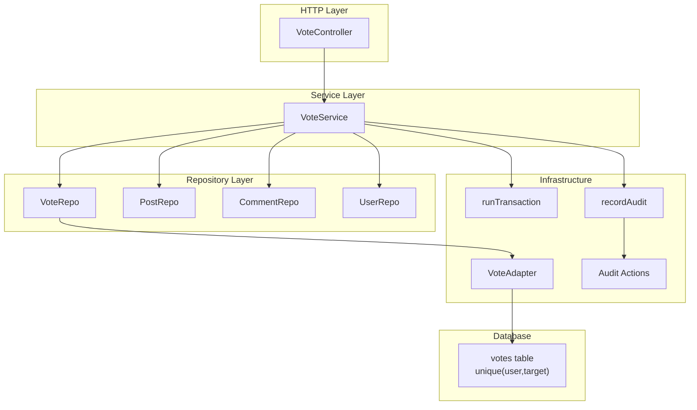
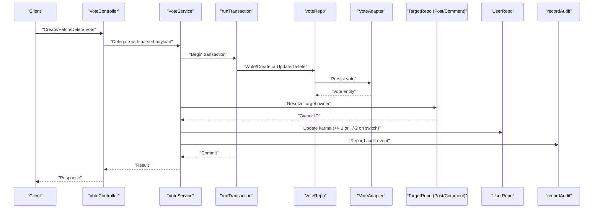
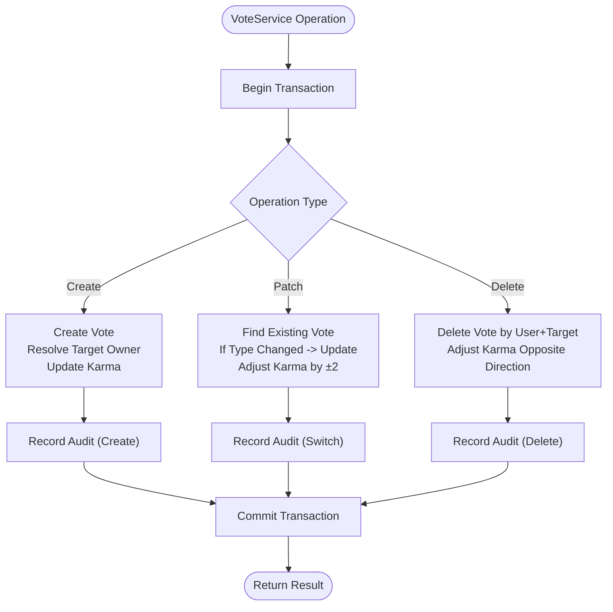
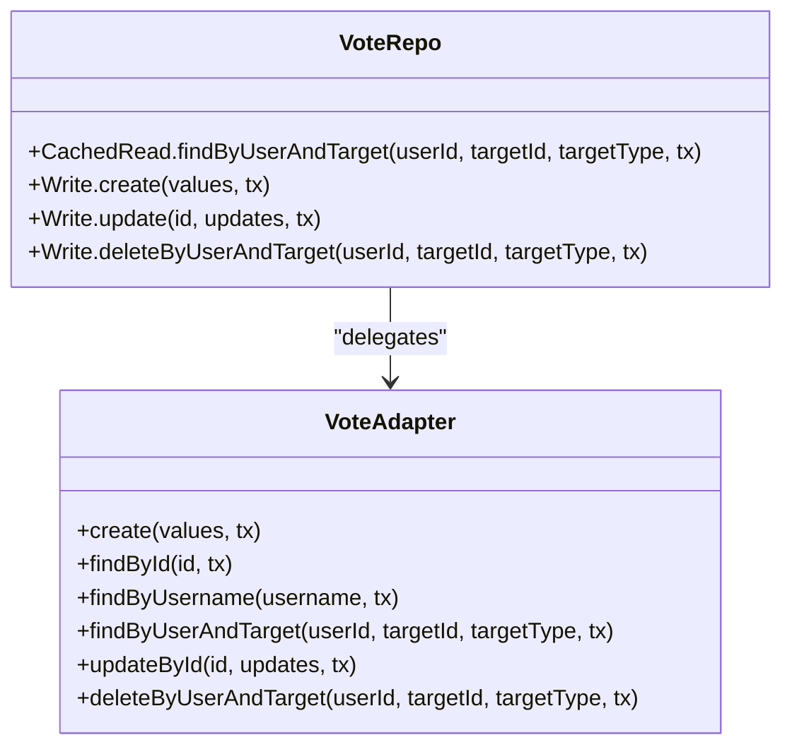
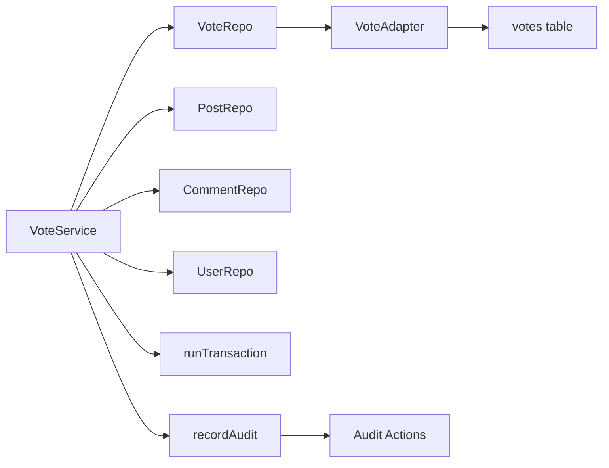

# Voting System

<cite>
**Referenced Files in This Document**
- [vote.controller.ts](file://server/src/modules/vote/vote.controller.ts)
- [vote.service.ts](file://server/src/modules/vote/vote.service.ts)
- [vote.repo.ts](file://server/src/modules/vote/vote.repo.ts)
- [vote.schema.ts](file://server/src/modules/vote/vote.schema.ts)
- [vote.cache-keys.ts](file://server/src/modules/vote/vote.cache-keys.ts)
- [vote.adapter.ts](file://server/src/infra/db/adapters/vote.adapter.ts)
- [vote.table.ts](file://server/src/infra/db/tables/vote.table.ts)
- [post.repo.ts](file://server/src/modules/post/post.repo.ts)
- [comment.repo.ts](file://server/src/modules/comment/comment.repo.ts)
- [user.repo.ts](file://server/src/modules/user/user.repo.ts)
- [transactions.ts](file://server/src/infra/db/transactions.ts)
- [record-audit.ts](file://server/src/lib/record-audit.ts)
- [actions.ts](file://server/src/shared/constants/audit/actions.ts)
- [post.service.ts](file://server/src/modules/post/post.service.ts)
</cite>

## Table of Contents
1. [Introduction](#introduction)
2. [Project Structure](#project-structure)
3. [Core Components](#core-components)
4. [Architecture Overview](#architecture-overview)
5. [Detailed Component Analysis](#detailed-component-analysis)
6. [Dependency Analysis](#dependency-analysis)
7. [Performance Considerations](#performance-considerations)
8. [Troubleshooting Guide](#troubleshooting-guide)
9. [Conclusion](#conclusion)
10. [Appendices](#appendices)

## Introduction
This document describes the Flick platform’s voting system, focusing on upvote/downvote functionality, score calculation, reputation management, caching, real-time updates, trending content, moderation, duplicate vote prevention, and audit logging. It explains vote creation, modification, and removal with validation and permission checks, and outlines the repository pattern, transaction handling, and audit trail for voting activities.

## Project Structure
The voting system spans the controller, service, repository, database adapter, and audit/logging layers. It integrates with posts and comments as vote targets and updates user karma as part of vote lifecycle operations.

**Diagram sources**
- [vote.controller.ts](file://server/src/modules/vote/vote.controller.ts#L1-L36)
- [vote.service.ts](file://server/src/modules/vote/vote.service.ts#L1-L184)
- [vote.repo.ts](file://server/src/modules/vote/vote.repo.ts#L1-L22)
- [vote.adapter.ts](file://server/src/infra/db/adapters/vote.adapter.ts#L1-L78)
- [vote.table.ts](file://server/src/infra/db/tables/vote.table.ts#L1-L42)
- [post.repo.ts](file://server/src/modules/post/post.repo.ts#L1-L97)
- [comment.repo.ts](file://server/src/modules/comment/comment.repo.ts#L1-L71)
- [user.repo.ts](file://server/src/modules/user/user.repo.ts#L1-L41)
- [transactions.ts](file://server/src/infra/db/transactions.ts#L1-L20)
- [record-audit.ts](file://server/src/lib/record-audit.ts#L1-L20)
- [actions.ts](file://server/src/shared/constants/audit/actions.ts#L1-L66)

**Section sources**
- [vote.controller.ts](file://server/src/modules/vote/vote.controller.ts#L1-L36)
- [vote.service.ts](file://server/src/modules/vote/vote.service.ts#L1-L184)
- [vote.repo.ts](file://server/src/modules/vote/vote.repo.ts#L1-L22)
- [vote.adapter.ts](file://server/src/infra/db/adapters/vote.adapter.ts#L1-L78)
- [vote.table.ts](file://server/src/infra/db/tables/vote.table.ts#L1-L42)

## Core Components
- VoteController: Exposes endpoints for creating, patching, and deleting votes. Validates input via Zod schemas and delegates to VoteService.
- VoteService: Implements vote lifecycle logic, including transactional vote creation/patch/delete, karma updates for target owners, and audit logging.
- VoteRepo: Provides cached reads and write operations for votes using VoteAdapter and cache keys.
- VoteAdapter: Drizzle ORM adapter for vote persistence with unique constraint preventing duplicate votes per user-target-type.
- PostRepo/CommentRepo: Provide author lookup for target validation and scoring impact.
- UserRepo: Updates user karma during vote operations.
- runTransaction: Ensures atomicity across vote writes and karma updates.
- recordAudit + Audit Actions: Logs voting events with metadata for compliance and monitoring.

**Section sources**
- [vote.controller.ts](file://server/src/modules/vote/vote.controller.ts#L1-L36)
- [vote.service.ts](file://server/src/modules/vote/vote.service.ts#L1-L184)
- [vote.repo.ts](file://server/src/modules/vote/vote.repo.ts#L1-L22)
- [vote.adapter.ts](file://server/src/infra/db/adapters/vote.adapter.ts#L1-L78)
- [vote.table.ts](file://server/src/infra/db/tables/vote.table.ts#L1-L42)
- [post.repo.ts](file://server/src/modules/post/post.repo.ts#L1-L97)
- [comment.repo.ts](file://server/src/modules/comment/comment.repo.ts#L1-L71)
- [user.repo.ts](file://server/src/modules/user/user.repo.ts#L1-L41)
- [transactions.ts](file://server/src/infra/db/transactions.ts#L1-L20)
- [record-audit.ts](file://server/src/lib/record-audit.ts#L1-L20)
- [actions.ts](file://server/src/shared/constants/audit/actions.ts#L1-L66)

## Architecture Overview
The voting system follows a layered architecture:
- HTTP requests enter via VoteController, validated by Zod schemas.
- VoteService orchestrates vote operations inside a transaction, ensuring consistency.
- VoteRepo abstracts read/write operations backed by VoteAdapter.
- VoteAdapter persists votes to the database with a unique constraint on (user, target, type).
- PostRepo/CommentRepo resolve target ownership for karma adjustments.
- UserRepo updates karma atomically with vote changes.
- recordAudit captures structured audit entries for each vote operation.

**Diagram sources**
- [vote.controller.ts](file://server/src/modules/vote/vote.controller.ts#L1-L36)
- [vote.service.ts](file://server/src/modules/vote/vote.service.ts#L1-L184)
- [vote.repo.ts](file://server/src/modules/vote/vote.repo.ts#L1-L22)
- [vote.adapter.ts](file://server/src/infra/db/adapters/vote.adapter.ts#L1-L78)
- [post.repo.ts](file://server/src/modules/post/post.repo.ts#L1-L97)
- [comment.repo.ts](file://server/src/modules/comment/comment.repo.ts#L1-L71)
- [user.repo.ts](file://server/src/modules/user/user.repo.ts#L1-L41)
- [transactions.ts](file://server/src/infra/db/transactions.ts#L1-L20)
- [record-audit.ts](file://server/src/lib/record-audit.ts#L1-L20)

## Detailed Component Analysis

### VoteController
- Endpoints:
  - Create vote: validates payload, extracts current user, calls service.
  - Patch vote: validates payload, ensures user is authenticated, calls service.
  - Delete vote: validates target, extracts current user, calls service.
- Validation: Uses Zod schemas for insert and delete payloads.
- Responses: Standardized HTTP responses with created/ok status and messages.

**Section sources**
- [vote.controller.ts](file://server/src/modules/vote/vote.controller.ts#L1-L36)
- [vote.schema.ts](file://server/src/modules/vote/vote.schema.ts#L1-L8)

### VoteService
- Create vote:
  - Transactional creation of vote.
  - Resolves target owner via PostRepo or CommentRepo.
  - Updates owner karma by +1 for upvote, -1 for downvote.
  - Records audit with action derived from vote type and target type.
- Patch vote:
  - Finds existing vote by user and target.
  - If vote type differs, updates vote and adjusts karma by ±2 (net change).
  - Records audit for switching vote type.
- Delete vote:
  - Removes vote by user and target.
  - Adjusts karma in opposite direction of original vote.
  - Records audit for deletion.
- Error handling: Throws appropriate HTTP errors for not found, unauthorized, internal server errors.

**Diagram sources**
- [vote.service.ts](file://server/src/modules/vote/vote.service.ts#L1-L184)
- [transactions.ts](file://server/src/infra/db/transactions.ts#L1-L20)
- [record-audit.ts](file://server/src/lib/record-audit.ts#L1-L20)
- [actions.ts](file://server/src/shared/constants/audit/actions.ts#L1-L66)

**Section sources**
- [vote.service.ts](file://server/src/modules/vote/vote.service.ts#L1-L184)

### VoteRepo and VoteAdapter
- Cached reads:
  - findByUserAndTarget uses a composite cache key for user-target-type.
- Writes:
  - create, updateById, deleteByUserAndTarget delegate to VoteAdapter.
- VoteAdapter:
  - Persists vote entities and enforces uniqueness via database constraints.
- VoteAdapter queries:
  - findByUserAndTarget returns the single vote matching user, target, and type.

**Diagram sources**
- [vote.repo.ts](file://server/src/modules/vote/vote.repo.ts#L1-L22)
- [vote.adapter.ts](file://server/src/infra/db/adapters/vote.adapter.ts#L1-L78)

**Section sources**
- [vote.repo.ts](file://server/src/modules/vote/vote.repo.ts#L1-L22)
- [vote.adapter.ts](file://server/src/infra/db/adapters/vote.adapter.ts#L1-L78)
- [vote.cache-keys.ts](file://server/src/modules/vote/vote.cache-keys.ts#L1-L5)

### Database Schema and Constraints
- votes table:
  - Unique index on (userId, targetType, targetId) prevents duplicate votes per user-target-type.
  - Index on (targetType, targetId) supports efficient target-based lookups.
- Enums:
  - voteTypeEnum and voteEntityEnum define allowed values for voteType and targetType.

**Section sources**
- [vote.table.ts](file://server/src/infra/db/tables/vote.table.ts#L1-L42)

### Reputation Management
- Karma updates occur atomically with vote operations:
  - Create: owner karma += 1 for upvote, -= 1 for downvote.
  - Patch: owner karma adjusted by ±2 if changing vote type.
  - Delete: owner karma reversed from original vote type.
- UserRepo exposes updateKarma for atomic adjustments.

**Section sources**
- [vote.service.ts](file://server/src/modules/vote/vote.service.ts#L1-L184)
- [user.repo.ts](file://server/src/modules/user/user.repo.ts#L1-L41)

### Caching Strategy
- VoteRepo.CachedRead:
  - findByUserAndTarget caches per user-target-type key.
- PostRepo.CommentRepo:
  - CachedRead.findAuthorId resolves target owner efficiently.
- Benefits:
  - Reduces repeated DB hits for vote existence checks and owner resolution.
  - Supports high-volume scenarios by minimizing database load.

**Section sources**
- [vote.repo.ts](file://server/src/modules/vote/vote.repo.ts#L1-L22)
- [post.repo.ts](file://server/src/modules/post/post.repo.ts#L1-L97)
- [comment.repo.ts](file://server/src/modules/comment/comment.repo.ts#L1-L71)
- [vote.cache-keys.ts](file://server/src/modules/vote/vote.cache-keys.ts#L1-L5)

### Real-time Score Updates and Trending Content
- Current implementation:
  - VoteService updates karma atomically within transactions.
  - No explicit real-time score recalculation or trending aggregation pipeline is present in the voting module.
- Recommendations for trending:
  - Maintain a materialized score per target (e.g., post.score) updated on vote changes.
  - Periodic or event-driven recomputation of trending metrics (e.g., time-decayed scores).
  - Frontend consumption via WebSocket or polling.

[No sources needed since this section provides general guidance]

### Vote Moderation, Duplicate Prevention, and Abuse Detection
- Duplicate vote prevention:
  - Database unique constraint on (userId, targetType, targetId) prevents duplicates.
- Moderation:
  - No dedicated moderation endpoints are exposed in the voting module.
  - Content moderation is handled under content-report module; voting actions can be audited and traced.
- Abuse detection:
  - Audit logs capture user actions with device metadata.
  - Consider rate limiting and anomaly detection at middleware or service boundaries.

**Section sources**
- [vote.table.ts](file://server/src/infra/db/tables/vote.table.ts#L1-L42)
- [record-audit.ts](file://server/src/lib/record-audit.ts#L1-L20)
- [actions.ts](file://server/src/shared/constants/audit/actions.ts#L1-L66)

### Vote Repository Pattern and Transactions
- Repository pattern:
  - VoteRepo encapsulates read/write operations behind a consistent interface.
  - CachedRead leverages a caching utility to avoid redundant DB queries.
- Transactions:
  - runTransaction wraps vote creation/patch/delete and karma updates in a single transaction.
  - Nested usage reuses parent transaction to maintain consistency.

**Section sources**
- [vote.repo.ts](file://server/src/modules/vote/vote.repo.ts#L1-L22)
- [transactions.ts](file://server/src/infra/db/transactions.ts#L1-L20)

### Audit Logging for Voting Activities
- recordAudit enriches entries with device metadata and pushes to an observability audit buffer.
- Audit actions include:
  - user:upvoted:post, user:downvoted:post
  - user:upvoted:comment, user:downvoted:comment
  - user:deleted:vote:on:post, user:deleted:vote:on:comment
  - user:switched:vote:on:post, user:switched:vote:on:comment
- These actions enable compliance, monitoring, and forensic analysis.

**Section sources**
- [record-audit.ts](file://server/src/lib/record-audit.ts#L1-L20)
- [actions.ts](file://server/src/shared/constants/audit/actions.ts#L1-L66)
- [vote.service.ts](file://server/src/modules/vote/vote.service.ts#L1-L184)

### Examples of Vote Operations
- Create an upvote on a post:
  - Endpoint: Controller delegates to Service.
  - Service creates vote, resolves post owner, updates karma, records audit.
- Switch a vote from downvote to upvote:
  - Service finds existing vote, updates type, adjusts karma by ±2, records audit.
- Remove a vote:
  - Service deletes vote by user and target, reverses karma adjustment, records audit.

**Section sources**
- [vote.controller.ts](file://server/src/modules/vote/vote.controller.ts#L1-L36)
- [vote.service.ts](file://server/src/modules/vote/vote.service.ts#L1-L184)

## Dependency Analysis
The voting system exhibits low coupling and high cohesion:
- VoteService depends on VoteRepo, PostRepo/CommentRepo, UserRepo, runTransaction, and audit utilities.
- VoteRepo abstracts VoteAdapter, enabling testability and reuse.
- Database constraints enforce data integrity at the persistence layer.

**Diagram sources**
- [vote.service.ts](file://server/src/modules/vote/vote.service.ts#L1-L184)
- [vote.repo.ts](file://server/src/modules/vote/vote.repo.ts#L1-L22)
- [vote.adapter.ts](file://server/src/infra/db/adapters/vote.adapter.ts#L1-L78)
- [vote.table.ts](file://server/src/infra/db/tables/vote.table.ts#L1-L42)
- [transactions.ts](file://server/src/infra/db/transactions.ts#L1-L20)
- [record-audit.ts](file://server/src/lib/record-audit.ts#L1-L20)
- [actions.ts](file://server/src/shared/constants/audit/actions.ts#L1-L66)

**Section sources**
- [vote.service.ts](file://server/src/modules/vote/vote.service.ts#L1-L184)
- [vote.repo.ts](file://server/src/modules/vote/vote.repo.ts#L1-L22)
- [vote.adapter.ts](file://server/src/infra/db/adapters/vote.adapter.ts#L1-L78)
- [vote.table.ts](file://server/src/infra/db/tables/vote.table.ts#L1-L42)

## Performance Considerations
- Database constraints:
  - Unique index on (user, target, type) prevents duplicates and supports fast existence checks.
- Caching:
  - CachedRead for votes and target lookups reduces DB load under high concurrency.
- Transactions:
  - runTransaction ensures atomic vote updates and karma adjustments, avoiding partial states.
- Recommendations for high volume:
  - Materialize target scores and update incrementally on vote changes.
  - Batch audit writes to reduce I/O overhead.
  - Add rate limiting and abuse detection at middleware level.
  - Consider Redis-backed counters for real-time score updates and leaderboards.

[No sources needed since this section provides general guidance]

## Troubleshooting Guide
- Vote not found for patch/delete:
  - Service throws not found; verify user, targetId, and targetType correctness.
- Target not found:
  - Owner resolution fails; ensure target exists and targetType matches.
- Unauthorized access:
  - Ensure user is authenticated; controller requires user context.
- Internal server error:
  - Transaction failure or adapter error; check logs and database connectivity.
- Audit gaps:
  - Verify observability context and audit buffer availability.

**Section sources**
- [vote.service.ts](file://server/src/modules/vote/vote.service.ts#L1-L184)
- [vote.controller.ts](file://server/src/modules/vote/vote.controller.ts#L1-L36)
- [record-audit.ts](file://server/src/lib/record-audit.ts#L1-L20)

## Conclusion
The Flick voting system implements a robust, transactional, and auditable model for upvote/downvote operations. It prevents duplicates via database constraints, manages user reputation through atomic karma updates, and leverages caching for scalability. While real-time score updates and trending are not currently implemented in the voting module, the architecture supports incremental enhancements such as materialized scores and event-driven recomputation.

## Appendices

### API Endpoints Overview
- Create Vote: POST endpoint validated by InsertVoteSchema (voteType, targetType, targetId).
- Patch Vote: PATCH endpoint validated by InsertVoteSchema (voteType, targetType, targetId).
- Delete Vote: DELETE endpoint validated by DeleteVoteSchema (targetType, targetId).

**Section sources**
- [vote.controller.ts](file://server/src/modules/vote/vote.controller.ts#L1-L36)
- [vote.schema.ts](file://server/src/modules/vote/vote.schema.ts#L1-L8)

### Relationship Between Votes and Posts/Comments
- Targets:
  - targetType "post" uses PostRepo for owner resolution.
  - targetType "comment" uses CommentRepo for owner resolution.
- Impact:
  - Vote creation/patch/deletion triggers karma updates for the target owner.

**Section sources**
- [vote.service.ts](file://server/src/modules/vote/vote.service.ts#L1-L184)
- [post.repo.ts](file://server/src/modules/post/post.repo.ts#L1-L97)
- [comment.repo.ts](file://server/src/modules/comment/comment.repo.ts#L1-L71)

### Content Ranking Algorithms
- Current state:
  - No explicit ranking algorithm is implemented in the voting module.
- Suggested approach:
  - Compute time-normalized scores (e.g., log rank, gravity algorithm) and periodically update leaderboards.
  - Surface trending content via cached lists sorted by recency-weighted scores.

[No sources needed since this section provides general guidance]