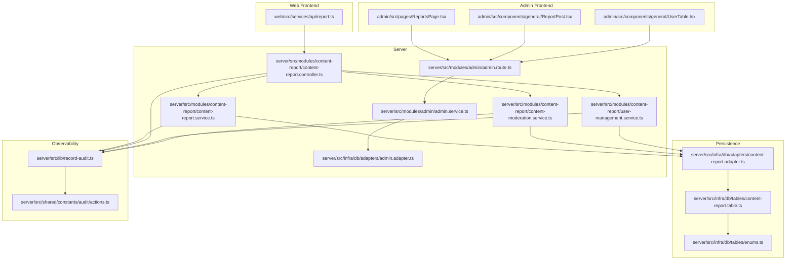
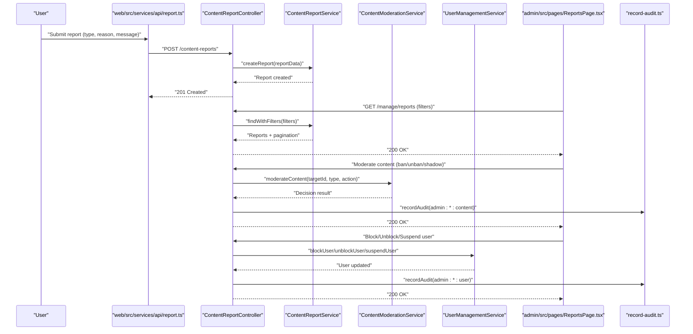
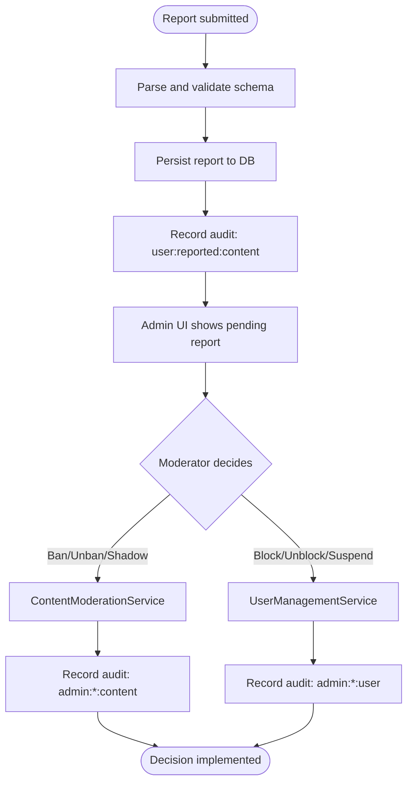
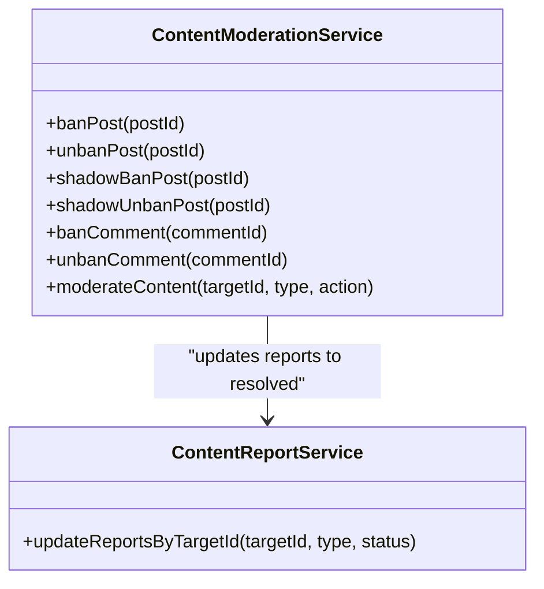
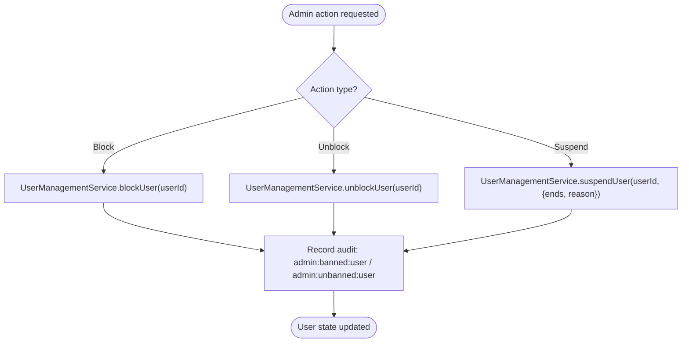
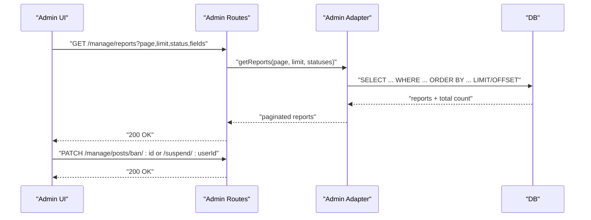
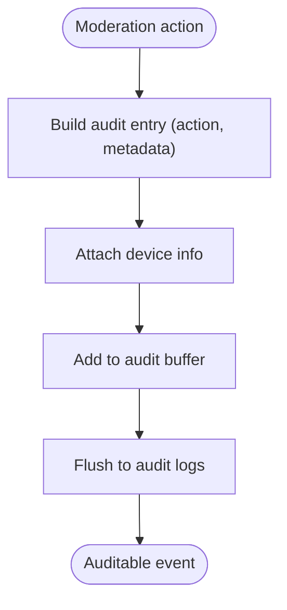
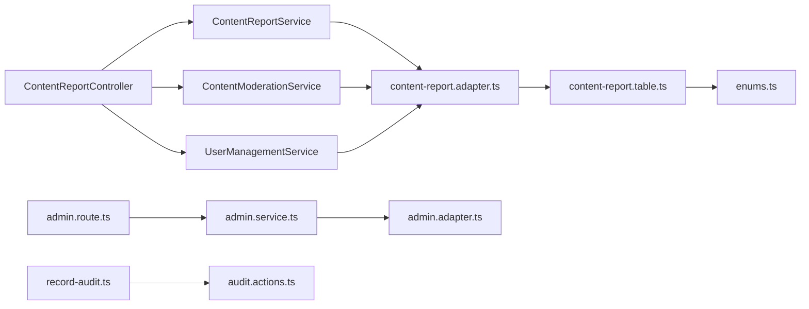

# Content Moderation

<cite>
**Referenced Files in This Document**
- [content-moderation.service.ts](file://server/src/modules/content-report/content-moderation.service.ts)
- [content-report.controller.ts](file://server/src/modules/content-report/content-report.controller.ts)
- [content-report.service.ts](file://server/src/modules/content-report/content-report.service.ts)
- [content-report.schema.ts](file://server/src/modules/content-report/content-report.schema.ts)
- [content-report.repo.ts](file://server/src/modules/content-report/content-report.repo.ts)
- [content-report.adapter.ts](file://server/src/infra/db/adapters/content-report.adapter.ts)
- [content-report.table.ts](file://server/src/infra/db/tables/content-report.table.ts)
- [user-management.service.ts](file://server/src/modules/content-report/user-management.service.ts)
- [admin.route.ts](file://server/src/modules/admin/admin.route.ts)
- [admin.service.ts](file://server/src/modules/admin/admin.service.ts)
- [admin.adapter.ts](file://server/src/infra/db/adapters/admin.adapter.ts)
- [record-audit.ts](file://server/src/lib/record-audit.ts)
- [actions.ts](file://server/src/shared/constants/audit/actions.ts)
- [enums.ts](file://server/src/infra/db/tables/enums.ts)
- [ReportsPage.tsx](file://admin/src/pages/ReportsPage.tsx)
- [ReportPost.tsx](file://admin/src/components/general/ReportPost.tsx)
- [UserTable.tsx](file://admin/src/components/general/UserTable.tsx)
- [report.ts](file://web/src/services/api/report.ts)
</cite>

## Table of Contents
1. [Introduction](#introduction)
2. [Project Structure](#project-structure)
3. [Core Components](#core-components)
4. [Architecture Overview](#architecture-overview)
5. [Detailed Component Analysis](#detailed-component-analysis)
6. [Dependency Analysis](#dependency-analysis)
7. [Performance Considerations](#performance-considerations)
8. [Troubleshooting Guide](#troubleshooting-guide)
9. [Conclusion](#conclusion)
10. [Appendices](#appendices)

## Introduction
This document describes the content moderation system for the Flick platform. It covers the AI-powered content filtering pipeline, user-generated reporting, manual review workflows, and administrator controls for enforcement. It also documents user management for violations, appeals, and account restrictions, along with the moderation interface for administrators, content analysis tools, and decision tracking. The goal is to provide a clear, practical guide for operators, moderators, and administrators to maintain a safe and expressive community.

## Project Structure
The moderation system spans backend services, database adapters, and administrative and user-facing frontends:
- Backend services for content reports, moderation decisions, and user management
- Database adapters and tables for persistence and filtering
- Administrative UI for reviewing reports and managing users
- Frontend API bindings for user reporting

**Diagram sources**
- [content-report.controller.ts](file://server/src/modules/content-report/content-report.controller.ts#L1-L212)
- [content-report.service.ts](file://server/src/modules/content-report/content-report.service.ts#L1-L159)
- [content-moderation.service.ts](file://server/src/modules/content-report/content-moderation.service.ts#L1-L220)
- [user-management.service.ts](file://server/src/modules/content-report/user-management.service.ts#L1-L166)
- [admin.route.ts](file://server/src/modules/admin/admin.route.ts#L1-L20)
- [admin.service.ts](file://server/src/modules/admin/admin.service.ts#L1-L35)
- [admin.adapter.ts](file://server/src/infra/db/adapters/admin.adapter.ts#L1-L51)
- [content-report.adapter.ts](file://server/src/infra/db/adapters/content-report.adapter.ts#L1-L120)
- [content-report.table.ts](file://server/src/infra/db/tables/content-report.table.ts#L1-L20)
- [enums.ts](file://server/src/infra/db/tables/enums.ts#L1-L24)
- [record-audit.ts](file://server/src/lib/record-audit.ts#L1-L20)
- [actions.ts](file://server/src/shared/constants/audit/actions.ts#L1-L66)
- [ReportsPage.tsx](file://admin/src/pages/ReportsPage.tsx#L1-L96)
- [ReportPost.tsx](file://admin/src/components/general/ReportPost.tsx#L34-L68)
- [UserTable.tsx](file://admin/src/components/general/UserTable.tsx#L23-L63)
- [report.ts](file://web/src/services/api/report.ts#L1-L12)

**Section sources**
- [content-report.controller.ts](file://server/src/modules/content-report/content-report.controller.ts#L1-L212)
- [content-report.service.ts](file://server/src/modules/content-report/content-report.service.ts#L1-L159)
- [content-moderation.service.ts](file://server/src/modules/content-report/content-moderation.service.ts#L1-L220)
- [user-management.service.ts](file://server/src/modules/content-report/user-management.service.ts#L1-L166)
- [admin.route.ts](file://server/src/modules/admin/admin.route.ts#L1-L20)
- [admin.service.ts](file://server/src/modules/admin/admin.service.ts#L1-L35)
- [admin.adapter.ts](file://server/src/infra/db/adapters/admin.adapter.ts#L1-L51)
- [content-report.adapter.ts](file://server/src/infra/db/adapters/content-report.adapter.ts#L1-L120)
- [content-report.table.ts](file://server/src/infra/db/tables/content-report.table.ts#L1-L20)
- [enums.ts](file://server/src/infra/db/tables/enums.ts#L1-L24)
- [record-audit.ts](file://server/src/lib/record-audit.ts#L1-L20)
- [actions.ts](file://server/src/shared/constants/audit/actions.ts#L1-L66)
- [ReportsPage.tsx](file://admin/src/pages/ReportsPage.tsx#L1-L96)
- [ReportPost.tsx](file://admin/src/components/general/ReportPost.tsx#L34-L68)
- [UserTable.tsx](file://admin/src/components/general/UserTable.tsx#L23-L63)
- [report.ts](file://web/src/services/api/report.ts#L1-L12)

## Core Components
- Content reporting: Users submit reports for posts or comments with structured reasons and messages.
- Moderation decisions: Administrators can ban/unban or shadow-ban/unshadow-ban posts and ban/unban comments.
- User management: Administrators can block/unblock users and impose suspensions with end dates and reasons.
- Audit logging: All moderation actions are recorded with standardized audit actions and device metadata.
- Admin UI: Pages to view and act on reports, and tables to manage users.

Key implementation references:
- Reporting API binding: [report.ts](file://web/src/services/api/report.ts#L1-L12)
- Admin report listing: [ReportsPage.tsx](file://admin/src/pages/ReportsPage.tsx#L1-L96)
- Admin actions for posts and users: [ReportPost.tsx](file://admin/src/components/general/ReportPost.tsx#L34-L68), [UserTable.tsx](file://admin/src/components/general/UserTable.tsx#L23-L63)
- Controllers and services: [content-report.controller.ts](file://server/src/modules/content-report/content-report.controller.ts#L1-L212), [content-moderation.service.ts](file://server/src/modules/content-report/content-moderation.service.ts#L1-L220), [user-management.service.ts](file://server/src/modules/content-report/user-management.service.ts#L1-L166)
- Persistence: [content-report.adapter.ts](file://server/src/infra/db/adapters/content-report.adapter.ts#L1-L120), [content-report.table.ts](file://server/src/infra/db/tables/content-report.table.ts#L1-L20)
- Audit: [record-audit.ts](file://server/src/lib/record-audit.ts#L1-L20), [actions.ts](file://server/src/shared/constants/audit/actions.ts#L1-L66)

**Section sources**
- [report.ts](file://web/src/services/api/report.ts#L1-L12)
- [ReportsPage.tsx](file://admin/src/pages/ReportsPage.tsx#L1-L96)
- [ReportPost.tsx](file://admin/src/components/general/ReportPost.tsx#L34-L68)
- [UserTable.tsx](file://admin/src/components/general/UserTable.tsx#L23-L63)
- [content-report.controller.ts](file://server/src/modules/content-report/content-report.controller.ts#L1-L212)
- [content-moderation.service.ts](file://server/src/modules/content-report/content-moderation.service.ts#L1-L220)
- [user-management.service.ts](file://server/src/modules/content-report/user-management.service.ts#L1-L166)
- [content-report.adapter.ts](file://server/src/infra/db/adapters/content-report.adapter.ts#L1-L120)
- [content-report.table.ts](file://server/src/infra/db/tables/content-report.table.ts#L1-L20)
- [record-audit.ts](file://server/src/lib/record-audit.ts#L1-L20)
- [actions.ts](file://server/src/shared/constants/audit/actions.ts#L1-L66)

## Architecture Overview
The moderation pipeline integrates user reporting, backend moderation services, and administrative controls. Decisions are persisted and audited, and the admin UI surfaces actionable items.

**Diagram sources**
- [report.ts](file://web/src/services/api/report.ts#L1-L12)
- [content-report.controller.ts](file://server/src/modules/content-report/content-report.controller.ts#L1-L212)
- [content-report.service.ts](file://server/src/modules/content-report/content-report.service.ts#L1-L159)
- [content-moderation.service.ts](file://server/src/modules/content-report/content-moderation.service.ts#L1-L220)
- [user-management.service.ts](file://server/src/modules/content-report/user-management.service.ts#L1-L166)
- [ReportsPage.tsx](file://admin/src/pages/ReportsPage.tsx#L1-L96)
- [record-audit.ts](file://server/src/lib/record-audit.ts#L1-L20)

## Detailed Component Analysis

### Content Reporting Pipeline
- Submission: Users send reports with type (Post/Comment), reason, and message. The controller validates input and persists the report.
- Storage: Reports are stored with status pending and associated target identifiers.
- Filtering: Admins can query reports by type, status, page, and fields.
- Deletion: Bulk deletion is supported with audit logging.

**Diagram sources**
- [content-report.controller.ts](file://server/src/modules/content-report/content-report.controller.ts#L15-L32)
- [content-report.service.ts](file://server/src/modules/content-report/content-report.service.ts#L9-L39)
- [content-report.adapter.ts](file://server/src/infra/db/adapters/content-report.adapter.ts#L6-L26)
- [content-report.table.ts](file://server/src/infra/db/tables/content-report.table.ts#L5-L16)
- [content-moderation.service.ts](file://server/src/modules/content-report/content-moderation.service.ts#L182-L217)
- [user-management.service.ts](file://server/src/modules/content-report/user-management.service.ts#L72-L107)
- [record-audit.ts](file://server/src/lib/record-audit.ts#L4-L17)

**Section sources**
- [content-report.controller.ts](file://server/src/modules/content-report/content-report.controller.ts#L15-L32)
- [content-report.service.ts](file://server/src/modules/content-report/content-report.service.ts#L9-L39)
- [content-report.adapter.ts](file://server/src/infra/db/adapters/content-report.adapter.ts#L6-L26)
- [content-report.table.ts](file://server/src/infra/db/tables/content-report.table.ts#L5-L16)
- [content-report.schema.ts](file://server/src/modules/content-report/content-report.schema.ts#L5-L14)
- [content-report.repo.ts](file://server/src/modules/content-report/content-report.repo.ts#L3-L18)

### Moderation Decisions: Posts and Comments
- Supported actions:
  - Post: ban, unban, shadow ban, shadow unban
  - Comment: ban, unban (shadow ban/unban not supported)
- On successful moderation, related reports are updated to resolved.
- Audit actions are recorded for admin decisions.

**Diagram sources**
- [content-moderation.service.ts](file://server/src/modules/content-report/content-moderation.service.ts#L6-L217)
- [content-report.service.ts](file://server/src/modules/content-report/content-report.service.ts#L126-L127)

**Section sources**
- [content-moderation.service.ts](file://server/src/modules/content-report/content-moderation.service.ts#L6-L217)
- [content-report.service.ts](file://server/src/modules/content-report/content-report.service.ts#L126-L127)

### User Management: Blocks, Unblocks, Suspensions
- Block/Unblock: Immediate effect on user’s ability to interact.
- Suspension: Requires end date in the future and reason; suspension status is retrievable.
- Search: Admins can search users by email or username.

**Diagram sources**
- [user-management.service.ts](file://server/src/modules/content-report/user-management.service.ts#L6-L107)
- [content-report.controller.ts](file://server/src/modules/content-report/content-report.controller.ts#L151-L205)
- [record-audit.ts](file://server/src/lib/record-audit.ts#L4-L17)

**Section sources**
- [user-management.service.ts](file://server/src/modules/content-report/user-management.service.ts#L6-L107)
- [content-report.controller.ts](file://server/src/modules/content-report/content-report.controller.ts#L151-L205)
- [content-report.schema.ts](file://server/src/modules/content-report/content-report.schema.ts#L49-L63)

### Administrative Interface and Decision Tracking
- Reports page: Fetches paginated reports filtered by status and fields; refreshes automatically.
- Action buttons: Admin can ban/unban posts, shadow-ban/unshadow-ban posts, and take user actions (block/unblock/suspend).
- User table: Displays user info, block status, and suspension end date; supports inline actions.

**Diagram sources**
- [ReportsPage.tsx](file://admin/src/pages/ReportsPage.tsx#L29-L66)
- [ReportPost.tsx](file://admin/src/components/general/ReportPost.tsx#L34-L68)
- [UserTable.tsx](file://admin/src/components/general/UserTable.tsx#L23-L63)
- [admin.route.ts](file://server/src/modules/admin/admin.route.ts#L11-L19)
- [admin.service.ts](file://server/src/modules/admin/admin.service.ts#L23-L28)
- [admin.adapter.ts](file://server/src/infra/db/adapters/admin.adapter.ts#L6-L51)

**Section sources**
- [ReportsPage.tsx](file://admin/src/pages/ReportsPage.tsx#L20-L96)
- [ReportPost.tsx](file://admin/src/components/general/ReportPost.tsx#L34-L68)
- [UserTable.tsx](file://admin/src/components/general/UserTable.tsx#L23-L63)
- [admin.route.ts](file://server/src/modules/admin/admin.route.ts#L11-L19)
- [admin.service.ts](file://server/src/modules/admin/admin.service.ts#L23-L28)
- [admin.adapter.ts](file://server/src/infra/db/adapters/admin.adapter.ts#L6-L51)

### Audit Logging and Policy Enforcement
- Audit entries capture actor context, device info, and standardized actions.
- Actions include user reports, admin content bans/unbans, shadow bans/unbans, and user blocks/suspensions.
- Audit indices support efficient querying by entity and timestamp.

**Diagram sources**
- [record-audit.ts](file://server/src/lib/record-audit.ts#L4-L17)
- [actions.ts](file://server/src/shared/constants/audit/actions.ts#L16-L46)
- [content-report.controller.ts](file://server/src/modules/content-report/content-report.controller.ts#L142-L148)
- [user-management.service.ts](file://server/src/modules/content-report/user-management.service.ts#L155-L196)

**Section sources**
- [record-audit.ts](file://server/src/lib/record-audit.ts#L4-L17)
- [actions.ts](file://server/src/shared/constants/audit/actions.ts#L16-L46)
- [content-report.controller.ts](file://server/src/modules/content-report/content-report.controller.ts#L142-L148)
- [user-management.service.ts](file://server/src/modules/content-report/user-management.service.ts#L155-L196)

## Dependency Analysis
- Controllers depend on services for business logic and on audit recording for compliance.
- Services depend on adapters for persistence and on enums for type safety.
- Admin routes depend on admin service and adapters for listing and managing entities.
- Frontend components depend on API bindings and pass through admin actions.

**Diagram sources**
- [content-report.controller.ts](file://server/src/modules/content-report/content-report.controller.ts#L1-L12)
- [content-report.service.ts](file://server/src/modules/content-report/content-report.service.ts#L1-L7)
- [content-moderation.service.ts](file://server/src/modules/content-report/content-moderation.service.ts#L1-L4)
- [user-management.service.ts](file://server/src/modules/content-report/user-management.service.ts#L1-L3)
- [content-report.adapter.ts](file://server/src/infra/db/adapters/content-report.adapter.ts#L1-L4)
- [content-report.table.ts](file://server/src/infra/db/tables/content-report.table.ts#L1-L4)
- [enums.ts](file://server/src/infra/db/tables/enums.ts#L1-L24)
- [admin.route.ts](file://server/src/modules/admin/admin.route.ts#L1-L9)
- [admin.service.ts](file://server/src/modules/admin/admin.service.ts#L1-L4)
- [admin.adapter.ts](file://server/src/infra/db/adapters/admin.adapter.ts#L1-L4)
- [record-audit.ts](file://server/src/lib/record-audit.ts#L1-L3)
- [actions.ts](file://server/src/shared/constants/audit/actions.ts#L1-L3)

**Section sources**
- [content-report.controller.ts](file://server/src/modules/content-report/content-report.controller.ts#L1-L12)
- [content-report.service.ts](file://server/src/modules/content-report/content-report.service.ts#L1-L7)
- [content-moderation.service.ts](file://server/src/modules/content-report/content-moderation.service.ts#L1-L4)
- [user-management.service.ts](file://server/src/modules/content-report/user-management.service.ts#L1-L3)
- [content-report.adapter.ts](file://server/src/infra/db/adapters/content-report.adapter.ts#L1-L4)
- [content-report.table.ts](file://server/src/infra/db/tables/content-report.table.ts#L1-L4)
- [enums.ts](file://server/src/infra/db/tables/enums.ts#L1-L24)
- [admin.route.ts](file://server/src/modules/admin/admin.route.ts#L1-L9)
- [admin.service.ts](file://server/src/modules/admin/admin.service.ts#L1-L4)
- [admin.adapter.ts](file://server/src/infra/db/adapters/admin.adapter.ts#L1-L4)
- [record-audit.ts](file://server/src/lib/record-audit.ts#L1-L3)
- [actions.ts](file://server/src/shared/constants/audit/actions.ts#L1-L3)

## Performance Considerations
- Pagination and filtering: Reports are fetched with page, limit, and status filters to avoid large result sets.
- Indexing: Audit logs include indexes on entity and timestamps for efficient queries.
- Sampling and logging: Conditional logging reduces overhead for high-volume operations.
- Recommendations:
  - Add database indexes for frequent filters (e.g., report status, target IDs).
  - Cache frequently accessed moderation metrics at the admin dashboard level.
  - Batch moderation actions where feasible to reduce round-trips.

[No sources needed since this section provides general guidance]

## Troubleshooting Guide
Common issues and resolutions:
- Report creation fails:
  - Validate input schema and ensure targetId, type, reason, and message are present.
  - Check audit logs for failed attempts and device context.
- Moderation action errors:
  - Verify content exists and is not already in the requested state (e.g., already banned).
  - Confirm action matches content type (shadow ban not supported for comments).
- User management errors:
  - Ensure suspension end date is in the future and reason is provided.
  - Check user existence before attempting block/unblock/suspend.
- Admin UI not updating:
  - Refresh the reports page and confirm API responses.
  - Inspect network tab for 200 OK responses and payload correctness.

**Section sources**
- [content-report.schema.ts](file://server/src/modules/content-report/content-report.schema.ts#L5-L14)
- [content-moderation.service.ts](file://server/src/modules/content-report/content-moderation.service.ts#L10-L25)
- [user-management.service.ts](file://server/src/modules/content-report/user-management.service.ts#L78-L94)
- [ReportsPage.tsx](file://admin/src/pages/ReportsPage.tsx#L29-L66)

## Conclusion
The Flick content moderation system combines user reporting, automated moderation decisions for posts/comments, and robust user management with comprehensive audit logging. The admin interface streamlines review and enforcement while maintaining transparency and traceability. By following the documented workflows and best practices, moderators can balance free expression with community safety.

[No sources needed since this section summarizes without analyzing specific files]

## Appendices

### Policy Enforcement and Automated Flagging
- Automated flagging: Not implemented in the reviewed code; moderation relies on user reports and admin decisions.
- Policy alignment: Audit actions and standardized metadata support policy enforcement and compliance reviews.

**Section sources**
- [actions.ts](file://server/src/shared/constants/audit/actions.ts#L16-L46)
- [record-audit.ts](file://server/src/lib/record-audit.ts#L4-L17)

### Human Review Processes
- Pending reports are surfaced in the admin UI for review.
- Moderators can choose ban/unban or shadow-ban/unshadow-ban actions per content type.
- Related reports are marked resolved upon moderation completion.

**Section sources**
- [ReportsPage.tsx](file://admin/src/pages/ReportsPage.tsx#L27-L66)
- [content-moderation.service.ts](file://server/src/modules/content-report/content-moderation.service.ts#L27-L28)

### Appeals Procedures
- No explicit appeals workflow is implemented in the reviewed code.
- Recommendation: Introduce an appeals queue and escalation steps tracked via audit logs.

[No sources needed since this section provides general guidance]

### Guidelines for Moderators and Escalation
- Moderators:
  - Use clear reasons for decisions and ensure consistency across similar cases.
  - Prefer shadow bans for minor infractions; reserve full bans for severe violations.
- Escalation:
  - Complex cases should be escalated to senior moderators or administrators.
  - Document rationale and evidence in audit trails.

[No sources needed since this section provides general guidance]