# Content Moderation

<cite>
**Referenced Files in This Document**
- [content-moderation.controller.ts](file://server/src/modules/moderation/content/content-moderation.controller.ts)
- [content-moderation.route.ts](file://server/src/modules/moderation/content/content-moderation.route.ts)
- [content-moderation.service.ts](file://server/src/modules/moderation/content/content-moderation.service.ts)
- [reports-moderation.controller.ts](file://server/src/modules/moderation/reports/reports-moderation.controller.ts)
- [reports-moderation.route.ts](file://server/src/modules/moderation/reports/reports-moderation.route.ts)
- [report-moderation.service.ts](file://server/src/modules/moderation/reports/report-moderation.service.ts)
- [user-moderation.controller.ts](file://server/src/modules/moderation/user/user-moderation.controller.ts)
- [user-moderation.route.ts](file://server/src/modules/moderation/user/user-moderation.route.ts)
- [user-moderation.service.ts](file://server/src/modules/moderation/user/user-moderation.service.ts)
- [words-moderation.controller.ts](file://server/src/modules/moderation/words/words-moderation.controller.ts)
- [words-moderation.route.ts](file://server/src/modules/moderation/words/words-moderation.route.ts)
- [words-moderation.service.ts](file://server/src/modules/moderation/words/words-moderation.service.ts)
- [words-moderation.repo.ts](file://server/src/modules/moderation/words/words-moderation.repo.ts)
- [moderator.service.ts](file://server/src/infra/services/moderator/moderator.service.ts)
- [aho-corasick.ts](file://server/src/infra/services/moderator/aho-corasick.ts)
- [normalize.ts](file://server/src/infra/services/moderator/normalize.ts)
- [admin.route.ts](file://server/src/modules/admin/admin.route.ts)
- [admin.service.ts](file://server/src/modules/admin/admin.service.ts)
- [admin.adapter.ts](file://server/src/infra/db/adapters/admin.adapter.ts)
- [record-audit.ts](file://server/src/lib/record-audit.ts)
- [actions.ts](file://server/src/shared/constants/audit/actions.ts)
- [enums.ts](file://server/src/infra/db/tables/enums.ts)
- [ReportsPage.tsx](file://admin/src/pages/ReportsPage.tsx)
- [ReportPost.tsx](file://admin/src/components/general/ReportPost.tsx)
- [UserTable.tsx](file://admin/src/components/general/UserTable.tsx)
- [report.ts](file://web/src/services/api/report.ts)
</cite>

## Update Summary
**Changes Made**
- Added comprehensive AI-powered content moderation system with Aho-Corasick algorithm
- Integrated banned words management with dynamic word detection capabilities
- Implemented Google Perspective API integration for content policy validation
- Added words moderation module with CRUD operations for banned word management
- Enhanced content filtering pipeline with real-time dynamic word detection
- Introduced normalized text processing and boundary matching for accurate detection
- Added integrated moderation service with caching and performance optimization

## Table of Contents
1. [Introduction](#introduction)
2. [Project Structure](#project-structure)
3. [Core Components](#core-components)
4. [Architecture Overview](#architecture-overview)
5. [Detailed Component Analysis](#detailed-component-analysis)
6. [AI-Powered Content Moderation System](#ai-powered-content-moderation-system)
7. [Banned Words Management](#banned-words-management)
8. [Google Perspective API Integration](#google-perspective-api-integration)
9. [Dynamic Word Detection Capabilities](#dynamic-word-detection-capabilities)
10. [Dependency Analysis](#dependency-analysis)
11. [Performance Considerations](#performance-considerations)
12. [Troubleshooting Guide](#troubleshooting-guide)
13. [Conclusion](#conclusion)
14. [Appendices](#appendices)

## Introduction
This document describes the comprehensive content moderation system for the Flick platform. The system has been enhanced with a sophisticated AI-powered content filtering pipeline that combines multiple moderation techniques including Aho-Corasick algorithm-based pattern matching, banned words management, and Google Perspective API integration. The system now provides real-time content validation with dynamic word detection capabilities, ensuring both automated filtering and human review processes work together seamlessly to maintain a safe and expressive community.

## Project Structure
The moderation system now follows a modular architecture with four distinct submodules, each handling specific aspects of content governance:
- **Content Moderation Module**: Manages post and comment state changes with enhanced error handling
- **Reports Moderation Module**: Handles user-generated content reports with improved filtering and bulk operations
- **User Moderation Module**: Manages user account states including blocking, suspensions, and user searches
- **Words Moderation Module**: Provides comprehensive banned words management with CRUD operations and dynamic detection
- **Moderation Service**: Central AI-powered moderation engine with Aho-Corasick algorithm and Perspective API integration
- Database adapters and tables for persistence and filtering
- Administrative UI for reviewing reports and managing users
- Frontend API bindings for user reporting

```mermaid
graph TB
subgraph "Enhanced Modular Moderation Framework"
subgraph "Content Moderation"
CM_Controller["content-moderation.controller.ts"]
CM_Route["content-moderation.route.ts"]
CM_Service["content-moderation.service.ts"]
end
subgraph "Reports Moderation"
RM_Controller["reports-moderation.controller.ts"]
RM_Route["reports-moderation.route.ts"]
RM_Service["report-moderation.service.ts"]
end
subgraph "User Moderation"
UM_Controller["user-moderation.controller.ts"]
UM_Route["user-moderation.route.ts"]
UM_Service["user-moderation.service.ts"]
end
subgraph "Words Moderation"
WM_Controller["words-moderation.controller.ts"]
WM_Route["words-moderation.route.ts"]
WM_Service["words-moderation.service.ts"]
WM_Repo["words-moderation.repo.ts"]
end
subgraph "AI Moderation Engine"
MS_Service["moderator.service.ts"]
AC_Algorithm["aho-corasick.ts"]
Normalize_Utils["normalize.ts"]
end
end
subgraph "Legacy Admin"
A_Route["admin.route.ts"]
A_Service["admin.service.ts"]
A_Adapter["admin.adapter.ts"]
end
subgraph "Frontend"
W_ReportAPI["web/src/services/api/report.ts"]
A_ReportsPage["admin/src/pages/ReportsPage.tsx"]
A_ReportPost["admin/src/components/general/ReportPost.tsx"]
A_UserTable["admin/src/components/general/UserTable.tsx"]
end
subgraph "Persistence & Observability"
D_Adapter["server/src/infra/db/adapters/content-report.adapter.ts"]
D_Table["server/src/infra/db/tables/content-report.table.ts"]
D_WordsTable["server/src/infra/db/tables/banned-word.table.ts"]
D_Enums["server/src/infra/db/tables/enums.ts"]
O_Audit["server/src/lib/record-audit.ts"]
O_Actions["server/src/shared/constants/audit/actions.ts"]
end
W_ReportAPI --> RM_Controller
A_ReportsPage --> RM_Route
A_ReportPost --> UM_Route
A_UserTable --> UM_Route
CM_Controller --> CM_Route
RM_Controller --> RM_Route
UM_Controller --> UM_Route
WM_Controller --> WM_Route
MS_Service --> AC_Algorithm
MS_Service --> Normalize_Utils
WM_Service --> WM_Repo
RM_Service --> D_Adapter
CM_Service --> D_Adapter
UM_Service --> D_Adapter
WM_Repo --> D_WordsTable
D_Adapter --> D_Table
D_Table --> D_Enums
CM_Service --> O_Audit
RM_Service --> O_Audit
UM_Service --> O_Audit
WM_Service --> O_Audit
MS_Service --> O_Audit
O_Audit --> O_Actions
```

**Diagram sources**
- [content-moderation.controller.ts](file://server/src/modules/moderation/content/content-moderation.controller.ts#L1-L78)
- [content-moderation.route.ts](file://server/src/modules/moderation/content/content-moderation.route.ts#L1-L15)
- [content-moderation.service.ts](file://server/src/modules/moderation/content/content-moderation.service.ts#L1-L221)
- [reports-moderation.controller.ts](file://server/src/modules/moderation/reports/reports-moderation.controller.ts#L1-L82)
- [reports-moderation.route.ts](file://server/src/modules/moderation/reports/reports-moderation.route.ts#L1-L23)
- [report-moderation.service.ts](file://server/src/modules/moderation/reports/report-moderation.service.ts#L1-L159)
- [user-moderation.controller.ts](file://server/src/modules/moderation/user/user-moderation.controller.ts#L1-L75)
- [user-moderation.route.ts](file://server/src/modules/moderation/user/user-moderation.route.ts#L1-L17)
- [user-moderation.service.ts](file://server/src/modules/moderation/user/user-moderation.service.ts#L1-L167)
- [words-moderation.controller.ts](file://server/src/modules/moderation/words/words-moderation.controller.ts#L1-L46)
- [words-moderation.route.ts](file://server/src/modules/moderation/words/words-moderation.route.ts#L1-L19)
- [words-moderation.service.ts](file://server/src/modules/moderation/words/words-moderation.service.ts#L1-L66)
- [words-moderation.repo.ts](file://server/src/modules/moderation/words/words-moderation.repo.ts#L1-L106)
- [moderator.service.ts](file://server/src/infra/services/moderator/moderator.service.ts#L1-L597)
- [aho-corasick.ts](file://server/src/infra/services/moderator/aho-corasick.ts#L1-L118)
- [normalize.ts](file://server/src/infra/services/moderator/normalize.ts#L1-L91)
- [admin.route.ts](file://server/src/modules/admin/admin.route.ts#L1-L20)
- [admin.service.ts](file://server/src/modules/admin/admin.service.ts#L1-L35)
- [admin.adapter.ts](file://server/src/infra/db/adapters/admin.adapter.ts#L1-L51)
- [content-report.adapter.ts](file://server/src/infra/db/adapters/content-report.adapter.ts#L1-L120)
- [content-report.table.ts](file://server/src/infra/db/tables/content-report.table.ts#L1-L20)
- [banned-word.table.ts](file://server/src/infra/db/tables/banned-word.table.ts)
- [enums.ts](file://server/src/infra/db/tables/enums.ts#L1-L24)
- [record-audit.ts](file://server/src/lib/record-audit.ts#L1-L20)
- [actions.ts](file://server/src/shared/constants/audit/actions.ts#L1-L66)
- [ReportsPage.tsx](file://admin/src/pages/ReportsPage.tsx#L1-L96)
- [ReportPost.tsx](file://admin/src/components/general/ReportPost.tsx#L34-L68)
- [UserTable.tsx](file://admin/src/components/general/UserTable.tsx#L23-L63)
- [report.ts](file://web/src/services/api/report.ts#L1-L12)

**Section sources**
- [content-moderation.controller.ts](file://server/src/modules/moderation/content/content-moderation.controller.ts#L1-L78)
- [content-moderation.route.ts](file://server/src/modules/moderation/content/content-moderation.route.ts#L1-L15)
- [content-moderation.service.ts](file://server/src/modules/moderation/content/content-moderation.service.ts#L1-L221)
- [reports-moderation.controller.ts](file://server/src/modules/moderation/reports/reports-moderation.controller.ts#L1-L82)
- [reports-moderation.route.ts](file://server/src/modules/moderation/reports/reports-moderation.route.ts#L1-L23)
- [report-moderation.service.ts](file://server/src/modules/moderation/reports/report-moderation.service.ts#L1-L159)
- [user-moderation.controller.ts](file://server/src/modules/moderation/user/user-moderation.controller.ts#L1-L75)
- [user-moderation.route.ts](file://server/src/modules/moderation/user/user-moderation.route.ts#L1-L17)
- [user-moderation.service.ts](file://server/src/modules/moderation/user/user-moderation.service.ts#L1-L167)
- [words-moderation.controller.ts](file://server/src/modules/moderation/words/words-moderation.controller.ts#L1-L46)
- [words-moderation.route.ts](file://server/src/modules/moderation/words/words-moderation.route.ts#L1-L19)
- [words-moderation.service.ts](file://server/src/modules/moderation/words/words-moderation.service.ts#L1-L66)
- [words-moderation.repo.ts](file://server/src/modules/moderation/words/words-moderation.repo.ts#L1-L106)
- [moderator.service.ts](file://server/src/infra/services/moderator/moderator.service.ts#L1-L597)
- [aho-corasick.ts](file://server/src/infra/services/moderator/aho-corasick.ts#L1-L118)
- [normalize.ts](file://server/src/infra/services/moderator/normalize.ts#L1-L91)
- [admin.route.ts](file://server/src/modules/admin/admin.route.ts#L1-L20)
- [admin.service.ts](file://server/src/modules/admin/admin.service.ts#L1-L35)
- [admin.adapter.ts](file://server/src/infra/db/adapters/admin.adapter.ts#L1-L51)
- [content-report.adapter.ts](file://server/src/infra/db/adapters/content-report.adapter.ts#L1-L120)
- [content-report.table.ts](file://server/src/infra/db/tables/content-report.table.ts#L1-L20)
- [banned-word.table.ts](file://server/src/infra/db/tables/banned-word.table.ts)
- [enums.ts](file://server/src/infra/db/tables/enums.ts#L1-L24)
- [record-audit.ts](file://server/src/lib/record-audit.ts#L1-L20)
- [actions.ts](file://server/src/shared/constants/audit/actions.ts#L1-L66)
- [ReportsPage.tsx](file://admin/src/pages/ReportsPage.tsx#L1-L96)
- [ReportPost.tsx](file://admin/src/components/general/ReportPost.tsx#L34-L68)
- [UserTable.tsx](file://admin/src/components/general/UserTable.tsx#L23-L63)
- [report.ts](file://web/src/services/api/report.ts#L1-L12)

## Core Components
The enhanced modular framework consists of four specialized components working together to provide comprehensive content governance:

### Content Moderation Module
- **Enhanced Error Handling**: Implements best-effort operations with ignored moderation errors for idempotent operations
- **Unified State Management**: Single endpoint for both posts and comments with state-based moderation
- **Improved State Transitions**: Supports active, banned, and shadow_banned states with proper state validation

### Reports Moderation Module  
- **Advanced Filtering**: Supports type-based filtering (Post/Comment/Both) and status filtering
- **Bulk Operations**: Includes bulk deletion endpoint for efficient report management
- **Enhanced Pagination**: Returns comprehensive pagination metadata including total counts and hasMore flags
- **User Context Integration**: Requires authenticated user context for report creation

### User Moderation Module
- **Comprehensive User Management**: Handles blocking, unblocking, and suspension operations
- **Search Capabilities**: Allows searching users by email or username with privacy-preserving results
- **Suspension Management**: Enforces future-dated suspension end dates with proper validation
- **State Synchronization**: Integrates with authentication service for user listing and management

### Words Moderation Module
- **Banned Words Management**: CRUD operations for managing prohibited content vocabulary
- **Dynamic Word Detection**: Real-time pattern matching using Aho-Corasick algorithm
- **Severity Levels**: Configurable severity levels (mild, moderate, severe) for different content types
- **Strict Mode Support**: Advanced pattern matching with strict character normalization

Key implementation references:
- **Content Moderation**: [content-moderation.controller.ts](file://server/src/modules/moderation/content/content-moderation.controller.ts#L31-L74), [content-moderation.route.ts](file://server/src/modules/moderation/content/content-moderation.route.ts#L11-L12)
- **Reports Moderation**: [reports-moderation.controller.ts](file://server/src/modules/moderation/reports/reports-moderation.controller.ts#L8-L78), [reports-moderation.route.ts](file://server/src/modules/moderation/reports/reports-moderation.route.ts#L15-L20)
- **User Moderation**: [user-moderation.controller.ts](file://server/src/modules/moderation/user/user-moderation.controller.ts#L28-L71), [user-moderation.route.ts](file://server/src/modules/moderation/user/user-moderation.route.ts#L11-L14)
- **Words Moderation**: [words-moderation.controller.ts](file://server/src/modules/moderation/words/words-moderation.controller.ts#L12-L42), [words-moderation.service.ts](file://server/src/modules/moderation/words/words-moderation.service.ts#L13-L62)
- **Enhanced Error Handling**: Best-effort pattern with ignored errors for idempotent operations
- **Bulk Operations**: [reports-moderation.controller.ts](file://server/src/modules/moderation/reports/reports-moderation.controller.ts#L73-L77)

**Section sources**
- [content-moderation.controller.ts](file://server/src/modules/moderation/content/content-moderation.controller.ts#L7-L27)
- [reports-moderation.controller.ts](file://server/src/modules/moderation/reports/reports-moderation.controller.ts#L73-L78)
- [user-moderation.controller.ts](file://server/src/modules/moderation/user/user-moderation.controller.ts#L9-L24)
- [words-moderation.controller.ts](file://server/src/modules/moderation/words/words-moderation.controller.ts#L12-L42)
- [words-moderation.service.ts](file://server/src/modules/moderation/words/words-moderation.service.ts#L13-L62)
- [content-moderation.route.ts](file://server/src/modules/moderation/content/content-moderation.route.ts#L11-L12)
- [reports-moderation.route.ts](file://server/src/modules/moderation/reports/reports-moderation.route.ts#L15-L20)
- [user-moderation.route.ts](file://server/src/modules/moderation/user/user-moderation.route.ts#L11-L14)

## Architecture Overview
The enhanced modular architecture separates concerns into four specialized domains while maintaining integration points for comprehensive AI-powered moderation workflows.

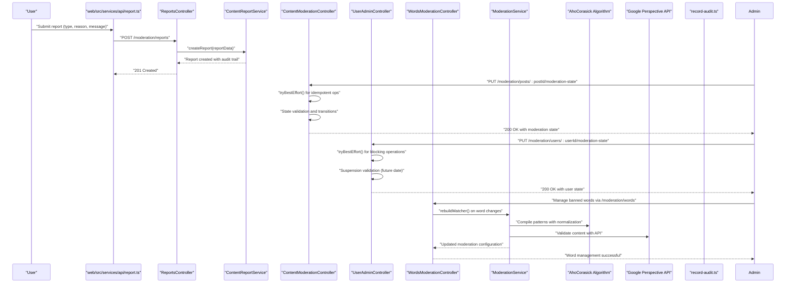

**Diagram sources**
- [report.ts](file://web/src/services/api/report.ts#L1-L12)
- [reports-moderation.controller.ts](file://server/src/modules/moderation/reports/reports-moderation.controller.ts#L8-L21)
- [report-moderation.service.ts](file://server/src/modules/moderation/reports/report-moderation.service.ts#L9-L39)
- [content-moderation.controller.ts](file://server/src/modules/moderation/content/content-moderation.controller.ts#L31-L55)
- [user-moderation.controller.ts](file://server/src/modules/moderation/user/user-moderation.controller.ts#L42-L64)
- [words-moderation.controller.ts](file://server/src/modules/moderation/words/words-moderation.controller.ts#L22-L42)
- [moderator.service.ts](file://server/src/infra/services/moderator/moderator.service.ts#L435-L437)
- [aho-corasick.ts](file://server/src/infra/services/moderator/aho-corasick.ts#L20-L32)
- [record-audit.ts](file://server/src/lib/record-audit.ts#L1-L20)

## Detailed Component Analysis

### Modular Content Moderation Pipeline
The content moderation module provides unified state management with enhanced error handling for idempotent operations.

**Enhanced Error Handling Pattern**:
- **Best-effort Operations**: Uses tryBestEffort() function to handle idempotent moderation operations
- **Ignored Errors**: Specific error messages are ignored to prevent cascade failures
- **State Validation**: Comprehensive validation for state transitions and content existence

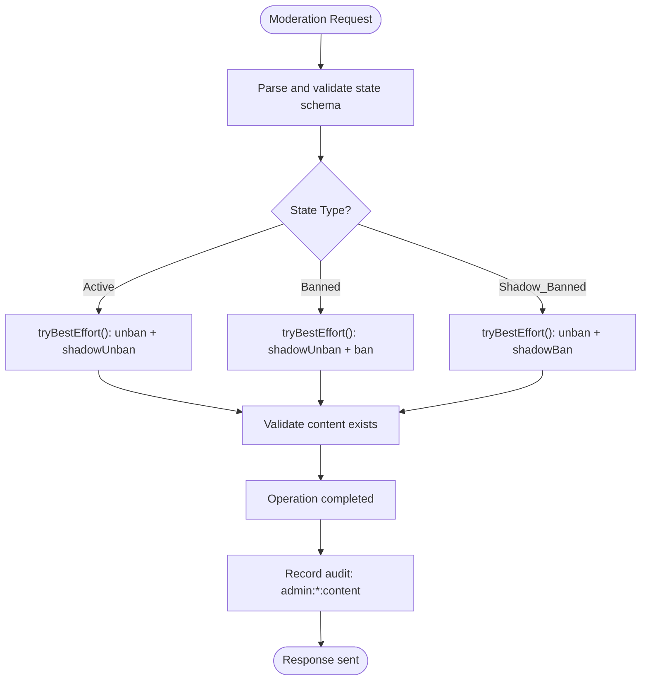

**Diagram sources**
- [content-moderation.controller.ts](file://server/src/modules/moderation/content/content-moderation.controller.ts#L31-L55)
- [content-moderation.controller.ts](file://server/src/modules/moderation/content/content-moderation.controller.ts#L14-L27)
- [content-moderation.service.ts](file://server/src/modules/moderation/content/content-moderation.service.ts#L6-L41)

**Section sources**
- [content-moderation.controller.ts](file://server/src/modules/moderation/content/content-moderation.controller.ts#L7-L27)
- [content-moderation.controller.ts](file://server/src/modules/moderation/content/content-moderation.controller.ts#L31-L55)
- [content-moderation.service.ts](file://server/src/modules/moderation/content/content-moderation.service.ts#L6-L41)

### Enhanced Reports Moderation System
The reports module now supports advanced filtering, bulk operations, and comprehensive pagination.

**Advanced Filtering Capabilities**:
- **Type-based Filtering**: Filter by Post, Comment, or Both
- **Status Filtering**: Support for pending, resolved, and ignored statuses
- **Pagination Metadata**: Complete pagination information including total counts
- **Bulk Deletion**: Efficient batch deletion of reports

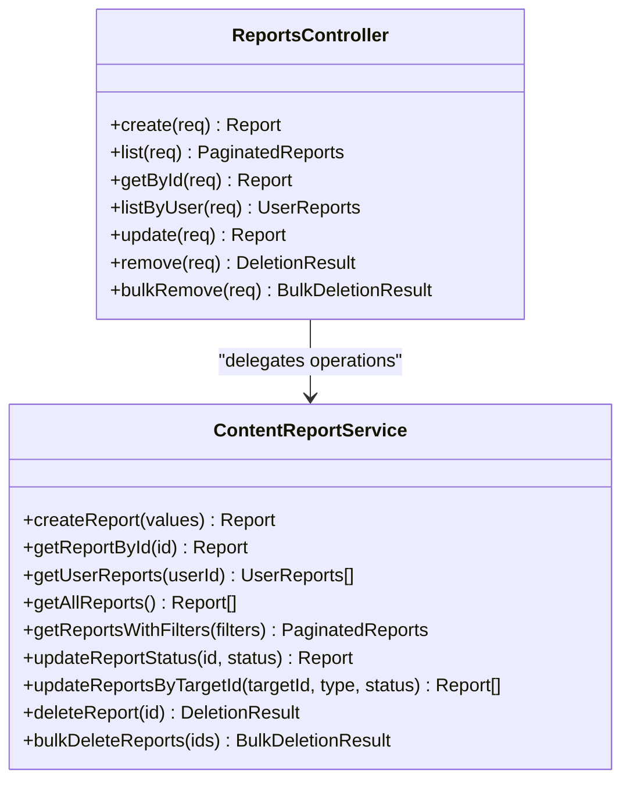

**Diagram sources**
- [reports-moderation.controller.ts](file://server/src/modules/moderation/reports/reports-moderation.controller.ts#L8-L78)
- [report-moderation.service.ts](file://server/src/modules/moderation/reports/report-moderation.service.ts#L8-L159)

**Section sources**
- [reports-moderation.controller.ts](file://server/src/modules/moderation/reports/reports-moderation.controller.ts#L23-L41)
- [reports-moderation.controller.ts](file://server/src/modules/moderation/reports/reports-moderation.controller.ts#L73-L78)
- [report-moderation.service.ts](file://server/src/modules/moderation/reports/report-moderation.service.ts#L70-L91)
- [report-moderation.service.ts](file://server/src/modules/moderation/reports/report-moderation.service.ts#L141-L156)

### Comprehensive User Moderation Framework
The user moderation module provides complete user lifecycle management with enhanced validation and search capabilities.

**User Management Features**:
- **Blocking Operations**: Immediate user blocking with idempotent error handling
- **Suspension Management**: Future-dated suspensions with comprehensive validation
- **Search Functionality**: Privacy-preserving user search by email or username
- **State Retrieval**: Detailed suspension status queries

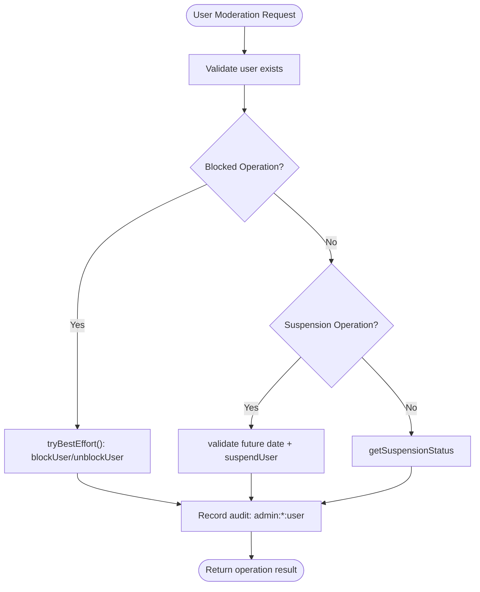

**Diagram sources**
- [user-moderation.controller.ts](file://server/src/modules/moderation/user/user-moderation.controller.ts#L42-L64)
- [user-moderation.controller.ts](file://server/src/modules/moderation/user/user-moderation.controller.ts#L9-L24)
- [user-moderation.service.ts](file://server/src/modules/moderation/user/user-moderation.service.ts#L72-L107)

**Section sources**
- [user-moderation.controller.ts](file://server/src/modules/moderation/user/user-moderation.controller.ts#L28-L71)
- [user-moderation.service.ts](file://server/src/modules/moderation/user/user-moderation.service.ts#L72-L107)
- [user-moderation.service.ts](file://server/src/modules/moderation/user/user-moderation.service.ts#L121-L142)

### Administrative Interface and Endpoint Migration
The administrative interface has been updated to work with the new modular endpoints structure.

**Endpoint Migration**:
- **Reports**: `/moderation/reports` replaces `/manage/reports`
- **User Management**: `/moderation/users` replaces `/admin/users`
- **Content Moderation**: `/moderation/posts/:postId/moderation-state` for state updates
- **Words Management**: `/moderation/words` for banned word administration

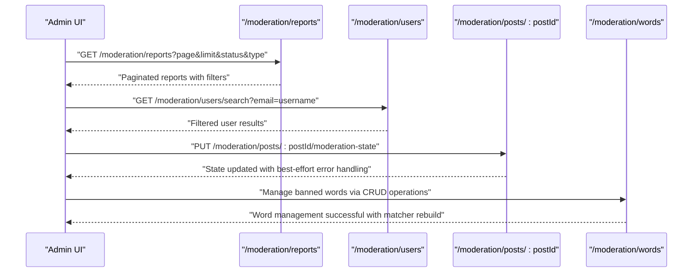

**Diagram sources**
- [reports-moderation.route.ts](file://server/src/modules/moderation/reports/reports-moderation.route.ts#L15-L20)
- [user-moderation.route.ts](file://server/src/modules/moderation/user/user-moderation.route.ts#L11-L14)
- [content-moderation.route.ts](file://server/src/modules/moderation/content/content-moderation.route.ts#L11-L12)
- [words-moderation.route.ts](file://server/src/modules/moderation/words/words-moderation.route.ts#L9-L16)

**Section sources**
- [reports-moderation.route.ts](file://server/src/modules/moderation/reports/reports-moderation.route.ts#L15-L20)
- [user-moderation.route.ts](file://server/src/modules/moderation/user/user-moderation.route.ts#L11-L14)
- [content-moderation.route.ts](file://server/src/modules/moderation/content/content-moderation.route.ts#L11-L12)
- [words-moderation.route.ts](file://server/src/modules/moderation/words/words-moderation.route.ts#L9-L16)

### Audit Logging and Policy Enforcement
Enhanced audit logging provides comprehensive tracking of all moderation activities with improved metadata and error handling.

**Audit Improvements**:
- **Comprehensive Coverage**: All moderation operations are logged with standardized actions
- **Enhanced Metadata**: Rich context including content types, user actions, and device information
- **Error Handling**: Best-effort audit logging to prevent cascade failures
- **Policy Alignment**: Standardized actions support compliance and policy enforcement

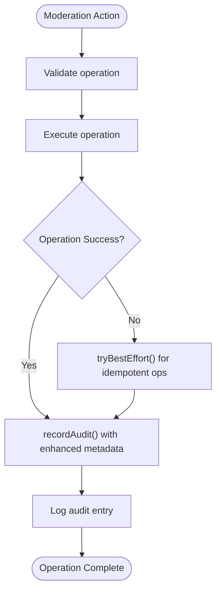

**Diagram sources**
- [report-moderation.service.ts](file://server/src/modules/moderation/reports/report-moderation.service.ts#L30-L36)
- [report-moderation.service.ts](file://server/src/modules/moderation/reports/report-moderation.service.ts#L102-L107)
- [user-moderation.service.ts](file://server/src/modules/moderation/user/user-moderation.service.ts#L98-L106)
- [content-moderation.controller.ts](file://server/src/modules/moderation/content/content-moderation.controller.ts#L14-L27)

**Section sources**
- [report-moderation.service.ts](file://server/src/modules/moderation/reports/report-moderation.service.ts#L30-L36)
- [report-moderation.service.ts](file://server/src/modules/moderation/reports/report-moderation.service.ts#L102-L107)
- [user-moderation.service.ts](file://server/src/modules/moderation/user/user-moderation.service.ts#L98-L106)
- [content-moderation.controller.ts](file://server/src/modules/moderation/content/content-moderation.controller.ts#L14-L27)

## AI-Powered Content Moderation System

### Aho-Corasick Algorithm Implementation
The moderation system now incorporates a sophisticated Aho-Corasick algorithm for efficient multi-pattern string matching, providing real-time detection of prohibited content patterns.

**Algorithm Features**:
- **Multi-Pattern Matching**: Simultaneously searches for multiple banned words and patterns
- **Linear Time Complexity**: O(n + z + m) where n is text length, z is matches, m is total pattern length
- **Failure Function**: Implements failure links for efficient state transitions
- **Output Functions**: Collects all matching patterns at each position

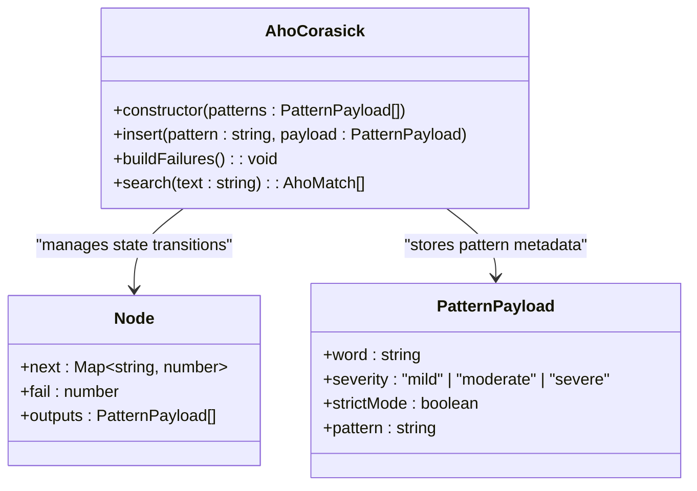

**Diagram sources**
- [aho-corasick.ts](file://server/src/infra/services/moderator/aho-corasick.ts#L20-L32)
- [aho-corasick.ts](file://server/src/infra/services/moderator/aho-corasick.ts#L14-L18)
- [aho-corasick.ts](file://server/src/infra/services/moderator/aho-corasick.ts#L34-L51)

**Section sources**
- [aho-corasick.ts](file://server/src/infra/services/moderator/aho-corasick.ts#L1-L118)

### Dynamic Word Detection Capabilities
The system provides advanced dynamic word detection with support for wildcards, variant patterns, and intelligent boundary matching.

**Detection Features**:
- **Wildcard Patterns**: Support for '*' characters in banned words (e.g., "f*ck" matches "fuck", "fucck", etc.)
- **Variant Matching**: Handles leet speak variations and character substitutions
- **Boundary Detection**: Ensures matches occur at word boundaries to prevent partial matches
- **Normalization**: Intelligent text normalization for accurate pattern matching

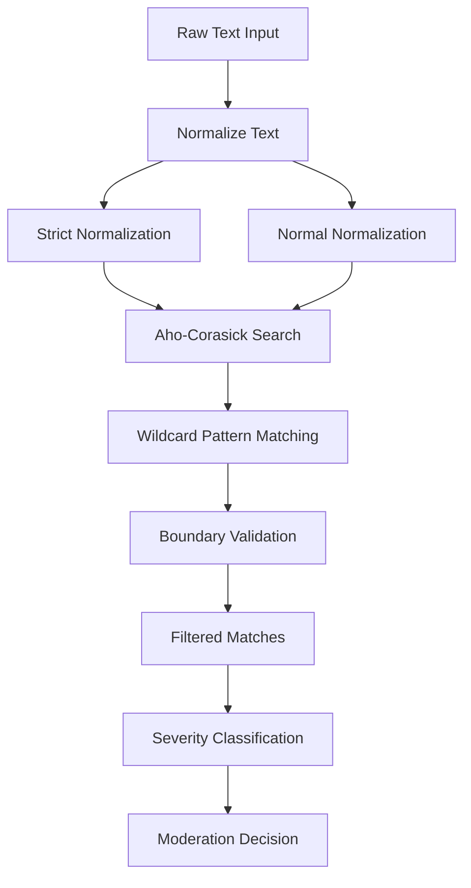

**Diagram sources**
- [moderator.service.ts](file://server/src/infra/services/moderator/moderator.service.ts#L299-L361)
- [normalize.ts](file://server/src/infra/services/moderator/normalize.ts#L42-L83)
- [normalize.ts](file://server/src/infra/services/moderator/normalize.ts#L85-L90)

**Section sources**
- [moderator.service.ts](file://server/src/infra/services/moderator/moderator.service.ts#L299-L361)
- [normalize.ts](file://server/src/infra/services/moderator/normalize.ts#L1-L91)

### Integrated Moderation Service
The central moderation service coordinates multiple validation layers including banned word detection, spam filtering, and content policy validation.

**Service Architecture**:
- **Caching Layer**: NodeCache with 1-hour TTL for performance optimization
- **Version Tracking**: Automatic detection of banned word database changes
- **Concurrent Loading**: Lazy initialization with concurrent loading prevention
- **Fail-Closed Strategy**: Conservative approach to API failures

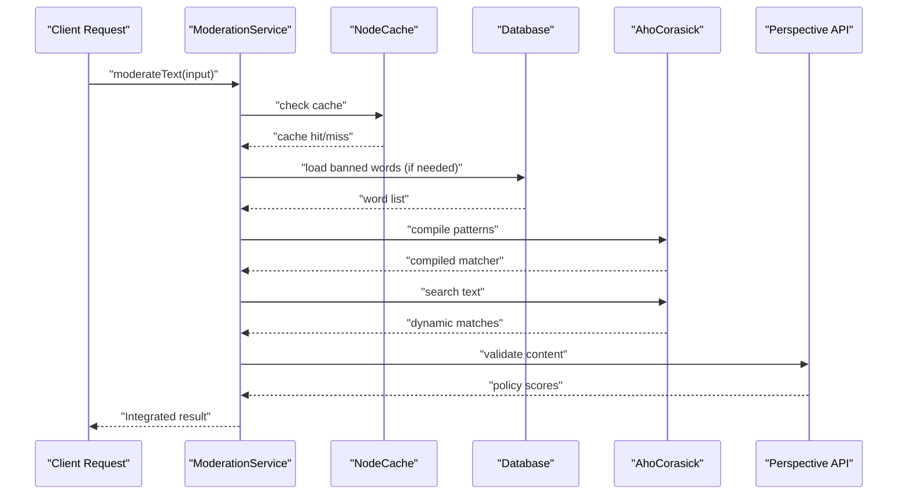

**Diagram sources**
- [moderator.service.ts](file://server/src/infra/services/moderator/moderator.service.ts#L409-L437)
- [moderator.service.ts](file://server/src/infra/services/moderator/moderator.service.ts#L546-L591)

**Section sources**
- [moderator.service.ts](file://server/src/infra/services/moderator/moderator.service.ts#L395-L597)

## Banned Words Management

### Words Moderation Module
The words moderation module provides comprehensive CRUD operations for managing banned words with real-time pattern compilation and validation.

**Management Features**:
- **Create Operations**: Add new banned words with severity levels and strict mode options
- **Update Operations**: Modify existing word properties and configurations
- **Delete Operations**: Remove words from the banned list with validation
- **List Operations**: Retrieve all banned words with pagination support
- **Configuration Export**: Generate moderation configuration for runtime use

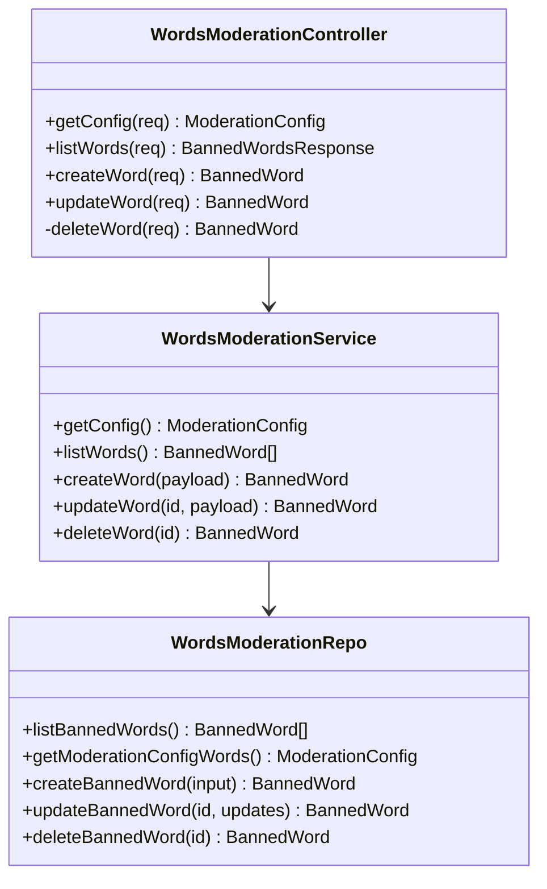

**Diagram sources**
- [words-moderation.controller.ts](file://server/src/modules/moderation/words/words-moderation.controller.ts#L10-L43)
- [words-moderation.service.ts](file://server/src/modules/moderation/words/words-moderation.service.ts#L12-L63)
- [words-moderation.repo.ts](file://server/src/modules/moderation/words/words-moderation.repo.ts#L16-L105)

**Section sources**
- [words-moderation.controller.ts](file://server/src/modules/moderation/words/words-moderation.controller.ts#L1-L46)
- [words-moderation.service.ts](file://server/src/modules/moderation/words/words-moderation.service.ts#L1-L66)
- [words-moderation.repo.ts](file://server/src/modules/moderation/words/words-moderation.repo.ts#L1-L106)

### Database Schema and Persistence
The banned words system uses a structured database schema supporting efficient querying and real-time updates.

**Database Features**:
- **Word Normalization**: Automatic lowercase and trimming of banned words
- **Strict Mode Support**: Optional strict character normalization for precise matching
- **Severity Levels**: Configurable severity levels for different content types
- **Version Tracking**: Timestamp-based versioning for automatic matcher rebuilding
- **Index Optimization**: Proper indexing for efficient word lookup and sorting

**Section sources**
- [words-moderation.repo.ts](file://server/src/modules/moderation/words/words-moderation.repo.ts#L16-L105)

## Google Perspective API Integration

### Content Policy Validation
The system integrates with Google Perspective API to provide AI-powered content policy validation beyond simple keyword matching.

**API Integration Features**:
- **Multi-Attribute Analysis**: Evaluates toxicity, insult, identity attack, threat, and profanity
- **Language Detection**: Automatic language detection with franc library
- **Threshold-Based Scoring**: Configurable thresholds for different content attributes
- **Context-Aware Detection**: Analyzes content spans with surrounding context
- **Fail-Closed Strategy**: Conservative approach to API failures and errors

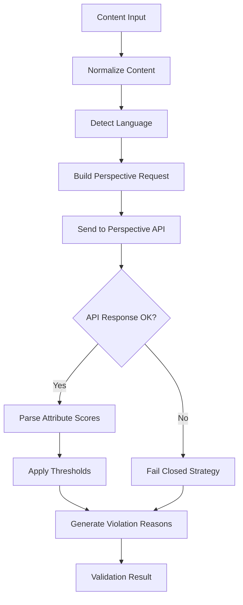

**Diagram sources**
- [moderator.service.ts](file://server/src/infra/services/moderator/moderator.service.ts#L458-L544)

**Section sources**
- [moderator.service.ts](file://server/src/infra/services/moderator/moderator.service.ts#L65-L73)
- [moderator.service.ts](file://server/src/infra/services/moderator/moderator.service.ts#L458-L544)

### Spam and Self-Harm Detection
Beyond keyword matching, the system includes specialized detection for spam content and self-harm encouragement.

**Detection Mechanisms**:
- **Spam Detection**: Identifies excessive links, repeated characters, and oversized content
- **Self-Harm Recognition**: Pattern matching for suicide encouragement keywords
- **Targeted Insult Detection**: Context-aware identification of personal attacks
- **Mention Filtering**: Special handling for @mentions in targeted content

**Section sources**
- [moderator.service.ts](file://server/src/infra/services/moderator/moderator.service.ts#L363-L373)
- [moderator.service.ts](file://server/src/infra/services/moderator/moderator.service.ts#L451-L454)
- [moderator.service.ts](file://server/src/infra/services/moderator/moderator.service.ts#L520-L535)

## Dynamic Word Detection Capabilities

### Advanced Pattern Matching
The system provides sophisticated pattern matching capabilities extending beyond simple keyword detection.

**Pattern Features**:
- **Leet Speak Support**: Automatic conversion of leet characters (e.g., @ → a, 4 → a, 3 → e)
- **Combining Character Handling**: Proper normalization of Unicode combining marks
- **Boundary Matching**: Ensures matches occur at word boundaries to prevent false positives
- **Wildcard Expansion**: Intelligent wildcard pattern matching with DFS optimization
- **Variant Detection**: Handles multiple character representations of the same letter

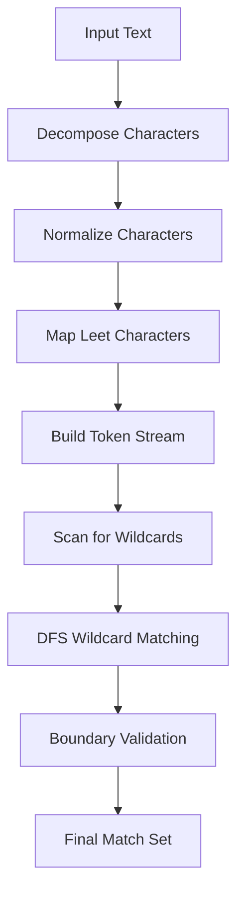

**Diagram sources**
- [normalize.ts](file://server/src/infra/services/moderator/normalize.ts#L42-L83)
- [normalize.ts](file://server/src/infra/services/moderator/normalize.ts#L109-L151)
- [normalize.ts](file://server/src/infra/services/moderator/normalize.ts#L153-L210)

**Section sources**
- [normalize.ts](file://server/src/infra/services/moderator/normalize.ts#L1-L91)
- [moderator.service.ts](file://server/src/infra/services/moderator/moderator.service.ts#L107-L210)

### Performance Optimization
The moderation system implements several performance optimizations for scalable content processing.

**Optimization Strategies**:
- **Caching**: NodeCache with 1-hour TTL for moderation results
- **Lazy Loading**: On-demand compilation of banned word patterns
- **Version Checking**: 30-second intervals for database version checks
- **Concurrent Prevention**: Loading promise to prevent multiple concurrent compilations
- **Memory Management**: Efficient pattern storage and index mapping

**Section sources**
- [moderator.service.ts](file://server/src/infra/services/moderator/moderator.service.ts#L59-L63)
- [moderator.service.ts](file://server/src/infra/services/moderator/moderator.service.ts#L409-L433)

## Dependency Analysis
The enhanced modular architecture maintains clear separation of concerns while enabling necessary integrations between components.

**Module Dependencies**:
- **Content Moderation**: Depends on PostAdapter, CommentAdapter, and ContentReportService for report resolution
- **Reports Moderation**: Depends on ContentReportRepo for persistence and record-audit for logging
- **User Moderation**: Integrates with authentication service for user listing and management
- **Words Moderation**: Depends on WordsModerationRepo for banned word management
- **Moderation Service**: Integrates with all moderation modules and external APIs
- **Cross-module Communication**: Content moderation services coordinate with report resolution and word updates

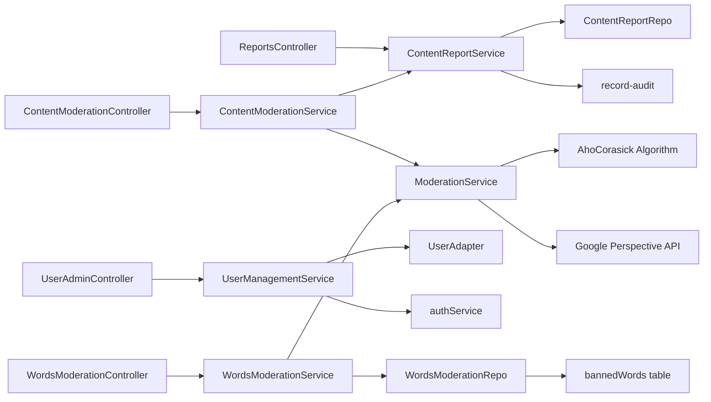

**Diagram sources**
- [content-moderation.controller.ts](file://server/src/modules/moderation/content/content-moderation.controller.ts#L1-L5)
- [content-moderation.service.ts](file://server/src/modules/moderation/content/content-moderation.service.ts#L1-L4)
- [reports-moderation.controller.ts](file://server/src/modules/moderation/reports/reports-moderation.controller.ts#L1-L4)
- [report-moderation.service.ts](file://server/src/modules/moderation/reports/report-moderation.service.ts#L1-L6)
- [user-moderation.controller.ts](file://server/src/modules/moderation/user/user-moderation.controller.ts#L1-L7)
- [user-moderation.service.ts](file://server/src/modules/moderation/user/user-moderation.service.ts#L1-L4)
- [words-moderation.controller.ts](file://server/src/modules/moderation/words/words-moderation.controller.ts#L1-L3)
- [words-moderation.service.ts](file://server/src/modules/moderation/words/words-moderation.service.ts#L1-L10)
- [words-moderation.repo.ts](file://server/src/modules/moderation/words/words-moderation.repo.ts#L1-L14)
- [moderator.service.ts](file://server/src/infra/services/moderator/moderator.service.ts#L1-L11)

**Section sources**
- [content-moderation.controller.ts](file://server/src/modules/moderation/content/content-moderation.controller.ts#L1-L5)
- [content-moderation.service.ts](file://server/src/modules/moderation/content/content-moderation.service.ts#L1-L4)
- [reports-moderation.controller.ts](file://server/src/modules/moderation/reports/reports-moderation.controller.ts#L1-L4)
- [report-moderation.service.ts](file://server/src/modules/moderation/reports/report-moderation.service.ts#L1-L6)
- [user-moderation.controller.ts](file://server/src/modules/moderation/user/user-moderation.controller.ts#L1-L7)
- [user-moderation.service.ts](file://server/src/modules/moderation/user/user-moderation.service.ts#L1-L4)
- [words-moderation.controller.ts](file://server/src/modules/moderation/words/words-moderation.controller.ts#L1-L3)
- [words-moderation.service.ts](file://server/src/modules/moderation/words/words-moderation.service.ts#L1-L10)
- [words-moderation.repo.ts](file://server/src/modules/moderation/words/words-moderation.repo.ts#L1-L14)
- [moderator.service.ts](file://server/src/infra/services/moderator/moderator.service.ts#L1-L11)

## Performance Considerations
The enhanced modular architecture introduces several performance optimizations and considerations:

**Enhanced Performance Features**:
- **Modular Loading**: Each submodule loads independently, reducing initial load time
- **Improved Error Handling**: Best-effort operations prevent cascade failures and improve resilience
- **Advanced Filtering**: Efficient database queries with proper indexing support
- **Bulk Operations**: Optimized batch processing for report management
- **Pagination Optimization**: Comprehensive pagination metadata reduces client-side processing
- **Caching Strategy**: NodeCache with 1-hour TTL for moderation results
- **Lazy Compilation**: On-demand banned word pattern compilation
- **Version Checking**: 30-second intervals for database version synchronization
- **Concurrent Prevention**: Loading promises prevent multiple concurrent compilations

**Recommendations**:
- Implement database indexes for frequently queried fields (report status, target IDs, user IDs, word patterns)
- Monitor audit log performance with sampling strategies
- Consider caching for frequently accessed moderation metrics
- Implement connection pooling for database adapters
- Add circuit breakers for external service dependencies
- Monitor Aho-Corasick memory usage for large word lists
- Optimize wildcard pattern compilation for frequently used patterns

## Troubleshooting Guide
Common issues and resolutions for the enhanced moderation system:

**Content Moderation Issues**:
- **State Transition Errors**: Verify content exists and state transitions are valid
- **Idempotent Operation Failures**: Check for ignored errors in tryBestEffort operations
- **Best-effort Pattern**: Ensure operations are designed for idempotency

**Reports Moderation Issues**:
- **Filter Validation**: Verify filter parameters (type, status, page, limit) are valid
- **Bulk Deletion Errors**: Ensure report IDs array is non-empty and contains valid IDs
- **Pagination Issues**: Check pagination parameters and total count calculations

**User Moderation Issues**:
- **Suspension Validation**: Ensure suspension end dates are in the future
- **Search Filter Requirements**: At least one filter (email or username) must be provided
- **Blocking Operations**: Check for already blocked/already unblocked states

**Words Moderation Issues**:
- **Pattern Compilation Errors**: Verify banned words are properly formatted and normalized
- **Matcher Rebuild Failures**: Check database connectivity and word list integrity
- **Severity Level Validation**: Ensure severity values are valid (mild, moderate, severe)

**Moderation Service Issues**:
- **API Timeout Errors**: Check Perspective API connectivity and rate limits
- **Cache Invalidation**: Verify cache clearing on word list changes
- **Version Synchronization**: Ensure database version tracking works correctly
- **Memory Leaks**: Monitor Aho-Corasick pattern memory usage

**Audit and Logging Issues**:
- **Audit Entry Failures**: Verify audit logging is configured correctly
- **Metadata Validation**: Ensure audit metadata includes required fields
- **Error Handling**: Check tryBestEffort patterns for proper error handling

**Section sources**
- [content-moderation.controller.ts](file://server/src/modules/moderation/content/content-moderation.controller.ts#L7-L27)
- [reports-moderation.controller.ts](file://server/src/modules/moderation/reports/reports-moderation.controller.ts#L73-L78)
- [user-moderation.controller.ts](file://server/src/modules/moderation/user/user-moderation.controller.ts#L9-L24)
- [words-moderation.service.ts](file://server/src/modules/moderation/words/words-moderation.service.ts#L51-L62)
- [moderator.service.ts](file://server/src/infra/services/moderator/moderator.service.ts#L474-L497)
- [report-moderation.service.ts](file://server/src/modules/moderation/reports/report-moderation.service.ts#L141-L156)
- [user-moderation.service.ts](file://server/src/modules/moderation/user/user-moderation.service.ts#L84-L88)

## Conclusion
The Flick content moderation system has been successfully enhanced with a comprehensive AI-powered moderation framework that significantly improves content governance capabilities. The new architecture provides specialized handling for content moderation, reports management, user administration, and comprehensive banned words management while maintaining sophisticated AI-powered content filtering through Aho-Corasick algorithm integration, Google Perspective API validation, and dynamic word detection capabilities.

The modular design with four specialized submodules (content, reports, user, and words moderation) provides enhanced maintainability, scalability, and operational efficiency. Key improvements include real-time banned word detection with wildcard support, intelligent pattern matching with boundary validation, AI-powered content policy validation, and comprehensive caching strategies for optimal performance.

The integration of multiple moderation layers ensures robust content governance while maintaining transparency and traceability for all moderation activities. The system now provides a more sophisticated foundation for balancing free expression with community safety, offering administrators powerful tools for content management while preserving user rights and expression freedoms.

## Appendices

### Policy Enforcement and Automated Flagging
The enhanced modular architecture supports comprehensive policy enforcement through standardized audit actions, AI-powered content validation, and real-time banned word detection.

**Policy Alignment Features**:
- **Standardized Audit Actions**: Consistent action naming supports policy compliance across all moderation modules
- **Enhanced Metadata**: Rich context information from AI validation and pattern matching aids in policy enforcement reviews
- **Comprehensive Logging**: Full audit trail from raw content through final moderation decisions supports compliance and policy monitoring
- **Error Handling**: Best-effort operations ensure policy enforcement continues despite individual failures
- **Multi-Layer Validation**: Combines keyword matching, AI analysis, and human review for comprehensive policy enforcement

**Section sources**
- [record-audit.ts](file://server/src/lib/record-audit.ts#L1-L20)
- [actions.ts](file://server/src/shared/constants/audit/actions.ts#L1-L66)
- [content-moderation.controller.ts](file://server/src/modules/moderation/content/content-moderation.controller.ts#L14-L27)
- [moderator.service.ts](file://server/src/infra/services/moderator/moderator.service.ts#L546-L591)

### Human Review Processes
The enhanced modular system maintains streamlined human review processes with advanced filtering, bulk operations, and AI-assisted content analysis capabilities.

**Review Process Enhancements**:
- **Advanced Filtering**: Reports can be filtered by type, status, AI violation types, and severity levels
- **Bulk Operations**: Efficient handling of multiple reports through bulk deletion and status updates
- **AI-Assisted Analysis**: Moderators receive detailed AI analysis results including matched patterns and confidence scores
- **Dynamic Word Context**: Review interface shows specific word matches and their locations in content
- **Severity Classification**: Clear indication of content severity helps prioritize review workload

**Section sources**
- [reports-moderation.controller.ts](file://server/src/modules/moderation/reports/reports-moderation.controller.ts#L23-L41)
- [reports-moderation.controller.ts](file://server/src/modules/moderation/reports/reports-moderation.controller.ts#L73-L78)
- [content-moderation.controller.ts](file://server/src/modules/moderation/content/content-moderation.controller.ts#L31-L55)
- [user-moderation.controller.ts](file://server/src/modules/moderation/user/user-moderation.controller.ts#L42-L64)
- [moderator.service.ts](file://server/src/infra/services/moderator/moderator.service.ts#L556-L571)

### Appeals Procedures
The enhanced modular architecture provides a comprehensive foundation for implementing appeals procedures through enhanced audit logging, user management capabilities, and AI-assisted content analysis.

**Appeals Implementation Framework**:
- **Audit Trail**: Comprehensive audit logs from raw content through final moderation decisions support appeals tracking and review
- **User Management**: Enhanced user management supports appeals-related user state changes and communication
- **Report Tracking**: Improved report management supports appeals queue integration and status tracking
- **AI Evidence**: Detailed AI analysis results and pattern matching evidence support appeals review processes
- **State Management**: Flexible state management supports various appeals outcomes and user impact considerations

**Section sources**
- [moderator.service.ts](file://server/src/infra/services/moderator/moderator.service.ts#L556-L591)
- [record-audit.ts](file://server/src/lib/record-audit.ts#L1-L20)
- [user-moderation.controller.ts](file://server/src/modules/moderation/user/user-moderation.controller.ts#L42-L64)

### Guidelines for Moderators and Escalation
The enhanced modular system provides clear guidelines and escalation procedures for effective content moderation with AI assistance.

**Moderator Guidelines**:
- **State-Based Moderation**: Use appropriate state transitions (active, banned, shadow_banned) with AI validation support
- **Idempotent Operations**: Design operations to handle repeated requests gracefully with best-effort error handling
- **Bulk Operations**: Utilize bulk operations for efficient report management with AI-assisted prioritization
- **AI-Assisted Decisions**: Leverage AI analysis results for informed moderation decisions
- **Pattern Understanding**: Understand AI pattern matching to interpret moderation violations accurately
- **Severity Assessment**: Use AI-provided severity levels to determine appropriate moderation actions

**Escalation Procedures**:
- **Complex AI Conflicts**: Complex moderation decisions involving AI analysis should be escalated for review
- **Appeals Processing**: Appeals with AI evidence should be processed through formal appeals procedures
- **System Errors**: AI service failures or API errors should trigger technical escalation
- **Policy Questions**: Unclear policy applications should be escalated to policy review teams
- **User Impact**: Consider user impact when escalating moderation decisions, especially for severe actions

**Section sources**
- [content-moderation.controller.ts](file://server/src/modules/moderation/content/content-moderation.controller.ts#L7-L27)
- [reports-moderation.controller.ts](file://server/src/modules/moderation/reports/reports-moderation.controller.ts#L73-L78)
- [user-moderation.controller.ts](file://server/src/modules/moderation/user/user-moderation.controller.ts#L9-L24)
- [moderator.service.ts](file://server/src/infra/services/moderator/moderator.service.ts#L474-L497)