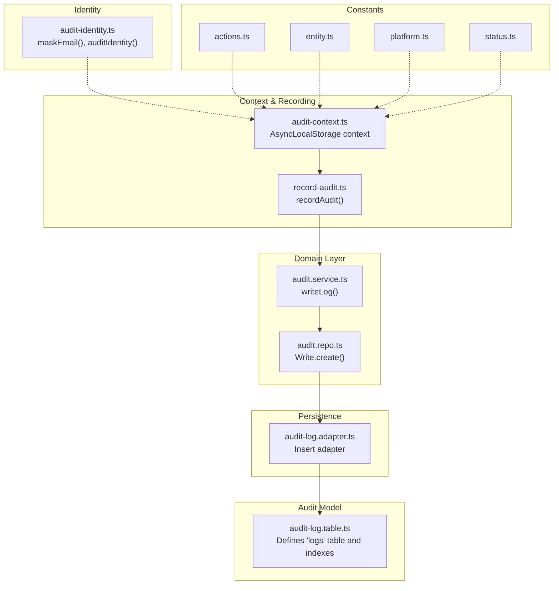
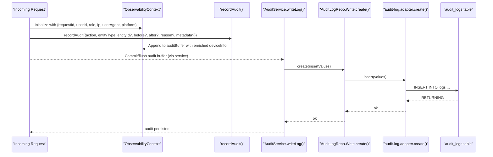
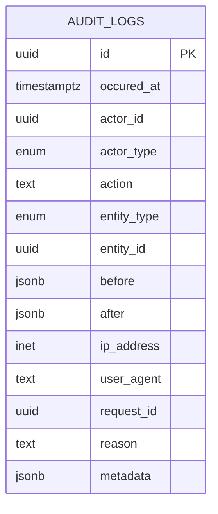
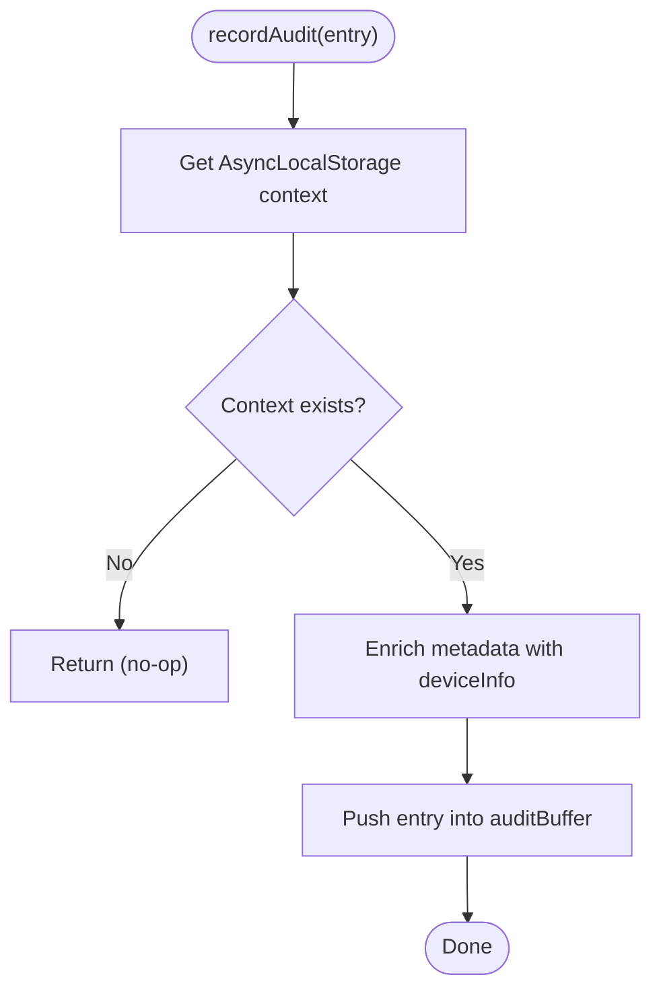
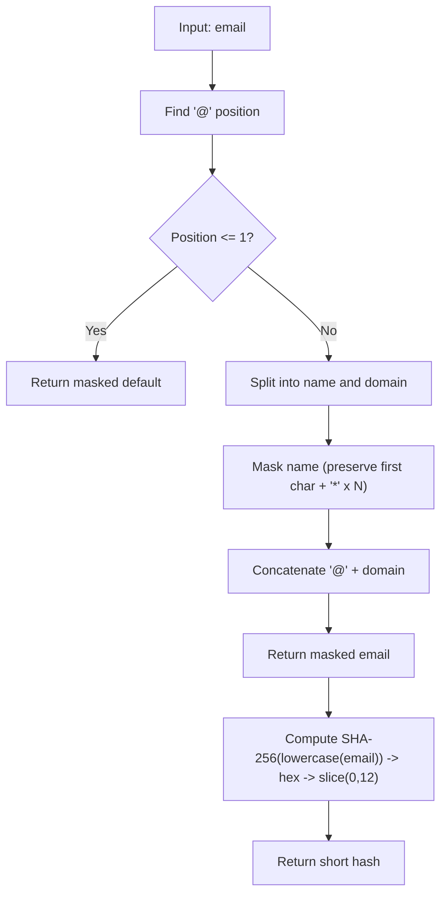
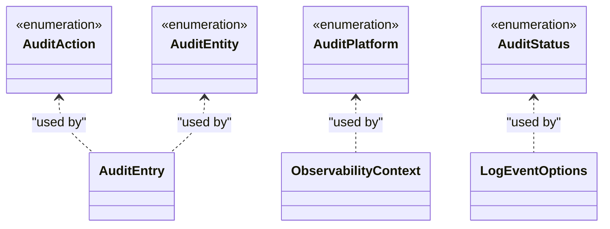
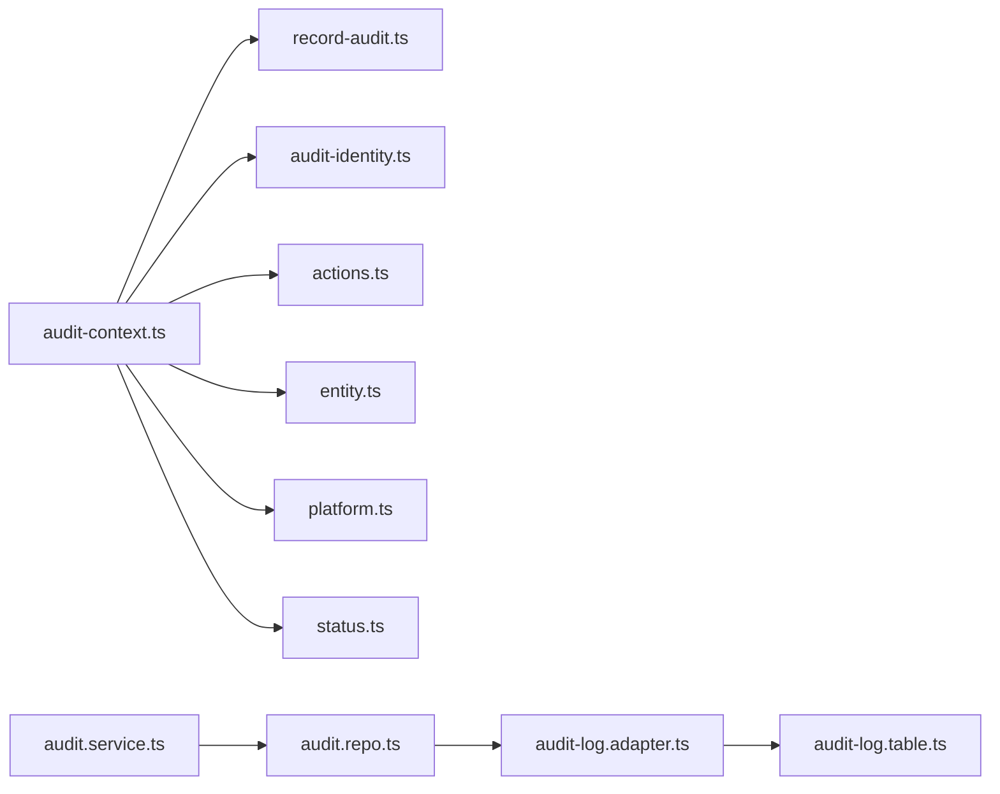

# Audit and Logging

<cite>
**Referenced Files in This Document**
- [audit-log.table.ts](file://server/src/infra/db/tables/audit-log.table.ts)
- [audit-log.adapter.ts](file://server/src/infra/db/adapters/audit-log.adapter.ts)
- [audit.service.ts](file://server/src/modules/audit/audit.service.ts)
- [audit.repo.ts](file://server/src/modules/audit/audit.repo.ts)
- [audit.types.ts](file://server/src/modules/audit/audit.types.ts)
- [audit-context.ts](file://server/src/modules/audit/audit-context.ts)
- [record-audit.ts](file://server/src/lib/record-audit.ts)
- [audit-identity.ts](file://server/src/lib/audit-identity.ts)
- [actions.ts](file://server/src/shared/constants/audit/actions.ts)
- [entity.ts](file://server/src/shared/constants/audit/entity.ts)
- [platform.ts](file://server/src/shared/constants/audit/platform.ts)
- [status.ts](file://server/src/shared/constants/audit/status.ts)
</cite>

## Table of Contents
1. [Introduction](#introduction)
2. [Project Structure](#project-structure)
3. [Core Components](#core-components)
4. [Architecture Overview](#architecture-overview)
5. [Detailed Component Analysis](#detailed-component-analysis)
6. [Dependency Analysis](#dependency-analysis)
7. [Performance Considerations](#performance-considerations)
8. [Troubleshooting Guide](#troubleshooting-guide)
9. [Conclusion](#conclusion)

## Introduction
This document describes the audit and logging system in the Flick database design. It covers the Audit Logs table structure, action tracking, entity change capture, user identification, and timestamp management. It also explains the audit identity system for preserving user context and session tracking, the audit recording mechanisms for CRUD operations, permission changes, and content modifications, and the audit types, action categories, and status tracking. Finally, it outlines data retention, archiving strategies, compliance considerations, query patterns, filtering capabilities, analytical reporting features, and performance optimizations for high-volume audit logging.

## Project Structure
The audit and logging system spans several layers:
- Data model: Drizzle ORM table definition for audit logs with indexes.
- Persistence adapter: Database insertion adapter for audit logs.
- Repository and service: Thin repository delegating writes to the adapter; a service wrapper for writing audit entries.
- Context and recording: Async-local observability context and a lightweight recorder that buffers audit entries per request.
- Identity: Utilities to mask and hash identities for privacy-preserving audit trails.
- Constants: Centralized enumerations for actions, entities, platforms, and statuses.

**Diagram sources**
- [audit-log.table.ts](file://server/src/infra/db/tables/audit-log.table.ts#L40-L74)
- [audit-log.adapter.ts](file://server/src/infra/db/adapters/audit-log.adapter.ts#L1-L9)
- [audit.service.ts](file://server/src/modules/audit/audit.service.ts#L1-L10)
- [audit.repo.ts](file://server/src/modules/audit/audit.repo.ts#L1-L10)
- [audit-context.ts](file://server/src/modules/audit/audit-context.ts#L1-L29)
- [record-audit.ts](file://server/src/lib/record-audit.ts#L1-L20)
- [audit-identity.ts](file://server/src/lib/audit-identity.ts#L1-L30)
- [actions.ts](file://server/src/shared/constants/audit/actions.ts#L1-L66)
- [entity.ts](file://server/src/shared/constants/audit/entity.ts#L1-L15)
- [platform.ts](file://server/src/shared/constants/audit/platform.ts#L1-L9)
- [status.ts](file://server/src/shared/constants/audit/status.ts#L1-L3)

**Section sources**
- [audit-log.table.ts](file://server/src/infra/db/tables/audit-log.table.ts#L1-L74)
- [audit-log.adapter.ts](file://server/src/infra/db/adapters/audit-log.adapter.ts#L1-L9)
- [audit.service.ts](file://server/src/modules/audit/audit.service.ts#L1-L10)
- [audit.repo.ts](file://server/src/modules/audit/audit.repo.ts#L1-L10)
- [audit-context.ts](file://server/src/modules/audit/audit-context.ts#L1-L29)
- [record-audit.ts](file://server/src/lib/record-audit.ts#L1-L20)
- [audit-identity.ts](file://server/src/lib/audit-identity.ts#L1-L30)
- [actions.ts](file://server/src/shared/constants/audit/actions.ts#L1-L66)
- [entity.ts](file://server/src/shared/constants/audit/entity.ts#L1-L15)
- [platform.ts](file://server/src/shared/constants/audit/platform.ts#L1-L9)
- [status.ts](file://server/src/shared/constants/audit/status.ts#L1-L3)

## Core Components
- Audit Logs table: Defines the schema for storing audit events, including actor, action, entity, timestamps, IP, user agent, request correlation, reasons, and JSON metadata. Includes indexes on entity, actor, and occurrence time.
- Adapter: Provides a single insert operation against the audit logs table.
- Service and Repository: Encapsulate write operations behind a thin service facade and a repository that delegates to the adapter.
- Context and Recorder: Async-local storage holds request-scoped audit buffers. A recorder appends entries enriched with device metadata into the buffer.
- Identity Utilities: Mask emails and derive short deterministic hashes for privacy-preserving identification in audit trails.
- Constants: Centralized enums for actions, entities, platforms, and statuses.

**Section sources**
- [audit-log.table.ts](file://server/src/infra/db/tables/audit-log.table.ts#L40-L74)
- [audit-log.adapter.ts](file://server/src/infra/db/adapters/audit-log.adapter.ts#L1-L9)
- [audit.service.ts](file://server/src/modules/audit/audit.service.ts#L1-L10)
- [audit.repo.ts](file://server/src/modules/audit/audit.repo.ts#L1-L10)
- [audit-context.ts](file://server/src/modules/audit/audit-context.ts#L1-L29)
- [record-audit.ts](file://server/src/lib/record-audit.ts#L1-L20)
- [audit-identity.ts](file://server/src/lib/audit-identity.ts#L1-L30)
- [actions.ts](file://server/src/shared/constants/audit/actions.ts#L1-L66)
- [entity.ts](file://server/src/shared/constants/audit/entity.ts#L1-L15)
- [platform.ts](file://server/src/shared/constants/audit/platform.ts#L1-L9)
- [status.ts](file://server/src/shared/constants/audit/status.ts#L1-L3)

## Architecture Overview
The audit pipeline captures contextualized events during requests and persists them asynchronously via a buffered approach. The context stores request identifiers, user identity, roles, IP, user agent, platform, and a buffer of audit entries. The recorder enriches entries with device metadata and pushes them into the buffer. The service writes the buffered entries to the database through the adapter and table.

**Diagram sources**
- [audit-context.ts](file://server/src/modules/audit/audit-context.ts#L17-L28)
- [record-audit.ts](file://server/src/lib/record-audit.ts#L4-L17)
- [audit.service.ts](file://server/src/modules/audit/audit.service.ts#L5-L7)
- [audit.repo.ts](file://server/src/modules/audit/audit.repo.ts#L4-L6)
- [audit-log.adapter.ts](file://server/src/infra/db/adapters/audit-log.adapter.ts#L5-L8)
- [audit-log.table.ts](file://server/src/infra/db/tables/audit-log.table.ts#L40-L70)

## Detailed Component Analysis

### Audit Logs Table Schema
The audit logs table defines the canonical structure for persisted audit events:
- Primary key: UUID
- Timestamp: Timezone-aware occurrence timestamp with default current time
- Actor: Actor ID and actor type (from role enum)
- Action: Free-form text action identifier
- Entity: Entity type and ID
- Change payload: before and after JSONB snapshots
- Network: IP address and user agent
- Correlation: Request ID for cross-system tracing
- Reason: Optional explanatory text
- Metadata: Arbitrary JSON metadata

Indexes:
- Composite index on entity type and ID
- Index on actor ID
- Descending index on occurrence timestamp

**Diagram sources**
- [audit-log.table.ts](file://server/src/infra/db/tables/audit-log.table.ts#L40-L70)

**Section sources**
- [audit-log.table.ts](file://server/src/infra/db/tables/audit-log.table.ts#L12-L38)
- [audit-log.table.ts](file://server/src/infra/db/tables/audit-log.table.ts#L40-L74)

### Audit Recording Mechanisms
- Context: Stores request-scoped audit buffer and contextual attributes such as user ID, role, IP, user agent, platform, and request ID.
- Recorder: Enriches incoming audit entries with device metadata parsed from the user agent and appends them to the buffer.
- Service/Repository: Writes buffered entries to the database using the adapter and table.

**Diagram sources**
- [record-audit.ts](file://server/src/lib/record-audit.ts#L4-L17)
- [audit-context.ts](file://server/src/modules/audit/audit-context.ts#L17-L28)

**Section sources**
- [audit-context.ts](file://server/src/modules/audit/audit-context.ts#L7-L28)
- [record-audit.ts](file://server/src/lib/record-audit.ts#L1-L20)
- [audit.service.ts](file://server/src/modules/audit/audit.service.ts#L4-L7)
- [audit.repo.ts](file://server/src/modules/audit/audit.repo.ts#L3-L6)
- [audit-log.adapter.ts](file://server/src/infra/db/adapters/audit-log.adapter.ts#L5-L8)

### Audit Identity System
- Identity masking: Masks email addresses to protect privacy while still enabling correlation.
- Identity hashing: Produces a short deterministic hash of the lowercase email for efficient indexing and correlation without storing sensitive data.

**Diagram sources**
- [audit-identity.ts](file://server/src/lib/audit-identity.ts#L3-L27)

**Section sources**
- [audit-identity.ts](file://server/src/lib/audit-identity.ts#L1-L30)

### Audit Types, Action Categories, and Status Tracking
- Actions: Rich set of categorized actions covering user and admin operations, authentication events, voting, content creation/update/delete/reporting, system logs, and others.
- Entities: Types of entities affected by actions (e.g., post, comment, user, feedback, content-report, vote, etc.).
- Platforms: Web, mobile, TV, server, and other platforms.
- Status: Success and fail outcomes for auditable actions.

**Diagram sources**
- [actions.ts](file://server/src/shared/constants/audit/actions.ts#L1-L66)
- [entity.ts](file://server/src/shared/constants/audit/entity.ts#L1-L15)
- [platform.ts](file://server/src/shared/constants/audit/platform.ts#L1-L9)
- [status.ts](file://server/src/shared/constants/audit/status.ts#L1-L3)
- [audit-context.ts](file://server/src/modules/audit/audit-context.ts#L7-L25)
- [audit.types.ts](file://server/src/modules/audit/audit.types.ts#L7-L21)

**Section sources**
- [actions.ts](file://server/src/shared/constants/audit/actions.ts#L1-L66)
- [entity.ts](file://server/src/shared/constants/audit/entity.ts#L1-L15)
- [platform.ts](file://server/src/shared/constants/audit/platform.ts#L1-L9)
- [status.ts](file://server/src/shared/constants/audit/status.ts#L1-L3)
- [audit-context.ts](file://server/src/modules/audit/audit-context.ts#L17-L25)
- [audit.types.ts](file://server/src/modules/audit/audit.types.ts#L7-L21)

### Audit Options and Event Capture
- LogEventOptions: Captures the action, status, platform, session/request IDs, metadata, occurrence time, entity type and ID, roles, optional before/after snapshots, and reason. This structure is used to construct audit entries and persist them.

**Section sources**
- [audit.types.ts](file://server/src/modules/audit/audit.types.ts#L7-L21)

### CRUD and Permission Change Recording
- CRUD operations: User actions on posts, comments, votes, bookmarks, feedback, and content reports are captured with before/after snapshots where applicable.
- Permission changes: Admin actions such as banning, suspending, blocking/unblocking content, shadow-banning, and account updates are tracked with explicit entity types and reasons.
- Content modifications: Updates to content and entity metadata are recorded via before/after JSON snapshots.

**Section sources**
- [actions.ts](file://server/src/shared/constants/audit/actions.ts#L10-L46)
- [entity.ts](file://server/src/shared/constants/audit/entity.ts#L1-L12)

### Compliance and Retention
- Retention and archival: Define lifecycle policies for audit logs (e.g., minimum retention, periodic archival to cold storage, and secure deletion windows). Use partitioning or separate tables for historical data.
- Compliance: Ensure logs include sufficient context (actor, IP, user agent, request ID) to support audits and investigations. Apply encryption at rest and restrict access to audit data.

[No sources needed since this section provides general guidance]

### Query Patterns, Filtering, and Reporting
- Query patterns: Filter by entity type/ID, actor ID, action, date range, status, platform, and request ID. Use composite indexes to optimize frequent filters.
- Filtering: Combine entity filters with timestamps and actor filters for targeted investigations.
- Reporting: Aggregate counts by action, entity, and time windows; compute failure rates by platform or actor type; track top actors and entities.

[No sources needed since this section provides general guidance]

## Dependency Analysis
The audit subsystem exhibits clean separation of concerns:
- Context and recording depend on constants for action, entity, platform, and status semantics.
- Service and repository depend on the adapter and table definitions.
- Identity utilities are independent but integrate with context for privacy-preserving identifiers.

**Diagram sources**
- [audit-context.ts](file://server/src/modules/audit/audit-context.ts#L1-L29)
- [record-audit.ts](file://server/src/lib/record-audit.ts#L1-L20)
- [audit-identity.ts](file://server/src/lib/audit-identity.ts#L1-L30)
- [actions.ts](file://server/src/shared/constants/audit/actions.ts#L1-L66)
- [entity.ts](file://server/src/shared/constants/audit/entity.ts#L1-L15)
- [platform.ts](file://server/src/shared/constants/audit/platform.ts#L1-L9)
- [status.ts](file://server/src/shared/constants/audit/status.ts#L1-L3)
- [audit.service.ts](file://server/src/modules/audit/audit.service.ts#L1-L10)
- [audit.repo.ts](file://server/src/modules/audit/audit.repo.ts#L1-L10)
- [audit-log.adapter.ts](file://server/src/infra/db/adapters/audit-log.adapter.ts#L1-L9)
- [audit-log.table.ts](file://server/src/infra/db/tables/audit-log.table.ts#L40-L74)

**Section sources**
- [audit-context.ts](file://server/src/modules/audit/audit-context.ts#L1-L29)
- [record-audit.ts](file://server/src/lib/record-audit.ts#L1-L20)
- [audit-identity.ts](file://server/src/lib/audit-identity.ts#L1-L30)
- [actions.ts](file://server/src/shared/constants/audit/actions.ts#L1-L66)
- [entity.ts](file://server/src/shared/constants/audit/entity.ts#L1-L15)
- [platform.ts](file://server/src/shared/constants/audit/platform.ts#L1-L9)
- [status.ts](file://server/src/shared/constants/audit/status.ts#L1-L3)
- [audit.service.ts](file://server/src/modules/audit/audit.service.ts#L1-L10)
- [audit.repo.ts](file://server/src/modules/audit/audit.repo.ts#L1-L10)
- [audit-log.adapter.ts](file://server/src/infra/db/adapters/audit-log.adapter.ts#L1-L9)
- [audit-log.table.ts](file://server/src/infra/db/tables/audit-log.table.ts#L40-L74)

## Performance Considerations
- Buffering and batching: Accumulate audit entries in the context buffer and flush in batches to reduce database round-trips.
- Indexing: Leverage existing indexes on entity, actor, and occurrence time to speed up common queries.
- JSONB sizing: Keep before/after snapshots minimal; avoid storing large payloads.
- Partitioning: Consider time-based partitioning for audit logs to improve maintenance and query performance.
- Compression and archival: Compress older logs and move to cold storage to reduce primary table size.
- Sampling: Optionally sample low-risk actions to reduce volume while preserving signal.

[No sources needed since this section provides general guidance]

## Troubleshooting Guide
- No audit entries recorded: Verify that the context is initialized and that recordAudit is invoked within the request lifecycle.
- Missing device metadata: Ensure user agent is present in the context and the device parsing logic executes.
- Write failures: Confirm adapter and table definitions align with inserted values; check database connectivity and permissions.
- Privacy concerns: Validate that identity masking and hashing are applied consistently for sensitive fields.

**Section sources**
- [audit-context.ts](file://server/src/modules/audit/audit-context.ts#L17-L28)
- [record-audit.ts](file://server/src/lib/record-audit.ts#L4-L17)
- [audit-log.adapter.ts](file://server/src/infra/db/adapters/audit-log.adapter.ts#L5-L8)
- [audit-identity.ts](file://server/src/lib/audit-identity.ts#L18-L27)

## Conclusion
The audit and logging system in Flick provides a robust, extensible foundation for capturing user and administrative actions, preserving user context, and maintaining compliance-ready records. The design separates concerns across context, recording, persistence, and identity utilities, while leveraging structured constants for actions, entities, platforms, and statuses. With proper retention and archival policies, indexing, and performance optimizations, the system can scale to high volumes while supporting effective querying, filtering, and reporting.