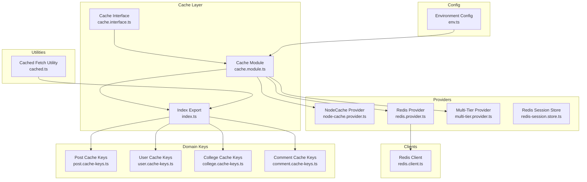
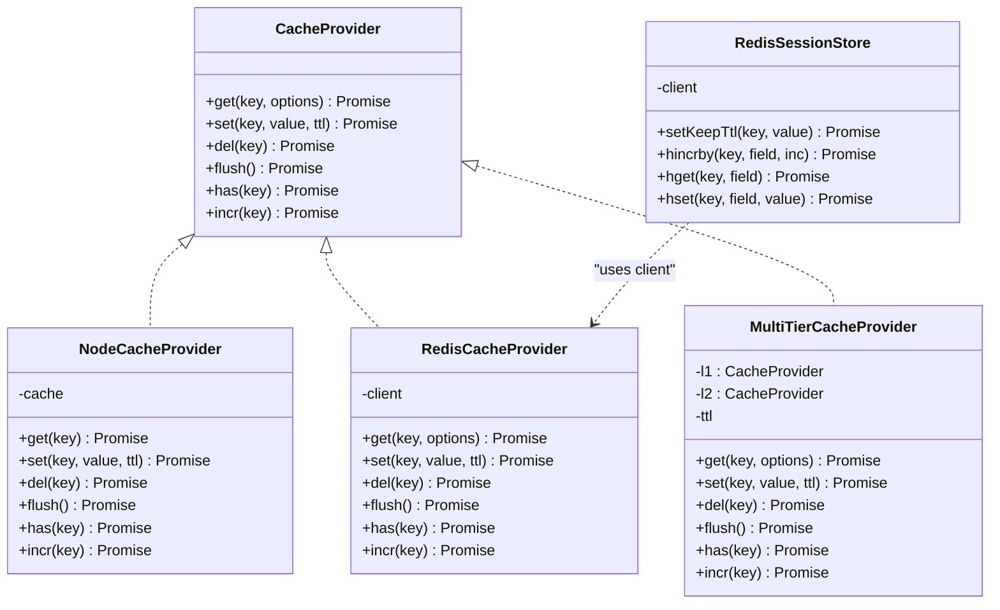
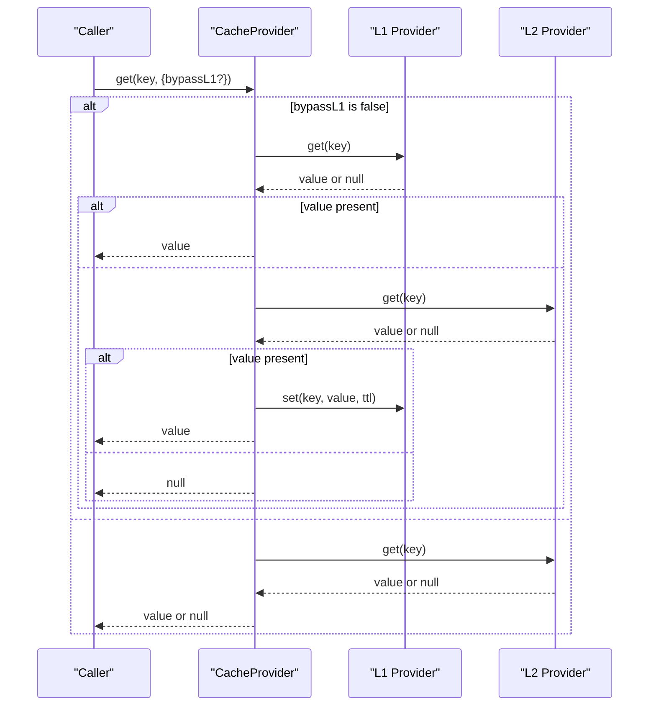
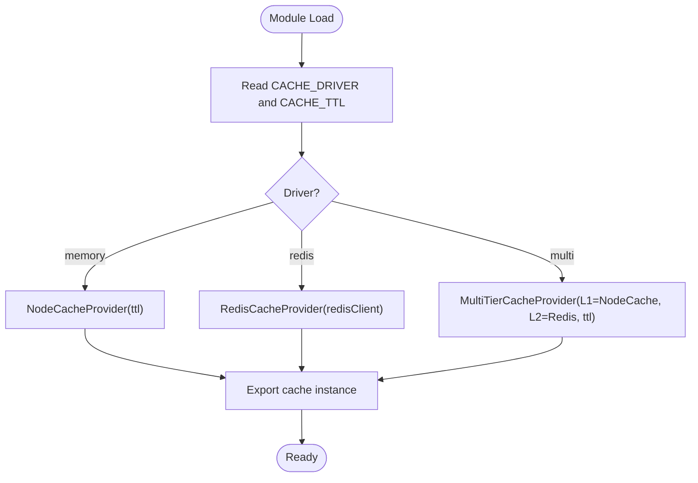
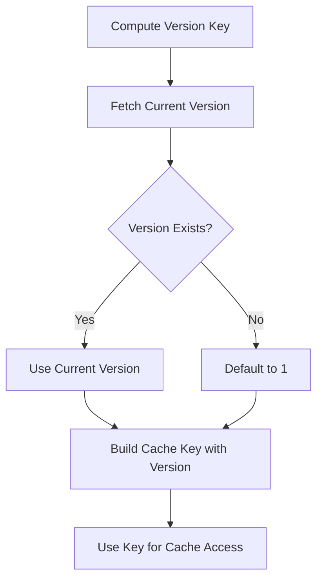
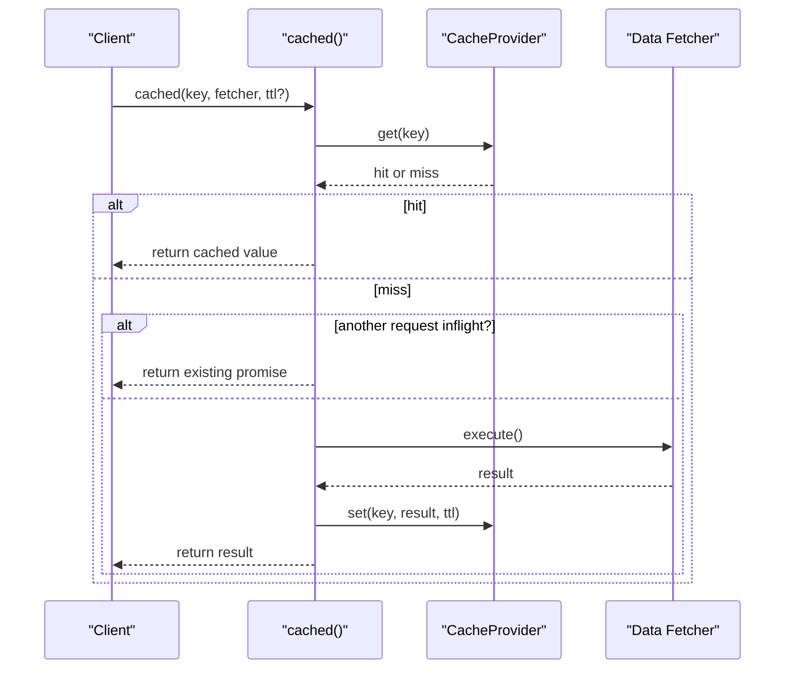
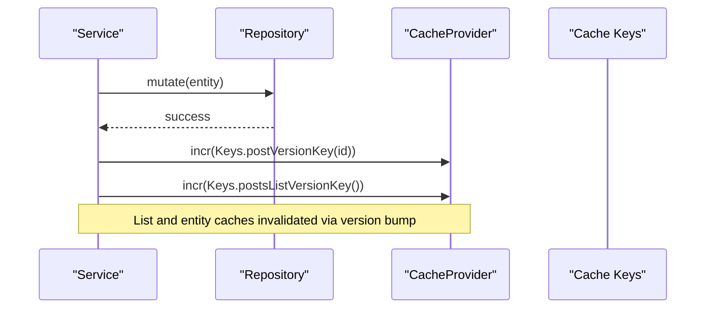
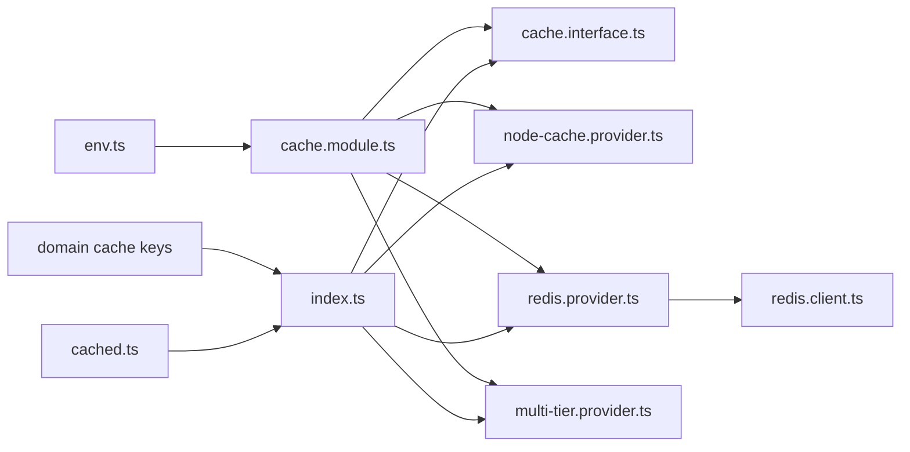

# Cache Management

<cite>
**Referenced Files in This Document**
- [cache.interface.ts](file://server/src/infra/services/cache/cache.interface.ts)
- [cache.module.ts](file://server/src/infra/services/cache/cache.module.ts)
- [redis.client.ts](file://server/src/infra/services/cache/clients/redis.client.ts)
- [index.ts](file://server/src/infra/services/cache/index.ts)
- [node-cache.provider.ts](file://server/src/infra/services/cache/providers/node-cache.provider.ts)
- [redis.provider.ts](file://server/src/infra/services/cache/providers/redis.provider.ts)
- [multi-tier.provider.ts](file://server/src/infra/services/cache/providers/multi-tier.provider.ts)
- [redis-session.store.ts](file://server/src/infra/services/cache/providers/redis-session.store.ts)
- [cached.ts](file://server/src/lib/cached.ts)
- [env.ts](file://server/src/config/env.ts)
- [post.cache-keys.ts](file://server/src/modules/post/post.cache-keys.ts)
- [user.cache-keys.ts](file://server/src/modules/user/user.cache-keys.ts)
- [college.cache-keys.ts](file://server/src/modules/college/college.cache-keys.ts)
- [comment.cache-keys.ts](file://server/src/modules/comment/comment.cache-keys.ts)
- [post.service.ts](file://server/src/modules/post/post.service.ts)
- [user.service.ts](file://server/src/modules/user/user.service.ts)
- [college.service.ts](file://server/src/modules/college/college.service.ts)
</cite>

## Table of Contents
1. [Introduction](#introduction)
2. [Project Structure](#project-structure)
3. [Core Components](#core-components)
4. [Architecture Overview](#architecture-overview)
5. [Detailed Component Analysis](#detailed-component-analysis)
6. [Dependency Analysis](#dependency-analysis)
7. [Performance Considerations](#performance-considerations)
8. [Troubleshooting Guide](#troubleshooting-guide)
9. [Conclusion](#conclusion)

## Introduction
This document explains the cache management system used across the Flick application. It covers the cache provider abstractions, supported drivers (memory, Redis, multi-tier), cache key generation strategies, and invalidation patterns. The goal is to help developers understand how caching works, how to extend it, and how to maintain cache consistency during data mutations.

## Project Structure
The cache system is organized under the server module with clear separation of concerns:
- Provider interfaces and implementations
- Driver selection and initialization
- Cache key generators per domain
- Utility for cache-aware data fetching with request coalescing
- Environment-driven configuration

**Diagram sources**
- [cache.interface.ts](file://server/src/infra/services/cache/cache.interface.ts#L1-L15)
- [cache.module.ts](file://server/src/infra/services/cache/cache.module.ts#L1-L31)
- [index.ts](file://server/src/infra/services/cache/index.ts#L1-L6)
- [node-cache.provider.ts](file://server/src/infra/services/cache/providers/node-cache.provider.ts#L1-L44)
- [redis.provider.ts](file://server/src/infra/services/cache/providers/redis.provider.ts#L1-L39)
- [multi-tier.provider.ts](file://server/src/infra/services/cache/providers/multi-tier.provider.ts#L1-L52)
- [redis-session.store.ts](file://server/src/infra/services/cache/providers/redis-session.store.ts#L1-L24)
- [redis.client.ts](file://server/src/infra/services/cache/clients/redis.client.ts#L1-L12)
- [post.cache-keys.ts](file://server/src/modules/post/post.cache-keys.ts#L1-L38)
- [user.cache-keys.ts](file://server/src/modules/user/user.cache-keys.ts#L1-L9)
- [college.cache-keys.ts](file://server/src/modules/college/college.cache-keys.ts#L1-L15)
- [comment.cache-keys.ts](file://server/src/modules/comment/comment.cache-keys.ts#L1-L36)
- [cached.ts](file://server/src/lib/cached.ts#L1-L36)
- [env.ts](file://server/src/config/env.ts#L1-L39)

**Section sources**
- [cache.interface.ts](file://server/src/infra/services/cache/cache.interface.ts#L1-L15)
- [cache.module.ts](file://server/src/infra/services/cache/cache.module.ts#L1-L31)
- [index.ts](file://server/src/infra/services/cache/index.ts#L1-L6)
- [env.ts](file://server/src/config/env.ts#L1-L39)

## Core Components
- CacheProvider interface defines the contract for cache operations: get, set, del, flush, has, incr.
- RedisSessionStoreInterface provides session-specific operations for Redis.
- Providers implement the interface for memory (NodeCache), Redis, and a multi-tier composition.
- The cache module selects the driver based on environment variables and exposes a unified cache instance.
- Domain-specific cache keys encapsulate cache key construction with versioning and context.
- The cached utility performs cache-aware fetching with request coalescing to avoid thundering herds.

**Section sources**
- [cache.interface.ts](file://server/src/infra/services/cache/cache.interface.ts#L1-L15)
- [node-cache.provider.ts](file://server/src/infra/services/cache/providers/node-cache.provider.ts#L1-L44)
- [redis.provider.ts](file://server/src/infra/services/cache/providers/redis.provider.ts#L1-L39)
- [multi-tier.provider.ts](file://server/src/infra/services/cache/providers/multi-tier.provider.ts#L1-L52)
- [redis-session.store.ts](file://server/src/infra/services/cache/providers/redis-session.store.ts#L1-L24)
- [cache.module.ts](file://server/src/infra/services/cache/cache.module.ts#L1-L31)
- [index.ts](file://server/src/infra/services/cache/index.ts#L1-L6)
- [cached.ts](file://server/src/lib/cached.ts#L1-L36)

## Architecture Overview
The cache architecture supports pluggable drivers and a multi-tier strategy. The environment determines the active driver and TTL defaults. Redis is configured centrally and used by both the cache provider and the session store.

**Diagram sources**
- [cache.interface.ts](file://server/src/infra/services/cache/cache.interface.ts#L1-L15)
- [node-cache.provider.ts](file://server/src/infra/services/cache/providers/node-cache.provider.ts#L1-L44)
- [redis.provider.ts](file://server/src/infra/services/cache/providers/redis.provider.ts#L1-L39)
- [multi-tier.provider.ts](file://server/src/infra/services/cache/providers/multi-tier.provider.ts#L1-L52)
- [redis-session.store.ts](file://server/src/infra/services/cache/providers/redis-session.store.ts#L1-L24)

## Detailed Component Analysis

### Cache Provider Implementations
- NodeCacheProvider: Uses an in-memory cache with TTL and periodic cleanup. Suitable for single-instance deployments or development.
- RedisCacheProvider: Uses Redis with JSON serialization and optional TTL. Supports atomic operations and flush.
- MultiTierCacheProvider: Composes L1 (memory) and L2 (Redis) providers. Reads prefer L1 unless bypassed; writes propagate to both tiers.

**Diagram sources**
- [multi-tier.provider.ts](file://server/src/infra/services/cache/providers/multi-tier.provider.ts#L9-L22)

**Section sources**
- [node-cache.provider.ts](file://server/src/infra/services/cache/providers/node-cache.provider.ts#L1-L44)
- [redis.provider.ts](file://server/src/infra/services/cache/providers/redis.provider.ts#L1-L39)
- [multi-tier.provider.ts](file://server/src/infra/services/cache/providers/multi-tier.provider.ts#L1-L52)

### Cache Selection and Initialization
The cache module reads environment variables to choose the driver and TTL, then constructs the appropriate provider. Redis client is initialized with connection settings and error handling.

**Diagram sources**
- [cache.module.ts](file://server/src/infra/services/cache/cache.module.ts#L9-L27)
- [redis.client.ts](file://server/src/infra/services/cache/clients/redis.client.ts#L1-L12)
- [env.ts](file://server/src/config/env.ts#L12-L13)

**Section sources**
- [cache.module.ts](file://server/src/infra/services/cache/cache.module.ts#L1-L31)
- [redis.client.ts](file://server/src/infra/services/cache/clients/redis.client.ts#L1-L12)
- [env.ts](file://server/src/config/env.ts#L1-L39)

### Cache Keys and Versioning Strategy
Cache keys are generated per domain to ensure isolation and controlled invalidation. Keys often embed a version number derived from a dedicated version key. This allows invalidating entire lists or sets of related items atomically by incrementing the version.

**Diagram sources**
- [post.cache-keys.ts](file://server/src/modules/post/post.cache-keys.ts#L9-L12)
- [post.cache-keys.ts](file://server/src/modules/post/post.cache-keys.ts#L26-L29)
- [college.cache-keys.ts](file://server/src/modules/college/college.cache-keys.ts#L8-L11)
- [comment.cache-keys.ts](file://server/src/modules/comment/comment.cache-keys.ts#L6-L9)
- [comment.cache-keys.ts](file://server/src/modules/comment/comment.cache-keys.ts#L21-L24)

**Section sources**
- [post.cache-keys.ts](file://server/src/modules/post/post.cache-keys.ts#L1-L38)
- [user.cache-keys.ts](file://server/src/modules/user/user.cache-keys.ts#L1-L9)
- [college.cache-keys.ts](file://server/src/modules/college/college.cache-keys.ts#L1-L15)
- [comment.cache-keys.ts](file://server/src/modules/comment/comment.cache-keys.ts#L1-L36)

### Cache-Aware Fetching with Coalescing
The cached utility provides a pattern for fetching data with cache-first semantics and request coalescing. If multiple concurrent requests ask for the same key, only one executes the fetch while others await the result, reducing load and ensuring cache consistency.

**Diagram sources**
- [cached.ts](file://server/src/lib/cached.ts#L6-L35)

**Section sources**
- [cached.ts](file://server/src/lib/cached.ts#L1-L36)

### Cache Invalidation Patterns
Cache invalidation is performed by incrementing version keys or deleting specific keys upon mutations. Examples:
- Post creation and updates increment post and list version keys to invalidate cached views.
- User updates delete user-specific keys to ensure profile changes propagate.
- College updates trigger centralized invalidation routines to refresh related caches.

**Diagram sources**
- [post.service.ts](file://server/src/modules/post/post.service.ts#L81-L82)
- [post.cache-keys.ts](file://server/src/modules/post/post.cache-keys.ts#L6-L7)
- [post.cache-keys.ts](file://server/src/modules/post/post.cache-keys.ts#L7-L8)

**Section sources**
- [post.service.ts](file://server/src/modules/post/post.service.ts#L81-L82)
- [user.service.ts](file://server/src/modules/user/user.service.ts#L50-L51)
- [college.service.ts](file://server/src/modules/college/college.service.ts#L53-L57)

## Dependency Analysis
The cache system exhibits low coupling and high cohesion:
- The CacheProvider interface decouples consumers from specific implementations.
- The cache module centralizes driver selection and initialization.
- Domain modules depend on cache keys and the global cache instance.
- Redis client is a singleton dependency used by both cache and session stores.

**Diagram sources**
- [env.ts](file://server/src/config/env.ts#L12-L13)
- [cache.module.ts](file://server/src/infra/services/cache/cache.module.ts#L9-L27)
- [cache.interface.ts](file://server/src/infra/services/cache/cache.interface.ts#L1-L15)
- [node-cache.provider.ts](file://server/src/infra/services/cache/providers/node-cache.provider.ts#L1-L44)
- [redis.provider.ts](file://server/src/infra/services/cache/providers/redis.provider.ts#L1-L39)
- [multi-tier.provider.ts](file://server/src/infra/services/cache/providers/multi-tier.provider.ts#L1-L52)
- [redis.client.ts](file://server/src/infra/services/cache/clients/redis.client.ts#L1-L12)
- [index.ts](file://server/src/infra/services/cache/index.ts#L1-L6)
- [post.cache-keys.ts](file://server/src/modules/post/post.cache-keys.ts#L1-L38)
- [cached.ts](file://server/src/lib/cached.ts#L1-L36)

**Section sources**
- [cache.module.ts](file://server/src/infra/services/cache/cache.module.ts#L1-L31)
- [index.ts](file://server/src/infra/services/cache/index.ts#L1-L6)
- [env.ts](file://server/src/config/env.ts#L1-L39)

## Performance Considerations
- Choose driver based on deployment needs:
  - memory: minimal overhead for single-instance environments.
  - redis: distributed caching and persistence across instances.
  - multi: best of both worlds with L1/L2 caching.
- Set appropriate TTL values to balance freshness and performance.
- Use versioned keys to invalidate large sets efficiently.
- Leverage request coalescing to reduce redundant work during cache misses.
- Monitor Redis connectivity and handle errors gracefully.

## Troubleshooting Guide
Common issues and resolutions:
- Redis connectivity errors: Verify REDIS_URL and network access; check Redis client error logs.
- Unexpected cache misses: Confirm cache keys match exactly, including version keys and context parameters.
- Stale data after updates: Ensure version increments or key deletions occur in the mutation path.
- Memory growth in memory driver: Adjust TTL and cleanup intervals; consider switching to Redis for production.

**Section sources**
- [redis.client.ts](file://server/src/infra/services/cache/clients/redis.client.ts#L9-L11)
- [env.ts](file://server/src/config/env.ts#L11-L13)

## Conclusion
The cache management system provides a flexible, extensible foundation for performance and scalability. By abstracting providers behind a single interface, using versioned cache keys, and applying targeted invalidation, the system maintains correctness while enabling efficient data retrieval. Developers should adhere to the established patterns for key generation and invalidation to keep the cache consistent and performant.