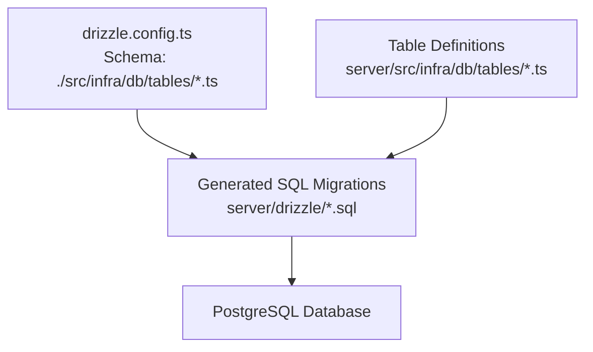
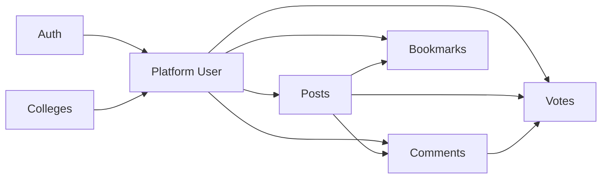

# Core Entities

<cite>
**Referenced Files in This Document**
- [drizzle.config.ts](file://server/drizzle.config.ts)
- [0000_bored_dakota_north.sql](file://server/drizzle/0000_bored_dakota_north.sql)
- [auth.table.ts](file://server/src/infra/db/tables/auth.table.ts)
- [post.table.ts](file://server/src/infra/db/tables/post.table.ts)
- [comment.table.ts](file://server/src/infra/db/tables/comment.table.ts)
- [college.table.ts](file://server/src/infra/db/tables/college.table.ts)
- [vote.table.ts](file://server/src/infra/db/tables/vote.table.ts)
- [bookmark.table.ts](file://server/src/infra/db/tables/bookmark.table.ts)
- [enums.ts](file://server/src/infra/db/tables/enums.ts)
</cite>

## Table of Contents
1. [Introduction](#introduction)
2. [Project Structure](#project-structure)
3. [Core Components](#core-components)
4. [Architecture Overview](#architecture-overview)
5. [Detailed Component Analysis](#detailed-component-analysis)
6. [Dependency Analysis](#dependency-analysis)
7. [Performance Considerations](#performance-considerations)
8. [Troubleshooting Guide](#troubleshooting-guide)
9. [Conclusion](#conclusion)

## Introduction
This document describes the core database entities in the Flick platform. It focuses on the Users, Posts, Comments, Auth, College, Vote, and Bookmark tables, detailing their structure, fields, data types, constraints, indexes, and business rule enforcement. The goal is to provide a clear, accessible reference for developers and stakeholders to understand how data is modeled and enforced in the system.

## Project Structure
The database schema is defined using Drizzle ORM with PostgreSQL. The schema is generated via migration files and mirrored in TypeScript table definitions. The Drizzle configuration points to the table definitions for schema generation and migrations.



**Diagram sources**
- [drizzle.config.ts](file://server/drizzle.config.ts#L1-L14)
- [0000_bored_dakota_north.sql](file://server/drizzle/0000_bored_dakota_north.sql#L1-L219)

**Section sources**
- [drizzle.config.ts](file://server/drizzle.config.ts#L1-L14)
- [0000_bored_dakota_north.sql](file://server/drizzle/0000_bored_dakota_north.sql#L1-L219)

## Core Components
This section summarizes the core entities and their primary responsibilities.

- Users and Authentication
  - Auth: Central identity and role model with email, timestamps, and moderation flags.
  - Platform User: Profile, institution association, terms acceptance, and karma.
  - Sessions, Accounts, Two-Factor, Verification: Authentication lifecycle and security.

- Content
  - Posts: Title, content, topic classification, visibility flags, views, and timestamps.
  - Comments: Hierarchical replies via parent-child relationship, moderation flag, and timestamps.

- Institutional
  - Colleges: Name, email domain, location, and profile URL with indexes.

- Engagement
  - Votes: Upvote/downvote targeting posts or comments with uniqueness per target.
  - Bookmarks: User-post associations with composite indexing.

**Section sources**
- [auth.table.ts](file://server/src/infra/db/tables/auth.table.ts#L13-L29)
- [auth.table.ts](file://server/src/infra/db/tables/auth.table.ts#L31-L44)
- [auth.table.ts](file://server/src/infra/db/tables/auth.table.ts#L46-L64)
- [auth.table.ts](file://server/src/infra/db/tables/auth.table.ts#L66-L88)
- [auth.table.ts](file://server/src/infra/db/tables/auth.table.ts#L106-L120)
- [post.table.ts](file://server/src/infra/db/tables/post.table.ts#L5-L20)
- [comment.table.ts](file://server/src/infra/db/tables/comment.table.ts#L5-L25)
- [college.table.ts](file://server/src/infra/db/tables/college.table.ts#L3-L18)
- [vote.table.ts](file://server/src/infra/db/tables/vote.table.ts#L12-L38)
- [bookmark.table.ts](file://server/src/infra/db/tables/bookmark.table.ts#L5-L14)

## Architecture Overview
The schema enforces referential integrity and business rules through foreign keys and indexes. The Users entity integrates with authentication and session tables, while content entities reference user identifiers. Engagement entities track user interactions with content.

```mermaid
erDiagram
AUTH {
text id PK
text name
text email UK
boolean email_verified
timestamp created_at
timestamp updated_at
boolean two_factor_enabled
text role
text image
boolean banned
text ban_reason
timestamp ban_expires
}
PLATFORM_USER {
uuid id PK
timestamp created_at
timestamp updated_at
text auth_id UK FK
text username UK
uuid college_id FK
text branch
integer karma
boolean is_accepted_terms
}
SESSION {
text id PK
timestamp expires_at
text token UK
timestamp created_at
timestamp updated_at
text ip_address
text user_agent
text user_id FK
text impersonated_by
}
ACCOUNT {
text id PK
text account_id
text provider_id
text user_id FK
text access_token
text refresh_token
text id_token
timestamp access_token_expires_at
timestamp refresh_token_expires_at
text scope
text password
timestamp created_at
timestamp updated_at
}
TWO_FACTOR {
text id PK
text secret
text backup_codes
text user_id FK
}
VERIFICATION {
text id PK
text identifier
text value
timestamp expires_at
timestamp created_at
timestamp updated_at
}
COLLEGES {
uuid id PK
text name
text emailDomain
text city
text state
text profile
timestamp created_at
timestamp updated_at
}
POSTS {
uuid id PK
text title
text content
uuid postedBy FK
enum topic
boolean isPrivate
boolean isBanned
boolean isShadowBanned
integer views
timestamp createdAt
timestamp updatedAt
}
COMMENTS {
uuid id PK
text content
uuid postId FK
uuid commentedBy FK
boolean isBanned
uuid parentCommentId FK
timestamp createdAt
timestamp updatedAt
}
BOOKMARKS {
uuid id PK
uuid postId
uuid userId FK
timestamp createdAt
timestamp updatedAt
}
VOTES {
uuid id PK
uuid user_id FK
enum target_type
uuid target_id
enum vote_type
}
AUTH ||--o| PLATFORM_USER : "has one"
AUTH ||--o{ SESSION : "has many"
AUTH ||--o{ ACCOUNT : "has many"
AUTH ||--o{ TWO_FACTOR : "has many"
PLATFORM_USER ||--o{ COMMENTS : "writes"
PLATFORM_USER ||--o{ POSTS : "writes"
PLATFORM_USER ||--o{ BOOKMARKS : "owns"
PLATFORM_USER ||--o{ VOTES : "casts"
COLLEGES ||--o{ PLATFORM_USER : "hosts"
POSTS ||--o{ COMMENTS : "contains"
COMMENTS ||--o{ COMMENTS : "children"
POSTS ||--o{ VOTES : "targets"
COMMENTS ||--o{ VOTES : "targets"
```

**Diagram sources**
- [auth.table.ts](file://server/src/infra/db/tables/auth.table.ts#L13-L29)
- [auth.table.ts](file://server/src/infra/db/tables/auth.table.ts#L31-L44)
- [auth.table.ts](file://server/src/infra/db/tables/auth.table.ts#L46-L64)
- [auth.table.ts](file://server/src/infra/db/tables/auth.table.ts#L66-L88)
- [auth.table.ts](file://server/src/infra/db/tables/auth.table.ts#L106-L120)
- [college.table.ts](file://server/src/infra/db/tables/college.table.ts#L3-L18)
- [post.table.ts](file://server/src/infra/db/tables/post.table.ts#L5-L20)
- [comment.table.ts](file://server/src/infra/db/tables/comment.table.ts#L5-L25)
- [bookmark.table.ts](file://server/src/infra/db/tables/bookmark.table.ts#L5-L14)
- [vote.table.ts](file://server/src/infra/db/tables/vote.table.ts#L12-L38)
- [0000_bored_dakota_north.sql](file://server/drizzle/0000_bored_dakota_north.sql#L45-L59)
- [0000_bored_dakota_north.sql](file://server/drizzle/0000_bored_dakota_north.sql#L61-L73)
- [0000_bored_dakota_north.sql](file://server/drizzle/0000_bored_dakota_north.sql#L75-L86)
- [0000_bored_dakota_north.sql](file://server/drizzle/0000_bored_dakota_north.sql#L88-L94)
- [0000_bored_dakota_north.sql](file://server/drizzle/0000_bored_dakota_north.sql#L95-L102)
- [0000_bored_dakota_north.sql](file://server/drizzle/0000_bored_dakota_north.sql#L112-L121)
- [0000_bored_dakota_north.sql](file://server/drizzle/0000_bored_dakota_north.sql#L170-L181)
- [0000_bored_dakota_north.sql](file://server/drizzle/0000_bored_dakota_north.sql#L123-L132)
- [0000_bored_dakota_north.sql](file://server/drizzle/0000_bored_dakota_north.sql#L104-L110)
- [0000_bored_dakota_north.sql](file://server/drizzle/0000_bored_dakota_north.sql#L183-L189)

## Detailed Component Analysis

### Users and Authentication
- Auth
  - Purpose: Central identity with role, email verification, 2FA toggle, and moderation controls.
  - Key fields: id (PK), name, email (unique), emailVerified, twoFactorEnabled, role, image, banned, banReason, banExpires, timestamps.
  - Constraints: Unique email; defaults for booleans and timestamps; updatedAt auto-update.
  - Business rules: Moderation flags and role support RBAC; twoFactorEnabled toggles MFA availability.

- Platform User
  - Purpose: User profile, institution association, terms acceptance, and karma.
  - Key fields: id (PK), authId (unique, FK to Auth.id), username (unique), collegeId (FK to Colleges.id), branch, karma, isAcceptedTerms, timestamps.
  - Constraints: Unique authId and username; cascade deletes on FKs; default karma 0.
  - Business rules: Links to Auth and Colleges; tracks terms acceptance.

- Sessions
  - Purpose: Active sessions with expiry and device metadata.
  - Key fields: id (PK), expiresAt, token (unique), ipAddress, userAgent, userId (FK to Auth.id), impersonatedBy, timestamps.
  - Indexes: session_userId_idx on userId.
  - Business rules: Cascade delete on Auth; indexed lookup by user.

- Accounts
  - Purpose: OAuth/manual credentials and tokens.
  - Key fields: id (PK), account_id, provider_id, user_id (FK to Auth.id), tokens and expiry timestamps, scope, password, timestamps.
  - Indexes: account_userId_idx on userId.
  - Business rules: Cascade delete on Auth; indexed lookup by user.

- Two-Factor
  - Purpose: 2FA secrets and backup codes.
  - Key fields: id (PK), secret, backupCodes, user_id (FK to Auth.id).
  - Indexes: twoFactor_secret_idx, twoFactor_userId_idx.
  - Business rules: Cascade delete on Auth; indexed lookups.

- Verification
  - Purpose: OTP/email verification records.
  - Key fields: id (PK), identifier, value, expiresAt, timestamps.
  - Indexes: verification_identifier_idx.
  - Business rules: Indexed by identifier for quick lookup.

**Section sources**
- [auth.table.ts](file://server/src/infra/db/tables/auth.table.ts#L13-L29)
- [auth.table.ts](file://server/src/infra/db/tables/auth.table.ts#L31-L44)
- [auth.table.ts](file://server/src/infra/db/tables/auth.table.ts#L46-L64)
- [auth.table.ts](file://server/src/infra/db/tables/auth.table.ts#L66-L88)
- [auth.table.ts](file://server/src/infra/db/tables/auth.table.ts#L106-L120)
- [0000_bored_dakota_north.sql](file://server/drizzle/0000_bored_dakota_north.sql#L45-L59)
- [0000_bored_dakota_north.sql](file://server/drizzle/0000_bored_dakota_north.sql#L61-L73)
- [0000_bored_dakota_north.sql](file://server/drizzle/0000_bored_dakota_north.sql#L75-L86)
- [0000_bored_dakota_north.sql](file://server/drizzle/0000_bored_dakota_north.sql#L88-L94)
- [0000_bored_dakota_north.sql](file://server/drizzle/0000_bored_dakota_north.sql#L95-L102)

### Posts
- Purpose: Forum posts with topic categorization, visibility, and engagement metrics.
- Key fields: id (PK), title, content, postedBy (FK to Platform User.id), topic (enum), isPrivate, isBanned, isShadowBanned, views, timestamps.
- Constraints: Default views 0; createdAt/updatedAt defaults; visibility flags for moderation.
- Indexes: posts_visibility_idx on (isBanned, isShadowBanned, createdAt desc).
- Business rules: Visibility flags support moderation; topic enum defines categories; postedBy links to author.

**Section sources**
- [post.table.ts](file://server/src/infra/db/tables/post.table.ts#L5-L20)
- [enums.ts](file://server/src/infra/db/tables/enums.ts#L26-L38)
- [0000_bored_dakota_north.sql](file://server/drizzle/0000_bored_dakota_north.sql#L170-L181)
- [0000_bored_dakota_north.sql](file://server/drizzle/0000_bored_dakota_north.sql#L217-L217)

### Comments
- Purpose: Nested comment threads with moderation and timestamps.
- Key fields: id (PK), content, postId (FK to Posts.id, cascade delete), commentedBy (FK to Platform User.id, cascade delete), isBanned, parentCommentId (self-FK, set null on delete), timestamps.
- Constraints: parentCommentId self-reference; cascade deletes on post/user; default booleans/timestamps.
- Indexes: implicit primary key; parentCommentId supports hierarchy.
- Business rules: Hierarchical threading via parentCommentId; moderation via isBanned; cascade ensures cleanup on deletion.

**Section sources**
- [comment.table.ts](file://server/src/infra/db/tables/comment.table.ts#L5-L25)
- [0000_bored_dakota_north.sql](file://server/drizzle/0000_bored_dakota_north.sql#L123-L132)
- [0000_bored_dakota_north.sql](file://server/drizzle/0000_bored_dakota_north.sql#L199-L200)

### Auth (Tokens and OTP)
- Notes: The Auth table definition covers identity and flags. Additional token and OTP management is handled by dedicated tables:
  - Session: active sessions with expiry and device metadata.
  - Account: OAuth/manual credentials and tokens.
  - Two-Factor: 2FA secrets and backup codes.
  - Verification: OTP/email verification records.
- These are documented under the Users and Authentication section above.

**Section sources**
- [auth.table.ts](file://server/src/infra/db/tables/auth.table.ts#L46-L64)
- [auth.table.ts](file://server/src/infra/db/tables/auth.table.ts#L66-L88)
- [auth.table.ts](file://server/src/infra/db/tables/auth.table.ts#L106-L120)
- [0000_bored_dakota_north.sql](file://server/drizzle/0000_bored_dakota_north.sql#L75-L86)
- [0000_bored_dakota_north.sql](file://server/drizzle/0000_bored_dakota_north.sql#L88-L94)
- [0000_bored_dakota_north.sql](file://server/drizzle/0000_bored_dakota_north.sql#L95-L102)

### College
- Purpose: Institutional data and domain validation for user enrollment.
- Key fields: id (PK), name, emailDomain, city, state, profile, timestamps.
- Indexes: idx_college_name on name; idx_college_city_state on (city, state).
- Business rules: emailDomain enables institutional email validation; composite index supports efficient lookups.

**Section sources**
- [college.table.ts](file://server/src/infra/db/tables/college.table.ts#L3-L18)
- [0000_bored_dakota_north.sql](file://server/drizzle/0000_bored_dakota_north.sql#L112-L121)
- [0000_bored_dakota_north.sql](file://server/drizzle/0000_bored_dakota_north.sql#L215-L216)

### Vote
- Purpose: Track user upvotes/downvotes on posts and comments.
- Key fields: id (PK), userId (FK to Platform User.id, cascade delete), targetType (enum: post/comment), targetId (UUID), voteType (enum: upvote/downvote).
- Constraints: Unique index on (userId, targetType, targetId) to prevent duplicate votes per target; indexes on (targetType, targetId) for efficient lookups.
- Business rules: Enforces single vote per user per target; supports post/comment targets.

**Section sources**
- [vote.table.ts](file://server/src/infra/db/tables/vote.table.ts#L12-L38)
- [enums.ts](file://server/src/infra/db/tables/enums.ts#L40-L48)
- [0000_bored_dakota_north.sql](file://server/drizzle/0000_bored_dakota_north.sql#L183-L189)
- [0000_bored_dakota_north.sql](file://server/drizzle/0000_bored_dakota_north.sql#L218-L218)

### Bookmark
- Purpose: Allow users to bookmark posts for later.
- Key fields: id (PK), postId (FK to Posts.id), userId (FK to Platform User.id), timestamps.
- Indexes: bookmark_user_id_idx on (userId, postId).
- Business rules: Composite index optimizes retrieval of a user’s bookmarks; FKs link to content and user.

**Section sources**
- [bookmark.table.ts](file://server/src/infra/db/tables/bookmark.table.ts#L5-L14)
- [0000_bored_dakota_north.sql](file://server/drizzle/0000_bored_dakota_north.sql#L104-L110)
- [0000_bored_dakota_north.sql](file://server/drizzle/0000_bored_dakota_north.sql#L214-L214)

## Dependency Analysis
This section maps dependencies among entities and highlights referential integrity enforced by foreign keys.



**Diagram sources**
- [auth.table.ts](file://server/src/infra/db/tables/auth.table.ts#L31-L44)
- [auth.table.ts](file://server/src/infra/db/tables/auth.table.ts#L13-L29)
- [college.table.ts](file://server/src/infra/db/tables/college.table.ts#L3-L18)
- [post.table.ts](file://server/src/infra/db/tables/post.table.ts#L5-L20)
- [comment.table.ts](file://server/src/infra/db/tables/comment.table.ts#L5-L25)
- [bookmark.table.ts](file://server/src/infra/db/tables/bookmark.table.ts#L5-L14)
- [vote.table.ts](file://server/src/infra/db/tables/vote.table.ts#L12-L38)
- [0000_bored_dakota_north.sql](file://server/drizzle/0000_bored_dakota_north.sql#L191-L205)

**Section sources**
- [auth.table.ts](file://server/src/infra/db/tables/auth.table.ts#L31-L44)
- [post.table.ts](file://server/src/infra/db/tables/post.table.ts#L5-L20)
- [comment.table.ts](file://server/src/infra/db/tables/comment.table.ts#L5-L25)
- [bookmark.table.ts](file://server/src/infra/db/tables/bookmark.table.ts#L5-L14)
- [vote.table.ts](file://server/src/infra/db/tables/vote.table.ts#L12-L38)
- [0000_bored_dakota_north.sql](file://server/drizzle/0000_bored_dakota_north.sql#L191-L205)

## Performance Considerations
- Indexes
  - posts_visibility_idx: Optimizes visibility filtering and chronological sorting for posts.
  - bookmark_user_id_idx: Supports fast retrieval of a user’s bookmarks.
  - session_userId_idx, account_userId_idx: Efficient user-based lookups for sessions/accounts.
  - twoFactor_secret_idx, twoFactor_userId_idx: Fast 2FA lookups and user queries.
  - verification_identifier_idx: Quick OTP/email verification lookups.
  - votes_target_lookup_idx: Efficient vote aggregation per target.
  - idx_college_name, idx_college_city_state: Fast institutional queries.

- Cascading Deletes
  - Comments and sessions/accounts/two-factor linked to Auth and Platform User use cascade deletes to maintain referential integrity and reduce orphaned data.

- Enum Types
  - Enums constrain values and improve storage efficiency; they also simplify validation and reporting.

[No sources needed since this section provides general guidance]

## Troubleshooting Guide
- Duplicate Username or Email
  - Symptom: Insertion errors for username or email.
  - Cause: Unique constraints on username and email.
  - Resolution: Ensure uniqueness before insert; handle conflicts gracefully.

- Orphaned Data After Deletion
  - Symptom: Comments or sessions remain after user deletion.
  - Cause: Missing cascade behavior.
  - Resolution: Verify cascade deletes are applied for FKs to Auth and Platform User.

- Unexpected Vote Counts
  - Symptom: Duplicate votes or missing vote counts.
  - Cause: Missing unique constraint per user/target.
  - Resolution: Confirm unique index on (userId, targetType, targetId) and enforce single vote per user per target.

- Slow Post Visibility Queries
  - Symptom: Slower-than-expected queries filtering by visibility.
  - Cause: Missing or unused index.
  - Resolution: Ensure posts_visibility_idx is utilized in queries.

**Section sources**
- [auth.table.ts](file://server/src/infra/db/tables/auth.table.ts#L38-L39)
- [auth.table.ts](file://server/src/infra/db/tables/auth.table.ts#L16-L16)
- [post.table.ts](file://server/src/infra/db/tables/post.table.ts#L18-L20)
- [vote.table.ts](file://server/src/infra/db/tables/vote.table.ts#L27-L37)
- [0000_bored_dakota_north.sql](file://server/drizzle/0000_bored_dakota_north.sql#L217-L217)

## Conclusion
The Flick platform’s core entities are designed around clear ownership and referential integrity. Users are represented by Auth and Platform User, with robust authentication and session tables. Content entities (Posts and Comments) include moderation and engagement features. Institutional data is modeled via Colleges, and user engagement is tracked through Votes and Bookmarks. Indexes and constraints ensure performance and data correctness across the board.