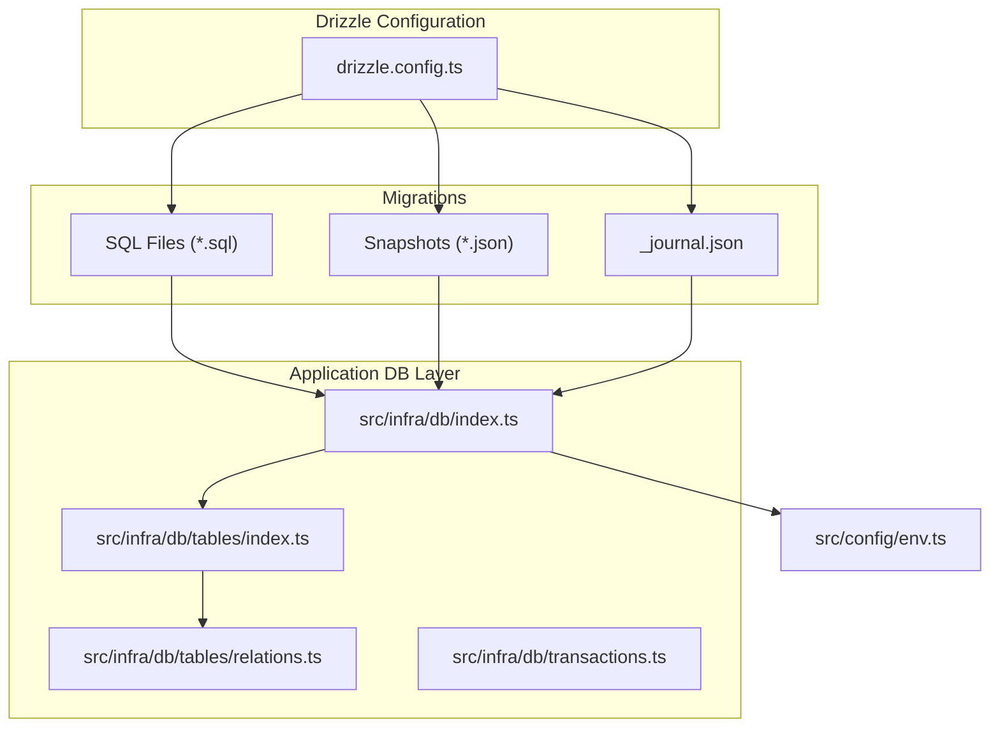
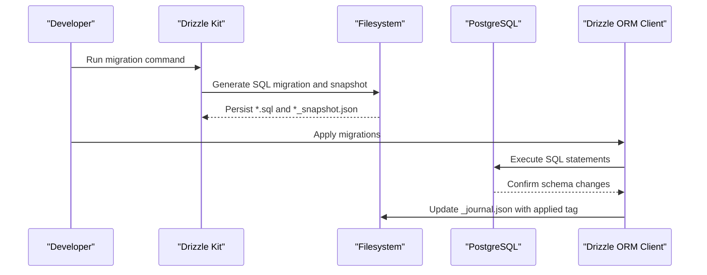
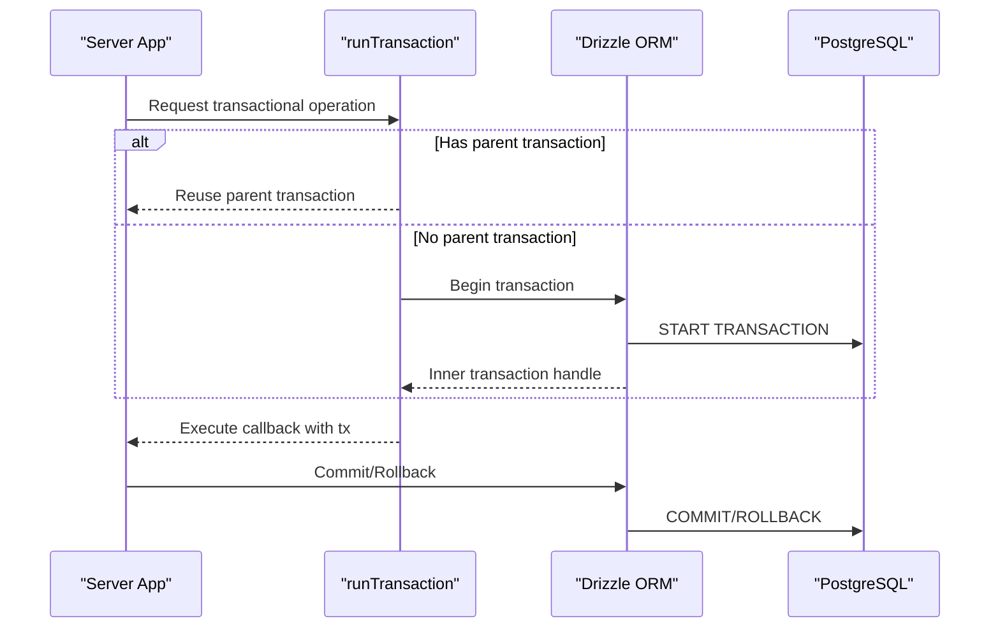
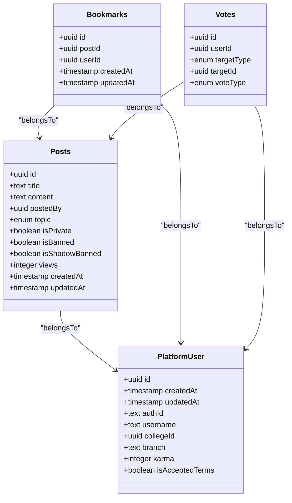
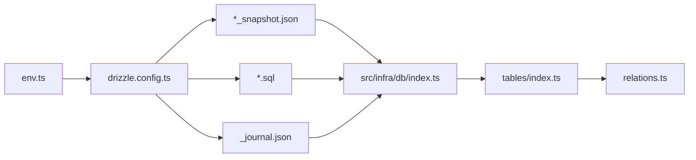
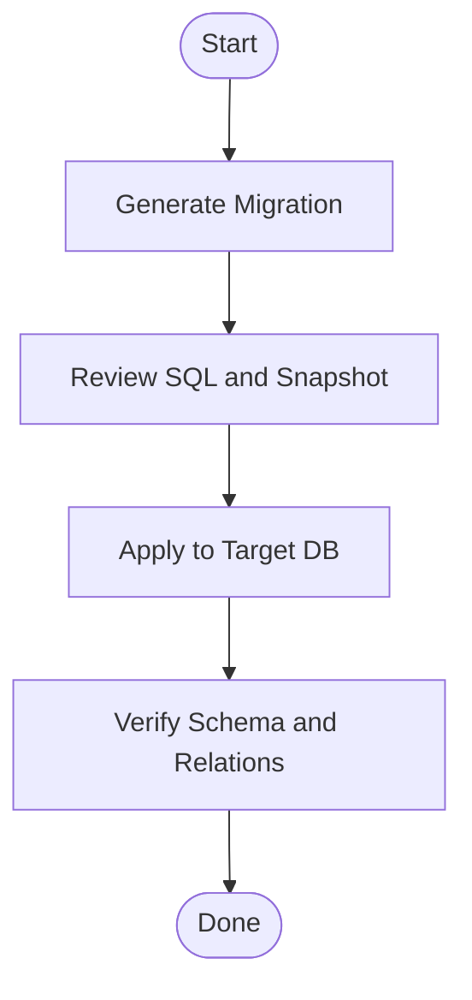

# Data Migration

<cite>
**Referenced Files in This Document**
- [drizzle.config.ts](file://server/drizzle.config.ts)
- [index.ts](file://server/src/infra/db/index.ts)
- [_journal.json](file://server/drizzle/meta/_journal.json)
- [0000_snapshot.json](file://server/drizzle/meta/0000_snapshot.json)
- [0001_snapshot.json](file://server/drizzle/meta/0001_snapshot.json)
- [0000_bored_dakota_north.sql](file://server/drizzle/0000_bored_dakota_north.sql)
- [0001_early_masked_marvel.sql](file://server/drizzle/0001_early_masked_marvel.sql)
- [env.ts](file://server/src/config/env.ts)
- [post.table.ts](file://server/src/infra/db/tables/post.table.ts)
- [relations.ts](file://server/src/infra/db/tables/relations.ts)
- [transactions.ts](file://server/src/infra/db/transactions.ts)
</cite>

## Table of Contents
1. [Introduction](#introduction)
2. [Project Structure](#project-structure)
3. [Core Components](#core-components)
4. [Architecture Overview](#architecture-overview)
5. [Detailed Component Analysis](#detailed-component-analysis)
6. [Dependency Analysis](#dependency-analysis)
7. [Performance Considerations](#performance-considerations)
8. [Troubleshooting Guide](#troubleshooting-guide)
9. [Conclusion](#conclusion)
10. [Appendices](#appendices)

## Introduction
This document explains the data migration system in the Flick platform, focusing on Drizzle ORM’s configuration, migration file management, and version control integration. It covers how migrations are executed, rolled back, and evolved over time, along with snapshot management, dependency resolution, and best practices for safe, repeatable schema changes. It also provides guidance for testing, environment-specific deployments, production rollouts, and troubleshooting.

## Project Structure
The migration system is centered around Drizzle Kit configuration and a set of SQL migration files stored under the server’s drizzle directory. The database connection and schema registry are defined in the server’s infrastructure layer. Environment variables supply credentials for connecting to the database.

**Diagram sources**
- [drizzle.config.ts](file://server/drizzle.config.ts#L1-L14)
- [index.ts](file://server/src/infra/db/index.ts#L1-L20)
- [_journal.json](file://server/drizzle/meta/_journal.json#L1-L20)
- [0000_snapshot.json](file://server/drizzle/meta/0000_snapshot.json#L1-L20)
- [0001_snapshot.json](file://server/drizzle/meta/0001_snapshot.json#L1-L20)
- [0000_bored_dakota_north.sql](file://server/drizzle/0000_bored_dakota_north.sql#L1-L219)
- [0001_early_masked_marvel.sql](file://server/drizzle/0001_early_masked_marvel.sql#L1-L1)
- [env.ts](file://server/src/config/env.ts#L1-L34)
- [post.table.ts](file://server/src/infra/db/tables/post.table.ts#L1-L21)
- [relations.ts](file://server/src/infra/db/tables/relations.ts#L1-L65)
- [transactions.ts](file://server/src/infra/db/transactions.ts#L1-L19)

**Section sources**
- [drizzle.config.ts](file://server/drizzle.config.ts#L1-L14)
- [index.ts](file://server/src/infra/db/index.ts#L1-L20)
- [_journal.json](file://server/drizzle/meta/_journal.json#L1-L20)
- [0000_snapshot.json](file://server/drizzle/meta/0000_snapshot.json#L1-L20)
- [0001_snapshot.json](file://server/drizzle/meta/0001_snapshot.json#L1-L20)
- [0000_bored_dakota_north.sql](file://server/drizzle/0000_bored_dakota_north.sql#L1-L219)
- [0001_early_masked_marvel.sql](file://server/drizzle/0001_early_masked_marvel.sql#L1-L1)
- [env.ts](file://server/src/config/env.ts#L1-L34)
- [post.table.ts](file://server/src/infra/db/tables/post.table.ts#L1-L21)
- [relations.ts](file://server/src/infra/db/tables/relations.ts#L1-L65)
- [transactions.ts](file://server/src/infra/db/transactions.ts#L1-L19)

## Core Components
- Drizzle Kit configuration defines the output directory, schema glob, PostgreSQL dialect, and credential sourcing from environment variables. This configuration drives migration generation and introspection.
- The database client is initialized with a schema registry that includes all table modules. This ensures Drizzle ORM knows about all tables and relations at runtime.
- Migration snapshots capture the database schema state per migration tag and are used by Drizzle to track applied migrations and maintain a deterministic state.
- SQL migration files encode forward-only schema changes and are tagged with human-readable identifiers.
- Environment variables provide the database URL used by both the ORM client and Drizzle Kit.

Key responsibilities:
- Drizzle Kit configuration: migration generation and introspection.
- Schema registry: runtime ORM access to tables and relations.
- Snapshots: immutable records of schema state per migration.
- SQL migrations: declarative schema evolution statements.
- Environment: database connectivity.

**Section sources**
- [drizzle.config.ts](file://server/drizzle.config.ts#L1-L14)
- [index.ts](file://server/src/infra/db/index.ts#L1-L20)
- [_journal.json](file://server/drizzle/meta/_journal.json#L1-L20)
- [0000_snapshot.json](file://server/drizzle/meta/0000_snapshot.json#L1-L20)
- [0001_snapshot.json](file://server/drizzle/meta/0001_snapshot.json#L1-L20)
- [0000_bored_dakota_north.sql](file://server/drizzle/0000_bored_dakota_north.sql#L1-L219)
- [0001_early_masked_marvel.sql](file://server/drizzle/0001_early_masked_marvel.sql#L1-L1)
- [env.ts](file://server/src/config/env.ts#L1-L34)

## Architecture Overview
The migration lifecycle integrates Drizzle Kit, SQL migrations, snapshots, and the application’s database client. Drizzle Kit reads the schema definition and generates SQL migrations and snapshots. The application connects to the database via the ORM client, which uses the schema registry to resolve relations and enforce referential integrity.

**Diagram sources**
- [drizzle.config.ts](file://server/drizzle.config.ts#L1-L14)
- [0000_bored_dakota_north.sql](file://server/drizzle/0000_bored_dakota_north.sql#L1-L219)
- [0001_early_masked_marvel.sql](file://server/drizzle/0001_early_masked_marvel.sql#L1-L1)
- [0000_snapshot.json](file://server/drizzle/meta/0000_snapshot.json#L1-L20)
- [0001_snapshot.json](file://server/drizzle/meta/0001_snapshot.json#L1-L20)
- [_journal.json](file://server/drizzle/meta/_journal.json#L1-L20)
- [index.ts](file://server/src/infra/db/index.ts#L1-L20)

## Detailed Component Analysis

### Drizzle ORM Migration Configuration
- Output directory and schema glob: Drizzle Kit writes migrations and snapshots to the configured output directory and scans schema files matching the provided glob.
- Dialect and credentials: PostgreSQL dialect and database URL sourced from environment variables enable secure and reproducible connections.
- Strict mode and verbosity: Strict mode enforces schema correctness; verbose mode aids debugging during development.

Operational implications:
- Keep schema glob aligned with actual table modules to avoid missing migrations.
- Ensure DATABASE_URL is present in all environments to prevent CI failures.

**Section sources**
- [drizzle.config.ts](file://server/drizzle.config.ts#L1-L14)
- [env.ts](file://server/src/config/env.ts#L1-L34)

### Migration File Management
- SQL migrations: Each migration file contains a series of SQL statements representing a single logical change. The second migration adds a column to an existing table.
- Snapshot files: Per-migration JSON snapshots capture the complete schema state at that migration’s point in time. These are used by Drizzle to reconcile current state with applied migrations.
- Journal: The journal tracks which migrations have been applied, enabling incremental updates and rollback planning.

Best practices:
- Keep each migration small and focused on a single concern.
- Add indexes and constraints in separate, atomic steps to minimize lock contention.
- Include comments and meaningful tags to improve readability and traceability.

**Section sources**
- [0000_bored_dakota_north.sql](file://server/drizzle/0000_bored_dakota_north.sql#L1-L219)
- [0001_early_masked_marvel.sql](file://server/drizzle/0001_early_masked_marvel.sql#L1-L1)
- [0000_snapshot.json](file://server/drizzle/meta/0000_snapshot.json#L1-L20)
- [0001_snapshot.json](file://server/drizzle/meta/0001_snapshot.json#L1-L20)
- [_journal.json](file://server/drizzle/meta/_journal.json#L1-L20)

### Version Control Integration
- Treat migrations, snapshots, and the journal as version-controlled artifacts. Commit them alongside application code to maintain reproducibility across environments.
- Use descriptive commit messages that reference the migration tag and purpose.
- Avoid editing applied migrations; instead, create new migrations to adjust schema.

**Section sources**
- [_journal.json](file://server/drizzle/meta/_journal.json#L1-L20)
- [0000_snapshot.json](file://server/drizzle/meta/0000_snapshot.json#L1-L20)
- [0001_snapshot.json](file://server/drizzle/meta/0001_snapshot.json#L1-L20)

### Migration Execution Process
- Application startup: The ORM client initializes with a schema registry that includes all tables and relations. This ensures referential integrity and relation resolution at runtime.
- Transactional execution: Migrations are typically executed inside transactions to ensure atomicity. The application’s transaction wrapper supports nested transactions and reuse of parent transactions.

**Diagram sources**
- [transactions.ts](file://server/src/infra/db/transactions.ts#L1-L19)
- [index.ts](file://server/src/infra/db/index.ts#L1-L20)

**Section sources**
- [index.ts](file://server/src/infra/db/index.ts#L1-L20)
- [transactions.ts](file://server/src/infra/db/transactions.ts#L1-L19)

### Rollback Procedures
- Drizzle migrations are designed to be forward-only. Rollbacks are typically achieved by generating a new migration that reverts the schema to a previous state.
- Use snapshots and the journal to identify the target migration to revert to. Generate a new migration that undoes the desired changes.
- Test rollback migrations in a staging environment mirroring production data characteristics.

**Section sources**
- [0000_snapshot.json](file://server/drizzle/meta/0000_snapshot.json#L1-L20)
- [0001_snapshot.json](file://server/drizzle/meta/0001_snapshot.json#L1-L20)
- [_journal.json](file://server/drizzle/meta/_journal.json#L1-L20)

### Schema Evolution Strategies
- Enum and type additions: New enumerations and composite types are introduced via dedicated statements and referenced by tables. This pattern allows controlled evolution of domain-specific types.
- Column additions: New columns are added with defaults to preserve backward compatibility for existing rows.
- Indexes and constraints: Add indexes and unique constraints in separate migrations to reduce downtime and allow gradual rollout.

**Section sources**
- [0000_bored_dakota_north.sql](file://server/drizzle/0000_bored_dakota_north.sql#L1-L219)
- [0001_early_masked_marvel.sql](file://server/drizzle/0001_early_masked_marvel.sql#L1-L1)
- [post.table.ts](file://server/src/infra/db/tables/post.table.ts#L1-L21)

### Snapshot Management and Dependency Resolution
- Snapshots capture the entire schema state per migration, including tables, indexes, foreign keys, and enums. They are used by Drizzle to compare against the current database state and determine the next migration to apply.
- Relations are defined in table modules and resolved at runtime via the schema registry, ensuring referential integrity across related entities.

**Diagram sources**
- [post.table.ts](file://server/src/infra/db/tables/post.table.ts#L1-L21)
- [relations.ts](file://server/src/infra/db/tables/relations.ts#L1-L65)

**Section sources**
- [0000_snapshot.json](file://server/drizzle/meta/0000_snapshot.json#L1-L20)
- [0001_snapshot.json](file://server/drizzle/meta/0001_snapshot.json#L1-L20)
- [relations.ts](file://server/src/infra/db/tables/relations.ts#L1-L65)

### Migration Best Practices
- Idempotency: Prefer additive-only changes where possible; if destructive changes are necessary, encapsulate them behind feature flags and generate compensating migrations.
- Backward compatibility: Introduce optional columns with defaults and nullable fields to support concurrent reads/writes during rollout.
- Zero-downtime strategies: Use partial indexes, concurrent index creation, and column addition without NOT NULL constraints to minimize locks.
- Data preservation: When renaming or restructuring columns, stage with a new column, backfill data, and then switch references atomically.

[No sources needed since this section provides general guidance]

### Data Preservation Techniques
- Add new columns with defaults and migrate data in batches.
- Use temporary columns and atomic rename swaps to replace old columns.
- Validate referential integrity after schema changes using the schema registry and relation definitions.

**Section sources**
- [post.table.ts](file://server/src/infra/db/tables/post.table.ts#L1-L21)
- [relations.ts](file://server/src/infra/db/tables/relations.ts#L1-L65)

### Rollback Safety Measures
- Always test rollback migrations in a staging environment.
- Maintain a clean journal and ensure snapshots align with applied migrations.
- Use transactions for applying migrations to ensure atomicity.

**Section sources**
- [_journal.json](file://server/drizzle/meta/_journal.json#L1-L20)
- [0000_snapshot.json](file://server/drizzle/meta/0000_snapshot.json#L1-L20)
- [0001_snapshot.json](file://server/drizzle/meta/0001_snapshot.json#L1-L20)

### Migration Testing Strategies
- Unit tests: Validate that schema snapshots match expectations for each migration.
- Integration tests: Spin up a test database, apply migrations, and assert table definitions and constraints.
- Regression tests: Ensure queries and relations continue to work after schema changes.

[No sources needed since this section provides general guidance]

### Environment-Specific Deployments
- Local development: Use local DATABASE_URL for ephemeral migrations during feature development.
- Staging: Mirror production schema and data characteristics; apply migrations and smoke-test integrations.
- Production: Apply migrations during scheduled maintenance windows; monitor logs and run integrity checks.

**Section sources**
- [env.ts](file://server/src/config/env.ts#L1-L34)

### Production Rollout Procedures
- Pre-flight: Verify migrations locally and in staging; confirm snapshot alignment and journal entries.
- Deployment: Apply migrations in order; monitor for long-running statements and locks.
- Post-flight: Validate data integrity, run targeted queries, and confirm application health.

**Section sources**
- [0000_bored_dakota_north.sql](file://server/drizzle/0000_bored_dakota_north.sql#L1-L219)
- [0001_early_masked_marvel.sql](file://server/drizzle/0001_early_masked_marvel.sql#L1-L1)
- [_journal.json](file://server/drizzle/meta/_journal.json#L1-L20)

## Dependency Analysis
The migration system exhibits clear separation of concerns:
- Drizzle Kit configuration depends on environment variables for credentials.
- SQL migrations depend on prior migrations’ snapshots to maintain state.
- The ORM client depends on the schema registry to resolve relations and enforce referential integrity.

**Diagram sources**
- [env.ts](file://server/src/config/env.ts#L1-L34)
- [drizzle.config.ts](file://server/drizzle.config.ts#L1-L14)
- [0000_snapshot.json](file://server/drizzle/meta/0000_snapshot.json#L1-L20)
- [0001_snapshot.json](file://server/drizzle/meta/0001_snapshot.json#L1-L20)
- [_journal.json](file://server/drizzle/meta/_journal.json#L1-L20)
- [index.ts](file://server/src/infra/db/index.ts#L1-L20)
- [relations.ts](file://server/src/infra/db/tables/relations.ts#L1-L65)

**Section sources**
- [drizzle.config.ts](file://server/drizzle.config.ts#L1-L14)
- [env.ts](file://server/src/config/env.ts#L1-L34)
- [index.ts](file://server/src/infra/db/index.ts#L1-L20)
- [relations.ts](file://server/src/infra/db/tables/relations.ts#L1-L65)

## Performance Considerations
- Concurrent index creation: Prefer CONCURRENTLY where applicable to reduce table locks.
- Batched data backfills: Split large data migrations into smaller chunks to avoid long transactions.
- Minimal DDL churn: Group related schema changes into a single migration to reduce repeated parsing and planning overhead.

[No sources needed since this section provides general guidance]

## Troubleshooting Guide
Common issues and resolutions:
- Migration conflicts: If the journal and snapshots diverge, regenerate snapshots and re-apply migrations carefully. Ensure DATABASE_URL points to the correct environment.
- Long-running migrations: Break large operations into smaller steps and use transactions judiciously. Monitor for locks and consider off-peak deployment windows.
- Relation errors: Verify that foreign keys and indexes are added in the correct order and that referenced tables exist before adding constraints.
- Transaction failures: Wrap migration steps in transactions and ensure rollback logic is tested.

**Section sources**
- [_journal.json](file://server/drizzle/meta/_journal.json#L1-L20)
- [0000_snapshot.json](file://server/drizzle/meta/0000_snapshot.json#L1-L20)
- [0001_snapshot.json](file://server/drizzle/meta/0001_snapshot.json#L1-L20)
- [transactions.ts](file://server/src/infra/db/transactions.ts#L1-L19)

## Conclusion
The Flick platform’s migration system leverages Drizzle Kit to generate SQL migrations and snapshots, while the application’s ORM client uses a schema registry to enforce relations and integrity. By maintaining clean snapshots, following additive-only evolution, and testing rigorously across environments, teams can safely evolve the schema with minimal risk and downtime.

[No sources needed since this section summarizes without analyzing specific files]

## Appendices

### Appendix A: Example Migration Flow

[No sources needed since this diagram shows conceptual workflow, not actual code structure]