# Database Design

<cite>
**Referenced Files in This Document**
- [drizzle.config.ts](file://server/drizzle.config.ts)
- [db.index.ts](file://server/src/infra/db/index.ts)
- [enums.ts](file://server/src/infra/db/tables/enums.ts)
- [relations.ts](file://server/src/infra/db/tables/relations.ts)
- [auth.table.ts](file://server/src/infra/db/tables/auth.table.ts)
- [post.table.ts](file://server/src/infra/db/tables/post.table.ts)
- [comment.table.ts](file://server/src/infra/db/tables/comment.table.ts)
- [vote.table.ts](file://server/src/infra/db/tables/vote.table.ts)
- [bookmark.table.ts](file://server/src/infra/db/tables/bookmark.table.ts)
- [audit-log.table.ts](file://server/src/infra/db/tables/audit-log.table.ts)
- [notification.table.ts](file://server/src/infra/db/tables/notification.table.ts)
- [content-report.table.ts](file://server/src/infra/db/tables/content-report.table.ts)
- [college.table.ts](file://server/src/infra/db/tables/college.table.ts)
- [branch.table.ts](file://server/src/infra/db/tables/branch.table.ts)
- [user-block.table.ts](file://server/src/infra/db/tables/user-block.table.ts)
- [banned-word.table.ts](file://server/src/infra/db/tables/banned-word.table.ts)
- [college-branch.table.ts](file://server/src/infra/db/tables/college-branch.table.ts)
- [audit-log.adapter.ts](file://server/src/infra/db/adapters/audit-log.adapter.ts)
- [notification.adapter.ts](file://server/src/infra/db/adapters/notification.adapter.ts)
- [post.adapter.ts](file://server/src/infra/db/adapters/post.adapter.ts)
- [comment.adapter.ts](file://server/src/infra/db/adapters/comment.adapter.ts)
- [vote.adapter.ts](file://server/src/infra/db/adapters/vote.adapter.ts)
- [bookmark.adapter.ts](file://server/src/infra/db/adapters/bookmark.adapter.ts)
- [admin.adapter.ts](file://server/src/infra/db/adapters/admin.adapter.ts)
- [feedback.adapter.ts](file://server/src/infra/db/adapters/feedback.adapter.ts)
- [content-report.adapter.ts](file://server/src/infra/db/adapters/content-report.adapter.ts)
- [user.adapter.ts](file://server/src/infra/db/adapters/user.adapter.ts)
- [college.adapter.ts](file://server/src/infra/db/adapters/college.adapter.ts)
- [transactions.ts](file://server/src/infra/db/transactions.ts)
- [env.ts](file://server/src/config/env.ts)
- [audit-actions.ts](file://server/src/shared/constants/audit/actions.ts)
- [audit-platform.ts](file://server/src/shared/constants/audit/platform.ts)
- [audit-status.ts](file://server/src/shared/constants/audit/status.ts)
- [audit-entity.ts](file://server/src/shared/constants/audit/entity.ts)
- [audit-roles.ts](file://server/src/shared/constants/audit/roles.ts)
</cite>

## Update Summary
**Changes Made**
- Added new Branch Management system with dedicated branch table and college-branch junction table
- Implemented User Blocking functionality with user_blocks table and relationships
- Introduced Banned Words system with moderation severity levels and strict mode support
- Enhanced audit logging capabilities for new moderation features
- Updated entity relationships to support branch-based content filtering and user blocking mechanisms

## Table of Contents
1. [Introduction](#introduction)
2. [Project Structure](#project-structure)
3. [Core Components](#core-components)
4. [Architecture Overview](#architecture-overview)
5. [Detailed Component Analysis](#detailed-component-analysis)
6. [Dependency Analysis](#dependency-analysis)
7. [Performance Considerations](#performance-considerations)
8. [Troubleshooting Guide](#troubleshooting-guide)
9. [Conclusion](#conclusion)
10. [Appendices](#appendices)

## Introduction
This document provides comprehensive database design documentation for the Flick platform. It covers the PostgreSQL schema design, custom ENUM types, table structures, Drizzle ORM configuration, migration management, and query-building patterns. It also documents the data models for users, posts, comments, votes, bookmarks, audit logs, notifications, branch management, user blocking, and banned words systems, along with indexing strategies, foreign key relationships, constraints, validation rules, and referential integrity. Additional topics include performance optimization, connection pooling, transaction management, audit trails, data retention, backup strategies, and schema evolution procedures.

## Project Structure
The database layer is organized around Drizzle ORM with a clear separation of concerns:
- Drizzle configuration defines schema location and credentials.
- A central database client initializes connections and exposes named schema tables.
- Table definitions live under a dedicated folder with enums and relations colocated.
- Adapters encapsulate CRUD operations per domain entity.
- Shared audit constants define the audit log taxonomy.
- **Updated**: New tables for branch management, user blocking, and banned words systems.

```mermaid
graph TB
subgraph "Drizzle Configuration"
DCFG["drizzle.config.ts"]
end
subgraph "Database Client"
DBC["db/index.ts"]
end
subgraph "Schema Definitions"
ENUMS["tables/enums.ts"]
RELS["tables/relations.ts"]
AUTH["tables/auth.table.ts"]
POSTS["tables/post.table.ts"]
COMMENTS["tables/comment.table.ts"]
VOTES["tables/vote.table.ts"]
BOOKMARKS["tables/bookmark.table.ts"]
AUDIT["tables/audit-log.table.ts"]
NOTIF["tables/notification.table.ts"]
REPORTS["tables/content-report.table.ts"]
COLLEGE["tables/college.table.ts"]
BRANCH["tables/branch.table.ts"]
USERBLOCK["tables/user-block.table.ts"]
BANNEDWORD["tables/banned-word.table.ts"]
COLLEGE_BRANCH["tables/college-branch.table.ts"]
end
subgraph "Adapters"
AD_AUTH["adapters/auth.adapter.ts"]
AD_POST["adapters/post.adapter.ts"]
AD_COMMENT["adapters/comment.adapter.ts"]
AD_VOTE["adapters/vote.adapter.ts"]
AD_BOOK["adapters/bookmark.adapter.ts"]
AD_AUDIT["adapters/audit-log.adapter.ts"]
AD_NOTIF["adapters/notification.adapter.ts"]
AD_ADMIN["adapters/admin.adapter.ts"]
AD_FEED["adapters/feedback.adapter.ts"]
AD_REPORT["adapters/content-report.adapter.ts"]
AD_USER["adapters/user.adapter.ts"]
AD_COLLEGE["adapters/college.adapter.ts"]
end
DCFG --> DBC
DBC --> ENUMS
DBC --> RELS
DBC --> AUTH
DBC --> POSTS
DBC --> COMMENTS
DBC --> VOTES
DBC --> BOOKMARKS
DBC --> AUDIT
DBC --> NOTIF
DBC --> REPORTS
DBC --> COLLEGE
DBC --> BRANCH
DBC --> USERBLOCK
DBC --> BANNEDWORD
DBC --> COLLEGE_BRANCH
AUTH --> AD_AUTH
POSTS --> AD_POST
COMMENTS --> AD_COMMENT
VOTES --> AD_VOTE
BOOKMARKS --> AD_BOOK
AUDIT --> AD_AUDIT
NOTIF --> AD_NOTIF
REPORTS --> AD_REPORT
COLLEGE --> AD_COLLEGE
BRANCH --> AD_ADMIN
USERBLOCK --> AD_USER
BANNEDWORD --> AD_ADMIN
COLLEGE_BRANCH --> AD_ADMIN
```

**Diagram sources**
- [drizzle.config.ts](file://server/drizzle.config.ts#L1-L14)
- [db.index.ts](file://server/src/infra/db/index.ts#L1-L20)
- [enums.ts](file://server/src/infra/db/tables/enums.ts#L1-L60)
- [relations.ts](file://server/src/infra/db/tables/relations.ts#L1-L97)
- [auth.table.ts](file://server/src/infra/db/tables/auth.table.ts#L1-L163)
- [post.table.ts](file://server/src/infra/db/tables/post.table.ts#L1-L21)
- [comment.table.ts](file://server/src/infra/db/tables/comment.table.ts#L1-L26)
- [vote.table.ts](file://server/src/infra/db/tables/vote.table.ts#L1-L42)
- [bookmark.table.ts](file://server/src/infra/db/tables/bookmark.table.ts#L1-L15)
- [audit-log.table.ts](file://server/src/infra/db/tables/audit-log.table.ts)
- [notification.table.ts](file://server/src/infra/db/tables/notification.table.ts)
- [content-report.table.ts](file://server/src/infra/db/tables/content-report.table.ts)
- [college.table.ts](file://server/src/infra/db/tables/college.table.ts)
- [branch.table.ts](file://server/src/infra/db/tables/branch.table.ts#L1-L13)
- [user-block.table.ts](file://server/src/infra/db/tables/user-block.table.ts#L1-L34)
- [banned-word.table.ts](file://server/src/infra/db/tables/banned-word.table.ts#L1-L15)
- [college-branch.table.ts](file://server/src/infra/db/tables/college-branch.table.ts#L1-L19)

**Section sources**
- [drizzle.config.ts](file://server/drizzle.config.ts#L1-L14)
- [db.index.ts](file://server/src/infra/db/index.ts#L1-L20)

## Core Components
- Drizzle configuration: Defines schema path, dialect, and database credentials.
- Central database client: Initializes Drizzle with a schema namespace and exports tables for use across adapters.
- Enumerations: Centralized custom ENUM types for audit, notifications, topics, votes, content reports, and **new**: moderation severity levels.
- Relations: Strongly-typed relations between tables to enforce referential integrity and enable joins.
- Adapters: CRUD adapters per domain entity encapsulating queries and caching keys.
- **Updated**: New moderation and branch management components for enhanced content governance.

Key implementation references:
- Drizzle configuration: [drizzle.config.ts](file://server/drizzle.config.ts#L1-L14)
- Database client initialization: [db.index.ts](file://server/src/infra/db/index.ts#L1-L20)
- Enums: [enums.ts](file://server/src/infra/db/tables/enums.ts#L1-L60)
- Relations: [relations.ts](file://server/src/infra/db/tables/relations.ts#L1-L97)

**Section sources**
- [drizzle.config.ts](file://server/drizzle.config.ts#L1-L14)
- [db.index.ts](file://server/src/infra/db/index.ts#L1-L20)
- [enums.ts](file://server/src/infra/db/tables/enums.ts#L1-L60)
- [relations.ts](file://server/src/infra/db/tables/relations.ts#L1-L97)

## Architecture Overview
The database architecture follows a layered pattern:
- Drizzle ORM manages schema definitions and SQL generation.
- The database client exposes a typed schema for use in adapters.
- Adapters encapsulate domain-specific queries and caching keys.
- Audit and notification tables support cross-cutting concerns.
- **Updated**: Branch management and user moderation systems integrate seamlessly with existing architecture.

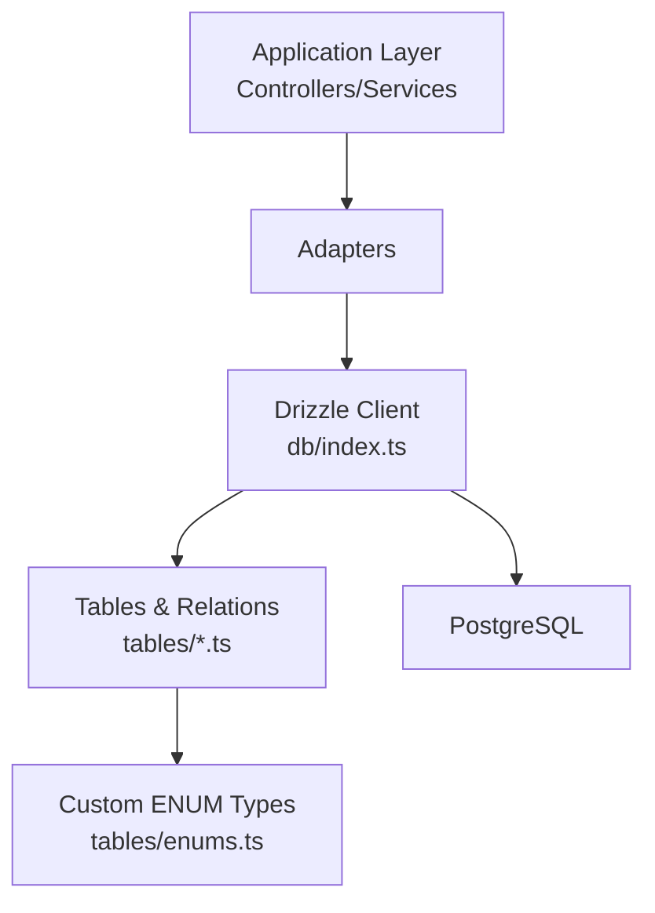

**Diagram sources**
- [db.index.ts](file://server/src/infra/db/index.ts#L1-L20)
- [enums.ts](file://server/src/infra/db/tables/enums.ts#L1-L60)
- [relations.ts](file://server/src/infra/db/tables/relations.ts#L1-L97)

## Detailed Component Analysis

### Authentication and User Model
The authentication model spans three tables:
- auth: Platform-agnostic auth records with identity and security fields.
- platform_user: User profiles linked to auth via a unique foreign key.
- session/account/verification/two_factor: Supporting tables for sessions, OAuth/manual accounts, verification tokens, and 2FA.

Key characteristics:
- Unique constraints on email and username.
- Cascade deletes on auth-related tables to maintain referential integrity.
- Indexes on frequently queried columns (e.g., session.user_id).
- Timestamps with automatic update hooks.
- **Updated**: Enhanced with user blocking functionality and moderation capabilities.

```mermaid
erDiagram
AUTH {
text id PK
text name
text email UK
boolean email_verified
timestamp created_at
timestamp updated_at
boolean two_factor_enabled
text role
text image
boolean banned
text ban_reason
timestamp ban_expires
}
PLATFORM_USER {
uuid id PK
timestamp created_at
timestamp updated_at
text auth_id UK FK
text username UK
uuid college_id FK
text branch
integer karma
boolean is_accepted_terms
}
SESSION {
text id PK
timestamp expires_at
text token UK
timestamp created_at
timestamp updated_at
text ip_address
text user_agent
text user_id FK
text impersonated_by
}
ACCOUNT {
text id PK
text account_id
text provider_id
text user_id FK
text access_token
text refresh_token
text id_token
timestamp access_token_expires_at
timestamp refresh_token_expires_at
text scope
text password
timestamp created_at
timestamp updated_at
}
TWO_FACTOR {
text id PK
text secret
text backup_codes
text user_id FK
}
AUTH ||--o| PLATFORM_USER : "has"
AUTH ||--o{ SESSION : "owns"
AUTH ||--o{ ACCOUNT : "owns"
AUTH ||--o{ TWO_FACTOR : "owns"
COLLEGE ||--o{ PLATFORM_USER : "enrolls"
```

**Diagram sources**
- [auth.table.ts](file://server/src/infra/db/tables/auth.table.ts#L13-L163)
- [college.table.ts](file://server/src/infra/db/tables/college.table.ts)

**Section sources**
- [auth.table.ts](file://server/src/infra/db/tables/auth.table.ts#L13-L163)

### Branch Management System
**New**: Branch management enables content organization by academic disciplines and program specializations.

Key characteristics:
- UUID primary key for branches with auto-generated IDs.
- Unique constraints on branch name and code for consistency.
- Composite index on name and code for efficient lookups.
- Timestamps with automatic creation/update tracking.
- Many-to-many relationship with colleges via junction table.

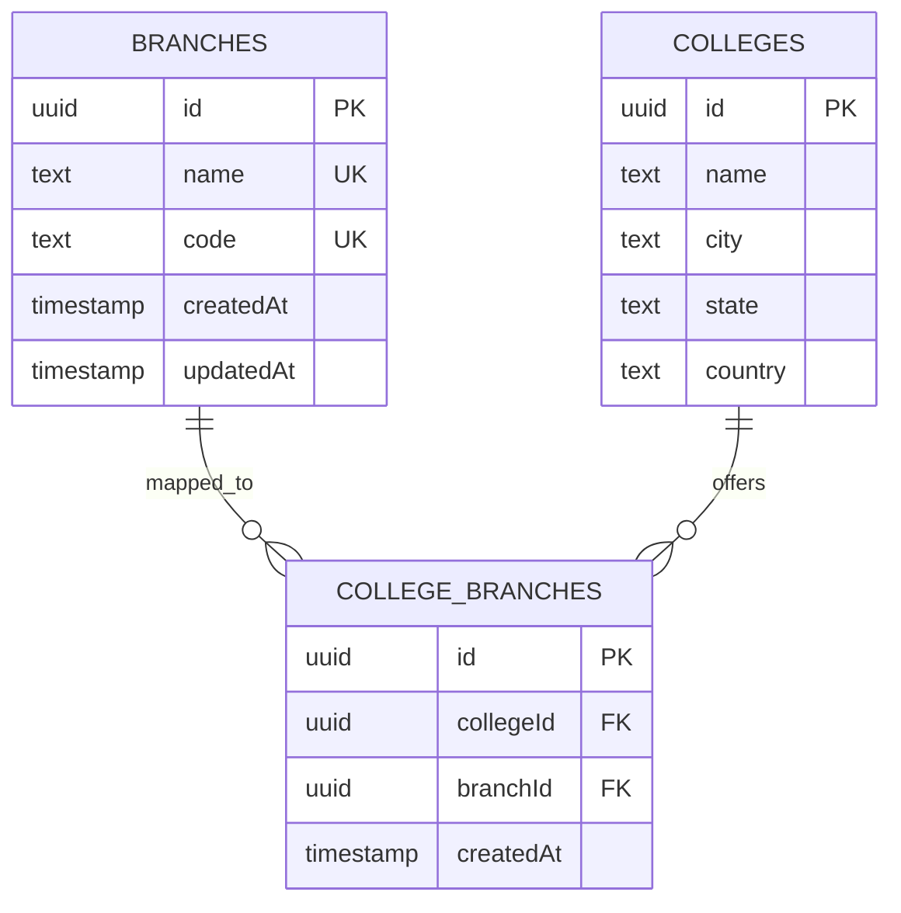

**Diagram sources**
- [branch.table.ts](file://server/src/infra/db/tables/branch.table.ts#L1-L13)
- [college-branch.table.ts](file://server/src/infra/db/tables/college-branch.table.ts#L1-L19)
- [college.table.ts](file://server/src/infra/db/tables/college.table.ts)

**Section sources**
- [branch.table.ts](file://server/src/infra/db/tables/branch.table.ts#L1-L13)
- [college-branch.table.ts](file://server/src/infra/db/tables/college-branch.table.ts#L1-L19)

### User Blocking System
**New**: User blocking functionality prevents users from interacting with blocked accounts.

Key characteristics:
- UUID primary key with auto-generated IDs.
- Unique composite index preventing duplicate blocks.
- Cascade delete on both blocker and blocked user references.
- Self-referencing relationships with distinct relation names.
- Supports moderation workflows for content safety.

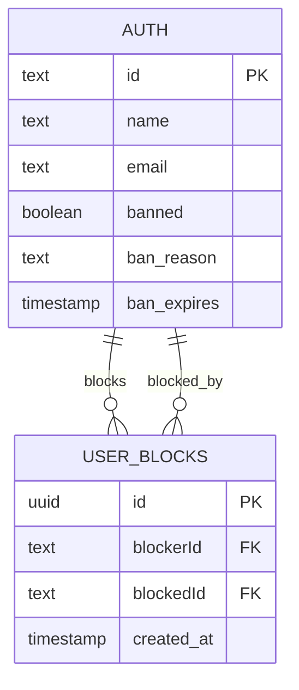

**Diagram sources**
- [user-block.table.ts](file://server/src/infra/db/tables/user-block.table.ts#L1-L34)
- [auth.table.ts](file://server/src/infra/db/tables/auth.table.ts#L13-L163)

**Section sources**
- [user-block.table.ts](file://server/src/infra/db/tables/user-block.table.ts#L1-L34)

### Banned Words System
**New**: Comprehensive content moderation system with severity levels and strict mode support.

Key characteristics:
- UUID primary key with auto-generated IDs.
- Unique word constraint for effective content filtering.
- Boolean strictMode flag for precise matching control.
- ENUM moderation severity levels (mild, moderate, severe).
- Composite indexes on word and strictMode for optimized searches.
- Timestamps with automatic creation/update tracking.

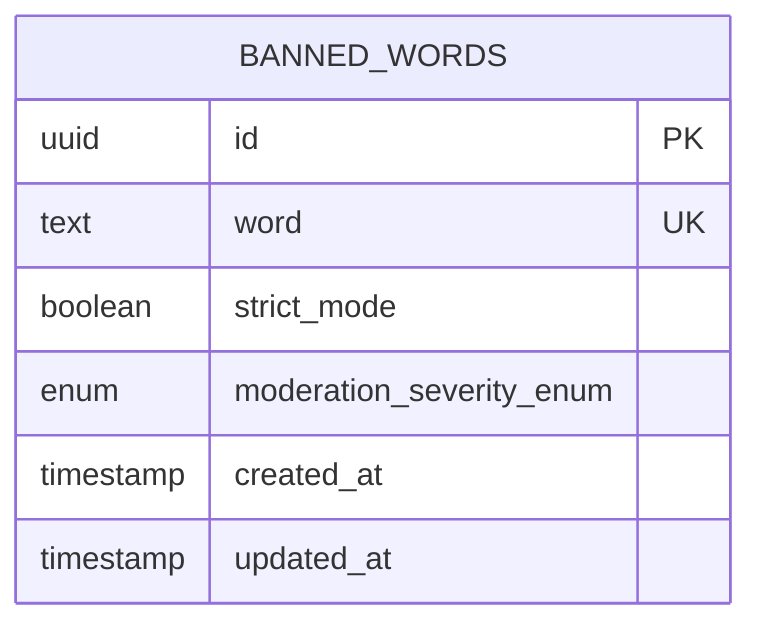

**Diagram sources**
- [banned-word.table.ts](file://server/src/infra/db/tables/banned-word.table.ts#L1-L15)
- [enums.ts](file://server/src/infra/db/tables/enums.ts#L55-L59)

**Section sources**
- [banned-word.table.ts](file://server/src/infra/db/tables/banned-word.table.ts#L1-L15)
- [enums.ts](file://server/src/infra/db/tables/enums.ts#L55-L59)

### Posts
Posts represent content authored by users, tagged by topics, and subject to visibility controls.

Key characteristics:
- UUID primary key.
- Topic ENUM for categorization.
- Visibility flags (banned/shadow banned).
- Views counter.
- Composite index for visibility and ordering.

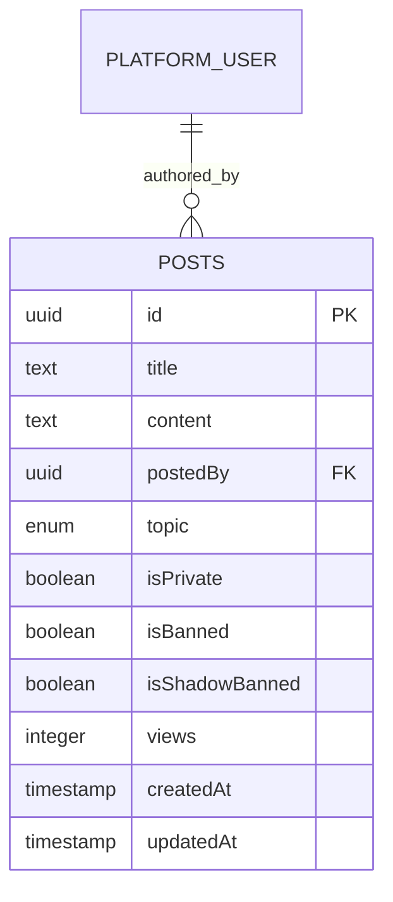

**Diagram sources**
- [post.table.ts](file://server/src/infra/db/tables/post.table.ts#L5-L21)

**Section sources**
- [post.table.ts](file://server/src/infra/db/tables/post.table.ts#L5-L21)

### Comments
Comments are nested replies to posts, with optional parent-child hierarchy and moderation flags.

Key characteristics:
- Cascade delete on post and author references.
- Self-referencing parentCommentId with set null on delete.
- Created/updated timestamps.

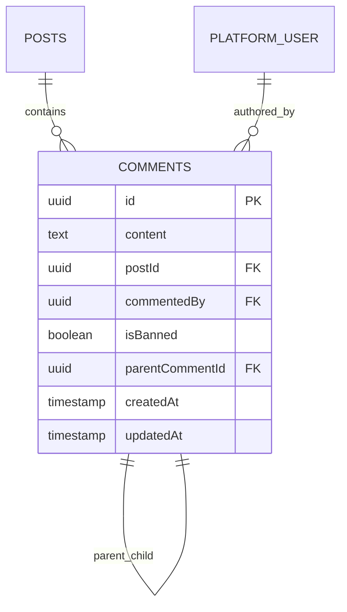

**Diagram sources**
- [comment.table.ts](file://server/src/infra/db/tables/comment.table.ts#L5-L26)

**Section sources**
- [comment.table.ts](file://server/src/infra/db/tables/comment.table.ts#L5-L26)

### Votes
Votes capture upvotes/downvotes on posts and comments with uniqueness constraints.

Key characteristics:
- Composite unique index on (userId, targetType, targetId) to prevent duplicate votes.
- Target type ENUM distinguishes post vs comment.
- Target ID references either posts or comments depending on targetType.

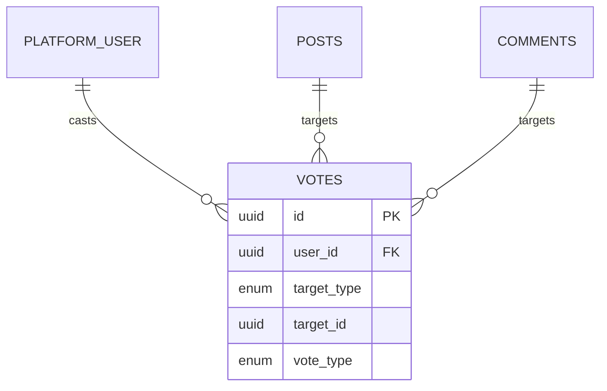

**Diagram sources**
- [vote.table.ts](file://server/src/infra/db/tables/vote.table.ts#L12-L42)

**Section sources**
- [vote.table.ts](file://server/src/infra/db/tables/vote.table.ts#L12-L42)

### Bookmarks
Bookmarks track user-post associations.

Key characteristics:
- Index on (userId, postId) for fast lookup.
- Cascade semantics on user and post references.

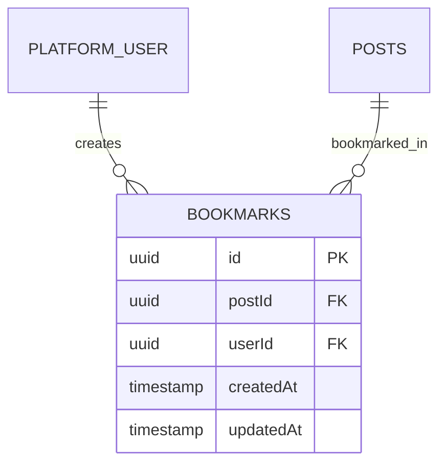

**Diagram sources**
- [bookmark.table.ts](file://server/src/infra/db/tables/bookmark.table.ts#L5-L15)

**Section sources**
- [bookmark.table.ts](file://server/src/infra/db/tables/bookmark.table.ts#L5-L15)

### Audit Logs
Audit logs record actions performed by users across the platform.

Key characteristics:
- ENUMs for role, platform, status, action, and entity type sourced from shared audit constants.
- Timestamped entries with actor and target metadata.

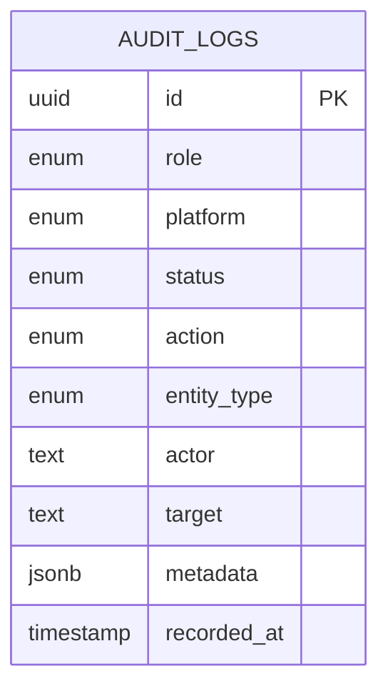

**Diagram sources**
- [audit-log.table.ts](file://server/src/infra/db/tables/audit-log.table.ts)
- [enums.ts](file://server/src/infra/db/tables/enums.ts#L10-L14)
- [audit-actions.ts](file://server/src/shared/constants/audit/actions.ts)
- [audit-platform.ts](file://server/src/shared/constants/audit/platform.ts)
- [audit-status.ts](file://server/src/shared/constants/audit/status.ts)
- [audit-entity.ts](file://server/src/shared/constants/audit/entity.ts)
- [audit-roles.ts](file://server/src/shared/constants/audit/roles.ts)

**Section sources**
- [audit-log.table.ts](file://server/src/infra/db/tables/audit-log.table.ts)
- [enums.ts](file://server/src/infra/db/tables/enums.ts#L10-L14)

### Notifications
Notifications inform users about activity (e.g., upvotes, replies).

Key characteristics:
- ENUM for notification_type.
- Timestamped delivery with optional read state managed by adapters.

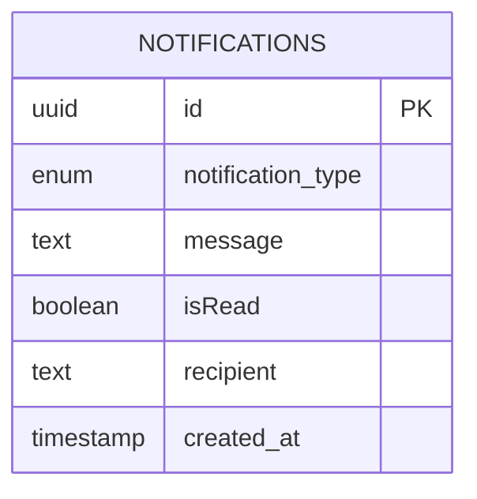

**Diagram sources**
- [notification.table.ts](file://server/src/infra/db/tables/notification.table.ts)
- [enums.ts](file://server/src/infra/db/tables/enums.ts#L18-L24)

**Section sources**
- [notification.table.ts](file://server/src/infra/db/tables/notification.table.ts)
- [enums.ts](file://server/src/infra/db/tables/enums.ts#L18-L24)

### Content Reports
Content reports track moderation reports for posts and comments.

Key characteristics:
- ENUM for report_type.
- References to reporter, post, and optional comment.

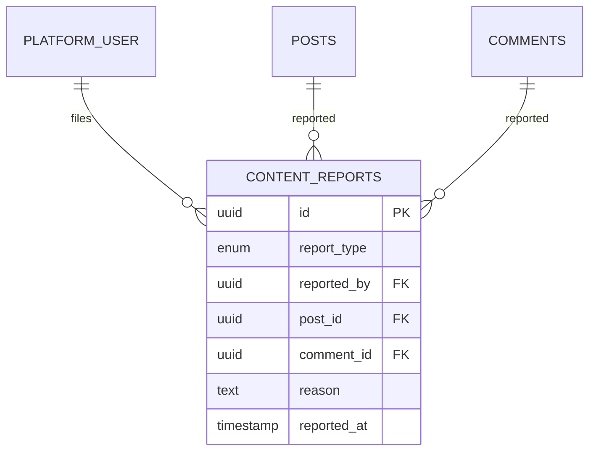

**Diagram sources**
- [content-report.table.ts](file://server/src/infra/db/tables/content-report.table.ts)
- [enums.ts](file://server/src/infra/db/tables/enums.ts#L16)

**Section sources**
- [content-report.table.ts](file://server/src/infra/db/tables/content-report.table.ts)
- [enums.ts](file://server/src/infra/db/tables/enums.ts#L16)

### Colleges
Colleges are referenced by users for affiliation and now support branch associations.

Key characteristics:
- UUID primary key.
- Referenced by platform_user.college_id.
- **Updated**: Many-to-many relationship with branches through college_branches junction table.

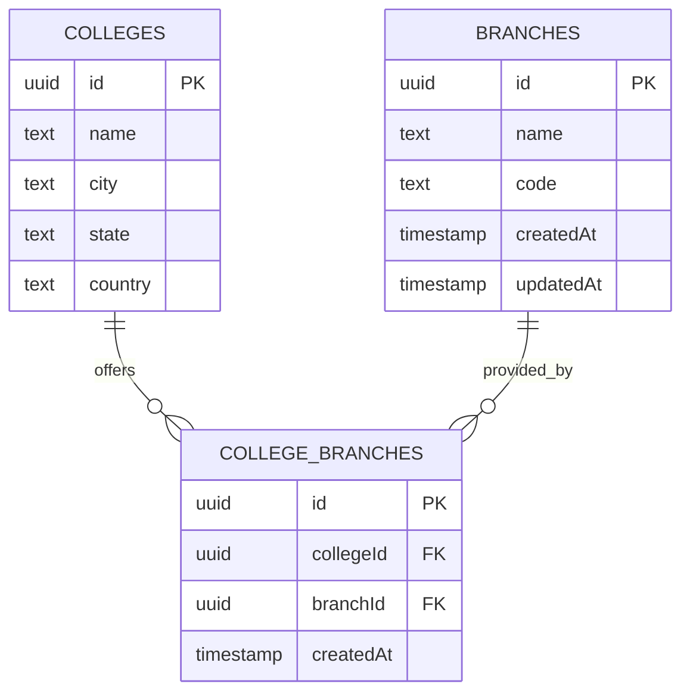

**Diagram sources**
- [college.table.ts](file://server/src/infra/db/tables/college.table.ts)
- [college-branch.table.ts](file://server/src/infra/db/tables/college-branch.table.ts#L1-L19)
- [branch.table.ts](file://server/src/infra/db/tables/branch.table.ts#L1-L13)

**Section sources**
- [college.table.ts](file://server/src/infra/db/tables/college.table.ts)

## Dependency Analysis
The schema enforces referential integrity via foreign keys and Drizzle relations. The following diagram highlights key dependencies among entities, including new branch management and user blocking relationships.

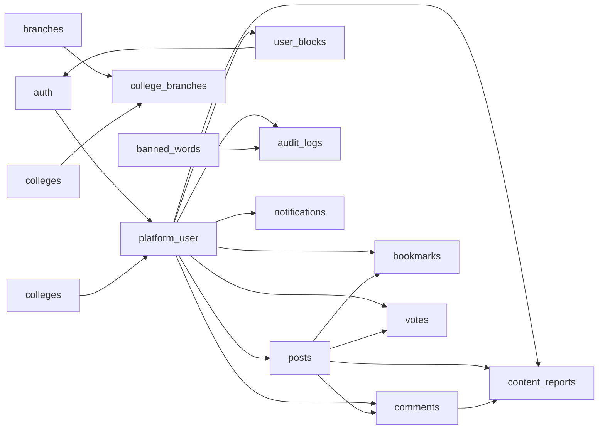

**Diagram sources**
- [relations.ts](file://server/src/infra/db/tables/relations.ts#L1-L97)
- [auth.table.ts](file://server/src/infra/db/tables/auth.table.ts#L31-L44)
- [post.table.ts](file://server/src/infra/db/tables/post.table.ts#L9)
- [comment.table.ts](file://server/src/infra/db/tables/comment.table.ts#L8-L13)
- [bookmark.table.ts](file://server/src/infra/db/tables/bookmark.table.ts#L7-L8)
- [vote.table.ts](file://server/src/infra/db/tables/vote.table.ts#L17-L23)
- [user-block.table.ts](file://server/src/infra/db/tables/user-block.table.ts#L1-L34)
- [branch.table.ts](file://server/src/infra/db/tables/branch.table.ts#L1-L13)
- [college-branch.table.ts](file://server/src/infra/db/tables/college-branch.table.ts#L1-L19)
- [banned-word.table.ts](file://server/src/infra/db/tables/banned-word.table.ts#L1-L15)
- [audit-log.table.ts](file://server/src/infra/db/tables/audit-log.table.ts)
- [notification.table.ts](file://server/src/infra/db/tables/notification.table.ts)
- [content-report.table.ts](file://server/src/infra/db/tables/content-report.table.ts)

**Section sources**
- [relations.ts](file://server/src/infra/db/tables/relations.ts#L1-L97)

## Performance Considerations
- Indexing strategies:
  - Composite index on posts for visibility and ordering.
  - Unique composite index on votes to prevent duplicates.
  - Single-column indexes on frequently filtered columns (e.g., session.user_id).
  - **Updated**: New indexes on branch.name, branch.code, user_blocks(blockerId, blockedId), banned_words(word, strict_mode) for enhanced performance.
- Foreign key constraints:
  - Cascade deletes on auth-related tables to keep data consistent.
  - Set null on parent comment deletion to preserve child comments.
  - **Updated**: Cascade deletes on user_blocks and college_branches for referential integrity.
- Connection pooling and transactions:
  - Drizzle client initialized with a schema namespace; transaction management is handled via adapters and shared transaction utilities.
- Query patterns:
  - Use relation joins and indexes to optimize reads.
  - Prefer unique indexes for upsert-like behavior on votes.
  - **Updated**: Utilize composite indexes for branch-based filtering and user blocking queries.

## Troubleshooting Guide
- Drizzle configuration:
  - Ensure DATABASE_URL is set and accessible to the runtime.
  - Verify schema path and dialect match the project structure.
- Migration issues:
  - Confirm drizzle-kit out path and schema glob align with the tables directory.
- Adapter-level errors:
  - Validate adapter method signatures and ensure correct table references.
- Transaction anomalies:
  - Use shared transaction utilities to wrap write-heavy sequences.
- **Updated**: New system troubleshooting:
  - Branch management: Verify unique constraints on branch.name and branch.code.
  - User blocking: Check composite unique index on user_blocks(blockerId, blockedId).
  - Banned words: Ensure word uniqueness and proper moderation severity values.

**Section sources**
- [drizzle.config.ts](file://server/drizzle.config.ts#L1-L14)
- [db.index.ts](file://server/src/infra/db/index.ts#L1-L20)
- [transactions.ts](file://server/src/infra/db/transactions.ts)

## Conclusion
The Flick platform's database design leverages Drizzle ORM to define a strongly-typed, maintainable schema with clear ENUMs, robust relations, and targeted indexes. The layered adapter pattern ensures clean separation of concerns while enabling efficient queries and reliable referential integrity. The audit and notification systems are built atop standardized ENUMs and tables, supporting scalable monitoring and user engagement. **Updated**: The addition of branch management, user blocking, and banned words systems enhances content governance and user safety, providing comprehensive moderation capabilities while maintaining the existing architectural integrity. Together, these components provide a solid foundation for performance, reliability, and extensibility.

## Appendices

### Drizzle ORM Configuration
- Schema path: src/infra/db/tables/*.ts
- Dialect: postgresql
- Credentials: DATABASE_URL from environment

**Section sources**
- [drizzle.config.ts](file://server/drizzle.config.ts#L1-L14)
- [env.ts](file://server/src/config/env.ts)

### Migration Management
- Drizzle Kit configuration drives migrations and snapshots.
- Snapshot journal tracks applied migrations.

**Section sources**
- [drizzle.config.ts](file://server/drizzle.config.ts#L1-L14)
- [0000_bored_dakota_north.sql](file://server/drizzle/0000_bored_dakota_north.sql)
- [0001_early_masked_marvel.sql](file://server/drizzle/0001_early_masked_marvel.sql)
- [0000_snapshot.json](file://server/drizzle/meta/0000_snapshot.json)
- [0001_snapshot.json](file://server/drizzle/meta/0001_snapshot.json)
- [_journal.json](file://server/drizzle/meta/_journal.json)

### Query Building Patterns
- Use typed tables and relations for compile-time safety.
- Leverage unique indexes for idempotent operations (e.g., votes).
- Apply indexes on filter/order columns for performance.
- **Updated**: Utilize composite indexes for branch-based queries and user blocking operations.

**Section sources**
- [db.index.ts](file://server/src/infra/db/index.ts#L1-L20)
- [relations.ts](file://server/src/infra/db/tables/relations.ts#L1-L97)
- [vote.table.ts](file://server/src/infra/db/tables/vote.table.ts#L27-L37)

### Audit Trail System
- Audit log taxonomy sourced from shared constants.
- Role, platform, status, action, and entity type ENUMs.
- **Updated**: Enhanced audit logging supports new moderation activities.

**Section sources**
- [enums.ts](file://server/src/infra/db/tables/enums.ts#L10-L14)
- [audit-actions.ts](file://server/src/shared/constants/audit/actions.ts)
- [audit-platform.ts](file://server/src/shared/constants/audit/platform.ts)
- [audit-status.ts](file://server/src/shared/constants/audit/status.ts)
- [audit-entity.ts](file://server/src/shared/constants/audit/entity.ts)
- [audit-roles.ts](file://server/src/shared/constants/audit/roles.ts)

### Data Validation Rules and Business Logic Enforcement
- Not-null constraints on critical fields (e.g., usernames, emails).
- Unique constraints on identifiers (email, username, branch.name, branch.code, banned_words.word).
- Moderation flags (isBanned, isShadowBanned) for content governance.
- Branch and terms acceptance for user onboarding.
- **Updated**: User blocking prevention through composite unique index on user_blocks.
- **Updated**: Strict mode and moderation severity validation for banned words.

**Section sources**
- [auth.table.ts](file://server/src/infra/db/tables/auth.table.ts#L16-L28)
- [auth.table.ts](file://server/src/infra/db/tables/auth.table.ts#L39-L43)
- [branch.table.ts](file://server/src/infra/db/tables/branch.table.ts#L4-L6)
- [user-block.table.ts](file://server/src/infra/db/tables/user-block.table.ts#L17-L19)
- [banned-word.table.ts](file://server/src/infra/db/tables/banned-word.table.ts#L6-L8)

### Referential Integrity
- Foreign keys with cascade deletes on auth tables.
- Set null on parent comment deletion.
- Unique indexes to prevent duplicates (e.g., votes, user_blocks).
- **Updated**: Cascade deletes on user_blocks and college_branches.
- **Updated**: Unique constraints on branch.name/code and banned_words.word.

**Section sources**
- [auth.table.ts](file://server/src/infra/db/tables/auth.table.ts#L38-L40)
- [comment.table.ts](file://server/src/infra/db/tables/comment.table.ts#L15-L17)
- [vote.table.ts](file://server/src/infra/db/tables/vote.table.ts#L27-L37)
- [user-block.table.ts](file://server/src/infra/db/tables/user-block.table.ts#L17-L19)
- [college-branch.table.ts](file://server/src/infra/db/tables/college-branch.table.ts#L15-L17)
- [banned-word.table.ts](file://server/src/infra/db/tables/banned-word.table.ts#L6)

### Connection Pooling and Transactions
- Drizzle client configured with schema namespace.
- Transaction utilities support atomic operations across adapters.
- **Updated**: Transaction support for new moderation operations.

**Section sources**
- [db.index.ts](file://server/src/infra/db/index.ts#L5-L18)
- [transactions.ts](file://server/src/infra/db/transactions.ts)

### Schema Evolution Procedures and Version Management
- Use drizzle-kit to generate and apply migrations.
- Maintain snapshot history for rollback and audit.
- Keep enums and relations synchronized during schema updates.
- **Updated**: Follow established procedures for adding new moderation and branch management tables.

**Section sources**
- [drizzle.config.ts](file://server/drizzle.config.ts#L1-L14)
- [0000_snapshot.json](file://server/drizzle/meta/0000_snapshot.json)
- [0001_snapshot.json](file://server/drizzle/meta/0001_snapshot.json)
- [_journal.json](file://server/drizzle/meta/_journal.json)

### New System Specifications

#### Branch Management Implementation
- **Branch Table**: Stores academic discipline information with unique constraints on name and code.
- **College-Branch Relationship**: Many-to-many relationship enabling flexible academic program offerings.
- **Indexing Strategy**: Separate indexes on name and code for efficient lookups and filtering.

#### User Blocking System
- **Block Prevention**: Composite unique index prevents duplicate blocking attempts.
- **Self-Referencing**: Distinct relation names ("blocked_users", "blocked_by") for clear relationship semantics.
- **Cascade Operations**: Automatic cleanup when users are deleted.

#### Banned Words System
- **Moderation Levels**: Three-tier severity system (mild, moderate, severe) for content filtering.
- **Strict Mode**: Boolean flag for precise word matching control.
- **Performance Optimization**: Composite indexes on word and strict_mode for efficient filtering.

**Section sources**
- [branch.table.ts](file://server/src/infra/db/tables/branch.table.ts#L1-L13)
- [user-block.table.ts](file://server/src/infra/db/tables/user-block.table.ts#L1-L34)
- [banned-word.table.ts](file://server/src/infra/db/tables/banned-word.table.ts#L1-L15)
- [college-branch.table.ts](file://server/src/infra/db/tables/college-branch.table.ts#L1-L19)
- [enums.ts](file://server/src/infra/db/tables/enums.ts#L55-L59)