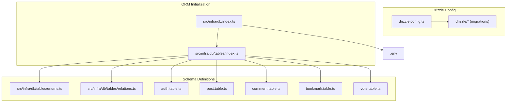
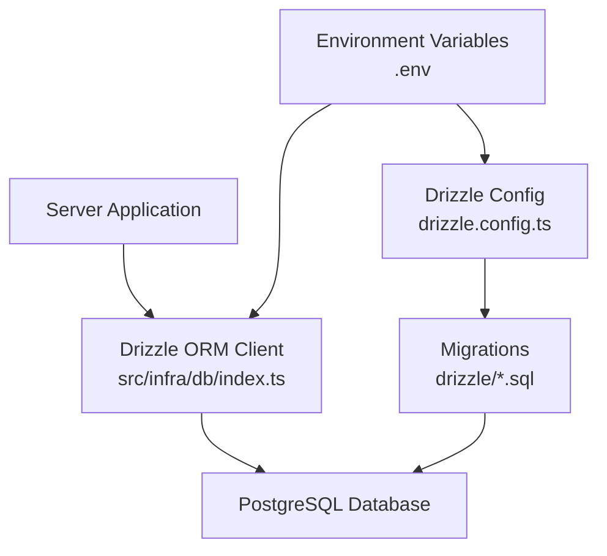
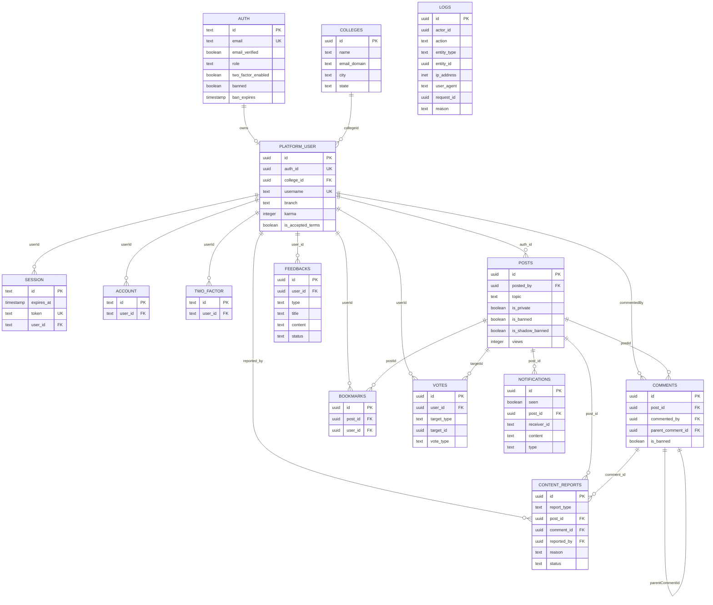

# Database Schema Overview

<cite>
**Referenced Files in This Document**
- [drizzle.config.ts](file://server/drizzle.config.ts)
- [db/index.ts](file://server/src/infra/db/index.ts)
- [.env](file://server/.env)
- [tables/index.ts](file://server/src/infra/db/tables/index.ts)
- [enums.ts](file://server/src/infra/db/tables/enums.ts)
- [relations.ts](file://server/src/infra/db/tables/relations.ts)
- [auth.table.ts](file://server/src/infra/db/tables/auth.table.ts)
- [post.table.ts](file://server/src/infra/db/tables/post.table.ts)
- [comment.table.ts](file://server/src/infra/db/tables/comment.table.ts)
- [bookmark.table.ts](file://server/src/infra/db/tables/bookmark.table.ts)
- [vote.table.ts](file://server/src/infra/db/tables/vote.table.ts)
- [0000_bored_dakota_north.sql](file://server/drizzle/0000_bored_dakota_north.sql)
- [0001_early_masked_marvel.sql](file://server/drizzle/0001_early_masked_marvel.sql)
- [post.schema.ts](file://server/src/modules/post/post.schema.ts)
- [meta/_journal.json](file://server/drizzle/meta/_journal.json)
- [meta/0001_snapshot.json](file://server/drizzle/meta/0001_snapshot.json)
</cite>

## Update Summary
**Changes Made**
- Updated Content Schema section to document the new `isPrivate` column in posts table
- Enhanced Detailed Component Analysis to include the college-only post feature implementation
- Updated Dependency Analysis to reflect the new `isPrivate` column in the ER diagram
- Added documentation for the migration that introduced the `isPrivate` column

## Table of Contents
1. [Introduction](#introduction)
2. [Project Structure](#project-structure)
3. [Core Components](#core-components)
4. [Architecture Overview](#architecture-overview)
5. [Detailed Component Analysis](#detailed-component-analysis)
6. [Dependency Analysis](#dependency-analysis)
7. [Performance Considerations](#performance-considerations)
8. [Troubleshooting Guide](#troubleshooting-guide)
9. [Conclusion](#conclusion)

## Introduction
This document provides a comprehensive overview of the Flick platform's PostgreSQL database configuration, Drizzle ORM setup, schema organization, migrations, and operational guidelines. It covers connection setup, schema evolution, referential integrity, indexing strategies, environment-specific configuration, and security considerations derived from the repository's database artifacts.

## Project Structure
The database layer is organized under the server module with the following key areas:
- Drizzle configuration and migration system
- ORM initialization and schema registry
- Table definitions grouped by domain
- Enumerations and relations for strong typing and referential integrity
- Environment variables for database connectivity

**Diagram sources**
- [drizzle.config.ts](file://server/drizzle.config.ts#L1-L14)
- [db/index.ts](file://server/src/infra/db/index.ts#L1-L20)
- [tables/index.ts](file://server/src/infra/db/tables/index.ts#L1-L11)
- [enums.ts](file://server/src/infra/db/tables/enums.ts#L1-L49)
- [relations.ts](file://server/src/infra/db/tables/relations.ts#L1-L65)
- [auth.table.ts](file://server/src/infra/db/tables/auth.table.ts#L1-L163)
- [post.table.ts](file://server/src/infra/db/tables/post.table.ts#L1-L21)
- [comment.table.ts](file://server/src/infra/db/tables/comment.table.ts#L1-L26)
- [bookmark.table.ts](file://server/src/infra/db/tables/bookmark.table.ts#L1-L15)
- [vote.table.ts](file://server/src/infra/db/tables/vote.table.ts#L1-L42)
- [.env](file://server/.env#L13-L14)

**Section sources**
- [drizzle.config.ts](file://server/drizzle.config.ts#L1-L14)
- [db/index.ts](file://server/src/infra/db/index.ts#L1-L20)
- [tables/index.ts](file://server/src/infra/db/tables/index.ts#L1-L11)
- [.env](file://server/.env#L13-L14)

## Core Components
- Drizzle configuration defines the dialect, schema glob, and database credentials via environment variable.
- ORM initialization connects to PostgreSQL using DATABASE_URL and registers all tables in a named schema map for type-safe queries.
- Environment variables supply the database URL and other service URLs.

Key responsibilities:
- Drizzle Kit configuration: generation and migration management
- ORM client: query building and execution
- Environment-driven connectivity: DATABASE_URL

**Section sources**
- [drizzle.config.ts](file://server/drizzle.config.ts#L1-L14)
- [db/index.ts](file://server/src/infra/db/index.ts#L1-L20)
- [.env](file://server/.env#L13-L14)

## Architecture Overview
The database architecture centers around a central Drizzle ORM client initialized with a schema map of domain tables. Enums and relations are defined alongside tables to enforce type safety and referential integrity. Migrations evolve the schema over time.

**Diagram sources**
- [db/index.ts](file://server/src/infra/db/index.ts#L1-L20)
- [drizzle.config.ts](file://server/drizzle.config.ts#L1-L14)
- [0000_bored_dakota_north.sql](file://server/drizzle/0000_bored_dakota_north.sql#L1-L219)
- [0001_early_masked_marvel.sql](file://server/drizzle/0001_early_masked_marvel.sql#L1-L1)
- [.env](file://server/.env#L13-L14)

## Detailed Component Analysis

### Drizzle Configuration and Migration System
- Drizzle Kit configuration specifies:
  - Output directory for migrations
  - Schema glob pointing to table definitions
  - PostgreSQL dialect
  - Database credentials loaded from DATABASE_URL
  - Verbose and strict modes enabled
- Migrations:
  - Initial snapshot includes custom enums and base tables
  - Subsequent migration adds the `isPrivate` column to posts table

**Updated** The migration system now includes the `isPrivate` column addition, which enables the college-only post feature implementation.

Operational implications:
- Use Drizzle Kit commands to generate and apply migrations consistently.
- Strict mode helps catch schema mismatches early.
- The schema glob ensures all table definitions are included in migration generation.

**Section sources**
- [drizzle.config.ts](file://server/drizzle.config.ts#L1-L14)
- [0000_bored_dakota_north.sql](file://server/drizzle/0000_bored_dakota_north.sql#L1-L219)
- [0001_early_masked_marvel.sql](file://server/drizzle/0001_early_masked_marvel.sql#L1-L1)
- [meta/_journal.json](file://server/drizzle/meta/_journal.json#L1-L20)

### ORM Initialization and Schema Registry
- The ORM client is created with DATABASE_URL and a schema map containing all domain tables.
- The schema map includes users, bookmarks, audit logs, notifications, posts, comments, colleges, feedbacks, auth, and votes.

Benefits:
- Centralized initialization simplifies dependency injection across modules.
- Named schema map improves discoverability and IDE support.

**Section sources**
- [db/index.ts](file://server/src/infra/db/index.ts#L1-L20)
- [tables/index.ts](file://server/src/infra/db/tables/index.ts#L1-L11)

### Schema Organization and Domain Grouping
Tables are grouped by domain:
- Authentication and identity: auth, platform_user, session, account, verification, two_factor
- Content: posts, comments, bookmarks, votes
- Governance and moderation: content_reports, feedbacks, notifications
- Institutional: colleges
- Audit: logs

Enums and relations are colocated with tables to maintain cohesion and enforce constraints.

**Section sources**
- [tables/index.ts](file://server/src/infra/db/tables/index.ts#L1-L11)
- [enums.ts](file://server/src/infra/db/tables/enums.ts#L1-L49)
- [relations.ts](file://server/src/infra/db/tables/relations.ts#L1-L65)

### Authentication and Identity Schema
- auth: core identity with unique email, timestamps, two-factor flag, role, and moderation fields.
- platform_user: links to auth, enforces unique username and auth ID, references colleges, tracks karma and terms acceptance.
- session, account, verification, two_factor: support OAuth/manual auth, sessions, verification codes, and 2FA.

Referential integrity:
- platform_user.authId references auth.id with cascade delete.
- session.userId references auth.id with cascade delete.
- account.userId references auth.id with cascade delete.
- two_factor.userId references auth.id with cascade delete.

Indexes:
- session_userId_idx, account_userId_idx, twoFactor_secret_idx, twoFactor_userId_idx, verification_identifier_idx.

**Section sources**
- [auth.table.ts](file://server/src/infra/db/tables/auth.table.ts#L1-L163)
- [relations.ts](file://server/src/infra/db/tables/relations.ts#L1-L65)

### Content Schema
- posts: UUID primary key, title, content, topic enum, visibility flags, views, timestamps; composite index on visibility and creation.
- comments: nested comments via parentCommentId, foreign keys to posts and platform_user with cascade deletes; self-referencing foreign key with set null on delete.
- bookmarks: composite foreign keys to posts and platform_user; composite index on user and post.
- votes: polymorphic voting via targetType and targetId; unique constraint per user-target-type; index on target lookup.

**Updated** The posts table now includes the `isPrivate` column, which represents the college-only post feature. This column has a default value of `false` and is `NOT NULL`, enabling posts to be restricted to specific colleges rather than being publicly visible.

**Section sources**
- [post.table.ts](file://server/src/infra/db/tables/post.table.ts#L1-L21)
- [comment.table.ts](file://server/src/infra/db/tables/comment.table.ts#L1-L26)
- [bookmark.table.ts](file://server/src/infra/db/tables/bookmark.table.ts#L1-L15)
- [vote.table.ts](file://server/src/infra/db/tables/vote.table.ts#L1-L42)
- [relations.ts](file://server/src/infra/db/tables/relations.ts#L1-L65)
- [post.schema.ts](file://server/src/modules/post/post.schema.ts#L17-L33)

### Governance and Moderation Schema
- content_reports: references reporter (platform_user), optional post or comment targets, type enum, status, timestamps.
- feedbacks: optional user reference, metadata fields, status.
- notifications: receiver, actor usernames, content, type enum, timestamps.

**Section sources**
- [0000_bored_dakota_north.sql](file://server/drizzle/0000_bored_dakota_north.sql#L134-L156)

### Audit Schema
- logs: audit trail with actor, action, entity, IP, user agent, request ID, reason, and metadata; indexes on entity, actor, and occurred_at.

**Section sources**
- [0000_bored_dakota_north.sql](file://server/drizzle/0000_bored_dakota_north.sql#L12-L27)
- [enums.ts](file://server/src/infra/db/tables/enums.ts#L10-L14)

### Enumerations and Constraints
- Enumerations:
  - Auth types, audit log enums, content report types, notification types, topics, vote types, and vote entity types.
- Constraints:
  - Unique indexes on emails, tokens, usernames, and composite vote uniqueness.
  - Foreign keys enforcing referential integrity across tables.

**Section sources**
- [enums.ts](file://server/src/infra/db/tables/enums.ts#L1-L49)
- [0000_bored_dakota_north.sql](file://server/drizzle/0000_bored_dakota_north.sql#L58-L218)

### Database URL and Environment Configuration
- DATABASE_URL is used by both Drizzle Kit and the ORM client.
- Additional environment variables include server base URI, CORS origins, Better Auth secrets, Redis, tokens, and mail settings.

Security and operational notes:
- Keep DATABASE_URL secret and environment-specific.
- Use separate environments for development and production.
- Ensure TLS and secure transport for remote databases.

**Section sources**
- [.env](file://server/.env#L13-L14)

## Dependency Analysis
The following diagram shows how tables depend on each other and how relations are defined.

**Updated** The ER diagram now includes the `is_private` column in the POSTS entity, reflecting the college-only post feature implementation.

**Diagram sources**
- [auth.table.ts](file://server/src/infra/db/tables/auth.table.ts#L1-L163)
- [post.table.ts](file://server/src/infra/db/tables/post.table.ts#L1-L21)
- [comment.table.ts](file://server/src/infra/db/tables/comment.table.ts#L1-L26)
- [bookmark.table.ts](file://server/src/infra/db/tables/bookmark.table.ts#L1-L15)
- [vote.table.ts](file://server/src/infra/db/tables/vote.table.ts#L1-L42)
- [0000_bored_dakota_north.sql](file://server/drizzle/0000_bored_dakota_north.sql#L112-L218)

## Performance Considerations
- Indexes:
  - Composite indexes on visibility and creation time for posts.
  - Composite index on bookmarks for user-post pairs.
  - Unique constraint on votes per user-target-type to prevent duplicates and speed up conflict checks.
  - Target-type and target-id index for efficient vote lookups.
  - Audit logs indexed by entity, actor, and occurrence time.
- Query patterns:
  - Prefer filtered queries using indexes (e.g., posts visibility and creation).
  - Use joins with foreign keys to avoid N+1 selects.
- Storage:
  - JSONB fields in audit logs enable flexible metadata storage but should be used judiciously.

**Updated** The addition of the `isPrivate` column enhances filtering capabilities for posts, allowing for more granular access control and improved query performance when implementing college-specific post visibility features.

## Troubleshooting Guide
Common issues and resolutions:
- Connection failures:
  - Verify DATABASE_URL correctness and network accessibility.
  - Ensure the database server accepts connections from the host.
- Migration errors:
  - Re-run migrations after resolving conflicts; use Drizzle Kit to generate deltas.
  - Confirm schema glob matches table locations.
- Integrity violations:
  - Check foreign key constraints and unique indexes.
  - Validate vote uniqueness and comment hierarchy.
- Audit logging:
  - Confirm indexes exist for efficient querying of logs by entity and actor.
- Column addition issues:
  - Verify that the `isPrivate` column exists in the posts table with correct default value.
  - Ensure applications handle the new column appropriately in queries and validations.

**Updated** Added troubleshooting guidance for the new `isPrivate` column implementation.

**Section sources**
- [drizzle.config.ts](file://server/drizzle.config.ts#L1-L14)
- [0000_bored_dakota_north.sql](file://server/drizzle/0000_bored_dakota_north.sql#L12-L27)
- [0000_bored_dakota_north.sql](file://server/drizzle/0000_bored_dakota_north.sql#L205-L218)
- [0001_early_masked_marvel.sql](file://server/drizzle/0001_early_masked_marvel.sql#L1-L1)

## Conclusion
The Flick platform employs a well-structured PostgreSQL schema managed by Drizzle ORM and migrations. The schema emphasizes referential integrity, typed enumerations, and targeted indexes to support core features like posts, comments, voting, bookmarks, and audit logging. The recent addition of the `isPrivate` column to the posts table enables the college-only post feature, enhancing the platform's ability to support institution-specific content sharing. Adhering to environment-driven configuration and migration discipline ensures reliable schema evolution and operational stability.