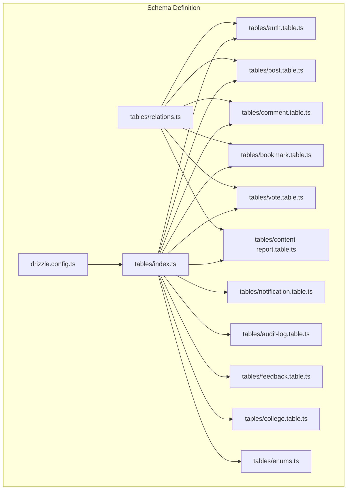
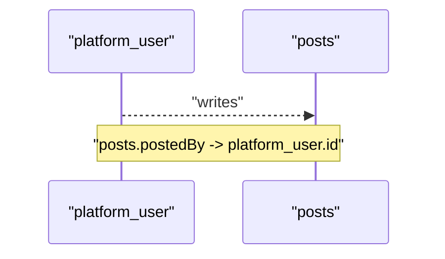
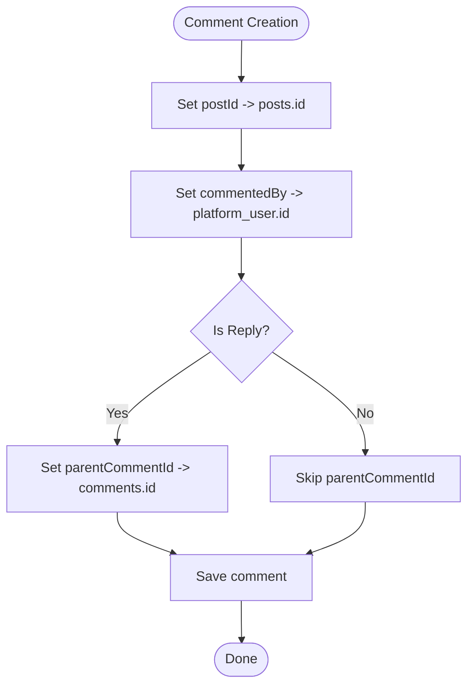
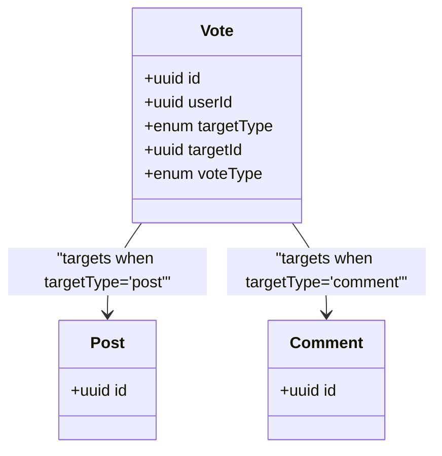
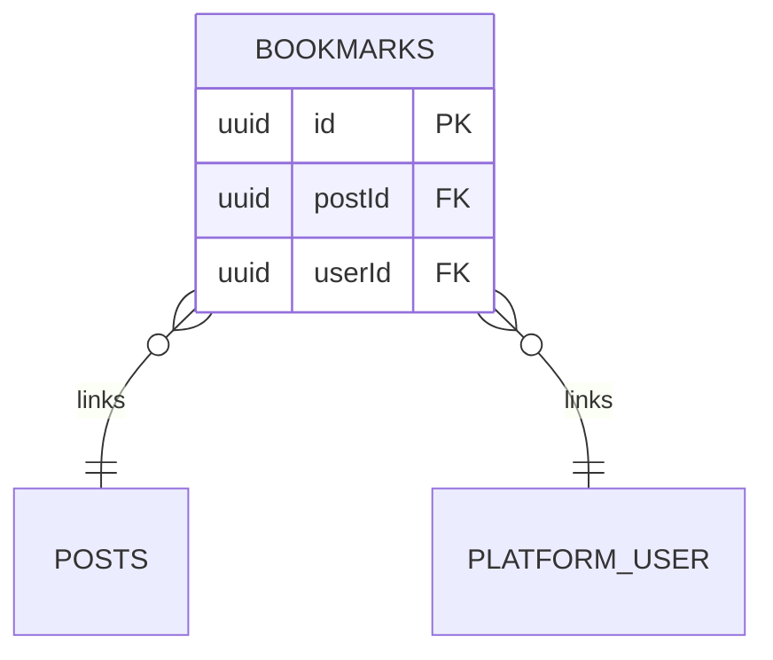
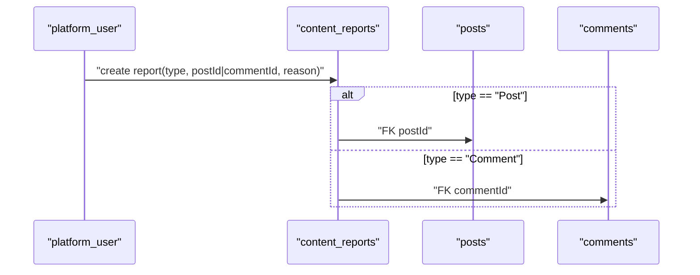
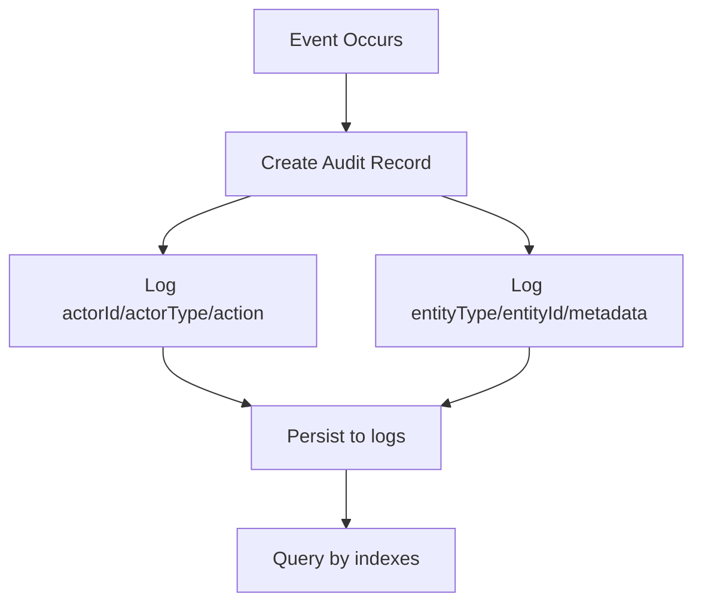
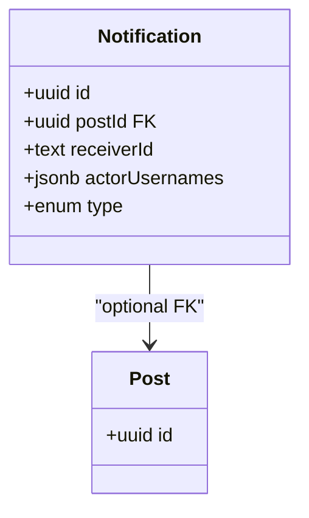
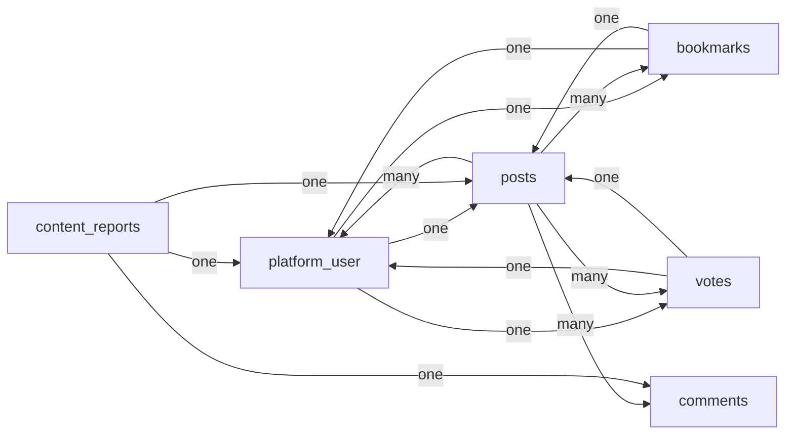

# Relationship Models

<cite>
**Referenced Files in This Document**
- [drizzle.config.ts](file://server/drizzle.config.ts)
- [index.ts](file://server/src/infra/db/tables/index.ts)
- [relations.ts](file://server/src/infra/db/tables/relations.ts)
- [auth.table.ts](file://server/src/infra/db/tables/auth.table.ts)
- [post.table.ts](file://server/src/infra/db/tables/post.table.ts)
- [comment.table.ts](file://server/src/infra/db/tables/comment.table.ts)
- [bookmark.table.ts](file://server/src/infra/db/tables/bookmark.table.ts)
- [vote.table.ts](file://server/src/infra/db/tables/vote.table.ts)
- [content-report.table.ts](file://server/src/infra/db/tables/content-report.table.ts)
- [notification.table.ts](file://server/src/infra/db/tables/notification.table.ts)
- [audit-log.table.ts](file://server/src/infra/db/tables/audit-log.table.ts)
- [enums.ts](file://server/src/infra/db/tables/enums.ts)
- [feedback.table.ts](file://server/src/infra/db/tables/feedback.table.ts)
- [college.table.ts](file://server/src/infra/db/tables/college.table.ts)
</cite>

## Table of Contents
1. [Introduction](#introduction)
2. [Project Structure](#project-structure)
3. [Core Components](#core-components)
4. [Architecture Overview](#architecture-overview)
5. [Detailed Component Analysis](#detailed-component-analysis)
6. [Dependency Analysis](#dependency-analysis)
7. [Performance Considerations](#performance-considerations)
8. [Troubleshooting Guide](#troubleshooting-guide)
9. [Conclusion](#conclusion)

## Introduction
This document describes the database relationship models and associations in the Flick platform. It focuses on:
- Foreign key relationships among core entities: user-post, post-comment hierarchies, and user-vote associations
- Many-to-many relationships for bookmarks, voting, and content reporting
- Audit log relationships for tracking user actions and content modifications
- Notification system relationships for real-time updates and user communications
- Content reporting relationships for moderation workflows
- Cardinality, cascade behaviors, and referential integrity constraints
- Query optimization strategies for complex joins and relationship traversal

## Project Structure
The database schema is defined using Drizzle ORM with PostgreSQL. The schema is organized under a single directory exporting all tables and their relations. Drizzle Kit configuration points to the schema location and credentials.



**Diagram sources**
- [drizzle.config.ts](file://server/drizzle.config.ts#L1-L14)
- [index.ts](file://server/src/infra/db/tables/index.ts#L1-L11)
- [relations.ts](file://server/src/infra/db/tables/relations.ts#L1-L65)
- [auth.table.ts](file://server/src/infra/db/tables/auth.table.ts#L1-L163)
- [post.table.ts](file://server/src/infra/db/tables/post.table.ts#L1-L21)
- [comment.table.ts](file://server/src/infra/db/tables/comment.table.ts#L1-L26)
- [bookmark.table.ts](file://server/src/infra/db/tables/bookmark.table.ts#L1-L15)
- [vote.table.ts](file://server/src/infra/db/tables/vote.table.ts#L1-L42)
- [content-report.table.ts](file://server/src/infra/db/tables/content-report.table.ts#L1-L20)
- [notification.table.ts](file://server/src/infra/db/tables/notification.table.ts#L1-L28)
- [audit-log.table.ts](file://server/src/infra/db/tables/audit-log.table.ts#L1-L74)
- [enums.ts](file://server/src/infra/db/tables/enums.ts#L1-L49)
- [feedback.table.ts](file://server/src/infra/db/tables/feedback.table.ts#L1-L33)
- [college.table.ts](file://server/src/infra/db/tables/college.table.ts#L1-L19)

**Section sources**
- [drizzle.config.ts](file://server/drizzle.config.ts#L1-L14)
- [index.ts](file://server/src/infra/db/tables/index.ts#L1-L11)

## Core Components
This section outlines the primary entities and their relationships, including foreign keys, cardinalities, and cascade behaviors.

- Users and Authentication
  - Entity: platform_user
  - Keys: id (PK), authId (FK to auth.id), collegeId (FK to colleges.id)
  - Cascade: platform_user.authId references auth.id with onDelete: "cascade"
  - Relations: one-to-one with auth; one-to-one with colleges; one-to-many with posts, bookmarks, votes
- Posts
  - Entity: posts
  - Keys: id (PK), postedBy (FK to platform_user.id)
  - Cascade: none on delete; cascades handled via relations
  - Relations: belongs to one user; has many votes, bookmarks, comments
- Comments
  - Entity: comments
  - Keys: id (PK), postId (FK to posts.id), commentedBy (FK to platform_user.id), parentCommentId (self-FK)
  - Cascade: postId and commentedBy onDelete: "cascade"; parentCommentId onDelete: "set null"
  - Relations: belongs to one post and one user; self-referencing hierarchy for replies
- Bookmarks
  - Entity: bookmarks
  - Keys: id (PK), postId (FK to posts.id), userId (FK to platform_user.id)
  - Composite unique constraint: (userId, postId)
  - Index: (userId, postId)
  - Relations: belongs to one user and one post
- Votes
  - Entity: votes
  - Keys: id (PK), userId (FK to platform_user.id), targetType (enum: post|comment), targetId (UUID), voteType (enum: upvote|downvote)
  - Unique constraint: (userId, targetType, targetId)
  - Index: (targetType, targetId)
  - Relations: belongs to one user; polymorphic association via targetType/targetId
- Content Reports
  - Entity: content_reports
  - Keys: id (PK), type (enum: Post|Comment), postId (FK to posts.id), commentId (FK to comments.id), reportedBy (FK to platform_user.id)
  - Relations: belongs to one user; optionally belongs to one post or one comment
- Notifications
  - Entity: notifications
  - Keys: id (PK), receiverId (text), postId (FK to posts.id), actorUsernames (JSON array), type (enum)
  - Relations: optional post linkage; belongs to receivers
- Audit Logs
  - Entity: logs
  - Keys: id (PK), actorId, actorType, action, entityType, entityId, metadata
  - Indexes: (entityType, entityId), (actorId), (occuredAt DESC)
  - Relations: independent tracking table for platform-wide audit events
- Feedback
  - Entity: feedbacks
  - Keys: id (PK), userId (FK to platform_user.id, onDelete: "set null")
  - Relations: optional user linkage
- Colleges
  - Entity: colleges
  - Keys: id (PK), name, emailDomain, city, state
  - Indexes: name, (city, state)
  - Relations: one-to-many with platform_user

**Section sources**
- [auth.table.ts](file://server/src/infra/db/tables/auth.table.ts#L31-L44)
- [post.table.ts](file://server/src/infra/db/tables/post.table.ts#L5-L20)
- [comment.table.ts](file://server/src/infra/db/tables/comment.table.ts#L5-L25)
- [bookmark.table.ts](file://server/src/infra/db/tables/bookmark.table.ts#L5-L14)
- [vote.table.ts](file://server/src/infra/db/tables/vote.table.ts#L12-L38)
- [content-report.table.ts](file://server/src/infra/db/tables/content-report.table.ts#L5-L16)
- [notification.table.ts](file://server/src/infra/db/tables/notification.table.ts#L12-L27)
- [audit-log.table.ts](file://server/src/infra/db/tables/audit-log.table.ts#L40-L70)
- [feedback.table.ts](file://server/src/infra/db/tables/feedback.table.ts#L4-L29)
- [college.table.ts](file://server/src/infra/db/tables/college.table.ts#L3-L18)

## Architecture Overview
The relationships are defined declaratively in Drizzle ORM with explicit foreign keys and indexes. The relations module defines one-to-one, one-to-many, and many-to-many semantics.

```mermaid
erDiagram
PLATFORM_USER {
uuid id PK
text auth_id UK
uuid college_id FK
string username UK
uuid college_id FK
}
AUTH {
text id PK
string email UK
}
COLLEGES {
uuid id PK
string name
string emailDomain
string city
string state
}
POSTS {
uuid id PK
uuid postedBy FK
string topic
}
COMMENTS {
uuid id PK
uuid postId FK
uuid commentedBy FK
uuid parentCommentId FK
}
BOOKMARKS {
uuid id PK
uuid postId FK
uuid userId FK
}
VOTES {
uuid id PK
uuid userId FK
enum targetType
uuid targetId
enum voteType
}
CONTENT_REPORTS {
uuid id PK
enum type
uuid postId FK
uuid commentId FK
uuid reportedBy FK
}
NOTIFICATIONS {
uuid id PK
uuid postId FK
text receiverId
jsonb actorUsernames
enum type
}
LOGS {
uuid id PK
uuid actorId
enum actorType
string action
enum entityType
uuid entityId
jsonb metadata
}
PLATFORM_USER ||--|| AUTH : "has one"
PLATFORM_USER }o--|| COLLEGES : "belongs to"
PLATFORM_USER }o--o{ POSTS : "writes"
PLATFORM_USER }o--o{ BOOKMARKS : "creates"
PLATFORM_USER }o--o{ VOTES : "casts"
POSTS }o--|| PLATFORM_USER : "written by"
POSTS }o--o{ COMMENTS : "contains"
POSTS }o--o{ BOOKMARKS : "bookmarked in"
POSTS }o--o{ VOTES : "receives"
COMMENTS }o--|| POSTS : "belongs to"
COMMENTS }o--|| PLATFORM_USER : "written by"
COMMENTS }o--o--o{ COMMENTS : "reply to"
BOOKMARKS }o--|| PLATFORM_USER : "by"
BOOKMARKS }o--|| POSTS : "to"
VOTES }o--|| PLATFORM_USER : "cast by"
VOTES }o--o--|| POSTS : "targets"
CONTENT_REPORTS }o--|| PLATFORM_USER : "reported by"
CONTENT_REPORTS }o--|| POSTS : "reports"
CONTENT_REPORTS }o--|| COMMENTS : "reports"
NOTIFICATIONS }o--|| POSTS : "relates to"
```

**Diagram sources**
- [auth.table.ts](file://server/src/infra/db/tables/auth.table.ts#L31-L44)
- [post.table.ts](file://server/src/infra/db/tables/post.table.ts#L5-L20)
- [comment.table.ts](file://server/src/infra/db/tables/comment.table.ts#L5-L25)
- [bookmark.table.ts](file://server/src/infra/db/tables/bookmark.table.ts#L5-L14)
- [vote.table.ts](file://server/src/infra/db/tables/vote.table.ts#L12-L38)
- [content-report.table.ts](file://server/src/infra/db/tables/content-report.table.ts#L5-L16)
- [notification.table.ts](file://server/src/infra/db/tables/notification.table.ts#L12-L27)
- [audit-log.table.ts](file://server/src/infra/db/tables/audit-log.table.ts#L40-L70)
- [enums.ts](file://server/src/infra/db/tables/enums.ts#L16-L49)

## Detailed Component Analysis

### User-Post Relationships
- Cardinality
  - One user writes many posts
  - One post belongs to one user
- Cascade Behavior
  - No explicit ON DELETE CASCADE on posts.postedBy; relation-driven ownership
- Referential Integrity
  - posts.postedBy references platform_user.id
- Notes
  - Use postsVisibility index for efficient filtering by visibility flags



**Diagram sources**
- [post.table.ts](file://server/src/infra/db/tables/post.table.ts#L9-L9)
- [auth.table.ts](file://server/src/infra/db/tables/auth.table.ts#L31-L44)

**Section sources**
- [post.table.ts](file://server/src/infra/db/tables/post.table.ts#L5-L20)
- [auth.table.ts](file://server/src/infra/db/tables/auth.table.ts#L31-L44)

### Post-Comment Hierarchies
- Cardinality
  - One post has many comments
  - One comment belongs to one post and one user
  - Self-referencing: one comment can have many replies (parentCommentId)
- Cascade Behavior
  - comments.postId: onDelete "cascade"
  - comments.commentedBy: onDelete "cascade"
  - comments.parentCommentId: onDelete "set null"
- Referential Integrity
  - comments.postId -> posts.id
  - comments.commentedBy -> platform_user.id
  - comments.parentCommentId -> comments.id
- Notes
  - Hierarchical queries should leverage parentCommentId with appropriate indexing



**Diagram sources**
- [comment.table.ts](file://server/src/infra/db/tables/comment.table.ts#L8-L17)

**Section sources**
- [comment.table.ts](file://server/src/infra/db/tables/comment.table.ts#L5-L25)

### User-Vote Associations
- Cardinality
  - One user casts many votes
  - Polymorphic target: votes target either posts or comments
- Cascade Behavior
  - votes.userId: onDelete "cascade"
- Referential Integrity
  - votes.userId -> platform_user.id
  - votes.targetId references posts.id when targetType = "post"
  - votes.targetId references comments.id when targetType = "comment"
- Uniqueness
  - Unique constraint on (userId, targetType, targetId) prevents duplicate votes per target
- Indexing
  - Index on (targetType, targetId) supports efficient target lookups



**Diagram sources**
- [vote.table.ts](file://server/src/infra/db/tables/vote.table.ts#L12-L38)
- [enums.ts](file://server/src/infra/db/tables/enums.ts#L40-L49)

**Section sources**
- [vote.table.ts](file://server/src/infra/db/tables/vote.table.ts#L12-L38)
- [enums.ts](file://server/src/infra/db/tables/enums.ts#L40-L49)

### Bookmarks (Many-to-Many via Join Table)
- Cardinality
  - One user can bookmark many posts
  - One post can be bookmarked by many users
- Join Table
  - bookmarks: composite unique index on (userId, postId)
- Cascade Behavior
  - No explicit ON DELETE CASCADE; rely on application-level cleanup
- Referential Integrity
  - bookmarks.postId -> posts.id
  - bookmarks.userId -> platform_user.id
- Notes
  - Composite index optimizes lookups for user bookmarks



**Diagram sources**
- [bookmark.table.ts](file://server/src/infra/db/tables/bookmark.table.ts#L5-L14)

**Section sources**
- [bookmark.table.ts](file://server/src/infra/db/tables/bookmark.table.ts#L5-L14)

### Content Reporting Relationships
- Cardinality
  - One user can report many items
  - Items can be reported multiple times
- Target Types
  - type = "Post": content_reports.postId is set
  - type = "Comment": content_reports.commentId is set
- Cascade Behavior
  - No explicit ON DELETE CASCADE on reported items
- Referential Integrity
  - content_reports.reportedBy -> platform_user.id
  - content_reports.postId -> posts.id (when applicable)
  - content_reports.commentId -> comments.id (when applicable)
- Notes
  - Moderation workflows can filter by status and type



**Diagram sources**
- [content-report.table.ts](file://server/src/infra/db/tables/content-report.table.ts#L5-L16)

**Section sources**
- [content-report.table.ts](file://server/src/infra/db/tables/content-report.table.ts#L5-L16)

### Audit Log Relationships
- Purpose
  - Track platform-wide actions with actor, entity, and change metadata
- Keys and Indexes
  - Indexes on (entityType, entityId), (actorId), (occuredAt DESC)
- Notes
  - Independent of core entities; used for compliance and forensics



**Diagram sources**
- [audit-log.table.ts](file://server/src/infra/db/tables/audit-log.table.ts#L40-L70)

**Section sources**
- [audit-log.table.ts](file://server/src/infra/db/tables/audit-log.table.ts#L40-L70)

### Notification System Relationships
- Cardinality
  - One post can have many notifications
  - One notification targets one receiver
- Cascade Behavior
  - notifications.postId references posts.id
- Referential Integrity
  - notifications.receiverId is text; linked to user identity externally
- Notes
  - actorUsernames stored as JSON array for multi-user triggers



**Diagram sources**
- [notification.table.ts](file://server/src/infra/db/tables/notification.table.ts#L12-L27)

**Section sources**
- [notification.table.ts](file://server/src/infra/db/tables/notification.table.ts#L12-L27)

### Additional Entities and Cross-Capabilities
- Feedback
  - Optional linkage to platform_user; useful for user-generated feedback tracking
- Colleges
  - One-to-many with platform_user; indexed for fast lookups

**Section sources**
- [feedback.table.ts](file://server/src/infra/db/tables/feedback.table.ts#L4-L29)
- [college.table.ts](file://server/src/infra/db/tables/college.table.ts#L3-L18)

## Dependency Analysis
The relations module defines the canonical relationships among tables. These relations inform both ORM behavior and SQL join strategies.



**Diagram sources**
- [relations.ts](file://server/src/infra/db/tables/relations.ts#L9-L64)

**Section sources**
- [relations.ts](file://server/src/infra/db/tables/relations.ts#L1-L65)

## Performance Considerations
- Indexes
  - posts_visibility_idx on posts (visibility flags, createdAt desc) improves feed queries
  - bookmark_user_id_idx on bookmarks (userId, postId) accelerates user bookmark retrieval
  - votes_target_lookup_idx on votes (targetType, targetId) optimizes target-based aggregations
  - audit log indexes on logs (entityType, entityId), (actorId), (occuredAt DESC) support audit queries
  - session_userId_idx, account_userId_idx, twoFactor_userId_idx on auth-related tables
- Unique Constraints
  - votes unique index (userId, targetType, targetId) prevents duplicates and simplifies counting
- Cascade Strategies
  - Carefully chosen cascades minimize orphaned records while avoiding unintended deletions
- Query Patterns
  - Prefer targeted joins using indexed columns (e.g., posts.postedBy, comments.postId)
  - Use composite indexes for frequent filters (bookmarks.userId + bookmarks.postId)
  - For hierarchical comments, fetch parentCommentId chains efficiently with recursive CTEs or layered queries

[No sources needed since this section provides general guidance]

## Troubleshooting Guide
- Duplicate Votes
  - Symptom: Attempting to upvote/downvote the same target again fails
  - Cause: Unique index on (userId, targetType, targetId)
  - Resolution: Check existing vote before inserting; allow toggling via updates
- Orphaned Records
  - Symptom: Deleting a post leaves comments or votes
  - Cause: comments.postId and comments.commentedBy configured with cascade; votes.userId cascade
  - Resolution: Ensure cascade policies match intended behavior; avoid deleting core entities prematurely
- Reporting Conflicts
  - Symptom: A post and comment are both reported
  - Cause: content_reports.type distinguishes targets
  - Resolution: Filter by type and target fields; handle moderation workflows accordingly
- Audit Queries
  - Symptom: Slow audit log retrieval
  - Cause: Missing proper filters or missing indexes
  - Resolution: Use indexes on logs (entityType, entityId), (actorId), (occuredAt DESC); paginate results

**Section sources**
- [vote.table.ts](file://server/src/infra/db/tables/vote.table.ts#L27-L38)
- [comment.table.ts](file://server/src/infra/db/tables/comment.table.ts#L10-L17)
- [audit-log.table.ts](file://server/src/infra/db/tables/audit-log.table.ts#L65-L70)

## Conclusion
The Flick platform’s database model establishes clear, consistent relationships among users, posts, comments, votes, bookmarks, reports, notifications, and audit logs. Explicit foreign keys, indexes, and unique constraints ensure referential integrity and performance. The relations module centralizes relationship definitions, enabling predictable joins and optimized queries across core workflows such as content discovery, engagement, moderation, and compliance.