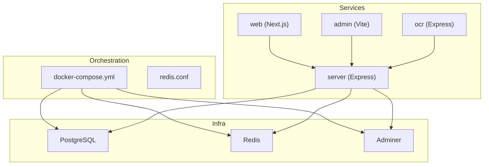
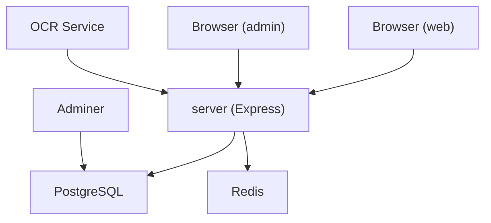
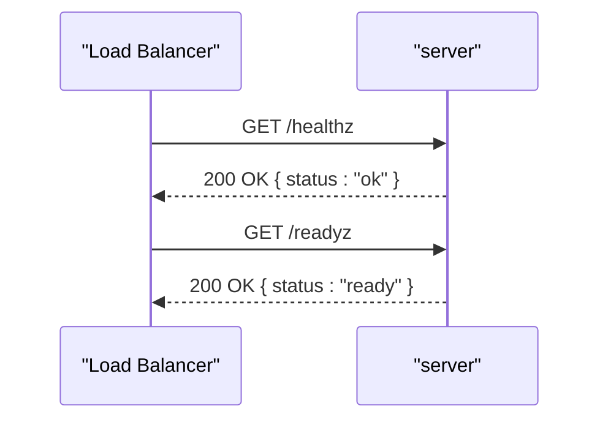
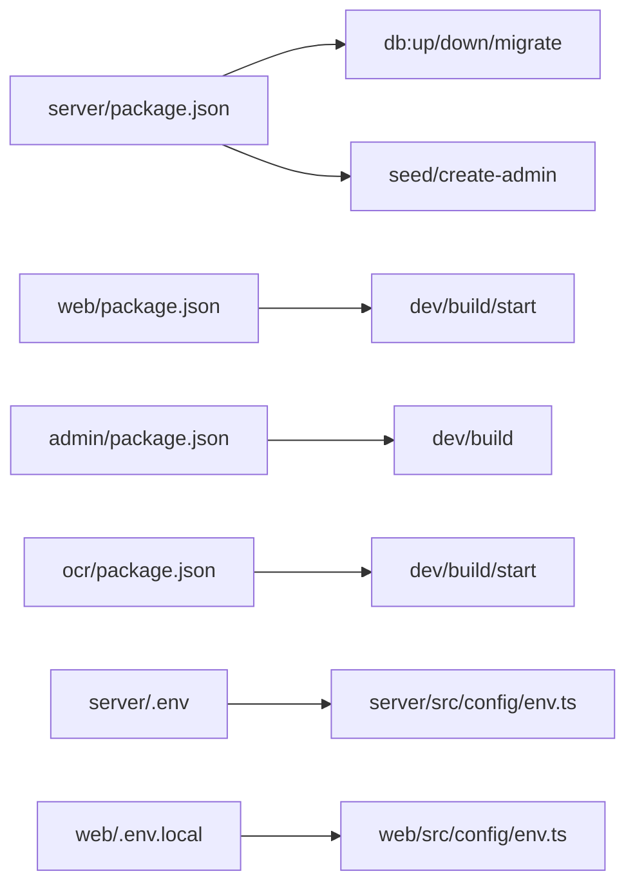

# Deployment & DevOps

<cite>
**Referenced Files in This Document**
- [ci.yml](file://.github/workflows/ci.yml)
- [docker-compose.yml](file://server/infra/docker-compose.yml)
- [redis.conf](file://server/infra/redis.conf)
- [server.env](file://server/.env)
- [admin.env](file://admin/.env)
- [web.env.local](file://web/.env.local)
- [ocr.env](file://ocr/.env)
- [server.package.json](file://server/package.json)
- [web.package.json](file://web/package.json)
- [admin.package.json](file://admin/package.json)
- [ocr.package.json](file://ocr/package.json)
- [server.env.ts](file://server/src/config/env.ts)
- [web.env.ts](file://web/src/config/env.ts)
- [health.routes.ts](file://server/src/routes/health.routes.ts)
- [server.app.ts](file://server/src/app.ts)
</cite>

## Table of Contents
1. [Introduction](#introduction)
2. [Project Structure](#project-structure)
3. [Core Components](#core-components)
4. [Architecture Overview](#architecture-overview)
5. [Detailed Component Analysis](#detailed-component-analysis)
6. [Dependency Analysis](#dependency-analysis)
7. [Performance Considerations](#performance-considerations)
8. [Troubleshooting Guide](#troubleshooting-guide)
9. [Conclusion](#conclusion)
10. [Appendices](#appendices)

## Introduction
This document provides comprehensive deployment and DevOps guidance for the Flick platform. It covers containerization with Docker, orchestration via docker-compose, environment configuration management, CI/CD with GitHub Actions, testing and deployment workflows, production topology, load balancing and scaling, monitoring and logging, health checks and alerting, database backup and recovery, SSL/TLS configuration, security hardening, environment-specific configurations, secrets management, infrastructure as code, and troubleshooting/maintenance procedures.

## Project Structure
The Flick platform is a monorepo with multiple packages:
- server: Express-based backend with PostgreSQL, Redis, and health endpoints
- web: Next.js frontend
- admin: Vite-based admin panel
- ocr: OCR microservice
- Shared libraries under shared/

Key deployment-relevant artifacts:
- Orchestration: docker-compose.yml and redis.conf
- Environment configs: .env files per package
- Scripts: package.json scripts for building, seeding, migrations, and local DB orchestration
- Health endpoints: /healthz and /readyz

**Diagram sources**
- [docker-compose.yml](file://server/infra/docker-compose.yml#L1-L49)
- [redis.conf](file://server/infra/redis.conf#L1-L2)
- [server.app.ts](file://server/src/app.ts#L1-L33)

**Section sources**
- [docker-compose.yml](file://server/infra/docker-compose.yml#L1-L49)
- [server.package.json](file://server/package.json#L7-L22)
- [web.package.json](file://web/package.json#L5-L12)
- [admin.package.json](file://admin/package.json#L6-L11)
- [ocr.package.json](file://ocr/package.json#L5-L9)

## Core Components
- Containerized runtime stack:
  - PostgreSQL 17 for relational data
  - Redis 7 Alpine for caching and sessions
  - Adminer for database administration
- Backend service:
  - Express server with health endpoints (/healthz, /readyz)
  - Environment validation via Zod
  - Socket.IO integration
- Frontends:
  - Next.js web app
  - Vite admin panel
- OCR microservice:
  - Standalone Express service for OCR tasks

**Section sources**
- [docker-compose.yml](file://server/infra/docker-compose.yml#L1-L49)
- [server.env.ts](file://server/src/config/env.ts#L1-L34)
- [health.routes.ts](file://server/src/routes/health.routes.ts#L1-L18)
- [server.app.ts](file://server/src/app.ts#L1-L33)

## Architecture Overview
The platform runs as a multi-service Docker Compose stack. The backend exposes REST APIs and WebSocket connections, while the frontends consume these APIs. The OCR service integrates with the backend for document processing. Redis and PostgreSQL are orchestrated as managed services.

**Diagram sources**
- [docker-compose.yml](file://server/infra/docker-compose.yml#L1-L49)
- [server.app.ts](file://server/src/app.ts#L1-L33)

## Detailed Component Analysis

### Docker Orchestration with docker-compose
- Services:
  - db: PostgreSQL 17 with persistent volumes and healthcheck
  - adminer: Database UI, depends on db health
  - redis: Redis 7 Alpine with AOF persistence and healthcheck
- Volumes:
  - postgres_data and redis-data for durability
- Ports:
  - db: 5432:5432
  - adminer: 8080:8080
  - redis: 6379:6379

Operational commands:
- Bring up: docker compose -f infra/docker-compose.yml up -d
- Tear down: docker compose -f infra/docker-compose.yml down

**Section sources**
- [docker-compose.yml](file://server/infra/docker-compose.yml#L1-L49)

### Environment Configuration Management
- server:
  - Validates and parses environment variables using Zod
  - Defines keys for database, cache, tokens, OAuth, mail, and admin credentials
- web:
  - Uses @t3-oss/env-nextjs for runtime validation of server and client variables
  - Exposes NEXT_PUBLIC_* variables for client consumption
- admin:
  - Vite variables for base URLs and API endpoints
- ocr:
  - Minimal environment for port and CORS origin

Best practices:
- Keep secrets out of images; mount via .env files or secrets management
- Use environment-specific .env files and avoid committing secrets
- Validate all environment variables at startup

**Section sources**
- [server.env.ts](file://server/src/config/env.ts#L1-L34)
- [web.env.ts](file://web/src/config/env.ts#L1-L29)
- [server.env](file://server/.env#L1-L50)
- [admin.env](file://admin/.env#L1-L3)
- [web.env.local](file://web/.env.local#L1-L8)
- [ocr.env](file://ocr/.env#L1-L4)

### CI/CD Pipeline with GitHub Actions
Current state:
- Workflow triggers on push events
- No jobs defined yet

Recommended additions:
- Build and test matrix for server, web, admin, and ocr
- Lint and typecheck steps
- Security scanning (SAST/DAST)
- Automated publishing to registries
- Deploy to staging/production environments

**Section sources**
- [.github/workflows/ci.yml](file://.github/workflows/ci.yml#L1-L4)

### Health Checks and Readiness
- Health endpoint: GET /healthz returns server status
- Readiness endpoint: GET /readyz indicates service readiness
- Docker healthchecks configured for db and redis

**Diagram sources**
- [health.routes.ts](file://server/src/routes/health.routes.ts#L1-L18)

**Section sources**
- [health.routes.ts](file://server/src/routes/health.routes.ts#L1-L18)
- [docker-compose.yml](file://server/infra/docker-compose.yml#L13-L17)

### Monitoring and Logging
- Request logging middleware registered in the server app
- Winston is a dependency; configure transports for production
- Add structured logs with correlation IDs
- Export metrics via Prometheus-compatible endpoints if needed

**Section sources**
- [server.app.ts](file://server/src/app.ts#L1-L33)
- [server.package.json](file://server/package.json#L54-L54)

### Load Balancing and Scaling
- Horizontal scaling:
  - Run multiple instances of the server behind a reverse proxy
  - Use sticky sessions if required, otherwise ensure stateless design
- Reverse proxy:
  - Nginx or Traefik to terminate TLS and route traffic
- Auto-scaling:
  - CPU/memory-based rules in Kubernetes or container orchestrators
- Redis:
  - Use Redis Sentinel or Upstash for HA and clustering in production

[No sources needed since this section provides general guidance]

### Database Backup and Recovery
- PostgreSQL:
  - Use pg_dump/pg_restore for logical backups
  - WAL archiving for point-in-time recovery
  - Regular snapshots of postgres_data volume
- Redis:
  - RDB snapshotting and AOF persistence enabled
  - Back up redis-data volume regularly
- DR:
  - Offsite replication and periodic restore drills

[No sources needed since this section provides general guidance]

### SSL/TLS Configuration
- Terminate TLS at the reverse proxy (Nginx/Traefik)
- Use ACME (Let’s Encrypt) automation
- Enforce HTTPS redirects in the server app
- Configure secure cookies with HttpOnly, SameSite, and Secure flags

[No sources needed since this section provides general guidance]

### Security Hardening
- Secrets management:
  - Use environment managers/secrets stores (e.g., Vault, AWS Secrets Manager)
  - Rotate secrets periodically
- Network:
  - Restrict inbound ports; firewall rules
  - Internal networks for services
- Application:
  - Helmet, CSP, HSTS, X-Content-Type-Options
  - Rate limiting and input validation
  - RBAC and audit logging

**Section sources**
- [server.env.ts](file://server/src/config/env.ts#L1-L34)

### Infrastructure as Code
- Compose as IaC:
  - Versioned docker-compose.yml and redis.conf
  - Use separate stacks for dev/stage/prod
- Terraform/Kubernetes:
  - Define clusters, ingress, secrets, and autoscaling policies
  - GitOps with ArgoCD or Flux

[No sources needed since this section provides general guidance]

## Dependency Analysis
- Package scripts orchestrate local development and DB lifecycle
- Frontends depend on server endpoints defined in environment files
- Server depends on database and cache services

**Diagram sources**
- [server.package.json](file://server/package.json#L7-L22)
- [web.package.json](file://web/package.json#L5-L12)
- [admin.package.json](file://admin/package.json#L6-L11)
- [ocr.package.json](file://ocr/package.json#L5-L9)
- [server.env.ts](file://server/src/config/env.ts#L1-L34)
- [web.env.ts](file://web/src/config/env.ts#L1-L29)

**Section sources**
- [server.package.json](file://server/package.json#L7-L22)
- [web.package.json](file://web/package.json#L5-L12)
- [admin.package.json](file://admin/package.json#L6-L11)
- [ocr.package.json](file://ocr/package.json#L5-L9)

## Performance Considerations
- Optimize database queries and indexes
- Enable connection pooling for PostgreSQL
- Tune Redis memory and eviction policies
- Use CDN for static assets
- Implement caching strategies at multiple layers
- Monitor latency and throughput; set SLOs

[No sources needed since this section provides general guidance]

## Troubleshooting Guide
Common issues and resolutions:
- Database not ready:
  - Verify healthcheck success and volume mounts
  - Check logs for startup errors
- Redis connectivity:
  - Confirm network reachability and password-less auth in local compose
  - Validate AOF/RDB persistence
- Frontend cannot connect to backend:
  - Validate SERVER_URI/NEXT_PUBLIC_* endpoints
  - Ensure CORS origins match
- Health/readiness failures:
  - Inspect /healthz and /readyz responses
  - Review server logs for unhandled errors

**Section sources**
- [docker-compose.yml](file://server/infra/docker-compose.yml#L13-L17)
- [health.routes.ts](file://server/src/routes/health.routes.ts#L1-L18)
- [server.env.ts](file://server/src/config/env.ts#L1-L34)
- [web.env.ts](file://web/src/config/env.ts#L1-L29)

## Conclusion
The Flick platform provides a solid foundation for containerized deployment using Docker Compose. By extending the CI/CD pipeline, implementing robust monitoring/logging, enforcing security hardening, and adopting production-grade scaling and backup strategies, the platform can achieve reliable, scalable, and maintainable operations.

## Appendices

### Environment Variables Reference
- server:
  - PORT, NODE_ENV, HTTP_SECURE_OPTION, ACCESS_CONTROL_ORIGINS, COOKIE_DOMAIN
  - DATABASE_URL, REDIS_URL, CACHE_DRIVER, CACHE_TTL
  - ACCESS_TOKEN_TTL, REFRESH_TOKEN_TTL, ACCESS_TOKEN_SECRET, REFRESH_TOKEN_SECRET
  - GOOGLE_OAUTH_CLIENT_ID, GOOGLE_OAUTH_CLIENT_SECRET
  - GMAIL_APP_USER, GMAIL_APP_PASS, MAILTRAP_TOKEN, MAIL_PROVIDER, MAIL_FROM
  - PERSPECTIVE_API_KEY, ADMIN_EMAIL, ADMIN_PASSWORD
  - EMAIL_ENCRYPTION_KEY, EMAIL_SECRET, HMAC_SECRET
- web:
  - NODE_ENV, SERVER_URI
  - NEXT_PUBLIC_SERVER_API_ENDPOINT, NEXT_PUBLIC_OCR_SERVER_API_ENDPOINT, NEXT_PUBLIC_BASE_URL, NEXT_PUBLIC_GOOGLE_OAUTH_ID
- admin:
  - VITE_SERVER_URI, VITE_SERVER_API_URL, VITE_BASE_URL
- ocr:
  - PORT, ENVIRONMENT, HTTP_SECURE_OPTION, ACCESS_CONTROL_ORIGIN

**Section sources**
- [server.env.ts](file://server/src/config/env.ts#L1-L34)
- [web.env.ts](file://web/src/config/env.ts#L1-L29)
- [server.env](file://server/.env#L1-L50)
- [web.env.local](file://web/.env.local#L1-L8)
- [admin.env](file://admin/.env#L1-L3)
- [ocr.env](file://ocr/.env#L1-L4)