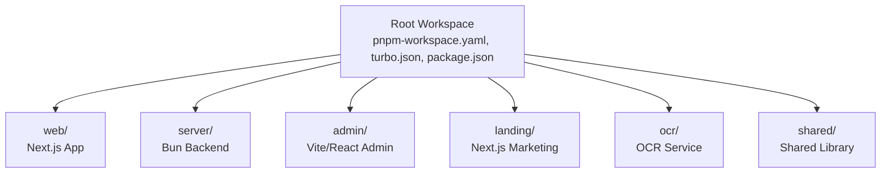
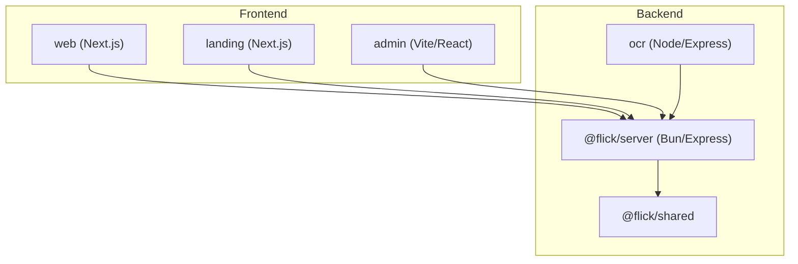
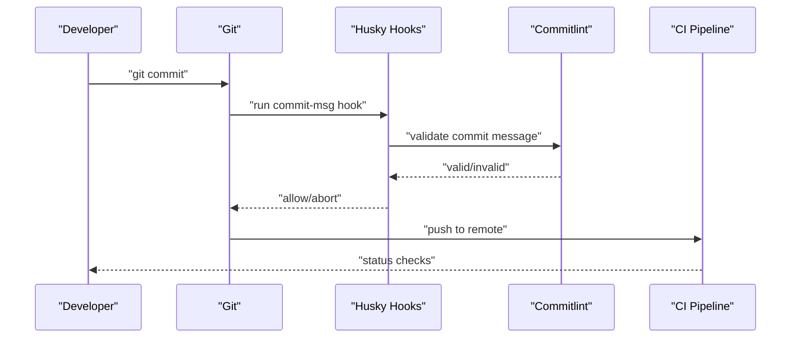
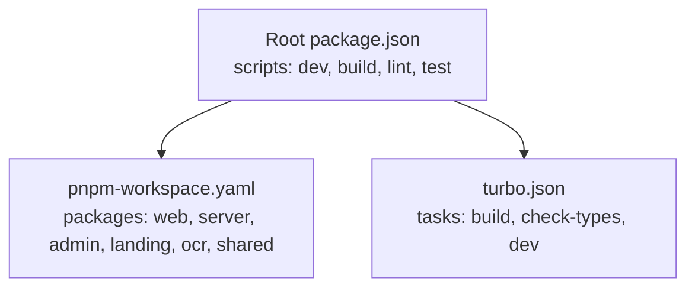

# Developer Guidelines

<cite>
**Referenced Files in This Document**
- [package.json](file://package.json)
- [pnpm-workspace.yaml](file://pnpm-workspace.yaml)
- [turbo.json](file://turbo.json)
- [tsconfig.json](file://tsconfig.json)
- [admin/package.json](file://admin/package.json)
- [admin/eslint.config.js](file://admin/eslint.config.js)
- [admin/tsconfig.app.json](file://admin/tsconfig.app.json)
- [admin/tsconfig.node.json](file://admin/tsconfig.node.json)
- [admin/tailwind.config.js](file://admin/tailwind.config.js)
- [web/package.json](file://web/package.json)
- [web/tsconfig.json](file://web/tsconfig.json)
- [web/postcss.config.mjs](file://web/postcss.config.mjs)
- [server/package.json](file://server/package.json)
- [server/tsconfig.json](file://server/tsconfig.json)
- [server/biome.json](file://server/biome.json)
- [.github/workflows/ci.yml](file://.github/workflows/ci.yml)
- [.husky/pre-commit](file://.husky/pre-commit)
- [.husky/commit-msg](file://.husky/commit-msg)
- [server/.commitlintrc.json](file://server/.commitlintrc.json)
</cite>

## Table of Contents
1. [Introduction](#introduction)
2. [Project Structure](#project-structure)
3. [Core Components](#core-components)
4. [Architecture Overview](#architecture-overview)
5. [Detailed Component Analysis](#detailed-component-analysis)
6. [Dependency Analysis](#dependency-analysis)
7. [Performance Considerations](#performance-considerations)
8. [Troubleshooting Guide](#troubleshooting-guide)
9. [Conclusion](#conclusion)
10. [Appendices](#appendices)

## Introduction
This document provides comprehensive developer guidelines for contributing to the Flick project. It covers code standards, development workflow, architecture, and operational practices across the monorepo. The project uses a pnpm workspace with Turborepo for orchestration, TypeScript for type safety, Biome for formatting and linting in the server, and ESLint for the admin application. Husky pre-commit hooks enforce commit message conventions and code quality checks.

## Project Structure
The repository is a monorepo organized into multiple packages:
- web: Next.js frontend application
- server: Bun-based Node.js backend service
- admin: Vite/React admin panel
- landing: Next.js marketing site
- ocr: OCR extraction service (Node/Express)
- shared: Shared library consumed by multiple packages
- Root: Workspace configuration and top-level scripts

**Diagram sources**
- [pnpm-workspace.yaml](file://pnpm-workspace.yaml#L1-L15)
- [turbo.json](file://turbo.json#L1-L23)
- [package.json](file://package.json#L1-L26)

Key conventions:
- Workspace packages are defined under pnpm-workspace.yaml.
- Turborepo tasks define build and caching behavior across packages.
- TypeScript configurations are per-package with strict settings and bundler/module resolution tailored to each app.

**Section sources**
- [pnpm-workspace.yaml](file://pnpm-workspace.yaml#L1-L15)
- [turbo.json](file://turbo.json#L1-L23)
- [tsconfig.json](file://tsconfig.json#L1-L14)

## Core Components
This section documents the primary development tools and standards used across the monorepo.

- TypeScript configuration
  - Strict compiler options enabled across packages for robust type checking.
  - Module resolution and JSX settings are adapted per framework (Next.js, Vite, Bun).
  - Path aliases configured for maintainable imports.

- ESLint rules (admin)
  - Recommended base rules extended with TypeScript-specific rules.
  - React Hooks plugin and react-refresh rules applied.
  - Export validation for react-refresh to prevent runtime errors.

- Formatting and linting
  - Server uses Biome for formatting and linting with vcs integration.
  - Admin uses ESLint with a centralized configuration file.
  - Web uses Biome via npm scripts for formatting and type checking.

- Pre-commit hooks and commit conventions
  - Husky hooks enforced via prepare script and package scripts.
  - Commit message linting configured with conventional commit rules.

**Section sources**
- [admin/eslint.config.js](file://admin/eslint.config.js#L1-L29)
- [admin/tsconfig.app.json](file://admin/tsconfig.app.json#L1-L34)
- [admin/tsconfig.node.json](file://admin/tsconfig.node.json#L1-L25)
- [web/tsconfig.json](file://web/tsconfig.json#L1-L35)
- [server/tsconfig.json](file://server/tsconfig.json#L1-L26)
- [server/biome.json](file://server/biome.json#L1-L37)
- [server/package.json](file://server/package.json#L13-L26)
- [server/.commitlintrc.json](file://server/.commitlintrc.json)

## Architecture Overview
The Flick architecture comprises:
- Frontend applications (web, landing) built with Next.js
- Admin panel built with Vite and React
- Backend service (server) powered by Bun with Express
- OCR service (ocr) for content extraction
- Shared library for cross-cutting concerns

**Diagram sources**
- [pnpm-workspace.yaml](file://pnpm-workspace.yaml#L1-L15)
- [web/package.json](file://web/package.json#L1-L59)
- [server/package.json](file://server/package.json#L1-L78)
- [admin/package.json](file://admin/package.json#L1-L76)
- [landing/package.json](file://landing/package.json#L1-L36)

## Detailed Component Analysis

### TypeScript Configuration
- Strictness and module resolution
  - Strict compiler options enabled to catch potential issues early.
  - Module resolution set to bundler for modern frameworks and Node for Bun-based server.
  - JSX settings aligned with React and Next.js expectations.

- Path aliases
  - Path mapping configured to simplify imports across packages.

- Type checking
  - Separate tsconfig files per app to tailor settings for Next.js, Vite, and Bun environments.

**Section sources**
- [admin/tsconfig.app.json](file://admin/tsconfig.app.json#L1-L34)
- [admin/tsconfig.node.json](file://admin/tsconfig.node.json#L1-L25)
- [web/tsconfig.json](file://web/tsconfig.json#L1-L35)
- [server/tsconfig.json](file://server/tsconfig.json#L1-L26)

### ESLint Rules (Admin)
- Base and TypeScript rules
  - Extends recommended base and TypeScript ESLint configs.
- Plugins
  - React Hooks and react-refresh plugins applied with recommended rules.
- Export validation
  - Enforces safe export patterns for react-refresh compatibility.

**Section sources**
- [admin/eslint.config.js](file://admin/eslint.config.js#L1-L29)

### Formatting and Linting (Server)
- Biome configuration
  - VCS integration enabled with default branch set to main.
  - Formatter settings specify tab indentation and double quotes.
  - Linter enabled with recommended rules.
  - Import organization assistance enabled.

- Scripts
  - Linting and formatting commands integrated into package scripts.
  - Pre-build hook runs lint/format and database migrations.

**Section sources**
- [server/biome.json](file://server/biome.json#L1-L37)
- [server/package.json](file://server/package.json#L13-L26)

### Formatting and Linting (Web)
- Biome usage
  - Biome CLI used for formatting and type checking.
  - Tailwind PostCSS plugin configured for styling pipeline.

**Section sources**
- [web/package.json](file://web/package.json#L1-L59)
- [web/postcss.config.mjs](file://web/postcss.config.mjs#L1-L8)

### Pre-commit Hooks and Commit Conventions
- Husky hooks
  - Pre-commit and commit-msg hooks managed via Husky.
  - Prepare script ensures Husky installation during setup.

- Commit message linting
  - Commitlint configured with conventional commits for standardized messages.

**Diagram sources**
- [.husky/commit-msg](file://.husky/commit-msg)
- [server/.commitlintrc.json](file://server/.commitlintrc.json)
- [.github/workflows/ci.yml](file://.github/workflows/ci.yml)

**Section sources**
- [server/package.json](file://server/package.json#L13-L13)
- [.husky/pre-commit](file://.husky/pre-commit)
- [.husky/commit-msg](file://.husky/commit-msg)
- [server/.commitlintrc.json](file://server/.commitlintrc.json)

### Development Workflow
- Branching strategy
  - Default branch is main as per Biome vcs configuration.
  - Use feature branches for work and rebase/squash before merging.

- Commit message conventions
  - Conventional commits enforced by commit-msg hook.
  - Ensure clear, scoped messages describing changes.

- Pull requests
  - Open PRs targeting main after successful local checks.
  - Include summary, rationale, and testing notes.

- Local development
  - Use root scripts to run dev servers for all packages in parallel.
  - Build and lint commands available per package.

**Section sources**
- [server/biome.json](file://server/biome.json#L3-L8)
- [server/.commitlintrc.json](file://server/.commitlintrc.json)
- [package.json](file://package.json#L7-L12)

### Adding New Features and Refactoring
- New feature guidelines
  - Add new modules under appropriate package directories.
  - Keep changes scoped and incremental.
  - Update TypeScript configs and lint rules if necessary.

- Refactoring guidelines
  - Maintain backward compatibility where possible.
  - Run formatter and linter before committing.
  - Add tests where applicable.

- Backward compatibility
  - Review breaking changes carefully.
  - Update changelog entries for significant changes.

[No sources needed since this section provides general guidance]

### Testing Requirements
- Unit/integration tests
  - Add tests alongside features in respective packages.
  - Use testing libraries appropriate to the framework (React/Vitest, Bun-based tests).

- Running tests
  - Use package-level test scripts to execute tests locally.

[No sources needed since this section provides general guidance]

### Documentation Standards
- Inline documentation
  - Document exported functions, components, and APIs with clear descriptions.
- README updates
  - Update package READMEs for new features or configuration changes.

[No sources needed since this section provides general guidance]

## Dependency Analysis
The monorepo relies on pnpm for workspace management and Turborepo for task orchestration. Each package defines its own dependencies and tooling.

**Diagram sources**
- [package.json](file://package.json#L7-L12)
- [pnpm-workspace.yaml](file://pnpm-workspace.yaml#L1-L15)
- [turbo.json](file://turbo.json#L1-L23)

**Section sources**
- [package.json](file://package.json#L1-L26)
- [pnpm-workspace.yaml](file://pnpm-workspace.yaml#L1-L15)
- [turbo.json](file://turbo.json#L1-L23)

## Performance Considerations
- Build caching
  - Turborepo caches build outputs; ensure dependsOn directives are accurate.
- Bundle size
  - Prefer tree-shaking and modular imports; avoid unnecessary dependencies.
- Runtime performance
  - Use efficient algorithms and minimize synchronous operations in server code.

[No sources needed since this section provides general guidance]

## Troubleshooting Guide
- Husky hooks not running
  - Ensure prepare script executes and Husky is installed.
  - Verify git hooks are not disabled globally.

- Commit message failures
  - Follow conventional commit patterns.
  - Check commit-msg hook configuration.

- Lint/format errors
  - Run package-specific lint/format commands.
  - Apply Biome formatting or ESLint fixes as appropriate.

- Database migration issues
  - Use provided db:migrate script and docker compose commands.
  - Confirm environment variables and connection settings.

**Section sources**
- [server/package.json](file://server/package.json#L13-L26)
- [.husky/commit-msg](file://.husky/commit-msg)
- [server/biome.json](file://server/biome.json#L1-L37)
- [server/tsconfig.json](file://server/tsconfig.json#L1-L26)

## Conclusion
These guidelines establish a consistent development experience across the Flick monorepo. By adhering to the TypeScript configurations, ESLint/Biome rules, pre-commit hooks, and workflow practices outlined here, contributors can deliver high-quality, maintainable code efficiently.

[No sources needed since this section summarizes without analyzing specific files]

## Appendices

### Appendix A: Local Development Setup
- Install dependencies
  - Use pnpm to install workspace dependencies.
- Start development
  - Run root dev command to start all packages in parallel.
  - Alternatively, use package-specific dev scripts.

**Section sources**
- [package.json](file://package.json#L7-L12)

### Appendix B: Code Quality Checks
- Server
  - Run lint-format before building.
  - Ensure database migrations succeed.

- Admin/Web
  - Run lint and typecheck scripts before committing.

**Section sources**
- [server/package.json](file://server/package.json#L13-L26)
- [admin/package.json](file://admin/package.json#L9-L9)
- [web/package.json](file://web/package.json#L9-L11)