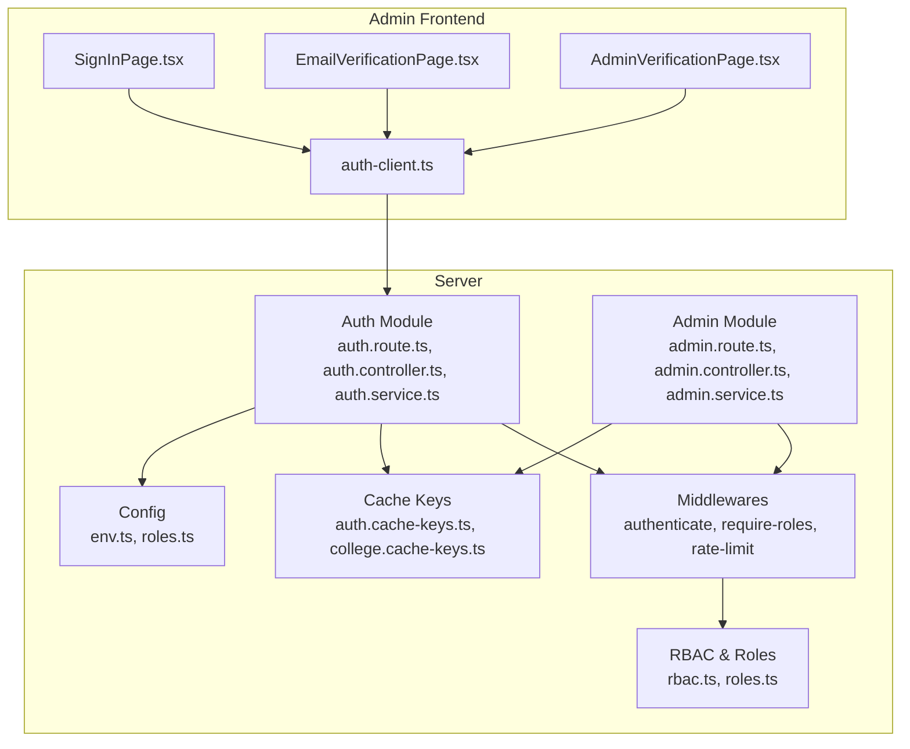
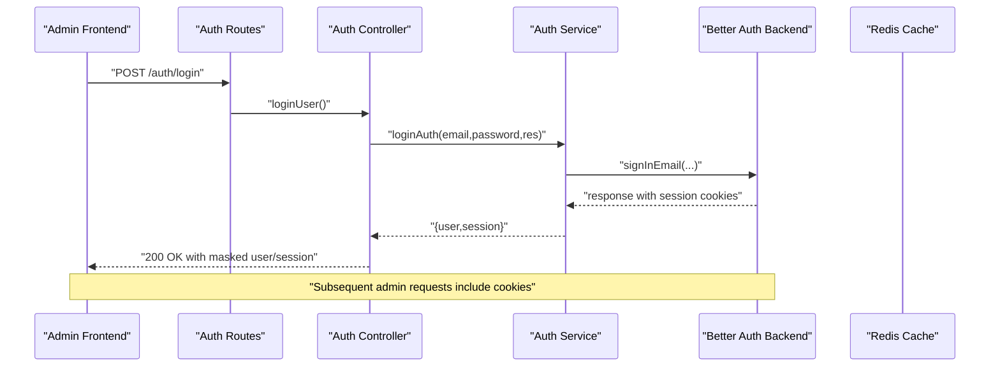
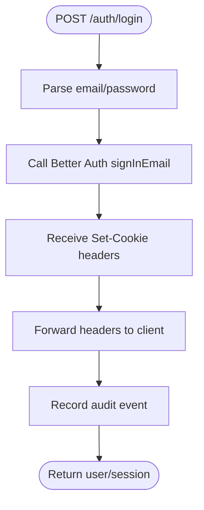
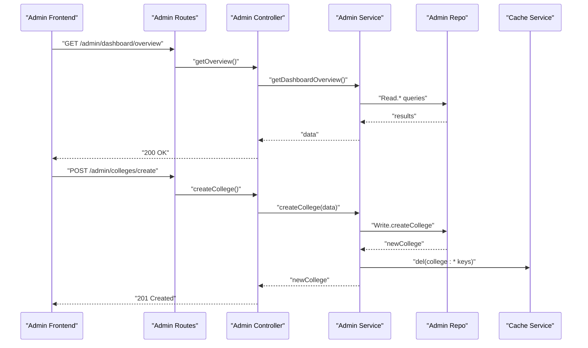
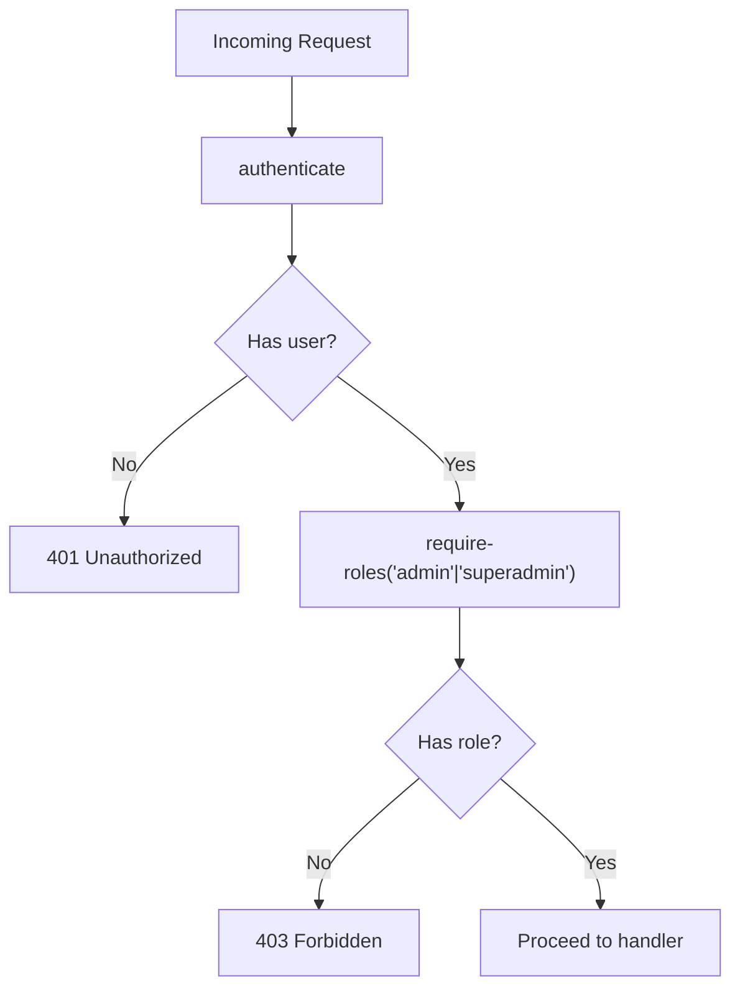
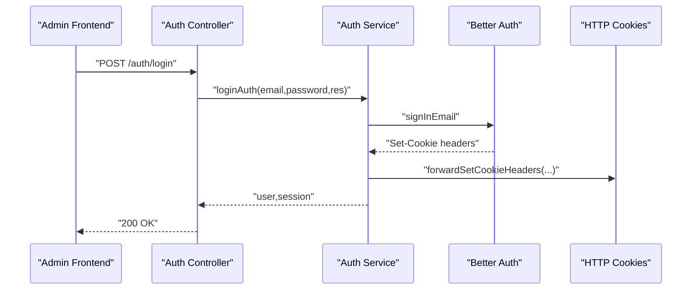
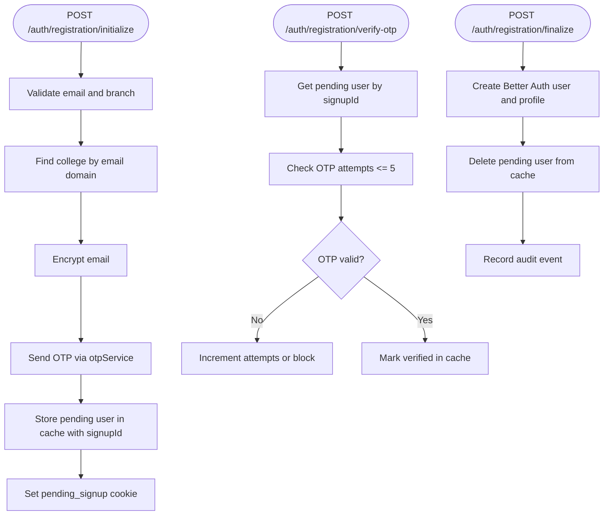
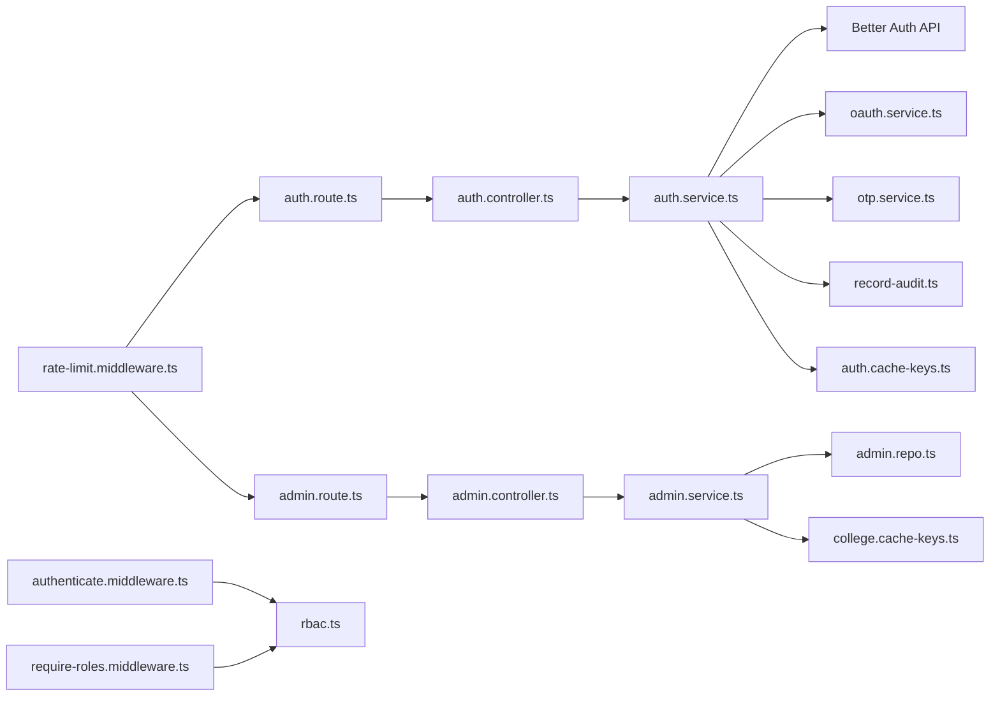

# Admin Authentication

<cite>
**Referenced Files in This Document**
- [admin.route.ts](file://server/src/modules/admin/admin.route.ts)
- [admin.controller.ts](file://server/src/modules/admin/admin.controller.ts)
- [admin.service.ts](file://server/src/modules/admin/admin.service.ts)
- [admin.repo.ts](file://server/src/modules/admin/admin.repo.ts)
- [auth.route.ts](file://server/src/modules/auth/auth.route.ts)
- [auth.controller.ts](file://server/src/modules/auth/auth.controller.ts)
- [auth.service.ts](file://server/src/modules/auth/auth.service.ts)
- [auth.schema.ts](file://server/src/modules/auth/auth.schema.ts)
- [auth.repo.ts](file://server/src/modules/auth/auth.repo.ts)
- [rbac.ts](file://server/src/core/security/rbac.ts)
- [roles.ts](file://server/src/config/roles.ts)
- [authenticate.middleware.ts](file://server/src/core/middlewares/auth/authenticate.middleware.ts)
- [require-roles.middleware.ts](file://server/src/core/middlewares/auth/require-roles.middleware.ts)
- [require-permission.middleware.ts](file://server/src/core/middlewares/auth/require-permission.middleware.ts)
- [rate-limit.middleware.ts](file://server/src/core/middlewares/rate-limit.middleware.ts)
- [auth.cache-keys.ts](file://server/src/modules/auth/auth.cache-keys.ts)
- [college.cache-keys.ts](file://server/src/modules/college/college.cache-keys.ts)
- [otp.service.ts](file://server/src/modules/auth/otp/otp.service.ts)
- [oauth.service.ts](file://server/src/modules/auth/oauth/oauth.service.ts)
- [env.ts](file://server/src/config/env.ts)
- [audit-identity.ts](file://server/src/lib/audit-identity.ts)
- [record-audit.ts](file://server/src/lib/record-audit.ts)
- [auth.client.ts](file://admin/src/lib/auth-client.ts)
- [SignInPage.tsx](file://admin/src/pages/SignInPage.tsx)
- [EmailVerificationPage.tsx](file://admin/src/pages/EmailVerificationPage.tsx)
- [AdminVerificationPage.tsx](file://admin/src/pages/AdminVerificationPage.tsx)
</cite>

## Table of Contents
1. [Introduction](#introduction)
2. [Project Structure](#project-structure)
3. [Core Components](#core-components)
4. [Architecture Overview](#architecture-overview)
5. [Detailed Component Analysis](#detailed-component-analysis)
6. [Dependency Analysis](#dependency-analysis)
7. [Performance Considerations](#performance-considerations)
8. [Troubleshooting Guide](#troubleshooting-guide)
9. [Conclusion](#conclusion)

## Introduction
This document describes the admin authentication and verification system across the server and admin frontend. It covers sign-in, credential validation, OTP/email verification, role-based access control, session/token lifecycle, rate limiting, and audit logging. It also documents integration with the Better Auth backend, shared user context, and cross-domain cookie handling.

## Project Structure
The admin authentication spans:
- Server-side modules for authentication and admin management
- Middleware for authentication guards and rate limiting
- RBAC configuration for roles and permissions
- Frontend admin pages for sign-in and verification flows

**Diagram sources**
- [auth.route.ts](file://server/src/modules/auth/auth.route.ts#L1-L30)
- [admin.route.ts](file://server/src/modules/admin/admin.route.ts#L1-L21)
- [authenticate.middleware.ts](file://server/src/core/middlewares/auth/authenticate.middleware.ts)
- [require-roles.middleware.ts](file://server/src/core/middlewares/auth/require-roles.middleware.ts)
- [rate-limit.middleware.ts](file://server/src/core/middlewares/rate-limit.middleware.ts)
- [rbac.ts](file://server/src/core/security/rbac.ts#L1-L15)
- [roles.ts](file://server/src/config/roles.ts#L1-L11)
- [auth.cache-keys.ts](file://server/src/modules/auth/auth.cache-keys.ts)
- [college.cache-keys.ts](file://server/src/modules/college/college.cache-keys.ts)
- [auth.client.ts](file://admin/src/lib/auth-client.ts)
- [SignInPage.tsx](file://admin/src/pages/SignInPage.tsx)
- [EmailVerificationPage.tsx](file://admin/src/pages/EmailVerificationPage.tsx)
- [AdminVerificationPage.tsx](file://admin/src/pages/AdminVerificationPage.tsx)

**Section sources**
- [auth.route.ts](file://server/src/modules/auth/auth.route.ts#L1-L30)
- [admin.route.ts](file://server/src/modules/admin/admin.route.ts#L1-L21)
- [roles.ts](file://server/src/config/roles.ts#L1-L11)

## Core Components
- Authentication module: handles sign-in, OTP/email verification, password reset, logout, and admin/user listing.
- Admin module: exposes admin-only endpoints protected by role guards.
- Middlewares: enforce authentication, role checks, and rate limits.
- RBAC: computes permissions from roles.
- Cache keys: invalidate frontend caches after admin college operations.
- Frontend admin pages: integrate with the auth client to drive sign-in and verification.

**Section sources**
- [auth.controller.ts](file://server/src/modules/auth/auth.controller.ts#L1-L171)
- [auth.service.ts](file://server/src/modules/auth/auth.service.ts#L1-L347)
- [admin.controller.ts](file://server/src/modules/admin/admin.controller.ts#L1-L72)
- [admin.service.ts](file://server/src/modules/admin/admin.service.ts#L1-L94)
- [rbac.ts](file://server/src/core/security/rbac.ts#L1-L15)
- [roles.ts](file://server/src/config/roles.ts#L1-L11)

## Architecture Overview
The system integrates the admin frontend with the server’s Better Auth backend via HTTP cookies and headers. Admin endpoints are protected by authentication and role middleware. OTP/email verification is handled during registration flows and password resets.

**Diagram sources**
- [auth.route.ts](file://server/src/modules/auth/auth.route.ts#L9-L10)
- [auth.controller.ts](file://server/src/modules/auth/auth.controller.ts#L8-L22)
- [auth.service.ts](file://server/src/modules/auth/auth.service.ts#L199-L217)
- [auth.client.ts](file://admin/src/lib/auth-client.ts)

## Detailed Component Analysis

### Authentication Module
- Sign-in: Validates credentials and delegates to Better Auth, forwarding set-cookie headers to the client.
- OTP/email verification: Supports sending and verifying OTPs for registration and general OTP verification.
- Password reset: Initiates reset and completes it using a token.
- Logout/logout-all: Uses Better Auth APIs to revoke sessions and records audit events.
- Admin/user listing: Returns paginated lists for admin dashboards.

**Diagram sources**
- [auth.controller.ts](file://server/src/modules/auth/auth.controller.ts#L8-L22)
- [auth.service.ts](file://server/src/modules/auth/auth.service.ts#L199-L217)
- [record-audit.ts](file://server/src/lib/record-audit.ts)

**Section sources**
- [auth.controller.ts](file://server/src/modules/auth/auth.controller.ts#L1-L171)
- [auth.service.ts](file://server/src/modules/auth/auth.service.ts#L199-L229)
- [auth.schema.ts](file://server/src/modules/auth/auth.schema.ts#L1-L78)

### Admin Module
- Admin-only routes: Dashboard overview, reports, logs, feedback, and college CRUD.
- Role guard: Requires admin/superadmin roles.
- Cache invalidation: Clears college cache entries after create/update.

**Diagram sources**
- [admin.route.ts](file://server/src/modules/admin/admin.route.ts#L11-L18)
- [admin.controller.ts](file://server/src/modules/admin/admin.controller.ts#L8-L68)
- [admin.service.ts](file://server/src/modules/admin/admin.service.ts#L51-L66)
- [admin.repo.ts](file://server/src/modules/admin/admin.repo.ts#L12-L15)
- [college.cache-keys.ts](file://server/src/modules/college/college.cache-keys.ts)

**Section sources**
- [admin.route.ts](file://server/src/modules/admin/admin.route.ts#L1-L21)
- [admin.controller.ts](file://server/src/modules/admin/admin.controller.ts#L1-L72)
- [admin.service.ts](file://server/src/modules/admin/admin.service.ts#L51-L90)

### Authentication Guards and RBAC
- Authentication middleware: Injects user context into requests.
- Role middleware: Enforces admin/superadmin for sensitive endpoints.
- Permission computation: Flattens role permissions; wildcard grants all.

**Diagram sources**
- [authenticate.middleware.ts](file://server/src/core/middlewares/auth/authenticate.middleware.ts)
- [require-roles.middleware.ts](file://server/src/core/middlewares/auth/require-roles.middleware.ts)
- [rbac.ts](file://server/src/core/security/rbac.ts#L4-L14)
- [roles.ts](file://server/src/config/roles.ts#L3-L7)

**Section sources**
- [auth.route.ts](file://server/src/modules/auth/auth.route.ts#L20-L27)
- [admin.route.ts](file://server/src/modules/admin/admin.route.ts#L8-L9)
- [rbac.ts](file://server/src/core/security/rbac.ts#L1-L15)
- [roles.ts](file://server/src/config/roles.ts#L1-L11)

### Session Management and Token Handling
- Login sets session cookies forwarded from Better Auth.
- Refresh endpoint currently validates presence of refresh token but does not issue new tokens in-code.
- Logout revokes current session; “logout all devices” revokes other sessions.
- Cross-domain cookies configured via environment variables.

**Diagram sources**
- [auth.controller.ts](file://server/src/modules/auth/auth.controller.ts#L8-L22)
- [auth.service.ts](file://server/src/modules/auth/auth.service.ts#L199-L217)
- [env.ts](file://server/src/config/env.ts)

**Section sources**
- [auth.controller.ts](file://server/src/modules/auth/auth.controller.ts#L30-L45)
- [auth.service.ts](file://server/src/modules/auth/auth.service.ts#L199-L229)
- [env.ts](file://server/src/config/env.ts)

### Verification Workflow: Email and OTP
- Registration initialization: Validates student email, finds college by domain, encrypts email, sends OTP, stores pending user in cache with a signup ID.
- OTP verification: Enforces retry limits; marks user verified upon success.
- Finalization: Creates Better Auth user and profile, forwards cookies, records audit.

**Diagram sources**
- [auth.service.ts](file://server/src/modules/auth/auth.service.ts#L32-L106)
- [auth.service.ts](file://server/src/modules/auth/auth.service.ts#L108-L151)
- [auth.service.ts](file://server/src/modules/auth/auth.service.ts#L153-L197)
- [otp.service.ts](file://server/src/modules/auth/otp/otp.service.ts)

**Section sources**
- [auth.controller.ts](file://server/src/modules/auth/auth.controller.ts#L104-L121)
- [auth.controller.ts](file://server/src/modules/auth/auth.controller.ts#L62-L78)
- [auth.service.ts](file://server/src/modules/auth/auth.service.ts#L32-L106)
- [auth.service.ts](file://server/src/modules/auth/auth.service.ts#L108-L151)
- [auth.service.ts](file://server/src/modules/auth/auth.service.ts#L153-L197)

### Admin Verification Page (Frontend)
- Drives OTP verification and redirects on success.
- Integrates with the auth client to call verification endpoints.

**Section sources**
- [AdminVerificationPage.tsx](file://admin/src/pages/AdminVerificationPage.tsx)
- [auth.client.ts](file://admin/src/lib/auth-client.ts)

### Email Verification Page (Frontend)
- Handles email verification flows for general OTP verification.

**Section sources**
- [EmailVerificationPage.tsx](file://admin/src/pages/EmailVerificationPage.tsx)
- [auth.client.ts](file://admin/src/lib/auth-client.ts)

### Rate Limiting and Security Measures
- Global rate limiter applied to auth endpoints.
- Admin endpoints apply API rate limiter.
- OTP attempts capped per signup session.
- Disposable email domains blocked during registration initialization.

**Section sources**
- [auth.route.ts](file://server/src/modules/auth/auth.route.ts#L7-L7)
- [admin.route.ts](file://server/src/modules/admin/admin.route.ts#L7-L8)
- [auth.service.ts](file://server/src/modules/auth/auth.service.ts#L113-L139)
- [auth.service.ts](file://server/src/modules/auth/auth.service.ts#L333-L339)

### Audit Logging and Identity
- Audit records are emitted for key actions (login, logout, account creation, password reset, session revocation).

**Section sources**
- [auth.service.ts](file://server/src/modules/auth/auth.service.ts#L210-L214)
- [auth.service.ts](file://server/src/modules/auth/auth.service.ts#L224-L228)
- [auth.service.ts](file://server/src/modules/auth/auth.service.ts#L188-L194)
- [auth.service.ts](file://server/src/modules/auth/auth.service.ts#L262-L266)
- [auth.service.ts](file://server/src/modules/auth/auth.service.ts#L293-L298)
- [record-audit.ts](file://server/src/lib/record-audit.ts)

## Dependency Analysis

**Diagram sources**
- [auth.route.ts](file://server/src/modules/auth/auth.route.ts#L1-L30)
- [auth.controller.ts](file://server/src/modules/auth/auth.controller.ts#L1-L171)
- [auth.service.ts](file://server/src/modules/auth/auth.service.ts#L1-L347)
- [admin.route.ts](file://server/src/modules/admin/admin.route.ts#L1-L21)
- [admin.controller.ts](file://server/src/modules/admin/admin.controller.ts#L1-L72)
- [admin.service.ts](file://server/src/modules/admin/admin.service.ts#L1-L94)
- [authenticate.middleware.ts](file://server/src/core/middlewares/auth/authenticate.middleware.ts)
- [require-roles.middleware.ts](file://server/src/core/middlewares/auth/require-roles.middleware.ts)
- [rate-limit.middleware.ts](file://server/src/core/middlewares/rate-limit.middleware.ts)
- [rbac.ts](file://server/src/core/security/rbac.ts#L1-L15)
- [auth.cache-keys.ts](file://server/src/modules/auth/auth.cache-keys.ts)
- [college.cache-keys.ts](file://server/src/modules/college/college.cache-keys.ts)

**Section sources**
- [auth.route.ts](file://server/src/modules/auth/auth.route.ts#L1-L30)
- [admin.route.ts](file://server/src/modules/admin/admin.route.ts#L1-L21)
- [rbac.ts](file://server/src/core/security/rbac.ts#L1-L15)

## Performance Considerations
- Prefer caching for user lookups and admin queries using cached repo wrappers.
- Keep OTP attempts short-lived to avoid stale cache entries.
- Use pagination for admin reports, logs, and feedback endpoints to bound payload sizes.
- Minimize cookie size and avoid unnecessary headers in responses.

[No sources needed since this section provides general guidance]

## Troubleshooting Guide
Common issues and resolutions:
- Invalid or expired OTP: Too many attempts trigger blocking; resend OTP and retry.
- Missing pending signup cookie: Re-initiate registration to obtain a new signup session.
- Insufficient permissions: Ensure the user has admin or superadmin role.
- Rate limit exceeded: Wait for the limiter to reset or adjust client-side retry logic.
- Session not persisted: Confirm cookie domain and SameSite/Secure flags align with deployment.

**Section sources**
- [auth.service.ts](file://server/src/modules/auth/auth.service.ts#L113-L139)
- [auth.route.ts](file://server/src/modules/auth/auth.route.ts#L7-L7)
- [admin.route.ts](file://server/src/modules/admin/admin.route.ts#L8-L9)

## Conclusion
The admin authentication system combines Better Auth for session management with role-based access control and robust verification flows. Admin endpoints are secured via authentication and role middleware, while OTP/email verification ensures trusted enrollment. Cache invalidation and audit logging support operational reliability and compliance.