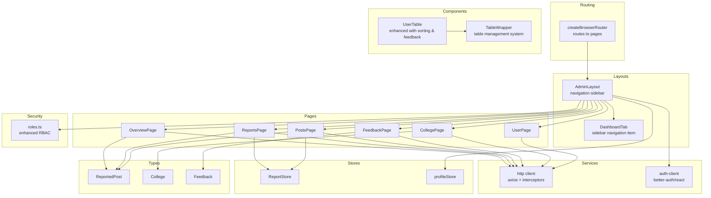
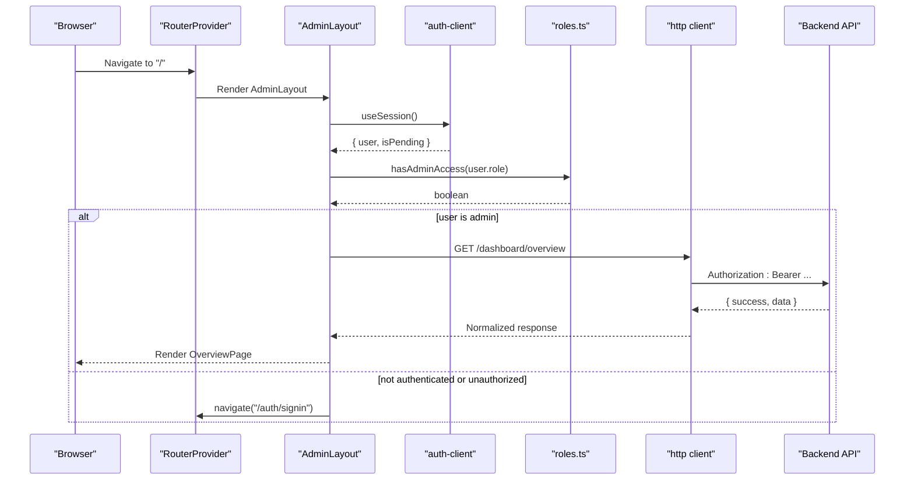
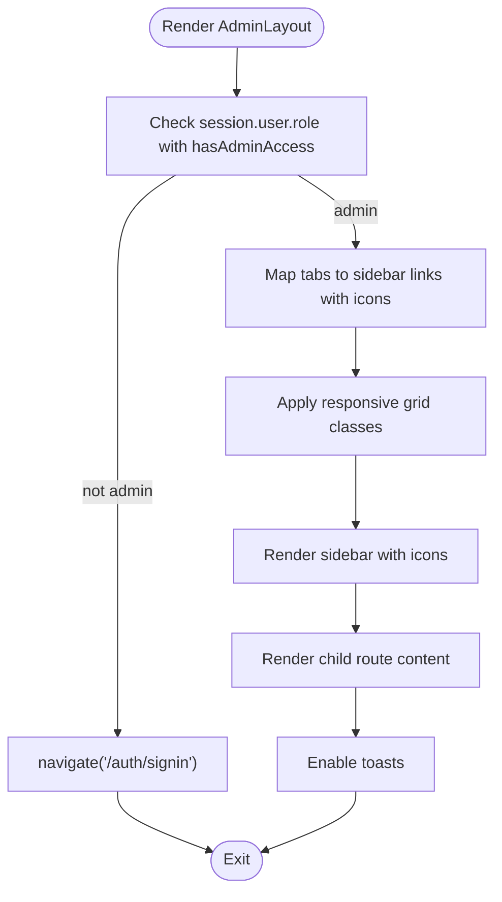
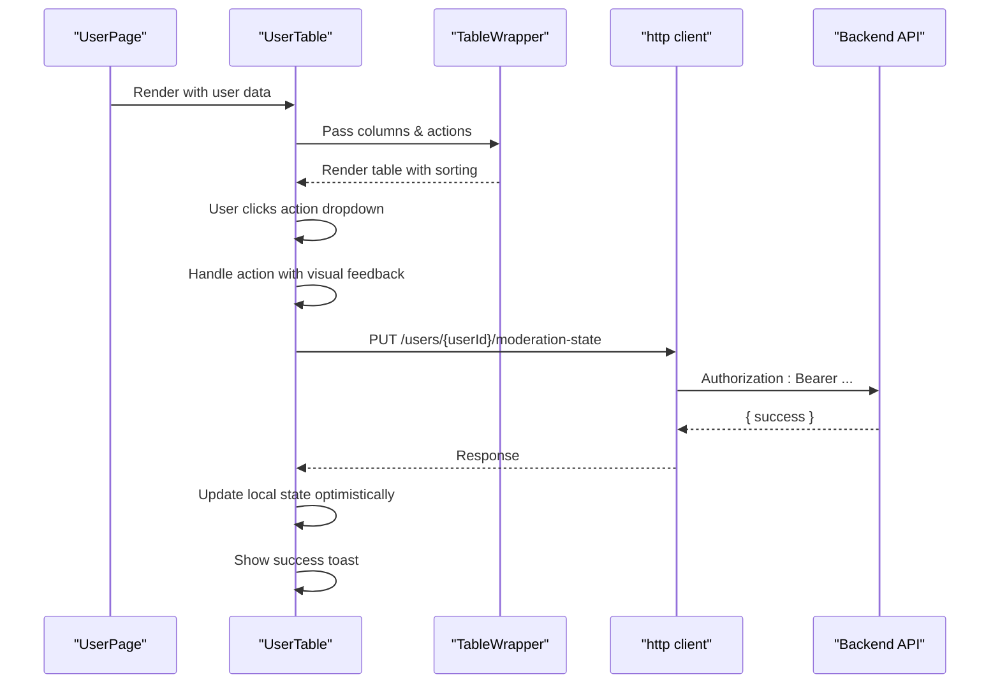
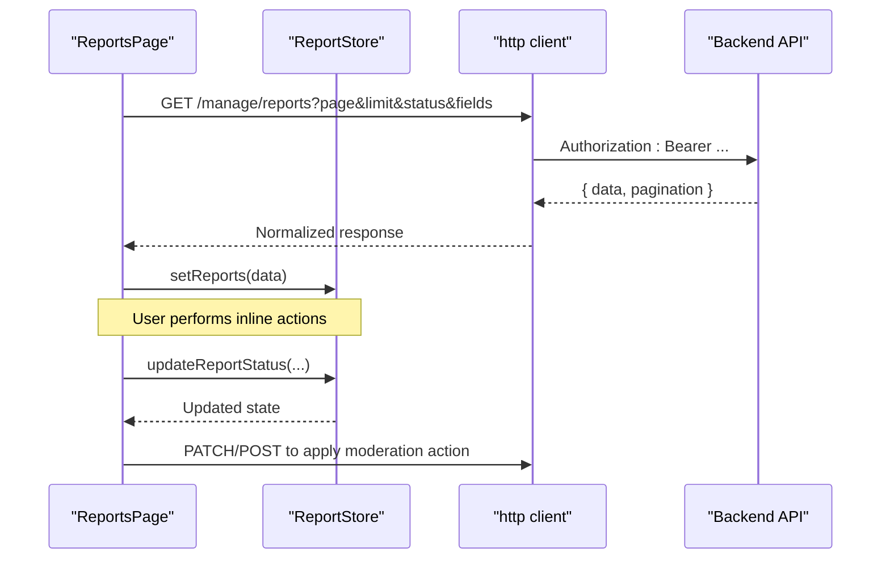
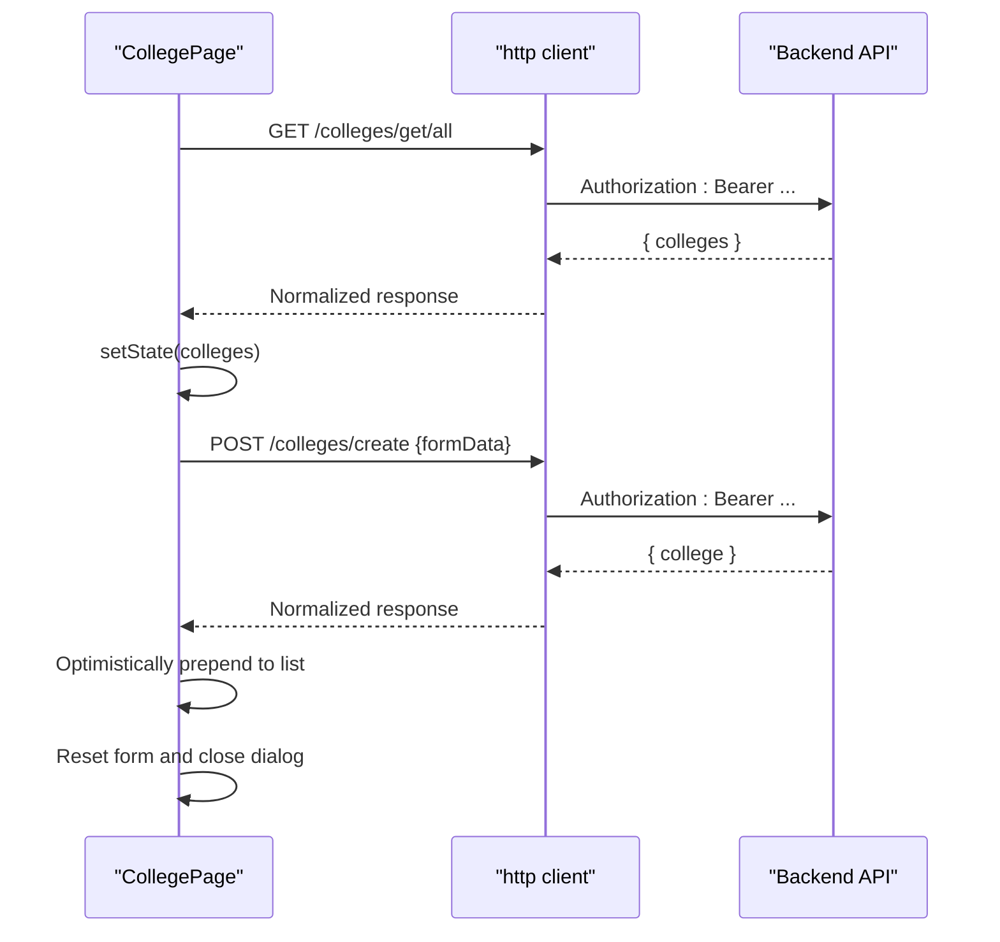
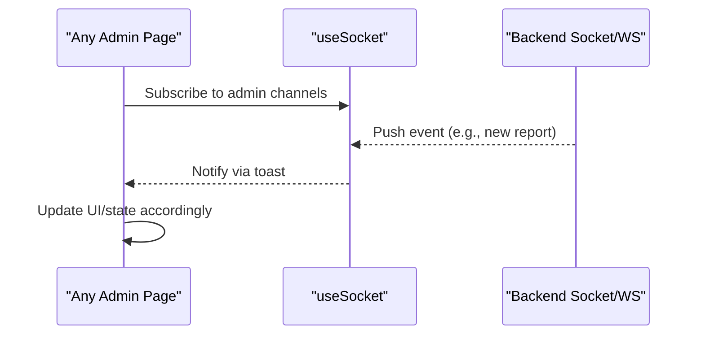
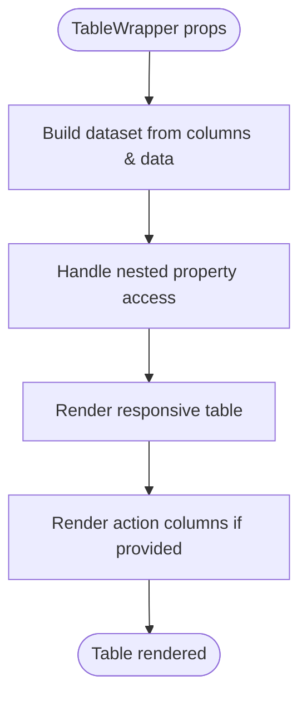
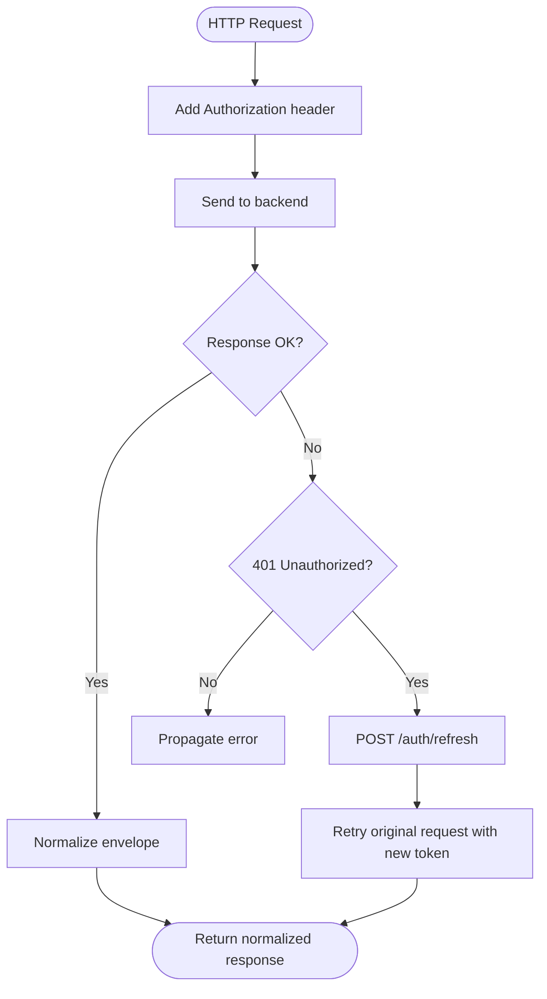
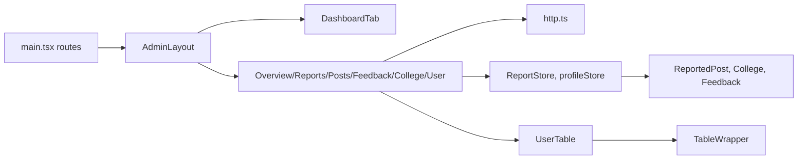

# Admin Dashboard

<cite>
**Referenced Files in This Document**
- [main.tsx](file://admin/src/main.tsx)
- [AdminLayout.tsx](file://admin/src/layouts/AdminLayout.tsx)
- [DashboardTab.tsx](file://admin/src/components/general/DashboardTab.tsx)
- [tabs.tsx](file://admin/src/constants/tabs.tsx)
- [roles.ts](file://admin/src/lib/roles.ts)
- [OverviewPage.tsx](file://admin/src/pages/OverviewPage.tsx)
- [PostsPage.tsx](file://admin/src/pages/PostsPage.tsx)
- [ReportsPage.tsx](file://admin/src/pages/ReportsPage.tsx)
- [FeedbackPage.tsx](file://admin/src/pages/FeedbackPage.tsx)
- [CollegePage.tsx](file://admin/src/pages/CollegePage.tsx)
- [UserPage.tsx](file://admin/src/pages/UserPage.tsx)
- [UserTable.tsx](file://admin/src/components/general/UserTable.tsx)
- [TableWrapper.tsx](file://admin/src/components/general/TableWrapper.tsx)
- [http.ts](file://admin/src/services/http.ts)
- [auth-client.ts](file://admin/src/lib/auth-client.ts)
- [ReportStore.ts](file://admin/src/store/ReportStore.ts)
- [profileStore.ts](file://admin/src/store/profileStore.ts)
- [ReportedPost.ts](file://admin/src/types/ReportedPost.ts)
- [College.ts](file://admin/src/types/College.ts)
- [Feedback.ts](file://admin/src/types/Feedback.ts)
- [TimelineChart.tsx](file://admin/src/components/charts/TimelineChart.tsx)
</cite>

## Update Summary
**Changes Made**
- Updated Admin Layout section to reflect redesigned navigation with sidebar icons and improved responsive design
- Enhanced User Management section to document the enhanced UserTable component with better sorting and visual feedback
- Added new DashboardTab component documentation for the improved sidebar navigation
- Updated role-based access control documentation with enhanced security measures
- Added TableWrapper component documentation for the new table management system

## Table of Contents
1. [Introduction](#introduction)
2. [Project Structure](#project-structure)
3. [Core Components](#core-components)
4. [Architecture Overview](#architecture-overview)
5. [Detailed Component Analysis](#detailed-component-analysis)
6. [Dependency Analysis](#dependency-analysis)
7. [Performance Considerations](#performance-considerations)
8. [Troubleshooting Guide](#troubleshooting-guide)
9. [Conclusion](#conclusion)
10. [Appendices](#appendices)

## Introduction
This document describes the React-based admin dashboard used for content moderation and platform administration. It covers the admin layout and navigation, role-based access control, content moderation workflows (post review and user reporting), analytics and reporting dashboards, user management, college management, real-time notifications, data visualization, table management with pagination, and backend integration patterns. The goal is to provide a clear understanding of the system's structure, data flows, and operational procedures for both technical and non-technical stakeholders.

## Project Structure
The admin application is organized around a routing-driven layout with dedicated pages for dashboards, moderation, user management, analytics, and administrative tasks. The UI leverages a custom component library and shared UI primitives. State management is handled via Zustand stores, while HTTP requests are standardized through a centralized service with interceptors for authentication and response normalization.

**Diagram sources**
- [main.tsx](file://admin/src/main.tsx#L19-L84)
- [AdminLayout.tsx](file://admin/src/layouts/AdminLayout.tsx#L9-L45)
- [DashboardTab.tsx](file://admin/src/components/general/DashboardTab.tsx#L1-L28)
- [UserTable.tsx](file://admin/src/components/general/UserTable.tsx#L41-L323)
- [TableWrapper.tsx](file://admin/src/components/general/TableWrapper.tsx#L35-L101)
- [roles.ts](file://admin/src/lib/roles.ts#L1-L7)

**Section sources**
- [main.tsx](file://admin/src/main.tsx#L1-L90)
- [AdminLayout.tsx](file://admin/src/layouts/AdminLayout.tsx#L1-L76)
- [DashboardTab.tsx](file://admin/src/components/general/DashboardTab.tsx#L1-L28)
- [tabs.tsx](file://admin/src/constants/tabs.tsx#L1-L42)

## Core Components
- AdminLayout: Provides the main layout with a responsive grid, sidebar navigation with icons, protected routing, and global toast notifications.
- DashboardTab: Enhanced sidebar navigation component with icon support and active state styling.
- UserTable: Improved user management table with enhanced sorting capabilities, visual feedback, and action dropdowns.
- TableWrapper: Generic table management component with column definition support and nested property access.
- Pages: Dedicated views for overview, reports, posts, feedback, logs, colleges, and settings.
- Services: Centralized HTTP client with request/response interceptors for authentication and envelope normalization.
- Stores: Zustand stores for report state and admin profile state.
- Types: Strongly typed models for moderation targets, colleges, and feedback.

**Section sources**
- [AdminLayout.tsx](file://admin/src/layouts/AdminLayout.tsx#L9-L45)
- [DashboardTab.tsx](file://admin/src/components/general/DashboardTab.tsx#L1-L28)
- [UserTable.tsx](file://admin/src/components/general/UserTable.tsx#L41-L323)
- [TableWrapper.tsx](file://admin/src/components/general/TableWrapper.tsx#L35-L101)
- [OverviewPage.tsx](file://admin/src/pages/OverviewPage.tsx#L12-L79)
- [ReportsPage.tsx](file://admin/src/pages/ReportsPage.tsx#L20-L95)
- [PostsPage.tsx](file://admin/src/pages/PostsPage.tsx#L11-L75)
- [FeedbackPage.tsx](file://admin/src/pages/FeedbackPage.tsx#L7-L36)
- [CollegePage.tsx](file://admin/src/pages/CollegePage.tsx#L11-L159)
- [UserPage.tsx](file://admin/src/pages/UserPage.tsx#L22-L235)
- [http.ts](file://admin/src/services/http.ts#L5-L132)
- [ReportStore.ts](file://admin/src/store/ReportStore.ts#L11-L40)
- [profileStore.ts](file://admin/src/store/profileStore.ts#L12-L35)
- [ReportedPost.ts](file://admin/src/types/ReportedPost.ts#L1-L28)
- [College.ts](file://admin/src/types/College.ts#L1-L9)
- [Feedback.ts](file://admin/src/types/Feedback.ts#L1-L13)

## Architecture Overview
The admin app enforces role-based access control at the layout level, redirecting unauthenticated users to the sign-in route. Authentication state is managed by a client SDK, and the HTTP client injects bearer tokens and normalizes responses. Moderation data is fetched from backend endpoints and rendered in paginated tables or cards. Stores manage report updates and admin profile state.

**Diagram sources**
- [main.tsx](file://admin/src/main.tsx#L19-L84)
- [AdminLayout.tsx](file://admin/src/layouts/AdminLayout.tsx#L15-L35)
- [auth-client.ts](file://admin/src/lib/auth-client.ts#L4-L11)
- [roles.ts](file://admin/src/lib/roles.ts#L3-L6)
- [http.ts](file://admin/src/services/http.ts#L10-L19)
- [OverviewPage.tsx](file://admin/src/pages/OverviewPage.tsx#L16-L29)

## Detailed Component Analysis

### Admin Layout and Navigation
- **Redesigned Sidebar Navigation**: The AdminLayout now features a complete redesign with improved navigation, better responsive design, and sidebar navigation with icons.
- **Enhanced Responsive Design**: The layout uses a 12-column grid system with responsive breakpoints (md: col-span-3, lg: col-span-2) for optimal desktop and mobile experiences.
- **Icon Integration**: Each navigation item includes a React Icons component for visual clarity and improved user experience.
- **Role-Based Access Control**: Enhanced security with improved role checking and unauthorized access handling.
- **Global Toast Notifications**: Enabled for user feedback and system notifications.

**Diagram sources**
- [AdminLayout.tsx](file://admin/src/layouts/AdminLayout.tsx#L9-L45)
- [DashboardTab.tsx](file://admin/src/components/general/DashboardTab.tsx#L12-L25)
- [tabs.tsx](file://admin/src/constants/tabs.tsx#L6-L42)
- [roles.ts](file://admin/src/lib/roles.ts#L3-L6)

**Section sources**
- [AdminLayout.tsx](file://admin/src/layouts/AdminLayout.tsx#L9-L76)
- [DashboardTab.tsx](file://admin/src/components/general/DashboardTab.tsx#L1-L28)
- [tabs.tsx](file://admin/src/constants/tabs.tsx#L1-L42)
- [roles.ts](file://admin/src/lib/roles.ts#L1-L7)

### DashboardTab Component
The DashboardTab component provides enhanced sidebar navigation items with:
- **Active State Styling**: Visual indication of current page with inset shadows and active background
- **Hover Effects**: Smooth transitions and color changes for better user interaction
- **Icon Integration**: Consistent icon sizing and positioning within navigation items
- **Responsive Design**: Proper spacing and alignment across different screen sizes

**Section sources**
- [DashboardTab.tsx](file://admin/src/components/general/DashboardTab.tsx#L1-L28)

### Enhanced User Management Interface
The UserTable component has been significantly enhanced with:
- **Improved Sorting Capabilities**: Better column sorting and visual feedback mechanisms
- **Enhanced Visual Feedback**: Active state indicators, hover effects, and loading states
- **Action Dropdowns**: Contextual action menus with proper disabled states
- **Suspension Management**: Comprehensive suspension handling with dialog-based inputs
- **Profile Preview**: Hover card functionality for user profile images

**Diagram sources**
- [UserPage.tsx](file://admin/src/pages/UserPage.tsx#L216-L217)
- [UserTable.tsx](file://admin/src/components/general/UserTable.tsx#L41-L116)
- [TableWrapper.tsx](file://admin/src/components/general/TableWrapper.tsx#L35-L101)

**Section sources**
- [UserPage.tsx](file://admin/src/pages/UserPage.tsx#L22-L235)
- [UserTable.tsx](file://admin/src/components/general/UserTable.tsx#L41-L323)
- [TableWrapper.tsx](file://admin/src/components/general/TableWrapper.tsx#L35-L101)

### Content Moderation: Post Review and Reporting
- Two pages support moderation:
  - PostsPage: Fetches paginated reported posts and renders them in a card-based list with refresh and pagination.
  - ReportsPage: Similar pagination and rendering, but integrates a report store for optimistic updates.
- Store logic supports updating report status and individual report entries.

**Diagram sources**
- [ReportsPage.tsx](file://admin/src/pages/ReportsPage.tsx#L29-L66)
- [ReportStore.ts](file://admin/src/store/ReportStore.ts#L14-L39)
- [http.ts](file://admin/src/services/http.ts#L56-L109)

**Section sources**
- [PostsPage.tsx](file://admin/src/pages/PostsPage.tsx#L11-L75)
- [ReportsPage.tsx](file://admin/src/pages/ReportsPage.tsx#L20-L95)
- [ReportStore.ts](file://admin/src/store/ReportStore.ts#L1-L43)
- [ReportedPost.ts](file://admin/src/types/ReportedPost.ts#L1-L28)

### Analytics Dashboard and Reporting
- OverviewPage fetches platform metrics (users, posts, comments) and displays them in cards.
- TimelineChart demonstrates a reusable visualization component for time-series-like data.

**Diagram sources**
- [OverviewPage.tsx](file://admin/src/pages/OverviewPage.tsx#L16-L29)
- [http.ts](file://admin/src/services/http.ts#L111-L132)

**Section sources**
- [OverviewPage.tsx](file://admin/src/pages/OverviewPage.tsx#L12-L79)
- [TimelineChart.tsx](file://admin/src/components/charts/TimelineChart.tsx#L10-L44)

### College Management System
- CollegePage lists existing colleges and provides a modal form to create new ones.
- Form fields include name, email domain, city, and state.
- Data persistence is handled via HTTP POST to the backend endpoint, with optimistic UI updates and error handling.

**Diagram sources**
- [CollegePage.tsx](file://admin/src/pages/CollegePage.tsx#L25-L69)
- [http.ts](file://admin/src/services/http.ts#L5-L8)

**Section sources**
- [CollegePage.tsx](file://admin/src/pages/CollegePage.tsx#L11-L159)
- [College.ts](file://admin/src/types/College.ts#L1-L9)

### Real-Time Reporting and Notifications
- The admin app integrates with a WebSocket-based notification system (socket context and hook) to surface real-time events for admin activities.
- Toast notifications are used for asynchronous feedback on moderation actions and data operations.

**Diagram sources**
- [http.ts](file://admin/src/services/http.ts#L5-L8)
- [FeedbackPage.tsx](file://admin/src/pages/FeedbackPage.tsx#L1-L37)

**Section sources**
- [FeedbackPage.tsx](file://admin/src/pages/FeedbackPage.tsx#L1-L37)

### Data Visualization and Table Management
- TimelineChart renders a horizontal stacked bar chart for time-based expression durations.
- TableWrapper renders a responsive table with column definitions, nested property access, and action columns.
- Enhanced UserTable provides sorting capabilities and visual feedback for user management operations.

**Diagram sources**
- [TableWrapper.tsx](file://admin/src/components/general/TableWrapper.tsx#L35-L101)
- [UserTable.tsx](file://admin/src/components/general/UserTable.tsx#L146-L214)

**Section sources**
- [TimelineChart.tsx](file://admin/src/components/charts/TimelineChart.tsx#L1-L47)
- [TableWrapper.tsx](file://admin/src/components/general/TableWrapper.tsx#L1-L101)
- [UserTable.tsx](file://admin/src/components/general/UserTable.tsx#L146-L214)

### Backend Integration and Error Handling
- The HTTP client:
  - Injects Authorization headers using a token getter.
  - Handles 401 responses by refreshing the token and retrying queued requests.
  - Normalizes backend envelopes into a unified response shape for downstream consumers.
- Pages wrap network calls with try/catch, set loading states, and display user-facing errors via toasts.

**Diagram sources**
- [http.ts](file://admin/src/services/http.ts#L10-L109)

**Section sources**
- [http.ts](file://admin/src/services/http.ts#L1-L133)
- [OverviewPage.tsx](file://admin/src/pages/OverviewPage.tsx#L16-L29)
- [ReportsPage.tsx](file://admin/src/pages/ReportsPage.tsx#L47-L66)
- [PostsPage.tsx](file://admin/src/pages/PostsPage.tsx#L20-L37)
- [FeedbackPage.tsx](file://admin/src/pages/FeedbackPage.tsx#L11-L22)
- [CollegePage.tsx](file://admin/src/pages/CollegePage.tsx#L25-L39)

## Dependency Analysis
- Routing depends on AdminLayout and page components.
- Pages depend on the HTTP client and, optionally, stores.
- Stores encapsulate report and profile state, reducing prop drilling.
- Types define the contract for backend payloads, ensuring consistency across components.
- Enhanced UserTable relies on TableWrapper for table management functionality.

**Diagram sources**
- [main.tsx](file://admin/src/main.tsx#L19-L84)
- [AdminLayout.tsx](file://admin/src/layouts/AdminLayout.tsx#L9-L45)
- [DashboardTab.tsx](file://admin/src/components/general/DashboardTab.tsx#L1-L28)
- [UserTable.tsx](file://admin/src/components/general/UserTable.tsx#L41-L323)
- [TableWrapper.tsx](file://admin/src/components/general/TableWrapper.tsx#L35-L101)
- [http.ts](file://admin/src/services/http.ts#L5-L132)
- [ReportStore.ts](file://admin/src/store/ReportStore.ts#L1-L43)
- [profileStore.ts](file://admin/src/store/profileStore.ts#L1-L39)
- [ReportedPost.ts](file://admin/src/types/ReportedPost.ts#L1-L28)
- [College.ts](file://admin/src/types/College.ts#L1-L9)
- [Feedback.ts](file://admin/src/types/Feedback.ts#L1-L13)

**Section sources**
- [main.tsx](file://admin/src/main.tsx#L1-L90)
- [AdminLayout.tsx](file://admin/src/layouts/AdminLayout.tsx#L1-L76)
- [DashboardTab.tsx](file://admin/src/components/general/DashboardTab.tsx#L1-L28)
- [UserTable.tsx](file://admin/src/components/general/UserTable.tsx#L41-L323)
- [TableWrapper.tsx](file://admin/src/components/general/TableWrapper.tsx#L35-L101)

## Performance Considerations
- Prefer memoization for derived values (e.g., status arrays) to avoid unnecessary re-renders.
- Use optimistic updates with rollback on failure for moderation actions to improve perceived responsiveness.
- Paginate heavy lists to reduce DOM and memory footprint.
- Debounce or batch frequent network requests where appropriate.
- **Updated**: The enhanced UserTable component includes active state tracking to prevent concurrent actions on the same user.
- **Updated**: Responsive grid system reduces layout thrashing on smaller screens.

## Troubleshooting Guide
- Authentication failures:
  - Verify token getter is configured and accessible to the HTTP client.
  - Confirm refresh endpoint availability and that interceptors are attached.
- Network errors:
  - Inspect normalized responses for backend-provided messages and error arrays.
  - Use toasts to surface actionable messages to admins.
- State synchronization:
  - Ensure store updates are scoped to the correct report identifiers to prevent accidental overwrites.
- **Updated**: User action conflicts:
  - The enhanced UserTable tracks active actions per user to prevent concurrent modifications.
  - Check the activeAction state to debug action conflicts.
- **Updated**: Navigation issues:
  - Verify that tab icons are properly imported from react-icons.
  - Ensure responsive grid classes are applied correctly across breakpoints.

**Section sources**
- [http.ts](file://admin/src/services/http.ts#L21-L54)
- [http.ts](file://admin/src/services/http.ts#L56-L109)
- [ReportStore.ts](file://admin/src/store/ReportStore.ts#L14-L39)
- [UserTable.tsx](file://admin/src/components/general/UserTable.tsx#L46-L116)
- [AdminLayout.tsx](file://admin/src/layouts/AdminLayout.tsx#L17-L35)

## Conclusion
The admin dashboard provides a robust, modular foundation for content moderation and platform administration. Its redesigned layout and navigation feature improved responsive design, sidebar navigation with icons, and enhanced role-based access control. The enhanced UserTable component delivers better sorting capabilities and visual feedback for user management operations. The HTTP client and stores streamline backend integration and state management, while the table management system provides scalable solutions for data presentation.

## Appendices
- Role-based access control is enforced at the layout level; ensure all routes requiring admin privileges are nested under the admin layout.
- Maintain type definitions alongside backend schemas to minimize runtime mismatches.
- Extend the toast system for granular feedback on bulk operations and long-running tasks.
- **Updated**: The enhanced UserTable component supports nested property access for complex data structures.
- **Updated**: DashboardTab component provides consistent styling and active state management for navigation items.