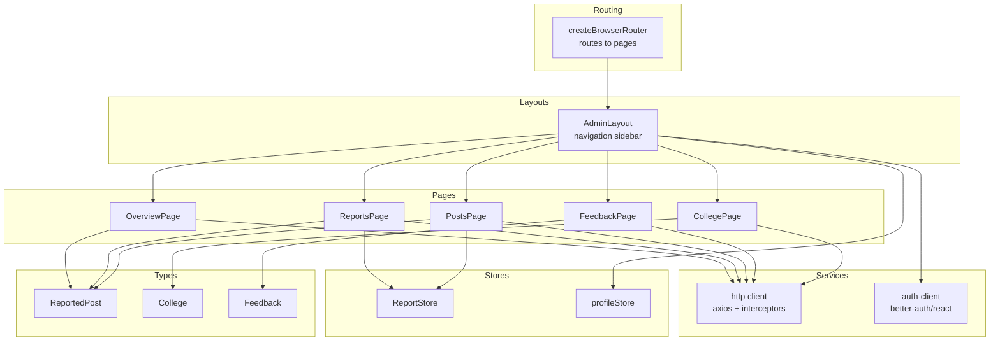
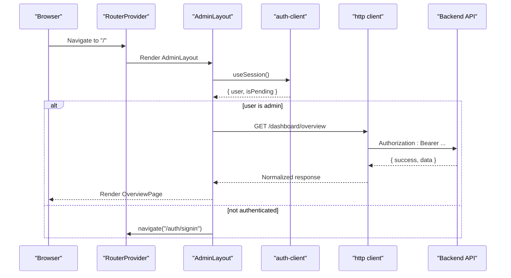
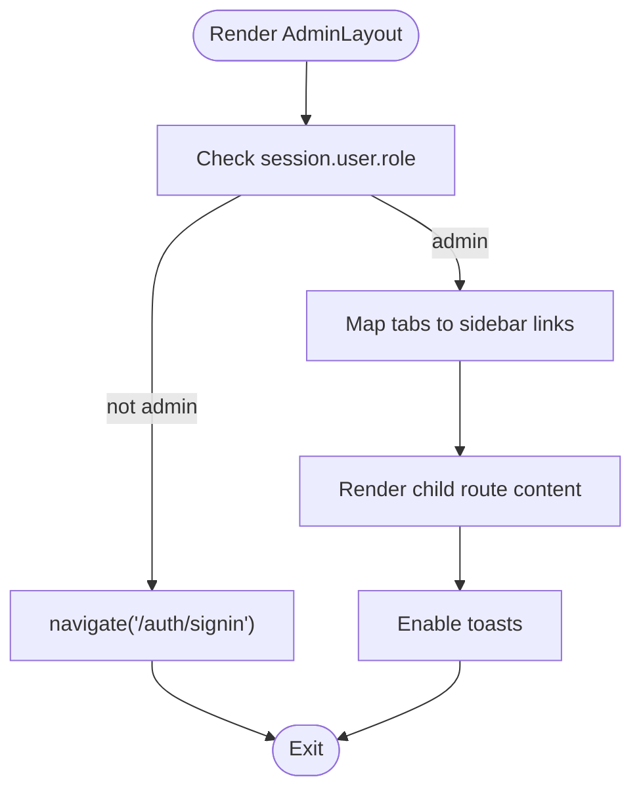
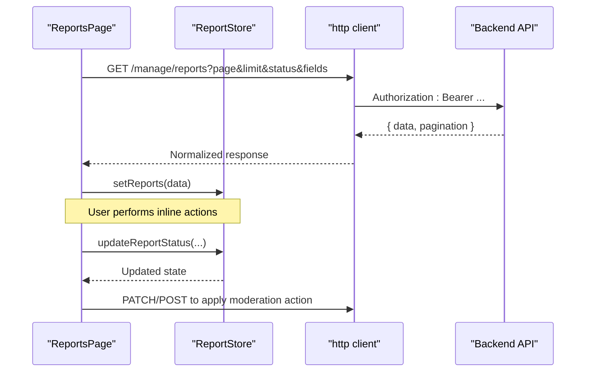
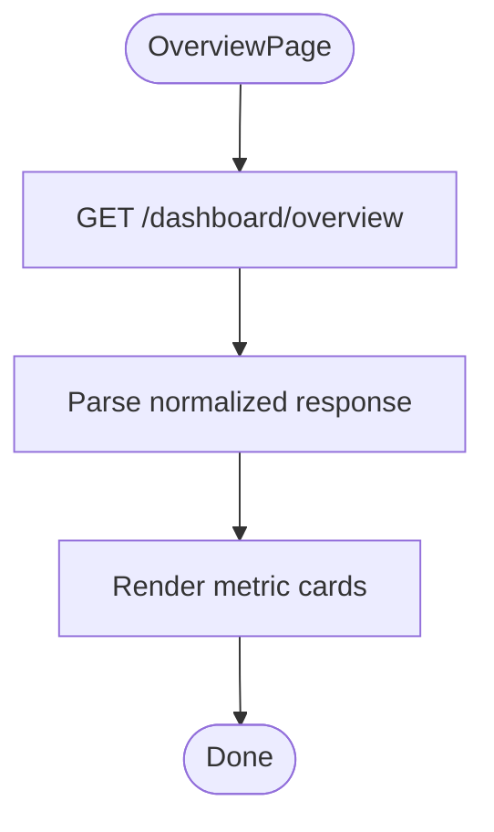
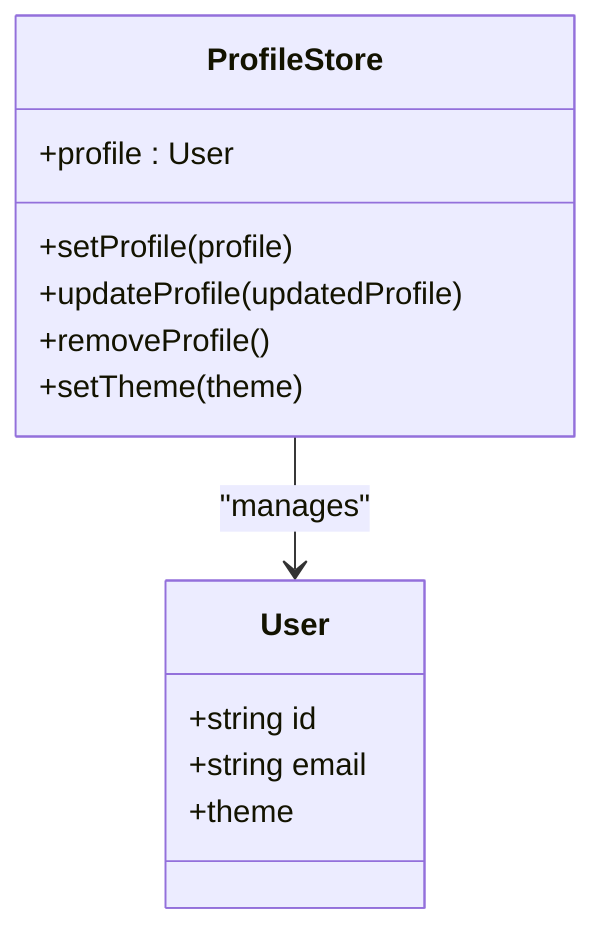
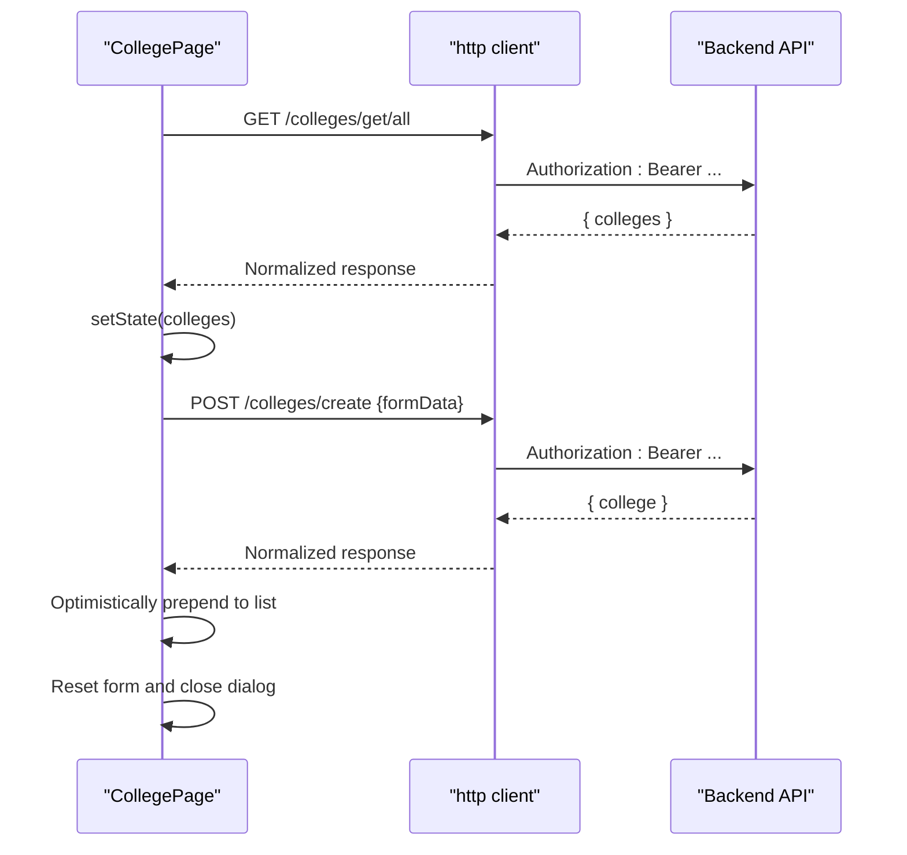
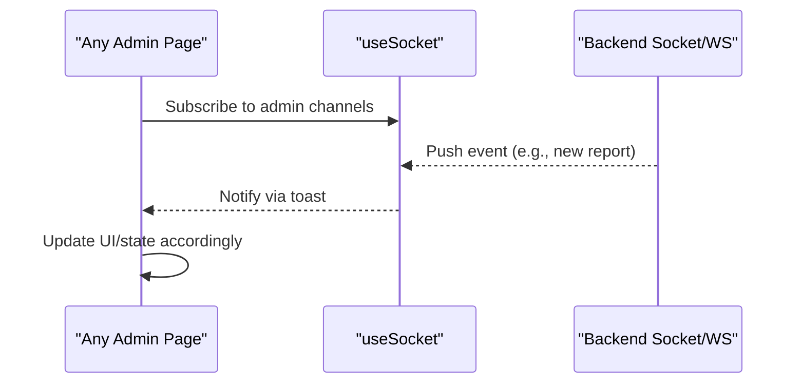
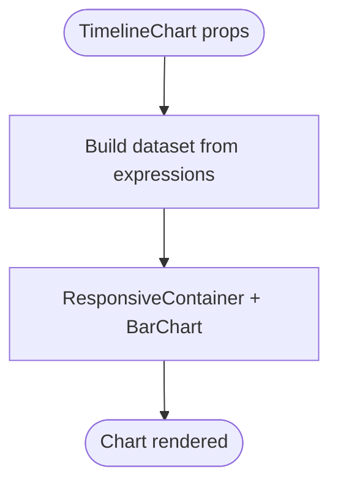
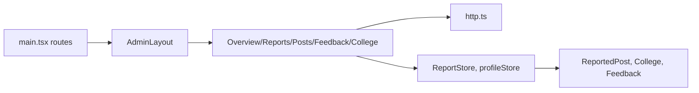

# Admin Dashboard

<cite>
**Referenced Files in This Document**
- [main.tsx](file://admin/src/main.tsx)
- [AdminLayout.tsx](file://admin/src/layouts/AdminLayout.tsx)
- [tabs.tsx](file://admin/src/constants/tabs.tsx)
- [OverviewPage.tsx](file://admin/src/pages/OverviewPage.tsx)
- [PostsPage.tsx](file://admin/src/pages/PostsPage.tsx)
- [ReportsPage.tsx](file://admin/src/pages/ReportsPage.tsx)
- [FeedbackPage.tsx](file://admin/src/pages/FeedbackPage.tsx)
- [CollegePage.tsx](file://admin/src/pages/CollegePage.tsx)
- [http.ts](file://admin/src/services/http.ts)
- [auth-client.ts](file://admin/src/lib/auth-client.ts)
- [ReportStore.ts](file://admin/src/store/ReportStore.ts)
- [profileStore.ts](file://admin/src/store/profileStore.ts)
- [ReportedPost.ts](file://admin/src/types/ReportedPost.ts)
- [College.ts](file://admin/src/types/College.ts)
- [Feedback.ts](file://admin/src/types/Feedback.ts)
- [TimelineChart.tsx](file://admin/src/components/charts/TimelineChart.tsx)
</cite>

## Table of Contents
1. [Introduction](#introduction)
2. [Project Structure](#project-structure)
3. [Core Components](#core-components)
4. [Architecture Overview](#architecture-overview)
5. [Detailed Component Analysis](#detailed-component-analysis)
6. [Dependency Analysis](#dependency-analysis)
7. [Performance Considerations](#performance-considerations)
8. [Troubleshooting Guide](#troubleshooting-guide)
9. [Conclusion](#conclusion)
10. [Appendices](#appendices)

## Introduction
This document describes the React-based admin dashboard used for content moderation and platform administration. It covers the admin layout and navigation, role-based access control, content moderation workflows (post review and user reporting), analytics and reporting dashboards, user management, college management, real-time notifications, data visualization, table management with pagination, and backend integration patterns. The goal is to provide a clear understanding of the system’s structure, data flows, and operational procedures for both technical and non-technical stakeholders.

## Project Structure
The admin application is organized around a routing-driven layout with dedicated pages for dashboards, moderation, user management, analytics, and administrative tasks. The UI leverages a custom component library and shared UI primitives. State management is handled via Zustand stores, while HTTP requests are standardized through a centralized service with interceptors for authentication and response normalization.

**Diagram sources**
- [main.tsx](file://admin/src/main.tsx#L19-L84)
- [AdminLayout.tsx](file://admin/src/layouts/AdminLayout.tsx#L9-L45)
- [OverviewPage.tsx](file://admin/src/pages/OverviewPage.tsx#L12-L79)
- [ReportsPage.tsx](file://admin/src/pages/ReportsPage.tsx#L20-L95)
- [PostsPage.tsx](file://admin/src/pages/PostsPage.tsx#L11-L75)
- [FeedbackPage.tsx](file://admin/src/pages/FeedbackPage.tsx#L7-L36)
- [CollegePage.tsx](file://admin/src/pages/CollegePage.tsx#L11-L159)
- [http.ts](file://admin/src/services/http.ts#L5-L132)
- [auth-client.ts](file://admin/src/lib/auth-client.ts#L4-L11)
- [ReportStore.ts](file://admin/src/store/ReportStore.ts#L11-L40)
- [profileStore.ts](file://admin/src/store/profileStore.ts#L12-L35)
- [ReportedPost.ts](file://admin/src/types/ReportedPost.ts#L1-L28)
- [College.ts](file://admin/src/types/College.ts#L1-L9)
- [Feedback.ts](file://admin/src/types/Feedback.ts#L1-L13)

**Section sources**
- [main.tsx](file://admin/src/main.tsx#L1-L90)
- [AdminLayout.tsx](file://admin/src/layouts/AdminLayout.tsx#L1-L47)
- [tabs.tsx](file://admin/src/constants/tabs.tsx#L1-L42)

## Core Components
- AdminLayout: Provides the main layout with a responsive grid, sidebar navigation, protected routing, and global toast notifications.
- Pages: Dedicated views for overview, reports, posts, feedback, logs, colleges, and settings.
- Services: Centralized HTTP client with request/response interceptors for authentication and envelope normalization.
- Stores: Zustand stores for report state and admin profile state.
- Types: Strongly typed models for moderation targets, colleges, and feedback.

**Section sources**
- [AdminLayout.tsx](file://admin/src/layouts/AdminLayout.tsx#L9-L45)
- [OverviewPage.tsx](file://admin/src/pages/OverviewPage.tsx#L12-L79)
- [ReportsPage.tsx](file://admin/src/pages/ReportsPage.tsx#L20-L95)
- [PostsPage.tsx](file://admin/src/pages/PostsPage.tsx#L11-L75)
- [FeedbackPage.tsx](file://admin/src/pages/FeedbackPage.tsx#L7-L36)
- [CollegePage.tsx](file://admin/src/pages/CollegePage.tsx#L11-L159)
- [http.ts](file://admin/src/services/http.ts#L5-L132)
- [ReportStore.ts](file://admin/src/store/ReportStore.ts#L11-L40)
- [profileStore.ts](file://admin/src/store/profileStore.ts#L12-L35)
- [ReportedPost.ts](file://admin/src/types/ReportedPost.ts#L1-L28)
- [College.ts](file://admin/src/types/College.ts#L1-L9)
- [Feedback.ts](file://admin/src/types/Feedback.ts#L1-L13)

## Architecture Overview
The admin app enforces role-based access control at the layout level, redirecting unauthenticated users to the sign-in route. Authentication state is managed by a client SDK, and the HTTP client injects bearer tokens and normalizes responses. Moderation data is fetched from backend endpoints and rendered in paginated tables or cards. Stores manage report updates and admin profile state.

**Diagram sources**
- [main.tsx](file://admin/src/main.tsx#L19-L84)
- [AdminLayout.tsx](file://admin/src/layouts/AdminLayout.tsx#L15-L29)
- [auth-client.ts](file://admin/src/lib/auth-client.ts#L4-L11)
- [http.ts](file://admin/src/services/http.ts#L10-L19)
- [OverviewPage.tsx](file://admin/src/pages/OverviewPage.tsx#L16-L29)

## Detailed Component Analysis

### Admin Layout and Navigation
- Sidebar navigation is defined centrally and rendered inside the layout.
- Role gating ensures only admin users can access the layout; otherwise, the app redirects to the sign-in page.
- Global toasts are enabled for user feedback.

**Diagram sources**
- [AdminLayout.tsx](file://admin/src/layouts/AdminLayout.tsx#L9-L45)
- [tabs.tsx](file://admin/src/constants/tabs.tsx#L6-L42)

**Section sources**
- [AdminLayout.tsx](file://admin/src/layouts/AdminLayout.tsx#L9-L45)
- [tabs.tsx](file://admin/src/constants/tabs.tsx#L1-L42)

### Content Moderation: Post Review and Reporting
- Two pages support moderation:
  - PostsPage: Fetches paginated reported posts and renders them in a card-based list with refresh and pagination.
  - ReportsPage: Similar pagination and rendering, but integrates a report store for optimistic updates.
- Store logic supports updating report status and individual report entries.

**Diagram sources**
- [ReportsPage.tsx](file://admin/src/pages/ReportsPage.tsx#L29-L66)
- [ReportStore.ts](file://admin/src/store/ReportStore.ts#L14-L39)
- [http.ts](file://admin/src/services/http.ts#L56-L109)

**Section sources**
- [PostsPage.tsx](file://admin/src/pages/PostsPage.tsx#L11-L75)
- [ReportsPage.tsx](file://admin/src/pages/ReportsPage.tsx#L20-L95)
- [ReportStore.ts](file://admin/src/store/ReportStore.ts#L1-L43)
- [ReportedPost.ts](file://admin/src/types/ReportedPost.ts#L1-L28)

### Analytics Dashboard and Reporting
- OverviewPage fetches platform metrics (users, posts, comments) and displays them in cards.
- TimelineChart demonstrates a reusable visualization component for time-series-like data.

**Diagram sources**
- [OverviewPage.tsx](file://admin/src/pages/OverviewPage.tsx#L16-L29)
- [http.ts](file://admin/src/services/http.ts#L111-L132)

**Section sources**
- [OverviewPage.tsx](file://admin/src/pages/OverviewPage.tsx#L12-L79)
- [TimelineChart.tsx](file://admin/src/components/charts/TimelineChart.tsx#L10-L44)

### User Management Interface
- User-related navigation is exposed via the sidebar; the actual user verification and profile management UIs are integrated into the layout and routed under the users path.
- The profile store maintains admin profile state and theme preferences.

**Diagram sources**
- [profileStore.ts](file://admin/src/store/profileStore.ts#L12-L35)

**Section sources**
- [AdminLayout.tsx](file://admin/src/layouts/AdminLayout.tsx#L1-L47)
- [profileStore.ts](file://admin/src/store/profileStore.ts#L1-L39)

### College Management System
- CollegePage lists existing colleges and provides a modal form to create new ones.
- Form fields include name, email domain, city, and state.
- Data persistence is handled via HTTP POST to the backend endpoint, with optimistic UI updates and error handling.

**Diagram sources**
- [CollegePage.tsx](file://admin/src/pages/CollegePage.tsx#L25-L69)
- [http.ts](file://admin/src/services/http.ts#L5-L8)

**Section sources**
- [CollegePage.tsx](file://admin/src/pages/CollegePage.tsx#L11-L159)
- [College.ts](file://admin/src/types/College.ts#L1-L9)

### Real-Time Reporting and Notifications
- The admin app integrates with a WebSocket-based notification system (socket context and hook) to surface real-time events for admin activities.
- Toast notifications are used for asynchronous feedback on moderation actions and data operations.

**Diagram sources**
- [http.ts](file://admin/src/services/http.ts#L5-L8)
- [FeedbackPage.tsx](file://admin/src/pages/FeedbackPage.tsx#L1-L37)

**Section sources**
- [FeedbackPage.tsx](file://admin/src/pages/FeedbackPage.tsx#L1-L37)

### Data Visualization and Table Management
- TimelineChart renders a horizontal stacked bar chart for time-based expression durations.
- Table management patterns are evident in pages that render paginated lists and support bulk-like operations (e.g., updating report status).

**Diagram sources**
- [TimelineChart.tsx](file://admin/src/components/charts/TimelineChart.tsx#L10-L44)

**Section sources**
- [TimelineChart.tsx](file://admin/src/components/charts/TimelineChart.tsx#L1-L47)

### Backend Integration and Error Handling
- The HTTP client:
  - Injects Authorization headers using a token getter.
  - Handles 401 responses by refreshing the token and retrying queued requests.
  - Normalizes backend envelopes into a unified response shape for downstream consumers.
- Pages wrap network calls with try/catch, set loading states, and display user-facing errors via toasts.

**Diagram sources**
- [http.ts](file://admin/src/services/http.ts#L10-L109)

**Section sources**
- [http.ts](file://admin/src/services/http.ts#L1-L133)
- [OverviewPage.tsx](file://admin/src/pages/OverviewPage.tsx#L16-L29)
- [ReportsPage.tsx](file://admin/src/pages/ReportsPage.tsx#L47-L66)
- [PostsPage.tsx](file://admin/src/pages/PostsPage.tsx#L20-L37)
- [FeedbackPage.tsx](file://admin/src/pages/FeedbackPage.tsx#L11-L22)
- [CollegePage.tsx](file://admin/src/pages/CollegePage.tsx#L25-L39)

## Dependency Analysis
- Routing depends on AdminLayout and page components.
- Pages depend on the HTTP client and, optionally, stores.
- Stores encapsulate report and profile state, reducing prop drilling.
- Types define the contract for backend payloads, ensuring consistency across components.

**Diagram sources**
- [main.tsx](file://admin/src/main.tsx#L19-L84)
- [AdminLayout.tsx](file://admin/src/layouts/AdminLayout.tsx#L9-L45)
- [http.ts](file://admin/src/services/http.ts#L5-L132)
- [ReportStore.ts](file://admin/src/store/ReportStore.ts#L1-L43)
- [profileStore.ts](file://admin/src/store/profileStore.ts#L1-L39)
- [ReportedPost.ts](file://admin/src/types/ReportedPost.ts#L1-L28)
- [College.ts](file://admin/src/types/College.ts#L1-L9)
- [Feedback.ts](file://admin/src/types/Feedback.ts#L1-L13)

**Section sources**
- [main.tsx](file://admin/src/main.tsx#L1-L90)
- [AdminLayout.tsx](file://admin/src/layouts/AdminLayout.tsx#L1-L47)

## Performance Considerations
- Prefer memoization for derived values (e.g., status arrays) to avoid unnecessary re-renders.
- Use optimistic updates with rollback on failure for moderation actions to improve perceived responsiveness.
- Paginate heavy lists to reduce DOM and memory footprint.
- Debounce or batch frequent network requests where appropriate.

## Troubleshooting Guide
- Authentication failures:
  - Verify token getter is configured and accessible to the HTTP client.
  - Confirm refresh endpoint availability and that interceptors are attached.
- Network errors:
  - Inspect normalized responses for backend-provided messages and error arrays.
  - Use toasts to surface actionable messages to admins.
- State synchronization:
  - Ensure store updates are scoped to the correct report identifiers to prevent accidental overwrites.

**Section sources**
- [http.ts](file://admin/src/services/http.ts#L21-L54)
- [http.ts](file://admin/src/services/http.ts#L56-L109)
- [ReportStore.ts](file://admin/src/store/ReportStore.ts#L14-L39)

## Conclusion
The admin dashboard provides a robust, modular foundation for content moderation and platform administration. Its layout and navigation are role-aware, while the HTTP client and stores streamline backend integration and state management. The moderation pages, analytics, and college management features demonstrate clear separation of concerns and scalable patterns for future enhancements.

## Appendices
- Role-based access control is enforced at the layout level; ensure all routes requiring admin privileges are nested under the admin layout.
- Maintain type definitions alongside backend schemas to minimize runtime mismatches.
- Extend the toast system for granular feedback on bulk operations and long-running tasks.