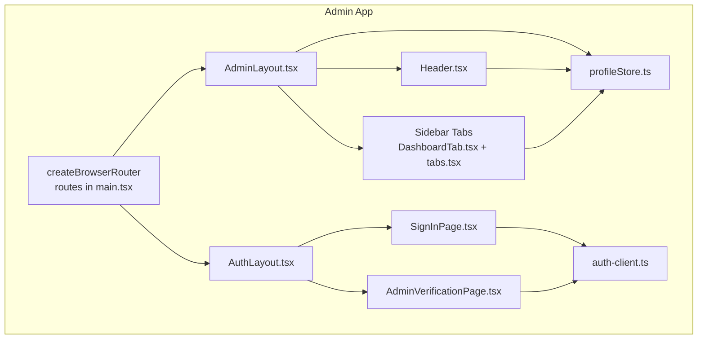
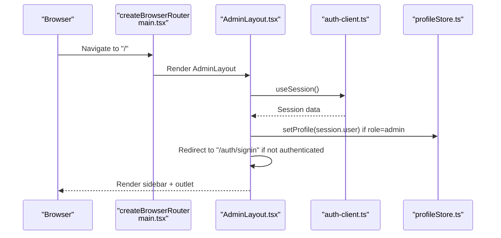
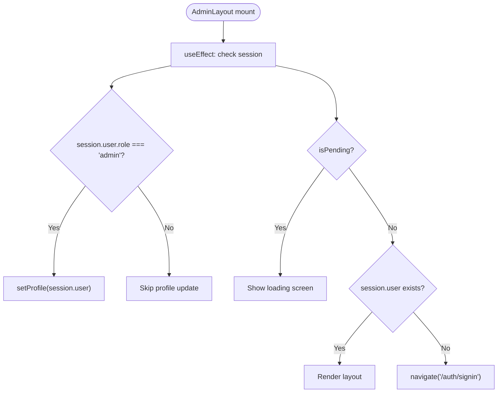
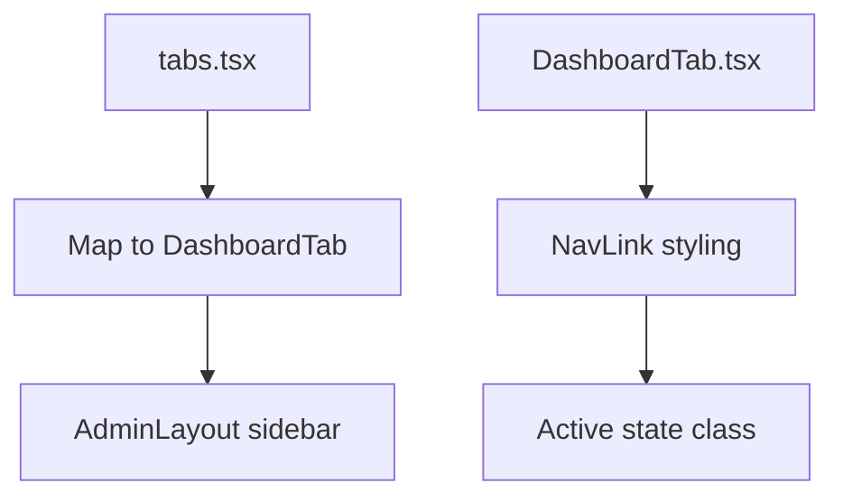
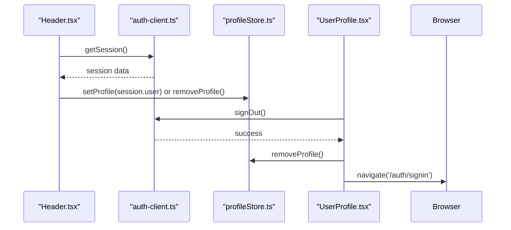
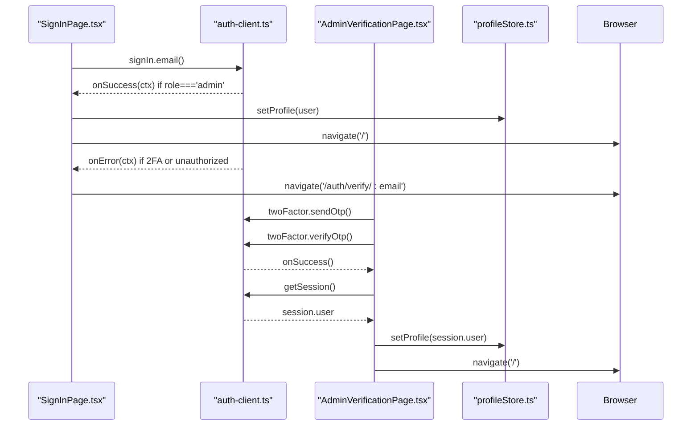
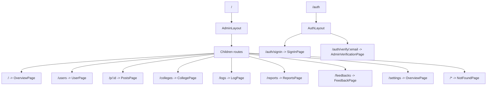
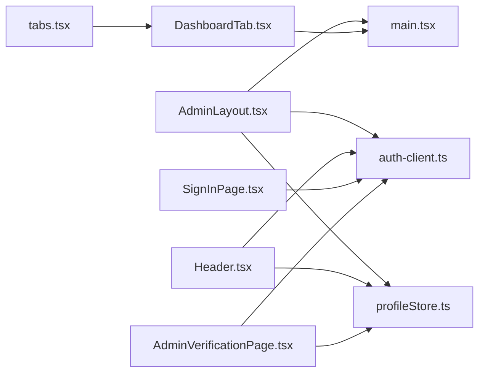

# Admin Layout & Navigation

<cite>
**Referenced Files in This Document**
- [AdminLayout.tsx](file://admin/src/layouts/AdminLayout.tsx)
- [Header.tsx](file://admin/src/components/general/Header.tsx)
- [DashboardTab.tsx](file://admin/src/components/general/DashboardTab.tsx)
- [tabs.tsx](file://admin/src/constants/tabs.tsx)
- [profileStore.ts](file://admin/src/store/profileStore.ts)
- [auth-client.ts](file://admin/src/lib/auth-client.ts)
- [types.ts](file://admin/src/lib/types.ts)
- [main.tsx](file://admin/src/main.tsx)
- [SignInPage.tsx](file://admin/src/pages/SignInPage.tsx)
- [AdminVerificationPage.tsx](file://admin/src/pages/AdminVerificationPage.tsx)
- [AuthLayout.tsx](file://admin/src/layouts/AuthLayout.tsx)
- [UserProfile.tsx](file://admin/src/components/general/UserProfile.tsx)
- [env.ts](file://admin/src/config/env.ts)
</cite>

## Table of Contents
1. [Introduction](#introduction)
2. [Project Structure](#project-structure)
3. [Core Components](#core-components)
4. [Architecture Overview](#architecture-overview)
5. [Detailed Component Analysis](#detailed-component-analysis)
6. [Dependency Analysis](#dependency-analysis)
7. [Performance Considerations](#performance-considerations)
8. [Troubleshooting Guide](#troubleshooting-guide)
9. [Conclusion](#conclusion)

## Introduction
This document explains the admin dashboard layout and navigation system. It covers the AdminLayout component structure, sidebar navigation, header components, authentication flow, routing configuration with nested routes, role-based access control, menu item visibility, and responsive design patterns. It also documents the header’s user profile dropdown, notifications integration, logout functionality, and session management.

## Project Structure
The admin application is organized around a client-side React application with TypeScript and Vite. The routing is configured via React Router, and the admin area is protected and structured under a dedicated layout. Authentication is handled by Better Auth client with support for two-factor verification tailored for administrators.

**Diagram sources**
- [main.tsx](file://admin/src/main.tsx#L19-L84)
- [AdminLayout.tsx](file://admin/src/layouts/AdminLayout.tsx#L9-L45)
- [AuthLayout.tsx](file://admin/src/layouts/AuthLayout.tsx#L4-L15)
- [SignInPage.tsx](file://admin/src/pages/SignInPage.tsx#L23-L72)
- [AdminVerificationPage.tsx](file://admin/src/pages/AdminVerificationPage.tsx#L17-L102)
- [Header.tsx](file://admin/src/components/general/Header.tsx#L12-L62)
- [DashboardTab.tsx](file://admin/src/components/general/DashboardTab.tsx#L4-L19)
- [tabs.tsx](file://admin/src/constants/tabs.tsx#L6-L41)
- [profileStore.ts](file://admin/src/store/profileStore.ts#L12-L35)
- [auth-client.ts](file://admin/src/lib/auth-client.ts#L4-L11)

**Section sources**
- [main.tsx](file://admin/src/main.tsx#L1-L90)

## Core Components
- AdminLayout: Provides the admin shell with a sidebar, outlet for nested routes, session checks, and global toast integration.
- Sidebar and Tabs: Render navigation items from a centralized constant list and apply active state styling.
- Header: Renders top navigation links and the user profile dropdown.
- Auth Client: Configured Better Auth client with admin and two-factor plugins.
- Profile Store: Zustand store managing user profile and theme preferences.
- Routing: Nested routes under "/" for admin sections and "/auth" for sign-in and verification.

Key responsibilities:
- Role enforcement: Only users with role "admin" are admitted to the admin layout.
- Session synchronization: Profile store is hydrated from Better Auth session data.
- Two-factor flow: On sign-in failure indicating two-factor requirement, redirects to verification page.
- Responsive sidebar: Uses Tailwind breakpoints to adjust column spans on small, medium, and large screens.

**Section sources**
- [AdminLayout.tsx](file://admin/src/layouts/AdminLayout.tsx#L9-L45)
- [tabs.tsx](file://admin/src/constants/tabs.tsx#L6-L41)
- [DashboardTab.tsx](file://admin/src/components/general/DashboardTab.tsx#L4-L19)
- [Header.tsx](file://admin/src/components/general/Header.tsx#L12-L62)
- [auth-client.ts](file://admin/src/lib/auth-client.ts#L4-L11)
- [profileStore.ts](file://admin/src/store/profileStore.ts#L12-L35)
- [main.tsx](file://admin/src/main.tsx#L19-L84)

## Architecture Overview
The admin layout composes a fixed header, a collapsible sidebar, and a content outlet. Authentication guards ensure only admins can enter the admin area. Two-factor verification is integrated for secure admin sign-in.

**Diagram sources**
- [main.tsx](file://admin/src/main.tsx#L19-L84)
- [AdminLayout.tsx](file://admin/src/layouts/AdminLayout.tsx#L11-L25)
- [auth-client.ts](file://admin/src/lib/auth-client.ts#L4-L11)
- [profileStore.ts](file://admin/src/store/profileStore.ts#L18-L29)

## Detailed Component Analysis

### AdminLayout
Responsibilities:
- Synchronizes Better Auth session to local profile store.
- Enforces admin role and redirects unauthenticated users to sign-in.
- Renders a responsive sidebar using grid column spans.
- Provides a content outlet for nested routes.
- Integrates global toast notifications.

Behavior highlights:
- Hydration: On session change, sets profile if role equals "admin".
- Guard: Redirects to "/auth/signin" when session is absent and not pending.
- Loading: Shows a centered loading indicator while session is pending.

**Diagram sources**
- [AdminLayout.tsx](file://admin/src/layouts/AdminLayout.tsx#L15-L25)
- [profileStore.ts](file://admin/src/store/profileStore.ts#L18-L29)

**Section sources**
- [AdminLayout.tsx](file://admin/src/layouts/AdminLayout.tsx#L9-L45)

### Sidebar Navigation
Structure:
- Centralized tab list defines menu items with name, path, and icon.
- Each tab is rendered as a styled link using DashboardTab.
- Active state styling applied via NavLink.

Responsive behavior:
- Sidebar container uses Tailwind grid classes to span 12 columns on small screens and fewer columns on larger screens.

Visibility:
- Menu items are currently static and not filtered by permission. Role-based visibility can be implemented by gating rendering based on profile role.

**Diagram sources**
- [tabs.tsx](file://admin/src/constants/tabs.tsx#L6-L41)
- [DashboardTab.tsx](file://admin/src/components/general/DashboardTab.tsx#L12-L18)
- [AdminLayout.tsx](file://admin/src/layouts/AdminLayout.tsx#L33-L40)

**Section sources**
- [tabs.tsx](file://admin/src/constants/tabs.tsx#L6-L41)
- [DashboardTab.tsx](file://admin/src/components/general/DashboardTab.tsx#L4-L19)
- [AdminLayout.tsx](file://admin/src/layouts/AdminLayout.tsx#L33-L40)

### Header Components
Top-level navigation:
- Fixed header with branding and navigation links.
- Links use NavLink to highlight active route.

User profile dropdown:
- Displays avatar or fallback when logged in.
- Provides logout action that signs out via Better Auth, clears local profile, and navigates to sign-in.

Session hydration:
- On mount, fetches session and updates profile store accordingly.

**Diagram sources**
- [Header.tsx](file://admin/src/components/general/Header.tsx#L17-L33)
- [UserProfile.tsx](file://admin/src/components/general/UserProfile.tsx#L12-L16)
- [auth-client.ts](file://admin/src/lib/auth-client.ts#L4-L11)
- [profileStore.ts](file://admin/src/store/profileStore.ts#L23-L29)

**Section sources**
- [Header.tsx](file://admin/src/components/general/Header.tsx#L12-L62)
- [UserProfile.tsx](file://admin/src/components/general/UserProfile.tsx#L8-L43)

### Authentication Flow
Two-factor enabled admin sign-in:
- Sign-in page validates credentials and role.
- On successful admin sign-in, profile is set and navigates to home.
- On 401/403 or two-factor-related errors, navigates to verification page.
- Verification page sends and verifies OTP, then hydrates profile and navigates to admin home.

**Diagram sources**
- [SignInPage.tsx](file://admin/src/pages/SignInPage.tsx#L37-L72)
- [AdminVerificationPage.tsx](file://admin/src/pages/AdminVerificationPage.tsx#L48-L102)
- [auth-client.ts](file://admin/src/lib/auth-client.ts#L4-L11)
- [profileStore.ts](file://admin/src/store/profileStore.ts#L18-L29)

**Section sources**
- [SignInPage.tsx](file://admin/src/pages/SignInPage.tsx#L23-L72)
- [AdminVerificationPage.tsx](file://admin/src/pages/AdminVerificationPage.tsx#L17-L102)
- [AuthLayout.tsx](file://admin/src/layouts/AuthLayout.tsx#L4-L15)

### Routing Configuration and Nested Routes
Nested routes under "/" define admin sections:
- Dashboard overview, users, posts variants, logs, colleges, reports, feedbacks, settings.
- Wildcard route handles unknown paths.

Nested routes under "/auth":
- Sign-in page and two-factor verification page.

**Diagram sources**
- [main.tsx](file://admin/src/main.tsx#L19-L84)

**Section sources**
- [main.tsx](file://admin/src/main.tsx#L19-L84)

### Role-Based Access Control and Menu Visibility
Current implementation:
- AdminLayout enforces role during session hydration and redirects non-admins to sign-in.
- Sidebar menu items are static and not filtered by permission.

Recommendations:
- Gate menu item rendering by checking profile role before mapping tabs.
- Add granular permissions per section to further restrict access.

**Section sources**
- [AdminLayout.tsx](file://admin/src/layouts/AdminLayout.tsx#L16-L18)
- [tabs.tsx](file://admin/src/constants/tabs.tsx#L6-L41)

### Breadcrumb Navigation
Not implemented in the current codebase. Breadcrumbs can be added by deriving route segments from the current location and mapping them to human-readable labels.

**Section sources**
- [main.tsx](file://admin/src/main.tsx#L19-L84)

### Responsive Design Patterns and Mobile Navigation
- Sidebar responsiveness: Grid column spans adapt to small/medium/large screens.
- Header remains fixed and uses padding and flexbox for alignment.
- Dropdown menus collapse into mobile-friendly touch targets.

**Section sources**
- [AdminLayout.tsx](file://admin/src/layouts/AdminLayout.tsx#L32-L40)
- [Header.tsx](file://admin/src/components/general/Header.tsx#L37-L59)

### Navigation State Management
- Profile store holds user identity and theme preference.
- Auth client manages session state and two-factor operations.
- Global toast integration for user feedback.

**Section sources**
- [profileStore.ts](file://admin/src/store/profileStore.ts#L12-L35)
- [auth-client.ts](file://admin/src/lib/auth-client.ts#L4-L11)

## Dependency Analysis
External libraries and integrations:
- Better Auth client for authentication and two-factor.
- React Router for routing and navigation.
- Zustand for lightweight state management.
- Tailwind CSS for responsive styling.

**Diagram sources**
- [AdminLayout.tsx](file://admin/src/layouts/AdminLayout.tsx#L1-L7)
- [Header.tsx](file://admin/src/components/general/Header.tsx#L1-L5)
- [DashboardTab.tsx](file://admin/src/components/general/DashboardTab.tsx#L1-L2)
- [tabs.tsx](file://admin/src/constants/tabs.tsx#L1-L42)
- [profileStore.ts](file://admin/src/store/profileStore.ts#L1-L2)
- [auth-client.ts](file://admin/src/lib/auth-client.ts#L1-L11)
- [main.tsx](file://admin/src/main.tsx#L1-L16)
- [SignInPage.tsx](file://admin/src/pages/SignInPage.tsx#L1-L12)
- [AdminVerificationPage.tsx](file://admin/src/pages/AdminVerificationPage.tsx#L1-L12)

**Section sources**
- [auth-client.ts](file://admin/src/lib/auth-client.ts#L4-L11)
- [types.ts](file://admin/src/lib/types.ts#L5-L11)
- [env.ts](file://admin/src/config/env.ts#L1-L5)

## Performance Considerations
- Prefer lazy-loading heavy admin pages to reduce initial bundle size.
- Debounce or throttle session polling if extended hydration is needed.
- Use CSS containment for sidebar and header to minimize layout recalculation.
- Keep menu lists small to avoid excessive re-renders.

## Troubleshooting Guide
Common issues and resolutions:
- Unauthorized access attempts: Ensure sign-in page checks role and redirects appropriately.
- Two-factor failures: Verify OTP resend limits and error handling in verification page.
- Session desync: Confirm profile store hydration on both AdminLayout and Header mounts.
- Navigation loops: Validate redirect conditions and base URL configuration.

**Section sources**
- [SignInPage.tsx](file://admin/src/pages/SignInPage.tsx#L48-L51)
- [AdminVerificationPage.tsx](file://admin/src/pages/AdminVerificationPage.tsx#L60-L95)
- [AdminLayout.tsx](file://admin/src/layouts/AdminLayout.tsx#L21-L25)
- [Header.tsx](file://admin/src/components/general/Header.tsx#L17-L33)

## Conclusion
The admin layout and navigation system provides a robust foundation for an admin dashboard with role-based access control, two-factor authentication, and responsive design. The current implementation focuses on admin-only access and a static menu. Future enhancements can include permission-driven menu visibility, breadcrumbs, and improved mobile navigation affordances.