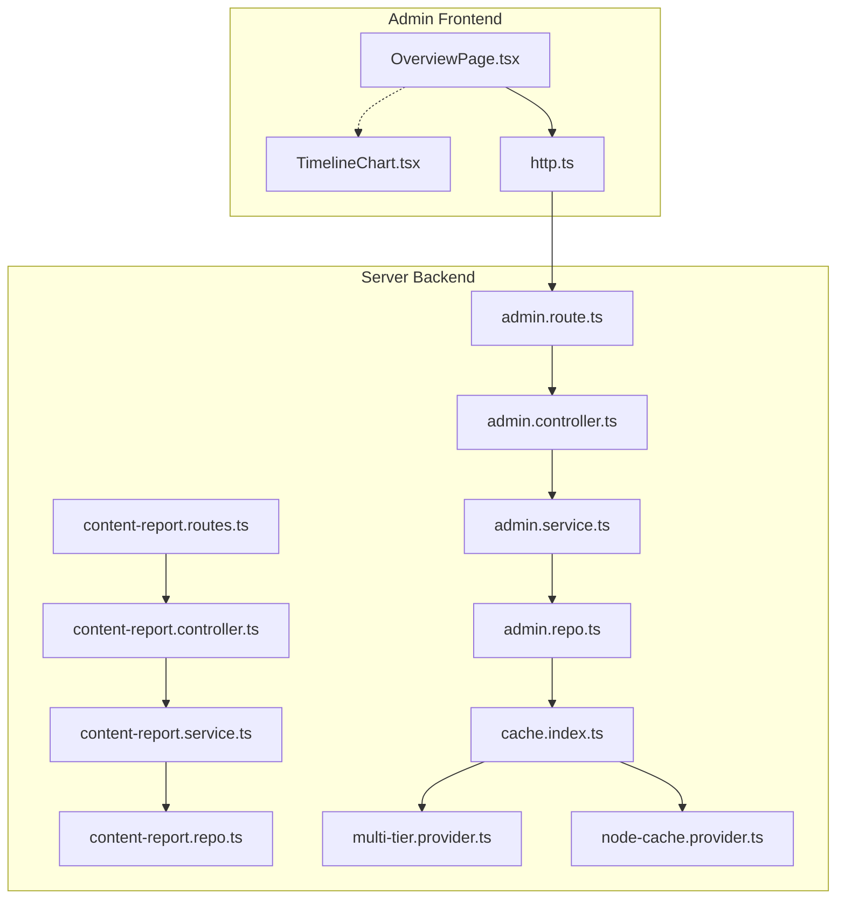
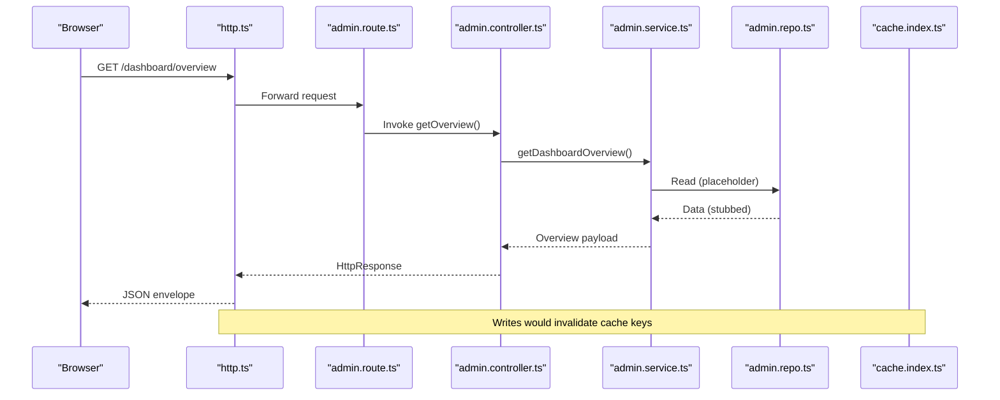
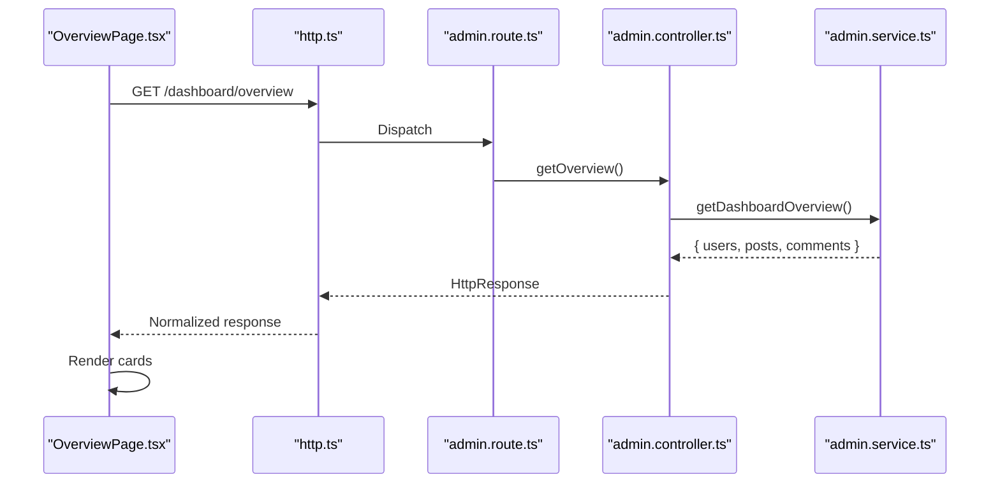
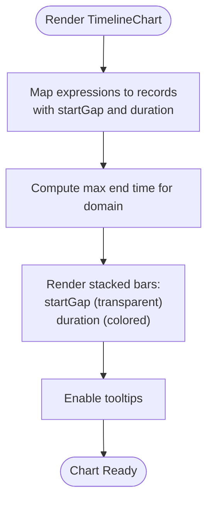
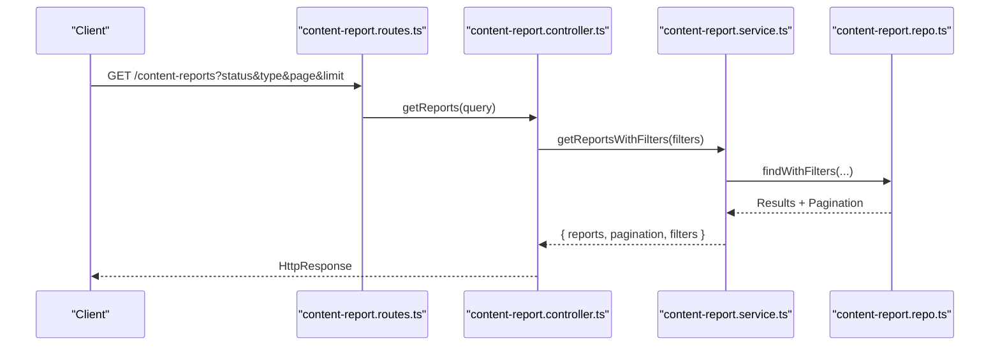
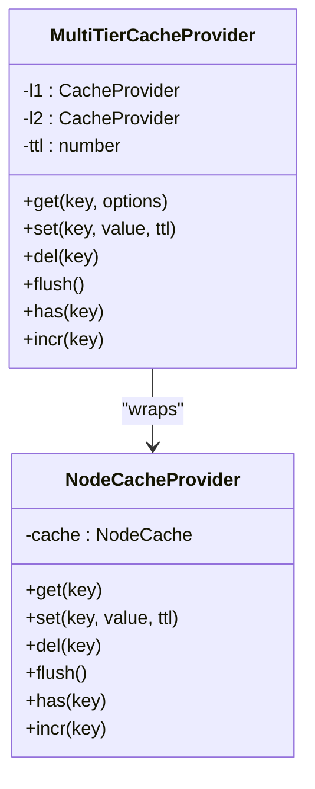
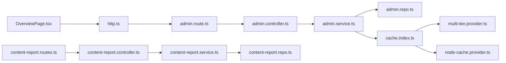

# Analytics & Reporting

<cite>
**Referenced Files in This Document**
- [OverviewPage.tsx](file://admin/src/pages/OverviewPage.tsx)
- [TimelineChart.tsx](file://admin/src/components/charts/TimelineChart.tsx)
- [http.ts](file://admin/src/services/http.ts)
- [admin.route.ts](file://server/src/modules/admin/admin.route.ts)
- [admin.controller.ts](file://server/src/modules/admin/admin.controller.ts)
- [admin.service.ts](file://server/src/modules/admin/admin.service.ts)
- [admin.repo.ts](file://server/src/modules/admin/admin.repo.ts)
- [multi-tier.provider.ts](file://server/src/infra/services/cache/providers/multi-tier.provider.ts)
- [node-cache.provider.ts](file://server/src/infra/services/cache/providers/node-cache.provider.ts)
- [cache.index.ts](file://server/src/infra/services/cache/index.ts)
- [content-report.controller.ts](file://server/src/modules/content-report/content-report.controller.ts)
- [content-report.service.ts](file://server/src/modules/content-report/content-report.service.ts)
- [content-report.repo.ts](file://server/src/modules/content-report/content-report.repo.ts)
- [content-report.routes.ts](file://server/src/modules/content-report/content-report.routes.ts)
- [app.ts](file://web/src/services/api/app.ts)
</cite>

## Table of Contents
1. [Introduction](#introduction)
2. [Project Structure](#project-structure)
3. [Core Components](#core-components)
4. [Architecture Overview](#architecture-overview)
5. [Detailed Component Analysis](#detailed-component-analysis)
6. [Dependency Analysis](#dependency-analysis)
7. [Performance Considerations](#performance-considerations)
8. [Troubleshooting Guide](#troubleshooting-guide)
9. [Conclusion](#conclusion)
10. [Appendices](#appendices)

## Introduction
This document describes the analytics and reporting dashboard components of the administrative interface. It covers overview statistics, timeline chart visualization, dashboard widgets, reporting system capabilities, KPI tracking, alerting, data aggregation and caching, and backend integrations. The focus is on how the frontend requests and renders analytics data, how the backend exposes endpoints and services, and how caching and multi-tier strategies support performance at scale.

## Project Structure
The analytics and reporting functionality spans the admin frontend and the server backend:
- Frontend dashboard page fetches overview metrics and renders cards.
- Timeline chart component visualizes temporal data.
- Backend routes expose analytics endpoints, controllers orchestrate requests, services compute or retrieve data, and repositories adapt database queries.
- Caching infrastructure supports multi-tier caching for performance.

**Diagram sources**
- [OverviewPage.tsx](file://admin/src/pages/OverviewPage.tsx#L1-L80)
- [TimelineChart.tsx](file://admin/src/components/charts/TimelineChart.tsx#L1-L47)
- [http.ts](file://admin/src/services/http.ts#L1-L133)
- [admin.route.ts](file://server/src/modules/admin/admin.route.ts#L1-L20)
- [admin.controller.ts](file://server/src/modules/admin/admin.controller.ts#L1-L40)
- [admin.service.ts](file://server/src/modules/admin/admin.service.ts#L1-L94)
- [admin.repo.ts](file://server/src/modules/admin/admin.repo.ts#L1-L19)
- [content-report.routes.ts](file://server/src/modules/content-report/content-report.routes.ts#L29-L36)
- [content-report.controller.ts](file://server/src/modules/content-report/content-report.controller.ts#L34-L212)
- [content-report.service.ts](file://server/src/modules/content-report/content-report.service.ts#L126-L159)
- [content-report.repo.ts](file://server/src/modules/content-report/content-report.repo.ts#L1-L21)
- [cache.index.ts](file://server/src/infra/services/cache/index.ts#L1-L7)
- [multi-tier.provider.ts](file://server/src/infra/services/cache/providers/multi-tier.provider.ts#L1-L52)
- [node-cache.provider.ts](file://server/src/infra/services/cache/providers/node-cache.provider.ts#L1-L44)

**Section sources**
- [OverviewPage.tsx](file://admin/src/pages/OverviewPage.tsx#L1-L80)
- [admin.route.ts](file://server/src/modules/admin/admin.route.ts#L1-L20)

## Core Components
- Overview dashboard page: Fetches and displays user, post, and comment counts via a dedicated endpoint.
- Timeline chart: Renders vertical stacked bars representing temporal segments for expressions or categories.
- HTTP client: Centralized Axios client with interceptors for auth and normalized responses.
- Admin analytics endpoints: Route, controller, service, and repo layers for dashboard overview and related admin analytics.
- Reporting system: Routes and controllers for content reports, user management actions, and status updates.
- Caching: Multi-tier provider combining local and Redis-backed caches for fast reads and invalidation on writes.

**Section sources**
- [OverviewPage.tsx](file://admin/src/pages/OverviewPage.tsx#L12-L78)
- [TimelineChart.tsx](file://admin/src/components/charts/TimelineChart.tsx#L4-L46)
- [http.ts](file://admin/src/services/http.ts#L1-L133)
- [admin.route.ts](file://server/src/modules/admin/admin.route.ts#L11-L11)
- [admin.controller.ts](file://server/src/modules/admin/admin.controller.ts#L8-L11)
- [admin.service.ts](file://server/src/modules/admin/admin.service.ts#L5-L14)
- [content-report.controller.ts](file://server/src/modules/content-report/content-report.controller.ts#L34-L71)
- [multi-tier.provider.ts](file://server/src/infra/services/cache/providers/multi-tier.provider.ts#L1-L52)
- [node-cache.provider.ts](file://server/src/infra/services/cache/providers/node-cache.provider.ts#L1-L44)

## Architecture Overview
The analytics dashboard follows a layered architecture:
- Frontend requests analytics endpoints and renders cards and charts.
- Backend routes are protected and rate-limited, delegating to controllers that call services.
- Services encapsulate business logic and coordinate repositories for data access.
- Caching sits beneath services to accelerate reads and is invalidated on write operations.

**Diagram sources**
- [http.ts](file://admin/src/services/http.ts#L1-L133)
- [admin.route.ts](file://server/src/modules/admin/admin.route.ts#L11-L11)
- [admin.controller.ts](file://server/src/modules/admin/admin.controller.ts#L8-L11)
- [admin.service.ts](file://server/src/modules/admin/admin.service.ts#L5-L14)
- [admin.repo.ts](file://server/src/modules/admin/admin.repo.ts#L4-L11)
- [cache.index.ts](file://server/src/infra/services/cache/index.ts#L1-L7)

## Detailed Component Analysis

### Overview Statistics Widget
The overview page fetches and displays three primary metrics: total users, total posts, and total comments. It uses a centralized HTTP client with interceptors for authentication and normalized responses. The route for overview is defined in the admin routes and wired to an admin controller and service.

**Diagram sources**
- [OverviewPage.tsx](file://admin/src/pages/OverviewPage.tsx#L16-L29)
- [http.ts](file://admin/src/services/http.ts#L1-L133)
- [admin.route.ts](file://server/src/modules/admin/admin.route.ts#L11-L11)
- [admin.controller.ts](file://server/src/modules/admin/admin.controller.ts#L8-L11)
- [admin.service.ts](file://server/src/modules/admin/admin.service.ts#L5-L14)

**Section sources**
- [OverviewPage.tsx](file://admin/src/pages/OverviewPage.tsx#L6-L78)
- [admin.route.ts](file://server/src/modules/admin/admin.route.ts#L11-L11)
- [admin.controller.ts](file://server/src/modules/admin/admin.controller.ts#L8-L11)
- [admin.service.ts](file://server/src/modules/admin/admin.service.ts#L5-L14)

### Timeline Chart Implementation
The timeline chart component accepts a mapping of expression identifiers to time intervals and renders a responsive vertical bar chart. It computes the maximum time to set the X-axis domain and stacks two bars per category: a transparent offset bar and a colored duration bar. This enables trend visualization across multiple categories over time.

**Diagram sources**
- [TimelineChart.tsx](file://admin/src/components/charts/TimelineChart.tsx#L10-L44)

**Section sources**
- [TimelineChart.tsx](file://admin/src/components/charts/TimelineChart.tsx#L4-L46)

### Reporting System and Filters
The reporting system exposes endpoints for retrieving reported content with filters (type, status, pagination) and managing user actions (block, unblock, suspend). Controllers parse query parameters and request bodies, invoking services that coordinate repositories for persistence and retrieval. Audit logging is integrated for administrative actions.

**Diagram sources**
- [content-report.routes.ts](file://server/src/modules/content-report/content-report.routes.ts#L29-L36)
- [content-report.controller.ts](file://server/src/modules/content-report/content-report.controller.ts#L34-L54)
- [content-report.service.ts](file://server/src/modules/content-report/content-report.service.ts#L126-L159)
- [content-report.repo.ts](file://server/src/modules/content-report/content-report.repo.ts#L1-L21)

**Section sources**
- [content-report.controller.ts](file://server/src/modules/content-report/content-report.controller.ts#L34-L71)
- [content-report.routes.ts](file://server/src/modules/content-report/content-report.routes.ts#L29-L36)
- [content-report.service.ts](file://server/src/modules/content-report/content-report.service.ts#L126-L159)
- [content-report.repo.ts](file://server/src/modules/content-report/content-report.repo.ts#L1-L21)

### KPI Tracking and Platform Health Indicators
- KPIs currently exposed: user, post, and comment counts via the overview endpoint.
- Platform health: health check endpoint is available in the web API for runtime checks.
- Moderation effectiveness: user management endpoints (block, unblock, suspend) and report status updates are present in the content-report module.
- Usage patterns: the reporting system’s filters enable slicing by type and status to infer trends.

**Section sources**
- [OverviewPage.tsx](file://admin/src/pages/OverviewPage.tsx#L19-L20)
- [app.ts](file://web/src/services/api/app.ts#L5-L9)
- [content-report.controller.ts](file://server/src/modules/content-report/content-report.controller.ts#L177-L205)

### Alert System and Threshold Monitoring
- No explicit anomaly detection or threshold monitoring logic is present in the analyzed files.
- Audit logging is integrated for administrative actions, enabling post-event tracking and compliance.

**Section sources**
- [content-report.controller.ts](file://server/src/modules/content-report/content-report.controller.ts#L168-L173)
- [content-report.controller.ts](file://server/src/modules/content-report/content-report.controller.ts#L192-L197)

### Data Aggregation and Caching Strategies
- Multi-tier caching: A composite provider combines a local cache and a Redis-backed provider. Reads can bypass L1 if needed, and writes propagate to both tiers.
- Node-cache provider: Provides in-memory caching with TTL and increment operations.
- Cache invalidation: On write operations (e.g., creating or updating colleges), cache keys are invalidated to ensure freshness.

**Diagram sources**
- [multi-tier.provider.ts](file://server/src/infra/services/cache/providers/multi-tier.provider.ts#L2-L51)
- [node-cache.provider.ts](file://server/src/infra/services/cache/providers/node-cache.provider.ts#L4-L43)

**Section sources**
- [cache.index.ts](file://server/src/infra/services/cache/index.ts#L1-L7)
- [multi-tier.provider.ts](file://server/src/infra/services/cache/providers/multi-tier.provider.ts#L1-L52)
- [node-cache.provider.ts](file://server/src/infra/services/cache/providers/node-cache.provider.ts#L1-L44)
- [admin.service.ts](file://server/src/modules/admin/admin.service.ts#L51-L90)

### Backend Analytics APIs and Real-Time Data Streaming
- Analytics endpoints: The admin module defines a dashboard overview endpoint and other admin analytics routes.
- Real-time streaming: No WebSocket or event-streaming code was identified in the analyzed files. The socket context exists elsewhere in the codebase but is not used for analytics in the reviewed modules.

**Section sources**
- [admin.route.ts](file://server/src/modules/admin/admin.route.ts#L11-L19)
- [admin.controller.ts](file://server/src/modules/admin/admin.controller.ts#L1-L40)

## Dependency Analysis
The analytics pipeline exhibits clear separation of concerns:
- Frontend depends on a centralized HTTP client and admin routes.
- Backend routes depend on controllers, which depend on services, which depend on repositories.
- Caching is injected at the service layer to optimize reads and is invalidated on writes.

**Diagram sources**
- [OverviewPage.tsx](file://admin/src/pages/OverviewPage.tsx#L1-L80)
- [http.ts](file://admin/src/services/http.ts#L1-L133)
- [admin.route.ts](file://server/src/modules/admin/admin.route.ts#L1-L20)
- [admin.controller.ts](file://server/src/modules/admin/admin.controller.ts#L1-L40)
- [admin.service.ts](file://server/src/modules/admin/admin.service.ts#L1-L94)
- [admin.repo.ts](file://server/src/modules/admin/admin.repo.ts#L1-L19)
- [cache.index.ts](file://server/src/infra/services/cache/index.ts#L1-L7)
- [multi-tier.provider.ts](file://server/src/infra/services/cache/providers/multi-tier.provider.ts#L1-L52)
- [node-cache.provider.ts](file://server/src/infra/services/cache/providers/node-cache.provider.ts#L1-L44)
- [content-report.routes.ts](file://server/src/modules/content-report/content-report.routes.ts#L29-L36)
- [content-report.controller.ts](file://server/src/modules/content-report/content-report.controller.ts#L34-L212)
- [content-report.service.ts](file://server/src/modules/content-report/content-report.service.ts#L126-L159)
- [content-report.repo.ts](file://server/src/modules/content-report/content-report.repo.ts#L1-L21)

**Section sources**
- [admin.route.ts](file://server/src/modules/admin/admin.route.ts#L1-L20)
- [admin.controller.ts](file://server/src/modules/admin/admin.controller.ts#L1-L40)
- [admin.service.ts](file://server/src/modules/admin/admin.service.ts#L1-L94)
- [admin.repo.ts](file://server/src/modules/admin/admin.repo.ts#L1-L19)
- [content-report.routes.ts](file://server/src/modules/content-report/content-report.routes.ts#L29-L36)
- [content-report.controller.ts](file://server/src/modules/content-report/content-report.controller.ts#L34-L212)
- [content-report.service.ts](file://server/src/modules/content-report/content-report.service.ts#L126-L159)
- [content-report.repo.ts](file://server/src/modules/content-report/content-report.repo.ts#L1-L21)

## Performance Considerations
- Multi-tier caching reduces latency for repeated reads by serving from a fast local cache while mirroring values in Redis.
- Cache invalidation on write ensures stale data is not served after modifications.
- The timeline chart dynamically sizes its container height based on the number of categories, which helps maintain readability for large datasets.
- Rate limiting middleware is applied to admin routes to protect backend resources.

**Section sources**
- [multi-tier.provider.ts](file://server/src/infra/services/cache/providers/multi-tier.provider.ts#L1-L52)
- [node-cache.provider.ts](file://server/src/infra/services/cache/providers/node-cache.provider.ts#L1-L44)
- [admin.service.ts](file://server/src/modules/admin/admin.service.ts#L51-L90)
- [admin.route.ts](file://server/src/modules/admin/admin.route.ts#L7-L8)
- [TimelineChart.tsx](file://admin/src/components/charts/TimelineChart.tsx#L27-L27)

## Troubleshooting Guide
- Authentication failures: The HTTP client retries on 401 by refreshing tokens and reissuing the request. Inspect interceptors for queued requests and refresh callbacks.
- Endpoint not found: Verify the route registration for the overview endpoint and ensure the controller method is exported.
- Service stubs: The overview service currently returns placeholder values; confirm backend implementation is updated to compute actual counts.
- Cache misses: Confirm cache initialization and provider selection; ensure invalidation keys match those used during writes.

**Section sources**
- [http.ts](file://admin/src/services/http.ts#L56-L109)
- [admin.route.ts](file://server/src/modules/admin/admin.route.ts#L11-L11)
- [admin.controller.ts](file://server/src/modules/admin/admin.controller.ts#L8-L11)
- [admin.service.ts](file://server/src/modules/admin/admin.service.ts#L5-L14)
- [cache.index.ts](file://server/src/infra/services/cache/index.ts#L1-L7)

## Conclusion
The analytics and reporting dashboard integrates a clean frontend-to-backend flow with robust caching and modular controllers/services. While the overview currently returns stubbed values, the underlying architecture supports scalable metrics retrieval, filtering, and moderation workflows. Extending the backend to compute real-time KPIs and adding anomaly detection or streaming would further enhance the system’s capabilities.

## Appendices
- Export capabilities: Not present in the analyzed files; consider adding CSV/PDF exports for reports and overview metrics.
- Custom date ranges: Not present in the analyzed files; introduce date range parameters in reporting endpoints and adjust service logic accordingly.
- Real-time streaming: No implementation detected; integrate WebSocket or SSE if real-time updates are required.