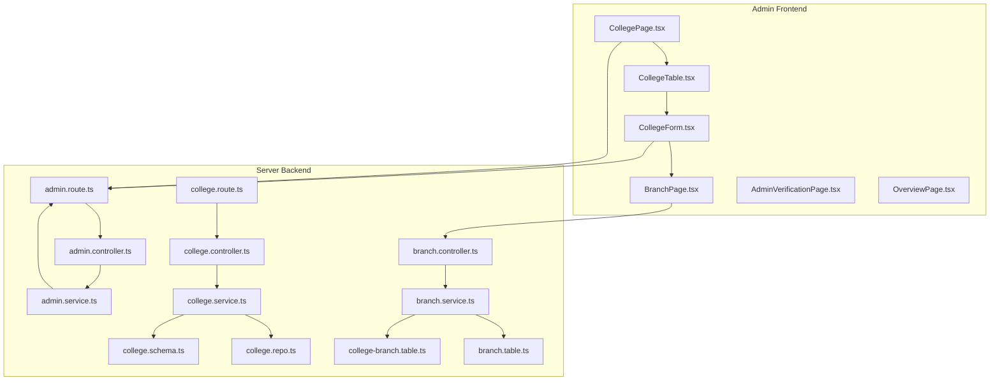
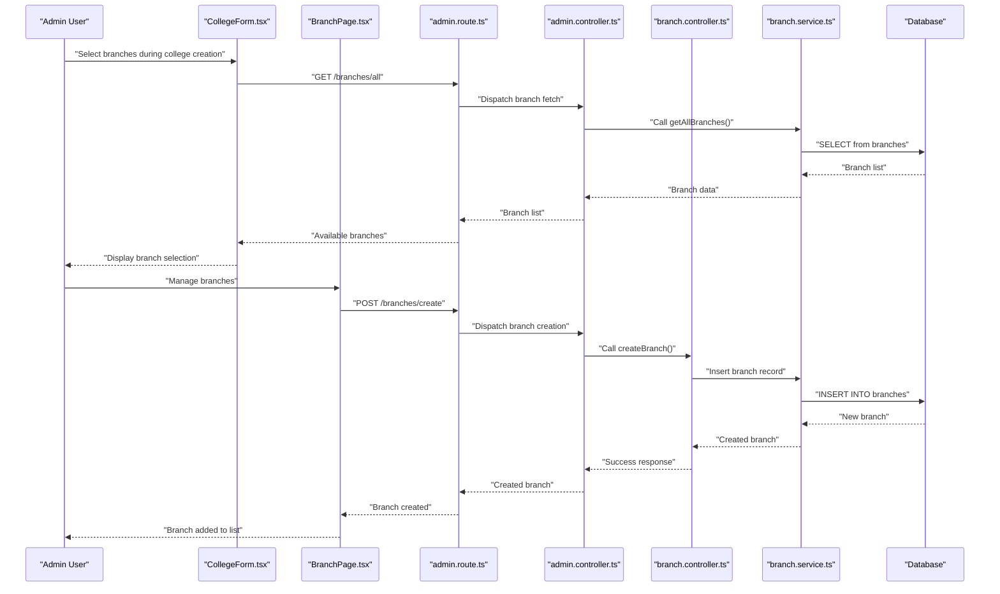
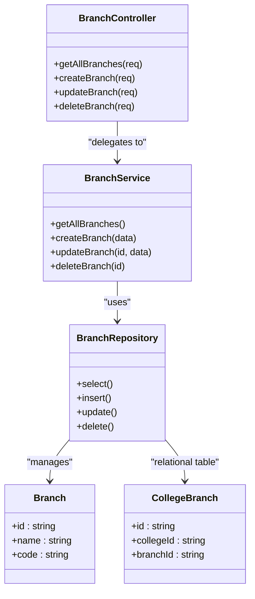
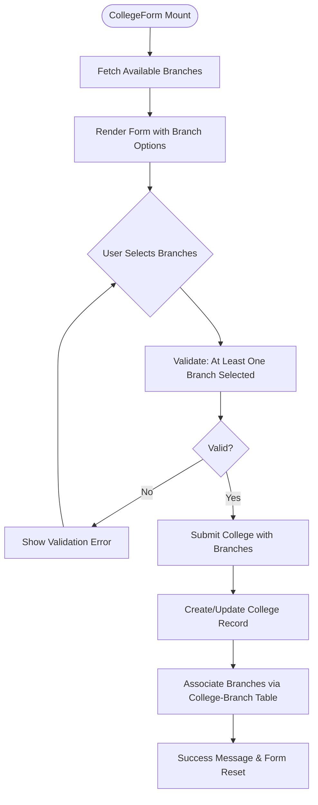
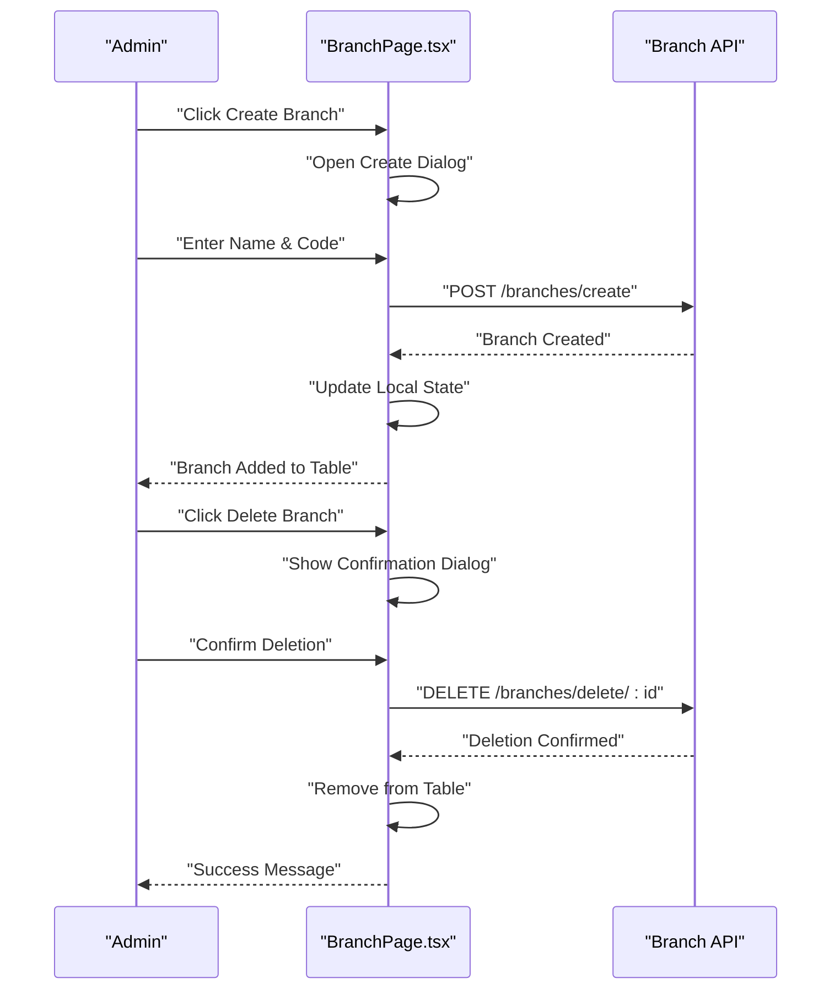
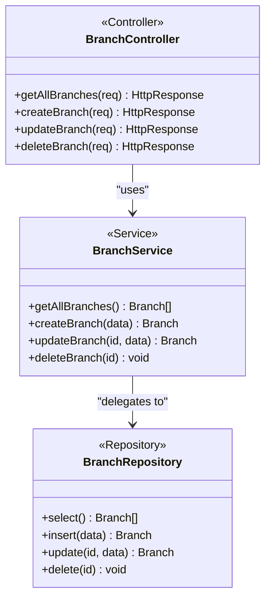
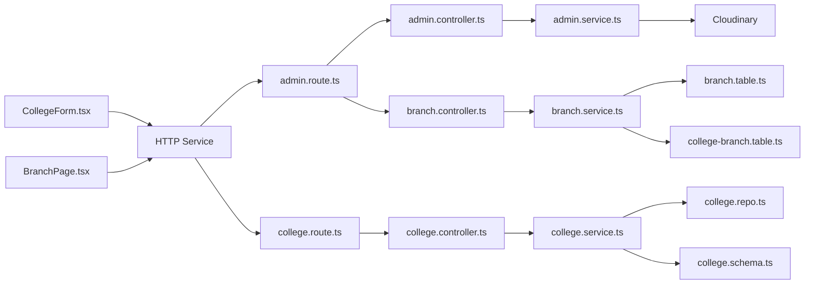

# College Administration

<cite>
**Referenced Files in This Document**
- [CollegeForm.tsx](file://admin/src/components/forms/CollegeForm.tsx)
- [BranchPage.tsx](file://admin/src/pages/BranchPage.tsx)
- [CollegePage.tsx](file://admin/src/pages/CollegePage.tsx)
- [CollegeTable.tsx](file://admin/src/components/general/CollegeTable.tsx)
- [College.ts](file://admin/src/types/College.ts)
- [AdminVerificationPage.tsx](file://admin/src/pages/AdminVerificationPage.tsx)
- [admin.route.ts](file://server/src/modules/admin/admin.route.ts)
- [admin.controller.ts](file://server/src/modules/admin/admin.controller.ts)
- [admin.service.ts](file://server/src/modules/admin/admin.service.ts)
- [branch.controller.ts](file://server/src/modules/admin/branch/branch.controller.ts)
- [branch.service.ts](file://server/src/modules/admin/branch/branch.service.ts)
- [branch.schema.ts](file://server/src/modules/admin/branch/branch.schema.ts)
- [branch.table.ts](file://server/src/infra/db/tables/branch.table.ts)
- [college-branch.table.ts](file://server/src/infra/db/tables/college-branch.table.ts)
- [college.schema.ts](file://server/src/modules/college/college.schema.ts)
- [college.controller.ts](file://server/src/modules/college/college.controller.ts)
- [college.service.ts](file://server/src/modules/college/college.service.ts)
- [college.repo.ts](file://server/src/modules/college/college.repo.ts)
- [college.route.ts](file://server/src/modules/college/college.route.ts)
- [content-moderation.service.ts](file://server/src/modules/content-report/content-moderation.service.ts)
- [user-management.service.ts](file://server/src/modules/content-report/user-management.service.ts)
- [OverviewPage.tsx](file://admin/src/pages/OverviewPage.tsx)
- [branch.ts](file://web/src/constants/branch.ts)
- [college.ts](file://web/src/services/api/college.ts)
</cite>

## Update Summary
**Changes Made**
- Added dynamic branch management feature enabling colleges to have multiple academic branches with independent configurations
- Implemented dedicated Branch management page for creating, viewing, and deleting branches
- Enhanced CollegeForm component with branch selection functionality during onboarding
- Added backend branch management APIs and database schema for branch CRUD operations
- Integrated branch selection into college creation and editing workflows
- Updated college data model to support branch associations

## Table of Contents
1. [Introduction](#introduction)
2. [Project Structure](#project-structure)
3. [Core Components](#core-components)
4. [Architecture Overview](#architecture-overview)
5. [Detailed Component Analysis](#detailed-component-analysis)
6. [Dependency Analysis](#dependency-analysis)
7. [Performance Considerations](#performance-considerations)
8. [Troubleshooting Guide](#troubleshooting-guide)
9. [Conclusion](#conclusion)
10. [Appendices](#appendices)

## Introduction
This document describes the college administration system within the admin dashboard, including the newly added dynamic branch management feature. The system now enables colleges to have multiple academic branches with independent configurations, allowing for granular academic program tracking and branch-specific content management. It covers the college management interface, institution registration, verification processes, and institutional data management. The enhanced CollegeForm component now includes branch selection functionality, while the dedicated BranchPage provides comprehensive branch management capabilities. It documents the branch management workflows, including branch creation, deletion, and association with colleges, along with the complete college verification processes, academic program tracking, and institutional reporting capabilities.

## Project Structure
The college administration system now includes comprehensive branch management capabilities spanning both admin frontend and server backend:
- Admin frontend: Enhanced College management UI with branch selection, dedicated Branch management page, forms, tables, and verification pages.
- Server backend: Complete branch CRUD endpoints, validation schemas, service layer, repository layer, and database schema with proper foreign key relationships.

**Diagram sources**
- [CollegePage.tsx](file://admin/src/pages/CollegePage.tsx#L1-L161)
- [CollegeTable.tsx](file://admin/src/components/general/CollegeTable.tsx#L1-L95)
- [CollegeForm.tsx](file://admin/src/components/forms/CollegeForm.tsx#L1-L448)
- [BranchPage.tsx](file://admin/src/pages/BranchPage.tsx#L1-L142)
- [AdminVerificationPage.tsx](file://admin/src/pages/AdminVerificationPage.tsx#L1-L174)
- [OverviewPage.tsx](file://admin/src/pages/OverviewPage.tsx#L1-L80)
- [admin.route.ts](file://server/src/modules/admin/admin.route.ts#L25-L28)
- [admin.controller.ts](file://server/src/modules/admin/admin.controller.ts#L1-L89)
- [admin.service.ts](file://server/src/modules/admin/admin.service.ts#L1-L92)
- [branch.controller.ts](file://server/src/modules/admin/branch/branch.controller.ts#L1-L34)
- [branch.service.ts](file://server/src/modules/admin/branch/branch.service.ts#L1-L31)
- [branch.table.ts](file://server/src/infra/db/tables/branch.table.ts#L1-L13)
- [college-branch.table.ts](file://server/src/infra/db/tables/college-branch.table.ts#L1-L19)
- [college.route.ts](file://server/src/modules/college/college.route.ts#L1-L16)
- [college.controller.ts](file://server/src/modules/college/college.controller.ts#L1-L66)
- [college.service.ts](file://server/src/modules/college/college.service.ts#L1-L149)
- [college.repo.ts](file://server/src/modules/college/college.repo.ts#L1-L33)
- [college.schema.ts](file://server/src/modules/college/college.schema.ts#L1-L26)

**Section sources**
- [CollegePage.tsx](file://admin/src/pages/CollegePage.tsx#L1-L161)
- [CollegeTable.tsx](file://admin/src/components/general/CollegeTable.tsx#L1-L95)
- [CollegeForm.tsx](file://admin/src/components/forms/CollegeForm.tsx#L1-L448)
- [BranchPage.tsx](file://admin/src/pages/BranchPage.tsx#L1-L142)
- [admin.route.ts](file://server/src/modules/admin/admin.route.ts#L25-L28)
- [admin.controller.ts](file://server/src/modules/admin/admin.controller.ts#L1-L89)
- [admin.service.ts](file://server/src/modules/admin/admin.service.ts#L1-L92)
- [branch.controller.ts](file://server/src/modules/admin/branch/branch.controller.ts#L1-L34)
- [branch.service.ts](file://server/src/modules/admin/branch/branch.service.ts#L1-L31)
- [branch.table.ts](file://server/src/infra/db/tables/branch.table.ts#L1-L13)
- [college-branch.table.ts](file://server/src/infra/db/tables/college-branch.table.ts#L1-L19)
- [college.route.ts](file://server/src/modules/college/college.route.ts#L1-L16)
- [college.controller.ts](file://server/src/modules/college/college.controller.ts#L1-L66)
- [college.service.ts](file://server/src/modules/college/college.service.ts#L1-L149)
- [college.repo.ts](file://server/src/modules/college/college.repo.ts#L1-L33)
- [college.schema.ts](file://server/src/modules/college/college.schema.ts#L1-L26)

## Core Components
- **Enhanced CollegeForm**: Now includes dynamic branch selection functionality with automatic branch fetching, multi-select checkboxes, and validation ensuring at least one branch is selected during college creation and editing.
- **Branch Management Page**: Dedicated interface for creating, viewing, editing, and deleting academic branches with real-time updates and confirmation dialogs.
- **CollegeTable**: Enhanced to display branch information alongside other college details, showing comma-separated branch names for quick identification.
- **Branch CRUD Services**: Complete backend implementation for branch management including validation, database operations, and proper foreign key relationships.
- **College-Branch Association**: Database schema supporting many-to-many relationship between colleges and branches for flexible academic program management.
- **Backend Branch Module**: Provides RESTful endpoints for branch management with strict validation and proper error handling.

Key data models:
- **Branch**: Defines branch entity with id, name, and code fields for academic program categorization.
- **College**: Enhanced with branches array property to support multiple branch associations.
- **College-Branch Relationship**: Junction table managing many-to-many relationship with cascade deletion support.

**Section sources**
- [CollegeForm.tsx](file://admin/src/components/forms/CollegeForm.tsx#L32-L430)
- [BranchPage.tsx](file://admin/src/pages/BranchPage.tsx#L10-L138)
- [CollegeTable.tsx](file://admin/src/components/general/CollegeTable.tsx#L57-L61)
- [branch.controller.ts](file://server/src/modules/admin/branch/branch.controller.ts#L1-L34)
- [branch.service.ts](file://server/src/modules/admin/branch/branch.service.ts#L1-L31)
- [branch.table.ts](file://server/src/infra/db/tables/branch.table.ts#L1-L13)
- [college-branch.table.ts](file://server/src/infra/db/tables/college-branch.table.ts#L1-L19)
- [College.ts](file://admin/src/types/College.ts#L1-L9)

## Architecture Overview
The enhanced admin dashboard now includes comprehensive branch management capabilities with seamless integration between frontend and backend systems. The frontend provides dynamic branch selection during college onboarding, while the backend manages branch lifecycle operations with proper validation and database relationships.

**Diagram sources**
- [CollegeForm.tsx](file://admin/src/components/forms/CollegeForm.tsx#L50-L60)
- [BranchPage.tsx](file://admin/src/pages/BranchPage.tsx#L25-L41)
- [admin.route.ts](file://server/src/modules/admin/admin.route.ts#L25-L28)
- [branch.controller.ts](file://server/src/modules/admin/branch/branch.controller.ts#L8-L17)
- [branch.service.ts](file://server/src/modules/admin/branch/branch.service.ts#L7-L14)

## Detailed Component Analysis

### Dynamic Branch Management System
**Updated** Added comprehensive branch management capabilities with independent branch configurations

The branch management system provides complete CRUD operations for academic branches with proper validation and database relationships:

- **Branch Creation**: RESTful endpoint `/branches/create` with validation for name and code minimum lengths.
- **Branch Retrieval**: Endpoint `/branches/all` returns all available branches for dynamic selection.
- **Branch Updates**: Endpoint `/branches/update/:id` allows modification of branch properties.
- **Branch Deletion**: Endpoint `/branches/delete/:id` with cascade deletion support.
- **Database Schema**: Proper foreign key relationships with cascade delete for referential integrity.

**Diagram sources**
- [branch.controller.ts](file://server/src/modules/admin/branch/branch.controller.ts#L1-L34)
- [branch.service.ts](file://server/src/modules/admin/branch/branch.service.ts#L1-L31)
- [branch.table.ts](file://server/src/infra/db/tables/branch.table.ts#L1-L13)
- [college-branch.table.ts](file://server/src/infra/db/tables/college-branch.table.ts#L1-L19)

**Section sources**
- [branch.controller.ts](file://server/src/modules/admin/branch/branch.controller.ts#L1-L34)
- [branch.service.ts](file://server/src/modules/admin/branch/branch.service.ts#L1-L31)
- [branch.schema.ts](file://server/src/modules/admin/branch/branch.schema.ts#L1-L20)
- [branch.table.ts](file://server/src/infra/db/tables/branch.table.ts#L1-L13)
- [college-branch.table.ts](file://server/src/infra/db/tables/college-branch.table.ts#L1-L19)

### Enhanced CollegeForm Component with Branch Selection
**Updated** Added dynamic branch selection functionality during college onboarding

The CollegeForm component now includes comprehensive branch management capabilities:

- **Dynamic Branch Fetching**: Automatically fetches available branches from `/branches/all` on component mount.
- **Multi-Select Interface**: Grid-based checkbox interface allowing selection of multiple branches per college.
- **Validation Integration**: Zod schema validation ensures at least one branch is selected during form submission.
- **Real-time Preview**: Shows selected branch names with their codes for immediate feedback.
- **Edit Mode Support**: Preserves existing branch selections when editing college records.

**Diagram sources**
- [CollegeForm.tsx](file://admin/src/components/forms/CollegeForm.tsx#L50-L60)
- [CollegeForm.tsx](file://admin/src/components/forms/CollegeForm.tsx#L400-L430)
- [CollegeForm.tsx](file://admin/src/components/forms/CollegeForm.tsx#L173-L254)

**Section sources**
- [CollegeForm.tsx](file://admin/src/components/forms/CollegeForm.tsx#L32-L430)
- [CollegeForm.tsx](file://admin/src/components/forms/CollegeForm.tsx#L50-L60)
- [CollegeForm.tsx](file://admin/src/components/forms/CollegeForm.tsx#L173-L254)

### Branch Management Page
**Updated** Dedicated interface for comprehensive branch administration

The BranchPage provides a complete interface for branch management operations:

- **Create Branch**: Modal dialog with validation for name and code fields.
- **View Branches**: Responsive table displaying branch details with action buttons.
- **Delete Confirmation**: Confirmation dialog before branch deletion to prevent accidental removal.
- **Real-time Updates**: Automatic UI updates after successful branch operations.
- **Loading States**: Proper loading indicators during API operations.

**Diagram sources**
- [BranchPage.tsx](file://admin/src/pages/BranchPage.tsx#L43-L73)
- [BranchPage.tsx](file://admin/src/pages/BranchPage.tsx#L118-L133)

**Section sources**
- [BranchPage.tsx](file://admin/src/pages/BranchPage.tsx#L1-L142)

### Enhanced Backend Branch Management
**Updated** Complete backend implementation for branch lifecycle management

The backend provides comprehensive branch management with proper validation and database operations:

- **Route Endpoints**: Four RESTful endpoints covering all branch operations.
- **Request Validation**: Zod schemas ensure data integrity and proper validation.
- **Database Operations**: CRUD operations with proper error handling and transaction support.
- **Foreign Key Relationships**: Proper cascade deletion maintains referential integrity.
- **Unique Constraints**: Prevents duplicate branch combinations across colleges.

**Diagram sources**
- [branch.controller.ts](file://server/src/modules/admin/branch/branch.controller.ts#L1-L34)
- [branch.service.ts](file://server/src/modules/admin/branch/branch.service.ts#L1-L31)

**Section sources**
- [branch.controller.ts](file://server/src/modules/admin/branch/branch.controller.ts#L1-L34)
- [branch.service.ts](file://server/src/modules/admin/branch/branch.service.ts#L1-L31)
- [branch.schema.ts](file://server/src/modules/admin/branch/branch.schema.ts#L1-L20)

### Academic Program Tracking and Branch Integration
**Updated** Enhanced academic program management with branch-specific configurations

The system now supports comprehensive academic program tracking through branch management:

- **Branch-Specific Content**: Colleges can configure different academic programs per branch.
- **Independent Configurations**: Each branch can have unique settings and requirements.
- **Enrollment Tracking**: Students can be associated with specific branches for targeted content delivery.
- **Analytics Integration**: Branch-level analytics enable performance tracking across different academic programs.
- **Course Mapping**: Future implementations can map courses to specific branches for curriculum management.

### Institutional Reporting and Analytics
**Updated** Enhanced reporting capabilities with branch-level insights

The system now provides comprehensive reporting with branch-level granularity:

- **Branch Enrollment Analytics**: Track student enrollment across different academic branches.
- **Program Performance Metrics**: Compare performance metrics between various academic programs.
- **Content Distribution Analytics**: Analyze content consumption patterns per branch.
- **Academic Program Tracking**: Monitor completion rates and performance across different branches.
- **Resource Allocation Insights**: Enable data-driven decisions for branch-specific resource allocation.

**Section sources**
- [OverviewPage.tsx](file://admin/src/pages/OverviewPage.tsx#L1-L80)

## Dependency Analysis
**Updated** Enhanced dependency relationships with branch management integration

The system now includes comprehensive branch management dependencies:

- **Frontend Dependencies**:
  - CollegeForm depends on BranchPage for branch data and validation.
  - BranchPage provides standalone branch management functionality.
  - Both components depend on HTTP service abstractions for API communication.
- **Backend Dependencies**:
  - BranchController depends on BranchService for business logic.
  - BranchService uses BranchRepository for database operations.
  - College-Branch relationship requires proper foreign key management.
- **Database Dependencies**:
  - Branch table with unique constraints and indexes.
  - College-Branch junction table with cascade deletion.
  - Proper indexing for efficient branch lookup and filtering.

**Diagram sources**
- [CollegeForm.tsx](file://admin/src/components/forms/CollegeForm.tsx#L14)
- [BranchPage.tsx](file://admin/src/pages/BranchPage.tsx#L2)
- [admin.route.ts](file://server/src/modules/admin/admin.route.ts#L25-L28)
- [college.route.ts](file://server/src/modules/college/college.route.ts#L1-L16)
- [branch.controller.ts](file://server/src/modules/admin/branch/branch.controller.ts#L1-L34)
- [branch.service.ts](file://server/src/modules/admin/branch/branch.service.ts#L1-L31)
- [branch.table.ts](file://server/src/infra/db/tables/branch.table.ts#L1-L13)
- [college-branch.table.ts](file://server/src/infra/db/tables/college-branch.table.ts#L1-L19)

**Section sources**
- [CollegeForm.tsx](file://admin/src/components/forms/CollegeForm.tsx#L1-L448)
- [BranchPage.tsx](file://admin/src/pages/BranchPage.tsx#L1-L142)
- [admin.route.ts](file://server/src/modules/admin/admin.route.ts#L25-L28)
- [college.route.ts](file://server/src/modules/college/college.route.ts#L1-L16)
- [branch.controller.ts](file://server/src/modules/admin/branch/branch.controller.ts#L1-L34)
- [branch.service.ts](file://server/src/modules/admin/branch/branch.service.ts#L1-L31)
- [branch.table.ts](file://server/src/infra/db/tables/branch.table.ts#L1-L13)
- [college-branch.table.ts](file://server/src/infra/db/tables/college-branch.table.ts#L1-L19)

## Performance Considerations
**Updated** Enhanced performance considerations for branch management

- **Branch Caching**: Cache branch data in localStorage or sessionStorage to reduce API calls during college creation/editing.
- **Lazy Loading**: Load branch options only when the CollegeForm is opened to improve initial page load times.
- **Pagination**: Implement pagination for branch lists if the number of branches grows significantly.
- **Optimized Queries**: Use database indexes on branch name and code fields for faster lookups.
- **Batch Operations**: Support batch branch creation for colleges with multiple academic programs.
- **Real-time Updates**: Implement WebSocket connections for real-time branch data synchronization across admin panels.

## Troubleshooting Guide
**Updated** Enhanced troubleshooting guide for branch management issues

- **Branch Selection Issues**:
  - Ensure `/branches/all` endpoint returns data before form submission.
  - Verify branch IDs are valid UUID format in form submission.
  - Check for proper branch validation in Zod schema.
- **Branch Creation Errors**:
  - Validate minimum length requirements (2+ characters) for name and code.
  - Check for duplicate branch entries causing constraint violations.
  - Verify database connection and table permissions.
- **College-Branch Association Problems**:
  - Ensure proper foreign key relationships in database schema.
  - Check for cascade deletion behavior affecting branch removal.
  - Verify unique constraints preventing duplicate college-branch combinations.
- **Performance Issues**:
  - Implement branch data caching to reduce API calls.
  - Optimize database queries with proper indexing.
  - Consider pagination for large branch datasets.

**Section sources**
- [CollegeForm.tsx](file://admin/src/components/forms/CollegeForm.tsx#L32)
- [CollegeForm.tsx](file://admin/src/components/forms/CollegeForm.tsx#L400-L430)
- [branch.controller.ts](file://server/src/modules/admin/branch/branch.controller.ts#L13-L29)
- [branch.service.ts](file://server/src/modules/admin/branch/branch.service.ts#L11-L27)
- [branch.table.ts](file://server/src/infra/db/tables/branch.table.ts#L1-L13)
- [college-branch.table.ts](file://server/src/infra/db/tables/college-branch.table.ts#L1-L19)

## Conclusion
The enhanced college administration system now provides comprehensive branch management capabilities, enabling colleges to have multiple academic branches with independent configurations. The dynamic branch management feature adds significant value by supporting granular academic program tracking, branch-specific content management, and enhanced reporting capabilities. The system maintains robust validation, proper database relationships, and seamless integration between frontend and backend components. The addition of branch management enhances the platform's ability to support complex institutional structures while maintaining the existing verification workflows and content moderation capabilities.

## Appendices

### API Definitions
**Updated** Enhanced API definitions with branch management endpoints

- **Get All Branches**
  - Method: GET
  - Path: /branches/all
  - Responses: 200 OK with { branches: Branch[] }
- **Create Branch**
  - Method: POST
  - Path: /branches/create
  - Body: { name, code }
  - Responses: 201 Created with { branch }, 400/500 on error
- **Update Branch**
  - Method: PATCH
  - Path: /branches/update/:id
  - Body: { name?, code? }
  - Responses: 200 OK with { branch }, 404/400 on error
- **Delete Branch**
  - Method: DELETE
  - Path: /branches/delete/:id
  - Responses: 200 OK, 404/500 on error
- **Create College**
  - Method: POST
  - Path: /colleges
  - Body: { name, emailDomain, city, state, branches: string[] }
  - Responses: 201 Created with { college }, 400/409/500 on error
- **Update College**
  - Method: PATCH
  - Path: /colleges/update/:id
  - Body: { name?, emailDomain?, city?, state?, branches?: string[] }
  - Responses: 200 OK with { college }, 404/409 Not Found/Conflict

**Section sources**
- [admin.route.ts](file://server/src/modules/admin/admin.route.ts#L25-L28)
- [branch.controller.ts](file://server/src/modules/admin/branch/branch.controller.ts#L8-L30)
- [branch.schema.ts](file://server/src/modules/admin/branch/branch.schema.ts#L3-L19)
- [college.controller.ts](file://server/src/modules/college/college.controller.ts#L8-L62)
- [college.schema.ts](file://server/src/modules/college/college.schema.ts#L3-L26)

### Database Schema
**Updated** Enhanced database schema with branch management tables

- **Branches Table**: Stores branch information with unique constraints on name and code.
- **College-Branch Junction Table**: Manages many-to-many relationship with cascade deletion support.
- **Indexes**: Optimized indexes on branch name and code for efficient querying.
- **Foreign Keys**: Proper foreign key relationships with cascade delete behavior.

**Section sources**
- [branch.table.ts](file://server/src/infra/db/tables/branch.table.ts#L1-L13)
- [college-branch.table.ts](file://server/src/infra/db/tables/college-branch.table.ts#L1-L19)

### Frontend Integration
**Updated** Enhanced frontend integration points for branch management

- **CollegeForm Integration**: Dynamic branch fetching and validation during college creation.
- **BranchPage Integration**: Standalone branch management interface with real-time updates.
- **TypeScript Interfaces**: Strongly typed branch and college interfaces for type safety.
- **Error Handling**: Comprehensive error handling for branch-related operations.

**Section sources**
- [CollegeForm.tsx](file://admin/src/components/forms/CollegeForm.tsx#L37-L60)
- [BranchPage.tsx](file://admin/src/pages/BranchPage.tsx#L10-L23)
- [branch.ts](file://web/src/constants/branch.ts#L1-L6)