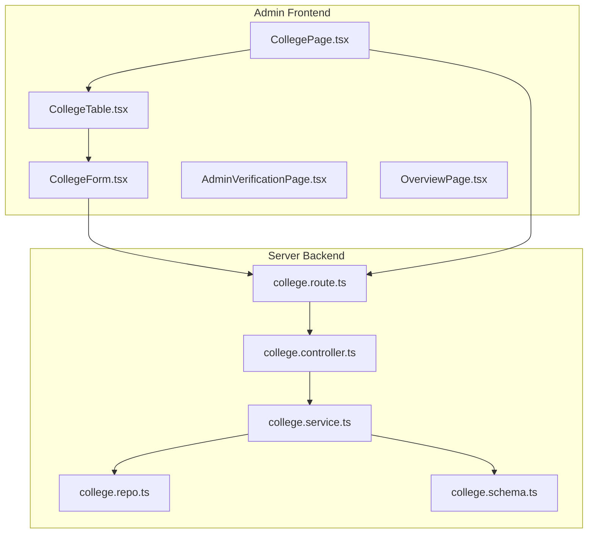
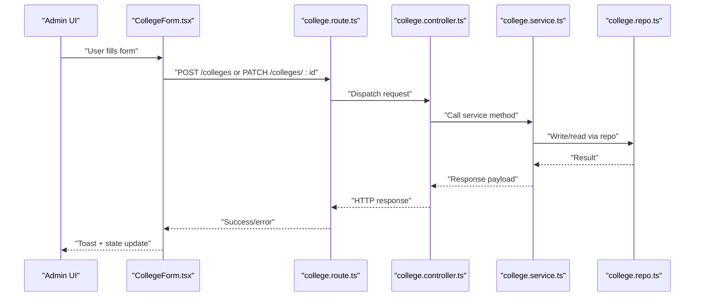
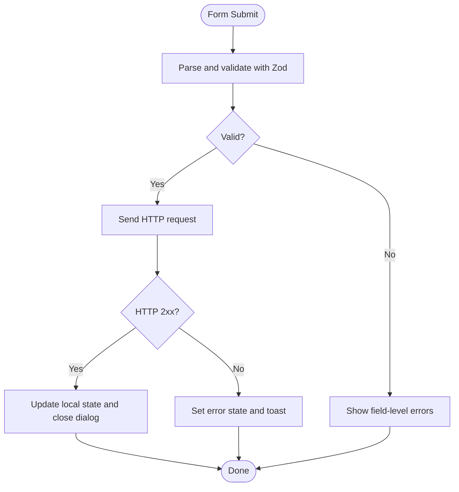
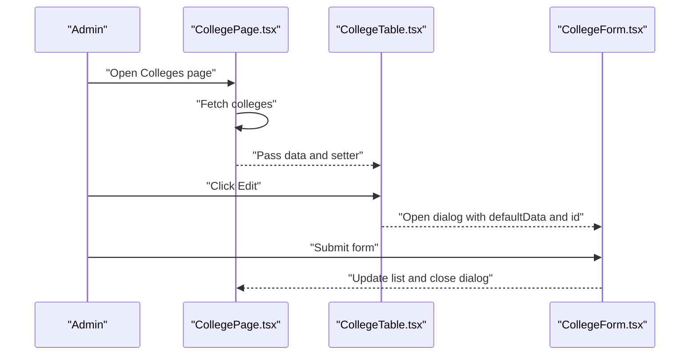
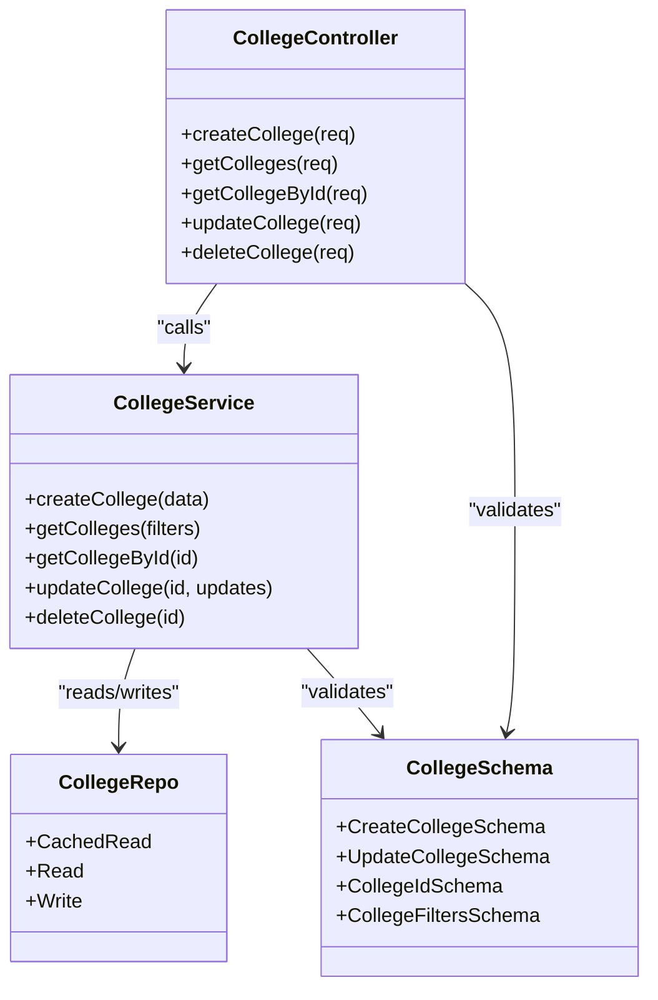
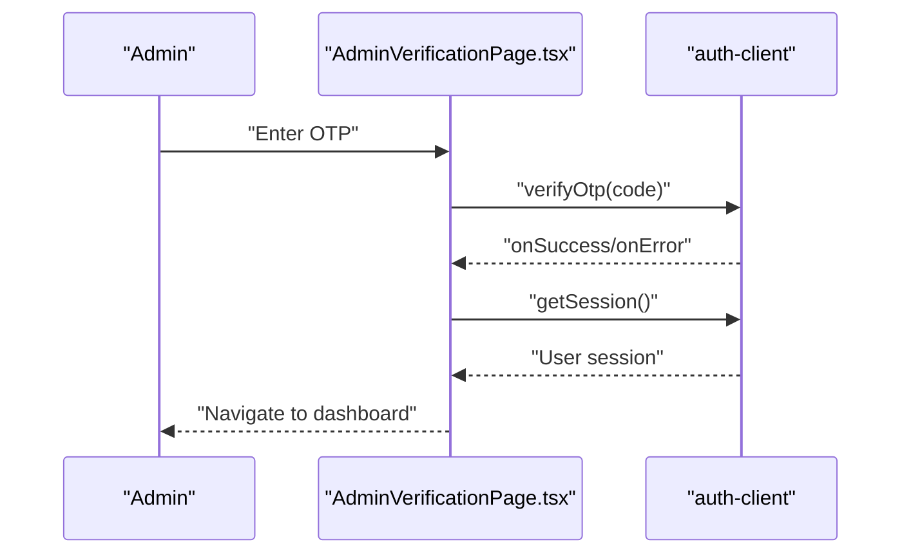
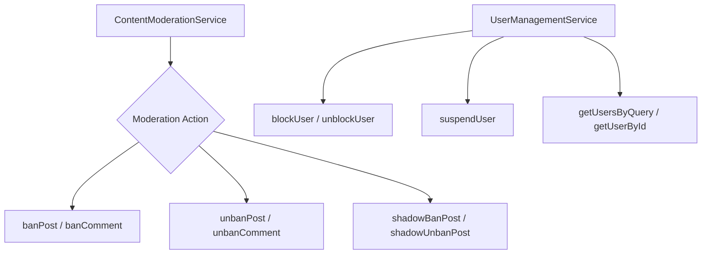
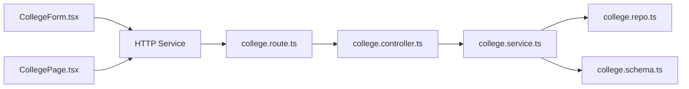

# College Administration

<cite>
**Referenced Files in This Document**
- [CollegeForm.tsx](file://admin/src/components/forms/CollegeForm.tsx)
- [CollegePage.tsx](file://admin/src/pages/CollegePage.tsx)
- [CollegeTable.tsx](file://admin/src/components/general/CollegeTable.tsx)
- [College.ts](file://admin/src/types/College.ts)
- [AdminVerificationPage.tsx](file://admin/src/pages/AdminVerificationPage.tsx)
- [college.controller.ts](file://server/src/modules/college/college.controller.ts)
- [college.service.ts](file://server/src/modules/college/college.service.ts)
- [college.schema.ts](file://server/src/modules/college/college.schema.ts)
- [college.repo.ts](file://server/src/modules/college/college.repo.ts)
- [college.route.ts](file://server/src/modules/college/college.route.ts)
- [content-moderation.service.ts](file://server/src/modules/content-report/content-moderation.service.ts)
- [user-management.service.ts](file://server/src/modules/content-report/user-management.service.ts)
- [OverviewPage.tsx](file://admin/src/pages/OverviewPage.tsx)
</cite>

## Table of Contents
1. [Introduction](#introduction)
2. [Project Structure](#project-structure)
3. [Core Components](#core-components)
4. [Architecture Overview](#architecture-overview)
5. [Detailed Component Analysis](#detailed-component-analysis)
6. [Dependency Analysis](#dependency-analysis)
7. [Performance Considerations](#performance-considerations)
8. [Troubleshooting Guide](#troubleshooting-guide)
9. [Conclusion](#conclusion)
10. [Appendices](#appendices)

## Introduction
This document describes the college administration system within the admin dashboard. It covers the college management interface, including institution registration, verification processes, and institutional data management. It documents the CollegeForm component with validation rules, data binding, and submission handling. It explains the college verification workflows, including document upload, identity confirmation, and institutional approval processes. It also covers branch and department management, course mapping, and academic program tracking, along with college-specific content moderation, user enrollment validation, and institutional reporting. Finally, it addresses integrations with student verification systems, domain validation, and enrollment database synchronization, and outlines bulk college operations, data import/export, and administrative workflows, including college analytics such as student demographics, content distribution, and institutional performance metrics.

## Project Structure
The college administration system spans the admin frontend and the server backend:
- Admin frontend: College management UI, forms, tables, and verification pages.
- Server backend: College CRUD endpoints, validation schemas, service layer, repository layer, and middleware.

**Diagram sources**
- [CollegePage.tsx](file://admin/src/pages/CollegePage.tsx#L1-L161)
- [CollegeTable.tsx](file://admin/src/components/general/CollegeTable.tsx#L1-L90)
- [CollegeForm.tsx](file://admin/src/components/forms/CollegeForm.tsx#L1-L216)
- [AdminVerificationPage.tsx](file://admin/src/pages/AdminVerificationPage.tsx#L1-L174)
- [OverviewPage.tsx](file://admin/src/pages/OverviewPage.tsx#L1-L80)
- [college.route.ts](file://server/src/modules/college/college.route.ts#L1-L16)
- [college.controller.ts](file://server/src/modules/college/college.controller.ts#L1-L66)
- [college.service.ts](file://server/src/modules/college/college.service.ts#L1-L149)
- [college.repo.ts](file://server/src/modules/college/college.repo.ts#L1-L33)
- [college.schema.ts](file://server/src/modules/college/college.schema.ts#L1-L26)

**Section sources**
- [CollegePage.tsx](file://admin/src/pages/CollegePage.tsx#L1-L161)
- [CollegeTable.tsx](file://admin/src/components/general/CollegeTable.tsx#L1-L90)
- [CollegeForm.tsx](file://admin/src/components/forms/CollegeForm.tsx#L1-L216)
- [college.route.ts](file://server/src/modules/college/college.route.ts#L1-L16)
- [college.controller.ts](file://server/src/modules/college/college.controller.ts#L1-L66)
- [college.service.ts](file://server/src/modules/college/college.service.ts#L1-L149)
- [college.repo.ts](file://server/src/modules/college/college.repo.ts#L1-L33)
- [college.schema.ts](file://server/src/modules/college/college.schema.ts#L1-L26)

## Core Components
- CollegeForm: A Zod-based validated form for creating and updating colleges with controlled inputs for name, email domain, profile URL, city, and state. Handles loading states, error propagation, and updates the parent list upon success.
- CollegeTable: Displays a paginated, sortable table of colleges with actions to edit via a modal form.
- CollegePage: Orchestrates fetching, creating, and rendering the college list; includes a dialog-based creation form.
- AdminVerificationPage: Manages two-factor verification for administrators, including OTP resend and validation.
- Backend College Module: Provides endpoints for create, list, get by id, update, and delete colleges, with strict validation and audit logging.

Key data model:
- ICollege: Defines the shape of a college entity with id, name, profile URL, email domain, city, and state.

**Section sources**
- [CollegeForm.tsx](file://admin/src/components/forms/CollegeForm.tsx#L1-L216)
- [CollegeTable.tsx](file://admin/src/components/general/CollegeTable.tsx#L1-L90)
- [CollegePage.tsx](file://admin/src/pages/CollegePage.tsx#L1-L161)
- [AdminVerificationPage.tsx](file://admin/src/pages/AdminVerificationPage.tsx#L1-L174)
- [College.ts](file://admin/src/types/College.ts#L1-L9)
- [college.controller.ts](file://server/src/modules/college/college.controller.ts#L1-L66)
- [college.service.ts](file://server/src/modules/college/college.service.ts#L1-L149)
- [college.schema.ts](file://server/src/modules/college/college.schema.ts#L1-L26)

## Architecture Overview
The admin dashboard integrates with the backend through typed HTTP requests. The frontend validates user input, submits to backend endpoints, and updates local state. The backend enforces strict validation, checks for domain conflicts, writes to storage, and records audit events.

**Diagram sources**
- [CollegeForm.tsx](file://admin/src/components/forms/CollegeForm.tsx#L59-L106)
- [college.route.ts](file://server/src/modules/college/college.route.ts#L10-L14)
- [college.controller.ts](file://server/src/modules/college/college.controller.ts#L8-L54)
- [college.service.ts](file://server/src/modules/college/college.service.ts#L14-L46)
- [college.repo.ts](file://server/src/modules/college/college.repo.ts#L26-L30)

## Detailed Component Analysis

### CollegeForm Component
- Validation: Uses Zod schema to validate name length, URL format for profile, minimum length for email domain, and enum constraints for city/state.
- Data binding: React Hook Form with controlled inputs; default values populated from props for editing.
- Submission: Sends POST for creation or PATCH for updates; handles success and failure, updates the parent list, and closes the dialog.
- Error handling: Displays Axios-based errors and shows user-friendly messages.

**Diagram sources**
- [CollegeForm.tsx](file://admin/src/components/forms/CollegeForm.tsx#L20-L28)
- [CollegeForm.tsx](file://admin/src/components/forms/CollegeForm.tsx#L59-L106)

**Section sources**
- [CollegeForm.tsx](file://admin/src/components/forms/CollegeForm.tsx#L1-L216)
- [College.ts](file://admin/src/types/College.ts#L1-L9)

### College Management Page and Table
- CollegePage: Fetches all colleges, renders a table, and provides a dialog to create new colleges. It manages local form state for creation and handles HTTP responses.
- CollegeTable: Renders a table with columns for name, profile preview, email domain, city, and state. Includes an action cell to open an edit dialog bound to CollegeForm.

**Diagram sources**
- [CollegePage.tsx](file://admin/src/pages/CollegePage.tsx#L25-L69)
- [CollegeTable.tsx](file://admin/src/components/general/CollegeTable.tsx#L23-L78)
- [CollegeForm.tsx](file://admin/src/components/forms/CollegeForm.tsx#L30-L94)

**Section sources**
- [CollegePage.tsx](file://admin/src/pages/CollegePage.tsx#L1-L161)
- [CollegeTable.tsx](file://admin/src/components/general/CollegeTable.tsx#L1-L90)

### Backend College Module
- Routes: Expose endpoints for creating, listing, retrieving by id, updating, and deleting colleges; protected by rate limiting and admin-only middleware.
- Controller: Parses request body/query/params using Zod schemas and delegates to the service.
- Service: Implements business logic including conflict checks for email domains, audit recording, and safe updates.
- Repo: Abstracts read/write operations with caching keys for efficient retrieval.
- Schema: Defines strict validation for create, update, filters, and id parsing.

**Diagram sources**
- [college.controller.ts](file://server/src/modules/college/college.controller.ts#L6-L65)
- [college.service.ts](file://server/src/modules/college/college.service.ts#L7-L148)
- [college.repo.ts](file://server/src/modules/college/college.repo.ts#L6-L31)
- [college.schema.ts](file://server/src/modules/college/college.schema.ts#L3-L26)

**Section sources**
- [college.route.ts](file://server/src/modules/college/college.route.ts#L1-L16)
- [college.controller.ts](file://server/src/modules/college/college.controller.ts#L1-L66)
- [college.service.ts](file://server/src/modules/college/college.service.ts#L1-L149)
- [college.repo.ts](file://server/src/modules/college/college.repo.ts#L1-L33)
- [college.schema.ts](file://server/src/modules/college/college.schema.ts#L1-L26)

### Verification Workflows
- AdminVerificationPage: Handles two-factor verification with OTP input, resend logic, and session refresh after successful verification. Integrates with the auth client for OTP send and verify callbacks.

**Diagram sources**
- [AdminVerificationPage.tsx](file://admin/src/pages/AdminVerificationPage.tsx#L69-L102)

**Section sources**
- [AdminVerificationPage.tsx](file://admin/src/pages/AdminVerificationPage.tsx#L1-L174)

### Content Moderation and User Management
- ContentModerationService: Provides actions to ban/unban and shadow-ban/unshadow-ban posts and comments, with report resolution and audit logging.
- UserManagementService: Supports blocking/unblocking users, suspending users with end dates, and querying users by email or username.

**Diagram sources**
- [content-moderation.service.ts](file://server/src/modules/content-report/content-moderation.service.ts#L6-L217)
- [user-management.service.ts](file://server/src/modules/content-report/user-management.service.ts#L5-L164)

**Section sources**
- [content-moderation.service.ts](file://server/src/modules/content-report/content-moderation.service.ts#L1-L220)
- [user-management.service.ts](file://server/src/modules/content-report/user-management.service.ts#L1-L166)

### Academic Program Tracking and Branch/Department Management
- The current codebase does not include explicit branch, department, or course mapping components. These features would typically involve:
  - Branch/department entities with foreign keys to colleges.
  - Course entities linked to branches and mapped to academic programs.
  - Enrollment tracking per student with validation against college email domains.
  - Analytics dashboards for student demographics and performance metrics.
- Implementation recommendations:
  - Define branch and department schemas and repositories.
  - Extend user registration to require a valid college email domain and branch assignment.
  - Integrate with OCR services for document verification and enrollment sync.

[No sources needed since this section provides conceptual guidance]

### Institutional Reporting and Analytics
- OverviewPage: Demonstrates a pattern for fetching dashboard metrics (users, posts, comments) from a backend endpoint.
- College analytics could include:
  - Student demographics by branch and year.
  - Content distribution by branch and topic.
  - Institutional performance metrics such as post/comment counts and moderation activity.

**Section sources**
- [OverviewPage.tsx](file://admin/src/pages/OverviewPage.tsx#L1-L80)

## Dependency Analysis
- Frontend-to-backend coupling:
  - CollegeForm and CollegePage depend on HTTP service abstractions and backend endpoints.
  - Backend routes depend on controllers, which depend on services and schemas.
- Internal dependencies:
  - Service layer depends on repository abstractions and caches keys.
  - Controllers depend on Zod schemas for validation.
- External integrations:
  - Auth client for two-factor verification.
  - Audit logging for administrative actions.

**Diagram sources**
- [CollegeForm.tsx](file://admin/src/components/forms/CollegeForm.tsx#L15)
- [CollegePage.tsx](file://admin/src/pages/CollegePage.tsx#L2-L3)
- [college.route.ts](file://server/src/modules/college/college.route.ts#L1-L16)
- [college.controller.ts](file://server/src/modules/college/college.controller.ts#L1-L66)
- [college.service.ts](file://server/src/modules/college/college.service.ts#L1-L149)
- [college.repo.ts](file://server/src/modules/college/college.repo.ts#L1-L33)
- [college.schema.ts](file://server/src/modules/college/college.schema.ts#L1-L26)

**Section sources**
- [CollegeForm.tsx](file://admin/src/components/forms/CollegeForm.tsx#L1-L216)
- [CollegePage.tsx](file://admin/src/pages/CollegePage.tsx#L1-L161)
- [college.route.ts](file://server/src/modules/college/college.route.ts#L1-L16)
- [college.controller.ts](file://server/src/modules/college/college.controller.ts#L1-L66)
- [college.service.ts](file://server/src/modules/college/college.service.ts#L1-L149)
- [college.repo.ts](file://server/src/modules/college/college.repo.ts#L1-L33)
- [college.schema.ts](file://server/src/modules/college/college.schema.ts#L1-L26)

## Performance Considerations
- Use caching for frequent reads of colleges by id and email domain to reduce database load.
- Batch operations for bulk college creation or updates to minimize network overhead.
- Debounce or throttle form submissions to avoid redundant API calls.
- Paginate and filter lists to limit payload sizes on the frontend.

[No sources needed since this section provides general guidance]

## Troubleshooting Guide
- Form validation errors:
  - Ensure Zod schema matches backend expectations; display field-specific messages returned from the server.
- Conflict errors:
  - Duplicate email domain during create/update will trigger a conflict; present a clear message and prevent submission.
- Network failures:
  - Handle Axios errors gracefully; show user-friendly messages and allow retry.
- Audit and logs:
  - Review backend logs for audit trails and error details to diagnose issues.

**Section sources**
- [CollegeForm.tsx](file://admin/src/components/forms/CollegeForm.tsx#L95-L105)
- [college.service.ts](file://server/src/modules/college/college.service.ts#L17-L33)
- [college.service.ts](file://server/src/modules/college/college.service.ts#L85-L102)

## Conclusion
The college administration system combines a robust backend module with a responsive admin frontend to manage institutions, enforce domain validation, and support verification workflows. The design emphasizes validation, auditability, and maintainable separation of concerns. Extending the system to include branch/department management, course mapping, and comprehensive analytics will further strengthen institutional oversight and operational efficiency.

[No sources needed since this section summarizes without analyzing specific files]

## Appendices

### API Definitions
- Create College
  - Method: POST
  - Path: /colleges
  - Body: { name, emailDomain, city, state, profile? }
  - Responses: 201 Created with { college }, 400/409/500 on error
- List Colleges
  - Method: GET
  - Path: /colleges
  - Query: { city?, state? }
  - Responses: 200 OK with { colleges, count }
- Get College by Id
  - Method: GET
  - Path: /colleges/:id
  - Responses: 200 OK with { college }, 404 Not Found
- Update College
  - Method: PATCH
  - Path: /colleges/:id
  - Body: { name?, emailDomain?, city?, state?, profile? }
  - Responses: 200 OK with { college }, 404/409 Not Found/Conflict
- Delete College
  - Method: DELETE
  - Path: /colleges/:id
  - Responses: 200 OK, 404 Not Found

**Section sources**
- [college.route.ts](file://server/src/modules/college/college.route.ts#L10-L14)
- [college.controller.ts](file://server/src/modules/college/college.controller.ts#L8-L62)
- [college.schema.ts](file://server/src/modules/college/college.schema.ts#L3-L26)