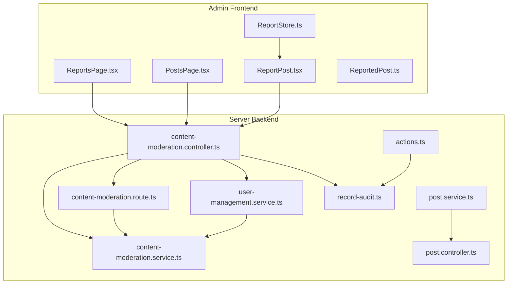
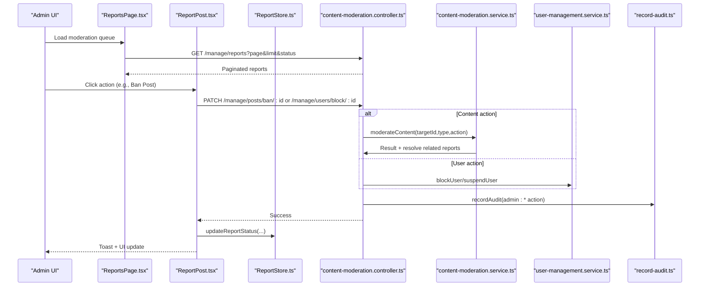
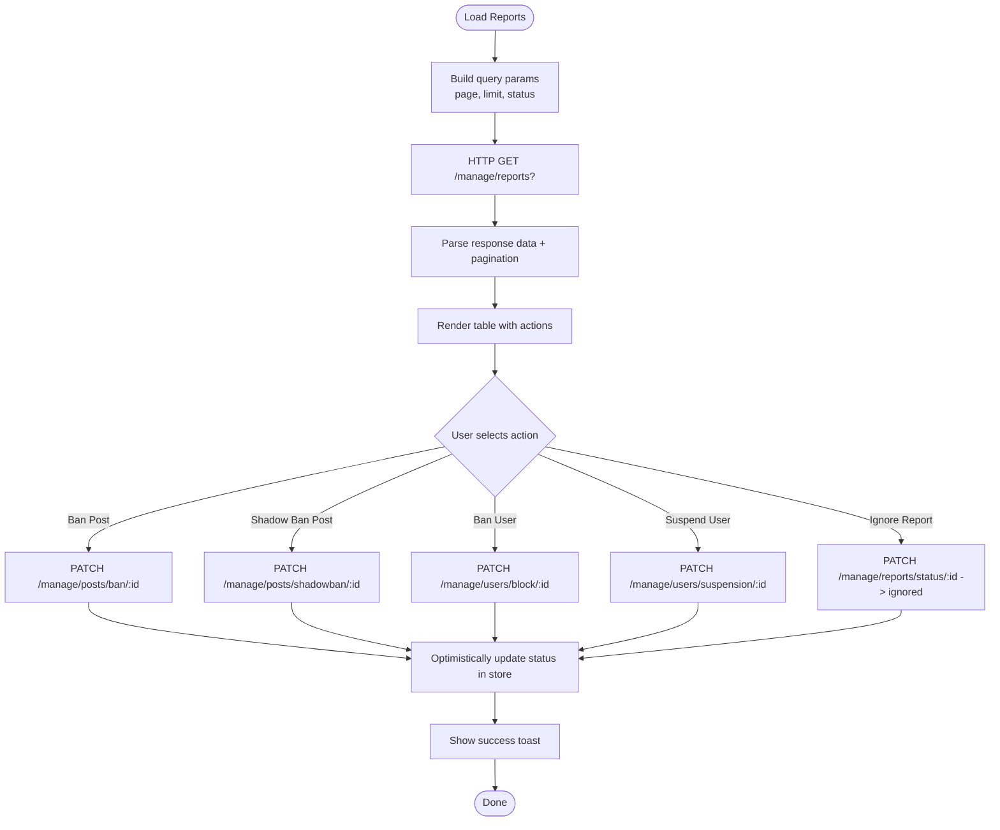
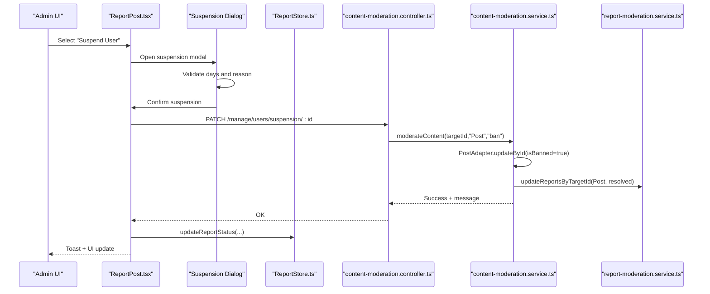
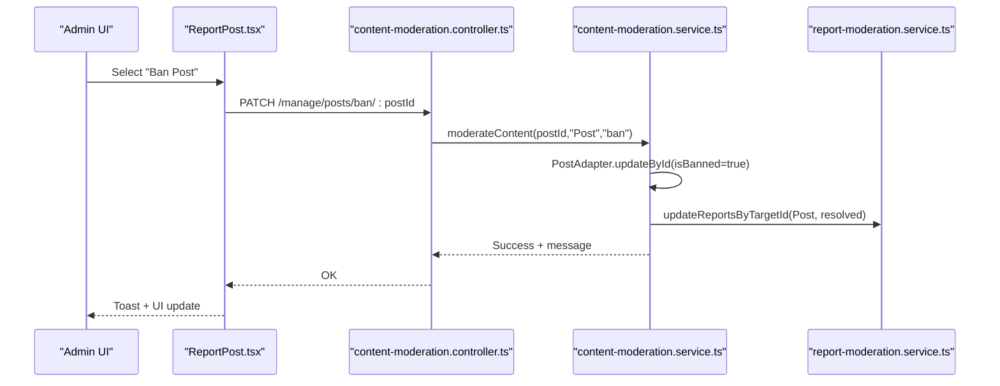
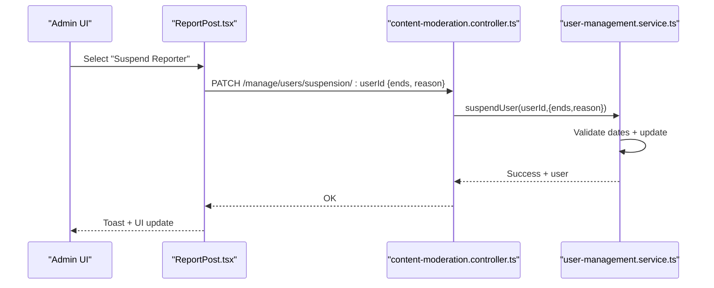
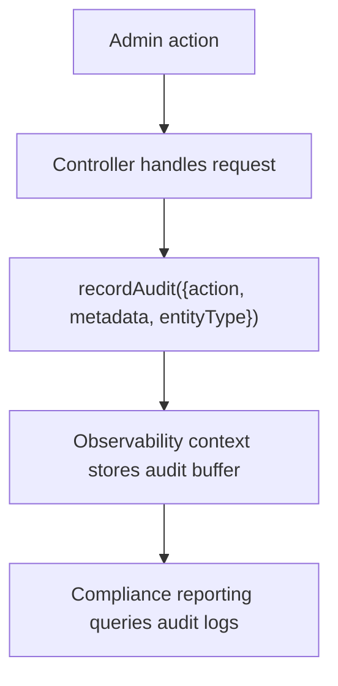
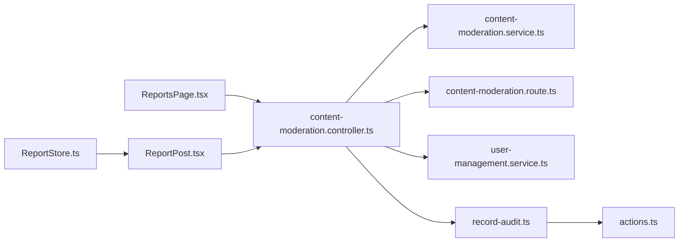

# Content Moderation

<cite>
**Referenced Files in This Document**
- [ReportsPage.tsx](file://admin/src/pages/ReportsPage.tsx)
- [ReportsPage.tsx](file://admin/src/pages/ReportsPage.tsx#L1-L122)
- [ReportPost.tsx](file://admin/src/components/general/ReportPost.tsx)
- [ReportPost.tsx](file://admin/src/components/general/ReportPost.tsx#L1-L503)
- [ReportStore.ts](file://admin/src/store/ReportStore.ts)
- [ReportStore.ts](file://admin/src/store/ReportStore.ts#L1-L43)
- [ReportedPost.ts](file://admin/src/types/ReportedPost.ts)
- [ReportedPost.ts](file://admin/src/types/ReportedPost.ts#L1-L28)
- [content-moderation.controller.ts](file://server/src/modules/moderation/content/content-moderation.controller.ts)
- [content-moderation.controller.ts](file://server/src/modules/moderation/content/content-moderation.controller.ts#L1-L78)
- [content-moderation.service.ts](file://server/src/modules/moderation/content/content-moderation.service.ts)
- [content-moderation.service.ts](file://server/src/modules/moderation/content/content-moderation.service.ts#L1-L221)
- [content-moderation.route.ts](file://server/src/modules/moderation/content/content-moderation.route.ts)
- [content-moderation.route.ts](file://server/src/modules/moderation/content/content-moderation.route.ts#L1-L15)
- [report-moderation.service.ts](file://server/src/modules/moderation/reports/report-moderation.service.ts)
- [report-moderation.service.ts](file://server/src/modules/moderation/reports/report-moderation.service.ts#L1-L159)
- [record-audit.ts](file://server/src/lib/record-audit.ts)
- [actions.ts](file://server/src/shared/constants/audit/actions.ts)
</cite>

## Update Summary
**Changes Made**
- Enhanced ReportPost component with sophisticated moderation capabilities including ban/unban, shadow ban, user suspension management, undo functionality, and improved visual feedback
- Updated moderation workflows and state management with new content moderation endpoints
- Added sophisticated suspension dialog with validation and user feedback
- Improved visual status indicators with enhanced badge styling and color coding
- Enhanced undo functionality supporting comprehensive action reversal

## Table of Contents
1. [Introduction](#introduction)
2. [Project Structure](#project-structure)
3. [Core Components](#core-components)
4. [Architecture Overview](#architecture-overview)
5. [Detailed Component Analysis](#detailed-component-analysis)
6. [Dependency Analysis](#dependency-analysis)
7. [Performance Considerations](#performance-considerations)
8. [Troubleshooting Guide](#troubleshooting-guide)
9. [Conclusion](#conclusion)

## Introduction
This document describes the content moderation system within the admin dashboard. It covers the post moderation workflow (review, approval/rejection, automated flagging), reporting management (categorization, investigation, resolution tracking), real-time monitoring (live updates, queues, filtering), report handling (user reports, violations, appeals), bulk moderation, content tagging/metadata, AI filtering integration, manual review workflows, team coordination, and audit/compliance reporting.

## Project Structure
The moderation system spans the admin frontend and the server backend:
- Admin pages and components render moderation queues and actions.
- Stores manage local state for reports and optimistic UI updates.
- Backend controllers expose endpoints for reports, moderation actions, user management, and content status updates.
- Services encapsulate business logic for content moderation, user management, and report lifecycle.
- Audit logging records administrative actions and decisions.

**Diagram sources**
- [ReportsPage.tsx](file://admin/src/pages/ReportsPage.tsx#L1-L122)
- [ReportPost.tsx](file://admin/src/components/general/ReportPost.tsx#L1-L503)
- [ReportStore.ts](file://admin/src/store/ReportStore.ts#L1-L43)
- [ReportedPost.ts](file://admin/src/types/ReportedPost.ts#L1-L28)
- [content-moderation.controller.ts](file://server/src/modules/moderation/content/content-moderation.controller.ts#L1-L78)
- [content-moderation.service.ts](file://server/src/modules/moderation/content/content-moderation.service.ts#L1-L221)
- [content-moderation.route.ts](file://server/src/modules/moderation/content/content-moderation.route.ts#L1-L15)

**Section sources**
- [ReportsPage.tsx](file://admin/src/pages/ReportsPage.tsx#L1-L122)
- [ReportPost.tsx](file://admin/src/components/general/ReportPost.tsx#L1-L503)
- [ReportStore.ts](file://admin/src/store/ReportStore.ts#L1-L43)
- [ReportedPost.ts](file://admin/src/types/ReportedPost.ts#L1-L28)
- [content-moderation.controller.ts](file://server/src/modules/moderation/content/content-moderation.controller.ts#L1-L78)
- [content-moderation.service.ts](file://server/src/modules/moderation/content/content-moderation.service.ts#L1-L221)
- [content-moderation.route.ts](file://server/src/modules/moderation/content/content-moderation.route.ts#L1-L15)

## Core Components
- Reporting Management Interface
  - Fetches paginated reports with status filters.
  - Renders actionable moderation queue with badges and dropdown menus.
  - Updates local state optimistically upon moderation actions.
- Post Moderation Workflow
  - Bans/unbans posts and shadow bans posts via moderation service.
  - Automatically resolves related reports when content status changes.
- User Management Actions
  - Blocks/unblocks users and applies suspensions with end dates and reasons.
- Audit Trail and Compliance
  - Records administrative actions with device metadata and audit context.
- Real-Time Monitoring
  - Admin pages support refresh and pagination; optimistic updates via store.

**Section sources**
- [ReportsPage.tsx](file://admin/src/pages/ReportsPage.tsx#L20-L96)
- [ReportPost.tsx](file://admin/src/components/general/ReportPost.tsx#L20-L220)
- [ReportStore.ts](file://admin/src/store/ReportStore.ts#L11-L43)
- [content-moderation.controller.ts](file://server/src/modules/moderation/content/content-moderation.controller.ts#L73-L149)
- [content-moderation.service.ts](file://server/src/modules/moderation/content/content-moderation.service.ts#L6-L220)
- [user-management.service.ts](file://server/src/modules/moderation/user/user-management.service.ts#L6-L166)
- [record-audit.ts](file://server/src/lib/record-audit.ts#L4-L20)
- [actions.ts](file://server/src/shared/constants/audit/actions.ts#L31-L44)

## Architecture Overview
The moderation workflow connects admin UI actions to backend controllers, services, and persistence. Controllers validate inputs, delegate to services, and record audit events. Services encapsulate domain logic for content moderation and user management, updating related reports and content status accordingly.

**Diagram sources**
- [ReportsPage.tsx](file://admin/src/pages/ReportsPage.tsx#L29-L70)
- [ReportPost.tsx](file://admin/src/components/general/ReportPost.tsx#L23-L85)
- [ReportStore.ts](file://admin/src/store/ReportStore.ts#L14-L26)
- [content-moderation.controller.ts](file://server/src/modules/moderation/content/content-moderation.controller.ts#L73-L149)
- [content-moderation.service.ts](file://server/src/modules/moderation/content/content-moderation.service.ts#L182-L217)
- [user-management.service.ts](file://server/src/modules/moderation/user/user-management.service.ts#L6-L166)
- [record-audit.ts](file://server/src/lib/record-audit.ts#L4-L17)

## Detailed Component Analysis

### Reporting Management Interface
- Responsibilities
  - Fetch reports with pagination and status filters.
  - Render a table with target post, reporter, reason, message, and status badges.
  - Provide dropdown actions for moderation decisions.
  - Update local state to reflect status changes immediately.
- Data Model
  - Uses ReportedPost type grouping reports per target with nested reporter details.
- UI/UX
  - Refresh button triggers reload.
  - Empty state messaging when no reports are found.
  - Status badges reflect pending/resolved/ignored with distinct variants.

**Diagram sources**
- [ReportsPage.tsx](file://admin/src/pages/ReportsPage.tsx#L29-L70)
- [ReportPost.tsx](file://admin/src/components/general/ReportPost.tsx#L23-L85)
- [ReportStore.ts](file://admin/src/store/ReportStore.ts#L14-L26)

**Section sources**
- [ReportsPage.tsx](file://admin/src/pages/ReportsPage.tsx#L20-L96)
- [ReportPost.tsx](file://admin/src/components/general/ReportPost.tsx#L20-L220)
- [ReportStore.ts](file://admin/src/store/ReportStore.ts#L1-L43)
- [ReportedPost.ts](file://admin/src/types/ReportedPost.ts#L1-L28)

### Enhanced ReportPost Component with Sophisticated Moderation Capabilities
**Updated** The ReportPost component now includes advanced moderation functionality with comprehensive action support and improved user experience.

- Enhanced Action Types
  - Supports comprehensive moderation actions: BAN_POST, UNBAN_POST, SHADOW_BAN_POST, SHADOW_UNBAN_POST, BAN_USER, UNBAN_USER, SUSPEND_USER, UNSUSPEND_USER, BAN_REPORTER, UNBAN_REPORTER, SUSPEND_REPORTER, UNSUSPEND_REPORTER, IGNORE_REPORT, MARK_PENDING, UNDO_ALL_ACTIONS.
  - Includes sophisticated undo functionality that reverses all applied actions atomically.
- Advanced Suspension Management
  - Implements dedicated suspension dialog with validation for days and reason fields.
  - Supports both user and reporter suspensions with configurable duration.
  - Provides real-time suspension status checking with active suspension detection.
- Enhanced Visual Feedback
  - Improved badge styling with custom color schemes for different states.
  - Dynamic status indicators with hover effects and opacity transitions.
  - Enhanced dropdown menu with proper disabled states and conditional visibility.
- Sophisticated State Management
  - Atomic action execution with Promise.allSettled for undo operations.
  - Comprehensive error handling with user-friendly toast notifications.
  - Optimistic UI updates with proper loading states and busy indicators.

**Diagram sources**
- [ReportPost.tsx](file://admin/src/components/general/ReportPost.tsx#L34-L40)
- [content-moderation.controller.ts](file://server/src/modules/moderation/content/content-moderation.controller.ts#L119-L149)
- [content-moderation.service.ts](file://server/src/modules/moderation/content/content-moderation.service.ts#L7-L41)
- [report-moderation.service.ts](file://server/src/modules/moderation/reports/report-moderation.service.ts#L112-L127)

**Section sources**
- [ReportPost.tsx](file://admin/src/components/general/ReportPost.tsx#L15-L31)
- [ReportPost.tsx](file://admin/src/components/general/ReportPost.tsx#L92-L207)
- [ReportPost.tsx](file://admin/src/components/general/ReportPost.tsx#L324-L440)
- [ReportPost.tsx](file://admin/src/components/general/ReportPost.tsx#L452-L499)

### Post Moderation Workflow
- Actions Supported
  - Ban/Unban posts.
  - Shadow ban/unban posts.
  - Update content status via a single endpoint delegating to moderation service.
- Behavior
  - On successful ban/shadow ban, related reports for the target are automatically updated to resolved.
  - Unban toggles the flag back to false.
- Validation
  - Controllers validate parameters and body payloads.
  - Services enforce existence and current state checks before mutation.

**Diagram sources**
- [ReportPost.tsx](file://admin/src/components/general/ReportPost.tsx#L34-L40)
- [content-moderation.controller.ts](file://server/src/modules/moderation/content/content-moderation.controller.ts#L119-L149)
- [content-moderation.service.ts](file://server/src/modules/moderation/content/content-moderation.service.ts#L7-L41)
- [report-moderation.service.ts](file://server/src/modules/moderation/reports/report-moderation.service.ts#L112-L127)

**Section sources**
- [content-moderation.controller.ts](file://server/src/modules/moderation/content/content-moderation.controller.ts#L119-L149)
- [content-moderation.service.ts](file://server/src/modules/moderation/content/content-moderation.service.ts#L6-L220)
- [report-moderation.service.ts](file://server/src/modules/moderation/reports/report-moderation.service.ts#L112-L127)

### User Management Actions
- Actions Supported
  - Block/unblock users.
  - Suspend users with end date and reason.
  - Retrieve suspension status and search users by email/username.
- Validation
  - Controllers validate inputs and enforce business rules (e.g., future end date).
  - Services check existence and current state before mutation.

**Diagram sources**
- [ReportPost.tsx](file://admin/src/components/general/ReportPost.tsx#L52-L67)
- [content-moderation.controller.ts](file://server/src/modules/moderation/content/content-moderation.controller.ts#L177-L199)
- [user-management.service.ts](file://server/src/modules/moderation/user/user-management.service.ts#L72-L107)

**Section sources**
- [content-moderation.controller.ts](file://server/src/modules/moderation/content/content-moderation.controller.ts#L151-L205)
- [user-management.service.ts](file://server/src/modules/moderation/user/user-management.service.ts#L6-L166)

### Audit Trail and Compliance Reporting
- Recording
  - Controllers call recordAudit with standardized audit actions for admin operations.
  - record-audit enriches entries with device metadata from observability context.
- Audit Actions
  - Includes admin:* actions for bans, suspensions, report status updates, and bulk deletions.
- Compliance
  - All moderation actions are logged with metadata enabling compliance reporting.

**Diagram sources**
- [content-moderation.controller.ts](file://server/src/modules/moderation/content/content-moderation.controller.ts#L79-L96)
- [record-audit.ts](file://server/src/lib/record-audit.ts#L4-L17)
- [actions.ts](file://server/src/shared/constants/audit/actions.ts#L31-L44)

**Section sources**
- [content-moderation.controller.ts](file://server/src/modules/moderation/content/content-moderation.controller.ts#L79-L115)
- [record-audit.ts](file://server/src/lib/record-audit.ts#L1-L20)
- [actions.ts](file://server/src/shared/constants/audit/actions.ts#L1-L66)

### Real-Time Monitoring and Moderation Queues
- Real-Time Updates
  - Admin pages support manual refresh via a button.
  - Local store optimistically updates UI after actions.
- Filtering and Pagination
  - Pages accept page, limit, and status filters.
  - Pagination totals computed from server responses.

**Section sources**
- [PostsPage.tsx](file://admin/src/pages/PostsPage.tsx#L20-L41)
- [ReportsPage.tsx](file://admin/src/pages/ReportsPage.tsx#L29-L70)
- [ReportStore.ts](file://admin/src/store/ReportStore.ts#L14-L26)

### Bulk Moderation Operations
- Supported
  - Bulk delete reports via controller and service.
  - Audit recorded for bulk deletion with deleted counts.
- Usage
  - Admin can select multiple reports and trigger bulk delete.

**Section sources**
- [content-moderation.controller.ts](file://server/src/modules/moderation/content/content-moderation.controller.ts#L101-L117)
- [report-moderation.service.ts](file://server/src/modules/moderation/reports/report-moderation.service.ts#L141-L156)

### Content Tagging and Metadata Management
- Post Metadata
  - Posts include flags for isBanned and isShadowBanned.
  - UI displays badges for banned and shadowbanned states.
- Reporting Metadata
  - Reports include reason, message, and status.
  - Target details include identifiers and flags.

**Section sources**
- [Post.ts](file://admin/src/types/Post.ts#L8-L9)
- [ReportedPost.ts](file://admin/src/types/ReportedPost.ts#L2-L27)

### AI Content Filtering Integration
- Current Implementation
  - No explicit AI filtering module is present in the reviewed files.
- Recommended Integration Pattern
  - Integrate AI filtering upstream of content creation or updates.
  - On flagged content, create reports and place content under review with shadow ban if necessary.
  - Use audit actions to track AI-triggered moderation decisions.

### Manual Review Workflows and Team Coordination
- Manual Review
  - Admins review reports in the moderation queue.
  - Actions include ban, shadow ban, user penalties, and ignoring reports.
- Team Coordination
  - Use audit logs to track who performed actions and when.
  - Combine with user search and suspension status checks for coordinated enforcement.

**Section sources**
- [ReportPost.tsx](file://admin/src/components/general/ReportPost.tsx#L167-L206)
- [content-moderation.controller.ts](file://server/src/modules/moderation/content/content-moderation.controller.ts#L73-L149)
- [user-management.service.ts](file://server/src/modules/moderation/user/user-management.service.ts#L109-L119)

### Appeal Processes
- Current Implementation
  - No dedicated appeal endpoints or workflows are present in the reviewed files.
- Recommended Flow
  - Add an appeal resource linked to reports.
  - Allow users to submit appeals; admins review and escalate to higher authorities if needed.
  - Record appeal decisions in audit logs.

## Dependency Analysis
- Admin-to-Backend Dependencies
  - ReportsPage and ReportPost depend on content-moderation controller endpoints.
  - ReportStore depends on ReportedPost type and update functions.
- Backend Cohesion
  - ContentModerationController orchestrates report CRUD, moderation actions, and user management.
  - ContentModerationService and UserManagementService encapsulate domain logic.
  - Audit recording is centralized via record-audit and actions constants.

**Diagram sources**
- [ReportsPage.tsx](file://admin/src/pages/ReportsPage.tsx#L1-L96)
- [ReportPost.tsx](file://admin/src/components/general/ReportPost.tsx#L1-L220)
- [ReportStore.ts](file://admin/src/store/ReportStore.ts#L1-L43)
- [content-moderation.controller.ts](file://server/src/modules/moderation/content/content-moderation.controller.ts#L1-L246)
- [content-moderation.service.ts](file://server/src/modules/moderation/content/content-moderation.service.ts#L1-L159)
- [content-moderation.route.ts](file://server/src/modules/moderation/content/content-moderation.route.ts#L1-L15)
- [user-management.service.ts](file://server/src/modules/moderation/user/user-management.service.ts#L1-L166)
- [record-audit.ts](file://server/src/lib/record-audit.ts#L1-L20)
- [actions.ts](file://server/src/shared/constants/audit/actions.ts#L1-L66)

**Section sources**
- [content-moderation.controller.ts](file://server/src/modules/moderation/content/content-moderation.controller.ts#L1-L246)
- [content-moderation.service.ts](file://server/src/modules/moderation/content/content-moderation.service.ts#L1-L159)
- [content-moderation.route.ts](file://server/src/modules/moderation/content/content-moderation.route.ts#L1-L15)
- [user-management.service.ts](file://server/src/modules/moderation/user/user-management.service.ts#L1-L166)
- [record-audit.ts](file://server/src/lib/record-audit.ts#L1-L20)
- [actions.ts](file://server/src/shared/constants/audit/actions.ts#L1-L66)

## Performance Considerations
- Pagination and Filtering
  - Use page and limit parameters to avoid large payloads.
  - Filter by status to reduce rendering and network overhead.
- Optimistic UI Updates
  - Update local state immediately after actions to improve perceived performance.
  - Revert UI on failure and surface user-friendly messages.
- Caching and Reads
  - Prefer cached reads for listing reports and posts where appropriate.
- Audit Sampling
  - Logging includes sampling logic to balance observability and performance.

## Troubleshooting Guide
- Common Issues
  - Invalid status values when updating report status.
  - Post/User not found during moderation actions.
  - Suspension end date not in the future.
- Error Handling Patterns
  - Controllers validate inputs and return structured errors.
  - Services throw HTTP errors with appropriate status codes.
  - UI surfaces toast notifications for failures and successes.

**Section sources**
- [report-moderation.service.ts](file://server/src/modules/moderation/reports/report-moderation.service.ts#L93-L110)
- [content-moderation.service.ts](file://server/src/modules/moderation/content/content-moderation.service.ts#L10-L25)
- [user-management.service.ts](file://server/src/modules/moderation/user/user-management.service.ts#L84-L88)
- [ReportPost.tsx](file://admin/src/components/general/ReportPost.tsx#L78-L84)

## Conclusion
The admin dashboard's content moderation system integrates reporting, post moderation, user management, and audit logging. Admins can review reports, take immediate moderation actions, and track outcomes through audit trails. To further strengthen the system, consider integrating AI content filtering upstream, implementing formal appeal workflows, and enhancing real-time updates with server-sent events or WebSocket subscriptions.