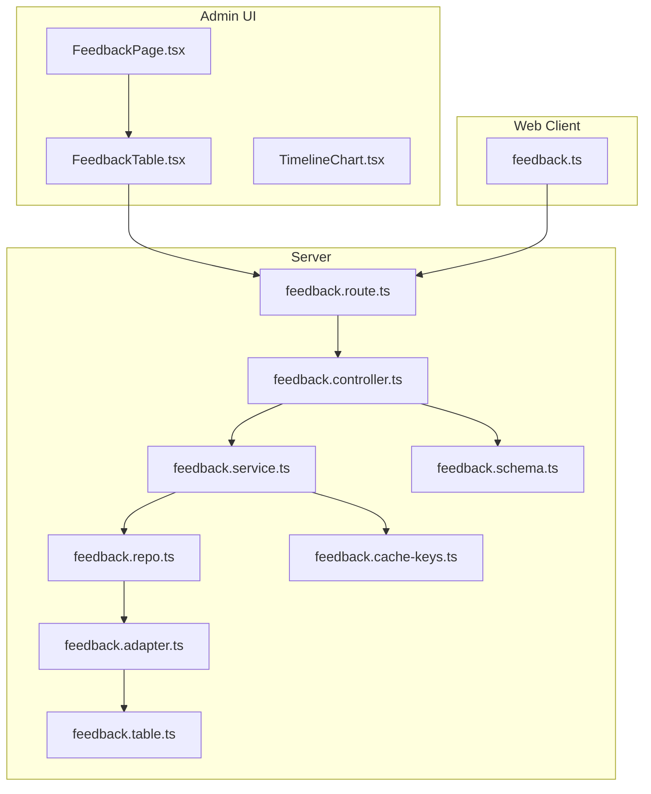
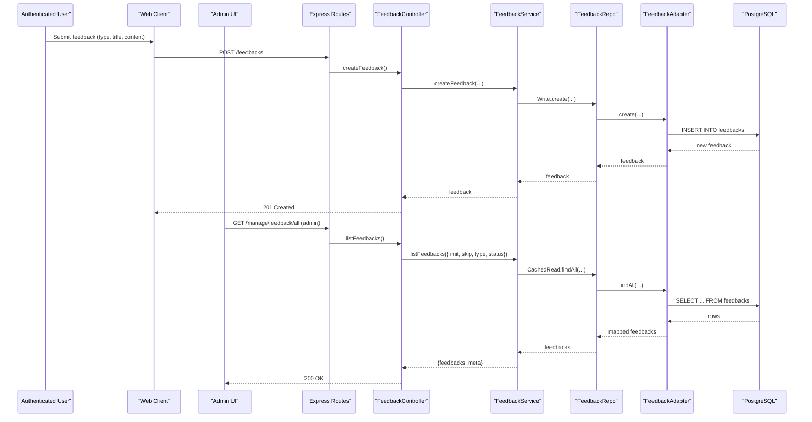
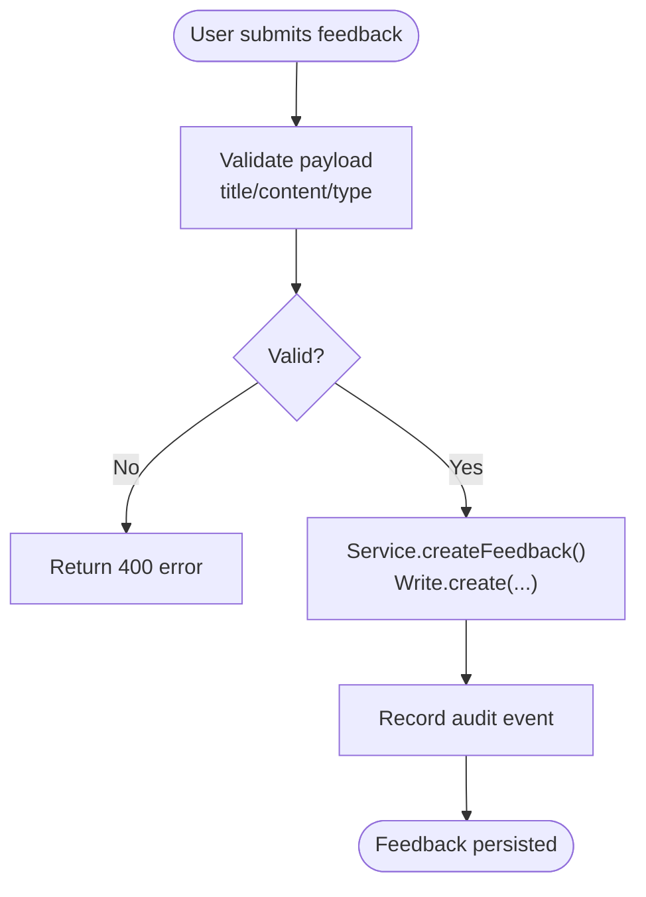
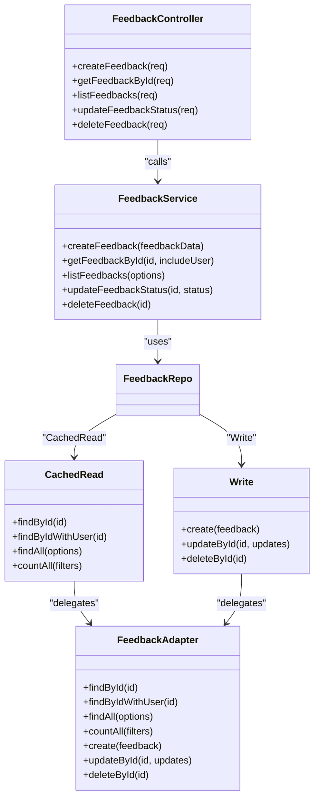

# Feedback Management

<cite>
**Referenced Files in This Document**
- [FeedbackPage.tsx](file://admin/src/pages/FeedbackPage.tsx)
- [FeedbackTable.tsx](file://admin/src/components/general/FeedbackTable.tsx)
- [Feedback.ts](file://admin/src/types/Feedback.ts)
- [TimelineChart.tsx](file://admin/src/components/charts/TimelineChart.tsx)
- [feedback.controller.ts](file://server/src/modules/feedback/feedback.controller.ts)
- [feedback.service.ts](file://server/src/modules/feedback/feedback.service.ts)
- [feedback.repo.ts](file://server/src/modules/feedback/feedback.repo.ts)
- [feedback.schema.ts](file://server/src/modules/feedback/feedback.schema.ts)
- [feedback.adapter.ts](file://server/src/infra/db/adapters/feedback.adapter.ts)
- [feedback.table.ts](file://server/src/infra/db/tables/feedback.table.ts)
- [feedback.route.ts](file://server/src/modules/feedback/feedback.route.ts)
- [feedback.cache-keys.ts](file://server/src/modules/feedback/feedback.cache-keys.ts)
- [feedback.ts](file://web/src/services/api/feedback.ts)
</cite>

## Table of Contents
1. [Introduction](#introduction)
2. [Project Structure](#project-structure)
3. [Core Components](#core-components)
4. [Architecture Overview](#architecture-overview)
5. [Detailed Component Analysis](#detailed-component-analysis)
6. [Dependency Analysis](#dependency-analysis)
7. [Performance Considerations](#performance-considerations)
8. [Troubleshooting Guide](#troubleshooting-guide)
9. [Conclusion](#conclusion)
10. [Appendices](#appendices)

## Introduction
This document describes the feedback management system in the admin dashboard. It covers how feedback is collected from users, how it is presented and curated in the admin UI, and how it is stored and processed on the backend. It also outlines current capabilities and highlights areas where advanced features such as sentiment analysis, triage workflows, resolution tracking, and reporting metrics are not yet implemented in the repository snapshot.

## Project Structure
The feedback management system spans three layers:
- Frontend admin UI: displays feedback, allows status updates and deletion, and provides basic analytics visuals.
- Backend API: exposes endpoints for creating, listing, updating status, and deleting feedback; enforces admin-only access and rate limits.
- Data persistence: Drizzle ORM-backed PostgreSQL table with caching and audit logging.

**Diagram sources**
- [FeedbackPage.tsx](file://admin/src/pages/FeedbackPage.tsx#L1-L37)
- [FeedbackTable.tsx](file://admin/src/components/general/FeedbackTable.tsx#L1-L131)
- [TimelineChart.tsx](file://admin/src/components/charts/TimelineChart.tsx#L1-L47)
- [feedback.ts](file://web/src/services/api/feedback.ts#L1-L8)
- [feedback.route.ts](file://server/src/modules/feedback/feedback.route.ts#L1-L25)
- [feedback.controller.ts](file://server/src/modules/feedback/feedback.controller.ts#L1-L62)
- [feedback.service.ts](file://server/src/modules/feedback/feedback.service.ts#L1-L162)
- [feedback.repo.ts](file://server/src/modules/feedback/feedback.repo.ts#L1-L75)
- [feedback.adapter.ts](file://server/src/infra/db/adapters/feedback.adapter.ts#L1-L184)
- [feedback.cache-keys.ts](file://server/src/modules/feedback/feedback.cache-keys.ts#L1-L9)
- [feedback.schema.ts](file://server/src/modules/feedback/feedback.schema.ts#L1-L24)
- [feedback.table.ts](file://server/src/infra/db/tables/feedback.table.ts#L1-L33)

**Section sources**
- [FeedbackPage.tsx](file://admin/src/pages/FeedbackPage.tsx#L1-L37)
- [FeedbackTable.tsx](file://admin/src/components/general/FeedbackTable.tsx#L1-L131)
- [feedback.route.ts](file://server/src/modules/feedback/feedback.route.ts#L1-L25)
- [feedback.controller.ts](file://server/src/modules/feedback/feedback.controller.ts#L1-L62)
- [feedback.service.ts](file://server/src/modules/feedback/feedback.service.ts#L1-L162)
- [feedback.adapter.ts](file://server/src/infra/db/adapters/feedback.adapter.ts#L1-L184)
- [feedback.table.ts](file://server/src/infra/db/tables/feedback.table.ts#L1-L33)

## Core Components
- Feedback creation endpoint: authenticated users submit feedback via the web client; the server validates input and persists it with a default status.
- Admin feedback listing: admins can list feedback with optional filters by type and status, and pagination controls.
- Admin feedback actions: admins can mark feedback as reviewed or dismissed, and delete feedback.
- Data model: feedback records include identifiers, user association, type, title, content, status, and timestamps.
- Persistence: Drizzle ORM with PostgreSQL; caching keys for list and counts; audit logging on create/update/delete.

**Section sources**
- [feedback.ts](file://web/src/services/api/feedback.ts#L1-L8)
- [feedback.controller.ts](file://server/src/modules/feedback/feedback.controller.ts#L1-L62)
- [feedback.service.ts](file://server/src/modules/feedback/feedback.service.ts#L1-L162)
- [feedback.schema.ts](file://server/src/modules/feedback/feedback.schema.ts#L1-L24)
- [Feedback.ts](file://admin/src/types/Feedback.ts#L1-L13)
- [feedback.adapter.ts](file://server/src/infra/db/adapters/feedback.adapter.ts#L1-L184)
- [feedback.table.ts](file://server/src/infra/db/tables/feedback.table.ts#L1-L33)
- [FeedbackTable.tsx](file://admin/src/components/general/FeedbackTable.tsx#L1-L131)
- [FeedbackPage.tsx](file://admin/src/pages/FeedbackPage.tsx#L1-L37)

## Architecture Overview
The system follows a layered architecture:
- Presentation layer: Admin UI renders feedback lists and actions.
- API layer: Express routes guarded by authentication and admin-only middleware.
- Service layer: Business logic for creating, listing, updating status, and deleting feedback.
- Repository and adapter layer: Encapsulate reads/writes and caching.
- Data layer: PostgreSQL table with foreign key to user table.

**Diagram sources**
- [feedback.ts](file://web/src/services/api/feedback.ts#L1-L8)
- [feedback.route.ts](file://server/src/modules/feedback/feedback.route.ts#L1-L25)
- [feedback.controller.ts](file://server/src/modules/feedback/feedback.controller.ts#L1-L62)
- [feedback.service.ts](file://server/src/modules/feedback/feedback.service.ts#L1-L162)
- [feedback.repo.ts](file://server/src/modules/feedback/feedback.repo.ts#L1-L75)
- [feedback.adapter.ts](file://server/src/infra/db/adapters/feedback.adapter.ts#L1-L184)
- [feedback.table.ts](file://server/src/infra/db/tables/feedback.table.ts#L1-L33)

## Detailed Component Analysis

### Feedback Collection Interface
- Submission from web client: The web service posts feedback with type, title, and content.
- Validation: Server-side Zod schemas enforce constraints on length and allowed values.
- Persistence: Service creates feedback with default status and records audit metadata.
- Admin listing: Admin page fetches paginated feedback with optional filters.

**Diagram sources**
- [feedback.ts](file://web/src/services/api/feedback.ts#L1-L8)
- [feedback.schema.ts](file://server/src/modules/feedback/feedback.schema.ts#L1-L24)
- [feedback.service.ts](file://server/src/modules/feedback/feedback.service.ts#L1-L162)
- [feedback.adapter.ts](file://server/src/infra/db/adapters/feedback.adapter.ts#L1-L184)

**Section sources**
- [feedback.ts](file://web/src/services/api/feedback.ts#L1-L8)
- [feedback.schema.ts](file://server/src/modules/feedback/feedback.schema.ts#L1-L24)
- [feedback.service.ts](file://server/src/modules/feedback/feedback.service.ts#L1-L162)
- [FeedbackPage.tsx](file://admin/src/pages/FeedbackPage.tsx#L1-L37)

### Feedback Categorization and Priority Assignment
- Types: feedback supports enumerated categories for classification.
- Status lifecycle: feedback starts with a default status and can be marked reviewed or dismissed by admins.
- Priority: Not implemented in the current codebase; future enhancements could introduce priority fields and automated scoring.

**Section sources**
- [feedback.schema.ts](file://server/src/modules/feedback/feedback.schema.ts#L1-L24)
- [feedback.service.ts](file://server/src/modules/feedback/feedback.service.ts#L1-L162)
- [Feedback.ts](file://admin/src/types/Feedback.ts#L1-L13)

### Feedback Analysis Tools
- Current admin visuals: A timeline chart component is present for rendering expression-duration timelines; however, the backend does not expose sentiment analysis or trend endpoints in this snapshot.
- Future enhancements: Integrate analytics endpoints for sentiment, top themes, and seasonal trends.

**Section sources**
- [TimelineChart.tsx](file://admin/src/components/charts/TimelineChart.tsx#L1-L47)

### Feedback Resolution Workflow
- Triage: Admins can review feedback entries and change status to reviewed or dismissed.
- Assignment and timelines: Not implemented in the current codebase; future enhancements could include assignee fields, SLA tracking, and resolution stages.
- Bulk operations: Not implemented; future enhancements could add batch status updates and exports.

**Section sources**
- [FeedbackTable.tsx](file://admin/src/components/general/FeedbackTable.tsx#L1-L131)
- [feedback.controller.ts](file://server/src/modules/feedback/feedback.controller.ts#L1-L62)
- [feedback.service.ts](file://server/src/modules/feedback/feedback.service.ts#L1-L162)

### Feedback Reporting System
- Admin listing supports pagination and filters by type and status.
- Metrics: Response times, satisfaction scores, and improvement tracking are not exposed in the current backend endpoints.
- Export: Not implemented; future enhancements could add CSV/JSON export endpoints.

**Section sources**
- [FeedbackPage.tsx](file://admin/src/pages/FeedbackPage.tsx#L1-L37)
- [FeedbackTable.tsx](file://admin/src/components/general/FeedbackTable.tsx#L1-L131)
- [feedback.controller.ts](file://server/src/modules/feedback/feedback.controller.ts#L1-L62)

### Integration with Customer Support Systems
- No webhook or third-party integration endpoints are present in the current codebase.
- Automated responses and follow-ups are not implemented; future enhancements could add integrations with ticketing systems and templated replies.

**Section sources**
- [feedback.route.ts](file://server/src/modules/feedback/feedback.route.ts#L1-L25)

### Filtering and Export Capabilities
- Filtering: Admin listing supports type and status filters.
- Export: Not implemented; future enhancements could add export endpoints for filtered datasets.

**Section sources**
- [feedback.schema.ts](file://server/src/modules/feedback/feedback.schema.ts#L1-L24)
- [FeedbackTable.tsx](file://admin/src/components/general/FeedbackTable.tsx#L1-L131)

### Feedback Analytics
- Common themes and sentiment: Not implemented in the current backend.
- Seasonal trends: Not implemented; future enhancements could compute aggregates by date ranges and categories.

**Section sources**
- [feedback.adapter.ts](file://server/src/infra/db/adapters/feedback.adapter.ts#L1-L184)
- [feedback.table.ts](file://server/src/infra/db/tables/feedback.table.ts#L1-L33)

### Integration with External Feedback Platforms and Surveys
- No external platform integrations are present in the current codebase.
- Survey automation endpoints are not implemented; future enhancements could add triggers and webhooks.

**Section sources**
- [feedback.route.ts](file://server/src/modules/feedback/feedback.route.ts#L1-L25)

## Dependency Analysis

**Diagram sources**
- [feedback.controller.ts](file://server/src/modules/feedback/feedback.controller.ts#L1-L62)
- [feedback.service.ts](file://server/src/modules/feedback/feedback.service.ts#L1-L162)
- [feedback.repo.ts](file://server/src/modules/feedback/feedback.repo.ts#L1-L75)
- [feedback.adapter.ts](file://server/src/infra/db/adapters/feedback.adapter.ts#L1-L184)

**Section sources**
- [feedback.controller.ts](file://server/src/modules/feedback/feedback.controller.ts#L1-L62)
- [feedback.service.ts](file://server/src/modules/feedback/feedback.service.ts#L1-L162)
- [feedback.repo.ts](file://server/src/modules/feedback/feedback.repo.ts#L1-L75)
- [feedback.adapter.ts](file://server/src/infra/db/adapters/feedback.adapter.ts#L1-L184)

## Performance Considerations
- Caching: Feedback listing and counts are cached using structured cache keys to reduce database load.
- Pagination: Backend enforces safe limits and skip offsets; frontend pagination templates can be used to navigate results efficiently.
- Indexing: The feedback table includes a primary key and a foreign key to the user table; consider adding composite indexes on type and status for frequent filtering.

**Section sources**
- [feedback.cache-keys.ts](file://server/src/modules/feedback/feedback.cache-keys.ts#L1-L9)
- [feedback.adapter.ts](file://server/src/infra/db/adapters/feedback.adapter.ts#L1-L184)
- [feedback.table.ts](file://server/src/infra/db/tables/feedback.table.ts#L1-L33)

## Troubleshooting Guide
- Authentication and permissions: Admin-only routes require proper admin authentication; ensure tokens and roles are configured.
- Rate limiting: API endpoints are protected by rate limit middleware; excessive requests may be throttled.
- Validation errors: Payloads must satisfy Zod schemas; incorrect types or lengths will cause 400 responses.
- Not found errors: Attempting to update or delete non-existent feedback raises not-found errors.
- Audit and logs: Audit events are recorded on create/update/delete; check logs for traceability.

**Section sources**
- [feedback.route.ts](file://server/src/modules/feedback/feedback.route.ts#L1-L25)
- [feedback.schema.ts](file://server/src/modules/feedback/feedback.schema.ts#L1-L24)
- [feedback.service.ts](file://server/src/modules/feedback/feedback.service.ts#L1-L162)

## Conclusion
The feedback management system currently provides a solid foundation for collecting, storing, and curating feedback in the admin dashboard. It supports categorized feedback types, status management, and admin-only operations with validation and audit logging. Advanced features such as sentiment analysis, triage workflows, resolution timelines, reporting metrics, bulk operations, and integrations with external systems are not present in the current codebase and represent opportunities for future development.

## Appendices

### API Definitions
- Create feedback
  - Method: POST
  - Path: /feedbacks
  - Auth: Required (authenticated user)
  - Body: type, title, content
  - Response: 201 Created with feedback object

- List feedbacks (admin)
  - Method: GET
  - Path: /manage/feedback/all
  - Auth: Admin only
  - Query: limit, skip, type, status
  - Response: 200 OK with feedbacks and pagination metadata

- Get feedback by ID (admin)
  - Method: GET
  - Path: /manage/feedback/:id
  - Auth: Admin only
  - Response: 200 OK with feedback object

- Update feedback status (admin)
  - Method: PATCH
  - Path: /manage/feedback/:id/status
  - Auth: Admin only
  - Body: status
  - Response: 200 OK with updated feedback

- Delete feedback (admin)
  - Method: DELETE
  - Path: /manage/feedback/:id
  - Auth: Admin only
  - Response: 200 OK

**Section sources**
- [feedback.route.ts](file://server/src/modules/feedback/feedback.route.ts#L1-L25)
- [feedback.controller.ts](file://server/src/modules/feedback/feedback.controller.ts#L1-L62)
- [feedback.schema.ts](file://server/src/modules/feedback/feedback.schema.ts#L1-L24)